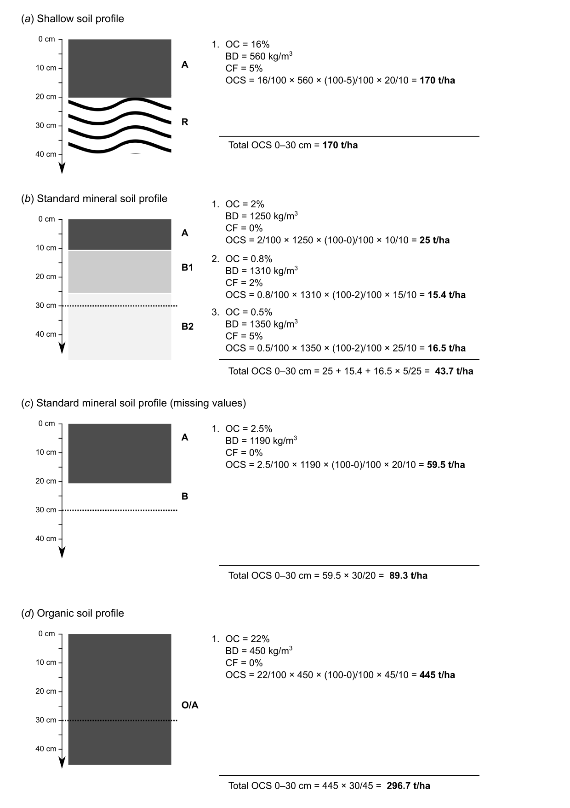
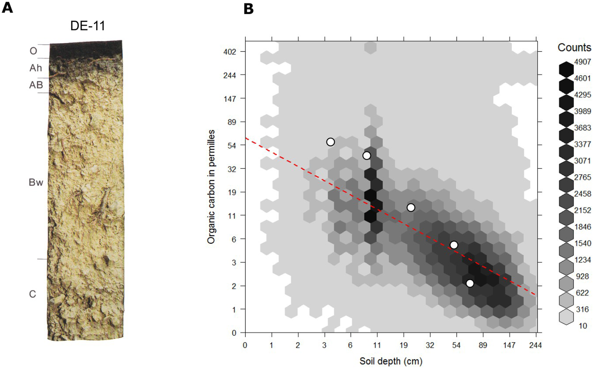
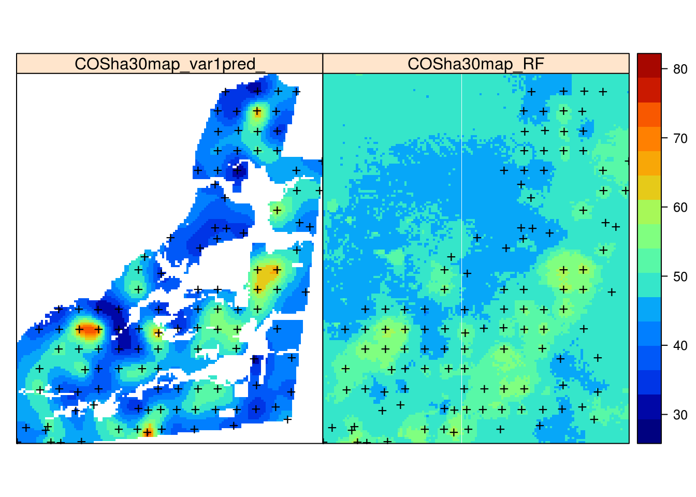
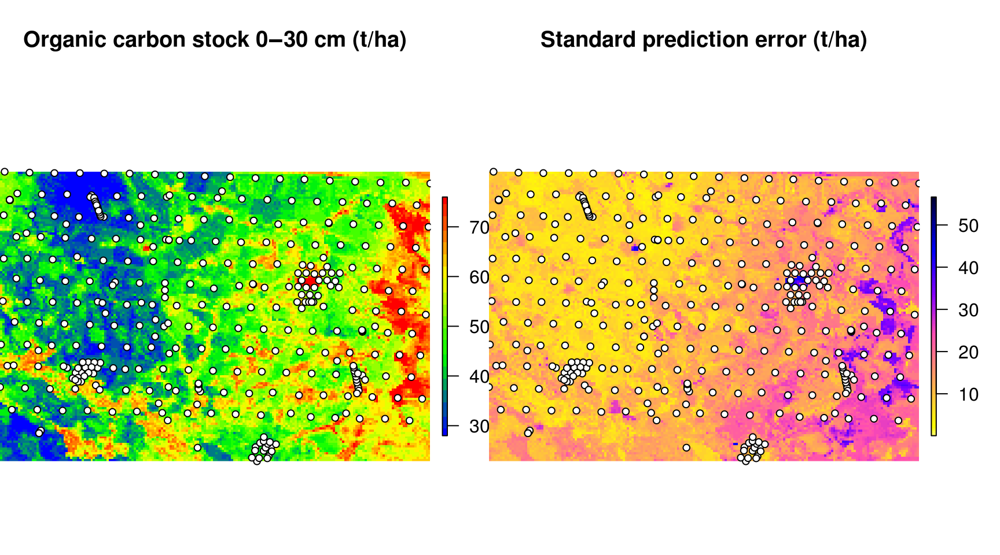
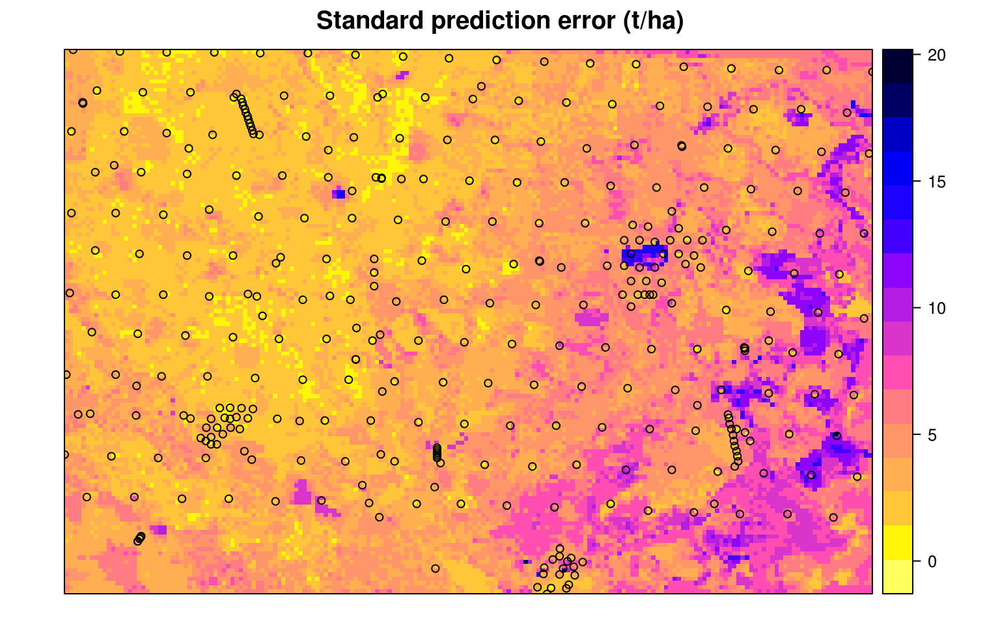
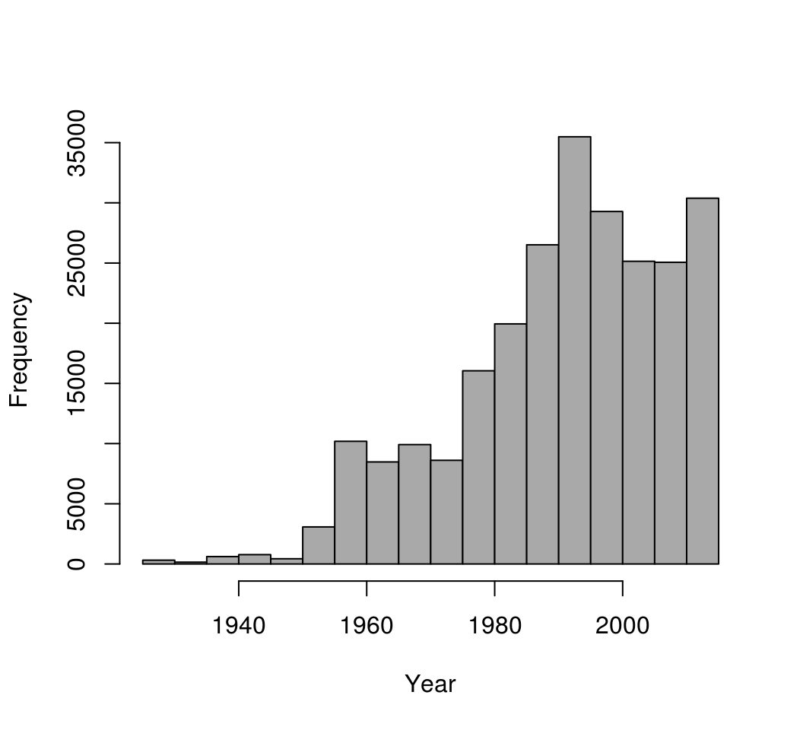
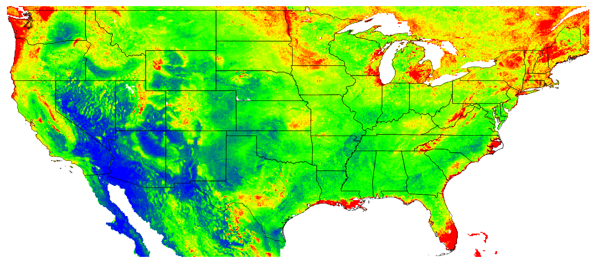
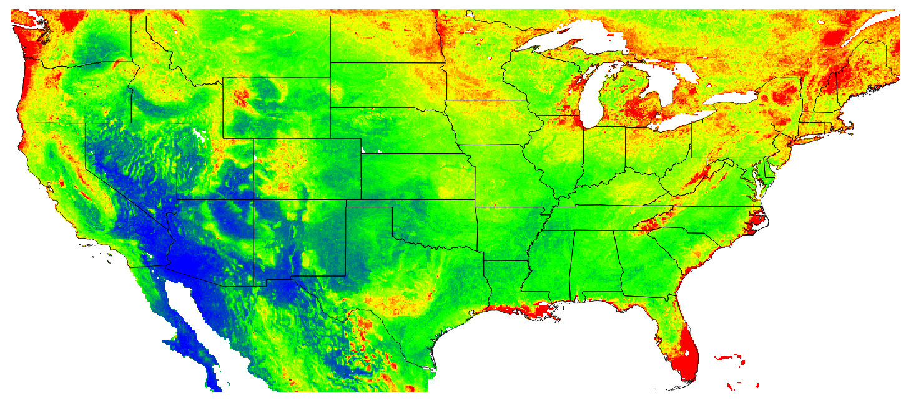

# Spatial prediction and assessment of Soil Organic Carbon {#SOC-chapter}

*Edited by: Hengl T. & Sanderman J.*

## Introduction

This chapter was prepared as supplementary material for the @sanderman2018soil article. It explains how to map Soil Organic Carbon Stocks (OCS) using soil samples (point data). It also demonstrates derivation of values at both the site level (per profile) and by using raster calculus (per pixel). We then illustrate how to estimate total OCS for any area of interest (which can be a field plot, farm and/or administrative region). For an introduction to soil mapping using Machine Learning Algorithms refer to chapter \@ref(soilmapping-using-mla). To access the ISRIC global compilation of soil profiles referenced here please refer to: http://www.isric.org/explore/wosis

## Measurement and derivation of soil organic carbon

Carbon below ground can be organic or non-organic/ mineral (usually carbonates and bicarbonates) i.e. CaCO$_3$ in the rocks. Organic carbon stocks below ground (0–2 m) in terrestrial ecosystems consist of two major components:

1. Living organism biomass i.e. mainly:
  - Plant roots,
  - Microbial biomass [@xu2013global],
2. Plant and animal residues at various stages of decomposition (organic matter).

@xu2013global estimated that total global microbial biomass is about 17 Pg C, which is only about 2% of the total for organic matter. Therefore, the amounts of C in microbial biomass can reasonably be considered negligible, in comparison to the total C stock. However, if one includes all living organisms, and especially tree roots, then the portion of total C found in living organisms could be more significant, especially in areas under dense forests.

Soil Organic Carbon Stock (**OCS**) is the mass of soil organic carbon per standard area and for a specific depth interval, usually expressed in kg/m$^2$ or t/ha. It can be derived using (laboratory and/or field) measurement of soil organic carbon content (ORC; expressed in % or g/kg of <2mm mineral earth), then taking into account bulk density (BLD), thickness of the soil layer, and volume percentage of coarse fragments (CRF) [@Nelson1982; @poeplau2017soil]:

\begin{equation}
{\rm OCS} [{\rm kg/m^2}] = {\rm ORC} [\%] / 100 \cdot {\rm BLD} [{\rm kg/m^3}] \cdot (1- {\rm CRF} [\%]/100) \cdot {\rm HOT} [m]
(\#eq:ocs)
\end{equation}

Note that if one has soil organic carbon content measured in g/kg then one should divide by 1000 instead of 100. A correction for gravel content is necessary because only material less than 2 mm is analyzed for ORC concentration. Ignoring the gravel content can result in an overestimation of the organic carbon stock. Note also that OCS always refers to a specific depth interval or horizon thickness (HOT), e.g.:

* kg/m$^2$ for depth 0–30 cm [@berhongaray2013ipcc],

Values of OCS in kg/m$^2$ can also be expressed in tons/ha units, in which case a simple conversion formula can be applied:

\begin{equation}
1 \cdot {\rm kg/m^2} = 10 \cdot {\rm tons/ha}
(\#eq:kgm2)
\end{equation}

Total OCS for an area of interest can be derived by multiplying OCS by total area e.g.:

\begin{equation}
120 {\rm tons/ha} \cdot 1 {\rm km^2} = 120 \cdot 100 = 12,000 {\rm tons}
(\#eq:tonsha)
\end{equation}

Another way to express soil organic carbon is through **soil organic carbon density** (**OCD** in kg/m$^3$), which is in fact equivalent to OCS divided by the horizon thickness:

\begin{equation}
{\rm OCD} [{\rm kg/m^3}] = {\rm ORC} [\%]/100 \cdot {\rm BLD} [{\rm kg/m^3}] \cdot (1- {\rm CRF} [\%]/100) = {\rm OCS} / {\rm HOT}
(\#eq:ocd)
\end{equation}

While OCS is a summary measure of SOC, always associated with a specific depth interval, OCD is a relative measure of soil organic carbon distribution and can be associated with any support size i.e. to an arbitrary depth. In principle, OCD (kg/m$^3$) is strongly correlated with ORC (g/kg) as indicated in the figure below. However, depending on soil mineralogy and coarse fragment content, OCD can be lower or higher than what the smoothed line indicates (notice the range of values around the smoothed line is relatively wide). It is important to understand, however, that, as long as ORC, BLD and CRF are known, one can convert the values from ORC to OCD and OCS and *vice versa*, without loosing any information about the soil organic carbon stock.

<div class="figure" style="text-align: center">

<p class="caption">(\#fig:carbon-density-plot)Correlation between soil organic carbon density and soil organic carbon content (displayed on a log-scale) created using a global compilations of soil profile data (WoSIS). Values 1, 2, 3, 4, 5 and 6 in the plot (log scale) correspond to values 2, 6, 19, 54, 147 and 402. Note that for ORC >12 percent, the OCD line flattens, which means that, organic carbon density practically stops to increase with the increase of ORC content.</p>
</div>

In summary, there are four main variables used to represent soil organic carbon:

 1.  **Soil Organic Carbon fraction or content** (ORC) in g/kg (permille) or dg/kg (percent),
 2.  **Soil Organic Carbon Density** (OCD) in kg/m$^3$,
 3.  **Soil Organic Carbon Stock** (OCS) in kg/m$^2$ or in tons/ha and for the given soil depth interval,
 4.  **Total Soil Organic Carbon Stock** (TOCS) in million tonnes or Pg i.e. OCS multiplied by surface area,

Global estimates of the total soil organic carbon stock are highly variable
[@Scharlemann2014CM]. Current estimates of the present total soil organic 
carbon stock (excluding peatlands) range between 800–2100 Pg C (for 0–100 cm), 
with a median estimate of about 1500 Pg C (for 0–100 cm). This means that the 
average OCS for the 0–100 cm depth interval for the global land mask 
(148,940,000 km$^2$) is about 11 kg/m$^2$ or 110 tons/ha, and that average 
soil organic carbon density (OCD) is about 11 kg/m$^3$ (compare to the 
standard bulk density of fine earth of 1250 kg/m$^3$); standard OCS for 
0–30 cm depth interval is 7 kg/m$^2$ i.e. the average OCD is about 13 kg/m$^3$. 

\BeginKnitrBlock{rmdnote}<div class="rmdnote">The average Organic Carbon Stock for the 0–100 cm depth interval (mineral soils) is about 11 kg/m$^2$ or 110 tons/ha. The average soil Organic Carbon Density (OCD) is about 11 kg/m$^3$ (compared to the standard bulk density of fine earth of 1250 kg/m$^3$). Standard Organic Carbon Stock for 0–30 cm depth interval is 7 kg/m$^2$ i.e. the average OCD is about 13 kg/m$^3$.</div>\EndKnitrBlock{rmdnote}

The distribution of soil organic carbon in the world is, however, highly patchy with large areas with OCS $\ll 100$ tons/ha, and then some *pockets* of accumulated organic material i.e. organic soil types (histosols) with OCS up to 850tons/ha (for 0–30 cm depth interval). The world's soil organic matter accumulation areas are usually found in the following biomes / land cover classes: wetlands and peatlands, mangroves, tundras and taigas. 

Land use and agriculture, in particular, have led to dramatic decreases in soil carbon stocks in last 200+ years (agricultural and industrial revolutions). @Lal2004Science estimated that approximately 54 Pg C have been added to the atmosphere due to agricultural activities with another 26 Pg C being lost from soils due to erosion. @wei2014global estimated that, on average, conversion from forests to various agricultural land results in a 30–50% decrease in SOCS. Modelling and monitoring of soil organic carbon dynamics is therefore of increasing importance (see e.g. FAO report [“Unlocking the Potential of Soil Organic Carbon”](http://www.fao.org/documents/card/en/c/25eaf720-94e4-4f53-8f50-cdfc2487e1f8/)).

## Derivation of OCS and OCD using soil profile data

As mentioned previously, OCS stock is most commonly derived from measurements of the organic carbon (ORC) content, soil bulk density (BLD) and the volume fraction of gravel (CRF). These are usually sampled either per soil layers or soil **horizons** (a sequence of horizons makes a soil profile), which can refer to variable soil depth intervals i.e. are non-standard. That means that, before one can determine OCS for standard fixed depth intervals (e.g. 0–30 cm or 0–100 cm), values of ORC, BLD and CRF need to be standardized so they refer to common depth intervals.

Consider, for example, the following two real life examples of soil profile data for a standard agricultural soil and an organic soil. For example the [profile from Australia](http://www.asris.csiro.au/mapping/hyperdocs/NatSoil/399%5EEDGEROI%5Eed079.pdf) [@Karssies2011CSIRO], which is shown in Tbl. \@ref(tab:profile-edgeroi). Note the original soil profile description / laboratory data indicates that no BLD were recorded for this profile. In the absence of measured field BLD we can substitute BLD estimated using LandGIS data. It (unfortunately) commonly happens that soil profile observations lack BLD measurements, and consequently BLD needs to be generated using a Pedo-Transfer function or estimated from soil maps.


Table: (\#tab:profile-edgeroi)Laboratory data for a profile 399 EDGEROI ed079 from Australia (Karssies 2011).

 upper_limit   lower_limit   carbon_content   bulk_density   CF   SOCS
------------  ------------  ---------------  -------------  ---  -----
           0            10              8.2           1340    6    1.1
          10            20              7.5           1367    6    1.0
          20            55              6.1           1382    7    3.0
          55            90              3.3           1433    8    1.7
          90           116              1.6           1465    8    0.6

To determine OCS for standard depth intervals 0–30, 0–100 and 0–200 cm, we first fit a mass-preserving spline [@Malone2009Geoderma]:


```r
library(GSIF)
#> GSIF version 0.5-5 (2019-01-04)
#> URL: http://gsif.r-forge.r-project.org/
library(aqp)
#> This is aqp 1.17
#> 
#> Attaching package: 'aqp'
#> The following object is masked from 'package:base':
#> 
#>     union
library(sp)
library(plyr)
library(viridis)
#> Loading required package: viridisLite
lon = 149.73; lat = -30.09; 
id = "399_EDGEROI_ed079"; TIMESTRR = "1987-01-05"
top = c(0, 10, 20, 55, 90) 
bottom = c(10, 20, 55, 90, 116)
ORC = c(8.2, 7.5, 6.1, 3.3, 1.6)
BLD = c(1340, 1367, 1382, 1433, 1465)
CRF = c(6, 6, 7, 8, 8)
#OCS = OCSKGM(ORC, BLD, CRF, HSIZE=bottom-top)
prof1 <- join(data.frame(id, top, bottom, ORC, BLD, CRF), 
               data.frame(id, lon, lat, TIMESTRR), type='inner')
#> Joining by: id
depths(prof1) <- id ~ top + bottom
#> Warning: converting IDs from factor to character
site(prof1) <- ~ lon + lat + TIMESTRR
coordinates(prof1) <- ~ lon + lat
proj4string(prof1) <- CRS("+proj=longlat +datum=WGS84")
ORC.s <- mpspline(prof1, var.name="ORC", d=t(c(0,30,100,200)), vhigh = 2200)
#> Fitting mass preserving splines per profile...
#> 
  |                                                                       
  |                                                                 |   0%
  |                                                                       
  |=================================================================| 100%
BLD.s <- mpspline(prof1, var.name="BLD", d=t(c(0,30,100,200)), vhigh = 2200)
#> Fitting mass preserving splines per profile...
#> 
  |                                                                       
  |                                                                 |   0%
  |                                                                       
  |=================================================================| 100%
CRF.s <- mpspline(prof1, var.name="CRF", d=t(c(0,30,100,200)), vhigh = 2200)
#> Fitting mass preserving splines per profile...
#> 
  |                                                                       
  |                                                                 |   0%
  |                                                                       
  |=================================================================| 100%
```

now we can derive OCS for top-soil by using:


```r
OCSKGM(ORC.s$var.std$`0-30 cm`, 
       BLD.s$var.std$`0-30 cm`, 
       CRF.s$var.std$`0-30 cm`, HSIZE=30)
#> [1] 2.88
#> attr(,"measurementError")
#> [1] 3.84
#> attr(,"units")
#> [1] "kilograms per square-meter"
```

and for sub-soil using:


```r
OCSKGM(ORC.s$var.std$`30-100 cm`, 
       BLD.s$var.std$`30-100 cm`, 
       CRF.s$var.std$`30-100 cm`, HSIZE=70)
#> [1] 3.62
#> attr(,"measurementError")
#> [1] 9.18
#> attr(,"units")
#> [1] "kilograms per square-meter"
```

Note that the OCSKGM function requires soil organic carbon content in g/kg. If one has contents measured in % then first multiply the values by 10. Bulk density data should be provided in kg/m$^3$, gravel content in %, and layer depth in cm. Running the OCSKGM function for the Edgeroi profile gives the following estimates of OCS for standard depth intervals (Fig. \@ref(fig:scheme-soc-prof1)):

*  0–30 cm: 2.9 kg / m-square

*  0–100 cm: 6.5 kg / m-square

*  0–200 cm: 8.5 kg / m-square (85 tonnes / ha)

Values of OCS between 5–35 kg/m$^2$ for 0–100 cm are commonly reported for a variety of mineral soils with e.g. 1–3% of soil organic carbon.

\BeginKnitrBlock{rmdnote}<div class="rmdnote">Organic Carbon Stock for standard depths can be determined from legacy soil profile data either by fitting a spline function to organic carbon, bulk density values, or by aggregating data using simple conversion formulas. A standard mineral soil with 1–3% soil organic carbon for the 0–100 cm depth interval should have about 5–35 kg/m$^2$ or 50–350 tonnes/ha. An organic soil with >30% soil organic carbon may have as much as 60–90 kg/m$^2$ for the 0–100 cm depth interval.</div>\EndKnitrBlock{rmdnote}

The measurement error is computed from default uncertainty values (expressed in standard deviations) for organic carbon (10 g/kg), bulk density (100 kg/m$^3$) and coarse fraction content (5%). When these are not provided by the user, the outcome should be interpreted with care. 

<div class="figure" style="text-align: center">

<p class="caption">(\#fig:scheme-soc-prof1)Determination of soil organic carbon density and stock for standard depth intervals: example of a mineral soil profile from Australia.</p>
</div>

In the second example we look at a profile from Canada (a histosol with >40% of organic carbon; @shaw2005ecosystem) which is shown in Tbl. \@ref(tab:profile-can).


Table: (\#tab:profile-can)Laboratory data for an organic soil profile from Canada  (Shaw, Bhatti, and Sabourin 2005).

 upper_limit   lower_limit   carbon_content   bulk_density   CF   SOCS
------------  ------------  ---------------  -------------  ---  -----
           0            31              472            185    5   25.7
          31            61              492            172    6   23.9
          61            91              487            175    6   24.1
          91           122              502            166    6   24.3
         122           130               59            830    6    3.7

Here also BLD values were not provided and so had to be estimated. To estimate BLD, we use a simple Pedo-Transfer rule e.g. from @kochy2015global:

\begin{equation}
BLD.f = (-0.31 \cdot log(ORC/10) + 1.38) \cdot 1000
(\#eq:bldf)
\end{equation}

We divide the organic carbon content here by 10 to convert the organic carbon content from g/kg to % as required by the PTF. Note that one might want to use different PTFs for different soil layers. For mineral soils the bulk density of subsoil layers is often somewhat higher than for topsoil layers. For organic soils this typically is the inverse. For instance, @kochy2015global propose the following PTF for the subsoil (for layers with SOC > 3%): 

\begin{equation}
BLD = -0.32 * log({\rm ORC}[\%]) + 1.38
(\#eq:kochy)
\end{equation}

which gives slightly lower bulk density values. Another useful source for PTFs for organic soils is work by @hossain2015bulk. For illustrative purposes, we have here used only one PTF for all soil layers. 

We can again fit mass-preserving splines and determine OCS for standard depth intervals by using the functions applied to profile 1. This ultimately gives the following estimates (Fig. \@ref(fig:scheme-soc-prof2)):

*  0–30 cm: 24.8 kg / m-square

*  0–100 cm: 75.3 kg / m-square

*  0–200 cm: 114.5 kg / m-square (1145 tonnes / ha)

<div class="figure" style="text-align: center">

<p class="caption">(\#fig:scheme-soc-prof2)Determination of soil organic carbon density and stock for standard depth intervals: example of an organic soil profile from Canada.</p>
</div>

Only 3–4% of the total soil profiles in the world have organic carbon content above 8% (soils with ORC >12% are classified as organic soils or histosols in USDA and/or WRB classifications and are even less frequent), hence soil-depth functions of organic carbon content and derivation of OCS for organic soils are specific for patches of organic soils. On the other hand, organic soils carry much more total OCS. Precise processing and mapping of organic soils is, therefore, often crucial for accurate estimation of total OCS for large areas. Therefore, it is fairly important to use a good PTF to fill in missing values for BLD for organic soils. As a rule of thumb, organic soil will rarely exhibit a density greater than some minimum value e.g. 120 kg/m$^3$ because even though SOC content can be >50%, bulk density of such soil gets proportionally lower and bulk density is physically bound with how material is organized in soil (unless soils is artificially compacted). Also, using correct estimates for coarse fragments is important as otherwise, if CRF is ignored, total stock will be over-estimated [@poeplau2017soil].

A somewhat more straightforward way to estimate OCS for a list of soil profiles vs spline fitting is:

1. Fill in bulk densities using some PTF or global data,
2. Use information about the depth to bedrock to correct for shallow soils,
3. Use information on CRF to correct stocks for stony / skeletoidal component,
4. Aggregate non-standard horizon depth values using some simple rules (Fig. \@ref(fig:scheme-profiles-ocs)).

<div class="figure" style="text-align: center">

<p class="caption">(\#fig:scheme-profiles-ocs)Estimation of OCS values 0–30 cm using some typical soil profile data without fitting splines.</p>
</div>

## Estimation of Bulk Density using a globally-calibrated PTF

Where values for bulk density are missing, and no local PTF exists, WoSIS points (global compilation of soil profiles) can be used to fit a PTF that can fill-in gaps in bulk density measurements globally. A regression matrix extracted on 15th of May 2017 (and which contains harmonized values for BD, organic carbon content, pH, sand and clay content, depth of horizon and USDA soil type at some 20,000 soil profiles world-wide), can be fitted using a random forest model (see also @ramcharan2017soil):


```r
dfs_tbl = readRDS("extdata/wosis_tbl.rds")
ind.tax = readRDS("extdata/ov_taxousda.rds")
library(ranger)
fm.BLD = as.formula(
  paste("BLD ~ ORCDRC + CLYPPT + SNDPPT + PHIHOX + DEPTH.f +", 
        paste(names(ind.tax), collapse="+")))
m.BLD_PTF <- ranger(fm.BLD, dfs_tbl, num.trees = 85, importance='impurity')
#> Growing trees.. Progress: 95%. Estimated remaining time: 1 seconds.
m.BLD_PTF
#> Ranger result
#> 
#> Call:
#>  ranger(fm.BLD, dfs_tbl, num.trees = 85, importance = "impurity") 
#> 
#> Type:                             Regression 
#> Number of trees:                  85 
#> Sample size:                      98650 
#> Number of independent variables:  70 
#> Mtry:                             8 
#> Target node size:                 5 
#> Variable importance mode:         impurity 
#> Splitrule:                        variance 
#> OOB prediction error (MSE):       32379 
#> R squared (OOB):                  0.549
```

This shows somewhat lower accuracy i.e. an RMSE of ±180 kg/m$^3$ (R squared (OOB) = 0.54), but is still probably preferable to completely excluding all observations without bulk density from SOC assessment. A disadvantage of this model is that, in order to predict BD for new locations, we need to also have measurements of texture fractions, pH and organic carbon of course. For example, an Udalf with 1.1% organic carbon, 22% clay, pH of 6.5, sand content of 35% and at depth of 5 cm would result in an estimate for bulk density of:


```r
ind.tax.new = ind.tax[which(ind.tax$TAXOUSDA84==1)[1],]
predict(m.BLD_PTF, cbind(data.frame(ORCDRC=11, 
                                    CLYPPT=22, 
                                    PHIHOX=6.5, 
                                    SNDPPT=35, 
                                    DEPTH.f=5), ind.tax.new))$predictions
#> [1] 1526
```

Note also that the PTF above needs USDA suborder values per point location following the LandGIS legend for USDA suborders, and formatted as in the `ind.tax` object. Unfortunately, the model above probably over-estimates bulk density for organic soils as these are usually under-represented i.e. often not available (consider for example a Saprist with 32% organic carbon):


```r
ind.tax.new = ind.tax[which(ind.tax$TAXOUSDA13==1)[1],]
predict(m.BLD_PTF, 
        cbind(data.frame(ORCDRC=320, CLYPPT=8, PHIHOX=5.5, 
                         SNDPPT=45, DEPTH.f=10), ind.tax.new))$predictions
#> [1] 773
```

An alternative to estimating BLD is to just use ORC values, e.g. (see plot below):


```r
m.BLD_ls = loess(BLD ~ ORCDRC, dfs_tbl, span=1/18)
predict(m.BLD_ls, data.frame(ORCDRC=320))
#>   1 
#> 664
```

This gives about 30% lower value than the random forest-based PTF from above. Over-estimating BLD will always result in higher OCS, hence clearly accurate information on BLD can be crucial for any OCS monitoring project. This means that the PTF fitted using random forest above is likely over-estimating BLD values for organic soils, mainly because there are not enough training points in organic soils that have measurements data for all of ORC, BLD, soil pH and texture fractions (if ANY of the calibration measurements are missing, the whole horizons are taken out of calibration and hence different ranges of BLD could be completely misrepresented).

\BeginKnitrBlock{rmdnote}<div class="rmdnote">Soil Bulk density (BLD) is an important soil property that is required to estimate stocks of nutrients especially soil organic carbon. Measurements of BLD are often not available and need to be estimated using some PTF or similar. Most PTF's for BLD are based on correlating BLD with soil organic carbon, clay and sand content, pH, soil type and climate zone.</div>\EndKnitrBlock{rmdnote}

<div class="figure" style="text-align: center">

<p class="caption">(\#fig:plot-bld-soc)Correlation plot between soil organic carbon density and bulk density (fine earth), created using the global compilations of soil profile data (http://www.isric.org/content/wosis-data-sets). Black line indicates fitted loess polynomial surface (stats::loess). There is still quite some scatter around the fitted line: many combinations of BLD and ORC, that do not fall close to the correlation line, can still be observed.</p>
</div>

To fill-in missing values for BLD, a combination of two global Pedo-Transfer functions can be used for example: (1) PTF fitted using random forest model that locally predicts BLD as a function of organic carbon content, clay and sand content, pH and coarse fragments, and (2) a simpler model that predicts BLD based on only ORC. The average RMSE of these PTFs for BLD is about ±150 kg/m$^3$.

For mineral soils the relationship between soil organic carbon and soil depth follows a log-log relationship which can be also approximated with the following (global) model (R-square: 0.36; see Fig. \@ref(fig:soc-depth-plot)):

\begin{equation}
ORC (depth) = exp[ 4.1517 −0.60934 \cdot log(depth) ]
(\#eq:orc-depth)
\end{equation}

This also illustrates that any organic carbon spatial prediction model can significantly profit from including depth in the statistical modelling.

<div class="figure" style="text-align: center">

<p class="caption">(\#fig:soc-depth-plot)Globally fitted regression model for predicting soil organic carbon using depth only (log-log regression) and (a) individual soil profile from the ISRIC soil monolith collection. Image source: Hengl et al. (2014) doi: 10.1371/journal.pone.0105992.</p>
</div>

In summary, PTFs can be used to efficiently estimate missing BLD values (BLD is usually highly correlated with organic carbon content and depth, texture fractions, soil classification and soil pH can also help improve accuracy of the PTFs). However, for organic soils there is, in general, less calibration data and therefore errors are potentially higher. Mistakes in estimating BLD can result in systematic and significant over/under-estimations of the actual carbon stock. On the other hand, removing all soil horizons from OCS assessment that lack BLD measurements leads also to reduced accuracy as fewer points are then available for training of the spatial prediction models. Especially for organic soils (>12% organic carbon), there is no easy solution for estimating missing values for BLD. Collecting additional (local) calibration points might become unavoidable. @lobsey2016sensing recently proposed a method that combines gamma-ray attenuation and visible–near infrared (vis–NIR) spectroscopy to measure bulk density *ex situ* using samples that are freshly collected under wet field conditions. Hopefully unreliable, or missing, BLD measurements will become less of a problem in the future.

##  Generating maps of OCS

Most projects focused on monitoring OCS require an estimate of OCS to be provided for the entire area of interest, so that users can visually explore spatial patterns of OCS. In this tutorial we demonstrate how to generate maps of OCS using point samples and RS based covariates. The output of this process is usually a gridded map (`SpatialPixelsDataFrame`) covering the entire area of interest (plot, farm, administrative unit or similar). Once OCS is mapped, we can multiply OCS densities by the area of each pixel and summing up all numbers we can compute the total OCS in total tonnes using the formula above. Predicted OCS values can also be aggregated per land cover class or similar. If a series of OCS maps is produced for the same area of interest (time-series of OCS), these can then be used to derive OCS change through time per pixel.

In principle, there are three main approaches to estimating total OCS for an area of interest (Fig. \@ref(fig:ocs-three-approaches)):

*  By directly predicting OCS, here called the **the 2D approach to OCS mapping** (this often requires vertical aggregation / modeling of soil variable depth curves as indicated above),

*  By predicting ORC, BLD and CRF, and then deriving OCS per layer, here called **the 3D approach to OCS mapping with ORC, BLD and CRF mapped separately**,

*  By deriving OCD (organic carbon density) and then directly predicting OCD and converting it to OCS, here called **the 3D approach to OCS mapping via direct modeling of OCD**,

\BeginKnitrBlock{rmdnote}<div class="rmdnote">Soil Organic Carbon stock can be mapped by using at least three different approaches: (1) the 2D approach where estimation of OCS is done at the site level, (2) the 3D approach where soil organic carbon content, bulk density and coarse fragments are mapped separately, then used to derive OCS for standard depths at each grid cell, and (3) the 3D approach based on mapping Organic Carbon Density, then converting to stocks.</div>\EndKnitrBlock{rmdnote}

<div class="figure" style="text-align: center">

<p class="caption">(\#fig:ocs-three-approaches)Three main computational paths (2D and 3D) to producing maps of organic carbon stock.</p>
</div>

Although 2D prediction of OCS from point data seems to be more straightforward, many soil profiles contain measurements at non-standard depth intervals (varying support sizes also) and therefore 2D modeling of OCS can often be a cumbersome. In most situations where legacy soil profile data are used, 3D modeling of OCD is probably the most elegant solution to mapping OCS because:

*  No vertical aggregation of values via spline fitting or similar is needed to standardize values per standard depths,

*  No additional uncertainty is introduced (in the case of the 2D approach splines likely introduce some extra uncertainty in the model),

*  Predictions of OCD/OCS can be generated for any depth interval using the same model (i.e. predictions are based on a single 3D model),

A disadvantage of doing 3D modeling of OCD is, however, that correlation with covariate layers could be less clear than if separate models are built for ORC, BLD and CRF. Because OCD is a composite variable, it can often be difficult to distinguish whether the values are lower or higher due to differences in ORC, BLD or CRF. We leave it to users to compare various approaches to OCS mapping and then select the method that achieves the best accuracy and/or is most suitable for use for their applications.

## Predicting OCS from point data (the 2D approach)

The [geospt package](https://cran.r-project.org/package=geospt) contains 125 samples of OCS from Colombia already at standard depth intervals, hence this data set is suitable and ready for 2D mapping of OCS. The data set consists of tabular values for points and a raster map containing the borders of the study area:


```r
load("extdata/COSha10.rda")
load("extdata/COSha30.rda")
str(COSha30)
#> 'data.frame':	118 obs. of  10 variables:
#>  $ ID        : Factor w/ 118 levels "S1","S10","S100",..: 1 44 61 89 100 110 2 9 15 21 ...
#>  $ x         : int  669030 669330 670292 669709 671321 670881 670548 671340 671082 670862 ...
#>  $ y         : int  448722 448734 448697 448952 448700 448699 448700 448969 448966 448968 ...
#>  $ DA30      : num  1.65 1.6 1.5 1.32 1.41 1.39 1.51 1.39 1.55 1.63 ...
#>  $ CO30      : num  0.99 1.33 1.33 1.09 1.04 1.19 1.21 1.36 1.09 1.19 ...
#>  $ COB1r     : Factor w/ 6 levels "Az","Ci","Cpf",..: 5 5 2 5 2 5 2 2 2 5 ...
#>  $ S_UDS     : Factor w/ 19 levels "BJa1","BQa1",..: 12 5 12 5 11 12 12 12 12 12 ...
#>  $ COSha30   : num  49.2 64 59.8 43.1 44.2 ...
#>  $ Cor4DAidep: num  43.3 56.3 54 37.9 39.9 ...
#>  $ CorT      : num  1.37 1.39 1.38 1.36 1.36 ...
```

where `COSha10` = 0–10 cm, `COSha30` = 0–30 cm in tons / ha are values for OCS aggregated to standard soil depth intervals, so there is no need to do any spline fitting and/or vertical aggregation. We can also load the raster map for the area by using (Fig. \@ref(fig:libertad-soc)):


```r
load("extdata/COSha30map.rda")
proj4string(COSha30map) = "+proj=utm +zone=18 +ellps=WGS84 +datum=WGS84 +units=m +no_defs"
str(COSha30map@data)
#> 'data.frame':	10000 obs. of  2 variables:
#>  $ var1.pred: num  39.9 39.8 39.9 40.3 40.7 ...
#>  $ var1.var : num  1.91e-05 6.39e-05 1.05e-04 1.39e-04 1.66e-04 ...
```

which shows predictions and kriging variances for `COSha30`.

<div class="figure" style="text-align: center">

<p class="caption">(\#fig:libertad-soc)Example of a data set with OCS samples (for 2D prediction). Case study in Colombia available via the geospt package (https://cran.r-project.org/package=geospt).</p>
</div>

We can import a number of RS-based covariates into R by (these were derived from the global 30 m layers listed previously):


```r
covs30m = readRDS("extdata/covs30m.rds")
proj4string(covs30m) = proj4string(COSha30map)
names(covs30m)
#>  [1] "SRTMGL1_SRTMGL1.2_cprof"                  
#>  [2] "SRTMGL1_SRTMGL1.2_devmean"                
#>  [3] "SRTMGL1_SRTMGL1.2_openn"                  
#>  [4] "SRTMGL1_SRTMGL1.2_openp"                  
#>  [5] "SRTMGL1_SRTMGL1.2_slope"                  
#>  [6] "SRTMGL1_SRTMGL1.2_twi"                    
#>  [7] "SRTMGL1_SRTMGL1.2_vbf"                    
#>  [8] "SRTMGL1_SRTMGL1.2_vdepth"                 
#>  [9] "SRTMGL1_SRTMGL1.2"                        
#> [10] "COSha30map_var1pred_"                     
#> [11] "GlobalForestChange2000.2014_first_NIRL00" 
#> [12] "GlobalForestChange2000.2014_first_REDL00" 
#> [13] "GlobalForestChange2000.2014_first_SW1L00" 
#> [14] "GlobalForestChange2000.2014_first_SW2L00" 
#> [15] "GlobalForestChange2000.2014_treecover2000"
#> [16] "GlobalSurfaceWater_extent"                
#> [17] "GlobalSurfaceWater_occurrence"            
#> [18] "Landsat_bare2010"
```

This contains a number of covariates from SRTM DEM derivatives, to Global Surface Water occurrence values and similar (see section \@ref(soil-covs-30m) for more details). All these could potentially prove useful for mapping OCS. We can also derive buffer distances from observations points and use these (as measures of spatial context) to improve predictions [@Hengl2018RFsp]:


```r
proj4string(COSha30map) = "+proj=utm +zone=18 +ellps=WGS84 +datum=WGS84 +units=m +no_defs"
coordinates(COSha30) = ~ x+y
proj4string(COSha30) = proj4string(COSha30map)
covs30mdist = GSIF::buffer.dist(COSha30["COSha30"], covs30m[1],
                                as.factor(1:nrow(COSha30)))
```

We can convert the original covariates to Principal Components, also to fill in all missing pixels:


```r
covs30m@data = cbind(covs30m@data, covs30mdist@data)
sel.rm = c("GlobalSurfaceWater_occurrence", "GlobalSurfaceWater_extent",
           "Landsat_bare2010", "COSha30map_var1pred_")
rr = which(names(covs30m@data) %in% sel.rm)
fm.spc = as.formula(paste(" ~ ", paste(names(covs30m)[-rr], collapse = "+")))
proj4string(covs30m) = proj4string(COSha30)
covs30m.spc = GSIF::spc(covs30m, fm.spc)
#> Converting covariates to principal components...
ov.COSha30 = cbind(as.data.frame(COSha30), over(COSha30, covs30m.spc@predicted))
```

By using the above listed covariates, we can fit a spatial prediction 2D model using an available model, such as [ranger](https://cran.r-project.org/package=ranger) [@wright2017ranger], [xgboost](https://cran.r-project.org/package=xgboost) and/or [gamboost](https://cran.r-project.org/package=GAMBoost): 


```r
library(caret)
#> Loading required package: lattice
#> Loading required package: ggplot2
library(ranger)
fm.COSha30 = as.formula(paste("COSha30 ~ ",
                              paste(names(covs30m.spc@predicted), collapse = "+")))
fm.COSha30
#> COSha30 ~ PC1 + PC2 + PC3 + PC4 + PC5 + PC6 + PC7 + PC8 + PC9 + 
#>     PC10 + PC11 + PC12 + PC13 + PC14 + PC15 + PC16 + PC17 + PC18 + 
#>     PC19 + PC20 + PC21 + PC22 + PC23 + PC24 + PC25 + PC26 + PC27 + 
#>     PC28 + PC29 + PC30 + PC31 + PC32 + PC33 + PC34 + PC35 + PC36 + 
#>     PC37 + PC38 + PC39 + PC40 + PC41 + PC42 + PC43 + PC44 + PC45 + 
#>     PC46 + PC47 + PC48 + PC49 + PC50 + PC51 + PC52 + PC53 + PC54 + 
#>     PC55 + PC56 + PC57 + PC58 + PC59 + PC60 + PC61 + PC62 + PC63 + 
#>     PC64 + PC65 + PC66 + PC67 + PC68 + PC69 + PC70 + PC71 + PC72 + 
#>     PC73 + PC74 + PC75 + PC76 + PC77 + PC78 + PC79 + PC80 + PC81 + 
#>     PC82 + PC83 + PC84 + PC85 + PC86 + PC87 + PC88 + PC89 + PC90 + 
#>     PC91 + PC92 + PC93 + PC94 + PC95 + PC96 + PC97 + PC98 + PC99 + 
#>     PC100 + PC101 + PC102 + PC103 + PC104 + PC105 + PC106 + PC107 + 
#>     PC108 + PC109 + PC110 + PC111 + PC112 + PC113 + PC114 + PC115 + 
#>     PC116 + PC117 + PC118 + PC119 + PC120 + PC121 + PC122 + PC123 + 
#>     PC124 + PC125 + PC126 + PC127 + PC128 + PC129 + PC130 + PC131 + 
#>     PC132
rf.tuneGrid <- expand.grid(.mtry = seq(2, 60, by=5),
                           .splitrule = "maxstat",
                           .min.node.size = c(10, 20))
gb.tuneGrid <- expand.grid(eta = c(0.3,0.4), 
                           nrounds = c(50,100), 
                           max_depth = 2:3, gamma = 0, 
                           colsample_bytree = 0.8, 
                           min_child_weight = 1, subsample=1)
fitControl <- trainControl(method="repeatedcv", number=4, repeats=1)
mFit1 <- train(fm.COSha30, data=ov.COSha30, method="ranger", 
               trControl=fitControl, importance='impurity', 
               tuneGrid=rf.tuneGrid)
mFit1
#> Random Forest 
#> 
#> 118 samples
#> 132 predictors
#> 
#> No pre-processing
#> Resampling: Cross-Validated (4 fold, repeated 1 times) 
#> Summary of sample sizes: 87, 88, 89, 90 
#> Resampling results across tuning parameters:
#> 
#>   mtry  min.node.size  RMSE  Rsquared  MAE 
#>    2    10             11.0  0.0225    8.75
#>    2    20             11.0  0.0450    8.69
#>    7    10             11.0  0.0442    8.66
#>    7    20             11.0  0.0442    8.68
#>   12    10             11.0  0.0608    8.61
#>   12    20             10.9  0.0588    8.62
#>   17    10             11.0  0.0519    8.65
#>   17    20             11.0  0.0583    8.60
#>   22    10             10.9  0.0684    8.59
#>   22    20             10.9  0.0699    8.59
#>   27    10             10.9  0.0710    8.57
#>   27    20             10.9  0.0737    8.57
#>   32    10             10.9  0.0836    8.55
#>   32    20             10.9  0.0836    8.56
#>   37    10             10.9  0.0887    8.63
#>   37    20             10.9  0.0739    8.57
#>   42    10             10.9  0.0606    8.64
#>   42    20             10.8  0.0930    8.50
#>   47    10             10.9  0.0731    8.58
#>   47    20             10.9  0.0753    8.60
#>   52    10             10.9  0.0848    8.55
#>   52    20             10.9  0.0849    8.53
#>   57    10             10.9  0.0748    8.61
#>   57    20             10.9  0.0772    8.61
#> 
#> Tuning parameter 'splitrule' was held constant at a value of maxstat
#> RMSE was used to select the optimal model using the smallest value.
#> The final values used for the model were mtry = 42, splitrule =
#>  maxstat and min.node.size = 20.
mFit2 <- train(fm.COSha30, data=ov.COSha30, method="xgbTree", 
               trControl=fitControl, tuneGrid=gb.tuneGrid)
mFit2
#> eXtreme Gradient Boosting 
#> 
#> 118 samples
#> 132 predictors
#> 
#> No pre-processing
#> Resampling: Cross-Validated (4 fold, repeated 1 times) 
#> Summary of sample sizes: 87, 89, 89, 89 
#> Resampling results across tuning parameters:
#> 
#>   eta  max_depth  nrounds  RMSE  Rsquared  MAE 
#>   0.3  2           50      11.9  0.0547    9.20
#>   0.3  2          100      11.9  0.0558    9.22
#>   0.3  3           50      11.6  0.0305    9.14
#>   0.3  3          100      11.6  0.0305    9.14
#>   0.4  2           50      12.0  0.0443    9.60
#>   0.4  2          100      12.0  0.0439    9.60
#>   0.4  3           50      11.5  0.0776    9.19
#>   0.4  3          100      11.5  0.0777    9.19
#> 
#> Tuning parameter 'gamma' was held constant at a value of 0
#>  0.8
#> Tuning parameter 'min_child_weight' was held constant at a value of
#>  1
#> Tuning parameter 'subsample' was held constant at a value of 1
#> RMSE was used to select the optimal model using the smallest value.
#> The final values used for the model were nrounds = 100, max_depth = 3,
#>  eta = 0.4, gamma = 0, colsample_bytree = 0.8, min_child_weight = 1
#>  and subsample = 1.
```

This example illustrates that no significant spatial prediction models (with an R-square exceeding 10%) can be fitted using these data. It is very common in soil mapping projects for models to explain only low amounts of the total variation, resulting in large average errors of prediction and/or wide prediction intervals. This can occur because of high measurement errors, and/or because there are missing covariates, but it could also happen because the natural complexity of soils in the area is simply high.

Note that the absolute values of our predictions of OCS are somewhat different than those produced by the [geospt package](https://cran.r-project.org/package=geospt) authors, although the main patterns are comparable.

<div class="figure" style="text-align: center">

<p class="caption">(\#fig:plot-cosha30map-rf)Comparison of predictions generated using ordinary kriging (left) and machine learning with the help of 30 m resolution covariates and buffer distances (right).</p>
</div>

We can compare the difference between mean predicted OCS and measured OCS:


```r
mean(COSha30.pr$COSha30map_RF, na.rm=TRUE); mean(COSha30$COSha30, na.rm=TRUE)
#> [1] 48.6
#> [1] 50.6
## 48 tonnes/ha vs 51 tonnes / ha
```

and derive the total SOC in tonnes:


```r
sum(COSha30.pr$COSha30map_RF*30^2/1e4, na.rm=TRUE)
#> [1] 102089
```

## Deriving OCS from soil profile data (the 3D approach) {#ocs-3d-approach}

In the following example, we will demonstrate, using a well known data set, ([Edgeroi](http://gsif.r-forge.r-project.org/edgeroi.html), from Australia) which has been well documented in the literature [@Malone2009Geoderma], how to derive OCS in t/ha using soil profile data and a 3D approach to spatial prediction based on mapping the Organic Carbon Density (OCD) in kg/m-cubic. The Edgeroi data set is a typical example of a soil profile data set that is relatively comprehensive, but still missing BLD measurements. 

<div class="figure" style="text-align: center">

<p class="caption">(\#fig:edgeroi-overview)Edgeroi data set: locations of soil profiles and Australian soil classification codes. For more details see Malone et al. (2009).</p>
</div>

The Edgeroi data set can be loaded from the GSIF package:


```r
library(GSIF)
data(edgeroi)
edgeroi.sp = edgeroi$sites
coordinates(edgeroi.sp) <- ~ LONGDA94 + LATGDA94
proj4string(edgeroi.sp) <- CRS("+proj=longlat +ellps=GRS80 +towgs84=0,0,0,0,0,0,0 +no_defs")
edgeroi.sp <- spTransform(edgeroi.sp, CRS("+init=epsg:28355"))
```

This data set comes with a list of covariate layers which can be used to model the distribution of soil organic carbon:


```r
load("extdata/edgeroi.grids.rda")
gridded(edgeroi.grids) <- ~x+y
proj4string(edgeroi.grids) <- CRS("+init=epsg:28355")
names(edgeroi.grids)
#> [1] "DEMSRT5" "TWISRT5" "PMTGEO5" "EV1MOD5" "EV2MOD5" "EV3MOD5"
```

Because some of the covariate layers are factors e.g. `PMTGEO5` (parent material map) and because random forest requires numeric covariates, we can convert factors to numeric PCs by using: 


```r
edgeroi.spc = spc(edgeroi.grids, ~DEMSRT5+TWISRT5+PMTGEO5+EV1MOD5+EV2MOD5+EV3MOD5)
#> Converting PMTGEO5 to indicators...
#> Converting covariates to principal components...
```

The Edgeroi completely lacks any BLD values, therefore before we can compute OCD values, we need to estimate BLD values for each corresponding horizon. Here the easiest option is probably to use BLD values sourced from LandGIS predictions (and which you can download from https://landgis.opengeohub.org). 


```r
landgis.bld = list.files("/mnt/DATA/LandGIS/predicted250m", 
                     pattern=glob2rx("sol_bulkdens.fineearth_usda.4a1h_m_*.tif$"),
                     full.names=TRUE)
for(j in 1:length(landgis.bld)){
  system(paste0('gdalwarp ', landgis.bld[j], ' extdata/edgeroi_',
                basename(landgis.bld[j]), ' -t_srs \"', proj4string(edgeroi.grids), 
                '\" -tr 250 250 -co \"COMPRESS=DEFLATE\"', 
                ' -te ', paste(as.vector(edgeroi.grids@bbox), collapse = " ")))
}
```

Matching between the irregularly distributed soil horizons and LandGIS bulk density at standard depths can be implemented in three steps. First, we overlay the points and LandGIS GeoTIFFs to get the BLD values in kg / cubic-m at standard depths:


```r
sg <- list.files("extdata", "edgeroi_sol_bulkdens.fineearth", full.names = TRUE)
ov <- as.data.frame(raster::extract(stack(sg), edgeroi.sp)*10)
ov.edgeroi.BLD = ov[,c(grep("b0..", names(ov),
                            fixed = TRUE), grep("b10..", names(ov), fixed = TRUE), 
                       grep("b30..", names(ov), 
                            fixed = TRUE), grep("b60..", names(ov), fixed = TRUE), 
                       grep("b100..", names(ov), 
                            fixed = TRUE), grep("b200..", names(ov), fixed = TRUE))]
```

Second, we derive averaged estimates of BLD for standard depth intervals:


```r
ov.edgeroi.BLDm  <- data.frame(BLD.f = as.vector(sapply(2:ncol(ov.edgeroi.BLD),
                            function(i){rowMeans(ov.edgeroi.BLD[,c(i-1,i)])})),
                    DEPTH.c = as.vector(sapply(1:5, function(i){rep(paste0("sd",i),
                        nrow(edgeroi$sites))})), SOURCEID = rep(edgeroi$sites$SOURCEID, 5))
str(ov.edgeroi.BLDm)
#> 'data.frame':	1795 obs. of  3 variables:
#>  $ BLD.f   : num  1370 1335 1310 1500 1490 ...
#>  $ DEPTH.c : Factor w/ 5 levels "sd1","sd2","sd3",..: 1 1 1 1 1 1 1 1 1 1 ...
#>  $ SOURCEID: Factor w/ 359 levels "199_CAN_CP111_1",..: 1 2 3 4 5 6 7 8 9 10 ...
```

Third, we match BLD values by matching horizon depths (center of horizon) with the standard depth intervals `sd1` to `sd5`:


```r
edgeroi$horizons$DEPTH = edgeroi$horizons$UHDICM +
  (edgeroi$horizons$LHDICM - edgeroi$horizons$UHDICM)/2
edgeroi$horizons$DEPTH.c = cut(edgeroi$horizons$DEPTH, include.lowest = TRUE,
                              breaks = c(0,10,30,60,100,1000), labels = paste0("sd",1:5))
summary(edgeroi$horizons$DEPTH.c)
#> sd1 sd2 sd3 sd4 sd5 
#> 391 379 408 391 769
edgeroi$horizons$BLD.f = plyr::join(edgeroi$horizons[,c("SOURCEID","DEPTH.c")],
                                    ov.edgeroi.BLDm)$BLD.f
#> Joining by: SOURCEID, DEPTH.c
```

which shows relatively equal distribution of soil horizons within the standard depths. 
Now that we have a rough estimate of the bulk density for all horizons, we can derive OCD in kg/m-cubic by using:


```r
edgeroi$horizons$OCD = edgeroi$horizons$ORCDRC/1000 * edgeroi$horizons$BLD.f
summary(edgeroi$horizons$OCD)
#>    Min. 1st Qu.  Median    Mean 3rd Qu.    Max.    NA's 
#>     0.1     2.4     7.2     9.5    13.2   124.9     262
```

This shows that OCD values range from 0–110 kg/m-cubic, with an average of 9.5 kg/m-cubic (this corresponds to an average organic carbon content of about 0.8%).

For further 3D spatial prediction of OCD we use the ranger package, which fits a random forest model to this 3D data. We start by overlaying points and rasters so that we can create a regression matrix:


```r
ov2 <- over(edgeroi.sp, edgeroi.spc@predicted)
ov2$SOURCEID = edgeroi.sp$SOURCEID
h2 = hor2xyd(edgeroi$horizons)
m2 <- plyr::join_all(dfs = list(edgeroi$sites, h2, ov2))
#> Joining by: SOURCEID
#> Joining by: SOURCEID
```

The spatial prediction model can be fitted using:


```r
fm.OCD = as.formula(paste0("OCD ~ DEPTH + ", paste(names(edgeroi.spc@predicted), 
                                                   collapse = "+")))
fm.OCD
#> OCD ~ DEPTH + PC1 + PC2 + PC3 + PC4 + PC5 + PC6 + PC7 + PC8 + 
#>     PC9 + PC10 + PC11 + PC12
m.OCD <- ranger(fm.OCD, m2[complete.cases(m2[,all.vars(fm.OCD)]),], 
                quantreg = TRUE, importance = "impurity")
m.OCD
#> Ranger result
#> 
#> Call:
#>  ranger(fm.OCD, m2[complete.cases(m2[, all.vars(fm.OCD)]), ],      quantreg = TRUE, importance = "impurity") 
#> 
#> Type:                             Regression 
#> Number of trees:                  500 
#> Sample size:                      4972 
#> Number of independent variables:  13 
#> Mtry:                             3 
#> Target node size:                 5 
#> Variable importance mode:         impurity 
#> Splitrule:                        variance 
#> OOB prediction error (MSE):       18.4 
#> R squared (OOB):                  0.697
```

Which shows that the average error with Out-of-bag training points is ±4.2 kg/m-cubic. Note that setting `quantreg = TRUE` allows us to derive also a map of the prediction errors (Fig. \@ref(fig:plot-edgeroi-ocd)), following the method of @meinshausen2006quantile. 

To derive OCS in tons/ha we can compute OCD at two depths (0 and 30 cm) and then take the mean value to produce a more representative value:


```r
for(i in c(0,30)){
   edgeroi.spc@predicted$DEPTH = i
   OCD.rf <- predict(m.OCD, edgeroi.spc@predicted@data)
   nm1 = paste0("OCD.", i, "cm")
   edgeroi.grids@data[,nm1] = OCD.rf$predictions
   OCD.qrf <- predict(m.OCD, edgeroi.spc@predicted@data, 
                      type="quantiles", quantiles=c((1-.682)/2, 1-(1-.682)/2))
   nm2 = paste0("OCD.", i, "cm_se")
   edgeroi.grids@data[,nm2] = (OCD.qrf$predictions[,2] - OCD.qrf$predictions[,1])/2
}
```

so that the final Organic carbon stocks in t/ha is:


```
#>    Min. 1st Qu.  Median    Mean 3rd Qu.    Max. 
#>    20.3    39.1    48.0    48.8    57.6   112.1
```

<div class="figure" style="text-align: center">

<p class="caption">(\#fig:plot-edgeroi-ocd)Predicted organic carbon stock for 0–30 cm depth for the Edgeroi data set. All values expressed in tons/ha.</p>
</div>

<div class="figure" style="text-align: center">

<p class="caption">(\#fig:plot-edgeroi-ocd-error)The prediction error map for the Edgeroi data set.</p>
</div>

Note that deriving the error map in the ranger package can be computationally intensive, especially if the number of covariates is high, and is therefore not yet recommended for large rasters.

Next, we can derive the total soil organic carbon stock per [land use class](http://data.environment.nsw.gov.au/dataset/nsw-landuseac11c) (2007). For this we can use the aggregation function from the plyr package:


```r
library(rgdal)
#> rgdal: version: 1.3-6, (SVN revision 773)
#>  Geospatial Data Abstraction Library extensions to R successfully loaded
#>  Loaded GDAL runtime: GDAL 2.2.2, released 2017/09/15
#>  Path to GDAL shared files: /usr/share/gdal/2.2
#>  GDAL binary built with GEOS: TRUE 
#>  Loaded PROJ.4 runtime: Rel. 4.8.0, 6 March 2012, [PJ_VERSION: 480]
#>  Path to PROJ.4 shared files: (autodetected)
#>  Linking to sp version: 1.3-1
edgeroi.grids$LandUse = readGDAL("extdata/edgeroi_LandUse.sdat")$band1
#> extdata/edgeroi_LandUse.sdat has GDAL driver SAGA 
#> and has 128 rows and 190 columns
lu.leg = read.csv("extdata/LandUse.csv")
edgeroi.grids$LandUseClass = paste(join(data.frame(LandUse=edgeroi.grids$LandUse), 
                                        lu.leg, match="first")$LU_NSWDeta)
#> Joining by: LandUse
OCS_agg.lu <- plyr::ddply(edgeroi.grids@data, .(LandUseClass), summarize,
                          Total_OCS_kt=round(sum(OCS.30cm*250^2/1e4, na.rm=TRUE)/1e3),
                          Area_km2=round(sum(!is.na(OCS.30cm))*250^2/1e6))
OCS_agg.lu$LandUseClass.f = strtrim(OCS_agg.lu$LandUseClass, 34)
OCS_agg.lu$OCH_t_ha_M = round(OCS_agg.lu$Total_OCS_kt*1000/(OCS_agg.lu$Area_km2*100))
OCS_agg.lu[OCS_agg.lu$Area_km2>5,c("LandUseClass.f","Total_OCS_kt",
                                   "Area_km2","OCH_t_ha_M")]
#>                        LandUseClass.f Total_OCS_kt Area_km2 OCH_t_ha_M
#> 2  Constructed grass waterway for wat           57       11         52
#> 3                              Cotton           43        8         54
#> 4                  Cotton - irrigated          808      203         40
#> 5   Cropping - continuous or rotation         1803      402         45
#> 6  Cropping - continuous or rotation           234       59         40
#> 10                           Farm dam           55       10         55
#> 11 Farm Infrastructure - house, machi           91       18         51
#> 12 Grazing - Residual strips (block o           49       10         49
#> 13 Grazing of native vegetation. Graz          688      129         53
#> 14 Grazing of native vegetation. Graz           65       13         50
#> 16                     Irrigation dam           63       16         39
#> 21                      Native forest          229       37         62
#> 26                  Research facility           40        9         44
#> 27 River, creek or other incised drai           70       11         64
#> 28               Road or road reserve          118       23         51
#> 29                       State forest          425       83         51
#> 32 Volunteer, naturalised, native or          1411      238         59
#> 33 Volunteer, naturalised, native or            62       16         39
#> 34 Volunteer, naturalised, native or            77       14         55
#> 35 Volunteer, naturalised, native or           475       99         48
#> 37 Wide road reserve or TSR, with som          467       90         52
```

Which shows that, for the `Cropping - continuous or rotation`, which is the dominant land use class in the area, the average OCS is 43 tons/ha for the 0–30 cm depth. In this case, the total soil organic carbon stock for the whole area (for all land use classes) is ca 7154 thousand tons of C. There do not appear to be large differences in OCS between the natural vegetation and croplands.

## Deriving OCS using spatiotemporal models

Assuming that measurements of ORC have also been referenced temporally (at least to the year of sampling), point data can be used to build spatiotemporal models of soil organic carbon. Consider, for example, the soil profile data available for the conterminous USA:


```r
OCD_stN <- readRDS("extdata/usa48.OCD_spacetime_matrix.rds")
dim(OCD_stN)
#> [1] 250428    134
```

This data shows that there are actually sufficient observations spread through time (last 60+ years) to fit a spatiotemporal model:


```r
hist(OCD_stN$YEAR, xlab="Year", main="", col="darkgrey", cex.axis = .7, cex.main = .7, cex.lab = .7)
```

<div class="figure" style="text-align: center">

<p class="caption">(\#fig:thist-usa48)Distribution of soil observations based on sampling year.</p>
</div>

In fact, because the data set above represents values of OCD at variable depths, we can use this data to fit a full 3D+T spatiotemporal model in the form:

\begin{equation}
{\rm OCD}(xydt) = d + X_1 (xy) + \ldots + X_k (xy) + \ldots + X_p (xyt)
(\#eq:stmodel)
\end{equation}

where $d$ is the depth, $X_k (xy)$ are static covariates i.e. the covariates that do not change in time, and $X_p (xyt)$ are spatiotemporal covariates i.e. covariates that change with time. Here we can assume that the static covariates are mainly landform and lithology: these have probably not changed significantly in the last 100 years. Land cover, land use and climate, on the other hand, have probably changed drastically in the last 100 years and have to be represented with a time-series of images. There are, indeed, several time-series data sets now available that can be used to represent land cover dynamics:

*  [HYDE 3.2 Historic land use data set](ftp://ftp.pbl.nl/hyde/hyde3.2/) [@klein2011hyde]: portrays the distribution of major agricultural systems from 10,000 BC (pre-historic no land-use condition) to the present time. 10 categories of land use have been represented: total cropping, total grazing, pasture (improved grazing-land), rangeland (unimproved grazing-land), total rainfed cropping, total irrigated cropping, with further subdivisions for rice and non-rice cropping systems for both rainfed and irrigated cropping.

*  [CRU TS2.1 climatic surfaces](http://www.ipcc-data.org/observ/clim/) for period 1960--1990 [@harris2014updated].

*  [UNEP-WCMC Generalized Original and Current Forest cover map](http://www.unep-wcmc.org/resources-and-data/generalised-original-and-current-forest) showing global dynamics of forest cover.

All these layers are available only at a relatively coarse resolution of 10 km, but then cover longer time spans. Note also that, since these are time-series images, spatiotemporal overlay can take time as spatial overlay must be repeated for each time period. The spatiotemporal matrix file already contains the results of overlay, so that we can focus directly on building spatiotemporal models of OCD e.g.: 


```r
pr.lst <- names(OCD_stN)[-which(names(OCD_stN) %in% c("SOURCEID", "DEPTH.f", "OCDENS", 
                                                      "YEAR", "YEAR_c", "LONWGS84",
                                                      "LATWGS84"))]
fm0.st <- as.formula(paste('OCDENS ~ DEPTH.f + ', paste(pr.lst, collapse="+")))
sel0.m = complete.cases(OCD_stN[,all.vars(fm0.st)])
## takes >2 mins
rf0.OCD_st <- ranger(fm0.st, data=OCD_stN[sel0.m,all.vars(fm0.st)], 
                     importance="impurity", write.forest=TRUE, num.trees=120)
```

the most important covariates being:


```r
xl <- as.list(ranger::importance(rf0.OCD_st))
print(t(data.frame(xl[order(unlist(xl), decreasing=TRUE)[1:10]])))
```

which shows that the most important soil covariate by far is soil depth, followed by elevation, grazing, MODIS cloud fraction images, cropland and similar. For a full description of codes please refer to @sanderman2018soil.

Finally, based on this model, we can generate predictions for 3–4 specific time periods and for some arbitrary depth e.g. 10 cm. The maps below clearly show that ca 8% of soil organic carbon has been lost in the last 90 years, most likely due to increases in grazing and croplands. The maps also show, however, that some areas in the northern latitudes are experiencing an increase in SOC, possibly due to higher rainfall i.e. based on the CRU data set.

<div class="figure" style="text-align: center">

<p class="caption">(\#fig:usa48-ocd-2014)Predicted OCD (in kg/cubic-m) at 10 cm depth for the year 2014. Blue colors indicate low values, red high values.</p>
</div>

<div class="figure" style="text-align: center">

<p class="caption">(\#fig:usa48-ocd-1925)Predicted OCD (in kg/cubic-m) at 10 cm depth for the year 1925.</p>
</div>

This demonstrates that, as long as there is enough training data spread through time, and as long as covariates are available for the corresponding time ranges, machine learning can also be used to fit full 3D+T spatiotemporal prediction models [@Gasch2015SPASTA]. Once we produce a time-series of images for some target soil variable of interest, the next step would be to implement time-series analysis methods to e.g. detect temporal trends and areas of highest apparent soil degradation. An R package that is fairly useful for such analysis is the [greenbrown](http://greenbrown.r-forge.r-project.org/) package, primarily used to map and quantify degradation of land cover [@forkel2015codominant].

We can focus on the time-series of predicted organic carbon density for USA48:


```r
library(greenbrown)
library(raster)
setwd()
tif.lst <- list.files("extdata/USA48", pattern="_10km.tif", full.names = TRUE)
g10km <- as(readGDAL(tif.lst[1]), "SpatialPixelsDataFrame")
for(i in 2:length(tif.lst)){ g10km@data[,i] = readGDAL(tif.lst[i],
                                                       silent=TRUE)$band1[g10km@grid.index] }
names(g10km) = basename(tif.lst)
g10km = as.data.frame(g10km)
gridded(g10km) = ~x+y
proj4string(g10km) = "+proj=longlat +datum=WGS84"
```

to speed up processing we can subset grids and focus on the State of Texas:


```r
library(maps)
library(maptools)
states <- map('state', plot=FALSE, fill=TRUE)
states = SpatialPolygonsDataFrame(map2SpatialPolygons(states,
                                                      IDs=1:length(states$names)),
                                  data.frame(names=states$names))
proj4string(states) = "+proj=longlat +datum=WGS84"
ov.g10km = over(y=states, x=g10km)
txg10km = g10km[which(ov.g10km$names=="texas"),]
txg10km = as.data.frame(txg10km)
gridded(txg10km) = ~x+y
proj4string(txg10km) = "+proj=longlat +datum=WGS84"
spplot(log1p(stack(txg10km)), col.regions=SAGA_pal[[1]])
g10km.b = raster::brick(txg10km)
```

<div class="figure" style="text-align: center">

<p class="caption">(\#fig:time-series-texas)Time-series of predictions of organic carbon density for Texas.</p>
</div>

We can analyze this time-series data to see where the decrease in organic carbon is most significant, for example the slope of the change:


```r
trendmap <- TrendRaster(g10km.b, start=c(1935, 1), freq=1, breaks=1) 
## can be computationally intensive
plot(trendmap[["SlopeSEG1"]], 
     col=rev(SAGA_pal[["SG_COLORS_GREEN_GREY_RED"]]), 
     zlim=c(-1.5,1.5), main="Slope SEG1")
```

<div class="figure" style="text-align: center">

<p class="caption">(\#fig:ocd-slope-texas)Predicted slope of change of soil organic carbon density for Texas for the period 1935–2014. Negative values indicate loss of soil organic carbon.</p>
</div>

which shows that loss of soil organic carbon is especially distinct in the southern part of Texas. The slope coefficient map is, on average, negative, which indicates that most of the state has lost organic carbon for the period of interest. Note that running such time-series analysis is not trivial as a sufficient number of observations in time (if possible: repetitions) is needed to be able to extract significant patterns. Also `TrendRaster` function can be quite computationally intensive, hence some careful planning of the processing steps / processing infrastructure is usually recommended. 

## Summary points

Based on all the examples and discussion above, the following key points can be emphasized: 

 1. OCS for an area of interest can be derived either using 2D or 3D approaches. 3D approaches typically include modeling ORC, BLD and CRF separately (and then deriving OCS per pixel), or modeling OCD for standard depths and then converting to OCS.
 2. Publicly available RS-based covariates (SRTM / ALOS DEM, Landsat, Sentinel satellites) are available for improving the mapping accuracy of OCS. Improving the accuracy of OCS maps is becoming less expensive, given the increasing availability of RS data.
 3. PT (Pedo-Transfer) rules can be used to fill in (estimate) missing BLD values and to estimate ORC for deeper soil depths. Also global maps with predictions of BLD and CRF can be used to supply missing values, if there are no other alternatives.
 4. Machine learning techniques such as Random Forest, neural nets, gradient boosting and similar, can be used to predict soil organic carbon in 2D, 3D and in spatiotemporal modeling frameworks. The accuracy of these predictions is improved relative to linear statistical models, especially where the relationship between soil organic carbon distribution and climatic, land cover, hydrological, relief and similar covariates is complex (i.e. non-linear).
 5. Global estimates of ORC, BLD and CRF can be used as covariates so that consistent predictions can be produced (as explained in @ramcharan2018soil).
 6. By producing spatial predictions of OCS for specific time periods, one can derive estimates of OCS change (loss or gain).
 7. Most of the statistical / analytical tools required for running spatial analysis, time series analysis, export and visualization of soil carbon data are available in R, especially thanks to the contributed packages: aqp, caret, ranger, xgboost, GSIF, greenbrown and similar. 
 8. Accurate measurements of bulk density (BLD) by horizon or depth interval for described soil profiles are critical for producing accurate calculations of soil carbon stock. Unfortunately, BLD data are often missing or not reported for many legacy soil profile descriptions and are frequently unreliable even when reported. Future efforts to sample and describe soil profiles should emphasise the collection and publication of accurate measurements of BLD by horizon or depth interval for all described soil profiles. 
