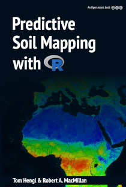

## Predictive Soil Mapping with R by T. (Tom) Hengl and R.A. (Bob) MacMillan
 

The text and code for the forthcoming Open Access book: [**Predictive Soil Mapping with R**](https://envirometrix.github.io/PredictiveSoilMapping/). Pull requests and general comments are welcome.

**This book is continuously updated**. For news and updates please refer to the [github issues](https://github.com/envirometrix/PredictiveSoilMapping/issues).

**Cite this as**:

* Hengl, T., MacMillan, R.A., (2019). **Predictive Soil Mapping with R**. OpenGeoHub foundation, Wageningen, the Netherlands, 376 pages, www.soilmapper.org, ISBN: 978-0-359-30635-0.

This book is constantly updated and contributions are welcome (pull requests and general comments are welcome) provided that some minimum requirements are met.

**Copyright**: &copy; 2019 Authors.

 This work is licensed under a <a rel="license" href="http://creativecommons.org/licenses/by-sa/4.0/">Creative Commons Attribution-ShareAlike 4.0 International License</a>.
