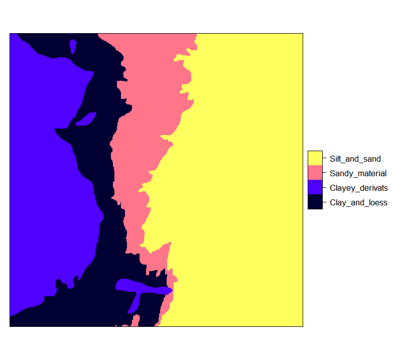
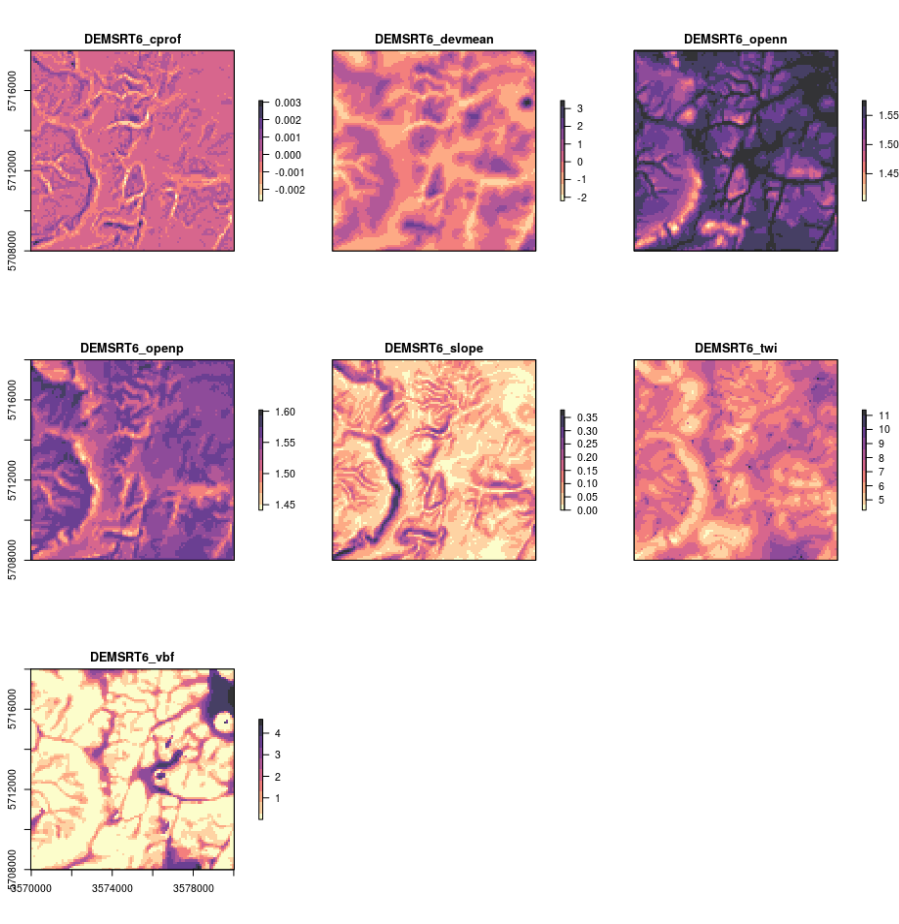
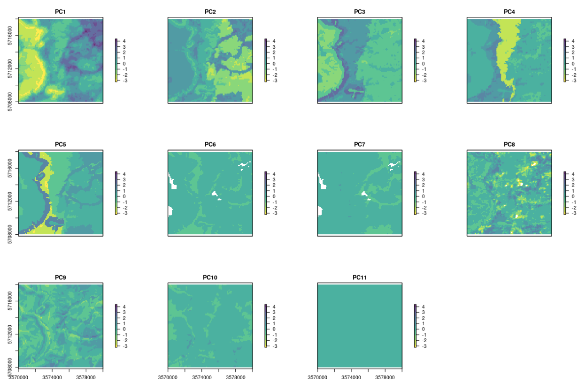
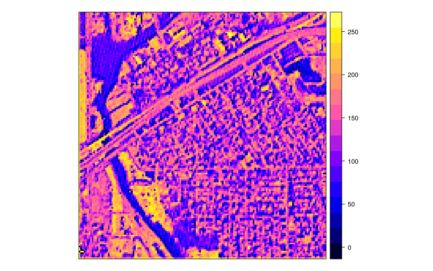

# Preparation of soil covariates for soil mapping {#soil-covs-chapter}

*Edited by: T. Hengl*

## Soil covariate data sources

### Soil covariate data sources (30–100 m resolution) {#soil-covs-30m}

Adding relevant covariates that can explain distribution of soil properties increases accuracy of spatial predictions. Hence prior to generating predictions of soil properties, it is a good idea to invest into preparing a list of Remote Sensing (RS), geomorphological/lithologic and DEM-based covariates that could potentially help explain spatial distribution of OCS. Since 2016, there are many high resolution (30–250 m) covariates with global coverage, and that are publicly available without restrictions. Both spatial detail, accessibility and accuracy of RS-based products has been growing exponentially and there is now evidence that that trend is going to slow down in the coming decades [@Herold2016]. 

The most relevant publicly available remote sensing-based covariates that can be downloaded and used to improve predictive soil mapping at high spatial resolutions are, for example:

*  [SRTM](https///lta.cr.usgs.gov/SRTM1Arc) and/or [ALOS W3D](http://www.eorc.jaxa.jp/ALOS/en/aw3d/index_e.htm) Digital Elevation Model (DEM) at 30 m and [MERIT DEM](http://hydro.iis.u-tokyo.ac.jp/~yamadai/MERIT_DEM/) at 100 m (these can be used to derive some 8–12 DEM derivatives from which some could be crucial for mapping of soil chemical and hydrological properties);

*  Landsat 7, 8 satellite images, either available from USGS's [GloVis](http://glovis.usgs.gov/) / [EarthExplorer](http://earthexplorer.usgs.gov/), or from the [GlobalForestChange project](https///earthenginepartners.appspot.com/science-2013-global-forest/download_v1.2.html) repository [@hansen2013high];

*  [Landsat-based Global Surface Water (GSW) dynamics images](https///global-surface-water.appspot.com/download) at 30 m resolution for period 1985–2016 [@pekel2016high];

*  Global Land Cover (GLC) maps based on the [GLC30 project](http://www.globallandcover.com) at 30 m resolution for 2000 and 2010 [@Chen2014] and similar land cover projects [@Herold2016];

*  USGS's [global bare surface images](https///landcover.usgs.gov/glc/) at 30 m resolution;

Note that the download time for 30 m global RS data could be significant if the data is needed for a larger area (hence you might consider using some RS data processing hub such as [Sentinel hub](http://www.sentinel-hub.com/), [Google Earth Engine](https///earthengine.google.com/) and/or [Amazon Web Services](https///aws.amazon.com/public-datasets/) instead of trying to download large mosaics yourself).

### Soil covariate data sources (250 m resolution or coarser) {#soil-covs-250m}

@Hengl2017SoilGrids250m used a large stack of coarser resolution covariate layers for producing 
SoilGrids250m predictions, most of which were based on remote sensing data:

-   DEM-derived surfaces — slope, profile curvature, Multiresolution
    Index of Valley Bottom Flatness (VBF), deviation from Mean Value,
    valley depth, negative and positive Topographic Openness and SAGA
    Wetness Index — all based on the global merge of SRTMGL3 DEM and
    GMTED2010 @Danielson2011GMTED. All DEM derivatives were computed
    using SAGA GIS [@gmd-8-1991-2015],

-   Long-term averaged monthly mean and standard deviation of the MODIS
    Enhanced Vegetation Index (EVI). Derived using a stack of MOD13Q1
    EVI images [@Savtchenko2004ASR],

-   Long-term averaged mean monthly surface reflectances for MODIS bands
    4 (NIR) and 7 (MIR). Derived using a stack of MCD43A4 images
    [@mira2015modis],

-   Long-term averaged monthly mean and standard deviation of the MODIS
    land surface temperature (daytime and nighttime). Derived using a
    stack of MOD11A2 LST images [@wan2006modis],

-   Long-term averaged mean monthly hours under snow cover based on a
    stack of MOD10A2 8-day snow occurrence images [@hall2007accuracy],

-   Land cover classes (cultivated land, forests, grasslands,
    shrublands, wetlands, tundra, artificial surfaces and
    bareland cover) for the year 2010 based on the GlobCover30 product
    by the National Geomatics Center of China [@Chen2014]. Upscaled to
    resolution and expressed in percent of pixel coverage,

-   Monthly precipitation images derived as the weighted average between
    the WorldClim monthly precipitation [@Hijmans2005IJC] and GPCP Version
    2.2 [@huffman2009gpcp],

-   Long-term averaged mean monthly hours under snow cover. Derived
    using a stack of MOD10A2 8-day snow occurrence images,

-   Lithologic units (acid plutonics, acid volcanic, basic plutonics,
    basic volcanics, carbonate sedimentary rocks, evaporite, ice and
    glaciers, intermediate plutonics, intermediate volcanics,
    metamorphics, mixed sedimentary rocks, pyroclastics, siliciclastic
    sedimentary rocks, unconsolidated sediment) based on Global
    Lithological Map GLiM [@GGGE:GGGE2352],

-   Landform classes (breaks/foothills, flat plains, high mountains/deep
    canyons, hills, low hills, low mountains, smooth plains) based on
    the USGS’s Map of Global Ecological Land Units [@sayre2014new].

-   Global Water Table Depth in meters [@fan2013global],

-   Landsat-based estimated distribution of Mangroves [@giri2011status],

-   Average soil and sedimentary-deposit thickness in meters [@Pelletier2016].

These covariates were selected to represent factors of soil formation
according to @jenny1994factors: climate, relief, living organisms,
water dynamics and parent material. Out of the five main factors, water
dynamics and living organisms (especially vegetation dynamics) are not
trivial to represent as these operate over long periods of time and
often exhibit chaotic behaviour. Using reflectance bands such as the
mid-infrared MODIS bands from a single day, would have little use to
soil mapping for areas with dynamic vegetation, i.e. with strong
seasonal changes in vegetation cover. To account for seasonal
fluctuation and for inter-annual variations in surface reflectance, 
long-term temporal signatures of the soil surface derived
as monthly averages from long-term MODIS imagery (15 years of data) 
can be used [@Hengl2017SoilGrids250m]. 
Long-term average seasonal signatures of surface reflectance or vegetation 
index provide a better indication of soil characteristics than only a single snapshot of
surface reflectance. Computing temporal signatures of the land surface
requires a considerable investment of time (comparable to the generation
of climatic images vs temporary weather maps), but it is possibly the
only way to represent the cumulative influence of living organisms on
soil formation.

@Behrens2018128 have recently discovered that, for example, DEM
derivatives correlate derived at coarser scales correlate more with some
targeted soil properties than the derivatives derived as fine scales; in
this case, scale was represented through various DEM aggregation levels
and filter sizes. Some physical and chemical processes of soil formation
or vegetation distribution might not be visible at finer aggregation
levels, but then become very visible at coarser aggregation levels. In
fact, it seems that spatial dependencies and interactions of the
covariates can be explained simply by aggregating DEM and the
derivatives.

## Preparing soil covariate layers

Before we are able to fit spatial prediction models and generate soil maps, a significant amount of time is also spent on preparing covariate “layers” that can be used as independent variables (i.e. “predictor variables”) in the statistical modelling. Typical operations used to generate soil covariate layers include:

*  Converting polygon maps to rasters,

*  Downscaling or upscaling (aggregating) rasters to match the target resolution (i.e. preparing a *stack*),

*  Filtering out missing pixels / reducing noise and multicolinearity (data overlap) problems,

*  Overlaying and subsetting raster stacks and points,

The following examples should give you some ideas about how to program those steps using the shortest possible syntax running the fastest and most robust algorithms. Raster data can often be very large (e.g. millions of pixels) so processing large stacks of remote sensing scenes in R needs to be planned carefully. The complete R tutorial you can download from the **[github repository](https///github.com/envirometrix/PredictiveSoilMapping)**. Instructions on how to install and set-up all software used in this example you can find in the software installation chapter \@ref(software).

### Converting polygon maps to rasters

Before we can attach a polygon map to other stacks of covariates, this needs to be rasterized i.e. converted to a raster layer defined with its bounding box (extent) and spatial resolution. Consider for example the [Ebergötzen data set](http://plotkml.r-forge.r-project.org/eberg.html) polygon map from the plotKML package (Fig. \@ref(fig:eberg-zones-spplot)):

```{r eberg-zones-spplot, fig.cap="Ebergotzen parent material polygon map with legend.", out.width="70%"}
library(rgdal)
library(raster)
library(plotKML)
data(eberg_zones)
spplot(eberg_zones[1])
```

We can convert this object to a raster by using the [raster package](https///cran.r-project.org/web/packages/raster/). Note that before we can run the operation, we need to know the target grid system i.e. extent of the grid and spatial resolution. We can use this from an existing layer:

```{r}
library(plotKML)
data("eberg_grid25")
gridded(eberg_grid25) <- ~x+y
proj4string(eberg_grid25) <- CRS("+init=epsg:31467")
r <- raster(eberg_grid25)
r
```

The `eberg_grids25` object is a `SpatialPixelsDataFrame`, which is a spatial gridded data structure of the [sp package](https///cran.r-project.org/web/packages/sp/) package. The raster package also offers data structures for spatial (gridded) data, and stores such data as `RasterLayer` class. Gridded data can be converted from class `SpatialPixelsDataFrame` to Raster layer with the [`raster`](http://www.rdocumentation.org/packages/raster/functions/raster) command. The 
[`CRS`](http://www.inside-r.org/packages/cran/sp/docs/CRS) command of the sp package can be used to set a spatial projection. 
[EPSG projection 31467](http://spatialreference.org/ref/epsg/31467/) is the German coordinate system (each coordinate system has an associated EPSG number that can be obtained from http://spatialreference.org/.

Conversion from polygon to raster is now possible via the [`rasterize`](http://www.rdocumentation.org/packages/raster/functions/rasterize) command:

```{r eberg-zones-grid, fig.cap="Ebergotzen parent material polygon map rasterized.", out.width="70%"}
names(eberg_zones)
eberg_zones_r <- rasterize(eberg_zones, r, field="ZONES")
plot(eberg_zones_r)
```

Converting large polygons in R using the raster package could be very time-consuming, hence often a more efficient approach is to use SAGA GIS which can handle large data and is easy to run in parallel. First, you need to export the polygon map to shapefile format that can be done with commands of the [rgdal package](https///cran.r-project.org/web/packages/rgdal/) package:

```{r}
eberg_zones$ZONES_int <- as.integer(eberg_zones$ZONES)
writeOGR(eberg_zones["ZONES_int"], "extdata/eberg_zones.shp", ".", "ESRI Shapefile")
```

The `writeOGR()` command writes a SpatialPolygonsDataFrame (the data structure for polygon data in R) to an ESRI shapefile. Here we only writing the attribute `"ZONES_int"` to the shapefile. It is, however, also possible to write all attributes of the SpatialPolygonsDataFrame to a shapefile.

Next, you can locate the (previously installed) SAGA GIS command line program (on Microsoft Windows OS or Linux system):

```{r}
if(.Platform$OS.type=="unix"){
  saga_cmd = "saga_cmd"
}
if(.Platform$OS.type=="windows"){
  saga_cmd = "C:/Progra~1/SAGA-GIS/saga_cmd.exe"
}
saga_cmd
```

and finally use the module [''grid_gridding''](http://saga-gis.org/saga_module_doc/2.2.7/grid_gridding_0.html) to convert the shapefile to a grid:

```{r}
pix = 25
system(paste0(saga_cmd, ' grid_gridding 0 -INPUT \"extdata/eberg_zones.shp\" ',
      '-FIELD \"ZONES_int\" -GRID \"extdata/eberg_zones.sgrd\" -GRID_TYPE 0 ',
      '-TARGET_DEFINITION 0 -TARGET_USER_SIZE ', pix, ' -TARGET_USER_XMIN ', 
      extent(r)[1]+pix/2,' -TARGET_USER_XMAX ', extent(r)[2]-pix/2, 
      ' -TARGET_USER_YMIN ', extent(r)[3]+pix/2,' -TARGET_USER_YMAX ', 
      extent(r)[4]-pix/2))
eberg_zones_r2 <- readGDAL("extdata/eberg_zones.sdat")
```

With the `system()` command we can invoke an operating system (OS) command, here we use it to run the `saga_cmd.exe` file from R. The paste0 function is used to paste together a string that is passed to the `system()` command. The string starts with the OS command we would like to invoke (here `saga_cmd.exe`) followed by input required for the running the OS command.

Note that the bounding box (in SAGA GIS) needs to be defined using the center of the corner pixel and not the corners, hence we take half of the pixel size for extent coordinates from raster package. Also note that the class names have been lost during rasterization (we work with integers in SAGA GIS), but we can attach them back by using e.g.:

```{r}
levels(eberg_zones$ZONES)
eberg_zones_r2$ZONES <- as.factor(eberg_zones_r2$band1)
levels(eberg_zones_r2$ZONES) <- levels(eberg_zones$ZONES)
summary(eberg_zones_r2$ZONES)
```

```{r eberg-zones-rasterized, echo=FALSE, fig.cap="Eberg zones rasterized to 25 m resolution.", out.width="70%"}

```

### Downscaling or upscaling (aggregating) rasters {#downscaling-upscaling}

In order for all covariates to perfectly *stack*, we also need to adjust resolution of some covariates that have either too coarse or too fine resolution than the target resolution. Process of bringing raster layers to target grid is also known as **resampling**. Consider the following example from the Ebergotzen case study:

```{r}
data(eberg_grid)
gridded(eberg_grid) <- ~x+y
proj4string(eberg_grid) <- CRS("+init=epsg:31467")
names(eberg_grid)
```

In this case we have few layers that we would like to use for spatial prediction in combination with the maps produced in the previous sections, but their resolution is 100 m i.e. about 16 times coarser. Probably the most robust way to resample rasters is to use the [`gdalwarp`](http://www.gdal.org/gdalwarp.html) function from the GDAL software. Assuming that you have already installed GDAL, you only need to locate the program on your system, and then you can again run [`gdalwarp`](http://www.gdal.org/gdalwarp.html) via the system command:

```{r}
writeGDAL(eberg_grid["TWISRT6"], "extdata/eberg_grid_TWISRT6.tif")
system(paste0('gdalwarp extdata/eberg_grid_TWISRT6.tif',
              ' extdata/eberg_grid_TWISRT6_25m.tif -r \"cubicspline\" -te ', 
              paste(as.vector(extent(r))[c(1,3,2,4)], collapse=" "),
              ' -tr ', pix, ' ', pix, ' -overwrite'))
```

The writeGDAL commands writes the TWISRT6 grid, that is stored in the eberg_grid grid stack, to a TIFF file. This TIFF is subsequently read by the gdalwarp function and resampled to a 25m TIFF file using `cubicspline`, which will fill in values between original grid using smooth surfaces. Note that the paste0 function in the `system()` command pastes together the following string: 

```{bash, eval=FALSE}
"C:/Progra~1/GDAL/gdalwarp.exe eberg_grid_TWISRT6.tif 
eberg_grid_TWISRT6_25m.tif -r \"cubicspline\" 
-te 3570000 5708000 3580000 5718000 -tr 25 25 -overwrite"
```

We can compare the two maps (the original and the downscaled) next to each other by using:

```{r, eval=FALSE, echo=FALSE, results='hide', fig.keep='none'}
par(mfrow=c(1,2))
zlim = range(eberg_grid$TWISRT6, na.rm=TRUE)
image(raster(eberg_grid["TWISRT6"]), col=SAGA_pal[[1]], zlim=zlim, main="Original", asp=1)
image(raster("extdata/eberg_grid_TWISRT6_25m.tif"), col=SAGA_pal[[1]], zlim=zlim, main="Downscaled", asp=1)
```

```{r eberg-original-vs-downscaled, echo=FALSE, fig.cap="Original TWI vs downscaled map from 100 m to 25 m.", out.width="100%"}
knitr::include_graphics("figures/eberg_original_vs_downscaled.png")
```

The map on the right looks much smoother of course (assuming that this variable varies continuously in space, this could very well be an accurate picture), but it is important to realize that downscaling can only be implemented up to certain target resolution i.e. only for certain features. For example, downscaling TWI from 100 to 25 m is not much of problem, but to go beyond 10 m would probably result in large differences from a TWI calculated at 10 m resolution (in other words: be careful with downscaling because it is often not trivial).

The opposite process from downscaling is upscaling or aggregation. Although this one can also potentially be tricky, it is much more straight process than downscaling. We recommend using the `average` method in GDAL for aggregating values e.g.:

```{r}
system(paste0('gdalwarp extdata/eberg_grid_TWISRT6.tif',
              ' extdata/eberg_grid_TWISRT6_250m.tif -r \"average\" -te ', 
              paste(as.vector(extent(r))[c(1,3,2,4)], collapse=" "),
              ' -tr 250 250 -overwrite'))
```

```{r eberg-original-vs-aggregated, echo=FALSE, fig.cap="Original TWI vs aggregated map from 100 m to 250 m.", out.width="100%"}
knitr::include_graphics("figures/eberg_original_vs_aggregated.png")
```

### Deriving DEM parameters using SAGA GIS

Now that we have established connection between R and SAGA GIS, we can also use SAGA GIS to derive some standard DEM parameters of interest to soil mapping. To automate further processing, we make the following function:

```{r}
saga_DEM_derivatives <- function(INPUT, MASK=NULL, sel=c("SLP","TWI","CRV","VBF","VDP","OPN","DVM")){
  if(!is.null(MASK)){
    ## Fill in missing DEM pixels:
    suppressWarnings( system(paste0(saga_cmd, 
                                    ' grid_tools 25 -GRID=\"', INPUT, 
                                    '\" -MASK=\"', MASK, '\" -CLOSED=\"', 
                                    INPUT, '\"')) )
  }
  ## Slope:
  if(any(sel %in% "SLP")){
    try( suppressWarnings( system(paste0(saga_cmd, 
                                         ' ta_morphometry 0 -ELEVATION=\"', 
                                         INPUT, '\" -SLOPE=\"', 
                                         gsub(".sgrd", "_slope.sgrd", INPUT), 
                                         '\" -C_PROF=\"', 
                                         gsub(".sgrd", "_cprof.sgrd", INPUT), '\"') ) ) )
  }
  ## TWI:
  if(any(sel %in% "TWI")){
    try( suppressWarnings( system(paste0(saga_cmd, 
                                         ' ta_hydrology 15 -DEM=\"', 
                                         INPUT, '\" -TWI=\"', 
                                         gsub(".sgrd", "_twi.sgrd", INPUT), '\"') ) ) )
  }
  ## MrVBF:
  if(any(sel %in% "VBF")){
    try( suppressWarnings( system(paste0(saga_cmd, 
                                         ' ta_morphometry 8 -DEM=\"', 
                                         INPUT, '\" -MRVBF=\"',
                                         gsub(".sgrd", "_vbf.sgrd", INPUT),
                                         '\" -T_SLOPE=10 -P_SLOPE=3') ) ) )
  }
  ## Valley depth:
  if(any(sel %in% "VDP")){
    try( suppressWarnings( system(paste0(saga_cmd, 
                                         ' ta_channels 7 -ELEVATION=\"', 
                                         INPUT, '\" -VALLEY_DEPTH=\"', 
                                         gsub(".sgrd", "_vdepth.sgrd", 
                                              INPUT), '\"') ) ) )
  }
  ## Openess:
  if(any(sel %in% "OPN")){
    try( suppressWarnings( system(paste0(saga_cmd, 
                                         ' ta_lighting 5 -DEM=\"', 
                                         INPUT, '\" -POS=\"', 
                                         gsub(".sgrd", "_openp.sgrd", INPUT), 
                                         '\" -NEG=\"', 
                                         gsub(".sgrd", "_openn.sgrd", INPUT), 
                                         '\" -METHOD=0' ) ) ) )
  }
  ## Deviation from Mean Value:
  if(any(sel %in% "DVM")){
    suppressWarnings( system(paste0(saga_cmd, 
                                    ' statistics_grid 1 -GRID=\"', 
                                    INPUT, '\" -DEVMEAN=\"', 
                                    gsub(".sgrd", "_devmean.sgrd", INPUT), 
                                    '\" -RADIUS=11' ) ) )
  }
}
```

To run this function we only need DEM as input:

```{r, eval=FALSE}
writeGDAL(eberg_grid["DEMSRT6"], "extdata/DEMSRT6.sdat", "SAGA")
saga_DEM_derivatives("DEMSRT6.sgrd")
```

which derives all DEM derivatives at once:

```{r, eval=FALSE}
dem.lst <- list.files(pattern=glob2rx("^DEMSRT6_*.sdat"))
plot(stack(dem.lst), col=SAGA_pal[[1]])
```

```{r dem-derivatives-plot, echo=FALSE, fig.cap="Some standard DEM derivatives calculated using SAGA GIS.", out.width="90%"}

```

This function can now be used with any DEM to derive the standard 7-8 DEM parameters such as slope and curvature, TWI and MrVBF, positive and negative openess, valley depth and deviation from mean value. You could easily add more parameters to this function and then test if some of the other DEM derivatives can help improve mapping soil properties and classes. Note that SAGA GIS will by default optimize computing of DEM derivatives by using most of available cores to compute (parallelization is turned on automatically).

### Filtering out missing pixels and artifacts

After we have brought all covariates to the same grid definition, what can still represent a problem for using covariates in spatial modelling are:

*  Missing pixels,

*  Artifacts and noise,

*  Multicolinearity (i.e. data overlap),

In a stack with tens of rasters, the *weakest layer* (i.e. the layer with highest number of missing pixels or highest amount of artifacts) could cause serious problems for producing soil maps as the missing pixels and artifacts would propagate to predictions: if only one layer in the raster stack misses values than predictive models might drop whole rows in the predictions even though data is available for 95% of rows. Missing pixels happen due to various reasons: in the case of remote sensing, missing pixels can be due to clouds or similar; noise is often due to atmospheric conditions. Missing pixels (as long as we are dealing with few patches of missing pixels) can be efficiently filtered by using for example the [gap filling functionality](http://saga-gis.org/saga_module_doc/2.2.7/grid_tools_7.html) available in the SAGA GIS e.g.:

```{r, eval=FALSE}
par(mfrow=c(1,2))
image(raster(eberg_grid["test"]), col=SAGA_pal[[1]], zlim=zlim, main="Original", asp=1)
image(raster("test.sdat"), col=SAGA_pal[[1]], zlim=zlim, main="Filtered", asp=1)
```

In this example we use the same input and output file for filling in gaps. There are several other gap filling possibilities in SAGA GIS including Close Gaps with Spline, Close Gaps with Stepwise Resampling and Close One Cell Gaps. Note all of these are equally applicable to all missing pixel problems, but having <10% of missing pixels is often not much of a problem for soil mapping.

Another elegant way to filter the missing pixels, reduce noise and reduce data overlap is to use [Principal Components](http://www.rdocumentation.org/packages/stats/functions/prcomp) transformation of original data. This is available also via the GSIF function [''spc''](http://www.rdocumentation.org/packages/GSIF/functions/spc):

```{r, eval=FALSE}
data(eberg_grid)
gridded(eberg_grid) <- ~x+y
proj4string(eberg_grid) <- CRS("+init=epsg:31467")
formulaString <- ~ PRMGEO6+DEMSRT6+TWISRT6+TIRAST6
eberg_spc <- GSIF::spc(eberg_grid, formulaString)
names(eberg_spc@predicted) # 11 components on the end;
```

```{r, eval=FALSE, echo=FALSE, results='hide', fig.keep='none'}
rd <- range(eberg_spc@predicted@data[,1], na.rm=TRUE)
plot(stack(eberg_spc@predicted[1:11]), zlim=rd, col=rev(rainbow(65)[1:48]))
```

```{r eberg-spc-11-plot, echo=FALSE, fig.cap="11 PCs derived using eberg covariates.", out.width="100%"}

```

The advantages of using the [''spc''](http://www.rdocumentation.org/packages/GSIF/functions/spc) function are:

*  All output soil covariates are numeric (and not a mixture of factors and numeric),

*  Last 1-2 PCs often contain signal noise and could be excluded from modelling,

*  In further analysis it becomes easier to remove covariates that do not help in modelling (e.g. by using step-wise selection and similar),

A disadvantage of using SPCs (spatial predictive components) is that the components are often abstract so that interpretation of correlations can become cumbersome. Also, if one of the layers contains many factor levels, then the number of output covariates might blow up, which become impractical as we should then have at least 10 observations per covariate to avoid overfitting.

### Overlaying and subsetting raster stacks and points

Now that we have prepared all covariates (resampled them to the same grid and filtered out all problems), we can proceed with running overlays and fitting statistical models. Assuming that we deal with large number of files, an elegant way to read all those to R is by using the raster package, especially the [''stack''](http://www.rdocumentation.org/packages/raster/functions/stack) and [''raster''](http://www.rdocumentation.org/packages/raster/functions/stack) commands. In the following example we can list all files of interest, and then read them all at once:

```{r, eval=FALSE}
library(raster)
grd.lst <- list.files(pattern="25m")
grd.lst
grid25m <- stack(grd.lst)
grid25m <- as(grid25m, "SpatialGridDataFrame")
str(grid25m)
```

One could now save a the prepared covariates stored in SpatialGridDataFrame as an RDS data object for future use.

```{r, eval=FALSE}
saveRDS(grid25m, file = "extdata/covariates25m.rds")
```

To overlay rasters and points and prepare a regression matrix, we can either use the [''over''](http://www.rdocumentation.org/packages/sp/functions/over) function from the sp package, or [''extract''](http://www.rdocumentation.org/packages/raster/functions/extract) function from the raster package. By using raster package, one can run overlay even without reading the rasters to memory:

```{r, eval=FALSE}
library(sp)
data(eberg)
coordinates(eberg) <- ~X+Y
proj4string(eberg) <- CRS("+init=epsg:31467")
ov = as.data.frame(extract(stack(grd.lst), eberg))
str(ov[complete.cases(ov),])
```

If the raster layers can not be stacked and if each layer is available in a different projection system, you can also create a function that reprojects points to the target raster layer projection system:

```{r, eval=FALSE}
overlay.fun = function(i, y){
  raster::extract(raster(i), na.rm=FALSE, 
      spTransform(y, proj4string(raster(i))))}
```

which can also be run in parallel for example by using the parallel package:

```{r, eval=FALSE}
ov = data.frame(mclapply(grd.lst, FUN=overlay.fun, y=eberg))
names(ov) = basename(grd.lst)
```

In similar way one could also make wrapper functions that downscale/upscale grids, then filter missing values and stack all data together so that it become available in the working memory (sp grid or pixels object). Overlay and model fitting is also implemented directly in the GSIF package, so any attempt to fit models will automatically perform overlay.

### Working with large(r) rasters

As R is often inefficient in handling large objects in memory (such as large raster images), a good strategy to run raster processing in R is to consider using for example the ```clusterR``` function from the [raster](https///cran.r-project.org/package=raster) package, which automatically parallelizes use of raster functions. To have full control over parallelization, you can alternatively tile large rasters using the ```getSpatialTiles``` function from the GSIF package and process them as separate objects in parallel. The following examples shows how to run a simple function in parallel on tiles and then mosaic those after all processing has been completed. Consider for example the GeoTiff from the rgdal package:

```{r}
fn = system.file("pictures/SP27GTIF.TIF", package = "rgdal")
obj <- rgdal::GDALinfo(fn)
```

We can split that object in 35 tiles, each of 5 x 5 km in size by running:

```{r, eval=FALSE, fig.keep='none'}
tiles <- GSIF::getSpatialTiles(obj, block.x=5000, return.SpatialPolygons = FALSE)
tiles.pol <- GSIF::getSpatialTiles(obj, block.x=5000, return.SpatialPolygons = TRUE)
tile.pol  <- SpatialPolygonsDataFrame(tiles.pol, tiles)
plot(raster(fn), col=bpy.colors(20))
lines(tile.pol, lwd=2)
```

```{r rplot-large-raster-tiles, echo=FALSE, fig.cap="Example of a tiling system derived using the `GSIF::getSpatialTiles` function.", out.width="80%"}
knitr::include_graphics("figures/rplot_large_raster_tiles.png")
```

rgdal further allows us to read only a single tile of the GeoTiff by using the ```offset``` and ```region.dim``` arguments:

```{r, eval=FALSE}
x = readGDAL(fn, offset=unlist(tiles[1,c("offset.y","offset.x")]),
             region.dim=unlist(tiles[1,c("region.dim.y","region.dim.x")]),
             output.dim=unlist(tiles[1,c("region.dim.y","region.dim.x")]), silent = TRUE)
spplot(x)
```

```{r sp27gtif-tile, echo=FALSE, fig.cap="A tile produced for a satellite image in the example above.", out.width="60%"}

```

We would like to run a function on this raster in parallel, for example a simple function that converts values to 0/1 values based on a threshold:

```{r}
fun_mask <- function(i, tiles, dir="./tiled/", threshold=190){
  out.tif = paste0(dir, "T", i, ".tif")
  if(!file.exists(out.tif)){
    x = readGDAL(fn, offset=unlist(tiles[i,c("offset.y","offset.x")]), region.dim=unlist(tiles[i,c("region.dim.y","region.dim.x")]), output.dim=unlist(tiles[i,c("region.dim.y","region.dim.x")]), silent = TRUE)
    x$mask = ifelse(x$band1>threshold, 1, 0)
    writeGDAL(x["mask"], type="Byte", mvFlag = 255, out.tif, options=c("COMPRESS=DEFLATE"))
  }
}
```

This can now be run through `mclapply` function from the parallel package (which automatically employs all available cores):

```{r, eval=FALSE}
x0 <- mclapply(1:nrow(tiles), FUN=fun_mask, tiles=tiles)
```

We can look in the the tiles folder, and this should shows 35 produced GeoTiffs. These can be further used to construct a virtual mosaic by using:

```{r, eval=FALSE}
t.lst <- list.files(path="extdata/tiled", pattern=glob2rx("^T*.tif$"), full.names=TRUE, recursive=TRUE)
cat(t.lst, sep="\n", file="SP27GTIF_tiles.txt")
system('gdalbuildvrt -input_file_list SP27GTIF_tiles.txt SP27GTIF.vrt')
system('gdalwarp SP27GTIF.vrt SP27GTIF_mask.tif -ot \"Byte\"', 
  ' -dstnodata 255 -co \"BIGTIFF=YES\" -r \"near\" -overwrite -co \"COMPRESS=DEFLATE\"')
```

Note we use few important settings here for GDAL e.g. `-overwrite -co "COMPRESS=DEFLATE"` to overwrite the GeoTiff and internally compress it to save space and `-r "near"` basically no resampling just binding tiles together. Also, if the output GeoTiff is HUGE, you will most likely have to turn on `-co "BIGTIFF=YES"` otherwise gdalwarp would not run through. The output mosaic looks like this:

```{r sp27gtif-mask, echo=FALSE, fig.cap="Final processed output.", out.width="80%"}
knitr::include_graphics("figures/sp27gtif_mask.png")
```

This shows that R can be used to compute with large rasters provided that these operations can be parallelized. Suggested best practice for this is to: (1) design a tiling system that optimizes use of RAM and read/write spead of a disk, (2) prepare and test a function that can be then run in parallel, and (3) stitch back all tiles to a large raster using `gdalwarp`. 
Note that Tiling and and stitching can not be applied universally to all problems e.g. functions that require global geographical search or all data in the raster, in which cases tiling should be applied with overlap (to minimize boundary effects) or to irregular tiling systems (e.g. per watershed). Once an optimal tiling system and function is prepared, R is not any more limit to running efficient computing, but only how much RAM and cores you have available i.e. it becomes more a hardware than a software problem.

## Summary points

Soil covariate layers are one of the key inputs to predictive soil mapping.
Before any spatial layer can be used for modeling, it typically needs to be 
preprocessed to remove artifacts, resample to standard resolution, fill in the 
missing values etc. All these operations can be succesfully run by combining R 
and Open Source GIS software and by careful programming and optimization.

Preparing soil covariates can often be time and resources consuming so careful 
preparation and prioritisation of processing is highly recommended.
@Hengl2017SoilGrids250m show that, for soil types and soil textures, DEM-parameters,
i.e. soil forming factors of relief, especially flow-based DEM-indices,
emerge as second-most dominant covariates. These results largely
correspond with conventional soil survey knowledge (surveyors have been
using relief as a key guideline to delineate soil bodies for decades).

Although lithology is not in the list of top 15 most important
predictors, spatial patterns of lithologic classes can often be
distinctly recognized in the output predictions. This is especially true
for soil texture fractions and coarse fragments. In general, for
predicting soil chemical properties, climatic variables (especially
precipitation) and surface reflectance seem to be the most important,
while for soil classes and soil physical properties it is a combination
of relief, vegetation dynamics and parent material. Investing extra time 
in preparing a better map of soil parent material is often a good idea.

Other potentially useful covariates for predicting soil properties and
classes could be maps of paleolithic i.e. pre-historic climatic
conditions of soil formation, e.g. glacial landscapes and processes,
past climate conditions and similar. These could likely become
significant predictors of many current soil characteristics. Information
on pre-historic climatic conditions and land use is unfortunately often
not available, especially not at detailed cartographic scales, although
there are now several global products that represent, for example,
dynamics of land use / changes of land cover (see e.g. HYDE data set [@klein2011hyde]) 
through the past 1500+ years. As the spatial detail and completeness of 
such pre-historic maps increases, they will become potentially 
interesting covariates for global soil modeling.

USA’s NASA and USGS, with its MODIS, Landsat and similar 
civil-applications missions will likely
remain the main source of spatial covariate data to support global 
and local soil mapping initiatives.
