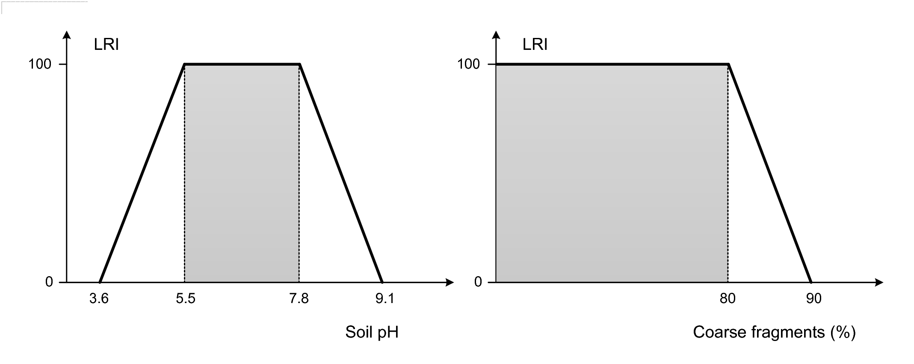
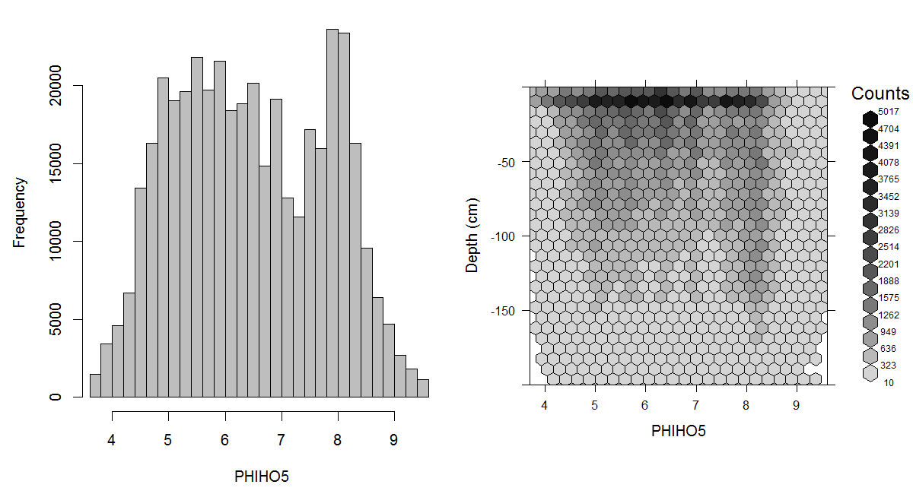
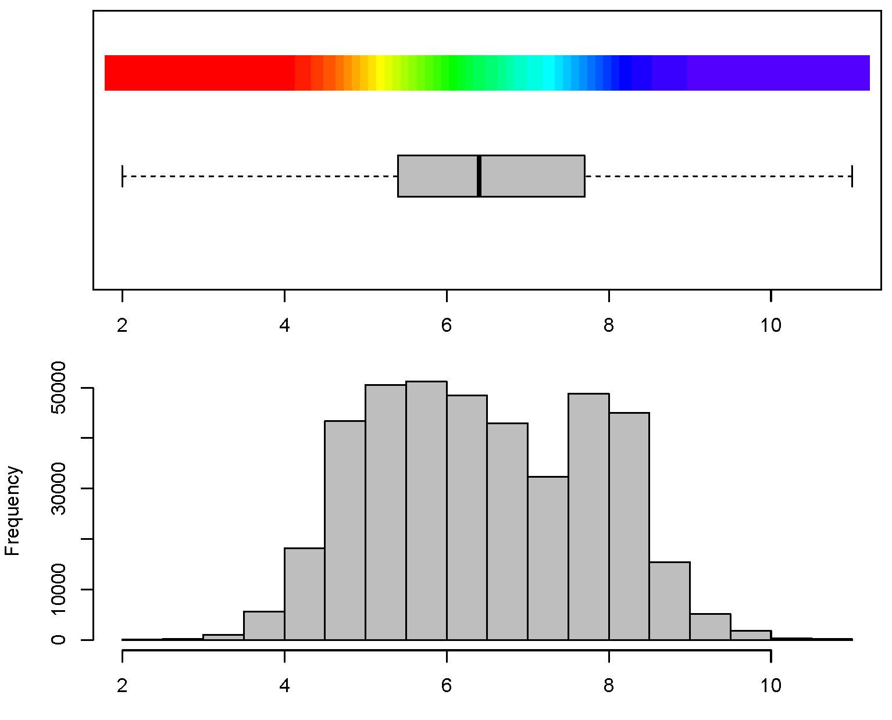
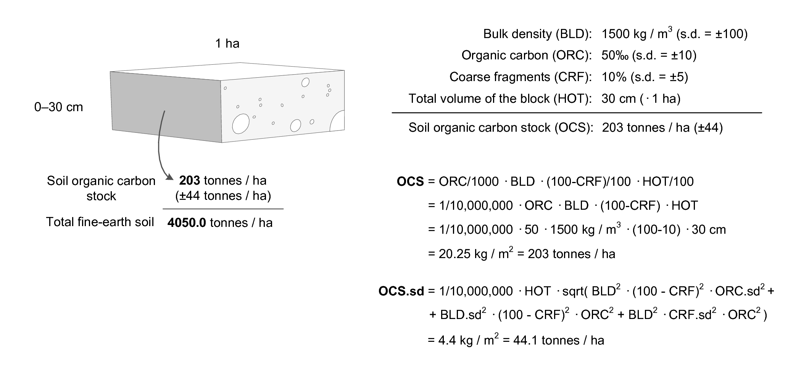
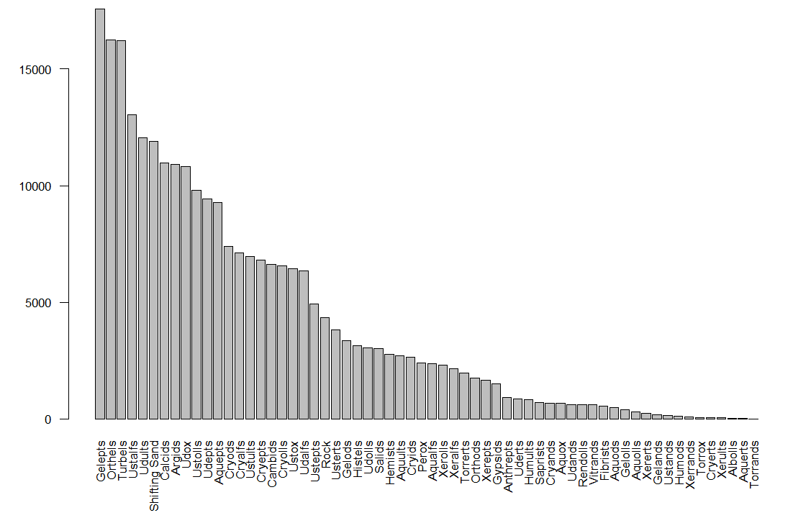

# Soil observations and variables {#soil-variables-chapter}

*Edited by: Hengl T., MacMillan R.A. and Leenaars J.G.B.*

This chapter identifies, and provides comprehensive definitions and
descriptions for, a standardized set of soil properties (and classes) that are
commonly predicted using PSM. We first discuss the complexity of measuring and exchanging soil attributes, then focus on the key soil properties and classes of interest for global soil
mapping. The purpose of this chapter is to serve as a reference, and background, for other
chapters where the focus is on generating soil maps, interpreting
accuracy results and similar.

The R tutorial at the end of the chaper reviews soil data classes and 
functions for R. It illustrates how to organize and reformat soil data in R for spatial analysis, 
how to import soil data to R and how to export data and plot it in Google Earth. 
To learn more about the Global Soil Information Facilities (GSIF) package, 
visit the main [documentation page](http://gsif.r-forge.r-project.org/00Index.html).

## Basic concepts

### Types of soil observations

As mentioned in the previous chapter, values for soil properties or
attributes are obtained through observation and/or measurement of a soil
feature, using a specified method. We refer to observations and
measurements of the characteristics of soil properties and/or feature
attributes as *soil observations* (see also the [Observation and Measurements
OGC standard](http://www.opengeospatial.org/standards/om); ISO/DIS 19156). From the perspective of the technology
used, soil observations can be grouped as follows (see also
Fig. \@ref(fig:soil-vars)):

1.  *Direct measurements obtained using analytical instruments and
    procedures in a laboratory or in the field* — the results of
    measurements are analytical values considered representative for a
    given soil property.

2.  *Indirect soil measurements obtained using mechanical devices,
    analytical instruments and procedures* — measurement of soil
    properties that can be used to infer information about a different
    target soil property. These can be based on soil spectroscopy and
    similar close-range or remote sensing systems
    [@ShepherdWalsh2007JNIS; @ViscarraRossel2010DSS].

3.  *Direct observations of soil properties and interpretations* —
    subjectively assessed values based on protocols for soil description as presented in manuals i.e.
    abundance of mottles, soil drainage class, soil colour.

4.  *Indirect or derived interpretations* — subjectively assessed values
    or conditions based mainly on an expert’s knowledge and
    interpretation of observations e.g. soil classification, soil
    fertility class.

```{r soil-vars, echo=FALSE, fig.cap="Types of soil observations in relation to data usage and production costs. Descriptive soil observations (e.g. manual texture or diagnostic soil horizons) are often not directly useable by end users, who are often more interested in specific secondary soil properties (e.g. water holding capacity, erosion index, soil fertility) as inputs to their modeling. However, descriptive field observations are often some orders of magnitude more affordable to obtain than laboratory analysis.", out.width="65%"}
knitr::include_graphics("figures/Fig_types_observations.png")
```

```{block, type="rmdnote"}
Soil can be assessed quantitatively based on direct or indirect
measurements using analytical techniques (in a laboratory or in the
field) and qualitatively or descriptively based on observations in the
field that adhere to some soil description guidelines. Examples of
subjective observations are: diagnostic soil materials and horizons,
soil classes, Munsell color classes, manual texture assessment
(texture-by-hand), structure, compaction, root abundance and similar.
```

Field campaigns are usuallly the most costly part of soil surveys. Large numbers
of soil observations are made in the field to assess the spatial
distribution of readily observable soil properties to provide empirical
evidence for soil mapping. Because a soil analytical measurement in the
laboratory is generally much more costly than a soil observation in the field,
only a smaller subset of soil samples is taken from the larger number of
field soil observations and brought to the laboratory for subsequent analysis.
Ideally, every soil observation would be accompanied by corresponding soil analytical
measurements to produce the most accurate and comprehensive soil information possible.

It is important to emphasize that soil properties, and the methods used to assess
soil properties, are two distinctly different concepts. The two can
be defined together (functional definition) or can be defined
separately, as given by numerous national and international manuals and
guidelines for analytical procedures and soil description: e.g. in
@Burt2004SSIR [@carter2007soil; @food2006guidelines], and/or
@VanReeuwijk2002. Also in this chapter we make a distinction between the
*‘target variable’* (i.e. target soil properties) and *‘paths’* (i.e.
determination methods).

Soil analytical data obtained in a laboratory are typically an order of
magnitude more expensive to produce than descriptive field observations
[@Burrough1971; @GehlRice2005; @Kempen2011PhDthesis]. To reduce these
high costs, surveyors collect descriptive soil observations (Fig. \@ref(fig:soil-vars)), 
which can subsequently be interpreted and linked to soil types and soil classes,
which are then assumed to be characterised by a limited and definable range
of soil properties [@bouma1998exploring]. It is also possible to convert
observed values for certain soil properties to values comparable to
those measured by analytical methods (albeit with unknown precision) by
using various calibration models or *conversion functions*. For example,
*manual texturing* analysis [@FAO1990; @SSDS1993] can be used as a basis for estimating
soil texture fractions with a precision of ±5 % at fraction of
the cost of laboratory analysis.

Soils are usually sampled per depth interval or layer, generally using a
genetic A-B-C-R system i.e. corresponding to a *soil horizon* — a
relatively homogeneous layer of soil (with upper and lower depth) that
is *“distinctly different from other layers and informative for the
soil’s nature”* [@harpstead2001soil]. Actual soil samples are either
taken from the centre of a soil horizon or are mixed samples of the
material from the whole horizon (Fig. \@ref(fig:soi-var-depth)). Decades
of soil survey have shown that soil horizons can be fuzzy objects.
They may be difficult for different surveyors to distinguish and delineate consistently
[@Burrough1989JSS; @DeGruijter1997Geoderma]. Soil
correlation exercises try (not always successfully) to help different
surveyors consistently recognize similar soil horizons and assign similar codes with
comparable upper and lower boundaries so as to produce similar
descriptions and classifications for any observed soil.

```{r soi-var-depth, echo=FALSE, fig.cap="Soil observations can refer to genetic horizons (left), fixed depths i.e. point support (center) and/or can be aggregate values for the complete profile (right).", out.width="70%"}
knitr::include_graphics("figures/Fig_soi_var_depth.png")
```

An emerging approach to soil characterization is to scan the complete soil
profile in different parts of the spectra, and then decide on vertical
stratification *a posteriori* [@ViscarraRossel2010DSS]. Nevertheless,
much of the analytical data available in existing legacy soil profile
databases is sampled per soil layer and described by soil horizon.

Soil observations are taken at a geographic position and at a specific
depth (or depth interval), which is either 3D or refers to the whole solum. The 3D
(longitude, latitude, depth) position implies that the property varies
not only in geographic space, but also with depth. Soil properties that
describe an entire site are by implication 2D, as are soil properties
that summarise or refer to the soil profile as a whole (2D). For
example, soil type does not change with depth. Also rock outcrops, depth
to bedrock and depth to ground water table are single attributes that apply to an entire profile.

### Soil properties of interest for global soil mapping

There are many soil properties, possibly hundreds, used in the
international domain of soil science including pedology, soil survey,
soil fertility, soil hydrology, soil biology, etc. Not all of these can
be mapped globally, nor are all of explicit interest for global
applications or use. 

Soil data have been, and are, collected and
compiled into maps at various scales for various purposes and soil
inventory projects typically begin by first carefully identifying the
specific list of soil properties that are of interest for the
anticipated uses of the planned survey. Different soil data are required
for different purposes, such as applying different models with different
data requirements. 

In the past, soil surveys typically elected to focus on observing
and measuring soil attributes and properties that were considered
to be relatively stable, or static, in time. For example the particle 
size distribution of a soil, or its depth to bedrock, were considered 
to be relatively stable and not subject to large changes over relatively
short time periods (e.g. decades). Even attributes that were known to 
change with management and time, such as topsoil thickness, organic carbon
or pH, were treated as relatively stable properties for the purposes of 
mapping. 

This choice to emphasize relatively stable soil properties and
attributes was a logical consequence of the fact that it could take years
to produce a single soil map and decades to complete mapping for an entire 
area of interest. Consequently, for maps to be relevant, and to remain
relevant and useful for their anticipated lifetime of use, they had to
restrict themselves to trying to describe the variation in space only (not time)
of properties that could be considered stable and static.

The idea that soil properties could be assumed to remain relatively stable
through time was partially based on an assumption that most soils had
achieved a relatively stable condition that was in equilibruim with their
current environment. If a soil is in equilibruim with its enviromment, it
can be assumed that it will retain its present attributes, since there are
no strong drivers for change. This may well apply to undisturbed soils in
their natural environment, but it is not valid for disturbed or managed soils.
It is well established that human management practices can, and do, significantly
alter some key soil properties, such as pH, organic matter and topsoil thickness.
Most conventional soil maps recognized, and reported on, differences in
soil properties, such as pH or organic matter, between natural soils and
managed soils. However, it was never a common practice to name, map and
characterize managed soils seperately from natural soils. 

Local or national soil survey projects are of direct
relevance to global soil mapping initiatives if the range of data
collected encompasses the minimum data set as specified for global
initiatives. For example, completion of an update to the SOTER database for the World
requires an extensive range of soil property data as specified in the
procedures manual [@VanEngelen2012]. An update of the Harmonised World
Soil Database [@FAO2012HWSD] requires a smaller range of attributes. The
*GlobalSoilMap* project [@Arrouays201493] selected a list of only
*twelve soil properties* considered relevant for global analyses and
feasible to map globally. This list includes seven basic attributes,
assessed through primary observation or measurement, and three derived
attributes which are calculated from the primary soil properties
(Tbl. \@ref(tab:globalsoilmap)). These attributes are being mapped (as and
where possible) at a fine resolution of six depth intervals in the
vertical and, 3–arcseconds in the horizontal dimension (ca. 100 m)
(Fig. \@ref(fig:scheme-solum)).

```{r scheme-solum, echo=FALSE, fig.cap="Standard soil horizons, solum thickness and depth to bedrock (left), six standard depths used in the *GlobalSoilMap* project (right).", out.width="75%"}
knitr::include_graphics("figures/Fig_scheme_solum.png")
```

```{r globalsoilmap, echo=FALSE}
knitr::kable(
  head(read.csv("extdata/globalsoilmap_specs.csv", header = TRUE, stringsAsFactors = FALSE), 10), booktabs = TRUE,
  caption = 'The *GlobalSoilMap* project has selected seven primary (depth to bedrock, organic carbon content, pH, soil texture fractions, coarse fragments), three derived (effective soil depth, bulk density and available water capacity) and two optional (effective cation exchange capacity and electrical conductivity) target soil properties of interest for global soil mapping and modelling.'
)
```

### Reference methods

A pragmatic solution to ensuring efficient exchange, sharing and interpretation of global soil data
is to establish reference methods for soil measurement and description. The
*GlobalSoilMap* project agreed that their target soil properties would be
assessed and reported relative to specific, designated *reference
methods*. For example, soil organic carbon content of the fine earth
fraction is to be assessed and reported according to ISO10694 dry
combustion method [@Sleutel2007CSSPA]. Values for pH are to be be
reported for a 1:5 suspension of soil in water or using the CaCl$_2$
solution, with a precision of 1 decimal place. It has also been
recommended that ISO TC 190 — soil quality standards — should be used to
assess and report all data measured from air-dried soil samples.

Soil properties designated as optional for the *GlobalSoilMap*
consortium include Effective Cation Exchange Capacity assessed and
reported according to ISO11260 Barium Chloride (cmol+/kg = centi-mole+ per kilogram) 
and Electrical conductivity in 1:1 soil–water solution (dS/m = deci-siemens per metre). 
The list of soil properties identified for global soil mapping and 
modelling is likely to grow in the years to come. Initially, 
GSIF has elected to simply accept and adopt the list of soil properties
specified for the *GlobalSoilMap*
project and to extend this list through time in consultation with this
and other global soil entities.

The International Organisation for Standardisation (ISO) provides
international standard definitions of soil properties, and of associated
methods to assess those soil properties, through `ISO TC-190` and
`ISO TC-345`. Such unambiguously defined international standards are
required for purposes as such as multi-partner global soil mapping.

In the following sections we focus our discussion on the soil properties
that have been mapped for the [www.soilgrids.org](www.soilgrids.org) project: 
depth to bedrock, occurrence of the `R` horizon, organic carbon content of the fine earth
fraction, pH of the fine earth fraction, particle size class contents
(sand, silt, clay) of the fine earth fraction, gravel content of the
whole soil, bulk density of the whole soil (and subsequently of the fine
earth fraction) and Cation Exchange Capacity of the fine earth fraction.
We define those attributes as completely and unambiguously as possible,
including the associated reference method. For each soil property the
following will be discussed:

-   *Brief introduction to the soil property (what is it, what does it
    reflect, why is it of interest, considerations; in general terms)*;

-   *Definition of the soil feature related to the soil property and
    it’s spatial domain (2D, 3D)*;

-   *Definition of the reference method to assess the soil property
    value*;

-   *Definition of the convention used to express the soil property value
    (units, precision, range)*;

-   *Review of the variation in soil property definitions and in methods
    to assess the attribute, including listings of several of the most
    widely used conversion functions cited from literature and with
    emphasis on harmonisation or conversion to the reference method*.

We also identify, and review, a number of other widely used measurement
methods, in addition to our selected standard methods. We describe if and
how these other methods relate to the selected reference methods and
discuss issues related to harmonization and standardization for
attributes of current interest for global mapping.

### Standard soil variables of interest for soil mapping

Some standard soil legends for listed soil properties are embedded
within the GSIF package and can be loaded by:

```{r, tidy=TRUE}
library(GSIF)
data(soil.legends)
str(soil.legends)
```

which illustrates the referent cumulative probabilities (`CPROB`) and
appropriate color legend (`COLOR`; coded as a six-digit, three-byte
hexadecimal number) for the values of the target soil variables. The cumulative
probabilities were derived using the collection of records in the World
Soil Profiles repository and can be considered as an estimate of global prior
probabilities for soil pH (see further for example
Fig. ).

A general intention is to maintain a *Global Soil Data
Registry* so that a short variable name (in further text *“GSIF code”*)
can be linked to a unique set of metadata which should include:

-   Full description;

-   Variable type (numeric, quantity, binary, factor etc)

-   Measurement unit;

-   Biblio reference (URL or DOI);

-   ISO code (if available);

-   Physical limits (lower / upper);

-   Detection limit i.e. numeric resolution;

-   Priority level (required, suggested or optional);

Note that MySQL has some restrictions considering column names: special
characters, those outside the set of alphanumeric characters from the
current character set, can not be used in the column names. Proposed
abbreviations for standard method names are $\mathtt{VOL}$ — volume
fraction, $\mathtt{ABU}$ — abundance or relative area cover,
$\mathtt{PCT}$ — mass percentage, $\mathtt{ICM}$ — thickness in cm,
$\mathtt{MHT}$ — texture by-hand or manual hand texture and
$\mathtt{MNS}$ — Munsell color codes, horizon sequence is coded with the
capital ASCII letters — $\mathtt{A}$, $\mathtt{B}$,
$\mathtt{C}$,$\ldots$ $\mathtt{Z}$. Another option is to simply use
the US Goverment National Cooperative Soil Characterization Database column names (http://ncsslabdatamart.sc.egov.usda.gov/).

Also note that the metadata can be easily separated from the code so
that the short GSIF code (variable name) could be used as a shorthand (replacement)
for the long description of the complete metadata. Using short GSIF
codes is also important for programming because unique code names are
used consistently in all scripts / functions.

## Descriptive soil profile observations

### Depth to bedrock

Soil depth (specifically depth to bedrock) is predicted because it is an
important consideration for a wide variety of engineering, hydrological
and agronomic interpretations. Shallow and lithic soils are of
particular interest as they impose restrictions for foundations and
structures in engineering, limit infiltration and storage of moisture
and produce more rapid runoff and erosion and limit growth of many crops
by restricting rooting depth and limiting available moisture storage.
Most soil legacy profile data do not provide any information about the
soil below depths of 1 m [@Richter1995]. This characteristic of legacy
soil data limits its usefulness for predicting soil depths greater than
2 m.

Soil depth is measured from the soil surface downwards and expressed in
positive values increasing with depth. Google Earth and the KML data
standard (via the `altitudeMode` tag) allow one to specify if the
vertical dimension refers to actual altitude (vertical distance from the
land surface) or to distance from the sea level (`absolute`). In this
case soil depths can be represented using `clampToGround` and negative
values. For example, depth of 30 cm can be expressed as [@OGCKML2008]:

```{bash, eval=FALSE}
<Placemark> <Point>
<altitudeMode>clampToGround</altitudeMode>
<coordinates>17.2057,45.8851,-0.3</coordinates>
</Point> </Placemark>
```

Soil surface (depth = 0 cm) is the top of the mineral soil; or, for soils
with a litter layer (`O` horizon), the soil surface is the top of the
part of the `O` horizon that is at least slightly decomposed [@FAO2006].
Fresh leaf or needle fall that has not undergone observable
decomposition is not considered to be part of the soil and may be
described separately. For organic soils, the top of any surface horizon
identified as an `O` horizon is considered the soil surface.

```{r scheme-depth-to-bedrock, echo=FALSE, fig.cap="Depth to bedrock for censured and uncensured observations. Image source: @shangguan2016.", out.width="100%"}
knitr::include_graphics("figures/Fig_depth_2_bedrock.png")
```

The *depth to bedrock* i.e. depth to the `R` horizon is measured from
the soil surface downwards and is expressed in cm with a precision of ±1 cm.
Depth to bedrock deeper than e.g. 2–3 m is most often not recorded. Bedrock
is consolidated hard rock, with only a few cracks, underlying the soil. It
is not necessarily parent material. We imagine it often as something
distinct and easy to recognize in the field. In practice, depth to
bedrock can be difficult to determine, and is often confused with
stoniness or depth to parent material (which can be unconsolidated
material). Another issue is that, for most of the soils in the world,
hard bedrock is >2 m deep so that we actually don’t know the correct
depth to enter, other than >2 m. Rootability is physically restricted by
the bedrock, whether hard or soft (see Fig. \@ref(fig:scheme-depth-to-bedrock)).

```{block, type="rmdnote"}
Depth to bedrock is the mean distance to `R` horizon which is the layer
impenetrable by roots or agricultural machinery. Depth to bedrock deeper
than 2 m is most often not recorded in field survey descriptions.
```

In traditional soil characterisation, the total depth of the `O`,
`A`,`E`, and `B` horizons is referred to as the *solum*
[@harpstead2001soil], while the underlaying layer is referred to as
parent material or substratum [@SSDS1993]. Parent material can be coarse
or fine unconsolidated deposits of e.g. alluvial, colluvial or windblown
origin (`C` horizon) or consolidated residual hard bedrock (`R`
horizon).

### Effective soil depth and rooting depth

*Effective soil depth* is of interest for soil mapping because it is a
key indicator of the capability of the soil to store moisture, support
crop growth and sustain beneficial land uses. It is often an essential
indicator of soil health. The effective soil depth is the depth to which
micro-organisms are active in the soil, where roots can develop and
where soil moisture can be stored [@FAO2006].

```{r rootingdepths, echo=FALSE}
knitr::kable(
  head(read.csv("extdata/maximum_rooting_depth.csv", header = TRUE, stringsAsFactors = FALSE), 10), booktabs = TRUE, 
  caption = 'Summary of maximum rooting depth by biome (after @Canadell1996Oecologia). MMRD = Mean maximum rooting depth in m; HVRD = Highest value for rooting depth in m.'
  )
```

There are many thoughts on how to define effective soil depth. Effective
soil depth is closely related to, but not necessarily equivalent to, the
*rooting depth*. Rooting depth is measured and reported relative to a
specific prevailing land cover and land use category, while effective
soil depth is supposedly the maximum possible depth of soil that can be
used by any growing plant (see Tbl. \@ref(tab:rootingdepths)).

In some cases soil ends with an abrupt change of material which is
either solid, compacted or distinctly impenetrable for plants and
organisms living in soil. The root restricting i.e. plant accessible
depth, is the depth at which root penetration is strongly inhibited
because of physical (including soil temperature), chemical or
hydrological characteristics [@SSDS1993 p.60]. Restriction means the
inability to support more than a very few fine or few very fine roots if
depth from the soil surface and water state, other than the occurrence
of frozen water, are not limiting. For some crops like cotton plants or
soybeans, and possibly other crops with less abundant roots than the
grasses, the very few class is used instead of the few class. The
restriction may be below where plant roots normally occur because of
limitations in water state, temperatures, or depth from the surface.
This evaluation can be based on the specific plants that are important
to the use of the soil, as indicated in Tbl. \@ref(tab:rootingdepths); see
also @SSDS1993 [p.60].

Root restriction can be also influenced by certain pedogenic horizons,
such as *fragipans*. A change in particle size distribution alone, as
for example loamy sand over gravel, is not always a basis for physical
root restriction. A common indication of physical root restriction is a
combination of structure and consistence which together suggest that the
resistance of the soil fabric to root entry is high and that vertical
cracks and planes of weakness for root entry are absent or widely
spaced. Root restriction is inferred for a continuously cemented zone of
any thickness; or a zone >10 cm thick that when very moist or wet is
massive, platy, or has weak structure of any type for a vertical repeat
distance of >10 cm and while very moist or wet is very firm (firm, if
sandy), extremely firm, or has a large penetration resistance. Chemical
restrictions, such as high extractable aluminum, manganese and/or low
extractable calcium, can also be considered but are plant-specific.
Root-depth observations preferably should be used to make the
generalization. If these are not available then inferences may be made
from morphology.

As a general recommendation, it is advisable to focus first on mapping soil properties that
limit rooting, including content of coarse fragments and the depth to
bedrock, and then define effective soil depth *a posteriori* using
distinct analytical rules. A similar approach has also been promoted by
@rijsberman1985effect and @driessen1992land who refer to it as the
*Soil-productivity Index* — a product of soil-water sufficiency, soil pH
sufficiency and soil bulk density sufficiency. Here we consider somewhat
wider range of soil properties that can affect rooting depth, such as:

-   coarse fragments,

-   compaction / porosity (possibly derived from structure and
    consistence),

-   drainage i.e. soil oxygen availability,

-   toxicity e.g. Al content,

-   acidity, salinity and similar.

In-field expert interpretation explicitly summarising observations into
a single expression for rooting depth is likely the most effective and
reliable source of information. The genetically determined maximum
rooting depth of vegetation isn’t always a reliable indicator of actual
observed effective rooting depth of a given soil at a given site (Fig. \@ref(fig:lri-scheme)).
Possibly a more robust way to determine the effective rooting depth is
to map all limiting soil properties with high accuracy, and then derive
rooting index per layer.

```{r lri-scheme, echo=FALSE, fig.cap="Derivation of the Limiting Rooting Index: (left) soil pH values and corresponding LRI, (right) coarse fragments and corresponding LRI [@Leenaars2018].", out.width="90%"}

```

By using the GSIF package, one can determine Limiting Rooting Index, which
can be a good indicator of the effective rooting depth. Consider the
following soil profile from Nigeria [@Leenaars2012]:

```{r}
## sample profile from Nigeria (ISRIC:NG0017):
UHDICM = c(0, 18, 36, 65, 87, 127)
LHDICM = c(18, 36, 65, 87, 127, 181)
SNDPPT = c(66, 70, 54, 43, 35, 47)
SLTPPT = c(13, 11, 14, 14, 18, 23)
CLYPPT = c(21, 19, 32, 43, 47, 30)
CRFVOL = c(17, 72, 73, 54, 19, 17)
BLD = c(1.57, 1.60, 1.52, 1.50, 1.40, 1.42)*1000
PHIHOX = c(6.5, 6.9, 6.5, 6.2, 6.2, 6.0)
CEC = c(9.3, 4.5, 6.0, 8.0, 9.4, 10.9)
ENA = c(0.1, 0.1, 0.1, 0.1, 0.1, 0.2)
EACKCL = c(0.1, 0.1, 0.1, NA, NA, 0.5)
EXB = c(8.9, 4.0, 5.7, 7.4, 8.9, 10.4)
ORCDRC = c(18.4, 4.4, 3.6, 3.6, 3.2, 1.2)
x <- LRI(UHDICM=UHDICM, LHDICM=LHDICM, SNDPPT=SNDPPT, 
   SLTPPT=SLTPPT, CLYPPT=CLYPPT, CRFVOL=CRFVOL, 
   BLD=BLD, ORCDRC=ORCDRC, CEC=CEC, ENA=ENA, EACKCL=EACKCL, 
   EXB=EXB, PHIHOX=PHIHOX, print.thresholds=TRUE)
x
## Most limiting: BLD.f and CRFVOL, but nothing < 20
```

where `UHDICM` and `LHDICM` are the upper and lower horizon depth in cm,
`SNDPPT`, `SLTPPT` and `CLYPPT` are the sand, silt and clay content in
percent, `CRFVOL` is the volume percentage of coarse fragments (>2 mm),
`BLD` is the bulk density in t/m$^3$, `ORCDRC` is the soil organic carbon
concentration in permille or g/kg, `ECN` is the electrical conductivity in dS/m,
`CEC` is the Cation Exchange Capacity in cmol/kg (centi-mol per kilogram), `ENA` is the exchangable Na
in cmol/kg, `EACKCL` is the exchangeable acidity in cmol/kg, `EXB` is the exchangeable
bases in cmol/kg, `PHIHOX` is the soil pH in water suspension, `CRB` is the
CaCO$_3$ (carbonates) in g/kg, `GYP` is the CaSO$_4$ (gypsum) in and `tetaS`
is the volumetric percentage of water.

For this specific profile, the most limiting soil property is `tetaS`, but
because none of the soil properties got <20 points, we can conclude
that the maximum rooting depth is (MISSING VALUE HERE!). Note that the threshold values in
the `LRI` function used to derive Limiting Rootability scores are set
based on common soil agricultural productivity tresholds (e.g. for
maize; see also Fig. \@ref(fig:lri-scheme)), and can be adjusted via the
`thresholds` argument. The computation is done per list of soil layers
(minimum three) to account for textural changes i.e. sudden changes in
sand and clay content and for the limiting layers such as layer
saturated with water. To determine futher the effective rooting depth we can run:

```{r}
sel <- x==FALSE
if(!all(sel==FALSE)){ 
  UHDICM[which(sel==TRUE)[1]] 
} else {
  max(LHDICM)
}

xI <- attr(x, "minimum.LRI")
## derive Effective rooting depth:
ERDICM(UHDICM=UHDICM, LHDICM=LHDICM, minimum.LRI=xI, DRAINFAO="M")
```

## Chemical soil properties

### Soil organic carbon

Organic carbon is a soil property of great current global interest
[@Smith2004SUM; @Smith2010CUP; @Panagos2013439]. It is commonly
recognized and used as a key indicator of soil health. The amount of
carbon present in the soil, and particularly in topsoil horizons, is
grossly indicative of potential productivity for crops. Amounts of
organic carbon throughout the profile influence soil structure,
permeability, porosity, bulk density, water holding capacity, nutrient
retention and availability and, consequently, overall soil health. The
ability of soils to sequester significant quantities of atmospheric
carbon is of considerable interest as a potential mechanism for
mitigating the adverse effects of increases in green house gasses in the
atmosphere [@Smith2004SUM; @Conant2010; @Scharlemann2014CM].
Consequently, soil organic carbon is probably the soil property of
greatest current interest and utility from the point of view of global
mapping, and interpretation, of soil properties.

```{block, type="rmdnote"}
Soil Organic Carbon is one the key measures of soil health.
The standard reference method for assessing and reporting soil organic
carbon content of the fine earth fraction is by dry combustion to at
least (ISO 10694). Values of organic carbon content are typically reported in
(permilles) with integer precision over a range of 0–1000.
```

The *dry combustion method* (Leco at 1000&deg;C) is based on thermal oxidation of
both mineral carbon (IC) and organic carbon by means of a furnace.
It is a reliable method for the determination of the soil organic carbon when IC is
removed through combustion at low temperature prior to combustion at
high temperature. Dry combustion is considered to ensure oxidation of
all ORC and is considered an accurate method which has been used in many
studies as a reference method against which to calibrate other methods
[@Grewal1991JSS; @Meersmans2009SUM; @Bisutti2004TAC]. A global estimate
of the distribution of soil organic carbon is shown in
Fig. \@ref(fig:sprofs-soil-carbon).

```{r sprofs-soil-carbon, echo=FALSE, fig.cap="Histogram and soil-depth density distribution for a global compilation of measurements of soil organic carbon content in permilles. Based on the records from WOSIS [@Batjes2017ESSD]. The log-transformation is used to ensure close-to-normal distribution in the histogram.", out.width="100%"}
knitr::include_graphics("figures/Fig_sprofs_ORCDRC.png")
```

```{block, type="rmdnote"}
Soil organic carbon content is most commonly expressed in weight
percentage and for GSIF in grams per kilogram fine earth fraction or
permilles. The standard method of determining the soil organic carbon
content is by dry combustion method (Leco at 1000&deg;C).
```

In the dry combustion method, all carbon present in the soil is oxidized
to carbon dioxide (CO$_2$) by heating the soil to at least (WHAT TEMP HERE? 1000 c?) in a flow of
oxygen-containing gas that is free from carbon dioxide. The amount of
carbon dioxide released is then measured by titrimetry, gravimetry,
conductometry, gas chromatography or using an infrared detection method,
depending on the apparatus used. When the soil is heated to a
temperature of at least (WHAT TEMP HERE? 1000 c?), in addition to organic carbon any inorganic
carbon present as carbonate is also completely decomposed. Total organic
carbon can be determined directly or indirectly. Direct determination
consists of previous removal of any carbonates present by treating the
soil with hydrochloric acid. Indirect determination consists of applying
an empirical correction to the total carbon content to account for for
the inorganic carbonates present.

Examples of studies that have used dry combustion for calibrating other
methods of analyzing organic carbon include @Kalembasa1973JSFA
[@Grewal1991JSS; @Soon1991CSSPA; @Wang1996AJSR; @Konen2002SSSAJ; @Brye2003CSSPA; @Mikhailova2003CSSPA; @Bisutti2004TAC; @Jankauskas2006CSSPA; @DeVos2007SUM]
and @Meersmans2009SUM. It is possible to produce
regression equations to permit conversion of results for organic carbon
produced by one method into equivalent values in a specified reference
method (generally dry combustion). However, local calibration 
equations that reflect differences in
soils on a regional basis are usually needed. It is not possible to
provide a single universal equation suitable for use everywhere to
convert organic carbon values produced using other methods of analysis
to equivalent values in the reference method of dry combustion.

### Soil pH

PH is of interest for global soil mapping because it is one of the more
widely available and easily interpreted chemical measures of the health
and productivity of the soil. pH provides an indication of base status
of the soil which influences nutrient availability, mobility of both
beneficial and detrimental ions and the ecology of micro-organisms
within the soil. For most crops and agricultural uses, a pH in the range
of 5.5 to 7.5 is optimum (considering the agricultural productivity of
soil). Low pH is associated with acidic conditions and with increased
mobility of toxic ions such as aluminum iron and even acid sulphates.
High pH is associated with reduced availability of phosphorus and at
higher levels with alkaline conditions that impede water uptake by
plants. A global estimate of the distribution of the soil pH is shown in
Figs. \@ref(fig:sprops-phiho5) and \@ref(fig:sprops-phikcl).

PH index approximates concentration of dissolved hydrogen ions
(H$_3$O$^+$) in a soil suspension. It is estimated as the negative
decimal logarithm of the hydrogen ion activity in a soil suspension. As
a single measurement, pH describes more than relative acidity or
alkalinity. It also provides information on nutrient availability, metal
dissolution chemistry, and the activity of microorganisms
[@Miller2010SSSAJ].

```{r sprops-phiho5, echo=FALSE, fig.cap="Histogram and soil-depth density distribution for a global compilation of measurements of soil pH (suspension of soil in H$_2$O). Based on the records from WOSIS [@Batjes2017ESSD].", out.width="100%"}

```

```{r sprops-phikcl, echo=FALSE, fig.cap="Histogram and soil-depth density distribution for a global compilation of measurements of soil pH (suspension of soil in KCl). Based on the records from WOSIS [@Batjes2017ESSD].", out.width="100%"}
knitr::include_graphics("figures/Fig_sprofs_PHIKCL.png")
```

The standard reference method for reporting pH is ISO
10390:2005. This standard specifies an instrumental method for the
routine determination of pH using a glass electrode in a 1:5 (volume
fraction) suspension of soil in water (pH in H$_2$O), in potassium
chloride solution (pH in KCl) or in calcium chloride solution (pH in
CaCl$_2$).

The most common method for analyzing pH in North America is a 1:1
soil/water suspension [@Miller2010SSSAJ]. Adopting ISO 10390:2005 as a
standard with its specification of pH measured in a 1:5 suspension of
soil in water requires US values to be converted from 1:1 soil/water
to 1:5 soil/water equivalent values.

```{r color-legend-phi, echo=FALSE, fig.cap="Histogram for soil pH and connected color legend available via the GSIF package. Color breaks in the legend have been selected using histogram equalization (i.e. by using constant quantiles) to ensure maximum contrast in the output maps.", out.width="85%"}

```

The ratio of soil to water in a suspension has a net effect of
increasing the pH with a decrease in the soil/water ratio. @Davis1943SS
has shown that decreasing the soil/water ratio from 10:1 to 1:10
resulted in an increase of 0.40 pH units. Values for pH computed using
methods with a lower ratio of soil to water (e.g. 1:1 or 1:2.5) will
generally be lower than equivalent values for pH in 1:5 water and will
need to be adjusted higher. Several authors have demonstrated that
fitting quadratic or curvilinear functions to soil pH data produces
regression equations with higher coefficients of determination that
those obtained from a linear fit [@Aitken1991AJSR; @Miller2010SSSAJ].
For example, @Brennan1998 have estimated that (at least in Southwestern Australia) 
pH in CaCl$_2$ can be estimated from the pH 1:5 water by using a simple conversion:

```{r}
ph_h2o = 7.2
0.918*ph_h2o-0.3556
```

This model fitted explains 94% of variation in the values of pH CaCl$_2$ (R-square=0.9401).

```{block, type="rmdnote"}
Soil pH is negative decimal logarithm of the hydrogen ion activity in a
soil suspension. Soil pH values are usually in the range 3–11 and are
recorded with a precision of ±0.1 pH in the range of 5.5 to 7.5 is
optimal for growing crops.
```

Soil pH varies with season and soil moisture content, with higher pH
values associated with wetter soils and winter conditions and lower pH
values with drier soils and summer conditions [@Miller2010SSSAJ]. The
effects of both temporal variation in pH and variation due to different
analytical methods means that differences in pH of less than some
specified range (e.g. ±0.3 units) may not be meaningful in the
context of predictions made using noisy legacy soils data analyzed using
a variety of different analytical methods. Consequently, it is not
necessary or beneficial to report pH with a precision greater than
±0.1 unit. Natural variation of pH in soils is over a range of 2 to
11 with a standard deviation of 1.4. Note also that pH follows
a close-to-normal distribution, although it is often argued that, locally,
it can show bimodal or even trimodal peaks
(Fig. \@ref(fig:color-legend-phi)).

### Soil nutrients

Nutrients are chemical elements or substances essential for the growth
of plants. The most essential elements important for the growth of
plants are in fact carbon, hydrogen and oxygen. Other essential elements
can be separated into macro-nutrients (>100 $\mu$g or >100 ppm) and micro-nutrients
(<100 ppm), although there is no strict border between the two
[@harpstead2001soil; @hengl2017soil]. Some macro-nutrients of global importance for soil
management and protection are (http://en.wikipedia.org/wiki/Plant_nutrition):

-   *Nitrogen* (N) — It is often considered synonymous with
    soil fertility. Controls the leafy growth. Occurs in soil as
    nitrates (e.g. NO$_3$, NO$_2$).

-   *Phosphorus* (P) — High phosphorus deficiency may result in the
    leaves becoming denatured and showing signs of necrosis. Occurs in
    the form of phosphates.

-   *Potassium* (K) — Potassium deficiency may result in higher risk of
    pathogens, wilting, chlorosis, brown spotting, and higher chances of
    damage from frost and heat.

-   *Sulfur* (S) — Symptoms of deficiency include yellowing of leaves
    and stunted growth. Occurs in soil in the form of sulfate salts
    (SO$_4$).

-   *Calcium* (Ca) — Calcium is involved in photosynthesis and
    plant structure. Calcium deficiency results in stunting. Occurs in
    the form of calcium carbonates (CaCO$_3$).

-   *Magnesium* (Mg) — Magnesium is also an important part
    of chlorophyll. Magnesium deficiency can result in
    interveinal chlorosis.

```{block, type="rmdnote"}
Nitrogen, Phosphorus and Potassium are the three relatively mobile and
dynamic nutrients in soil that are most often lacking and hence have
been identified of primary interest for the fertilizer industry. Other
micro-nutrients of interest for global soil mapping would be: Iron (Fe),
Zinc (Zn), Manganese (Mn), Copper (Cu), Boron (B), Chlorine (Cl),
Molybdenum (Mo), Nickel (Ni) and Sodium (Na).
```

Apart from macro- and micro-nutrients important for plant growth, there
is an increasing interest in the distribution of heavy metals in soils,
especially ones that are considered toxic or dangerous for human health.
Some common heavy metals of interest for soil management and soil
protection in developed industrial and / or developing countries are
Lead (Pb), Arsenic (As), Zinc (Zn), Cadmium (Cd), Nickel (Ni), Copper
(Cu), and Aluminium (Al)
[@Markus2001399; @reimann2011statistical; @Morel2005202; @Rodriguez-Lado23082013;  @hengl2017soil].

Macro- and micro-nutrients and heavy metals are measured and mapped in
parts per million or $\mu$g per kg of soil. Within the AfSIS project,
macro- and micro-nutrients have been mapped over large areas [@hengl2017soil]. The
problem of mapping such chemical soil properties, however, is that they
are highly dynamic. For example, nitrogen, phosphorus, and potassium are
highly mobile nutrients. Their concentration changes from month to
month, even from day to day so that space-time models (2D-T or 3D-T)
need to be developed and the amount of analysis / storage needed can
easily escalate.

## Physical and hydrological soil properties

### Coarse fragments

Soil texture is connected with soil granulometry or the composition of
the particle sizes, typically measured as volume percentages. The most
common subdivision of soil granulometry is [@Shirazi2001SSSAJ]:

1.  Fine earth (<2 m)

    1.  sand (coarser particles in the fine earth),

    2.  silt (medium size particles),

    3.  clay (fine particles <2 $\mu$m),

2.  Coarse fragments (>2 mm)

    1.  gravel (2 mm to 8 cm)

    2.  stones or boulders (>8 cm)

Coarse fragments occupy volume in the soil matrix reducing water and
nutrient availability as well as influencing rooting depth and
workability. We elect to produce maps of coarse fragment content because many assessments, such as total stocks of carbon or
available water, are volumetric based and require knowledge of the
volume of non-soil materials throughout the profile to support
calculations of the total volume of the fine earth fraction that is
available to hold water or retain organic carbon. Without some estimate
of the volume of the soil occupied by solid particles larger than , it
would not be possible to compute volumetric estimates of stocks of soil
carbon or available moisture for fine earth soil.

Coarse fragments include stones as well as gravel (hard and soft
nodules) and the attribute is defined as consisting of all mineral
particles with a size exceeding 2 mm. Coarse fragment content is most
commonly expressed in volume fraction (volume percentage) of the
horizon, layer or sample considered. Laboratory analyses tend to be
applied to the fine earth fraction of the soil only and commonly omit
consideration of the coarse fragment content. Data for coarse fragment
content are generally derived from descriptive field observations on
soil layer morphology. Those descriptions generally express the content
of coarse fragments by class values or categories as for example
*‘frequent stones’* indicating a volumetric content of 15–40% according to
the FAO guidelines of 1977 (similar to *‘many stones’* according to
SOTER conventions and the FAO guidelines of 2006). Because coarse
fragment content is most frequently based on generalized visual field
estimates, and is often lacking in legacy soil descriptions, it is not
reasonable to predict or present estimates of coarse fragment content
with a precision greater than 1–5%.

Note that the uncertainty associated with coarse fragment content,
propagated from the field observed class values, has significant impact
on estimations of the volumetric totals of attributes assessed and
mapped for the fine earth fraction (see also
section \@ref(SOC-chapter)). Whilst of 1 meter deep
soil, with a bulk density of 1.5 tonne per cubic-metre and an organic 
carbon content of 10 g per kg, contains 150 tonnes organic carbon. 
A similar soil with bulk density adjusted for the
presence of *‘frequent stones’* contains 90–127.5 tonnes organic carbon. Despite the
inaccuracy of the data for field observed coarse fragments content it is
strongly recommended to collect and compile these data as completely as
possible because of their relevance for estimating whole soil bulk
density, total volume and volume of the fine earth fraction alone.

The possible nature (and size) of coarse fragments is highly variable
(quartz, carbonate, iron, basalt) with thus variable manageability and
variable characteristics as breakability, solubility, bulk density, etc.
Where the coarse fragment content is dominant (>80%), approaching 100%,
rootability is near nil which is determinant for the rooting or
effective soil depth and generally also for depth to bedrock. An
estimated global distribution of coarse fragments and soil textures is
given in Fig. \@ref(fig:sprofs-crfvol).

```{r sprofs-crfvol, echo=FALSE, fig.cap="Histogram and soil-depth density distribution for a global compilation of measurements of coarse fragments in percent. Based on the records from WOSIS [@Batjes2017ESSD]. This variable in principle follows a zero inflated distribution.", out.width="100%"}
knitr::include_graphics("figures/Fig_sprofs_CRFVOL.png")
```

### Particle size class distribution: sand, silt and clay

Majority global soil mapping initiatives elect to predict the
spatial distribution of particle size classes (soil texture) because
texture controls or influences many mechanical, hydrological and
engineering aspects of use of the soil. Soil texture affects how a soil
responds to engineering uses such as construction of roads, buildings,
dams and other structures, how water infiltrates into the soil and is
stored or transmitted through it, how nutrients, chemicals and dissolved
substances adhere to surfaces and are retained or transformed and how
energy and matter enter into the soil and are stored or transmitted
through it. Texture is the fundamental physical and mechanical property
of soils and, as such, it is one of the most widely analysed and
reported soil properties.

The size of particles in the soil varies strongly from less than a 2 $\mu$m to
several cm’s and occasionally even meters (boulders); which represents a
range from to 1 $\mu$m to 1 million $\mu$m. Generally, particle size distribution has been
simplified through aggregation or classification. The fine earth
fraction (<2 mm) is the soil considered for laboratory analyses. This fine
earth is further subdivided into particle size classes including,
depending on the guidelines or laboratory concerned, fine and coarse
clay, fine and coarse silt and very fine, fine, medium, coarse and very
coarse sand. The three major particle size classes of the fine earth
fraction though are sand, silt and clay. They are generally reported in
units of percent by weight with a precision of ±1%.

Soil texture represents the relative composition of sand, silt, and clay
in soil. The *particle-size class distribution* is usually represented
in a texture diagram, relating the percentages of sand, silt, and clay
(mass percentage of fine earth) to a *texture class* [@Minasny2001AJSR].
Particle size distribution has been defined using a number of systems.
One of the most widely used systems is the USDA Soil Survey Laboratory
Methods Manual [@Burt2004SSIR]. The USDA definition of particle size
classes has also been recommended by FAO for use in the Soil Map of the
World (Fig. \@ref(fig:texture-limits)). The standard reference method adopted by
GSIF for reporting particle size classes of sand, silt and clay, is as
per the USDA Soil Survey Laboratory Methods Manual [@Burt2004SSIR
p.347]. An estimated global distribution of sand, silt, and clay is
given in Figs. \@ref(fig:sprofs-snd), \@ref(fig:sprofs-slt) and
\@ref(fig:sprofs-cly).

```{r texture-limits, echo=FALSE, fig.cap="Particle size limits used in European countries, Australia and America. Image source: @Minasny2001AJSR.", out.width="100%"}
knitr::include_graphics("figures/Fig_texture_limits_Minasny2001.jpg")
```

```{r sprofs-snd, echo=FALSE, fig.cap="Histogram and soil-depth density distribution for a global compilation of measurements of sand content in percent. Based on the records from WOSIS [@Batjes2017ESSD].", out.width="100%"}
knitr::include_graphics("figures/Fig_sprofs_SNDPPT.png")
```

```{r sprofs-slt, echo=FALSE, fig.cap="Histogram and soil-depth density distribution for a global compilation of measurements of silt content in percent. Based on the records from WOSIS [@Batjes2017ESSD].", out.width="100%"}
knitr::include_graphics("figures/Fig_sprofs_SLTPPT.png")
```

```{r sprofs-cly, echo=FALSE, fig.cap="Histogram and soil-depth density distribution for a global compilation of measurements of clay content in percent. Based on the records from WOSIS [@Batjes2017ESSD].", out.width="100%"}
knitr::include_graphics("figures/Fig_sprofs_CLYPPT.png")
```

The current standard for particle size classes adopted by FAO for use in
the Harmonized World Soil Database is ISO 10390:2005. This standard
differs from the USDA definition in defining the size range for silt as
2–63 $\mu$m instead of 2–50 $\mu$m and sand as 63–2000 $\mu$m instead of 
50–2000 $\mu$m. This is a relatively
new standard for FAO which previously adopted the USDA definitions for
the digital soil map of the world [@Nachtergaele2010press]. These
differences in attribute definition cause differences in values reported
for soil particle size classes. Differences in values can also arise
because of differences in method of analysis (e.g. hygrometer, pipette,
laser diffraction, dispersion etc). Most literature on harmonization of soil
texture data deals with harmonizing differences in attribute definitions
or the reported particle size classes
(Fig. \@ref(fig:texture-limits)).

```{block, type="rmdnote"}
The most commonly used standard for designation of fine earth texture
fractions, used by the *GlobalSoilMap* project, is the USDA
system (sand: 50–2000 $\mu$m, silt: 2–50 $\mu$m, clay: <2 $\mu$m).
```

@Minasny2001AJSR identified two major textural classifications in the
world as the International and USDA/FAO systems (Tbl. \@ref(tab:usdafaotexture)).
The significant difference between these two was the choice of a
threshold value for differentiating silt from sand of 20 $\mu$m for the
International and 50 $\mu$m for the USDA/FAO systems. The new ISO/FAO standard
adds an additional difference by changing the threshold value between
silt and sand from 50 $\mu$m to 63 $\mu$m. Another very important difference in attribute
definition concerns the Russian system which defines the clay fraction
as <1 $\mu$m and the fine earth fraction, or the upper limit of the sand
fraction, at 1 cm instead of 2 cm.

```{r usdafaotexture, echo=FALSE}
knitr::kable(
  head(read.csv("extdata/usda_fao_texture_limits.csv", header = TRUE, stringsAsFactors = FALSE)), booktabs = TRUE,
  caption = 'Differences between the International, USDA and ISO/FAO particle size classifications.'
)
```

Both @Nemes1999G and @Minasny2001AJSR investigated options for
harmonizing values for sand, silt and clay reported using different
systems for classifying particle size fractions. Using a compilation of
four large databases consisting of a total of 1620 samples,
@Minasny2001AJSR developed a single multiple linear regression model for
converting between silt fraction based on the international standard of
2–20 $\mu$m ($P_{\mathtt{2-20}}$) to the 2–50 $\mu$m range of the USDA standard
($P_{\mathtt{2-50}}$) and vice versa:

\begin{equation}
\begin{cases}
\begin{matrix} \hat P_{\mathtt{2-50}} = & -18.3914 + 2.0971 \cdot P_{\mathtt{2-20}} + 0.6726 \cdot P_{\mathtt{20-2000}}   \\
   & - 0.0142 \cdot P_{\mathtt{2-20}}^2  - 0.0049 \cdot P_{\mathtt{20-2000}}^2
\end{matrix}   & \text{ if } \hat P_{\mathtt{2-50}} > 0 \\ \begin{matrix} \hat P_{\mathtt{2-50}} = & 0.8289 \cdot P_{\mathtt{2-20}} + 0.0198 \cdot P_{\mathtt{20-2000}} \end{matrix} & \text{ if } \hat P_{\mathtt{2-50}} < 0
\end{cases}
(\#P2_50)
\end{equation}

where $P_{\mathtt{20-2000}}$ is the international sand fraction. This
conversion is fairly accurate since the model explains over variability
in the original values ($R^2$=0.823). Together with the conversion of
the silt fraction is the conversion of the sand fraction.

@Minasny2001AJSR argued that most countries should consider adopting the
particle size limits and texture classes of the USDA system. They noted
that the 2–50 $\mu$m particle size range is usually more useful than the 2–20 $\mu$m range
for estimating water retention in pedo-transfer functions and observed
that translations from one system into another were relatively easy,
given improved computing power and algorithms.

@Nemes1999 [@Nemes1999G] evaluated four different interpolation methods
(log-linear interpolation, fitting a Gompertz curve, spline
interpolation, and similarity method) in order to achieve compatibility
of particle-size distributions within the *European soil hydraulic
database HYPRES* (http://www.macaulay.ac.uk/hypres/). They introduced a new similarity procedure, which
uses an external reference data set that contains a wide variety of
reference soil materials each with 7 or 8 measured particle-size
fractions. The procedure involves searching for soil samples in the
external reference data set that match the particle-size distribution of
the soil to be interpolated. From each search. 10 similar soils are
selected that have fractions at the particle size limits similar to the
soil under investigation. The arithmetic mean of the fractions of these
10 soils at the specified particle size limit is calculated and assigned
as the estimate of the fraction for the soil under investigation.

The HYPRES reference database and the similarity procedures applied to
it are appropriate for harmonizing a wide range of soils from a variety
of countries and could be used as one of the main methods in a global
Soil Reference Library. The generic nature of this conversion approach
and the fact that it does not rely on multiple, locally developed,
regression equations makes it an attractive option for use in a global
project.

### Bulk density

Measurement of soil Bulk Density (BLD) is often time consuming and
relatively costly. For this reason, it is not analysed and reported for
legacy soil profiles as frequently or consistently as many other, more
common, soil properties. Consequently, predicting bulk density globally
using digital soil mapping methods is fraught with difficulties and
uncertainties. However, it is critical to at least attempt to make some
kind of estimate of how bulk density varies spatially because we need to
know the bulk density of the soil in order to make any estimates of
volumetric concentrations of materials such as organic carbon, water or
nutrients.

In practice, we need to be able to make estimates of two different types
of bulk density, namely the bulk density of the whole soil and the *bulk
density of the fine earth fraction* (particles <2 mm) only. Calculations
such as those for total stocks of carbon are first applied using the
bulk density of the fine earth fraction only but this value is then
reduced in accordance with the volume proportion of the soil that is
occupied by coarse fragments greater than in size. Bulk density is also
of interest for global soil mapping applications because it influences
infiltration and movement of water in the soil, penetration of the soil
by plant roots and mechanical workability of the soil using farm
implements.

Bulk density is the over-dry mass of soil material divided by the total
volume. The standard reference method for reporting bulk density for
GSIF is the core method (ISO 11272). The dry bulk density (BD) is the
ratio between the mass of oven dry soil material and the volume of the
undisturbed fresh sample. The ISO standard defines dry bulk density as
the ratio of the oven-dry mass of the solids to the volume (the bulk
volume includes the volume of the solids and of the pore space) of the
soil. The recommended ISO method (core method) uses steel cylinders of
known volume (100 cubic cm, 400 cubic cm) that are driven into the soil vertically or
horizontally by percussion. Sampling large volumes results in smaller
relative errors but requires heavy equipment. The method cannot be used
if stones or large roots are present or when the soil is too dry or too
hard.

For soils with a high stone or root content or when the soil is too dry
or too hard, methods based on the excavation technique are used as an
alternative to the core method. In the excavation method a hole on a
horizontal surface is dug and then filled with a material with a known
density (e.g. sand which packs to a calibrated volume or water separated
from the soil material by an elastic membrane) to assess the volume of
the hole or the sample taken. The soil obtained from the hole, is
oven-dried to remove the water and the oven-dry mass of the total sample
is weighed. The volumetric percentage of the coarse fragments needs to
be determined and the weight of the coarse fragments assessed, in order
to be able to calculate the oven-dry bulk density of the fine earth
separately.

The USDA handbook for analytical procedures describes various methods
for assessing, by definition, various types of bulk density. USDA soil
data report values for bulk density of the fine earth as well as of the
whole earth (including gravel), with the weight assessed oven-dry as
well as at field capacity e.g. including water. The latter method
relates the weight of moist soil to the volume of moist or oven-dry
soil. Experience has shown that organic carbon and texture or clay
content predominately influence soil bulk density, even though the
nature of the clay (mineralogy) is as important as the percentage
content of the clay. Organic carbon and texture information is often
available in soil survey reports, while bulk density is often not as
frequently reported.

Many attempts have therefore been made to estimate soil bulk densities
through pedo-transfer functions (PTFs) based on soil organic carbon and
texture data
[@Curtis1964SSSAP; @Adams1973JSS; @Alexander1980SSSAJ; @Federer1993CJFR; @Rawls1983SS; @Manrique1991SSSAJ; @Bernoux1998SSSAJ].
@Heuscher2005SSSAJ applied a stepwise multiple regression procedure to
predict oven-dried bulk density from soil properties using the NRCS
National Soil Survey Characterization Data. The database included both
subsoil and topsoil samples. An overall regression equation for
predicting oven-dried bulk density from soil properties ($R^2=0.45$,
$P<0.001$) was developed using almost 47,000 soil samples. Partitioning
the database by soil suborders improved regression relationships
($R^2=0.62$, $P<0.001$). Of the soil properties considered, the stepwise
multiple regression indicated that organic C content was the strongest
contributor to bulk density prediction. Other significant variables
included clay content, water content and to a lesser extent, silt
content, and depth.

```{block, type="rmdnote"}
Bulk density is the oven-dry mass of soil material divided by the total
volume and typically ranges from 0.7 to 1.8 t/kg$^3$. The average bulk density of
fine earth fraction of soil is about 1.3 t/kg$^3$; soils with a bulk density higher
than tend to restrict root growth. Different values for bulk density
typically apply for different soils with different soil genesis as
reflected by different materials and mineralogy, e.g. Histosols
(organic), Arenosols (sandy), Andosols (allophanic clay), Acrisols (low
activity clays) and Vertisols (high activity clays).
```

Bulk density tends to be measured and reported less frequently in legacy
data bases and reports than most other commonly measured soil analytical
properties. Such values as are reported are most often based on field
measurements of in-situ bulk density using the core method. Bulk density
of the fine earth fraction alone is measured and reported even less
frequently than bulk density for the whole soil
(Fig. \@ref(fig:sprofs-bld)).

```{r sprofs-bld, echo=FALSE, fig.cap="Histogram and soil-depth density distribution for a global compilation of measurements of bulk density (tonnes per cubic metre). Based on the records from WOSIS [@Batjes2017ESSD].", out.width="100%"}
knitr::include_graphics("figures/Fig_sprofs_BLD.png")
```

Given that there are more values reported for the bulk density of the
whole soil than for the fine earth fraction, we propose to first
estimate the bulk density of the whole soil (using appropriate
pedo-transfer functions) and then apply corrections to estimate the bulk
density of the fine earth fraction, correcting for the effect of course
fragments. Correction involves subtracting the volume of coarse
fragments from the total volume of soil sampled for assessing bulk
density in-situ in the field and then also subtracting the (estimated)
weight of coarse fragments from the measured oven-dry weight of the
sampled soil. 

The revised weight of the fine-earth fraction alone (minus
the weight of the coarse fragments) is divided by the adjusted volume of
the sample (reduced by the volume of coarse fragments) to obtain an
estimate of bulk density for the fine earth fraction alone. This value
of density of the fine-earth fraction alone is the one needed to compute
estimates of volumetric soil properties, such as total carbon stocks. It
is therefore the critical measure of bulk density for reporting
concentrations of soil chemical properties. Conversely, bulk density of
the whole soil, in situ, is generally of greater use and interest for
assessing hydrological behaviours and properties, such as hydraulic
conductivity and moisture holding capacity.

@Tranter2007SUM proposed a conceptual model that incorporated a priori
knowledge for predicting soil bulk density from other, more regularly
measured, properties. The model considers soil bulk density to be a
function of soil mineral packing structures ($\rho_m$) and soil
structure ($\Delta \rho$). Bulk-density maxima were found for soils with
approximately sand. Bulk densities were also observed to increase with
depth, suggesting the influence of over-burden pressure. Residuals from
the $\rho_m$ model, referred to as $\Delta \rho$, correlated with
organic carbon.

@Torri1994C developed a nomogram for transforming rock fragment content
from a by-mass to a by-volume basis and vice versa based on bulk density
data. This nomogram facilitates conversion of data on rock fragment
content expressed in different units. Most PTFs for predicting bulk
density, except those developed by @Rawls1983SS and @Bernoux1998SSSAJ,
are a function only of organic matter i.e. organic carbon content.
Although studies conducted by @Saini1966N and @Jeffrey1970JE have shown
that organic matter has a dominating effect on soil bulk density and
that it can be used alone as a good predictor of soil bulk density, it
has been observed (e.g. @Alexander1980SSSAJ and @Manrique1991SSSAJ) that
soil texture plays a major role in controlling bulk density where
organic matter is a minor component.

### Soil organic carbon stock

Primary soil properties such as organic carbon content, bulk density and
coarse fragments can be further used for estimation of secondary soil
properties which are typically not measured directly in the field and
need to be derived from primary soil properties. For instance, consider
estimation of the global carbon stock (in permille). This secondary soil
property can be derived from a number of primary soil properties
[@Nelson1982; @sanderman2018soil] (see Fig. \@ref(fig:ocs-calculus-scheme)):

\begin{equation}
    \mathtt{OCS} \; [\mathrm{kg \; m^{-2}}] = \frac{{\mathtt{ORC}}}{{1000}} \; [\mathrm{kg \; kg^{-1}}] \cdot \frac{{\mathtt{HOT}}}{{100}} \; [\mathrm{m}] \cdot \mathtt{BLD} \; [\mathrm{kg \; m^{-3}}] \cdot \frac{{100-\mathtt{CRF} \; [\mathrm{\%}]}}{{100}}
(\#eq:ocs-calc)
\end{equation}

where `OCS` is soil organic carbon stock, `ORC` is soil organic carbon
mass fraction in permilles, `HOT` is horizon thickness in , `BLD` is
soil bulk density in and `CRF` is volumetric fraction of coarse
fragments ($>$ 2 mm) in percent.

```{r ocs-calculus-scheme, echo=FALSE, fig.cap="Soil organic carbon stock calculus scheme. Example of how total soil organic carbon stock (OCS) and its propagated error can be estimated for a given volume of soil using organic carbon content (ORC), bulk density (BLD), thickness of horizon (HOT), and percentage of coarse fragments (CRF). Image source: @Hengl2014SoilGrids1km. OCSKGM function also available via the [GSIF package](http://gsif.r-forge.r-project.org/OCSKGM.html).", out.width="100%"}

```

The propagated error of the soil organic carbon stock (Eq.\@ref(eq:ocs-calc)) can
be estimated using the Taylor series method [@Heuvelink1998a] i.e. by
using the standard deviations of the predicted soil organic carbon
content, bulk density and coarse fragments, respectively
(Fig. \@ref(fig:ocs-calculus-scheme)). `OCS` values can be derived for
all depths / horizons, then aggregated to estimate the total stock for
the whole profile (e.g. 0–2 m).

The formulas to derive soil organic carbon stock and the propagated
uncertainty are implemented in the package e.g.:

```{r}
Area <- 1E4  ## 1 ha
HSIZE <- 30 ## 0--30 cm
ORCDRC <- 50  ## 5%
ORCDRC.sd <- 10  ## +/-1%
BLD <- 1500  ## 1.5 tonnes per cubic meter
BLD.sd <- 100  ## +/-0.1 tonnes per cubic meter
CRFVOL <- 10  ## 10%
CRFVOL.sd <- 5  ## +/-5%         
x <- OCSKGM(ORCDRC, BLD, CRFVOL, HSIZE, ORCDRC.sd, BLD.sd, CRFVOL.sd)
x  ## 20.25 +/-4.41 kg/m^2
x[[1]] * Area / 1000 ## in tonnes per ha:
```

A more robust way to estimate the propagated uncertainty of deriving
`OCS` would be to use geostatistical simulations e.g. derive standard
error from a large number of realizations (e.g. >100) that incorporate
spatial and vertical correlations. Because, in the case of soil mapping,
we are often dealing with massive data sets, running geostatistical
simulations for millions of pixels is probably not yet an option.

### Available Water Capacity

The available water holding capacity (AWC) is a complex soil property.
It is basically a soil or land quality [@food1977framework], that
provides valuable information about the capacity of the soil to hold
water, particularly water that is potentially available for root uptake
and vegetative transpiration. In practice, AWC is land cover specific.
The water available for root uptake depends on the soil properties that
determine rootability or rooting depth as genetically required by the
vegetative land cover.

The water available for root uptake also depends on the pressure head
that the vegetative land cover can generate or bridge between the
pressure in the atmosphere and the pressure in the soil matrix. E.g.
cotton can still extract water at -2500 kPa (pF 4.4) while pepper wilts at -350 kPa (pF
3.5). The ability of a soil to accept and store water has implications
beyond simply the capacity to support plant growth. It also affects how
a soil responds to hydrological events such as rainfall, snowmelt and
runoff. Soils that can rapidly absorb and retain significant amounts of
rainfall act as a buffer reducing rapid runoff and flooding. Soils that
have a limited ability to accept and store rainfall contribute to rapid
runoff with increased chances of erosion and flooding. Models of crop
growth, runoff, erosion and flooding all have requirements for
location-specific information about available water capacity.

The AWC is expressed in mm (which equals mm water/cm soil depth, or
water/ soil). This volume of water depends on the volume of soil
(influenced by depth interval and by volumetric gravel content) and the
volumetric fraction of water that is contained by the soil between field
capacity and wilting point. GSIF reports AWC with a precision of 1 mm
and a maximum range of 0–2000 mm.

Values for AWC are preferably assessed for the fine earth fraction per
depth interval and expressed as volumetric fraction. This value can be
corrected for the gravel content of the depth interval and summed up
over the interval. Preferably, the values for volumetric AWC of the fine
earth fraction per depth interval are derived from values for water
content at specific water tensions (e.g. at pF 0.1, 2, 2.5, 3, 4.2,
4.5). For pragmatic reasons though the permanent wilting point is set at
-1500 kPa (or 15,000cm, 15 bar, 15 atmosphere or pF 4.2).

The standard reference method adopted by GSIF for reporting available
water capacity is as per the USDA Soil Survey Laboratory Methods Manual
[@Burt2004SSIR p.137]. Calculation of the *Water Retention Difference*
(WRD) is considered the initial step in the approximation of the
available water capacity (AWC). WRD is a calculated value that denotes
the volume fraction for water in the whole soil that is retained between -1500 kPa suction and an upper limit of usually -33 or -10 kPa suction (pF 2.5 or pF 2)
[@Burt2004SSIR p.137]. The upper limit (lower suction) is selected so
that the volume of water retained approximates the volume of water held
at field capacity. The -33 and -1500 kPa gravimetric water contents are then
converted to a whole soil volume basis by multiplying by the oven dry
bulk density of the fine earth fraction (`Db33`) and adjusting downward
for the volume fraction of rock fragments, if present, in the soil.

```{block, type="rmdnote"}
Available water capacity (expressed in mm of water for the effective
soil depth) can be estimated based on the Water Retention Difference
(WRD) which denotes the volume fraction for water in the whole soil,
including gravel, that is retained between -1500 kPa suction and an upper limit of 33 kPa suction.
```

*“The development of hydraulic PTFs has become a boom industry, mostly
in the US and Europe”* [@Minasny2007JITL]. Results of such research have
been reported widely, including in the USA [@Rawls1991AA], UK, the
Netherlands [@Wosten1995G], and Germany. Research has attempted to
correlate particle size distribution, bulk density and organic matter
content with water content at field capacity (FC, $\theta$ at -33 kPa),
permanent wilting point (PWP, $\theta$ at -1500 kPa), and available water content
(AWC = FC - PWP) [@Minasny2007JITL]. @Gijsman2007CEA reported that
*“many PTFs for estimating soil hydraulic properties have been published
already”* (see overviews by @Rawls1991AA, @Timlin1996AS and
@Wosten2001JH). @Timlin1996AS reported 49 methods and estimated that
this covers only about 30% of the total. @Gijsman2007CEA compared eight
methods for all the soil classes that make up the texture triangle. They
went through the triangle in steps of sand, silt and clay and determined
the estimated values of wilting point or lower limit of *plant
extractable water* (LL), *field capacity* or the drained upper limit
(DUL), and soil saturation (SAT). They finally concluded that none of
the methods were universally good. The best method in the comparison of
@Gijsman2007CEA was @Saxton1986SSSAJ, closely followed by
@Rawls1982JIDDASCE.

Alterra institute in collaboration with ISRIC validated the PTF
developed by @hodnett2002marked on the basis of the data available in
the Africa Soil Profiles database [@Leenaars2012] to predict tension
specific volumetric water content [@wosten2013soil] to assess WRD.
@Jagtap2004TASAE developed an approach that does not fit a mathematical
equation through the data, but rather compares the soil layer for which
the key soil water contents of lower limit (LL), drained upper limit
(DUL), and soil saturation (SAT), have to be estimated with all layers
in a database of field-measured soil-water-retention data. The layer
that is most similar in texture and organic carbon concentration is
considered to be the *‘nearest neighbor’* among all the layers in the
database and its soil-water-retention values are assumed to be similar
to those that need to be estimated. To avoid making estimated
soil-water-retention values dependent on only one soil in the database,
the six *‘nearest neighbors’* are used and weighted according to their
degree of similarity [@Jagtap2004TASAE]. This is a non-parametric
procedure, in the sense that it does not assume a fixed mathematical
relationship between the physical properties and the water holding
properties of soils. The similarity method to convert soil particle size
fraction data proposed by @Nemes1999G [@Nemes1999] is a direct analogue
of this similarity method of @Jagtap2004TASAE for soil hydraulic
properties.

@Zacharias2007SSSAJ identified three different approaches for deriving
the WRD from more easily available parameters as:

1.  *Point-based estimation methods*: estimating the water content of
    selected matric potentials from predictors such as the percentage of
    sand, silt, or clay, the amount of organic matter, or the bulk
    density (e.g. @Rawls1982JIDDASCE).

2.  *Semi-physical approach*: deriving the WRD from information on the
    cumulative particle size distribution [@Arya1981SSSAJ];
    theoretically, this approach is based on the similarity between
    cumulative particle size distribution and water retention curves.
    The water contents are derived from the soil’s predicted pore volume
    and the hydraulic potentials are derived from
    capillarity relationships.

3.  *Parameter estimation methods*: using multiple regression to derive
    the parameters of an analytical closed-form equation for describing
    the WRD, using predictors such as the percentage of sand, silt, and
    clay, the amount of organic matter, or the bulk density (e.g.
    @van1980closed [@Wosten1999G; @wosten2013soil]).

@Zacharias2007SSSAJ concluded that approach (1) has the disadvantage
that it uses a large number of regression parameters depending on the
number of WRD sampling points, which makes its use in the mathematical
modeling more difficult while for approach 2 very detailed information
about the particle size distribution is required. They therefore
preferred use of (3) the parameter estimation methods.

@Zacharias2007SSSAJ also observed that pedo-transfer functions that do
not consider soil organic matter are rare and gave the following
examples. @Hall1977 developed point-based regression equations using
soil texture and bulk density (only for subsoils) for British soils.
@Oosterveld1980CAE developed an exponential regression equation for
Canadian soils for fitting the relationship between clay and sand
content, depth of soil, and moisture content. Equations to estimate the
WRC from mean particle diameter and bulk density have been proposed by
@Campbell1989. @Williams1992 analyzed Australian data sets and developed
regression equations for the relationship between soil moisture and soil
texture, structure information, and bulk density including variants for
both the case where there is available information on soil organic
matter and where the soil organic matter is unknown. @Rawls1989 reported
regression equations to estimate soil water retention as a function of
soil texture and bulk density. @Canarache1993ST developed point based
regression equations using clay content and bulk density for Romanian
soils. More recently, @Nemes2003SSSAJ developed different PTFs derived
from different scales of soil data (Hungary, Europe, and international
data) using artificial neural network modeling including a PTF that uses
soil texture and bulk density only.

@Zacharias2007SSSAJ developed two different regression equations
depending upon the percentage of sand in a soil as follows:

\begin{equation}
\begin{cases}
 \begin{matrix}
 \theta_r  = 0 \\
 \theta_s  = 0.788 + 0.001 \cdot {\mathtt{clay}} -0.263 \cdot D_b \\
 \ln(\alpha) = -0.648 + 0.023 \cdot {\mathtt{sand}} + 0.044 \cdot {\mathtt{clay}} -3.168 \cdot D_b \\
 n = 1.392- 0.418\cdot {\mathtt{sand}}^{-0.024} + 1.212\cdot {\mathtt{clay}}^{-0.704}
\end{matrix} & \text{ if } {\mathtt{sand}} < 66.5\% \\ \hline \begin{matrix}
 \theta_r  = 0 \\
 \theta_s  = 0.890 + 0.001 \cdot {\mathtt{clay}} -0.332 \cdot D_b \\
 \ln(\alpha) = -4.197 + 0.013 \cdot {\mathtt{sand}} + 0.076 \cdot {\mathtt{clay}} -0.276 \cdot D_b \\
 n = 2.562 - 7 \cdot 10^{-9} \cdot {\mathtt{sand}} + 3.750\cdot {\mathtt{clay}}^{-0.016}
\end{matrix} & \text{ if } {\mathtt{sand}} > 66.5\%
\end{cases}
(\#eq:thetas)
\end{equation}

The regression coefficients from these models were almost identical to
those reported by @Vereecken1989SS (i.e.
$\theta_s  = 0.81 + 0.001 \cdot {\mathtt{clay}} - 0.283 \cdot D_b$) for
a different data set, adding further credibility to their general
applicability. @Zacharias2007SSSAJ recommended using the PTFs of
@Vereecken1989SS if data on soil organic matter were available but felt
that their proposed equations were suitable for use where soil organic
matter data were not available.

Empirical equations developed by @Williams1992 for the prediction of the
constants $A$ and $B$ in the Campbell function have been widely used in
Australia and elsewhere. These regression equations require particle
size distribution, field texture and bulk density inputs as follows:

\begin{equation}
\begin{split}   
A =& 1.996 + 0.136 \cdot \ln({\mathtt{clay}}) - 0.00007 \cdot {\mathtt{fsand}} + \\
  & + 0.145\cdot \ln({\mathtt{silt}}) + 0.382 \cdot \ln({\mathtt{TEXMHT}})
\end{split}
\end{equation}

\begin{equation}
B = -0.192 + 0.0946\cdot \ln({\mathtt{TEXMHT}}) - 0.00151\cdot \mathtt{fsand}
\end{equation}

where $\mathtt{clay}$ (<0.002 mm), $\mathtt{fsilt}$ (0.02–0.20 mm), and
$\mathtt{sand}$ (0.002–0.02 mm) are expressed in %; $\mathtt{TEXMHT}$ is
texture group from 1–6 as defined by Northcote in @peverill1999soil.

@Cresswell2006SUM demonstrated applicability of the @Williams1992 method
for French soils and confirmed that the approach of assuming a Campbell
SWC model and empirically predicting the slope and air entry potential
has merit. They concluded that the empirical regression equations of
Campbell appeared transferable to different data sets from very
different geographical locations. They provided regression equations for
all samples and stratified by horizon type that had R-square values ranging
from 0.81 to 0.91.

@Cresswell2006SUM further suggested a strategy for achieving adequate
coverage of soil hydraulic property data for France that included an
efficient sampling strategy based on the use of functional horizons
[@Bouma1989S], and a series of reference sites where soil hydraulic
properties could be measured comprehensively. They argued that
functional horizon method recognizes the soil texture class of the
horizon rather than the profile as the individual or building block for
prediction [@Wosten1985SSSAJ; @Wosten1992]. A significant feature of
this approach is the capacity to create a complex range of different
hydrologic soil classes from simple combinations of horizon type,
sequence, and thickness.

Pedo-transfer functions for available water capacity typically have a
general form of:

\begin{equation}
{\mathtt{AWAIMM}} = f ({\rm organic} \; {\rm carbon}, {\rm sand}, {\rm silt}, {\rm clay},  {\rm bulk} \; {\rm density})
\end{equation}

where the total profile available water ($\mathtt{AWAIMM}$) can be
summed over the effective depth.

By using the GSIF package, one can determine $\mathtt{AWAIMM}$ using the
pedo-transfer function described by @hodnett2002marked and
@wosten2013soil:

```{r}
SNDPPT = 30 
SLTPPT = 25 
CLYPPT = 48 
ORCDRC = 23 
BLD = 1200 
CEC = 12 
PHIHOX = 6.4
x <- AWCPTF(SNDPPT, SLTPPT, CLYPPT, ORCDRC, BLD, CEC, PHIHOX)
str(x)
attr(x, "coef")
```

where `SNDPPT`, `SLTPPT` and `CLYPPT` are the measured sand, silt and
clay content in percent, `ORCDRC` is the soil organic carbon
concentration in permille or , `BLD` is the bulk density in , `CEC` is
the Cation Exchange Capacity in , and `PHIHOX` is the soil pH in water
suspension. The output `AWCh1`, `AWCh2`, `AWCh3` are the available soil
water capacity (volumetric fraction) for pF 2.0, 2.3 and 2.5, `WWP` is
the soil water capacity (volumetric fraction) until wilting point, and
`tetaS` is the saturated water content, respectively.

## Harmonisation of soil data and pedo-transfer functions

### Basic concepts of harmonisation of soil property values

A well known issue with legacy soils data is the use of different
methods for analyzing soils in the laboratory or describing them in the
field. These different methods yield different values that are not
exactly equivalent or comparable. This creates a need to assess the
significance of the differences in values arising from different methods
or method-groups, and possibly the need to harmonize values produced
using different methods in order to make them roughly equivalent and
comparable. The process of conversion of values measured according to an
original method to values roughly equivalent to those measured according
to an agreed-upon standard method is referred to as *data
harmonization*.

Note that differences in methods are not necessarily reflected in
different values for a given attribute. The value reported is
fundamentally related to the particular method used for analysis, which
we correctly or incorrectly label similarly regardless of the analytical
method used.

When using legacy soils data for global soil mapping and analysis
projects, it is important to first decide whether it is necessary and
important to convert measurements made using various different
laboratory methods into equivalent values in the specified standard
reference method. This assessment can be
made for each soil property individually. Decisions as to whether
harmonization is necessary may be influenced by the resolution of the
mapping and the desired precision and accuracy of the output
predictions.

The process of conversion of values measured by an original method to
values roughly equivalent to those measured by an agreed-upon standard
reference method is referred to as data harmonization. Examples of
harmonisation would be converting values assessed by e.g. pH in 1:2
water to values as if assessed by pH in 1:5 water, or organic carbon by
*Walkley-Black* into organic carbon by *dry combustion*.

### Example of harmonization using texture-by-hand classes

Harmonization of values reported for sand, silt and clay computed using
methods of textural analysis that use definitions for particle size
fractions different from the reference method will also have to be
converted to the standard particle size definitions adopted for some
international specifications. For example, classes in the texture
triangle represent fractions for sand, silt and clay which can be
assessed using the gravity point for the class (Tbl. \@ref(tab:usdatexturec); see also further Fig. \@ref(fig:plot-tt-triangle)).

```{r usdatexturec, echo=FALSE}
knitr::kable(
  head(read.csv("extdata/usda_texture_classes.csv", header = TRUE, stringsAsFactors = FALSE), 12), booktabs = TRUE,
  caption = 'Simple conversion of the USDA texture-by-hand classes to texture fractions (sd indicates estimated standard deviation).'
)
```

Neither the *GlobalSoilMap* project nor GSIF has yet identified and
selected specific functions to use to harmonize data produced using
different analytical methods for any of the soil properties that are to
be predicted and mapped. It is possible that a single
globally-applicable default harmonisation function could potentially be
identified for each of the methods of analysis for each of the soil
properties selected for global analysis. However, this would require the
current multitude of method definitions to be unambiguously defined and
uniquely identified (IDx), and possibly grouped into aggregate classes,
for subsequent conversion from IDx to IDy.

```{block, type="rmdnote"}
Soil observations, such as observation of texture by hand class, are
often inexpensive, but rely on good expert knowledge skills. Statistical frameworks are needed that can use both highly precise and quick-and-inaccurate observations to generate better soil maps.
```

We have previously noted that locally-specific harmonisation functions
have consistently proven to be more effective than global ones and there
is widespread agreement that there is generally no universal equation
for converting from one method to another in all instances
[@Konen2002SSSAJ; @Meersmans2009SUM; @Jankauskas2006CSSPA; @Jolivet1998CSSPA; @DeVos2007SUM].
Consequently, there will likely be a need to develop locally relevant
harmonisation functions at the continental or regional level that apply
to restricted soil-landscape domains.

@McBratney2002Geoderma proposed the concept of a *soil inference system*
(SINFERS) that incorporated both expert soil knowledge and statistical
prediction equations. The proposed system was intended to implement two
major functions, namely:

1.  Predict all soil properties using all possible (known) combinations
    of inputs and harmonisation functions.

2.  Select the combination that leads to a prediction with the
    minimum variance.

## Soil class data

### Soil types

Soil types or soil classes are categories of soil bodies with similar
soil properties and/or genesis and functions. There are three main
approaches to soil classification [@eswaran2010soil; @buol2011soil]:

1.  *Classification of soils for the purpose of engineering* — Here the
    focus is put on predicting soil engineering properties and
    behaviors i.e. on physical and hydrological soil properties.

2.  *Descriptive classification of soil for the purpose of explaining
    the soil genesis* — Here the focus is put on soil morphology and
    pedogenesis i.e. functioning of the soil as part of an ecosystem.
    The representative soil types derived through morphological
    classification are often visualized as soil profiles or by using
    soil-depth functions.

3.  *Numerical or statistical classification of soils* — This is purely
    data-driven soil classification which can result in significant
    groupings of soil properties, but that then do not have any
    cognitive name and are difficult to visualize.

Soil classification or soil taxonomy supports the transfer of soil
information from one place, or individual, to another. Classifying soils
can also often be very cost effective — if we identify the soil class
correctly it is highly likely that we will be able to predict multiple
additional soil properties that co-vary by soil type that would
otherwise require significant resources to measure in the lab.

There are two major international soil taxonomic systems of primary
interest for globla soil mapping: The USDA’s *Soil Taxonomy*
[@agriculture2010keys], and the FAO’s *World Reference Base*
[@FAO2006WRB]. Both KST and WRB are hierarchial, key-based morphological
classification systems, but with increasingly more analytical data
required to reach a specific, more refined, class. Mapping soil types,
using WRB or KST or both, has been of interest for global soil mapping
projects since the first development of the global classification
systems. As a matter of fact, term *“World soil map”* has been
exclusively used for cartographic presentation of the global
distribution of KST soil orders (12) and/or FAO WRB soil groups (32).

```{block, type="rmdnote"}
USDA's Soil Taxonomy is probably the most developed soil classification system in the world. Using it for producing soil data is highly recommended also because all documents, databases and guidelines are publicly available.
```

```{r worldmap-suborders, echo=FALSE, fig.cap="The USDA-NRCS map of the Keys to Soil Taxonomy soil suborders of the world at 20 km. The map shows the distribution of 12 soil orders. The original map contains assumed distributions also for suborders e.g. Histels, Udolls, Calcids, and similar. Projected in the Robinson projection commonly used to display world maps.", out.width="100%"}
knitr::include_graphics("figures/Fig_worldmap_suborders.png")
```

(ref:barplot-suborders) Distribution of the USDA suborders shown in Fig. \@ref(fig:worldmap-suborders).

```{r barplot-suborders, echo=FALSE, fig.cap="(ref:barplot-suborders)", out.width="100%"}

```

Soil types can be mapped from field observations using statistically
robust methods such as multinomial logistic regression 
as implemented in the nnet package for R [@Venables2002Springer]. 
Theoretically, given a sufficient number
and an adequate spatial distribution of field observed classes,
multinomial logistic regression could even be used to map soil taxa at
lower taxonomic levels with hundreds of unique taxonomic entities.

```{r usda-categories, echo=FALSE, fig.cap="USDA classification system and approximate minimum required number of observations to fit a global multinomial regression model.", out.width="60%"}
knitr::include_graphics("figures/Fig_USDA_categories.png")
```

The map in Fig. \@ref(fig:worldmap-suborders) shows the global
distribution of Keys to Soil Taxonomy soil suborders according to 
[USDA-NRCS World Soil Index](https://www.nrcs.usda.gov/wps/portal/nrcs/detail/soils/use/worldsoils/?cid=nrcs142p2_054010). 
Assuming a rule of thumb that we need at least 5 and, if
possible, 10 observations of a specific soil taxonomic entity per unique
combination of predictor variables and observations,
[@harrell2001regression], it is possible to estimate that the amount of
field observations required to e.g. predict the global distribution of
USDA soil series would be in the order of few millions of soil profiles
(Fig. \@ref(fig:usda-categories)).

### Other factor-type variables

Pedometric / geostatistical methods can be used not only to predict the
spatial distribution of soil types but also any other categorical soil
variables. There are many soil categorical variables for which maps
would be extremely useful for soil management and modelling. We list
here some of the most well known / most widely used soil categorical
variables:

-   *Diagnostic soil horizons* — Diagnostic soil horizons (e.g. Mollic
    or Gypsic horizon in the WRB system) are soil layers with specific
    soil properties commonly developed as a result of soil
    formation processes. They are much easier to detect in the field
    than soil types but are rarely mapped over entire areas. Diagnostic
    soil horizons can theoretically be mapped as 3D soil polygons or
    probabilities (rasters) attached to specific depth.

-   *Soil material classes* — Soil horizons or whole profiles can be
    dominated by minerals or their combinations e.g. organic material in
    the soil, calcaric material, tephric material etc.

-   *Munsell colour classes* — Soil in dry and/or wet condition can be
    described using some 1–2 thousand Munsell colour classes. Each
    Munsell colour class carries a lot of information about the soil
    [@fernandez1988color], so that a map of Munsell soil colour classes
    could be very useful for soil management.

-   *Soil management zones* — Each unique combination of soil properties
    or types and management zones can be further expanded into a mixed
    classification system.

-   *Land degradation classes* — Land degradation classes contain
    information about soil, but also about land cover and land use.

As with any map, categorical, factor-type soil variables can be mapped
globally (together with the uncertainty) as long as there is sufficient
training field data to properly support application of the prediction
algorithm. The other technical problem is storage required to save and
share all the produced predictions. Each category of a soil categorical
variable can be mapped separately, which can lead to hundreds of grids.
The global land cover map for example contains only some 35 categories,
so that it is relatively easy to distribute and use that GIS layer.


## Importing and formatting soil data in R

### Converting texture-by-hand classes to fractions

In the following example we look at how to convert texture-by-hand estimated classes to texture fractions i.e. sand, silt and clay content in %. We focus on the USDA texture-by-hand classes. There classes are embedded in the [soiltexture package](http://cran.r-project.org/web/packages/soiltexture/) kindly contributed by Julien Moeys. The USDA texture triangle can be accessed by:

```{r plot-tt-triangle, fig.width=10, dpi=300, fig.cap="Soil texture triangle based on the USDA system. Generated using the [soiltexture package](http://cran.r-project.org/web/packages/soiltexture/) in R."}
library(soiltexture)
TT.plot(class.sys = "USDA.TT")
```

We can also print out a table with all class names and vertices numbers that defines each class:

```{r}
TT.classes.tbl(class.sys="USDA.TT", collapse=", ")
```

So knowing that the soil texture classes are defined geometrically, a logical estimate of the texture fractions from a class is to take the geometric centre of each polygon in the texture triangle. To estimate where the geometric centre is, we can for example use the functionality in the sp package. We start by creating a ''SpatialPolygons'' object, for which we have to calculate coordinates in the xy space and bind polygons one by one:

```{r}
vert <- TT.vertices.tbl(class.sys = "USDA.TT")
vert$x <- 1-vert$SAND+(vert$SAND-(1-vert$SILT))*0.5
vert$y <- vert$CLAY*sin(pi/3)
USDA.TT <- data.frame(TT.classes.tbl(class.sys = "USDA.TT", collapse = ", "))
TT.pnt <- as.list(rep(NA, length(USDA.TT$name)))
poly.lst <- as.list(rep(NA, length(USDA.TT$name)))
```

next we strip the vertices and create a list of polygons:

```{r}
library(sp)
for(i in 1:length(USDA.TT$name)){
  TT.pnt[[i]] <- as.integer(strsplit(unclass(paste(USDA.TT[i, "points"])), ", ")[[1]])
  poly.lst[[i]] <- vert[TT.pnt[[i]],c("x","y")]
  ## add extra point:
  pp <- Polygon(rbind(poly.lst[[i]], poly.lst[[i]][1,]))
  poly.lst[[i]] <- sp::Polygons(list(pp), ID=i)
}
```

and convert texture triangle to a spatial object:

```{r}
poly.sp <- SpatialPolygons(poly.lst, proj4string=CRS(as.character(NA)))
poly.USDA.TT <- SpatialPolygonsDataFrame(poly.sp, 
                      data.frame(ID=USDA.TT$name), match.ID=FALSE)
```

The resulting object now contains also slots of type ''labpt'' which is exactly the geometric gravity point of the first polygon automatically derived by the ''SpatialPolygons'' function.

```{r}
slot(slot(poly.USDA.TT, "polygons")[[1]], "labpt")
```

Next we need to create a function that converts the xy coordinates (columns) in a texture triangle to texture fraction values. Let's call this function `get.TF.from.XY`:

```{r}
get.TF.from.XY <- function(df, xcoord, ycoord) {
  df$CLAY <- df[,ycoord]/sin(pi/3)
  df$SAND <- (2 - df$CLAY - 2 * df[,xcoord]) * 0.5
  df$SILT <- 1 - (df$SAND + df$CLAY)
  return(df)
}
```

and now everything is ready to estimate the soil fractions based on a system of classes. For the case of the USDA classifications system we get:

```{r}
USDA.TT.cnt <- data.frame(t(sapply(slot(poly.USDA.TT, "polygons"), slot, "labpt")))
USDA.TT.cnt$name <- poly.USDA.TT$ID
USDA.TT.cnt <- get.TF.from.XY(USDA.TT.cnt, "X1", "X2")
USDA.TT.cnt[,c("SAND","SILT","CLAY")] <- signif(USDA.TT.cnt[,c("SAND","SILT","CLAY")], 2)
USDA.TT.cnt[,c("name","SAND","SILT","CLAY")]
```

Now that we have created a function that creates values in the texture triangle to texture fractions, we can go further and even estimate what is the uncertainty of estimating each texture fraction based on the class. For this we can use simulations i.e. randomly sample 100 points within some texture class and then derive standard deviations for each texture fraction. Note that, although this sounds as a complicated operation, we can run this in two lines of code. For example to estimate uncertainty of converting the class ''Cl'' (clay) to texture fractions we can simulate 100 random points the class polygon using the ''spsample'' function from the sp package [@Bivand2013Springer]:

```{r}
sim.Cl <- data.frame(spsample(poly.USDA.TT[poly.USDA.TT$ID=="clay",], 
                              type="random", n=100))
sim.Cl <- get.TF.from.XY(sim.Cl, "x", "y")
sd(sim.Cl$SAND); sd(sim.Cl$SILT); sd(sim.Cl$CLAY)
```

which means that we should not expect better precision of estimating the clay content based on class `Cl` than ±15%.

For some real soil profile data set we could also plot all texture fractions in the texture triangle to see how frequently one should expect some soil classes to appear:

```{r}
require(GSIF)
data(afsp)
tdf <- afsp$horizons[,c("CLYPPT", "SLTPPT", "SNDPPT")]
tdf <- tdf[!is.na(tdf$SNDPPT)&!is.na(tdf$SLTPPT)&!is.na(tdf$CLYPPT),]
tdf <- tdf[runif(nrow(tdf))<.15,]
tdf$Sum <- rowSums(tdf)
for(i in c("CLYPPT", "SLTPPT", "SNDPPT")) { tdf[,i] <- tdf[,i]/tdf$Sum * 100 }
names(tdf)[1:3] <- c("CLAY", "SILT", "SAND")
```

```{r plot-tt-afsis, fig.width=10, dpi=300, fig.cap="Distribution of observed soil textures for the [Africa Soil Profiles](http://gsif.r-forge.r-project.org/afsp.html)."}
TT.plot(class.sys = "USDA.TT", tri.data = tdf, 
        grid.show = FALSE, pch="+", cex=.4, col="red")
```

This shows that not all positions in the triangle have the same prior probability. So probably a more sensitive way to estimate uncertainty of converting soil texture classes to fractions would be to run simulations using a density image showing the actual distribution of classes and then, by using the `rpoint` function in the [spatstat package](http://spatstat.org), we could also derive an even more realistic conversions from texture-by-hand classes to texture fractions.

## Converting Munsell color codes to other color systems

In the next example we look at the Munsell color codes and conversion algorithms from a code to RGB and other color spaces. Munsell color codes can be matched with RGB values via the [Munsell color codes conversion table](http://www.cis.rit.edu/mcsl/online/munsell.php). You can load a table with 2350 entries from the GSIF dokuwiki:

```{r}
load("extdata/munsell_rgb.rdata")
library(colorspace)
munsell.rgb[round(runif(1)*2350, 0),]
```

```{r}
as(colorspace::RGB(R=munsell.rgb[1007,"R"]/255, 
                   G=munsell.rgb[1007,"G"]/255, 
                   B=munsell.rgb[1007,"B"]/255), "HSV")
```

This shows that, for any given Munsell color code, it is relatively easy to convert them to any other color system available in R.

Within the R [package aqp](http://casoilresource.lawr.ucdavis.edu/drupal/node/201) one can directly transform Munsell color codes to some color classes in R [@Beaudette2013CompGeo]. For example, to convert the Munsell color code to RGB values from the example above we would run:

```{r}
aqp::munsell2rgb(the_hue = "10B", the_value = 2, the_chroma = 12)
```

Now the colors are coded in the [hexadecimal format](http://en.wikipedia.org/wiki/Web_colors#Hex_triplet), which is quite abstract but can be easily browsed via some web color table. To get the actual RGB values we would run:

```{r}
grDevices::col2rgb("#003A7CFF")
```

The hex triplet format is also very similar to the color format used in the [KML reference](https://developers.google.com/kml/documentation/kmlreference):

```{r}
plotKML::col2kml("#003A7CFF")
```

To plot the actual colors based on actual soil profile data base we often need to prepare the color codes before we can run the conversion [@VISCARRAROSSEL2006320]. In the case of the [Africa Soil Profile Database](http://gsif.r-forge.r-project.org/afsp.html):

```{r}
data(afsp)
head(afsp$horizons[!is.na(afsp$horizons$MCOMNS),"MCOMNS"])
```

the Munsell color codes have been prepared as text. Hence we need to spend some effort to separate hue from saturation and intensity before we can derive and plot actual colors. We start by merging the tables of interest so both coordinates and Munsell color codes are available in the same table:

```{r}
mcol <- plyr::join(afsp$horizons[,c("SOURCEID","MCOMNS","UHDICM","LHDICM")],
                   afsp$sites[,c("SOURCEID","LONWGS84","LATWGS84")])
mcol <- mcol[!is.na(mcol$MCOMNS),]
str(mcol)
```

Next we need to format all Munsell color codes to ''Hue_Saturation_Intensity'' format. We can slowly replace the existing codes until all codes can be matched with the RGB table:

```{r}
mcol$Munsell <- sub(" ", "", sub("/", "_", mcol$MCOMNS))
hue.lst <- expand.grid(c("2.5", "5", "7.5", "10"), c("YR","GY","BG","YE","YN","YY","R","Y","B","G"))
hue.lst$mhue <- paste(hue.lst$Var1, hue.lst$Var2, sep="")
for(j in hue.lst$mhue[1:28]){
  mcol$Munsell <- sub(j, paste(j, "_", sep=""), mcol$Munsell, fixed=TRUE)
}
mcol$depth <- mcol$UHDICM + (mcol$LHDICM-mcol$UHDICM)/2
mcol.RGB <- merge(mcol, munsell.rgb, by="Munsell")
str(mcol.RGB)
```

Which allows us to plot the actual observed colors of the top soil (0–30 cm) for the whole of Africa:

```{r}
mcol.RGB <- mcol.RGB[!is.na(mcol.RGB$R),]
mcol.RGB$Rc <- round(mcol.RGB$R/255, 3)
mcol.RGB$Gc <- round(mcol.RGB$G/255, 3)
mcol.RGB$Bc <- round(mcol.RGB$B/255, 3)
mcol.RGB$col <- rgb(mcol.RGB$Rc, mcol.RGB$Gc, mcol.RGB$Bc)
mcol.RGB <- mcol.RGB[mcol.RGB$depth>0 & mcol.RGB$depth<30 & !is.na(mcol.RGB$col),]
coordinates(mcol.RGB) <- ~ LONWGS84+LATWGS84
```

```{r plot-af-soil-cols, fig.width=5, fig.cap="Actual observed soil colors (moist) for the top soil based on the [Africa Soil Profiles Database](http://gsif.r-forge.r-project.org/afsp.html)."}
load("extdata/admin.af.rda")
proj4string(admin.af) <- "+proj=longlat +datum=WGS84"
country <- as(admin.af, "SpatialLines")
par(mar=c(.0,.0,.0,.0), mai=c(.0,.0,.0,.0))
plot(country, col="darkgrey", asp=1)
points(mcol.RGB, pch=21, bg=mcol.RGB$col, col="black")
```

Finally, via the plotKML package you can also plot the actual colors of horizons by converting tables to SoilProfileCollection class in the [aqp package](http://cran.r-project.org/web/packages/aqp/). Consider this soil profile from Nigeria:

```{r}
library(plyr)
library(aqp)
lon = 3.90; lat = 7.50; id = "ISRIC:NG0017"; FAO1988 = "LXp"
top = c(0, 18, 36, 65, 87, 127)
bottom = c(18, 36, 65, 87, 127, 181)
ORCDRC = c(18.4, 4.4, 3.6, 3.6, 3.2, 1.2)
hue = c("7.5YR", "7.5YR", "2.5YR", "5YR", "5YR", "10YR")
value = c(3, 4, 5, 5, 5, 7); chroma = c(2, 4, 6, 8, 4, 3)
## prepare a SoilProfileCollection:
prof1 <- plyr::join(data.frame(id, top, bottom, ORCDRC, hue, value, chroma),  
              data.frame(id, lon, lat, FAO1988), type='inner')
prof1$soil_color <- with(prof1, aqp::munsell2rgb(hue, value, chroma))
depths(prof1) <- id ~ top + bottom
site(prof1) <- ~ lon + lat + FAO1988
coordinates(prof1) <- ~ lon + lat
proj4string(prof1) <- CRS("+proj=longlat +datum=WGS84")
prof1
```

Once an object is in the format of ''SoilProfileCollection'' it can be directly plotted in Google Earth via the generic plotKML command:

```{r, eval=FALSE}
plotKML(prof1, var.name="ORCDRC", color.name="soil_color")
```

```{r soil-profile-plot, echo=FALSE, fig.cap="Soil profile from Nigeria plotted in Google Earth with actual observed colors.", out.width="70%"}
knitr::include_graphics("figures/soil_profile_plot.png")
```

## Using Machine Learning to build Pedo-Transfer-Functions {#mla-ptfs}

### PTF for Bulk Density

In the following examples we look at possibilities of using [Machine Learning](wiki/soilmapping_using_mla) to predict soil properties and classes from other soil properties and classes. In the first example, we try to build a Pedo-Transfer-Function (PTF) to predict bulk density using soil properties such as organic carbon content, soil texture and coarse fragments. Bulk density is often available only for a part of soil profiles, so if we could use a PTF to fill in all gaps in bulk density, then most likely we would not need to drop BD from further analysis. For testing PTFs to predict bulk density from other soil properties we will use a subset of the ISRIC WISE soil profile data set [@Batjes2009SUM], which can be loaded from:

```{r}
library(randomForestSRC)
library(ggRandomForests)
library(ggplot2)
library(scales)
load("extdata/sprops.wise.rda")
str(SPROPS.WISE)
```

For model fitting we will use the [randomForestSRC](https://cran.r-project.org/package=randomForestSRC) package, which is a robust implementation of random forest algorithm with options for parallelization and visualization of model outputs:

```{r}
bd.fm = as.formula("BLD ~ ORCDRC + PHIHOX + SNDPPT + CLYPPT + CRFVOL + DEPTH")
rfsrc_BD <- rfsrc(bd.fm, data=SPROPS.WISE)
rfsrc_BD
```

which shows that model explains about 40% with an RMSE of ±200 kg/m$^3$. Although the MSE is relatively high, it least can be used to fill in the missing values for BD which can be significant. We can plot the partial plots between the target variable and all covariates by using:

```{r bulk-density-ptf, echo=FALSE, fig.cap="Bulk density as a function of organic carbon, pH, sand and clay content coarse fragments and depth.", out.width="100%"}
knitr::include_graphics("figures/bulk_density_ptf_plots.png")
```

Obviously the key to explaining bulk density is soil organic carbon, while depth and pH are 2nd and 3rd most important covariates. Using this MLA-based model we can predict bulk density for various combinations of soil properties:

```{r}
predict(rfsrc_BD, data.frame(ORCDRC=1.2, PHIHOX=7.6, 
                  SNDPPT=45, CLYPPT=12, CRFVOL=0, DEPTH=20))$predicted
```

and a soil with higher organic carbon content:

```{r}
predict(rfsrc_BD, data.frame(ORCDRC=150, PHIHOX=4.6, 
                  SNDPPT=25, CLYPPT=35, CRFVOL=0, DEPTH=20))$predicted
```

### PTF for correlating classification systems

In the second example we use ISRIC WISE to to build a correlation function to translate soil classes from one classification system to the other. The training data can be loaded from:

```{r}
load("extdata/wise_tax.rda")
str(WISE_tax)
```

we also need to get the *cleaned* legend for USDA classification:

```{r}
leg <- read.csv("extdata/taxousda_greatgroups.csv")
str(leg)
```

Our objective is to develop a function to translate WRB classed into USDA classes with a help of some soil properties. We can try to add soil pH and clay content to increase accuracy of the model:

```{r}
x.PHIHOX <- aggregate(SPROPS.WISE$PHIHOX, 
                      by=list(SPROPS.WISE$SOURCEID), 
                      FUN=mean, na.rm=TRUE); names(x.PHIHOX)[1] = "SOURCEID"
x.CLYPPT <- aggregate(SPROPS.WISE$CLYPPT, 
                      by=list(SPROPS.WISE$SOURCEID), 
                      FUN=mean, na.rm=TRUE); names(x.CLYPPT)[1] = "SOURCEID"
WISE_tax$PHIHOX <- plyr::join(WISE_tax, x.PHIHOX, type="left")$x
WISE_tax$CLYPPT <- plyr::join(WISE_tax, x.CLYPPT, type="left")$x
```

After that we need to cleanup the classes so that we can focus on USDA suborders only:

```{r}
sel.tax = complete.cases(WISE_tax[,c("TAXNWRB","PHIHOX","CLYPPT","TAXOUSDA")])
WISE_tax.sites <- WISE_tax[sel.tax,]
WISE_tax.sites$TAXOUSDA.f <- NA
for(j in leg$Suborder){
  sel <- grep(j, WISE_tax.sites$TAXOUSDA, ignore.case=TRUE)
  WISE_tax.sites$TAXOUSDA.f[sel] = j
}
WISE_tax.sites$TAXOUSDA.f <- as.factor(WISE_tax.sites$TAXOUSDA.f)
WISE_tax.sites$TAXNWRB <- as.factor(paste(WISE_tax.sites$TAXNWRB))
```

and finally we can fit a model to translate WRB profiles to USDA suborders:

```{r}
TAXNUSDA.rf <- rfsrc(TAXOUSDA.f ~ TAXNWRB + PHIHOX + CLYPPT, data=WISE_tax.sites)
#TAXNUSDA.rf
```

which shows that the average accuracy is about 45%. We can test converting some classes with the help of additional soil properties:

```{r}
newdata = data.frame(TAXNWRB=factor("Calcaric Cambisol", 
                  levels=levels(WISE_tax.sites$TAXNWRB)), 
                  PHIHOX=7.8, CLYPPT=12)
x <- data.frame(predict(TAXNUSDA.rf, newdata, type="prob")$predicted)
x[,order(1/x)[1:2]]
```

so for example, the two most likely classes to convert Calcaric Cambisols seem to be Ochrepts and Orthids, which is not that much different from correlation classes reported in @Krasilnikov2009handbook in fact.

## Summary points

In this chapter, we have endeavoured to provide precise and explicit
descriptions of the soil properties and soil classes of interest to PSM.
For each soil property (or class) we have provided an explanation for
why that property (or class) is of interest to users and why it has been
selected to be mapped. In many cases, the most
obvious reason is that the soil property is widely recorded and reported
in legacy soil profile data bases and is therefore available. But these
soil properties are widely reported for good reasons, mainly because
they have been found to be important to consider when managing land or
making decisions about land capability or use. We have defined the
spatial attributes of the soil properties mapped at various scales,
defined a standard reference (analysis) method for each soil property,
provided information on the units, precision and range of values used to
describe each mapped soil property and reviewed problems and
opportunities related to harmonization of soil property values contained
in legacy soil profile databases that have been analysed using different
methods of analysis.

One attractive option for harmonizing soil analytical data following the
SINFER concept would be to create and maintain a Global Soil Reference
Library (GSRL). This concept is further discussed in the final chapter.
Such a library would need to include data for a significant number of
soils from each continent or region. Each soil would be analysed for all
properties of interest using all commonly used methods of analysis.
Values for a soil property for any soil analysed by a given method could
be converted into equivalent values in any other analytical method (as
long as data analysed by both methods were included in the GSRL) by
developing pedo-transfer (or conversion) functions using the fully
analysed samples in the conversion library. In particular, some
variation of the similarity approach described by @Jagtap2004TASAE for
avaialble water capacity and @Nemes1999G for harmonization
of particle size data could be implemented to harmonize all types of
soil property values anywhere in the world. The value of the soil
property in the desired reference method could be estimated by finding
the soil or soils in the reference library that were most similar to the
soil for which harmonization was required and then using the value of
the soil (or soils) in the desired reference method as the predicted
harmonized value. If several similar soils were identified, as is done
by @Nemes1999G, then the predicted harmonized value would
be computed as the weighted mean, in the appropriate reference method,
of all similar soils; with weights selected according to the similarity
of the soils in the conversion library to the soil being harmonized.

What a GSRL would do, in effect, is to provide a single, centralized
framework for harmonization and conversion of soil property values. It
would do this using a database of reference soils analysed for all soil
properties of interest by all major analytical methods. These fully
analysed reference soils would provide a framework for computing
individualized, locally relevant conversion or pedo-transfer functions
in a consistent and standardized manner. Consequently, global soil
mapping would benefit from having the best of both worlds, namely
locally-specific harmonization functions (which are known to be most
effective) and also ones that were computed everywhere in a single
standardized manner using data in a single comprehensive reference
database (which is desirable in terms of simplifying harmonization and
maintaining a record of how any value was harmonized).

Over time, we expect to see progress made in developing, applying and
documenting harmonization methods so that the values for any given soil
property used to create predictive models for global soil property
mapping are fully harmonized and roughly equivalent for all input data
sets. In the shorter term, it is likely that the accuracy of global
predictions will be reduced because of weak, inconsistent or completely
absent efforts to harmonize soil property values produced using
different analytical methods.
