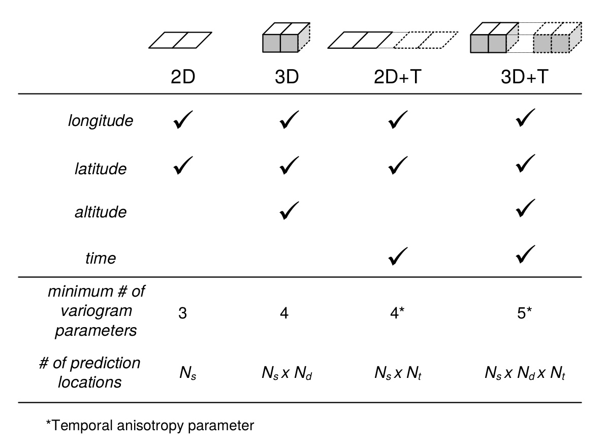
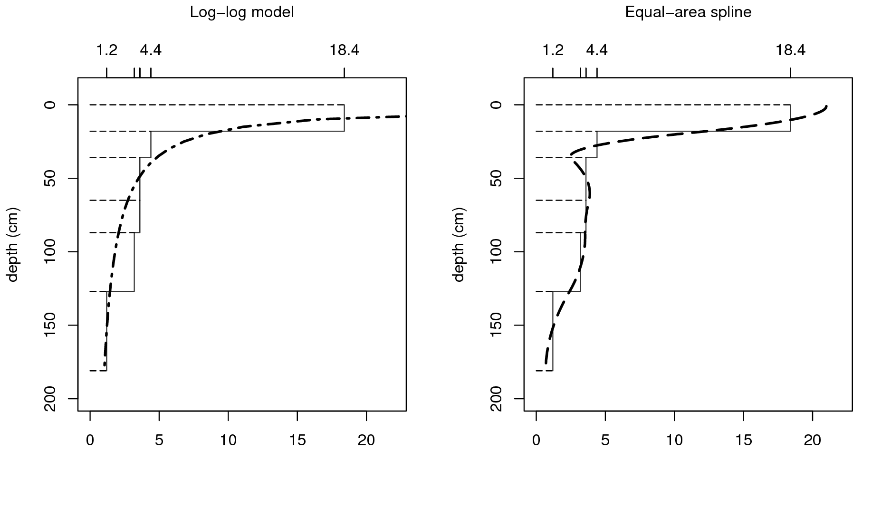
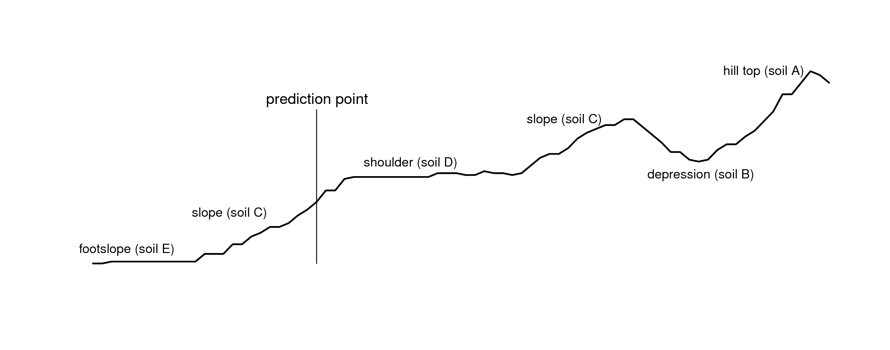
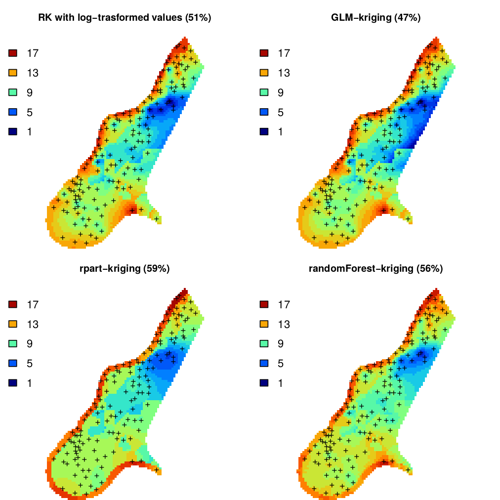
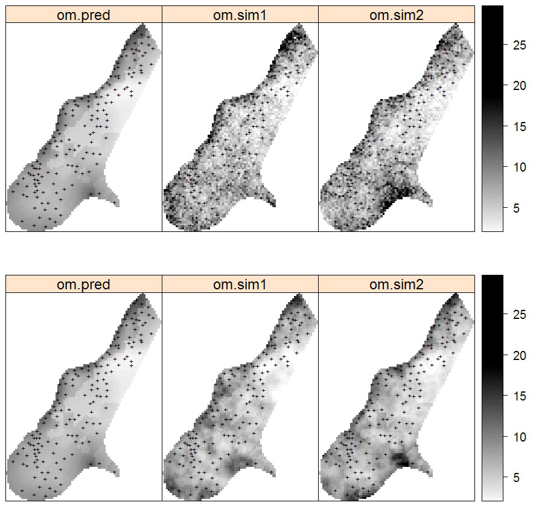
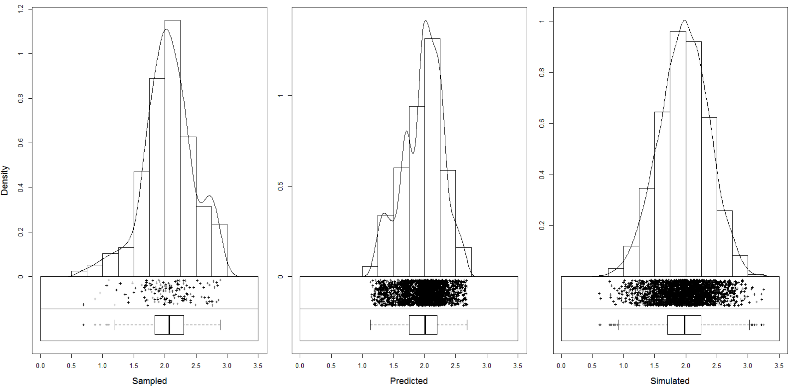
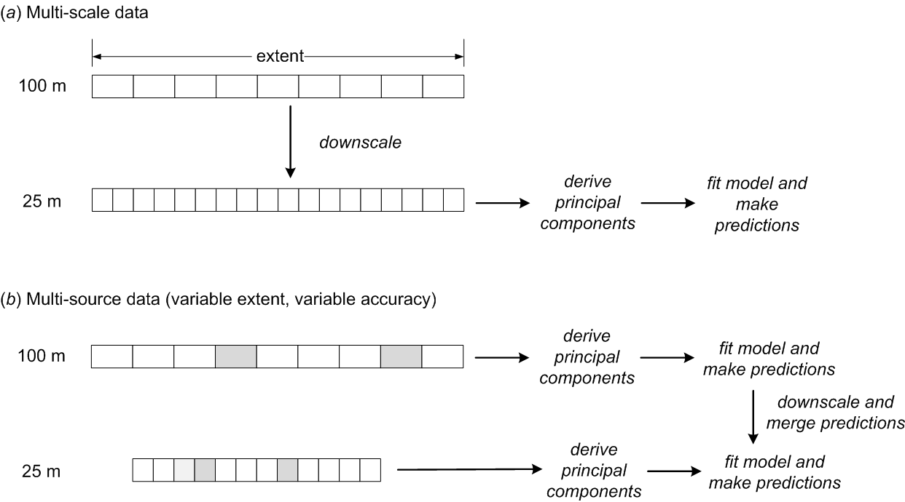
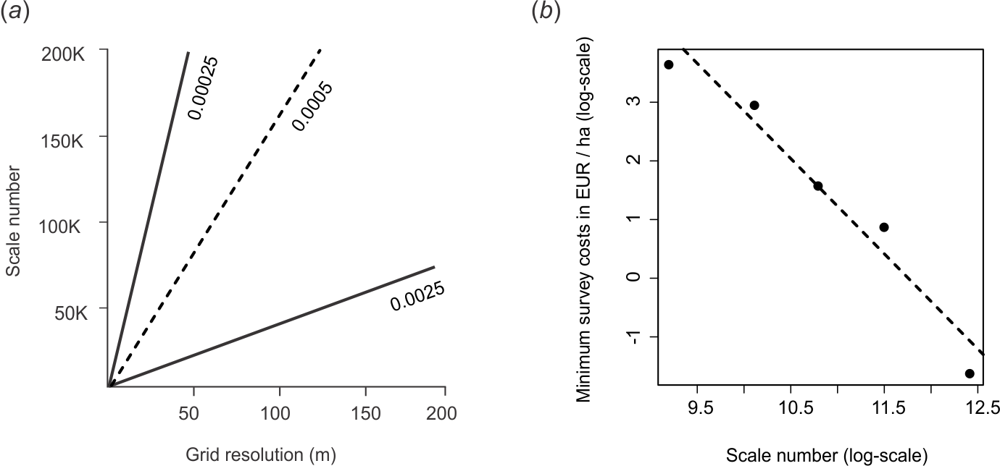
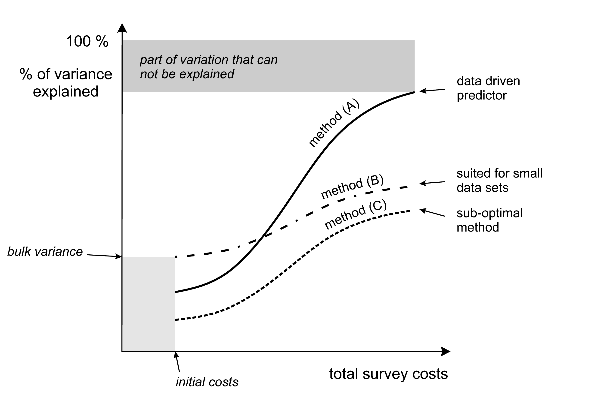

# Statistical theory for predictive soil mapping {#statistical-theory}

*Edited by: Hengl T. and Heuvelink G.B.M.*


## Aspects of spatial variability of soil variables {#aspects-variability}

In this chapter we review the statistical theory for soil
mapping. We focus on models considered most suitable for practical
implementation and use with soil profile data and gridded covariates,
and we provide the mathematical-statistical details of the selected
models. We start by revisiting some basic statistical aspects of soil
mapping, and conclude by illustrating a proposed framework for reproducible,
semi-automated mapping of soil variables using simple, real-world
examples.

The code and examples are provided only for illustration. More complex predictive modeling 
is described in section \@ref(soilmapping-using-mla). To install and optimize 
all packages used in this chapter please refer to section \@ref(Rstudio).

### Modelling soil variability

Soils vary spatially in a way that is often only partially understood.
The main (deterministic) causes of soil spatial variation are the
well-known causal factors — climate, organisms, relief, parent
material and time — but how these factors jointly shape the soil over time is a
very complex process that is (still) extremely difficult to model
mechanistically. Moreover, mechanistic modelling approaches require
large sets of input data that are realistically not available in practice. Some
initial steps have been made, notably for mechanistic modelling of
vertical soil variation (see e.g. @Finke2008462,
@Sommer2008480, @Minasny2008140, and @vanwalleghem2010spatial), but
existing approaches are still rudimentary and cannot be used for
operational soil mapping. Mainstream soil mapping therefore takes an
empirical approach in which the relationship between the soil variable
of interest and causal factors (or their proxies) is modelled
statistically, using various types of regression models. The explanatory
variables used in regression are also known as *covariates* (a list of
common covariates used in soil mapping is provided in chapter \@ref(soil-covs-chapter)).

Regression models explain only part of the variation (i.e. variance) of
the soil variable of interest, because:

-   *The structure of the regression model does not represent the true
    mechanistic relationship between the soil and its causal factors*.

-   *The regression model includes only a few of the many causal factors
    that formed the soil*.

-   *The covariates used in regression are often only incomplete proxies of the
    true soil forming factors*.

-   *The covariates often contain measurement errors and/or are measured
    at a much coarser scale (i.e. support) than that of the soil that
    needs to be mapped*.

As a result, soil spatial regression models will often display a
substantial amount of residual variance, which may well be larger than
the amount of variance explained by the regression itself. The residual
variation can subsequently be analysed on spatial structure through a
variogram analysis. If there is spatial structure, then kriging the
residual and incorporating the result of this in mapping can improve the
accuracy of soil predictions [@hengl2007regression].

### Universal model of soil variation {#umsv}

From a statistical point of view, it is convenient to distinguish
between three major components of soil variation: (1) deterministic
component (trend), (2) spatially correlated component and (3) pure
noise. This is the basis of the *universal model of soil variation*
[@Burrough1998OUP;Webster2001Wiley p.133]:

\begin{equation}
Z({\bf{s}}) = m({\bf{s}}) + \varepsilon '({\bf{s}}) + \varepsilon ''({\bf{s}})
(\#eq:ukm)
\end{equation}

where $\bf{s}$ is two-dimensional location, $m({\bf{s}})$ is the
deterministic component, $\varepsilon '({\bf{s}})$ is the spatially
correlated stochastic component and $\varepsilon ''({\bf{s}})$ is the
pure noise (micro-scale variation and measurement error). This model was
probably first introduced by @Matheron1969PhD, and has been used as a
general framework for spatial prediction of quantities in a variety of
environmental research disciplines.

```{block, type="rmdnote"}
The *universal model of soil variation* assumes that there are three
major components of soil variation: (1) the deterministic component
(function of covariates), (2) spatially correlated component (treated as
stochastic) and (3) pure noise.
```

The universal model of soil variation model (Eq.\@ref(eq:ukm)) can be
further generalised to three-dimensional space and the spatio-temporal
domain (3D+T) by letting the variables also depend on depth and time:

\begin{equation}
Z({\bf{s}}, d, t) = m({\bf{s}}, d, t) + \varepsilon '({\bf{s}}, d, t) + \varepsilon ''({\bf{s}}, d, t)
(\#eq:ukm3DT)
\end{equation}

where $d$ is depth expressed in meters downward from the land surface
and $t$ is time. The deterministic component $m$ may be further
decomposed into parts that are purely spatial, purely temporal, purely
depth-related or mixtures of all three. Space-time statistical soil
models are discussed by @Grunwald2005CRCPress, but this area of soil
mapping is still rather experimental.

In this chapter, we mainly focus on purely 2D models but also present
some theory for 3D models, while 2D+T and 3D+T models of soil variation
are significantly more complex (Fig. \@ref(fig:scheme-2D-3D-maps)).

```{r scheme-2D-3D-maps, echo=FALSE, fig.cap="Number of variogram parameters assuming an exponential model, minimum number of samples and corresponding increase in number of prediction locations for 2D, 3D, 2D+T and 3D+T models of soil variation. Here *“altitude”* refers to vertical distance from the land surface, which is in case of soil mapping often expressed as negative vertical distance from the land surface.", out.width="60%"}

```

One of the reasons why 2D+T and 3D+T models of soil variations are rare
is because there are very few point data sets that satisfy the
requirements for analysis. One national soil data set that could be
analyzed using space-time geostatistics is, for example, the Swiss
soil-monitoring network (NABO) data set [@JPLN:JPLN200900269], but even
this data set does not contain complete profile descriptions following
international standards. At regional and global scales it would be even
more difficult to find enough data to fit space-time models (and to fit
3D+T variogram models could be even more difficult). For catchments and
plots, space-time datasets of soil moisture have been recorded and used
in space-time geostatistical modelling (see e.g. @snepvangers2003soil and 
@jost2005analysing).

Statistical modelling of the spatial distribution of soils requires field
observations because most statistical methods are data-driven. The
minimum recommended number of points required to fit 2D geostatistical
models, for example, is in the range 50–100 points, but this number
increases with any increase in spatial or temporal dimension
(Fig. \@ref(fig:scheme-2D-3D-maps)). The Cookfarm data set for example
contains hundreds of thousands of observations, although the study area
is relatively small and there are only ca. 50 station locations
[@Gasch2015SPASTA].

The deterministic and stochastic components of soil spatial variation
are separately described in more detail in subsequent sections, but
before we do this, we first address soil vertical variability and how it
can be modelled statistically.

### Modelling the variation of soil with depth {#soil-depth-models}

Soil properties vary with depth, in some cases much more than in the
horizontal direction. There is an increasing awareness that the vertical
dimension is important and needs to be incorporated in soil mapping. For
example, many spatial prediction models are built using ambiguous
vertical reference frames such as predicted soil property for
*“top-soil”* or *“A-horizon”*. Top-soil can refer to different depths /
thicknesses and so can the A-horizon range from a few centimeters to
over one meter. Hence before fitting a 2D spatial model to soil profile
data, it is a good idea to standardize values to standard depths,
otherwise soil observation depth becomes an additional source of
uncertainty. For example soil organic carbon content is strongly
controlled by soil depth, so combining values from two A horizons one
thick and the other thin, would increase the complexity of 2D soil mapping
because a fraction of the variance is controlled by the depth, which is
ignored.

The concept of perfectly homogeneous soil horizons is often too
restrictive and can be better replaced with continuous representations
of soil vertical variation i.e. *soil-depth functions* or curves.
Variation of soil properties with depth is typically modelled using one
of two approaches (Fig. \@ref(fig:soil-depth-examples)):

1.  *Continuous vertical variation* — This assumes that soil variables
    change continuously with depth. The soil-depth relationship is
    modelled using either:

    1.  *Parametric model* — The relationship is modelled using
        mathematical functions such as logarithmic or exponential
        decay functions.

    2.  *Non-parametric model* — The soil property changes continuously
        but without obvious regularity with depth. Changes in values are
        modelled using locally fitted functions such as piecewise linear
        functions or splines.

2.  *Abrupt or stratified vertical variation* — This assumes that soil
    horizons are distinct and homogeneous bodies of soil material and
    that soil properties are constant within horizons and change
    abruptly at boundaries between horizons.

Combinations of the two approaches are also possible, such as the use of
exponential decay functions per soil horizon [@Kempen2011Geoderma].

Parametric continuous models are chosen to reflect pedological knowledge
e.g. knowledge of soil forming processes. For example, organic carbon
usually originates from plant production i.e. litter or roots. Generally,
the upper layers of the soil tend to have greater organic carbon
content, which decreases continuously with depth, so that the soil-depth
relationship can be modelled with a negative-exponential function:

\begin{equation}
{\texttt{ORC}} (d) = {\texttt{ORC}} (d_0) \cdot \exp(-\tau \cdot d)
(\#eq:SOMdepth)
\end{equation}  

where $\texttt{ORC}(d)$ is the soil organic carbon content at depth
($d$), ${\texttt{ORC}} (d_0)$ is the organic carbon content at the soil
surface and $\tau$ is the rate of decrease with depth. This model has
only two parameters that must be chosen such that model averages over
sampling horizons match those of the observations as closely as
possible. Once the model parameters have been estimated, we can easily
predict concentrations for any depth interval.

Consider for example this sample profile from Nigeria:

```{r}
lon = 3.90; lat = 7.50; id = "ISRIC:NG0017"; FAO1988 = "LXp" 
top = c(0, 18, 36, 65, 87, 127) 
bottom = c(18, 36, 65, 87, 127, 181)
ORCDRC = c(18.4, 4.4, 3.6, 3.6, 3.2, 1.2)
munsell = c("7.5YR3/2", "7.5YR4/4", "2.5YR5/6", "5YR5/8", "5YR5/4", "10YR7/3")
## prepare a SoilProfileCollection:
prof1 <- plyr::join(data.frame(id, top, bottom, ORCDRC, munsell), 
         data.frame(id, lon, lat, FAO1988), type='inner') 
prof1$mdepth <- prof1$top+(prof1$bottom-prof1$top)/2
```

we can fit a log-log model by using e.g.:

```{r}
d.lm <- glm(ORCDRC ~ log(mdepth), data=prof1, family=gaussian(log))
options(list(scipen=3, digits=2))
d.lm$fitted.values
```

which shows that the log-log fit comes relatively close to the actual values. 
Another possibility would be to fit a power-law model:

\begin{equation}
{\texttt{ORC}} (d) = a \cdot d^b
(\#eq:loglog)
\end{equation} 

A disadvantage of a single parametric soil property-depth model along
the entire soil profile is that these completely ignore stratigraphy and
abrupt changes at the boundaries between soil horizons. For example,
@Kempen2011Geoderma show that there are many cases where highly
contrasting layers of peat can be found buried below the surface due to
cultivation practices or holocene drift sand. The model given by
Eq.\@ref(eq:loglog) illustrated in Fig. \@ref(fig:soil-depth-examples)
(left) will not be able to represent such abrupt changes.

```{block, type="rmdnote"}
Before fitting a 2D spatial prediction model to soil profile data, it is
important to standardize values to standard depths, otherwise soil
observation depth can be an additional source of uncertainty.
```

Non-parametric soil-depth functions are more flexible and can represent
observations of soil property averages for sampling layers or horizons
more accurately. One such technique that is particularly interesting is
*equal-area or mass-preserving splines*
[@Bishop1999Geoderma; @Malone2009Geoderma] because it ensures that, for
each sampling layer (usually a soil horizon), the average of the spline
function equals the measured value for the horizon. Disadvantages of the
spline model are that it may not fit well if there are few observations
along the soil profile and that it may create unrealistic values
(through overshoots or extrapolation) in some instances, for example
near the surface. Also, mass-preserving splines cannot accommodate
discontinuities unless, of course, separate spline functions are fitted
above and below the discontinuity.

```{r soil-depth-examples, echo=FALSE, fig.cap="Vertical variation in soil carbon modelled using a logarithmic function (left) and a mass-preserving spline (right) with abrupt changes by horizon ilustrated with solid lines.", out.width="100%"}

```

To fit mass preserving splines we can use:

```{r}
library(aqp)
library(rgdal)
library(GSIF)
prof1.spc <- prof1
depths(prof1.spc) <- id ~ top + bottom
site(prof1.spc) <- ~ lon + lat + FAO1988 
coordinates(prof1.spc) <- ~ lon + lat
proj4string(prof1.spc) <- CRS("+proj=longlat +datum=WGS84")
## fit a spline:
ORCDRC.s <- mpspline(prof1.spc, var.name="ORCDRC")
ORCDRC.s$var.std
```

where `var.std` shows average fitted values for standard depth intervals
(i.e. those given in the *GlobalSoilMap* specifications), and `var.1cm`
are the values fitted at 1–cm increments
(Fig. \@ref(fig:soil-depth-examples)). 

A disadvantage of using mathematical functions to convert soil
observations at specific depth intervals to continuous values along the
whole profile is that these values are only estimates with associated
estimation errors. If estimates are treated as if these were
observations then an important source of error is ignored, which may
jeopardize the quality of the final soil predictions and in particular
the associated uncertainty (see further
Section \@ref(accuracy-assessment)). This problem can be avoided 
by taking, for example, a 3D modelling approach
[@poggio2014national; @Hengl2015AfSoilGrids250m], in which model
calibration and spatial interpolation are based on the original soil
observations directly (although proper use of this requires that the
differences in vertical support between measurements are taken into
account also). We will address this also in later sections of this
chapter, among others in Section \@ref(prediction-3D).

```{block, type="rmdnote"}
Soil property-depth relationships are commonly modelled using various
types of mathematical functions. Mass-preserving splines, which ensure
that the average of the spline function equals the measured value for
each sampling layer or horizon, can be used to convert measurements per
layer to point values along the profile. Because soils can show both
abrupt and continuous transitions within the same profile, no simple
spline model is universally valid and case-dependent adjustments often
need to be made.
```

### Vertical aggregation of soil properties {#vertical-aggregation}

As mentioned previously, soil variables refer to aggregate values over
specific depth intervals (see Fig. \@ref(fig:soil-depth-examples)).
For example, the organic carbon content is typically observed per soil
horizon with values in e.g. g/kg or permilles
[@Conant2010; @Rainer2010; @Panagos2013439]. The *Soil Organic Carbon
Storage* (or *Soil Organic Carbon Stock*) in the whole profile can be
calculated by using Eq \@ref(eq:ocs). Once we have determined soil
organic carbon storage ($\mathtt{OCS}$) per horizon, we can derive the
total organic carbon in the soil by summing over all ($H$) horizons:

\begin{equation}
\mathtt{OCS} = \sum\limits_{h = 1}^H { \mathtt{OCS}_h }
(\#eq:ORGCsum)
\end{equation}

Obviously, the horizon-specific soil organic carbon content
($\mathtt{ORC}_h$) and total soil organic carbon content
($\mathtt{OCS}$) are NOT the same variables and need to be analysed and
mapped separately.

In the case of pH ($\mathtt{PHI}$) we usually do not aim at estimating
the actual mass or quantity of hydrogen ions. To represent a soil
profile with a single number, we may take a weighted mean of the
measured pH values per horizon:

\begin{equation}
\mathtt{PHI} = \sum\limits_{h = 1}^H { w_h \cdot \mathtt{PHI}_h }; \qquad \sum\limits_{h = 1}^H{w_h} = 1
(\#eq:pHmean)
\end{equation}

where the weights can be chosen proportional to the horizon thickness:

\begin{equation}
w _h  = \frac{{\mathtt{HSIZE}_h}}{\sum\limits_{h = 1}^H {{\mathtt{HSIZE}}_h}}
\end{equation}

Thus, it is important to be aware that all soil variables: (A) can be
expressed as relative (percentages) or absolute (mass / quantities)
values, and (B) refer to specific horizons or depth intervals or to the
whole soil profile. 

Similar *support*-effects show up in the horizontal,
because soil observations at *point* locations are not the same as
average or *bulk soil samples* taken by averaging a large number of
point observations on a site or plot [@Webster2001Wiley].

```{block, type="rmdnote"}
Soil variables can refer to a specific depth interval or to the whole
profile. The differences in spatial patterns between variables
representing fundamentally the same feature (e.g. soil organic carbon in
of a specific soil horizon or soil layer and total organic carbon stock
in of the whole profile), but at different spatial and vertical support,
can be significant.
```

In order to avoid misinterpretation of the results of mapping, we
recommend that any delivered map of soil properties should specify the
support size in the vertical and lateral directions, the analysis method
(detection limit) and measurement units. Such information can be
included in the metadata and/or in any key visualization or plot.
Likewise, any end-user of soil data should specify whether estimates of
the relative or total organic carbon, aggregated or at 2D/3D point
support are required.

## Spatial prediction of soil variables

### Main principles

*“Pragmatically, the goal of a model is to predict, and at the same time
scientists want to incorporate their understanding of how the world
works into their models”* [@cressie2011statistics]. In general terms,
spatial prediction consists of the following seven steps
(Fig. \@ref(fig:general-sp-process)):

1.  *Select the target variable, scale (spatial resolution) and
    associated geographical region of interest*;

2.  *Define a model of spatial variation for the target variable*;

3.  *Prepare a sampling plan and collect samples and relevant
    explanatory variables*;

4.  *Estimate the model parameters using the collected data*;

5.  *Derive and apply the spatial prediction method associated with the
    selected model*;

6.  *Evaluate the spatial prediction outputs and collect new data / run
    alternative models if necessary*;

7.  *Use the outputs of the spatial prediction process for decision
    making and scenario testing*.

```{r general-sp-process, echo=FALSE, fig.cap="From data to knowledge and back: the general spatial prediction scheme applicable to many environmental sciences.", out.width="85%"}
knitr::include_graphics("figures/Fig_general_SP_process.png")
```

The spatial prediction process is repeated at all nodes of a grid
covering $D$ (or a space-time domain in case of spatiotemporal
prediction) and produces three main outputs:

1.  Estimates of the model parameters (e.g., regression coefficients and
    variogram parameters), i.e. the **model**;

2.  Predictions at new locations, i.e. a **prediction map**;

3.  Estimate of uncertainty associated with the predictions, i.e. a
    **prediction error variance map**.

It is clear from Fig. \@ref(fig:general-sp-process) that
the key steps in the mapping procedure are: (a) *choice of the sampling scheme*, 
(b) *choice of the model of spatial variation*, and 
(c) *choice of the parameter estimation technique*. When the sampling scheme is
given and cannot be changed, the focus of optimization of the spatial
prediction process is then on selecting and fine-tuning the best
performing spatial prediction method.

In a geostatistical framework, spatial prediction is estimation of
values of some target variable $Z$ at a new location (${\bf{s}}_0$)
given the input data:

\begin{equation}
\hat Z({\bf{s}}_0) = E\left\{ Z({\bf{s}}_0)|z({\bf{s}}_i), \; {\bf{X}}({\bf{s}}_0), \; i=1,...,n \right\}
(\#eq:sp)
\end{equation}

where the $z({\bf{s}}_i)$ are the input set of observations of the
target variable, ${\bf{s}}_i$ is a geographical location, $n$ is the
number of observations and ${\bf{X}}({\bf{s}}_0)$ is a list of
*covariates* or explanatory variables, available at all prediction
locations within the study area of interest (${\bf{s}} \in \mathbb{A}$).
To emphasise that the model parameters also influence the outcome of the
prediction process, this can be made explicit by writing
[@cressie2011statistics]:

\begin{equation}
[Z|Y,{\bf{\theta}} ]
(\#eq:datamodel)
\end{equation}

where $Z$ is the data, $Y$ is the (hidden) process that we are
predicting, and ${\bf{\theta}}$ is a list of model parameters (e.g.
trend coefficients and variogram parameters).

There are many spatial prediction methods for generating spatial
predictions from soil samples and covariate information. All differ in
the underlying statistical model of spatial variation, although this
model is not always made explicit and different methods may use the same
statistical model. A review of currently used digital soil mapping
methods is given, for example, in @McBratney2011HSS, while the most
extensive review can be found in @McBratney2003Geoderma and @mcbratney2018pedometrics. @LiHeap2010EI list 40+ spatial prediction / spatial interpolation
techniques. Many of the spatial prediction methods are often 
just different names for essentially the same thing — 
what is often in the statistical or mathematical literature known 
under one name, can be implemented through
different computational frameworks, and lead to different outputs
(mainly because many models are not written out in the finest detail and leave
flexibility for actual implementation).

### Soil sampling

A *soil sample* is a collection of field observations, usually
represented as points. Statistical aspects of sampling methods and
approaches are discussed in detail by @schabenberger2005statistical and
@deGruijter2006sampling, while some more practical suggestions for soil
sampling can be found in @pansu2001soil
@Webster2001Wiley, @tan2005soil, and @Legros2006SP. Some general
recommendations for soil sampling are:

1.  *Points need to cover the entire geographical area of interest and
    not overrepresent specific subareas that have much different
    characteristics than the main area.*

2.  *Soil observations at point locations should be done using
    consistent measurement methods. Replicates should ideally be taken
    to quantify the measurement error.*

3.  *Bulk sampling is recommended when short-distance spatial variation
    is expected to be large and not of interest to the map user.*

4.  *If a variogram is to be estimated then the sample size should be
    >50 and there should be sufficient point pairs with small
    separation distances.*

5.  *If trend coefficients are to be estimated then the covariates at
    sampling points should cover the entire feature space of
    each covariate.*

The sampling design or rationale used to decide where to locate soil
profile observations or sampling points is often not clear and may vary
from case to case. Therefore there is no guarantee that available legacy
point data used as input to geostatistical modelling satisfy the
recommendations listed above. Many of the legacy profile data in the
world have been selected using convenience sampling. In fact, many
points in traditional soil surveys may have been selected and sampled to
capture information about unusual conditions or to locate boundaries at
points of transition and maximum confusion about soil properties
[@Legros2006SP]. Once a soil becomes recognized as being widely
distributed and dominant in the landscape, field surveyors often choose
not to record observations when that soil is encountered, preferring to
focus instead on recording unusual sites or areas where soil transition
occurs. Thus the population of available soil point observations may not
be representative of the true population of soils, with some soils being
either over or under-represented.

```{r eberg-sampling-locs, echo=FALSE, fig.cap="Occurrence probabilities derived for the actual sampling locations (left), and for a purely random sample design with exactly the same number of points (right). Probabilities derived using the `spsample.prob` function from the package. The shaded area on the left indicates which areas (in the environmental space) have been systematically represented, while the white colour indicates areas which have been systematically omitted (and which is not by chance).", out.width="100%"}
knitr::include_graphics("figures/Fig_eberg_sampling_locs.png")
```

Fig. \@ref(fig:eberg-sampling-locs) (the Ebergötzen study area)
illustrates a problem of dealing with clustered samples and omission of
environmental features. Using the actual samples shown in the plot on
the left of Fig. \@ref(fig:eberg-sampling-locs) we would like to map the
whole area inside the rectangle. This is technically possible, but the
user should be aware that the actual Ebergötzen points systematically
miss some environmental features: in this case natural forests / rolling
hills that were not of interest to the survey project. This does not
mean that the Ebergötzen point data are not applicable for
geostatistical analyses. It means that the sampling bias and
under-representation of specific environmental conditions will lead to
spatial predictions that may be biased and highly uncertain under these
conditions [@Brus2007Geoderma].

### Knowledge-driven soil mapping {#sec:expertsystems}

As mentioned previously in section \@ref(tacit-knowledge), knowledge-driven
mapping is often based on unstated and unformalized rules and
understanding that exists mainly in the minds and memories of the
individual soil surveyors who conducted field studies and mapping.
Expert, or knowledge-based, information can be converted to mapping
algorithms by converting conceptual rules to decision trees and/or
statistical models [@MacMillan2005CJSS; @Walter2006DSS; @Liu2009].
For example, a surveyor can define the classification rules
subjectively, i.e. based on his/her knowledge of the area, then
iteratively adjust the model until the output maps fit his/her
expectation of the distribution of soils.

In areas where few or no field observations of soil properties are
available the most common way to produce estimates is to rely on expert
knowledge, or to base estimates on data from other, similar areas. This
is a *‘knowledge transfer’* system. The best example of a knowledge
transfer system is the concept of *soil series* in the USA
[@Simonson1968AA]. Soil series (+phases) are the lowest level classes of
soil types typically mapped. Each soil series should consist of pedons
having soil horizons that are similar in colour, texture, structure, pH,
consistence, mineral and chemical composition, and arrangement in the
soil profile.

If one finds the same type of soil series repeatedly at similar
locations, then there is no need to sample the soil again at additional,
similar, locations and, consequently, soil survey field costs can be
reduced. This sounds like an attractive approach because one can
minimize the survey costs by focusing on delineating the distribution of
soil series only. The problem is that there are >15,000 soil series in the
USA [@Smith1986SMSS], which obviously means that it is not easy to
recognize the same soil series just by doing rapid field observations.
In addition, the accuracy with which one can recognize a soil series may
well fail on standard kappa statistics tests, indicating that there may
be substantial confusion between soil series (e.g. large measurement
error).

Large parts of the world basically contain few field records and hence
one will need to *improvise* to be able to produce soil predictions. One
idea to map such areas is to build attribute tables for representative
soil types, then map the distribution of these soil types in areas
without using local field samples. @Mallavan2010PSS refer to soil
classes that can be predicted far away from the actual sampling
locations as *homosoils*. The homosoils concept is based on the
assumption that locations that share similar soil-forming factors are
likely to exhibit similar soils and soil properties also.

```{r cross-section-catena, echo=FALSE, fig.cap="Landform positions and location of a prediction point for the Maungawhau data set.", out.width="100%"}

```

Expert-based systems also rely on using standard mapping paradigms such
as the concept of soil series and the catena concept.
Fig. \@ref(fig:cross-section-catena), for example, shows a cross-section
derived using the elevation data in Fig. \@ref(fig:catena-maungawhau-3d). An
experienced soil surveyor would visit the area and produce a diagram
showing a sequence of soil types along a cross-section. This expert
knowledge can be further converted to a mapping system, provided that it
is representative of the area, that it can be formalized through
repeatable procedures and that it can be tested using real observations.

```{r catena-maungawhau-3d, echo=FALSE, fig.cap="A cross-section for the Maungawhau volcano dataset commonly used in R to illustrate DEM and image analysis techniques.", out.width="80%"}
knitr::include_graphics("figures/Fig_catena_Maungawhau_A.jpg")
```

```{r catena-maungawhau, echo=FALSE, fig.cap="Associated values of DEM-based covariates: TWI — Topographic Wetness Index and Valley depth for the cross-section from the previous figure.", out.width="100%"}
knitr::include_graphics("figures/Fig_catena_Maungawhau_B.png")
```

If some auxiliary information such as a Digital Elevation Model (DEM) is
available for the study area, one can derive a number of DEM parameters
that can help to quantify landforms and geomorphological processes.
Landforms can also automatically be derived by computing various DEM
parameters per pixel, or by using knowledge from
Fig. \@ref(fig:catena-maungawhau) (sample of the study area) to
objectively extract landforms and associated soils in an area. Such
auxiliary landform information can be informative about the spatial
distribution of the soil, which is the key principle of, for example,
the SOTER methodology [@VanEngelen2012].

The mapping process of knowledge-driven soil mapping can be summarized
as follows [@MacMillan2005CJSS; @MacMillan2010DSM]:

1.  *Sample the study area using cross-sections*;

2.  *Assign soil types to each landform position or at each sample location*;

3.  *Derive DEM parameters and other auxiliary data sets*;

4.  *Develop (fuzzy) rules relating the distribution of soil classes to the auxiliary variables*;

5.  *Implement (fuzzy) rules to allocate soil classes (or compute memberships) to each grid location*;

6.  *Generate soil property values for each soil class using representative observations (class centers)*;

7.  *Estimate values of the target soil variable at grid locations using allocated soil class or membership values and central soil property values for each soil class*;

In mathematical terms, soil property prediction based on fuzzy soil
classification values using the SOLIM approach @Zhu2001
[@Zhu2010Geoderma] works as follows:

\begin{equation}
\begin{aligned}
 \hat z({\bf{s}}_0) = \sum\limits_{c_j = 1}^{c_p} {\nu _{c_j} ({\bf{s}}_0) \cdot z_{c_j} }; & \hspace{.6cm}
 \sum\limits_{c_j = 1}^{c_p} {\nu _j ({\bf{s}}_0)}  = 1\end{aligned}
(\#eq:solim)
\end{equation}

where $\hat z({\bf{s}}_0)$ is the predicted soil attribute at
${\bf{s}}_0$, $\nu _{c_j} ({\bf{s}}_0)$ is the membership value of class
$c_j$ at location ${\bf{s}}_0$, and $z_{c_j}$ is the modal (or best
representative) value of the inferred soil attribute of the $c_j$-th
category. The predicted soil attribute is mapped directly from
membership maps using a linear additive weighing function. Consider the
example of six soil classes `A`, `B`, `C`, `D`, `E` and `F`. The
attribute table indicates that soil type `A` has 10%, `B` 10%, `C` 30%,
`D` 40%, `E` 25%, and `F` 35% of clay. If the membership values at a
grid position are 0.6, 0.2, 0.1, 0.05, 0.00 and 0.00, then
Eq.\@ref(eq:solim) predicts the clay content as 13.5%.

It is obvious from this work flow that the critical aspects that
determine the accuracy of the final predictions are the selection of
where we locate the cross-sections and the *representative soil
profiles* and the strength of the relationship between the resulting
soil classes and target soil properties. @Qi2006Geoderma, for example,
recommended that representative values for soil classes can be
identified, if many soil profiles are available, by finding the sampling
location that is in the grid cell with highest similarity value for a
particular soil class. Soil mappers are now increasingly looking for
ways to combine expert systems with statistical data mining and
regression modelling techniques.

One problem of using a supervised mapping system as described above is
that it is difficult to get an objective estimate of the prediction
error (or at least a robust statistical theory has not yet been
adopted). The only possibility to assess the accuracy of such maps would
be to collect independent validation samples and estimate the mapping
accuracy following the methods described in
section \@ref(accuracy-assessment). So in fact, also expert-based
systems depend on statistical sampling and inference for evaluation of
the accuracy of the resulting map.

### Geostatistics-driven soil mapping (pedometric mapping) {#regression-kriging}

Pedometric mapping is based on using statistical models to predict soil
properties, which leads us to the field of geostatistics. Geostatistics
treats the soil as a realization of a *random process*
[@Webster2001Wiley]. It uses the observations and covariates to predict
the random process at unobserved locations, which yields conditional
probability distributions, whose spread (i.e. standard deviation, width
of prediction intervals) explicitly characterizes the uncertainty
associated with the predictions. As mentioned previously in
section \@ref(pedometric-mapping), geostatistics is a data-driven approach to
soil mapping in which georeferenced point samples are the key input to
map production.

Traditional geostatistics has basically been identified with various
ways of variogram modeling and kriging [@Haining2010GEAN780].
Contemporary geostatistics extends linear models and plain kriging
techniques to non-linear and hybrid models; it also extends purely
spatial models (2D) to 3D and space-time models
[@schabenberger2005statistical; @Bivand2008Springer; @Diggle2007Springer; @cressie2011statistics].
Implementation of more sophisticated geostatistical models for soil
mapping is an ongoing activity and is quite challenging
(computationally), especially in the case of fine-resolution mapping of
large areas [@Hengl2017SoilGrids250m].

Note also that geostatistical mapping is often restricted to
quantitative soil properties. Soil prediction models that predict
categorical soil variables such as soil type or soil colour class are
often quite complex (see e.g. @Hengl2007Geoderma and @Kempen2009Geoderma
for a discussion). The *GlobalSoilMap* specifications also require
predictions in 3D, or at least 2D predictions (layers) for several depth
intervals. This can be done by treating each layer separately in a 2D
analysis, possibly by taking vertical correlations into account, but
also by direct 3D geostatistical modelling. Both approaches are reviewed
in the following sections.

Over the last decade statisticians have recommended using 
*model-based geostatistics* as the most reliable framework for spatial predictions. 
The essence of model-based statistics is that *“the statistical methods 
are derived by applying general principles of statistical inference based 
on an explicitly declared stochastic model of the data generating mechanism”*
[@Diggle2007Springer; @Brown2014JSS]. This avoids *ad hoc*, heuristic
solution methods and has the advantage that it yields generic and
portable solutions. Some examples of diverse geostatistical models are
given in @Brown2014JSS.

The basic geostatistical model treats the soil property of interest as
the sum of a deterministic trend and a stochastic residual
(Eq.\@ref(eq:ukm)):

\begin{equation}
Z({\bf{s}}) = m({\bf{s}}) + \varepsilon({\bf{s}})
(\#eq:ukm-gstat)
\end{equation}

where $\varepsilon$ and hence $Z$ are normally distributed stochastic
processes. This is the same model as that presented in Eq.\@ref(eq:ukm),
with in this case $\varepsilon = \varepsilon ' + \varepsilon ''$ being
the sum of the spatially correlated and spatially uncorrelated
stochastic components. The mean of $\varepsilon$ is taken to be zero.
Note that we use capital letter $Z$ because we use a probabilistic
model, i.e. we treat the soil property as an outcome of a stochastic
process and define a model of that stochastic process. 
Ideally, the spatial variation of the stochastic residual 
of Eq.\@ref(eq:ukm-gstat) is much less than that of
the dependent variable.

When the assumption of normality is not realistic, such as when the
frequency distribution of the residuals at observation locations is very
skewed, the easiest solution is to take a Transformed Gaussian approach
[@Diggle2007Springer $\S$3.8] in which the Gaussian geostatistical model
is formulated for a transformation of the dependent variable (e.g.
logarithmic, logit, square root, Box-Cox transform). A more advanced
approach would drop the normal distribution approach entirely and assume
a *Generalized Linear Geostatistical Model*
[@Diggle2007Springer; @Brown2014JSS] but this complicates the
statistical analysis and prediction process dramatically. The
Transformed Gaussian approach is nearly as simple as the Gaussian
approach although the back-transformation requires attention, especially
when the spatial prediction includes a change of support (leading to block kriging). 
If this is the case, it may be necessary to
use a stochastic simulation approach and derive the predictions and
associated uncertainty (i.e. the conditional probability distribution)
using numerical simulations.

Model-based geostatistics is based on using an explicitly declared
stochastic model of the data generating mechanism. One basic
geostatistical model of soil variation is to treat the soil property of
interest as the sum of a deterministic trend (modelled via some
regression function) and a zero-mean stochastic residual.

The trend part of Eq.\@ref(eq:ukm-gstat) (i.e. $m$) can take many forms.
In the simplest case it would be a constant but usually it is taken as
some function of known, exhaustively available covariates. This is where
soil mapping can benefit from other sources of information and can
implement Jenny’s *State Factor Model of soil formation*
[@Jenny1968; @jenny1994factors; @Heuvelink2001Geoderma; @McBratney2011HSS], 
which is already known from the time of Dokuchaev [@Florinsky2012Dokuchaev].
The covariates are often maps of environmental properties that are known
to be related to the soil property of interest (e.g. elevation, land
cover, geology) but could also be the outcome of a mechanistic soil
process model (such as a soil acidification model, a soil nutrient
leaching model or a soil genesis model). In the case of the latter one
might opt for taking $m$ equal to the output of the deterministic model,
but when the covariates are related environmental properties one must
define a structure for $m$ and introduce parameters to be estimated from
paired observations of the soil property and covariates. One of the
simplest approaches is to use *multiple linear regression* to predict
values at some new location ${\bf{s}}_0$ [@kutner2005applied]:

\begin{equation}
m({\bf{s}}_0 ) = \sum\limits_{j = 0}^p { \beta _j \cdot X_j ({\bf{s}}_0 )}
(\#eq:MRK2D)
\end{equation}

where $\beta _j$ are the regression model coefficients, $\beta _0$ is
the intercept, $j=1,\ldots,p$ are *covariates* or explanatory variables
(available at all locations within the study area of interest
$\mathbb{A}$), and $p$ is the number of covariates. Eq.\@ref(eq:MRK2D)
can also include categorical covariates (e.g. maps of land cover,
geology, soil type) by representing these by as many binary dummy
variables as there are categories (minus one, to be precise, since an
intercept is included in the model). In addition, transformed covariates
may be included or interactions between covariates. The latter is
achieved by extending the set of covariates with products or other
mixtures of covariates. However, note that this will dramatically
increase the number of covariates. The risk of offering a large number
of covariates is that it may become difficult to obtain reliable
estimates of the regression coefficients, also because one may run the
risk of *multicollinearity* — property of covariates being mutually
strongly correlated (as indicated by @Jenny1968 already in
[-@Jenny1968]).

The advantage Eq.\@ref(eq:MRK2D) is that it is linear in the unknown
coefficients, which makes their estimation relatively straightforward
and also permits derivation of the uncertainty about the regression
coefficients ($\beta$). However, in many practical cases the linear
formulation may be too restrictive and that is why alternative
structures to establish the relationship between the dependent and
covariates have been extensively developed. Examples of these so-called
*‘statistical learning’* and/or *‘machine learning’* approaches are:

-   *artificial neural networks* [@yegnanarayana2004artificial],

-   *classification and regression trees* [@breiman1993classification],

-   *support vector machines* [@hearst1998support],

-   *computer-based expert systems*,

-   *random forests* [@breiman2001random; @meinshausen2006quantile],

Statistical treatment of many of these methods is given in @hastie2009elements.
Care needs to be taken when using machine learning techniques such as random forest 
because such techniques are more sensitive to noise and blunders in 
the data .

Most methods listed above require appropriate levels of expertise to
avoid pitfalls and incorrect use, but when feasible and used properly
these methods should extract maximal information about the target
variable from the covariates [@Statnikov2008; @kanevski2009machine]. 

The trend ($m$) relates covariates to soil properties and for this it
uses a soil-environment correlation model — the so-called *CLORPT
model*, which was formulated by Jenny in 1941 (a [-@jenny1994factors]
reprint from that book is also available). @McBratney2003Geoderma
further formulated an extension of the CLORPT model 
known as the *“SCORPAN”* model.

The CLORPT model may be written as [@jenny1994factors; @Florinsky2012Dokuchaev]:

\begin{equation}
S = f (cl, o, r, p, t)
(\#eq:clorpt)
\end{equation}

where $S$ stands for soil (properties and classes), $cl$ for climate,
$o$ for organisms (including humans), $r$ is relief, $p$ is parent
material or geology and $t$ is time. In other words, we can assume that
distribution of both soil and vegetation (at least in a natural system)
can be at least partially explained with environmental conditions.
Eq.\@ref(eq:clorpt) suggests that soil is a resultant of environmental
factors, while in reality there are many feedbacks and soil influences
many of the factors on the right-hand side of Eq.\@ref(eq:clorpt), such
as $cl$, $o$ and $r$.

Uncertainty about the estimation errors of model coefficients can fairly
easily be taken into account in the subsequent prediction analysis if
the model is linear in the coefficients, such as in Eq.\@ref(eq:MRK2D).
In this book we therefore restrict ourselves to this case but allow that
the $X_j$’s in Eq.\@ref(eq:MRK2D) are derived in various ways.

Since the stochastic residual of Eq.\@ref(eq:ukm-gstat) is normally
distributed and has zero mean, only its variance-covariance remains to
be specified:

\begin{equation}
C\left[Z({\bf{s}}),Z({\bf{s}}+\bf{h})\right] = \sigma (\bf{s}) \cdot \sigma(\bf{s}+\bf{h}) \cdot \rho (\bf{h})
\end{equation}

where ${\bf{h}}$ is the separation distance between two locations. Note
that here we assumed that the correlation function $\rho$ is invariant
to geographic translation (i.e., it only depends on the distance
$\bf{h}$ between locations and not on the locations themselves). If in
addition the standard deviation $\sigma$ would be spatially invariant
then $C$ would be *second-order stationary*. These type of simplifying
assumptions are needed to be able to estimate the variance-covariance
structure of $C$ from the observations. If the standard deviation is
allowed to vary with location, then it could be defined in a similar way
as in Eq.\@ref(eq:MRK2D). The correlation function $\rho$ would be
parameterised to a common form (e.g. exponential, spherical, Matérn),
thus ensuring that the model is statistically valid and
*positive-definite*. It is also quite common to assume isotropy, meaning
that two-dimensional geographic distance ${\bf{h}}$ can be reduced to
one-dimensional Euclidean distance $h$.

Once the model has been defined its parameters must be estimated from
the data. These are the regression coefficients of the trend (when
applicable) and the parameters of the variance-covariance structure of
the stochastic residual. Commonly used estimation methods are least
squares and maximum likelihood. Both methods have been extensively
described in the literature (e.g. @Webster2001Wiley and
@Diggle2007Springer). More complex trend models may also use the same
techniques to estimate their parameters, although they might also need
to rely on more complex parameter estimation methods such as genetic
algorithms and *simulated annealing* [@lark2003fitting].

```{block, type="rmdnote"}
Spatial prediction under the linear Gaussian model with a trend boils
down to *regression-kriging* when the trend coefficients are determined
prior to kriging i.e. to *universal kriging* or *kriging with external drift* when they are estimated together with kriging weights. Both
computational approaches — regression-kriging, kriging with external
drift or universal kriging — yield exactly the same predictions if run
using the same inputs and assuming the same (global) geostatistical
model [@hengl2007regression].
```

The optimal spatial prediction in the case of a model
Eq.\@ref(eq:ukm-gstat) with a linear trend Eq.\@ref(eq:MRK2D) and a
normally distributed residual is given by the well-kown *Best Linear
Unbiased Predictor* (BLUP):

$$\label{E:BLUP}
\hat z({{\bf{s}}_0}) = {\bf{X}}_{\bf{0}}^{\bf{T}}\cdot \hat{\bf{\beta}} + \hat{\bf{\lambda}}_{\bf{0}}^{\bf{T}}\cdot({\bf{z}} - {\bf{X}}\cdot \hat{\bf{\beta}} )$$

where the regression coefficients and kriging weights are estimated
using:

\begin{equation}
\begin{aligned}
\hat{\bf{\beta}}  &= {\left( {{{\bf{X}}^{\bf{T}}}\cdot{{\bf{C}}^{ - {\bf{1}}}}\cdot{\bf{X}}} \right)^{ - {\bf{1}}}}\cdot{{\bf{X}}^{\bf{T}}}\cdot{{\bf{C}}^{ - {\bf{1}}}}\cdot{\bf{z}} \\
\hat{\bf{\lambda}}_{\bf{0}} &= \bf{C}^{ - {\bf{1}}} \cdot {\bf{c}}_{\bf{0}} \notag\end{aligned}
(\#eq:betas)
\end{equation}

and where ${\bf{X}}$ is the matrix of $p$ predictors at the $n$ sampling
locations, $\hat{\bf{\beta}}$ is the vector of estimated regression
coefficients, $\bf{C}$ is the $n$$n$ variance-covariance matrix of
residuals, $\bf{c}_{\bf{0}}$ is the vector of $n$$1$ covariances at the
prediction location, and $\bf{\lambda}_{\bf{0}}$ is the vector of $n$
kriging weights used to interpolate the residuals. Derivation of BLUP
for spatial data can be found in many standard statistical books e.g.
@Stein1999Springer, @Christensen2001Springer [p.277],
@Venables2002Springer [p.425–430] and/or @schabenberger2005statistical.

Any form of kriging computes the conditional distribution of
$Z({\bf{s}}_0)$ at an unobserved location ${\bf{s}}_0$ from the
observations $z({\bf{s}}_1 )$, $z({\bf{s}}_2 ), \ldots , z({\bf{s}}_n )$
and the covariates ${\bf{X}}({\bf{s}}_0)$ (matrix of size $p \times n$).
From a statistical perspective this is straightforward for the case of a
linear model and normally distributed residuals. However, solving large
matrices and more sophisticated model fitting algorithms such as
restricted maximum likelihood can take a significant amount of time if
the number of observations is large and/or the prediction grid dense.
Pragmatic approaches to addressing constraints imposed by large data
sets are to constrain the observation data set to local neighbourhoods
or to take a multiscale nested approach.

Kriging not only yields optimal predictions but also quantifies the
prediction error with the kriging standard deviation. Prediction
intervals can be computed easily because the prediction errors are
normally distributed. Alternatively, uncertainty in spatial predictions
can also be quantified with spatial stochastic simulation. While kriging
yields the *‘optimal’* prediction of the soil property at anyone
location, spatial stochastic simulation yields a series of possible
values by sampling from the conditional probability distribution. In
this way a large number of *‘realizations’* can be generated, which can
be useful when the resulting map needs to be back-transformed or when it
is used in a spatial uncertainty propagation analysis. Spatial
stochastic simulation of the linear Gaussian model can be done using a
technique known as sequential Gaussian simulation
[@Goovaerts1997Oxford; @Yamamoto2008]. It is not, in principal, more
difficult than kriging but it is certainly numerically more demanding i.e. 
takes significantly more time to compute.

### Regression-kriging (generic model) {#RK-generic}

Ignoring the assumptions about the cross-correlation between the trend
and residual components, we can extend the regression-kriging model and
use any type of (non-linear) regression to predict values (e.g.
regression trees, artificial neural networks and other machine learning
models), calculate residuals at observation locations, fit a variogram
for these residuals, interpolate the residuals using ordinary or simple
kriging, and add the result to the predicted regression part. This means
that RK can, in general, be formulated as:

\begin{equation}
{\rm prediction} \; = \;
\begin{matrix}
{\rm trend} \; {\rm predicted} \\
{\rm using} \; {\rm regression} \end{matrix} \; + \;
\begin{matrix}
{\rm residual} \; {\rm predicted} \\
{\rm using} \; {\rm kriging} \end{matrix}
(\#eq:RKgeneral)
\end{equation}

Again, statistical inference and prediction is relatively simple if the
stochastic residual or a transformation thereof may be assumed normally
distributed. Error of the regression-kriging model is likewise a sum of the
regression and the kriging model errors. 

### Spatial Prediction using multiple linear regression

The predictor $\hat Y({{\bf s}_0})$ of $Y({{\bf s}_0})$ is
typically taken as a function of covariates and the $Y({\bf s}_i)$
which, upon substitution of the observations $y({\bf s}_i)$, yields a
(deterministic) prediction $\hat y({{\bf s}_0})$. In the case of 
multiple linear regression (MLR), model assumptions state
that at any location in $D$ the dependent variable is the sum of a
linear combination of the covariates at that location and a zero-mean
normally distributed residual. Thus, at the $n$ observation locations we
have:

\begin{equation}
{\bf Y} = {\bf X}^{{\bf T}} \cdot {\bf \beta} + {\bf \varepsilon}
(\#eq:lm)
\end{equation}

where ${\bf Y}$ is a vector of the target variable at the $n$
observation locations, ${\bf X}$ is an $n \times p$ matrix of covariates
at the same locations and ${\bf \beta}$ is a vector of $p$ regression
coefficients. The stochastic residual ${\bf \varepsilon}$ is assumed to
be independently and identically distributed. The paired observations of
the target variable and covariates (${\bf y}$ and ${\bf X}$) are used to
estimate the regression coefficients using, e.g., Ordinary Least Squares
[@Kutner2004McGraw]:

\begin{equation}
\hat{{\bf \beta}}  = \left( {{{\bf X}}^{{\bf T}} \cdot {{\bf X}}} \right)^{ - {{\bf 1}}} \cdot
{{\bf X}}^{{\bf T}} \cdot {{\bf y}}
(\#eq:ols-betas)
\end{equation}

once the coefficients are estimated, these can be used to generate a
prediction at ${\bf s}_0$:

\begin{equation}
\hat y({\bf s}_0) = {\bf x}_0^{\bf T} \cdot {\bf \hat \beta}
\end{equation}

with associated prediction error variance:

\begin{equation}
\sigma ^2 ({\bf s}_0 ) = var\left[ \varepsilon ({\bf s}_0) \right] \cdot \left[ {1 +
{\mathbf x}_0^{\rm T}  \cdot \left(
{{\mathbf X}^{\rm T}  \cdot {\mathbf X}} \right)^{ -
{\mathbf 1}}  \cdot {\mathbf x}_0 } \right]
(\#eq:ols-sigma)
\end{equation}

here, ${\mathbf x}_0$ is a vector with covariates at the prediction
location and $var\left[ \varepsilon ({\bf s}_0) \right]$ is the variance
of the stochastic residual. The latter is usually estimated by the mean
squared error (MSE):

\begin{equation}
{\mathrm{MSE}} = \frac{\sum\limits_{i = 1}^n {(y_i - \hat y_i)^2}}{n-p}
\end{equation}

The prediction error variance given by Eq.\@ref(eq:ols-sigma) is
smallest at prediction points where the covariate values are in the
center of the covariate (*‘feature’*) space and increases as predictions
are made further away from the center. They are particularly large in
case of extrapolation in feature space [@Kutner2004McGraw]. Note that
the model defined in Eq.\@ref(eq:lm) is a non-spatial model because the
observation locations and spatial-autocorrelation of the dependent
variable are not taken into account.

### Universal kriging prediction error

In the case of universal kriging, regression-kriging or Kriging with
External Drift, the prediction error is computed as
[@Christensen2001Springer]:

\begin{equation}
\hat \sigma _{\tt{UK}}^2 ({\bf{s}}_0 )  = (C_0  + C_1 ) - {\bf{c}}_{\bf{0}}^{\bf{T}}  \cdot {\bf{C}}^{ - {\bf{1}}}  \cdot
{\bf{c}}_{\bf{0}} + \left( {{\bf{X}}_{\bf{0}}  -
{\bf{X}}^{\bf{T}} \cdot {\bf{C}}^{ - {\bf{1}}} \cdot
{\bf{c}}_{\bf{0}} } \right)^{\bf{T}}  \cdot \left( {{\bf{X}}^{\bf{T}}
\cdot {\bf{C}}^{ - {\bf{1}}} \cdot {\bf{X}}} \right)^{{\bf{ - 1}}} \cdot \left( {{\bf{X}}_{\bf{0}}  - {\bf{X}}^{\bf{T}}  \cdot
{\bf{C}}^{ - {\bf{1}}} \cdot {\bf{c}}_{\bf{0}} } \right)
(\#eq:UKvar)
\end{equation}

where $C_0 + C_1$ is the sill variation (variogram parameters), $\bf{C}$
is the covariance matrix of the residuals, and ${\bf{c}}_0$ is the
vector of covariances of residuals at the unvisited location.

Ignoring the mixed component of the prediction variance in
Eq.\@ref(eq:UKvar), one can also derive a simplified regression-kriging
variance i.e. as a sum of the kriging variance and the standard error of
estimating the regression mean:

\begin{equation}
\hat \sigma _{\tt{RK}}^2 ({\bf{s}}_0) = (C_0  + C_1 ) -
{\bf{c}}_{\bf{0}}^{\bf{T}}  \cdot {\bf{C}}^{ - {\bf{1}}}  \cdot
{\bf{c}}_{\bf{0}} + {\it{SEM}}^2
(\#eq:RKvar-simple)
\end{equation}

which is the general approach used in the GSIF package.

Note that there will always be a small difference between results of
Eq.\@ref(eq:UKvar) and Eq.\@ref(eq:RKvar-simple), and this the major
disadvantage of using the general regression-kriging framework for
spatial prediction: although the predicted mean derived by using
regression-kriging or universal kriging approaches might not differ, the
estimate of the prediction variance using Eq.\@ref(eq:RKvar-simple) will
be suboptimal as it ignores product component. On the other hand, the
advantage of running separate regression and kriging predictions is
worth the sacrifice as the computing time is an order of magnitude
shorter and we have more flexibility to combine different type of
regression models with kriging when regression is run separately from
kriging [@hengl2007regression].

### Regression-kriging examples

The type of regression-kriging model explained in the previous section
can be implemented in by combining the and packages. Consider for
example the Meuse case study:

```{r}
library(gstat)
demo(meuse, echo=FALSE)
```

We can overlay the points and grids to create the regression matrix by:

```{r}
meuse.ov <- over(meuse, meuse.grid)
meuse.ov <- cbind(as.data.frame(meuse), meuse.ov)
head(meuse.ov[,c("x","y","dist","soil","om")])
```

which allows us to fit a linear model for organic carbon as a function
of distance to river and soil type:

```{r}
m <- lm(log1p(om)~dist+soil, meuse.ov)
summary(m)
```

Next, we can derive the regression residuals and fit a variogram:

```{r}
meuse.s <- meuse[-m$na.action,]
meuse.s$om.res <- resid(m)
vr.fit <- fit.variogram(variogram(om.res~1, meuse.s), vgm(1, "Exp", 300, 1))
vr.fit
```

With this, all model parameters (four regression coefficients and three
variogram parameters) for regression-kriging have been estimated and the
model can be used to generate predictions. Note that the regression
model we fitted is significant, and the remaining residuals still show
spatial auto-correlation. The nugget variation is about of the sill
variation.

Using the gstat package [@Pebesma2004CG; @Bivand2013Springer], regression and
kriging can be combined by running universal kriging or kriging with
external drift [@hengl2007regression]. First the variogram of the
residuals is calculated:

```{r}
v.s <- variogram(log1p(om)~dist+soil, meuse.s)
vr.fit <- fit.variogram(v.s, vgm(1, "Exp", 300, 1))
vr.fit
```

which gives almost the same model parameter values as the
regression-kriging above. Next, the kriging can be executed in with a
single call to the generic `krige` function:

```{r}
om.rk <- krige(log1p(om)~dist+soil, meuse.s, meuse.grid, vr.fit)
```

The package nlme fits the regression model and the variogram of the residuals
all at once [@pinheiro2009mixed]:

```{r}
library(nlme)
m.gls <- gls(log1p(om)~dist+soil, meuse.s, correlation=corExp(nugget=TRUE))
m.gls
```

In this case the regression coefficients have been estimated using
Eq.\@ref(eq:betas) i.e. via *Restricted maximum likelihood* (REML). The
advantage of fitting the regression model and spatial autocorrelation
structure at once is that both fits are adjusted: the estimation of the
regression coefficients is adjusted for spatial autocorrelation of the
residual and variogram parameters are adjusted for the adjusted trend
estimate. A disadvantage of using the nlme package is that the computational
intensity increases with the size of the data set, so for any data
set >1000 points the computation time can increase to tens of hours
of computing. On the other hand, coefficients fitted by
REML methods might not result in significantly better predictions.
Getting the most objective estimate of the model parameters is sometimes
not worth the effort, as demonstrated by @Minasny2007Geoderma.

Simultaneous estimation of regression coefficients and variogram
parameters and including estimation errors in regression coefficients
into account by using universal kriging / kriging with external drift is
more elegant from a statistical point of view, but there are
computational and other challenges. One of these is that it is difficult
to implement global estimation of regression coefficients with local
spatial prediction of residuals, which is a requirement in the case of
large spatial data sets. Also, the approach does not extend to more
complex non-linear trend models. In such cases we recommend separating
trend estimation from kriging of residuals by using the
regression-kriging approach discussed above (Eq.\@ref(eq:RKgeneral)).

### Regression-kriging examples using the GSIF package

In the package, most of the steps described above (regression modelling
and variogram modelling) used to fit regression-kriging models are
wrapped into generic functions. A regression-kriging model can be fitted
in one step by running:

```{r}
omm <- fit.gstatModel(meuse, log1p(om)~dist+soil, meuse.grid)
str(omm, max.level = 2)
```

the resulting `gstatModel` class object consists of a (1) regression
component, (2) variogram model for residual, and (3) sample variogram 
for plotting, (4) spatial locations of observations used to fit the model. To predict values of organic carbon using this model, we can run:

```{r}
om.rk <- predict(omm, meuse.grid)
om.rk
## back-transformation:
meuse.grid$om.rk <- expm1(om.rk@predicted$om + om.rk@predicted$var1.var/2)
```

```{r meuse-om-rk-glm, echo=FALSE, fig.cap="Predictions of organic carbon in percent (top soil) for the Meuse data set derived using regression-kriging with transformed values, GLM-kriging, regression tress (rpart) and random forest models combined with kriging. The percentages in brackets indicates amount of variation explained by the models.", out.width="85%"}

```

We could also have opted for fitting a GLM with a link function, which
would look like this:

```{r}
omm2 <- fit.gstatModel(meuse, om~dist+soil, meuse.grid, family=gaussian(link=log))
summary(omm2@regModel)
om.rk2 <- predict(omm2, meuse.grid)
```

or fitting a regression tree:

```{r}
omm3 <- fit.gstatModel(meuse, log1p(om)~dist+soil, meuse.grid, method="rpart")
```

or a random forest model:

```{r}
omm4 <- fit.gstatModel(meuse, om~dist+soil, meuse.grid, method="quantregForest")
```

All regression-kriging models listed above are valid and the differences
between their respective results are not likely to be large
(Fig. \@ref(fig:meuse-om-rk-glm)). Regression tree combined with
kriging (rpart-kriging) seems to produce slightly better results i.e.
smallest cross-validation error, although the difference between four
prediction methods is in fact not large (±5% of variance explained).
It is important to run such comparisons nevertheless, as they allow us
to objectively select the most efficient method.

```{r rk-vs-rf-meuse, echo=FALSE, fig.cap="Predictions of the organic carbon (log-transformed values) using random forest vs linear regression-kriging. The random forest-kriging variance has been derived using the quantregForest package [@meinshausen2006quantile].", out.width="100%"}
knitr::include_graphics("figures/Fig_RK_vs_randomForestK_Meuse.png")
```

Fig. \@ref(fig:rk-vs-rf-meuse) shows the RK variance derived
for the random forest model using the package [@meinshausen2006quantile]
and the formula in Eq.\@ref(eq:RKvar-simple). Note that the quantregForest package
estimates a much larger prediction variance than simple linear RK for
large parts of the study area.

### Regression-kriging and polygon averaging

Although many soil mappers may not realize it, many simpler
regression-based techniques can be viewed as a special case of RK, or
its variants. Consider for example a technique commonly used to generate
predictions of soil properties from polygon maps: weighted averaging.
Here the principal covariate available is a polygon map (showing the
distribution of mapping units). In this model it is assumed that the
trend is constant within mapping units and that the stochastic residual
is spatially uncorrelated. In that case the Best Linear Unbiased
Predictor of the values is simple averaging of soil properties per
unit [@Webster2001Wiley p.43]:

\begin{equation}
\hat z({\bf{s}}_0 ) = \bar \mu _p  = \frac{1}{{n_p }}\sum\limits_{i = 1}^{n_p } {z({\bf{s}}_i )}
(\#eq:regavg)
\end{equation}

The output map produced by polygon averaging will exhibit abrupt changes
at boundaries between polygon units. The prediction variance of this
area-class prediction model is simply the sum of the within-unit
variance and the estimation variance of the unit mean:

\begin{equation}
\hat \sigma^2 ({\bf{s}}_0 ) = \left( 1 + \frac{1}{n_p } \right) \cdot \sigma _p^2
(\#eq:polvar)
\end{equation}

From Eq.\@ref(eq:polvar) it is evident that the accuracy of the
prediction under this model depends on the degree of within-unit
variation. The approach is advantageous if the within-unit variation is
small compared to the between-unit variation. The predictions under this
model can also be expressed as:

\begin{equation}
\hat z({\bf{s}}_0 ) = \sum\limits_{i = 1}^n {w_i  \cdot z({\bf{s}}_i)}; \qquad w_i  = \left\{ {\begin{array}{*{20}c}
   {1/n_p } & {{\rm for} \; {\bf{s}}_i \in p}  \\
   0 & {{\rm otherwise}}  \\
 \end{array} } \right.
\end{equation}

where $p$ is the unit identifier. So in fact, weighted averaging per
unit is a special version of regression-kriging where spatial
autocorrelation is ignored (assumed zero) and all covariates are
categorical variables.

Going back to the Meuse data set, we can fit a regression model for
organic matter using soil types as predictors, which gives:

```{r}
omm <- fit.gstatModel(meuse, log1p(om)~soil-1, meuse.grid)
summary(omm@regModel)
```

and these regression coefficients for soil classes `1`, `2`, `3` are
equal to the mean values per class:

```{r}
aggregate(log1p(om) ~ soil, meuse, mean) 
```

Note that this equality can be observed only if we remove the intercept
from the regression model, hence we use:

```
log1p(om) ~ soil-1
```

and NOT:

```
log1p(om) ~ soil
```

The RK model can also be extended to fuzzy memberships, in which case
${\rm{MU}}$ values are binary variables with continuous values in the
range 0–1. Hence also the SOLIM model (Eq.\@ref(eq:solim)) is in fact just
a special version of regression on mapping units:

\begin{equation}
\hat z({\bf{s}}_0 ) = \sum\limits_{c_j = 1}^{c_p} {\nu _{c_j} ({\bf{s}}_0) \cdot z_{c_j} } = \sum\limits_{j = 1}^p { {\rm{MU}}_j \cdot \hat b_j}  \hspace{.5cm} {\rm {for}}  \hspace{.5cm}  z_{c_j} = \frac{1}{{n_p }}\sum\limits_{i = 1}^{n_p } {z({\bf{s}}_i )}
(\#eq:SOLIMreg)
\end{equation}

where ${\rm{MU}}$ is the mapping unit or soil type, $z_{c_j}$ is the
modal (or most representative) value of some soil property $z$ for the
$c_j$ class, and $n_p$ is total number of points in some mapping unit
${\rm{MU}}$.

Ultimately, spatially weighted averaging of values per mapping unit,
different types of regression, and regression kriging are all, in
principle, different variants of the same statistical method. The
differences are related to whether only categorical or both categorical
and continuous covariates are used and whether the stochastic residual
is spatially correlated or not. Although there are different ways to
implement combined deterministic/stochastic predictions, one should not
treat these nominally equivalent techniques as highly different.

### Predictions at point vs block support {#block-support}

The geostatistical model refers to a soil variable that is defined by
the type of property and how it is measured (e.g. soil pH (KCl), soil pH
(H$_2$O), clay content, soil organic carbon measured with spectroscopy),
but also to the size and orientation of the soil samples that were taken
from the field. This is important because the spatial variation of the
dependent variable strongly depends on the support size (e.g. due to an
averaging out effect the average organic content of bulked samples taken
from 1 ha plots typically has less spatial variation than that of single
soil samples taken from squares). This implies that observations at
different supports cannot be merged without taking this effect into
account [@Webster2001Wiley]. When making spatial predictions using
kriging one can use *block-kriging* [@Webster2001Wiley] or
*area-to-point kriging* [@Kyriakidis2004GEAN1135] to make predictions at
larger or smaller supports. Both block-kriging and area-to-point kriging
are implemented in the gstat package via the generic function `krige` [@Pebesma2004CG].

*Support* can be defined as the integration volume or aggregation level
at which an observation is taken or for which an estimate or prediction
is given. Support is often used in the literature as a synonym for
*scale* — large support can be related to coarse or general scales and
vice versa [@Hengl2006CG]. The notion of support is important to
characterize and relate different scales of soil variation
[@schabenberger2005statistical]. Any research of soil properties is made
with specific support and spatial spacing, the latter being the distance
between sampling locations. If properties are to be used with different
support, e.g. when model inputs require a different support than the
support of the observations, scaling (aggregation or disaggregation)
becomes necessary [@Heuvelink1999Geoderma].

```{r confidence-limits-block, echo=FALSE, fig.cap="Scheme with predictions on point (above) and block support (below). In the case of various versions of kriging, both point and block predictions smooth the original measurements proportionally to the nugget variation. After @Goovaerts1997Oxford.", out.width="100%"}
knitr::include_graphics("figures/Fig_confidence_limits.png")
```

Depending on how significant the nugget variation is, prediction
variance estimated by a model can be significantly reduced by increasing
the support from points to blocks. The block kriging variance is smaller
than the point kriging variance for an amount approximately equal to the
nugget variation. Even if we take a block size of a few meters this
decreases the prediction error significantly, if indeed the nugget
variation occurs within a few meters. Because, by definition, many
kriging-type techniques smooth original sampled values, one can easily
notice that for support sizes smaller than half of the average shortest
distance between the sampling locations, both point and block
predictions might lead to practically the same predictions (see some
examples by @Goovaerts1997Oxford [p.158], @Heuvelink1999Geoderma and/or
@Hengl2006CG).

```{block, type="rmdnote"}
The spatial support is the integration volume or size of the blocks
being sampled and/or predicted. By increasing the support size from
point to block support we decrease the prediction error variance. The
decrease in the prediction error variance is approximately equal to the
nugget variance.
```

Consider for example point and block predictions and simulations using
the estimates of organic matter content in the topsoil (in dg/kg) for the
Meuse case study. We first generate predictions and simulations on point
support:

```{r}
omm <- fit.gstatModel(meuse, log1p(om)~dist+soil, meuse.grid)
om.rk.p <- predict(omm, meuse.grid, block=c(0,0))
om.rksim.p <- predict(omm, meuse.grid, nsim=20, block=c(0,0))
```

where the argument `block` defines the support size for the predictions
(in this case points). To produce predictions on block support for
square blocks of by we run:

```{r}
om.rk.b <- predict(omm, meuse.grid, block=c(40,40), nfold=0)
om.rksim.b <- predict(omm, meuse.grid, nsim=2, block=c(40,40))
## computationally intensive
```

Visual comparison confirms that the point and block kriging prediction
maps are quite similar, while the block kriging variance is much smaller
than the point kriging variance
(Fig. \@ref(fig:meuse-block-predictions)).

Even though block kriging variances are smaller than point kriging
variances this does not imply that block kriging should always be
preferred over point kriging. If the user interest is in point values
rather than block averages, point kriging should be used. Block kriging
is also computationally more demanding than point kriging. Note also
that it is more difficult (read: more expensive) to validate block
kriging maps. In the case of point predictions, maps can be validated to
some degree using cross-validation, which is inexpensive. For example,
via one can estimate the cross-validation error using the `krige.cv`
function. The package reports automatically the cross-validation error
[@Hengl2013JAG]:

```{r}
om.rk.p
```

```{r meuse-block-predictions, echo=FALSE, fig.cap="Predictions and simulations (2) at point (above) and block (below) support using the Meuse dataset. Note that prediction values produced by point and block methods are quite similar. Simulations on block support produce *smoother* maps than the point-support simulations.", out.width="100%"}

```

which shows that the mapping accuracy at point support is ca. 53% of the
original variance (see further Eq.\@ref(eq:normvar)).

Note also that, cross-validation using block support in is not possible
because the input data needed for cross-validation are only available at
point support. This basically means that, for the Meuse example, to
estimate the mapping accuracy at block support we would have to revisit
the study area and collect additional (composite) samples on block
support that match the support size of block predictions.

Although prediction at block support is attractive because it leads to
more *precise* predictions, the amount of variation explained by
predictions at block at point support might not differ all that much or
even at all. Likewise users might not be interested in block averages
and may require point predictions. Geostatistical simulations on block
support can also be computationally intensive and extra field effort is
almost certain to be necessary to validate these maps.

One can use point samples to produce both point and block predictions,
but it is more difficult to produce point predictions from block
observations. This can be done using area-to-point kriging
[@Kyriakidis2004GEAN1135], but this technique is computationally
intensive, yields large prediction uncertainties, and is hampered by the
fact that it requires the point support variogram which cannot uniquely
be derived from only block observations.

```{r meuse-block-support-plots1, echo=FALSE, fig.cap="Correlation plots for predictions and prediction variance: point vs block support.", out.width="100%"}
knitr::include_graphics("figures/Fig_meuse_block_support_plots1.png")
```

```{r meuse-block-support-plots2, echo=FALSE, fig.cap="Difference in variograms sampled from the simulated maps: point vs block support.", out.width="100%"}
knitr::include_graphics("figures/Fig_meuse_block_support_plots2.png")
```

What confuses non-geostatisticians is that both point and block
predictions are normally visualized using raster GIS models, hence one
does not see that the point predictions refer to the centres of the grid
cells [@Hengl2006CG]. In the case of soil survey, the available soil profile data most
typically refer to point locations ($1\times 1$ meter or smaller horizontal blocks)
because soil samples have small support. In some cases surveyors mix
soil samples from different profle locations to produce composite
estimates of values. Nevertheless, we can assume that large majority 
of soil profiles that are collected 
in the world refer to (lateral) point support. Hence the most typical
combination of support size that we work with is: point support for soil
property observations, block support for covariates and point or block
support for soil property predictions. Modelling at full point support
(both soil sampled, covariates and outputs at point support) is in fact
very rare. Soil covariates are often derived from remote sensing data,
which is almost always delivered at block support.

In principle there is no problem with using covariates at block support
to predict the soil at point support, except the strength of
relationship between the covariate and target soil property may be
weakened by a mismatch in the support. Ideally, one should always try to
collect all input data at the finest support possible, then aggregate
based on the project requirements. This is unfortunately not always
possible hence most inputs are often *bulked* already and our knowledge
about the short range variation is often very limited.

Figs. \@ref(fig:meuse-block-support-plots1) and \@ref(fig:meuse-block-support-plots2)
(correlation plots for Meuse data set) confirms that: 
(1) predictions on block and point support show 
practically no differences and (2) the difference in the prediction
error variance for point and block kriging effectively equals the nugget
variance.

The targeted support size for the *GlobalSoilMap* project, for example,
is 3–arcsecond (ca. 100 m) horizontal dimensions of the SRTM and other
covariate data layers used to support prediction of spatial variation in
soil properties. This project probably needs predictions at both point and
block support at the target resolution, and then also provide aggregated
values at coarser resolution blocks (250, 500, 1000 m etc). In any case,
understanding consequences of aggregating spatial data and converting
from point to block support is important.

```{block, type="rmdnote"}
In geostatistics, one needs to consider that any input / output spatial
layer refers to some support. In soil mapping, there are three main
support sizes: support size of the soil samples (sampling support; can
refer to point locations or blocks of land), support size of the
covariates (often equivalent to the grid cell size), and support size of
predictions (again point locations or blocks of land).
```

### Geostatistical simulations {#gstat-sims}

In statistical terms, the assessment of the uncertainty of produced maps
is equally important as the prediction of values at all locations. As
shown in the previous Section, uncertainty of soil variables can be
assessed in several ways. Three aspects, however, appear to be important
for any type of spatial prediction model:

-   What are the *conditional probability distribution functions* (PDFs)
    of the target variable at each location?

-   Where does the prediction model exhibit its *largest errors*?

-   What is the *accuracy* of the spatial predictions for the whole area
    of interest? And how accurate is the map overall?

For situations in which PDFs can be estimated *‘reliably’*,
@Heuvelink2006Elsevier argued that they confer a number of advantages
over non-probabilistic techniques. For example, PDFs include methods for
describing interdependence or correlation between uncertainties, methods
for propagating uncertainties through environmental models and methods
for tracing the sources of uncertainty in environmental data and models
[@Heuvelink1998a]. By taking a geostatistical approach, kriging not only
yields prediction maps but automatically produces PDFs at prediction
points and quantifies the spatial correlation in the prediction errors.
Geostatistical simulation,as already introduced in previous sections,
refers to a method where realizations are drawn from the conditional PDF
using a pseudo-random number generator. These simulations give a more
realistic image of the spatial correlation structure or spatial pattern
of the target variable because, unlike kriging, they do not smooth out
the values.

```{r sims-cross-section, echo=FALSE, fig.cap="20 simulations (at block support) of the soil organic carbon for the Meuse study area (cross-section from West to East at Y=330348). Bold line indicates the median value and broken lines indicate upper and lower quantiles (95% probability).", out.width="100%"}
knitr::include_graphics("figures/Fig_20_sims_cross_section.png")
```

Estimates of the model accuracy are also provided by the geostatistical
model, i.e. the kriging variance. It is useful to note that the variance
of a large number of geostatistical simulations will approximate the
kriging variance (and likewise will the average of a large number of
simulations approximate the kriging prediction map).

```{r hist-om-predicted-simulated, echo=FALSE, fig.cap="Histogram for the target variable (Meuse data set; log of organic matter) based on the actual observations (left), predictions at all grid nodes (middle) and simulations (right). Note that the histogram for predicted values will always show somewhat narrower distribution (smoothed), depending on the strength of the model, while the simulations should be able to reproduce the original range (see also @Yamamoto2008).", out.width="100%"}

```

The differences among an ensemble of realizations produced using
geostatistical simulations capture the uncertainty associated with the
prediction map and can be used to communicate uncertainty or used as
input in a spatial uncertainty propagation analysis.

Even though the kriging variance and geostatistical simulations are
valid and valuable means to quantify the prediction accuracy, it is
important to be aware that these assessments of uncertainty are
*model-based*, i.e. are only valid under the assumptions made by the
geostatistical model. A truly *model-free* assessment of the map
accuracy can (only) be obtained by probability-based validation
[@Brus2011EJSS]. For this we need independent sample i.e. a sample that
was not used to build the model and make the predictions, and that, in
addition, was selected from the study area using a probabilistic
sampling design.

For the regression-kriging model fitted for organic carbon of the Meuse
data set, we can produce 20 simulations by switching the `nsim`
argument:

```{r}
om.rksim.p <- predict(omm, meuse.grid, block=c(0,0), nsim=20)
log1p(meuse@data[1,"om"])
extract(raster(om.rk.p@predicted), meuse[1,])
extract(om.rksim.p@realizations, meuse[1,])
```

which shows the difference between sampled value (2.681022), predicted
value (2.677931) and simulated values for about the same location i.e. a
PDF (see also histograms in Fig. \@ref(fig:hist-om-predicted-simulated)). 
If we average the 20 simulations we obtain an alternative estimate of the mean:

```{r}
mean(extract(om.rksim.p@realizations, meuse[1,]))
```

In this case there remains a small difference between the two results,
which is probably due to the small number of simulations (20) used.

### Automated mapping

Applications of geostatistics today suggest that we will be increasingly
using *automated mapping* algorithms for mapping environmental
variables. The authors of the [intamap](https://cran.r-project.org/package=intamap) package for R, for example, have
produced a wrapper function `interpolate` that automatically generates
predictions for a given input observations and prediction locations
[@Pebesma2011CompGeoSci]. Consider the following example for predicting
organic matter content using the Meuse case study:

```{r}
library(intamap)
demo(meuse, echo=FALSE)
meuse$value = meuse$zinc
output <- interpolate(meuse, meuse.grid, list(mean=TRUE, variance=TRUE))
```

which gives the (presumably) best interpolation method for the problem
at hand (`value` column), given the time available set with
`maximumTime` [@Pebesma2011CompGeoSci]: 

```{r}
str(output, max.level = 2)
```

The interpolate function automatically chooses between: (1) kriging, 
(2) copula methods, (3) inverse distance interpolation, 
projected spatial gaussian process methods in the
package, (4) transGaussian kriging or Yamamoto interpolation.

```{block, type="rmdnote"}
Automated mapping is the computer-aided generation of (meaningful) maps
from measurements. In the context of geostatistical mapping, automated
mapping implies that the model fitting, prediction and visualization can
be run with little or no human interaction / intervention.
```

The same idea of automated model fitting and prediction has been
implemented in the package for , which extends simple point-based models
to 2D, 3D, 2D+T regression-kriging models. Some examples of automated
soil mapping have been already shown previously.

```{r scheme-statmodels, echo=FALSE, fig.cap="A modern workflow of predictive soil mapping. This often includes state-of-the-art Machine Learning Algorithms.", out.width="60%"}
knitr::include_graphics("figures/Fig_statmodels.png")
```

Automated mapping, as long as it is not a *black-box* system, is
beneficial for soil mapping applications for several reasons: (1) it
saves time and effort needed to get initial results, (2) it allows
generation of maps using current data (live geostatistics) even via a
web-interfaces, (3) it greatly reduces the workload in cases where maps
need to be produced repeatedly, such as when regular updates are needed
or the same model is applied in different subareas. In practice,
automated mapping is typically a three-stage process (Fig. \@ref(fig:scheme-statmodels)):

1.  *Rapidly generate predictions and a report of analysis* (analyze why
    was a particular technique chosen and how well does it perform? Are
    there any outliers or artifacts? Which predictors are most
    significant? etc).

2.  *Review the results of spatial prediction and fine-tune some parameters* 
    if necessary / filter and/or adjust the input maps.

3.  *Re-run the prediction process and publish the final maps*.

hence geostatisticians are still an essential and active part of the
process. In automated mapping they primarily focus their expertise on
doing interpretation of the results rather than on manually analyzing
the data.

It is unlikely that a simple linear prediction model can be used to fit
every type of soil data. It is more likely that some customized models,
i.e. models designed for each property, would perform better than if a
single model were used for a diversity of soil properties. This is
because different soil properties have different distributions, they
vary differently at different scales, and are controlled by different
processes. On the other hand, the preferred way to ensure that a single
model can be used to map a variety of soil properties is to develop a
generic framework with multi-thematic, multi-scale predictors that
allows for iterative search for optimal model structure and parameters,
and then implement this model via an automated mapping system.


### Selecting spatial prediction models

The purpose of spatial prediction is to (a) produce a map showing spatial distribution of the variable of interest for the area of interest, and (b) to do this in an unbiased way. A comprehensive path to evaluating spatial predictions is the [caret](http://topepo.github.io/caret/index.html) approach [@kuhn2013applied], which wraps up many of the standard processes such as model training and validation, method comparison and visualization. Consider for example the organic matter % in topsoil in the meuse data set: 

```{r}
library(caret); library(rgdal)
demo(meuse, echo=FALSE)
meuse.ov <- cbind(over(meuse, meuse.grid), meuse@data)
meuse.ov$x0 = 1
```

We can quickly compare performance of using GLM vs random forest vs no model for predicting organic matter (om) by using the caret package functionality:

```{r}
fitControl <- trainControl(method="repeatedcv", number=2, repeats=2)
mFit0 <- caret::train(om~x0, data=meuse.ov, method="glm", 
               family=gaussian(link=log), trControl=fitControl, 
               na.action=na.omit)
mFit1 <- caret::train(om~soil, data=meuse.ov, method="glm", 
               family=gaussian(link=log), trControl=fitControl, 
               na.action=na.omit)
mFit2 <- caret::train(om~dist+soil+ffreq, data=meuse.ov, method="glm", 
               family=gaussian(link=log), trControl=fitControl, 
               na.action=na.omit)
mFit3 <- caret::train(om~dist+soil+ffreq, data=meuse.ov, method="ranger", 
               trControl=fitControl, na.action=na.omit)
```

This will run repeated Cross-validation with 50% : 50% splits training and validation, 
which means that in each iteration models will be refitted from scratch. Next we can compare performance of the three models by using:

```{r bwplot-meuse, fig.width=6, fig.cap="Comparison of spatial prediction accuracy (RMSE at cross-validation points) for simple averaging (Mean), GLM with only soil map as covariate (Soilmap), GLM and random forest (RF) models with all possible covariates. Error bars indicate range of RMSE values for repeated CV."}
resamps <- resamples(list(Mean=mFit0, Soilmap=mFit1, GLM=mFit2, RF=mFit3))
bwplot(resamps, layout = c(2, 1), metric=c("RMSE","Rsquared"), 
       fill="grey", scales = list(relation = "free"))
```

In the case above, it seems that random forest ([ranger package](https://github.com/imbs-hl/ranger)) helps decrease mean RMSE of predicting organic matter for about 32%: 

```{r}
round((1-min(mFit3$results$RMSE)/min(mFit0$results$RMSE))*100)
```

There is certainly added value in using spatial covariates (in the case above: distance to water and flooding frequency maps) and in using machine learning for spatial prediction, even with smaller data sets. 

Note also that the assessment of spatial prediction accuracy for the three models based on the train function above is model-free, i.e. cross-validation of the models is independent from the models used because at each cross-validation subset fitting of the model is repeated and validation points are kept away from model training. Subsetting point samples is not always trivial however: in order to consider cross-validation as completely reliable, the samples ought to be representative of the study area and preferably collected using objective sampling such as simple random sampling or similar [@Brus2011EJSS]. In the case the sampling locations are clustered in geographical space i.e. if some parts of the study area are completely omitted from sampling, then also the results of cross-validation will reflect that sampling bias / poor representation. In all the following examples we will assume that cross-validation gives a reliable measure of mapping accuracy and we will use it as the basis of accuracy assessment i.e. mapping efficiency. In reality, cross-validation might be tricky to implement and could often lead to somewhat over-optimistic results if either sampling bias exists or/and if there are too little points for model validation. For example, in the case of soil profile data, it is highly recommended that whole profiles are taken out from CV because soil horizons are too strongly correlated (as discussed in detail in @Gasch2015SPASTA and @Brenning2012). 

The whole process of spatial prediction of soil properties could be summarized in 5 steps:
 
 1.  Initial model comparison (comparison of prediction accuracy and computing time).
 2.  Selection of applicable model(s) and estimation of model parameters i.e. model fitting.
 3.  Predictions i.e. generation of maps for all areas of interest.
 4.  Objective accuracy assessment using independent (cross-)validation.
 5.  Export and sharing of maps and summary documentation explaining all processing steps.

Studying the [caret package tutorial](http://topepo.github.io/caret/index.html) 
and/or the [mlr tutorials](https://mlr-org.github.io) is highly recommended for anyone looking 
for a systematic introduction to predictive modelling.

### 3D regression-kriging {#regression-kriging-3D}

Measurements of soil properties at point support can be thought of as
describing explicit 3D locations (easting, northing and depth), and are
amenable to being dealt with using 3D geostatistics (e.g. 3D kriging).
Application of 3D kriging to soil measurements is cumbersome for several
reasons:

1.  The differences between sampling intervals and spatial correlation
    in the horizontal and vertical dimensions are very large (<10 in the
    vertical v.s. 100’s to 1000’s of in the horizontal). The resulting
    strong anisotropy must be accounted for when the geostatisitcal
    model is derived. Estimation of the anisotropy may be hampered by
    the relatively small number of observations along the vertical
    profile, although under a stationarity assumption it can benefit
    from the many repetitions of profile data for all profile locations.

2.  Soil property values refer to vertical block support (usually
    because they are composite samples, i.e. the average over a soil
    horizon), hence some of the local variation (in the
    vertical dimension) has been smoothed out.

3.  Soil surveyors systematically under-represent lower depths —
    surveyors tend to systematically take fewer samples as they assume
    that deeper horizons are of less importance for management or
    because deeper horizons are more expensive to collect or because
    deeper horizons are assumed to be more homogeneous and uniform.

4.  Many soil properties show clear trends along in the vertical
    dimension and, if this is ignored, the result can be a very poor
    geostatistical model. It may not be that easy to incorporate a
    vertical trend because such a trend is generally not consistently
    similar between different soil types. On the other hand, soil
    variables are auto-correlated in both horizontal and
    vertical (depth) dimensions, so that it makes sense to treat them
    using 3D geostatistics whenever we have enough 3D soil observations.

```{block, type="rmdnote"}
Because soil variables are auto-correlated in both horizontal and
vertical (depth) dimensions it makes sense to treat them using 3D
geostatistics, as long as there are enough measurements in all spatial
dimensions.
```

```{r voxel-scheme, echo=FALSE, fig.cap="Spatial 3D prediction locations in a gridded system (voxels). In soil mapping, we often predict for larger blocks of land e.g. 100 to 1000 m, but then for vertical depths of few tens of centimeters, so the output voxels might appear in reality as being somewhat disproportional.", out.width="60%"}
knitr::include_graphics("figures/Fig_voxel_scheme.png")
```

The fact that there are almost always <10 soil observations over the
total depth of a soil profile, so that the estimates of the range in the
vertical dimension will be relatively poor, is something that cannot be
improved. The fact that soil samples taken by horizon refer to block
support is a more serious problem as part of short range variation has
been lost, plus we know that the point values do not refer to horizon
center but to the whole horizon block, which, in addition to everythign
else, tend to be irregular i.e. do not have constant depth and width.

To predict in 3D space, we extend the regression model from
Eq.\@ref(eq:ukm-gstat) with a soil depth function:

\begin{equation}
\begin{split}
\hat z({\bf{s}}_0, d_0 ) = \sum\limits_{j = 0}^p {\hat \beta _j \cdot X_j ({\bf{s}}_0, d_0 )} + {\bf{\hat g}}(d_0) + \sum\limits_{i = 1}^n {\hat{\lambda}_i ({\bf{s}}_0, d_0 ) \cdot e({\bf{s}}_i, d_i )}
\end{split}
(\#eq:MRK3D)
\end{equation}

where $d$ is the 3rd depth dimension expressed in meters from the land
surface, ${\bf{\hat g}}(d_0)$ is the predicted soil depth function,
typically modelled by a spline function. This allows prediction of soil
properties at any depth using observations at other depths but does
require 3D modelling of the covariance structure, which is not easy
because there may be zonal and geometric anisotropies (i.e. the variance
and correlation lengths may differ between vertical and horizontal
directions). Also, the vertical support of observations becomes
important and it should be realized that observations are the averages
over depth intervals and not values at points along the vertical axis
(Fig. \@ref(fig:voxel-scheme)). Spline functions have been proposed and
used as mass-preserving curve fitting methods to derive point and block
values along the vertical axis from observations at given depth
intervals, but the difficulty is that these yield estimates (with
uncertainties) that should not be confused with real observations.

A 3D variogram, e.g. modelled using an exponential model with three
standard parameters (nugget $c_0$, partial sill $c_1$, range parameter
$r$):

\begin{equation}
\gamma \left( {\bf{h}} \right) = \left\{
{\begin{array}{*{20}c}
   0 & {{\rm{if}}} & {h = 0}  \\
   {c_0  + c_1  \cdot \left[ {1 - e^{ - \left( {\frac{{h}}
{r}} \right)} } \right]} & {{\rm{if}}} & {h > 0}  \\
 \end{array} } \right. \qquad {\bf{h}} =  \left[ {h_x  , h_y  , h_d } \right]
(\#eq:exp)
\end{equation}

where the scalar *‘distance’* $h$ is calculated by scaling horizontal
and vertical separation distances using three anisotropy parameters:

\begin{equation}
h = \sqrt {\left( {\frac{{h_x  }}{{a_x  }}} \right)^2  + \left( {\frac{{h_y  }}{{a_y  }}} \right)^2  + \left( {\frac{{h_d }}{{a_d }}} \right)^2 }
(\#eq:anisotropy)
\end{equation}

Typically, in the case of soil data, the anisotropy ratio between
horizontal and vertical distances is high — spatial variation observed
in a few depth change may correspond with several or more in horizontal
space, so that the initial settings of the anisotropy ratio (i.e. the
ratio of the horizontal and vertical variogram ranges) are between
3000–8000, for example. Variogram fitting criteria can then be used to
optimize the anisotropy parameters. In our case we assumed no horizontal
anisotropy and hence assumed $a_x=a_y=1$, leaving only $a_d$ to be
estimated. Once the anisotropy ratio is obtained, 3D variogram modelling
does not meaningfully differ from 2D variogram modelling.

The 3D RK framework explained above can be compared to the approach of
@Malone2009Geoderma, who first fit equal-area spline function to
estimate the soil properties at a standard depth, and next fit
regression and variogram models at each depth. A drawback of the
approach by @Malone2009Geoderma, however, is that the separate models
for each depth ignore all vertical correlations. In addition, the
equal-area spline is not used to model soil-depth relationships but only
to estimate the values at standard depths for sampling locations i.e. it
is implemented for each soil profile (site) separately. In the 3D RK
framework explained above, a single model is used to generate
predictions at any location and for any depth, and which takes into
account both horizontal and vertical relationships simultaneously. The
3D RK approach is both easier to implement, and allows for incorporating
all (vertical) soil-depth relationships including the spatial
correlations.

### Predicting with multiscale and multisource data {#multiscale}

Fig. \@ref(fig:general-sp-process) indicates that spatial prediction is a
linear processes with one line of inputs and one line of outputs. In
some cases soil mappers have to use methods that can work with
*multi-scale* and/or *multi-source* data i.e. data with different
extents, resolution and uncertainty. Here by *multiscale data* we imply
covariates used for geostatistical mapping that are available at two or
more (distinctly different) resolutions, but that cover the same area of
interest (see also: `RasterStack` class in the package). In the case of
the *multisource data*, covariates can be of any scale, they can have a
variable extent, and variable accuracy
(Fig. \@ref(fig:multiscale-vs-multisource)b). In other words, when
referring to multiscale data, we assume that the input covariate layers
differ only in their resolution; when referring to multisource data, we
consider that all technical aspects of the input data could be
different.

Organizing (and using) multiscale and multisource data is something that
probably can not be avoided in global soil mapping projects. From the
GIS perspective, and assuming a democratic right to independently
develop and apply spatial prediction models, merging of the multiscale
and multisource data is likely to be inevitable.

```{r multiscale-vs-multisource, echo=FALSE, fig.cap="A general scheme for generating spatial predictions using multiscale and multisource data.", out.width="90%"}

```

As a general strategy, for multi-scale data we propose fitting a single
model to combined covariates downscaled or upscaled to the same
resolution (Fig. \@ref(fig:multiscale-vs-multisource)a), while for the
multi-source data we propose using data assimilation methods i.e.
merging of predictions (Fig. \@ref(fig:multiscale-vs-multisource)b).
Imagine if we have covariate layers for one whole continent at some
coarse resolution of e.g. 500 m, but for some specific country have other
predictions at a finer resolution of e.g. 100 m. Obviously any model we
develop that uses both sources of data is limited in its application to
just the extent of that country. To ensure that all covariate and soil
data available for that country are used to generate predictions, we can
fit two models at seperate scales of and and independently, and then
merge the predictions only for the extent of the country of interest.
In that sense, methods for multisource data merging are more attractive for
pan-continental and global projects, because for most of the countries
in the world, both soil and covariate data are available at different
effective scales.

```{block, type="rmdnote"}
A sensible approach to merging multiple predictions
(usually at multiple resolutions) is to derive a weighted average of two
or more predictions / use the per-pixel accuracy to assign the
weights, so that more accurate predictions receive more weight
[@Heuvelink19921].
```

It is important to emphasize however that, in order to combine various
predictors, we do need to have an estimate of the prediction uncertainty
e.g. derived using cross-validation, otherwise we are not able to assign
the weights. In principle, linear combination of statistical techniques
using the equation above should be avoided if a theoretical basis exists
that incorporates such combination. 

Combined predictions are especially interesting for situations where:

-   predictions are produced using different inputs i.e. data with
    different coverage,

-   there are several prediction methods which are equally applicable,

-   where no theory exists that reflects combination of spatial
    prediction methods,

-   where fitting and prediction of individual models is faster and less
    problematic than fitting of a hybrid model.

Estimation of the prediction variance and confidence interval of
combined or merged predictions is more complex than estimation of the
mean value.

## Accuracy assessment and the mapping efficiency {#accuracy-assessment}

### Mapping accuracy and numeric resolution {#mapping-accuracy}

Every time a digital soil mapper produces soil maps, soil GIS and soil
geographical databases those products can be evaluated using independent
validation studies. Unfortunately, much evaluation of soil maps in the
world is still done using subjective *‘look-good’* assessments and the
inherent uncertainty of the product is often underreported. In this book
we promote objective assessment of the mapping accuracy, i.e. based on
statistical testing of ground truth data.

*Mapping accuracy* can be defined as the difference between an estimated
value and the *“true”* value, i.e. a value of the same target variable
estimated using a significantly more accurate method. 
In the most simple terms, accuracy is the error component of the 
perfectly accurate map [@mowrer2000quantifying]. Although we know that
soils form under systematic environmental conditions and probably much
of the variation is deterministic (Eq.\@ref(eq:ukm)), we do not yet have
tools that allow us to model soil formation and evolution processes
perfectly (see also section \@ref(sources-uncertainty)). 
The best we can do is to calibrate some spatial prediction model
using field records, and then generate
(the best possible) predictions. The resulting soil property map, i.e.
what we know about soils, is then a sum of two *signals*:

\begin{equation}
z^{\rm{map}}({\bf{s}}) = Z({\bf{s}}) + \varepsilon({\bf{s}})
(\#eq:varparts)
\end{equation}

where $Z({\bf{s}})$ is the *true* variation, and $\varepsilon({\bf{s}})$
is the error component i.e. what we do not know. The error component,
also known as the *error budget*, consists of two parts: (1) 
*the unexplained part of soil variation*, and (2) *the pure noise* 
(sampling and measurement errors described in
section \@ref(sources-uncertainty)).

The unexplained part of soil variation is the variation we somehow
failed to explain because we are not using all relevant covariates
and/or due to the limited sampling intensity. For example, the sampling
plan might miss some hot-spots or similar local features. The
unexplained part of variation also includes short-range variation, which
is possibly deterministic but often not of interest or is simply not
feasible to describe at common mapping scales.

The way to determine the error part in Eq.\@ref(eq:varparts) is to
collect additional samples and then determine the average error or the
*Root Mean Square Error* [@goovaerts2001geostatistical; @Finke2006Elsevier; @LiHeap2010EI]:

\begin{equation}
{\it RMSE} = \sqrt {\frac{1}{l} \cdot \sum\limits_{i = 1}^l {\left[
{\hat z({\bf{s}}_i ) - z ({\bf{s}}_i )} \right]^2 } }
(\#eq:RMSE)
\end{equation}

where $l$ is the number of validation points, and the expected estimate
of prediction error at sampling locations is equal to the nugget
variation ($E\{ {\it RMSE} \} = \sigma({\bf{h}}=0)$). In addition to $\it{RMSE}$, 
it is often interesting to see also whether the errors are in average positive
(over-estimation) or negative (under-estimation) i.e. whether there is maybe 
any bias in our predictions:

\begin{equation}
{\rm ME} = \frac{1}{m} \sum_{j=1}^{m} (\hat y ({\bf s}_j) - y ({\bf s}_j))
(\#eq:ME)
\end{equation}

To see how much of the global variation budget has been explained by the model we can use:

\begin{equation}
 {\Sigma}_{\%} = \left[ 1 - \frac{{\it{SSE}}}{{\it{SSTO}}} \right] = \left[ 1 - \frac{{\it{RMSE}}^2}{\sigma_z^2} \right] [0-100\%]
(\#eq:normvar)
\end{equation}

where $\it{SSE}$ is the sum of squares for residuals at cross-validation
points (i.e. ${\it{MSE}} \cdot n$), and $\it{SSTO}$ is the total sum of
squares. ${\Sigma}_{\%}$ is a global estimate of the map accuracy, valid
only under the assumption that the validation points are spatially
independent from the calibration points, representative and large enough
(e.g. $l>50$), and that the error component is normally distributed
around the zero value
($E\left\{ {\hat z({{\bf{s}}_i}) - z({{\bf{s}}_i})} \right\} = 0$).

Once we have estimated $\it{RMSE}$, we can also determine the effective
*numeric resolution* for the predictions [@Hengl2013JAG]. For example,
assuming that the original sampling variance is 1.85 and that
$\it{RMSE}$=1 (i.e. ${\Sigma}_{\%}$=47%), the effective numeric
resolution for predictions is then 0.5 (as shown previously in
Fig. \@ref(fig:sigma-rmse-relationship)). There is
probably no need to code the values with a better precision than 0.5
units.

### Accuracy assessment methods

There are three possibilities for estimating the $\it{RMSE}$
(Fig. \@ref(fig:cross-validation-types)):

1.  *Run cross-validation using the same input data used for model
    fitting*.

2.  *Collect new samples using a correct probability sampling to ensure
    unbiased estimate of accuracy*.

3.  *Compare predicted values with more detailed maps for small study
    areas produced at much higher accuracy, usually also at much finer
    level of detail*.

```{r cross-validation-types, echo=FALSE, fig.cap="General types of validation procedures for evaluating accuracy of spatial prediction models.", out.width="70%"}
knitr::include_graphics("figures/Fig_cross_validation_types.png")
```

Although the prediction variance already indicates what the potential
accuracy of the maps is, only by independent validation can we determine
the true accuracy of the maps. @Brus2011EJSS further show that, actually,
only if the validation points are selected using some probability-based
sampling, like simple random sampling or stratified sampling, can one
determine the true accuracy of the produced gridded maps. In practice,
we can rarely afford to collect new samples, so that cross-validation is
often the only viable option.

### Cross-validation and its limitations

Because collecting additional (independent) samples is often impractical
and expensive, validation of prediction models is commonly done by using
*cross-validation* i.e. by subsetting the original point set into two
data sets — calibration and validation — and then repeating the
analysis. There are several types of cross-validation methods
[@Bivand2008Springer pp.221–226]:

-   the $k$–fold cross-validation — the original sample is split into
    $k$ equal parts and then each is used for cross-validation;

-   *leave-one-out* cross-validation (LOO) — each sampling point is used
    for cross-validation;

-   *Jackknifing* — similar to LOO, but aims at estimating the bias of
    statistical analysis and not of predictions;

```{r cross-validation-repetitions, echo=FALSE, fig.cap="Left: confidence limits for the amount of variation explained (0–100%) for two spatial prediction methods: inverse distance interpolation (IDW) and regression-kriging (RK) for mapping organic carbon content (Meuse data set). Right: the average amount of variation explained for two realizations (5-fold cross-validation) as a function of number of cross-validation runs (repetitions). In this case the RK method is distinctly better than method IDW, but the cross-validation score seems to stabilize only after 10 runs.", out.width="85%"}
knitr::include_graphics("figures/Fig_cross_validation_repetitions.png")
```

```{block, type="rmdnote"}
Cross-validation is a cost-efficient way to get an objective estimate of
the mapping accuracy. Under assumption that the input samples are
representative of the study area (ideally collected using objective /
probability sampling to avoid any kind of bias).
```

Both $k$–fold and the leave-one-out cross validation are implemented in
the e.g. package (`krige.cv` methods), which makes this type of
assessment convenient to implement. Note also that cross-validation is
not necessarily independent — points used for cross-validation are a
subset of the original sampling design, hence if the original design is
biased and/or non-representative, then also the cross-validation might
not reveal the true accuracy of a technique. However, if the sampling
design has been generated using some unbiased design based sampling
(e.g. random sampling), randomly taken subsets will be an unbiased
estimators of the true mapping accuracy.

*“Models can only be evaluated in relative terms, and their predictive value is always open to question. The primary value of models is heuristic.”* [@Oreskes04021994]
Hence also in soil mapping accuracy assessment
should only be considered in relative terms. Each evaluation of soil
mapping accuracy might give somewhat different numbers, so it is often a
good idea to repeat the evaluation multiple times. Also cross-validation
requires enough repetition (at least >1) otherwise over-positive or
over-negative results can be produced by chance
(Fig. \@ref(fig:cross-validation-repetitions)). Many geostatisticians
(see e.g. `krige.cv` function described in @Bivand2008Springer
[pp.222–223]) suggest that at least 5 repetitions are needed to produce
*‘stable’* measure of the mapping accuracy. If only one realization of
cross-validation is used, this can accidentally lead to over-optimistic
or over-pessimistic estimate of the true mapping accuracy.

### Accuracy of the predicted model uncertainty

Recall from Eq.\@ref(eq:sp) that the output of the prediction process is
typically (1) predicted mean value at some location
($\hat Z({\bf{s}}_0)$), and (2) predicted prediction variance i.e.
regression-kriging error ($\hat{\sigma}({\bf{s}}_0)$). In the previous
section we have shown some common accuracy measures for the prediction 
of the mean value. It might sound confusing but, in geostatistics, one 
can also validate the *uncertainty of uncertainty* i.e. derive the 
*error of the estimation error*. In the case of the Meuse data set:

```{r z-scores-histogram, fig.width=6, fig.cap="Z-scores for the cross-validation of the soil organic carbon model."}
om.rk.cv <- krige.cv(log1p(om)~dist+soil, meuse.s, vr.fit)
hist(om.rk.cv$zscore, main="Z-scores histogram", 
       xlab="z-score value", col="grey", breaks=25)
```

Here the cross-validation function `krige.cv` reports errors at
validation points (5–fold cross-validation by default), but it also
compares the different between the regression-kriging error estimated by
the model and the actual error. The ratio between the actual and
expected error is referred to as the $z$-scores [@Bivand2008Springer
p.225]:

\begin{equation}
 \sigma_r ({\bf{s}}_j) = \frac{\hat z({\bf{s}}_j ) - z^* ({\bf{s}}_j )}{\hat{\sigma}({\bf{s}}_j )}; \qquad  E\{var(\sigma_r)\} = 1
(\#eq:z-scores)
\end{equation}

Ideally, the mean value of $z$-scores should be around 0 and
the variance of the $z$-scores should be around 1. If the $z$-score variance 
is substantially smaller than $1$ then the model overestimates the 
actual prediction uncertainty. If the $z$-score variance is substantially 
greater than $1$ then the model underestimates the prediction uncertainty. 
The difference between the actual and predicted model error can be also
referred to as the *model reliability*. A model can be accurate but then
*‘overpessimistic’* if the predicted model uncertainty is wider than the
actual uncertainty, or accurate but *‘overoptimistic’* if the actual
confidence limits are too narrow
(Fig. \@ref(fig:difference-accuracy-reliability)). 

Ideally, we aim at producing predictions and prediction error maps 
that are both accurate and realistic or at least realistic. For a review of methods 
for assessment of uncertainty in soil maps refer
to @goovaerts2001geostatistical [pp.3–26] and/or @Brus2011EJSS.

```{r difference-accuracy-reliability, echo=FALSE, fig.cap="Mapping accuracy and model reliability (accuracy of the prediction intervals vs actual intervals). Although a method can be accurate in predicting the mean values, it could fail in predicting the prediction intervals i.e. the associated uncertainty.", out.width="85%"}
knitr::include_graphics("figures/Fig_difference_accuracy_reliability.png")
```

In the case discussed above (Fig. \@ref(fig:z-scores-histogram)) it
appears that the error estimated by the model is often different from
the actual regression-kriging variance: in this case the estimated
values are often lower than actual measured values (under-estimation),
so that the whole histogram shifts toward 0 value. Because variance of the 
$z$-scores is <1: 

```{r}
var(om.rk.cv$zscore, na.rm=TRUE)
```

we can also say that the regression-kriging variance
is slightly over-pessimistic or too conservative about the actual
accuracy of the model. On the other hand, Fig. \@ref(fig:z-scores-histogram) 
shows that, at some points, the cross-validation errors are much higher 
than the error estimated by the model.

### Derivation and interpretation of prediction interval

Another important issue for understanding the error budget is derivation
of *prediction interval* i.e. upper and lower values of the target
variable for which we assume that our predictions will fall within with
a high probability (e.g. 19 out of 20 times or the 95% probability).
Prediction interval or *confidence limits* are commonly well accepted by
users as the easiest way to communicate uncertainty
[@brodlie2012review]. For example, organic carbon in Meuse study area
(based on 153 samples of organic matter) has a 95% interval of 2–16%:

```{r}
signif(quantile(meuse$om, c(.025, .975), na.rm=TRUE), 2)
```

We have previously fitted a geostatistical model using two covariates,
which can now be used to generate predictions:

```{r}
om.rk <- predict(omm, meuse.grid)
```

and which allows us to estimate confidence limits for organic matter
(assuming normal distribution) at any location within the study area
e.g.:

```{r}
pt1 <- data.frame(x=179390, y=330820)
coordinates(pt1) <- ~x+y
proj4string(pt1) = proj4string(meuse.grid)
pt1.om <- over(pt1, om.rk@predicted["om"])
pt1.om.sd <- over(pt1, om.rk@predicted["var1.var"])
signif(expm1(pt1.om-1.645*sqrt(pt1.om.sd)), 2)
signif(expm1(pt1.om+1.645*sqrt(pt1.om.sd)), 2)
```

where 4.6–8.9 are the upper and lower confidence limits. This interval can 
also be expressed as:

```{r}
signif((expm1(pt1.om+1.645*sqrt(pt1.om.sd)) -
       expm1(pt1.om-1.645*sqrt(pt1.om.sd)))/2, 2)
```

or 6.3 ± 2.1 where half the error of estimating organic matter 
at that location is about 1 s.d. Note that these are location 
specific prediction intervals and need to be computed for each location.

To visualize the range of values within different strata, we can use
simulations that we can generate using the geostatistical model (which
can be time-consuming to compute!):

```{r confidence-limits-boxplot, fig.cap="Prediction intervals for three flooding frequency classes for sampled and predicted soil organic matter. The grey boxes show 1st and 3rd quantiles i.e. range where of data falls.", out.width="90%"}
om.rksim <- predict(omm, meuse.grid, nsim=5)
ov <- as(om.rksim@realizations, "SpatialGridDataFrame")
meuse.grid$om.sim1 <- expm1(ov@data[,1][meuse.grid@grid.index])
meuse.grid$om.rk <- expm1(om.rk@predicted$om)
par(mfrow=c(1,2))
boxplot(om~ffreq, omm@regModel$data, col="grey",
    xlab="Flooding frequency classes",
    ylab="Organic matter in %",
    main="Sampled (N = 153)", ylim=c(0,20))
boxplot(om.sim1~ffreq, meuse.grid, col="grey",
    xlab="Flooding frequency classes",
    ylab="Organic matter in %",
    main="Predicted (spatial simulations)", ylim=c(0,20))
```

Fig. \@ref(fig:confidence-limits-boxplot) shows that the confidence
limits for samples and based on the geostatistical model are about the
same width (grey boxes in the plot showing 1st and 3rd quantile), which
should be the case because geostatistical simulations are supposed
maintain the original variances (see also
Fig. \@ref(fig:hist-om-predicted-simulated)).

What is also often of interest to soil information users is the error of
estimating the mean value i.e. *standard error of the mean*
(${\rm{SE}}_{\bar{x}}$), which can be derived using samples only
[@kutner2005applied]:

\begin{equation}
{\rm{SE}}_{\bar{x}} = \frac{\sigma_x}{\sqrt{n-1}}
(\#eq:mean-pop)
\end{equation}

or in R:

```{r}
sd.om <- qt(0.975, df=length(meuse$om)-1) *
    sd(meuse$om, na.rm=TRUE)/sqrt(length(meuse$om))
sd.om
```

Note that this is (only) error of estimating the population mean, which
is way narrower than the actual variation inside the units. This number
does not mean that we can estimate organic matter at any location with
precision of ±0.54! This number means that, if we would like to
estimate (aggregated) mean value for the whole population then the
standard error of that mean would be ±0.54. In other words the
population mean for organic matter based on 153 samples is
7.48 ± 0.54, but if we would know the values of organic matter at
individual locations, then the confidence limits are about 7.48 ± 3.4
(where 3.4 is the standard error).

The actual variation within the units based on simulations is:

```{r}
lapply(levels(meuse.grid$ffreq), function(x){
    sapply(subset(meuse.grid@data, ffreq==x,
           select=om.sim1), sd, na.rm=TRUE)
})
```

This can be confusing especially if the soil data producer does not
clearly report if the confidence limits refer to the population mean, or
to individual values. In principle, most users are interested in what
are the confidence limits of measuring some value at individual
location, which are always few times wider than confidence limits of
estimating the population mean.

Assessment of the confidence limits should be best considered as a
regression problem in fact. It can be easily shown that, by fitting a
regression model on strata, we automatically get an estimate of
confidence limits for the study area:

```{r}
omm0 <- lm(om~ffreq-1, omm@regModel$data)
om.r <- predict(omm0, meuse.grid, se.fit=TRUE)
meuse.grid$se.fit <- om.r$se.fit
signif(mean(meuse.grid$se.fit, na.rm=TRUE), 3)
```

This number is similar to 0.54 we derived directly from simulations. The
difference in the values is because the regression model estimates the
prediction intervals for the whole study area based on the covariate data
(and not only for the sampling locations). The value is also different
than previously derived 0.54 because we use `ffreq` stratification as a
covariate, so that, as long as the strata is relatively homogenous, the
confidence limits get narrower.

```{block, type="rmdnote"}
Prediction intervals (upper and lower ranges of expected values with some
high probability) are possibly the most accepted way to communicate
uncertainty. Users are commonly interested in what are the probability
confidence limits of measuring some value at individual location, or the
high probability prediction range.
```

To estimate the actual prediction intervals of estimating individual values
(estimation error) we need to add the residual scale value which is a
constant number:

```{r}
aggregate(sqrt(meuse.grid$se.fit^2+om.r$residual.scale^2),
     by=list(meuse.grid$ffreq), mean, na.rm=TRUE)
```

and if we compare these limits to the confidence bands for the values
predicted the geostatistical model fitted above:

```{r}
aggregate(meuse.grid$om.sim1, by=list(meuse.grid$ffreq), sd, na.rm=TRUE)
```

we can clearly see that the geostatistical model has helped us narrow
down the confidence limits, especially for class `3`.

### Universal measures of mapping accuracy

In previous examples we have seen that mapping accuracy can be determined by 
running cross-validation and determining e.g. $\it{RMSE}$ and R-square.
In addition to R–square, a more universal measure of prediction success is 
the Lin’s Concordance Correlation Coefficient (CCC) [@steichen2002note]:

\begin{equation}
\rho_c = \frac{2 \cdot \rho \cdot \sigma_{\hat y} \cdot \sigma_y }{ \sigma_{\hat y}^2 + \sigma_y^2 + (\mu_{\hat y} - \mu_y)^2}
(\#eq:CCC)
\end{equation}

where $\hat y$ are the predicted values and $y$ are actual values at
cross-validation points, $\mu_{\hat y}$ and $\mu_y$ are predicted and
observed means and $\rho$ is the correlation coefficient between
predicted and observed values. CCC correctly quantifies how far the
observed data deviate from the line of perfect concordance (1:1 line in
Fig. \@ref(fig:validation-scheme)). It is usually equal to or somewhat
lower than R–square, depending on the amount of bias in predictions.

```{r validation-scheme, echo=FALSE, fig.cap="Universal plots of predictive performance: (a) 1:1 predicted vs observed plot, (b) CCC vs standard deviation of the z-scores plot, (c) nominal vs coverage probabilities, and (d) variogram of cross-validation residuals. For more detail see: @Hengl2018RFsp.", out.width="80%"}
knitr::include_graphics("figures/Fig_validation_plots.png")
```

CCC and variance or standard deviation of the z-scores are two universal / 
scale-free parameters that can be used to put multiple spatial prediction 
algorithms working on multiple soil variables. Two additional measures of the 
predictive performance of a mapping algoritm are the spatial dependence structure 
in the cross-validation residuals and so called *“accuracy plots”* 
i.e. [@goovaerts1999geostatistics] (Fig. \@ref(fig:validation-scheme)). 
Ideally, variogram of residuals should show no spatial dependence (i.e. 
pure nugget effect), which is a proof that there is no spatial bias in predictions. 
Likewise, nominal vs coverage probabilities in the target variable should also ideally 
be on a 1:1 line.

So in summary, four universal measures to access predicitive success of 
any spatial prediction method are [@Hengl2018RFsp]:

* **Concordance Correlation Coefficient** (0–1): showing predictive success 
of a method on a 1:1 predictions vs observations plot,
* **Variance of the z-scores** (0–$\infty$): showing how reliable is the 
modeled estimate of the prediction errors,
* **Variogram of the cross-validation residuals**: showing whether 
residuals still contain spatial dependence structure,
* **Accuracy plots**: showing whether the model over- or under-estimates 
either lower or higher values,

### Mapping accuracy and soil survey costs

Once the accuracy of some model have been assessed, the next measure of
the mapping success of interest is the soil information production
costs. Undoubtedly, producing soil information costs money.
@Burrough1971, @BieUlph1972JAE, and @Bie1973JSS postulated in the early
70s that the survey costs are a direct function of the mapping
scale:

\begin{equation}
\log \begin{Bmatrix}
{\rm cost} \; {\rm per} \; {\rm km}^2\\
{\rm or}\\
{\rm man-days} \; {\rm per} \; {\rm km}^2
\end{Bmatrix}
= a + b \cdot \log( {\rm map} \; {\rm scale} )
(\#eq:burrough)
\end{equation}

To produce soil information costs money. On the other hand soil
information, if used properly, can lead to significant financial
benefits: accurate soil information is a key to good decision making,
increased crop and livestock production, it helps reducing investments
risk and planning environmental conservation.

This model typically explains >75% of the survey costs
[@Burrough1971]. Further more, for the given target scale, *standard soil survey costs* 
can be commonly expressed as:

\begin{equation}
\theta  = \frac{{\rm X}}{A} \qquad [{\rm USD} \; {\rm km}^{-2} ]
(\#eq:mappingcosts)
\end{equation}

where ${\rm X}$ is the total costs of a survey, $A$ is the size of area
in km-square. So for example, according to @Legros2006SP [p.75], to map
1 hectare of soil at 1:200,000 scale (at the beginning of the 21st
century), one needs at least 0.48 Euros (i.e. 48 EUR to map a
square-km); to map soil at 1:20 would costs about 25 EUR per ha. These
are the all-inclusive costs that include salaries and time in the office
needed for the work of synthesis and editing.

```{r scale-costs-ratio, echo=FALSE, fig.cap="Some basic concepts of soil survey: (a) relationship between cartographic scale and pixel size [@Hengl2006CG], (b) soil survey costs and scale relationship based on the empirical data of @Legros2006SP.", out.width="100%"}

```

Estimated standard soil survey costs per area differ from country to
country. The USDA estimates that the total costs of soil mapping at
their most detailed scale (1:20) costs about 1.50 USD per acre i.e.
about 4 USD per ha [@eltit2008]; in Canada, typical costs of producing
soil maps at 1:20 are in the range 3–10 CAD per ha
[@MacMillan2010DSM]; in the Netherlands 3.4 EUR per ha
[@Kempen2011PhDthesis pp. 149–154]; in New Zealand 4 USD per ha
[@Carrick2010WCSS]. Based on these national-level numbers, @Hengl2013JAG
have tried to produce a global estimate of soil survey costs. So for
example, to map 1 hectare of land at 1:20 scale, one would need (at
least) 5 USD, and to map soil at 1:200,000 scale globally would cost
about 8 USD per square-kilometer using conventional soil mapping
methods.

The scale of 1:200 approximately corresponds to a ground resolution of
100 m (Fig. \@ref(fig:scale-costs-ratio)). If we would 
like to open a call to map the world soils (assuming that total land 
area to map is about 104 millions of square-km) using contemporary methods at 
100 m resolution, and if we would consider 8 USD per square-kilometer as 
a reasonable cost, then the total costs of mapping the total productive
soil areas of the world would be about 872 million USD. Of course, many
countries in the world have already been mapped at scale of 1:200 or
better, so this number could be reduced by at least 30%, but even then
we would still need a respectable budget. This just illustrate that soil
mapping can costs an order of magnitude more than, for example, land
cover mapping.

Producing soil information costs money, but it also leads to financial
benefits. @Pimentel2006Springer for example shows that the costs of soil
erosion, measured just by the cost of replacing lost water and
nutrients, is of the order of 250 billion USD annually. Soil
information, if used properly, can also lead to increased crop and
livestock production. @Carrick2010WCSS, for example, show that soil
survey that costs (only) 3.99 USD per hectare, can lead to better
management practices that help retain nitrogen in soil at rate 42.49 USD
per kg (17.30 USD per kg for farmers, 25.19 USD per kg for the
community). This also demonstrates that soil mapping can be a profitable
business.

The formula in Eq.\@ref(eq:mappingcosts) is somewhat incomplete as it
tells us only about the cost of mapping per unit area. Obviously,
mapping efficiency has to be expressed within the context of the mapping
objective. Hence, a more informative measure of *mapping efficiency* is
[@Hengl2013JAG]:

\begin{equation}
\theta  = \frac{{\rm X}}{{A \cdot {\Sigma}_{\%}}} \qquad [{\rm USD} \; {\rm km}^{-2} \; \%^{-1} ]
(\#eq:efficiency)
\end{equation}

where ${\Sigma}_{\%}$ is the amount of variation explained by the
spatial prediction model (Eq.\@ref(eq:normvar)). In other words, soil
mapping efficiency is total cost of explaining each percent of variation
in target soil variables for a given area of interest.

```{r costs-RMSE-scheme, echo=FALSE, fig.cap="General relationship between the sampling intensity (i.e. survey costs) and amount of variation in the target variable explained by a spatial prediction model. After @Hengl2013JAG.", out.width="80%"}
knitr::include_graphics("figures/Fig_costs_RMSE_scheme.png")
```

Even more universal measure of mapping efficiency is the Information Production Efficiency (IPE) [@Hengl2013JAG]:

\begin{equation}
\Upsilon = \frac{{\rm X}}{{\rm gzip}} \qquad [{\rm EUR} \; {\rm B}^{-1}]
(\#eq:data-efficiency)
\end{equation}

where ${\rm gzip}$ is the size of data (in Bytes) left after compression
and after recoding the values to match the effective precision
($\delta \approx {\rm RMSE}/2$). Information Production Efficiency is scale independent as
the area is not included in the equation and hence can be used to compare efficiency 
of various soil mapping projects.

```{block, type="rmdnote"}
Soil mapping efficiency can be expressed as the cost of producing bytes 
of information about the target soil variables for a given area
of interest. This allows for an objective comparison of prediction
efficiency for different soil variables for different study areas.
```

### Summary points

Soil mapping processes are also increasingly automated, which is mainly
due to advances in software for statistical computing and growing
processing speed and computing capacity. Fully automated geostatistical
mapping, i.e. generation of spatial predictions with little to no human
interaction, is today a growing field of geoinformation science
[@Pebesma2011CompGeoSci; @Brown2014JSS; @Hengl2014SoilGrids1km]. Some
key advantages of using automated soil mapping versus more conventional,
traditional expert-based soil mapping are
[@heuvelink2010implications; @Bivand2013Springer]:

1.  All rules required to produce outputs are formalized. The whole
    procedure is documented (the statistical model and associated
    computer script), enabling reproducible research.

2.  Predicted surfaces can make use of various information sources and
    can be optimized relative to all available quantitative point and
    covariate data.

3.  There is more flexibility in terms of the spatial extent, resolution
    and support of requested maps.

4.  Automated mapping is more cost-effective: once the system is
    operational, maintenance and production of updates are an order of
    magnitude faster and cheaper. Consequently, prediction maps can be
    updated and improved at shorter and shorter time intervals.

5.  Spatial prediction models typically provide quantitative measures of
    prediction uncertainty (for each prediction location), which are
    often not provided in the case of conventional soil mapping.

A disadvantage of automated soil mapping is that many statistical and
machine learning techniques are sensitive to errors and inconsistencies
in input data. A few typos, misaligned spatial coordinates or
misspecified models can create serious artifacts and reduce prediction
accuracy, more so than with traditional methods. Also, fitting models
using large and complex data sets can be time consuming and selection of
the *‘best’* model is often problematic. Explicit incorporation of
conceptual pedological (expert) knowledge, which can be important for
prediction in new situations to address the above issues, can be
challenging as well.

In contemporary soil mapping, traditional concepts such as soil map
scale and size of delineations are becoming increasingly dated or
secondary. The focus of contemporary soil mapping is on minimizing costs
required to explain variation in the target variable, while support size
of the output maps can be set by the user. The amount of variation
explained by a given statistical model gradually increases with sampling
intensity, until it reaches some physical limit and does not improve any
more. The short-range variability and measurement error, e.g. the
portion of the variation that cannot be captured or expressed by the
model, for many soil variables is in the range 10–40%
(Fig. \@ref(fig:costs-RMSE-scheme)). A useful thing for soil mapping
teams is to compare a list of valid competing models and plot the
differences for comparison studies using what we call *“predictograms”*
(as illustrated in Fig. \@ref(fig:cost-methods-scheme)). Such comparison
studies allow us to determine the best performing, and most cost
effective, pedometric method for an area of interest and a list of
target variables.

```{r cost-methods-scheme, echo=FALSE, fig.cap="An schematic example of a performance plot (*‘predictogram’*) for comparing spatial prediction models. For more details see: @Hengl2013JAG.", out.width="80%"}

```

In summary, gauging the success of soil mapping basically boils down to
the amount of variation explained by the spatial prediction model 
i.e. quantity of effective bytes produced for the data users. The survey costs
are mainly a function of sampling intensity i.e. field work and
laboratory data analysis. As we collect more samples for an area of
interest we explain more and more of the total variance, until we reach
some maximum feasible *locked* variation
(Fig. \@ref(fig:cost-methods-scheme)). For a given total budget and a
list of target variables an optimal (most efficient) prediction method
can be determined by deriving the mapping efficiency described in
Eq.\@ref(eq:efficiency) or even better Eq.\@ref(eq:data-efficiency).

```{block, type="rmdnote"}
Modern soil mapping is driven by the objective assessment of
accuracy — emphasis is put on using methods and covariate
layers that can produce the most accurate soil information given
available resources, and much less on expert opinion or preference.
```

By reporting on the RMSE, effective precision, information production efficiency,
and by plotting the prediction variance estimated by the model, one gets
a fairly good idea about the overall added information value in a given
map. In order words, by assessing the accuracy of a map we can recommend
both: ways to improve the predictions (i.e. collect additional samples),
and estimate the resources needed to reach some target accuracy. By
assessing how the accuracy of various methods changes for various
sampling intensities (Fig. \@ref(fig:cost-methods-scheme)), we can
distinguish between methods that are more suited for particular regions,
data sets or sizes of area and optimum methods that outperform all
alternatives.
