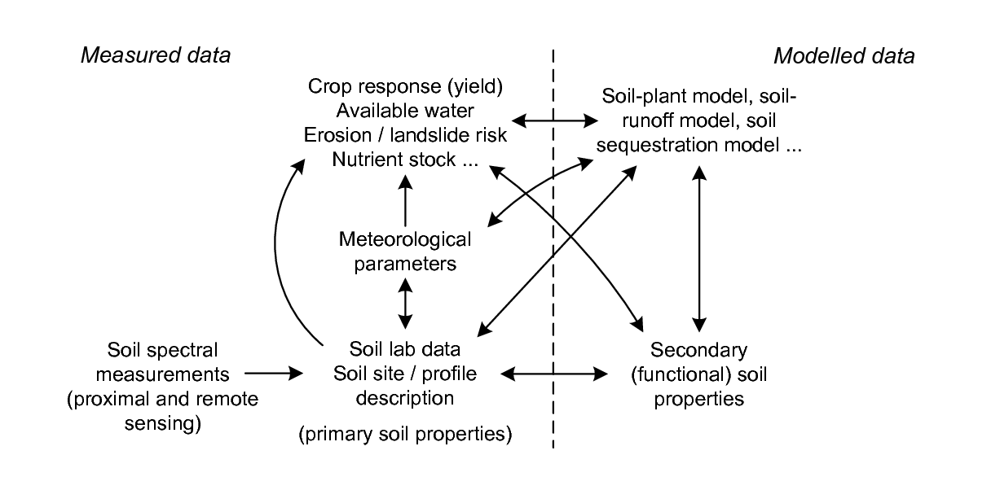
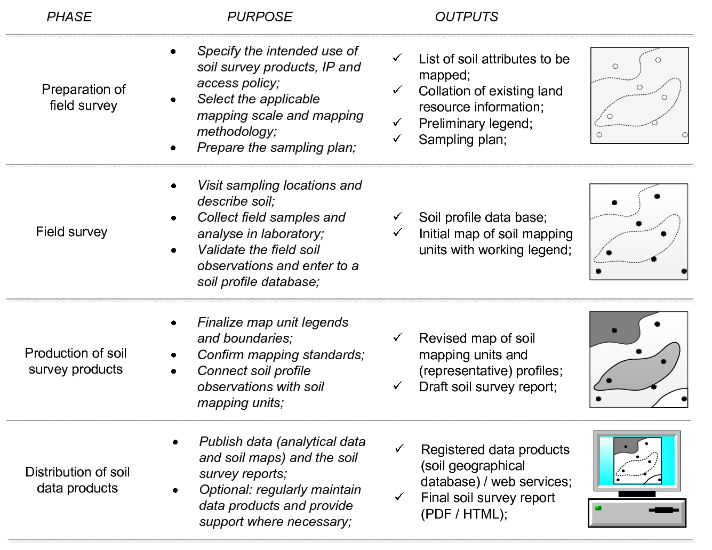
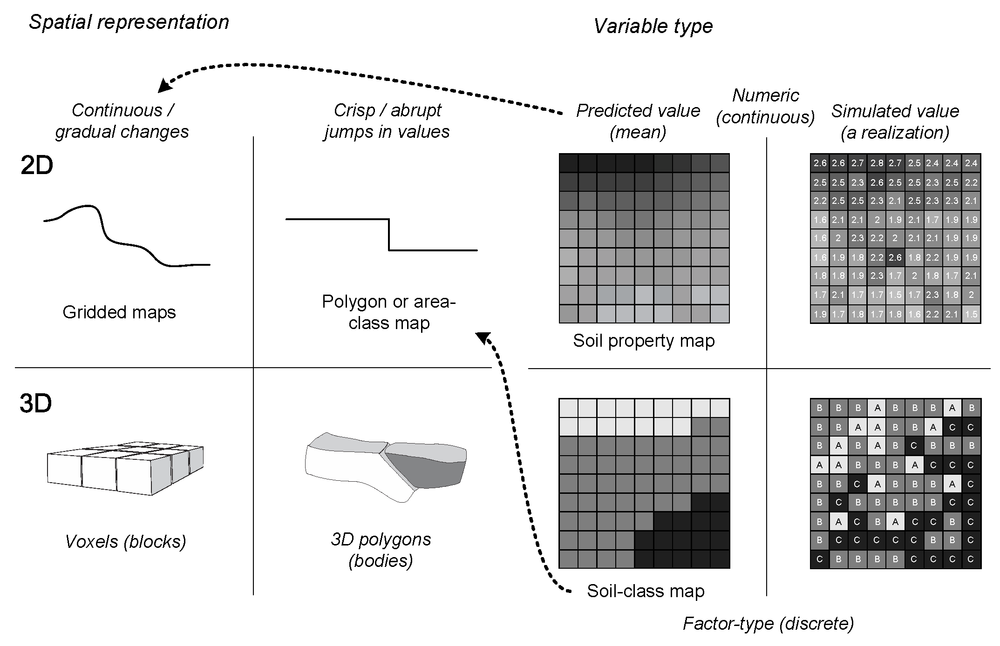
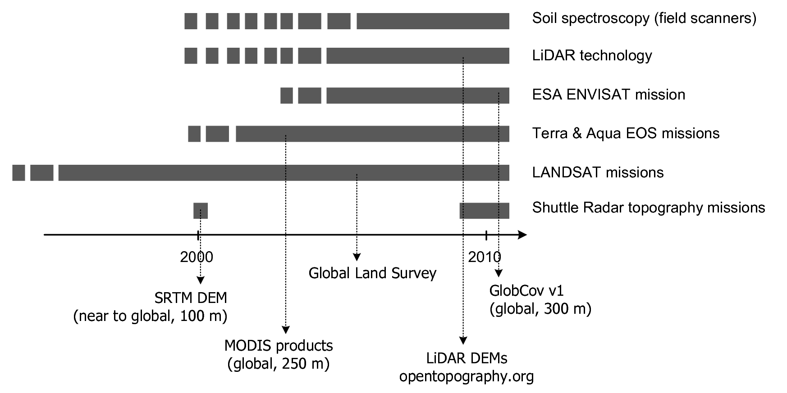
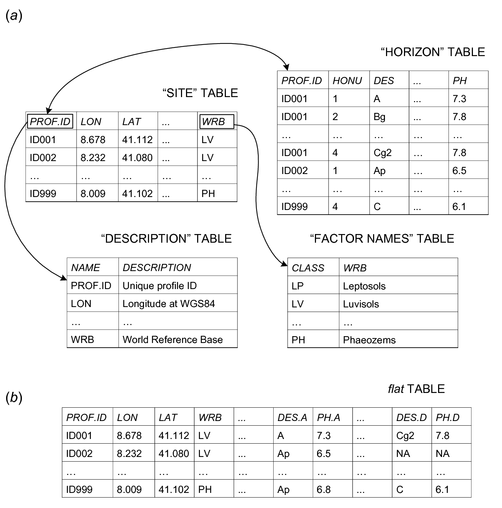
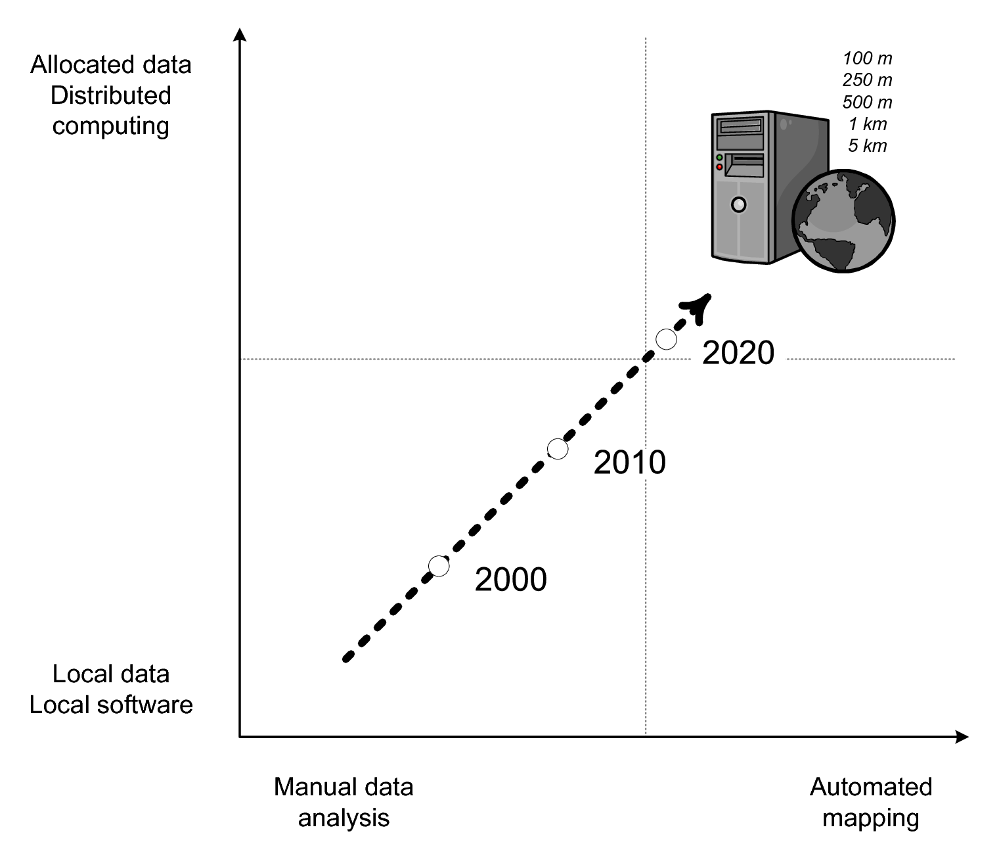
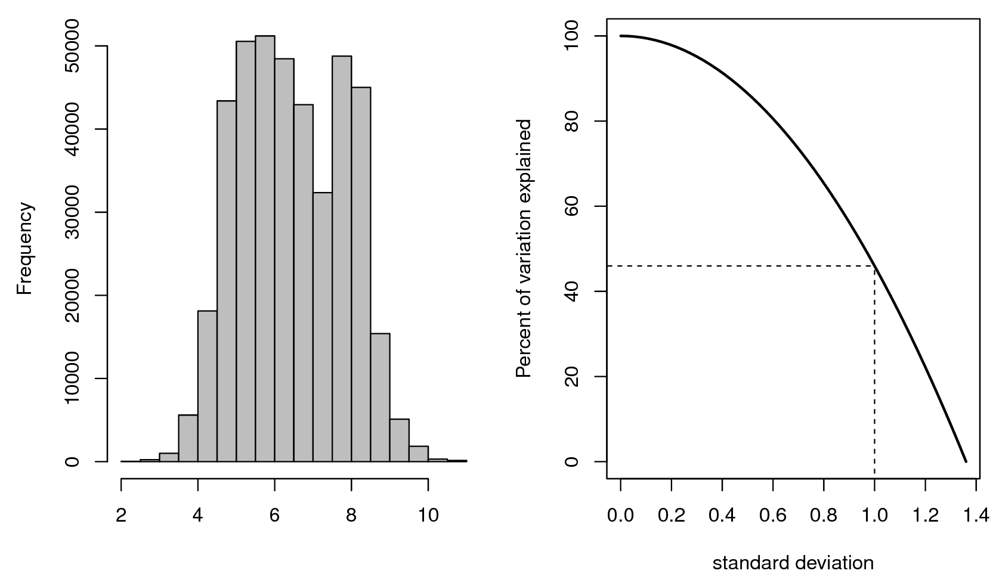

# Soil resource inventories and soil maps {#introduction}

*Edited by: Hengl T. & MacMillan R.A.*

## Introduction

This chapter presents a description and discussion of soils and
conventional soil inventories framed within the context of Predictive Soil Mapping (PSM). Soils,
their associated properties, and their spatial distribution are the
central focus of the PSM. We discuss how the products and
methods associated with conventional soil mapping relate to new, and
emerging, methods of PSM and automated soil mapping. We discuss similarities and
differences, strengths and weaknesses of conventional soil mapping (and
its inputs and products) relative to PSM.

The universal model of soil variation presented in detail in
Chapter \@ref(statistical-theory) is adopted as a framework for comparison of
conventional and PSM. Our aim is to show how the products
and methods of conventional soil mapping can complement, and strengthen,
PSM and equally, how the theories and methods of
PSM can enhance and strengthen conventional soil mapping.
PSM aims to implement tools and methods that will be supportive of
growth, change and improvement in soil mapping and that can stimulate a
rebirth and reinvigoration of soil inventory activity globally.

## Soils and soil inventories

### Soil: a definition

Soil is a natural body composed of biota and air, water and minerals,
developed from unconsolidated or consolidated material that forms the
topmost layer of the Earth’s surface [@chesworth2008encyclopedia]. The
upper limit of the soil is either air, shallow water, live plants or
plant materials that have not begun to decompose. The lower limit is
defined by the presence of hard rock or the lower limit of biologic
activity [@richter1995deep; @SSDS1993]. Although soils profiles up to tens
of meters depths can be found in some tropical areas [@richter1995deep], for
soil classification and mapping purposes, the lower limit soil is
arbitrarily set to 2 m (http://soils.usda.gov/education/facts/soil.html). Soils are rarely described to depths beyond 2 m and
many soil sampling projects put exponentially more focus on the upper
depths.

The chemical, physical and biological properties of the soil differ from
those of unaltered (unconsolidated) parent material from which the soil
is derived over a period of time under influence of climate, organisms
and relief effects. Soil should show a capacity to support life,
otherwise we are dealing with unconsolidated parent material. Hence, for
purposes of developing statistically based models to predict soil
properties using PSM, it proves useful to distinguish between *actual*
and *potential* soil areas (see further section \@ref(soil-covariates)).

A significant aspect of the accepted definition of soil is that it is
seen as a *natural body* that merits study, description,
*classification* and interpretation in, and of, itself. As a *natural
body* a soil is viewed as an object that occupies space, has defined
physical dimensions and that is more than the sum of its individual
properties or attributes. This concept requires that all properties of
soils be considered collectively in terms of a completely integrated
natural body [@SSDS1993]. A consequence of this, is that one must
generally assume that all soil properties covary in space in lockstep
with specific named soils and that different soil properties do not
exhibit different patterns of spatial variation independently relative
to a named soil.

From a management point of view, soil can be seen from at least three
perspectives. It is a:

-   *Resource* of materials — It contains quantities of unconsolidated
    materials, rock fragments, texture fractions, organic carbon,
    nutrients, minerals and metals, water and so on.

-   *Stabilizing medium / ecosystem* — It acts as a medium that supports
    both global and local processes from carbon and nitrogen fixation to
    retention and transmission of water, to provision of nutrients and
    minerals and so on.

-   *Production system* — Soil is the foundation for plant growth. In
    fact, it is the basis of all sustainable terrestrial
    ecosystem services. It is also a source of livelihood for people
    that grow crops and livestock.

For @frossard2006function there are six key functions of soil:

1.  *food and other biomass production*,

2.  *storage, filtering, and transformation of water, gases and
    minerals*,

3.  *biological habitat and gene pool*,

4.  *source of raw materials*,

5.  *physical and cultural heritage* and

6.  *platform for man-made structures: buildings, highways*.

Soil is the Earth’s biggest carbon store containing 82% of total terrestrial
organic carbon [@Lal2004Science].

### Soil variables

Knowledge about soil is often assembled and cataloged through *soil
resource inventories*. Conventional soil resource inventories describe
the geographic distribution of *soil bodies* i.e. *polypedons*
[@Wysocki2005Geoderma]. The spatial distribution of soil properties is
typically recorded and described through reference to mapped soil
individuals and not through separate mapping of individual soil
properties. In fact, the definition of a soil map in the US Soil Survey
Manual specifically *“excludes maps showing the distribution of a single
soil property such as texture, slope, or depth, alone or in limited
combinations; maps that show the distribution of soil qualities such as
productivity or erodibility; and maps of soil-forming factors, such as
climate, topography, vegetation, or geologic material”* [@SSDS1993].

In contrast to conventional soil mapping, PSM is primarily interested 
in portraying the spatial distribution of *soil variables* — measurable 
or descriptive attributes commonly collected through field sampling 
and then either measured *in-situ* or *a posteriori* in laboratory — in the 
form of maps. Soil variables can be roughly grouped into:

1.  *quantities of some material* ($y \in [0 \rightarrow +\infty]$);

2.  *transformed or standardized quantities* such as pH
    ($y \in [-\infty \rightarrow +\infty]$)

3.  *relative percentages* such as mass or volume percentages
    ($y \in [0 \rightarrow 1]$);

4.  *boolean values e.g. showing occurrence and/or non-occurrence* of
    qualitative soil attributes or objects ($y \in [0,1]$);

5.  *categories* (i.e. factors) such as soil classes
    ($y \in [a,b,\ldots,x]$);
    
6.  *probabilities* e.g. probabilities of occurrence of some class or object ($p(y) \in [0 \rightarrow 1]$).
    
7.  *censored values* e.g. depth to bedrock which is often observed only up to 2 m.

The nature of the soil variable determines how the attribute is modeled
and presented on the map in PSM. Some soil variables are
normally described as discrete entities (or classes), but can be
depicted as a continuous quantities on a map in the form of
probabilities or memberships
[@DeGruijter1997Geoderma; @McBratney2003Geoderma; @Kempen2009Geoderma; @Odgers201130].
For example, a binary soil variable (e.g. the presence/absence of a
specific layer or horizon) can be modeled as a binomial random variable
with a logistic regression model. Spatial prediction (mapping) with this
model gives a map depicting (continuous) probabilities in the range of
0–1. These probabilities can be used to determine the presence/absence
of a class at each prediction location, resulting in a discrete
representation of the soil attribute variation.

In that context, the aims of soil resource inventories are
identification, measurement, modelling, mapping and interpretation of
soil variables that represent transformed or standardized quantities of
some material, relative percentages, occurrence and/or non-occurrence of
qualitative attributes or objects, and/or soil categories.

### Primary and secondary soil variables

Soil properties can be *primary* or *inferred* (see further section \@ref(soil-variables-chapter)).
Primary properties are properties that can be measured directly in the
field or in the laboratory. Inferred properties are properties that
cannot be measured directly (or are difficult or too expensive to
measure) but are inferred from primary properties, for example through
pedotransfer functions [@Wosten2001JH; @wosten2013soil].
@Dobos2006digital also distinguish between primary and secondary soil
properties and *‘functional’* soil properties representing *soil
functions* or *soil threats*. Such soil properties can be directly used
for financial assessment or for decision making. For example, soil
organic carbon content in grams per kilogram of soil is the primary soil
property, while organic carbon sequestration rate in kilograms per unit
area per year is a *functional* soil property.

## Soil mapping

### What are soil resource inventories?

Soil resource inventories describe the types, attributes and geographic
distributions of soils in a given area. They can consist of spatially
explicit maps of or non-spatial lists. Lists simply itemize the kinds
and amounts of different soils that occupy an area to address questions
about what soils and soil properties occur in an area. The resulting
answer is often not highly specific in space but rather presents a
mainly non-spatial itemization of soils and soil attributes expected to
occur in a bounded area. Maps attempt to portray, with some degree of
detail, the patterns of spatial variation in soils and soil properties,
within limits imposed by mapping scale and resources.

According to the USDA Manual of Soil Survey [@SSDS1993], a soil survey:

-   describes the characteristics of the soils in a given area,

-   classifies the soils according to a standard system of
    classification,

-   plots the boundaries of the soils on a map, and

-   makes predictions about the behavior of soils.

The information collected in a soil survey helps in the development of
land-use plans and evaluates and predicts the effects of land use on the
environment. Hence, the different uses of the soils and how the response
of management affects them need to be considered.

In conventional soil mapping, the objects of study, whose spatial
distributions are portrayed on any resulting map, are *soil individuals*
that are assumed to possess and exhibit a unique set of soil properties
with a defined range of values. A fundamental assumption of conventional
soil mapping is therefore that, if one maps the pattern of spatial
distribution of uniquely defined *soil individuals*, one can infer the
patterns of spatial distribution of the *soil properties* associated
with each defined individual. Thus, conventional soil maps must, by
definition, only map soil individuals and not individual soil properties
[@SSDS1993] and then subsequently infer the distribution of soil
properties from the mapped distribution of soil individuals.

This attribute of conventional soil mapping represents a significant
difference compared to PSM, where the object of study is
frequently an individual soil property and the objective is to map the
pattern of spatial distribution of that property (over some depth
interval) independently from consideration of the spatial distribution
of soil individuals or other soil properties.

Soil maps give answers on three basic questions: (1) what is mapped?,
(2) what is the predicted value?, and (3) where is it? Thematic accuracy
of a map tells us how accurate predictions of targeted soil properties
are overall, while the spatial resolution helps us locate features
precisely.

The most common output of soil resource inventories are <em>soil maps</em>. Soil maps convey information about the geographic distribution of named soil types in a given area. They are meant to help answer the questions <em>“what is here”</em> and <em>“where is what”</em> [@Burrough1998OUP].

Any map is an abstraction and generalization of reality. The only
perfect one-to-one representation of reality is reality itself. To fully
describe reality one would need a model at 1:1 scale at which 1 m$^2$ of reality
was represented by 1 m$^2$ of the model. Since this is not feasible, we condense
and abstract reality in such a way that we hope to describe the major
differences in true space at a much reduced scale in model (map) space.
When this is done for soil maps, it needs to be understood that the map
cannot describe all of the variation that is present in reality. It can
only describe that portion of the total variation that is systematic and
has structure and occurs over distances that are as large as, or larger
than, the smallest area that can be feasibly portrayed and described at
any given scale. Issues of scale and resolution are discussed in greater
detail in chapter \@ref(downscaling-upscaling).

An important functionality of PSM is the production and distribution of
maps depicting the spatial distribution of soils and, more specifically,
soil attributes. In this chapter we, therefore, concentrate on
describing processes for producing maps as spatial depictions of the
patterns of arrangement of soil attributes and soil types.

### Soil mapping approaches and concepts

As mentioned previously, spatial information about the distribution of
soil properties or attributes, i.e. soil maps or GIS layers focused on
soil, is produced through soil resource inventories, also known as soil
surveys or soil mapping projects
[@Burrough1971; @Avery1987; @Wysocki2005Geoderma; @Legros2006SP]. The
main idea of soil survey is, thus, production and dissemination of soil
information for an area of interest usually to address a specific
question or questions of interest i.e. production of soil maps and soil
geographical databases. Although soil surveyors are usually not *per se*
responsible for usage of soil information, how soil survey information
is used is increasingly important.

In statistical terms, the main objective of soil mapping is to describe
the spatial variability i.e. spatial complexity of soils, then represent
this complexity using maps, summary measures, mathematical models and
simulations. Some known sources of spatial variability in soil variables
are:

1.  *Natural spatial variability in 2D (different at various scales),
    mainly due to climate, parent material, land cover and land use*;

2.  *Variation by depth*;

3.  *Temporal variation due to regular or periodic changes in the
    ecosystem*;

4.  *Measurement error (in situ or in lab)*;

5.  *Spatial location error*;

6.  *Small scale variation*;

In statistical terms, the main objective of soil mapping is to describe the spatial complexity of soils, then represent this complexity using maps, summary measures, mathematical models and simulations. From the application point of view, the main objective of soil mapping is to accurately predict response of a soil(-plant) ecosystem to various soil management strategies.

Soil mappers do their best to try explain the first two items above and
minimize, or exclude from modelling, the remaining components: temporal
variation, measurement error, spatial location error and small scale
variation.

(\#fig:soil-crop-model-scheme)Inputs to soil-plant, soil-hydrology or soil-ecology models and their relationship.

From the application point of view, the main objective of soil mapping
is to accurately predict soil properties and their response to possible
or actual management practices
(Fig. \@ref(fig:soil-crop-model-scheme)). In other words, if the soil
mapping system is efficient, we should be able to accurately predict
behavior of soil-plant soil-hydrology or similar ecosystems to various
soil management strategies, and hence provide optimal advice to
agronomists, engineers, environmental modelers, ecologists and similar.

We elect here to recognize two main variants of soil mapping which we
refer to as *conventional soil mapping* and *pedometric* or *predictive soil mapping* as
described and discussed below (Fig. \@ref(fig:comparison-dsm)).

(\#fig:comparison-dsm)Comparison between traditional (primarily expert-based) and automated (data-driven) soil mapping.

### Theoretical basis of soil mapping: in context of the universal model of spatial variation {#soil-mapping-theory}

Stated simply, *“the scientific basis of soil mapping is that the
locations of soils in the landscape have a degree of predictability”*
[@Miller1979]. According to the USDA Soil Survey Manual, *“The
properties of soil vary from place to place, but this variation is not
random. Natural soil bodies are the result of climate and living
organisms acting on parent material, with topography or local relief
exerting a modifying influence and with time required for soil-forming
processes to act. For the most part, soils are the same wherever all
elements of the five factors are the same. Under similar environments in
different places, soils are similar. This regularity permits prediction
of the location of many different kinds of soil”* [@SSDS1993].
@Hudson2000SSSAJ considers that this *soil-landscape paradigm* provides
the fundamental scientific basis for soil survey.

In the most general sense, both conventional and PSM
represent a specific application of the universal model of spatial
variation, which is explained in greater detail in
Chapter \@ref(statistical-theory). @Burrough1998OUP [p.133] described the
universal model of soil variation as a special case of the universal
model of spatial variation. This model distinguishes between three major
components of soil variation: (1) deterministic component (trend), (2)
spatially correlated component and (3) pure noise.

\begin{equation}
Z({\bf{s}}) = m({\bf{s}}) + \varepsilon '({\bf{s}}) + \varepsilon ''({\bf{s}})
(\#eq:univ-var)
\end{equation}

where $\bf{s}$ is two-dimensional location, $m({\bf{s}})$ is the
deterministic component, $\varepsilon '({\bf{s}})$ is the spatially
correlated stochastic component and $\varepsilon ''({\bf{s}})$ is the
pure noise (micro-scale variation and measurement error).

The <em>universal model of soil variation</em> assumes that there are three major components of soil variation: (1) the deterministic component (function of covariates), (2) spatially correlated component (treated as stochastic) and (3) pure noise.

The deterministic part of the equation describes that part of the
variation in soils and soil properties that can be explained by
reference to some model that relates observed and measured variation to
readily observable and interpretable factors that control or influence
this spatial variation. In conventional soil mapping, this model is the
empirical and knowledge-based *soil-landscape paradygm*
[@Hudson2000SSSAJ]. In PSM, a wide variety of statistical
models have been used to capture and apply the soil-landscape paradigm
in a quantitative and optimal fashion:

\begin{equation}
S = f (cl, o, r, p, t)
(\#eq:clorpt)
\end{equation}

where $S$ stands for soil (properties and classes), $cl$ for climate,
$o$ for organisms (including humans), $r$ is relief, $p$ is parent
material or geology and $t$ is time. The Eq. \@ref(eq:clorpt) is the
CLORPT model originally presented by Jenny [-@jenny1994factors].

@MCBRATNEY20033 have further conceptualized the so-called
*“scorpan”* model in which soil property is modeled as a function of:

-   (auxiliary) **s**oil properties,

-   **c**limate,

-   **o**organisms, vegetation or fauna or human activity,

-   **r**elief,

-   **p**arent material,

-   **a**ge i.e. the time factor,

-   **n** space, spatial position,

The pedometric models are quantitative in that they capture
relationships between observed soils, or soil properties, and
controlling environmental influences (as represented by environmental
co-variates) using statistically-formulated expressions. Pedometric
models are seen as optimum because, by design, they minimize the
variance between observed and predicted values at all locations with
known values. So, no better model of prediction exists for that
particular set of observed values at that specific set of locations.

Conventional soil mapping has a long history of effective development
and application of empirical, knowledge-based, soil landscape models to
predict how soil classes vary spatially across landscapes. Such models
can be criticized, however, for being neither quantitative nor optimal.

Our essential point is that both conventional and pedometric soil
mapping use models to explain the deterministic part of the spatial
variation in soils and soil properties and these models differ mainly in
terms of whether they are empirical and subjective (conventional) or
quantitative and objective (pedometric). Both can be effective and the
empirical and subjective models based on expert knowledge have, until
recently, proven to be the most cost effective and widely applied for
production of soil maps by conventional means.

The spatially correlated part of the observed variation is that part
that shows spatial structure that lends itself to prediction through
interpolation but that is not explainable, or easily explained, through
use of a deterministic model that relates observed values to controlling
factors. This part of the variation is typically modeled in pedometric
mapping using geostatistics and kriging to interpolate, in an optimal
manner, between point locations with known values
[@goovaerts2001geostatistical; @McBratney2003Geoderma].

It can be argued that conventional soil mapping has an analogue to
kriging in situations where there is no clearly apparent relationship
between observed values and readily observable controlling environmental
variables. In such instances, conventional soil mappers typically resort
to an approach in which they make as many closely spaced observations as
feasible and then manually *“interpolate”* between these locations of
known soils or soil properties to locate boundaries indicative of
locations of significant change in soils or soil properties. In the
vernacular of soil surveyors this is often referred to as *“digging it
out”* in which a pattern that is not readily apparent or visible is
revealed through interpolation between closely spaced observations. So,
under some circumstances, conventional soil surveyors do implement an
analogue of spatial interpolation to describe patterns of variation in
soils where such patterns are not readily related to a clear
soil-landscape model.

In its essence, the objective of PSM is to produce optimal unbiased predictions of mean value at some new location along with the uncertainty associated with the prediction, at the finest possible resolution.

There is one way in which PSM differs significantly from
conventional soil mapping in terms of the universal model of soil
variation. This is in the use of statistics and machine learning to
quantitatively correct for error in predictions, defined as the
difference between predicted and observed values at locations with known
values. Conventional soil mapping has no formal or quantitative
mechanism for correcting an initial set of predicted values by computing
the difference between predicted and observed values at sampled
locations and then correcting initial values at all locations in
response to these observed differences. PSM uses
statistics to determine if the differences between predicted and
observed values (the residuals) exhibit spatial structure (e.g. are
predictable). If they do exhibit spatial structure, then it is useful
and reasonable to interpolate the computed error at known locations to
predict the likely error of predictions at all locations
[@hengl2007regression]. This interpolated prediction error can then be
systematically subtracted from (or added to) the original predicted
value to correct for errors in the initial predictions that are
systematic and spatially correlated. This *“after the fact”* correction
of initial predictions is an aspect of PSM that
represents an improvement over conventional soil mapping methods and
that conventional methods would do well to emulate.

Neither conventional soil mapping nor PSM can do more
than simply describe and quantify the amount of variation that is not
predictable and has to be treated as pure noise. Conventional soil maps
can be criticized for ignoring this component of the total variation and
typically treating it as if it did not exist. For many soil properties,
short range, local variation in soil properties that cannot be explained
by either the deterministic or stochastic components of the universal
model of soil variation can often approach, or even exceed, 30–40% of the
total observed range of variation in any given soil property. Such
variation is simply not mappable but it exists and should be identified
and quantified. We do our users and clients a disservice when we fail to
alert them to the presence, and the magnitude, of spatial variation that
is not predictable. In cases where the local spatial variation is not
predictable (or mappable) the best estimate for any property of interest
is the mean value for that local area.

### Traditional (conventional) soil mapping {#conventional-mapping}

Traditional soil resource inventories are largely based on manual
application of expert tacit knowledge through the soil-landscape
paradigm [@Burrough1971; @Hudson2000SSSAJ]. In this approach, soil
surveyors develop and apply conceptual models of where and how soils
vary in the landscape through a combination of field inspections to
establish spatial patterns and photo-interpretation to extrapolate the
patterns to specific portions of the landscape
(Fig. \@ref(fig:soilsurvey-scheme)). Traditional soil mapping
procedures mainly address the deterministic part of the universal model
of soil variation.

(\#fig:soilsurvey-scheme)Typical soil survey phases and intermediate and final products.

Conventional (traditional) manual soil mapping typically adheres to the
following sequence of steps, with minor variations
[@McBratney2003Geoderma]:

1.  *Specify the objective(s) to be served by the soil survey and
    resulting map*;

2.  *Identify which attributes of the soil or land need to be observed,
    described and mapped to meet the specified objectives*;

3.  *Identify the minimum sized area that must be described and the
    corresponding scale of mapping to meet the specified objectives*;

4.  *Collate and interpret existing relevant land resource information
    (geology, vegetation, climate, imagery) for the survey area*;

5.  *Conduct preliminary field reconnaissance and use these observations
    to construct a preliminary legend of conceptual mapping units
    (described in terms of soil individuals)*;

6.  *Apply preliminary conceptual legend using available source
    information to delineate initial map unit boundaries (pre-typing)*;

7.  *Plan and implement a field program to collect samples and
    observations to obtain values of the target soil attributes
    (usually classes) at known locations to test and refine initial
    conceptual prediction models*;

8.  *Using field observations, refine the conceptual models and finalize
    map unit legends and boundaries to generate conventional area–class
    soil maps*;

9.  *Conduct a field correlation exercise to match mapping with adjacent
    areas and to confirm mapping standards were adhered to*;

10. *Select and analyse representative soil profile site data to
    characterize each mapped soil type and soil map unit*;

11. *Prepare final documentation that describes all mapped soils and
    soil map units (legends) according to an accepted format*;

12. *Publish and distribute the soil information in the form of maps,
    geographical databases and reports*;

Expert knowledge about soil-landform patterns is generally used to
produce manually drawn polygon maps that outline areas of different
dominant soils or combinations of soils — *soil map units* (see
Figs. \@ref(fig:smu-aggregation) and \@ref(fig:from-photointerpretation-to-soilmap)). Soil
map units (polygons of different type) are described in terms of
composition of soil classes (and often also landscape attributes) within
each unit with various soil physical and chemical variables attached to
each class. Most commonly, the objective of conventional soil mapping is
to delineate recognizable portions of a landscape (soil–landform units)
as polygons in which the variation of soils and soil properties is
describable and usually more limited than between polygons. Because most
soil mapping projects have limited resources and time, soil surveyors
can not typically afford to survey areas in great detail (e.g. 1:5000)
so as to map actual *polypedons*. As a compromise, the survey team
generally has to choose some best achievable target scale (e.g.
1:50,000). Maps produced at some initial scale can be further
generalized, depending on the application and users demands
[@Wysocki2005Geoderma].

(\#fig:smu-aggregation)Three basic conceptual *scales* in soil mapping: (left) *most detailed scale* showing the actual distribution of soil *bodies*, (center) *target scale* i.e. scale achievable by the soil survey budget, (right) *generalized intermediate scale or coarse resolution maps*. In a conventional soil survey, soils are described and conceptualized as groups of similar pedons (smallest elements of 1–10 square-m), called *“polypedons”* — the smallest mappable entity. These can then be further generalized to soil map units, which can be various combinations (systematic or random) of dominant and contrasting soils (inclusions).

Where variation within a polygon is systematic and predictable, the
pattern of variation in soils within any given polygon is often
described in terms of the most common position, or positionsm in the
landscape occupied by each named soil class. In other cases, soil
patterns are not clearly related to systematic variations in observable
landscape attributes and it is not possible to describe where each named
soil type is most likely to occur within any polygon or why.

Conventional soil mapping has some limitations related to the fact that
is often not consistently applied by different mappers, it is largely
manual and it is difficult to automate. In addition, conventional soil
survey methods differ from country to country, and even within a single
region, depending largely on the scope and level-of-detail of the
inventory [@Schelling1970Geoderma; @SSS1983USDA; @Rossiter2001]. The key
advantages of conventional soil maps, on the other hand, are that:

-   *they portray the spatial distribution of stable, recognizable and
    repeating patterns of soils in the landscape*, and

-   *these patterns can be extracted from legends and maps to model the
    most likely soil at any location in the landscape using expert
    knowledge alone* [@Zhu2001].

Resource inventories, and in particular soil surveys, have been
notoriously reluctant, or unable, to provide objective quantitative
assessments of the accuracy of their products. For example, most soil
survey maps have only been subjected to qualitative assessments of map
accuracy through visual inspection and subjective correlation exercises.
In the very few examples of quantitative evaluation
[@Marsman1986ALTERRA; @Finke2006Elsevier], the assessments have
typically focused on measuring the degree with which predictions of
soil classes at specific locations on a map, or within polygonal areas
on a map, agreed with on-the-ground assessments of the soil class at
these same locations or within these same polygons. Measurement error
can be large in assessing the accuracy of soil class maps.
@MacMillan2005CJSS, for example, demonstrated that experts disagreed
with each other regarding the correct classification of ecological site
types at the same locations about as often as they disagreed with the
classifications reported by a map produced using a predictive model.

Assessments of map accuracy that compare the ability of a map to predict
classes of soil at specific locations are insufficient to assess the
ability of a map to predict spatial variation in soil properties. Maps
are increasingly used to predict *soil functional properties* at
specific (point) locations. In traditional soil mapping, all properties
are tied to soil classes and all properties are assumed to vary in
exactly the same manner as the observed variation in soil types. To
predict the value of a soil property at a location, one would first
predict the soil class most likely to occupy that location then infer
the soil property based on the predicted soil class. This has
disadvantages when soil properties do not covary exactly with soil
classes and when spatial variation in soil classes is difficult to
predict.

### Variants of soil maps

In the last 20–30 years, soil maps have evolved from purely 2D polygon
maps showing the distribution of soil poly-pedons i.e. named soil
classes, to dynamic 3D maps representing predicted or simulated values
of various primary or inferred soil properties and/or classes
(Fig. \@ref(fig:soilmap-types)). Examples of 2D+T and/or 3D+T soil maps
are less common but increasingly popular (see e.g.
@Rosenbaum2012WRCR and @Gasch2015SPASTA). In general, we expect that demand for
spatio-temporal soil data is likely to grow.

(\#fig:soilmap-types)Classification of types of soil maps based on spatial representation and variable type.

A soil map can represent 2D, 3D, 2D+T and/or 3D+T distribution of quantitative soil properties or soil classes. It can show predicted or simulated values of target soil properties and/or classes, or inferred soil-functions.

The spatial model increasingly used to represent soil spatial
information is the *gridded or raster data model*, where most of the
technical properties are defined by the grid cell size i.e. the ground
resolution. In practice,
vector-based polygon maps can be converted to gridded maps and *vice
versa*, so in practical terms there is really no meaningful difference
between the two models. In this book, to avoid any ambiguity, when
mentioning soil maps we will often refer to the spatio-temporal
reference and support size of the maps at the highest possible level of
detail. Below, for example, is a full list of specifications attached to
a *soil map* produced for African continent [@Hengl2015AfSoilGrids250m]:

-   *target variable*: soil organic carbon in permille;

-   *values presented*: predictions (mean value);

-   *prediction method*: 3D regression-kriging;

-   *prediction depths*: 6 standard layers (0–5, 5–15, 15–30, 30–60,
    60–100, 100–200 cm);

-   *temporal domain (period)*: 1950–2005;

-   *spatial support (resolution) of covariate layers*: 250 m;

-   *spatial support of predictions*: point support (center of a grid
    cell);

-   *amount of variation explained by the spatial prediction model*: 45%;

Until recently, maps of individual soil properties, or of soil functions
or soil interpretations were not considered to be true soil maps, but
rather, to be single-factor derivative maps or interpretive maps. This
is beginning to change and maps of the spatial pattern of distribution
of individual soil properties are increasingly being viewed as a
legitimate form of soil mapping.

### Predictive and Automated soil mapping {#pedometric-mapping}

In contrast to traditional soil mapping, which is primarily based on
applying expert knowledge, the emerging, *‘predictive’* approach to soil
mapping is generally more data-driven and based on the use of
statistical methods and technology
[@grunwald2005environmental; @Lagacherie2006Elsevier; @Hartemink2008Springer; @Boettinger2010Springer].
Emergence of new soil mapping methods is undoubtedly a reflection of new
emerging technologies and newly available global data layers, especially
those that are free and publicly distributed such as MODIS products,
SRTM DEM and similar (Fig. \@ref(fig:new-technologies)). PSM can be compared to / shares similar concepts as other applications of statistics in physical geography, for example the Predictive Vegetation Mapping [@Fran01; @Hengl2018PNV].

(\#fig:new-technologies)Evolution of digital soil mapping parallels the emergence of new technologies and global, publicly available data sources.

The objective of using pedometric techniques for soil mapping is to
develop and apply objective and optimal sets of rules to predict the
spatial distribution of soil properties and/or soil classes. Most
typically, rules are developed by fitting statistical relationships
between digital databases representing the spatial distribution of
selected environmental covariates and observed instances of a soil class
or soil property at geo-referenced sample locations. The environmental
covariate databases are selected as predictors of the soil attributes on
the basis of either expert knowledge of known relationships to soil
patterns or through objective assessment of meaningful correlations with
observed soil occurrences. The whole process is amenable to complete
automation and documentation so that it allows for *reproducible
research* (read more in: http://en.wikipedia.org/wiki/Reproducibility).

Pedometric soil mapping typically follows six steps as outlined by
@McBratney2003Geoderma:

1.  *Select soil variables (or classes) of interest and suitable
    measurement techniques (decide what to map and describe)*;

2.  *Prepare a sampling design (define spatial location of sampling
    points and sampling intensity)*;

3.  *Collect samples in the field and estimate values of the target soil
    variables at unknown locations to test and refine prediction
    models*;

4.  *Select and implement the spatial prediction (or extrapolation)
    models and generate soil maps*;

5.  *Select the most representative data model and distribution system*;

6.  *Publish and distribute the soil information in the form of maps,
    geographical databases and reports (and provide support to users)*;

Differences among <em>conventional soil mapping</em>, <em>digital soil mapping</em> or <em>technology-driven or data-driven mapping</em> relate primarily to the degree of use of robust statistical methods in developing prediction models to support the mapping process.

We here recognize four classes of soil mapping methods (B, C, D and E in
Fig. \@ref(fig:pedometric-mapping-vs-dsm)) which all belong to a
continuum of *digital soil mapping* methods [@malone2016using; @mcbratney2018pedometrics]. 
We promote in this book specifically the Class E soil mapping approach 
i.e. which we refer to as the *predictive* and/or *automated soil mapping*.

(\#fig:pedometric-mapping-vs-dsm)A classification of approaches to soil mapping: from purely expert driven, to various types of *digital* soil mapping.

Some key advantages of the pedometric (statistical) approach to soil
mapping are that it is: objective, systematic, repeatable, updatable and
represents an optimal expression of statistically validated
understanding of soil-environmental relationships in terms of the
currently available data.

There are, of course, also limitations with pedometric methods that
still require improvement. Firstly, the number of accurately
georeferenced locations of reliable soil observations (particularly with
analytical data) is often not sufficient to completely capture and
describe all significant patterns of soil variation in an area. There
may be too few sampled points and the exact location of recorded point
data may not be well recorded. In short, data-driven soil mapping is
field-data demanding and collecting field data can require significant
expenditures of time, effort and money.

With legacy soil point data the sampling designs or rationale used to
decide where to locate soil profile observation or sampling points are
often not clear and may vary from project to project or point to point.
Therefore there is no guarantee that available point data are actually
representative of the dominant patterns and soil forming conditions in
any area. Points may have been selected and sampled to capture
information about unusual conditions or to locate boundaries at points
of transition and maximum confusion about soil properties. Once a soil
becomes recognized as being widely distributed and dominant in the
landscape, many conventional field surveys elect not to record
observations when that soil is encountered, preferring to focus instead
on recording unusual or transition soils. Thus the population of
available legacy soil point observations may not be representative of
the true population of soils, with some soils being either over or
under-represented.

We define automated or predictive soil mapping as a data-driven approach to soil mapping with little or no human interaction, commonly based on using optimal (where possible) statistical methods that elucidate relationships between target soil variables (sampled in the field and geolocated) and covariate layers, primarily coming from remote sensing data.

A second key limitation of the Automated approach to soil
mapping is that there may be no obvious relationship between observed
patterns of soil variation and the available environmental covariates.
This may occur when a soil property of interest does strongly covary
with some mappable environmental covariate (e.g. soil clay content with
airborne radiometric data) but data for that environmental covariate are
not available for an area. It may also transpire that the pattern of
soil variation is essentially not predictable or related to any known
environmental covariate, available or not. In such cases, only closely
spaced, direct field observation and sampling is capable of detecting
the spatial pattern of variation in soils because there is no, or only a
very weak, correlation with available covariates [@kondolf2003tools].

### Comparison of conventional and pedometric soil mapping {#comparison-conventional-pm}

There has been a tendency to view conventional soil mapping and
automated soil mapping as competing and non-complementary approaches. In
fact, they share more similarities than differences. Indeed, they can be
viewed as end members of a logical continuum. Both rely on applying the
underlying idea that the distribution of soils in the landscape is
largely predictable (the deterministic part) and, where it is not
predictable, it must be revealed through intensive observation, sampling
and interpolation (the stochastic part).

In most cases, the basis of prediction is to relate the distribution of
soils, or soil properties, in the landscape to observable environmental
factors such as topographic position, slope, aspect, underlying parent
material, drainage conditions, patterns of climate, vegetation or land
use and so on. This is done manually and empirically (subjectively) in
conventional soil survey, while in automated soil mapping it is done
objectively and mostly in an automated fashion. At the time it was
developed, conventional soil survey lacked both the digital data sets of
environmental covariates and the statistical tools required to
objectively analyze relationships between observed soil properties and
environmental covariates. So, these relationships were, of necessity,
developed empirically and expressed conceptually as expert knowledge.

More recently, it has become increasingly possible to obtain both
environmental covariate data and field soil observations in
georegistered and digital format and to analyze and express
relationships objectively and optimally, using statistical methods
[@Pebesma2006TiG; @McBratney2011HSS]. Where the relationship between
available environmental covariates and observed soil variation is weak,
as in featureless plains or complex flood plains, both methods rely on
similar approaches of using densely spaced point observations to reveal
the spatial patterns. Conventional soil mappers *‘dig out’* these
patterns while digital soil mappers interpolate using geostatistical
procedures, but here too the two methods are quite analogous. Hard facts
(point data and covariates) can often be beneficially enhanced using
soft data (expert knowledge).

In summary, we suggest that next generation soil surveyors will
increasingly require a solid background in statistics and computer
science, especially in Machine Learning and A.I. Nevertheless, effective selection and application of
statistical sampling and analysis techniques should also benefit from
consideration of expert knowledge wherever possible.

### Top-down versus bottom-up approaches: subdivision versus agglomeration {#top-down}

There are two fundamentally different ways to approach the production of
soil maps for areas of larger extent, whether by conventional or
pedometric means. For ease of understanding we refer to these two
alternatives here as *“bottom-up”* versus *“top-down”*. @Rossiter2001
refers to a synthetic approach that he calls the *“bottom-up”* or *“name
and then group”* approach versus an analytic approach that he calls the
*“top-down”* or *“divide and then name”* approach.

The bottom up approach is agglomerative and synthetic. It is implemented
by first collecting observations and making maps at the finest possible
resolution and with the greatest possible level of detail. Once all
facts are collected and all possible soils and soil properties, and
their respective patterns of spatial distribution, are recorded, these
detailed data are generalized at successively coarser levels of
generalization to detect, analyse and describe broader scale (regional
to continental) patterns and trends. The fine detail synthesized to
extract broader patterns leads to the identification and formulation of
generalizations, theories and concepts about how and why soils organize
themselves spatially. The bottom-up approach makes little, to no, use of
generalizations and theories as tools to aid in the conceptualization
and delineation of mapping entities. Rather, it waits until all the
facts are in before making generalizations. The bottom-up approach tends
to be applied by countries and organizations that have sufficient
resources (people and finances) to make detailed field surveys feasible
to complete for entire areas of jurisdiction. Soil survey activities of
the US national cooperative soil survey (NCSS) primarily adopt this
bottom-up approach. Other smaller countries with significant resources
for field surveys have also adopted this approach (e.g. Netherlands,
Denmark, Cuba). The bottom-up approach was, for example, used in the
development and elaboration of the US soil taxonomy system of
classification and of the US SSURGO (1:20,000) and STATSGO (1:250,000)
soil maps [@ZHONG2011491].

The top-down approach is synoptic, analytic and divisive. It is
implemented by first collecting just enough observations and data to
permit construction of generalizations and theoretical concepts about
how soils arrange themselves in the landscape in response to controlling
environmental variables. Once general theories are developed about how
environmental factors influence how soils arrange themselves spatially,
these concepts and theories are tested by using them to predict what
types of soils are likely to occur under similar conditions at
previously unvisited sites. The theories and concepts are adjusted in
response to initial application and testing until such time as they are
deemed to be reliable enough to use for production mapping. Production
mapping proceeds in a divisive manner by stratifying areas of interest
into successively smaller, and presumably more homogeneous, areas or
regions through application of the concepts and theories to available
environmental data sets. The procedures begin with a synoptic overview
of the environmental conditions that characterize an entire area of
interest. These conditions are then interpreted to impose a hierarchical
subdivision of the whole area into smaller, and more homogeneous
subareas. This hierarchical subdivision approach owes its origins to
early Russian efforts to explain soil patterns in terms of the
geographical distribution of observed soils. The top-down approach tends
to be applied preferentially by countries and agencies that need to
produce maps for very large areas but that lack the people and resources
to conduct detailed field programs everywhere (see e.g.
@Henderson2004Geoderma and @Mansuy201459). Many of these divisive
hierarchical approaches adopt principals and methods associated with the
ideas of Ecological Land Classification [@rowe1981ecological] (in
Canada) or Land Systems Mapping [@gibbons1964study; @rowan1990land] (in
Australia).

As observed by @Rossiter2001 *“neither approach is usually applied in
its pure form”* and most approaches to soil mapping use both approaches
to varying degrees. Similarly, it can be argued that PSM provides
support for both approaches to soil mapping. PSM implements two
activities that bear similarities to bottom-up mapping. Firstly, PSM
uses *all* available soil profile data globally as input to initial
global predictions at coarse resolution (*“top-down”* mapping).
Secondly, PSM is set up to ingest finer resolution maps produced via
detailed *“bottom-up”* mapping methods and to merge these more detailed
maps with initial, coarser-resolution predictions [@ramcharan2018soil].

## Sources of soil data for soil mapping

### Soil data sources targeted by PSM

PSM aims at integrating and facilitating exchange of global soil data.
Most (global) soil mapping initiatives currently rely on capture and use
of *legacy soil data*. This raises several questions. What is meant by
legacy soil data? What kinds of legacy soil data exist? What are the
advantages and limitations of the main kinds of legacy soil data?

In its most general sense, a legacy is something of value bequeathed
from one generation to the next. It can be said that global soil legacy
data consists of the sum of soil data and knowledge accumulated since
the first soil investigations 80 or more years ago. More specifically,
the concept of a legacy is usually accompanied by an understanding that
there is an obligation and duty of the recipient generation to not
simply protect the legacy but to make positive and constructive use of
it.

The idea is that a legacy is not a priceless artifact, to be hidden away
somewhere for static preservation and protection, but a living resource
to be invested, improved upon, and grown for the sake of successive
generations. The intention of the PSM framework is therefore not simply
to rescue and protect the existing accumulation of legacy soil data, but
to put it to new and beneficial uses so that its value is increased and
not just preserved.

Four main groups of legacy data of interest for global soil mapping are: (1) soil field records, (2) soil polygon maps and legends, (3) soil-landscape diagrams and sketches, (d) soil (profile) photographs.

In the context of soils, legacy soil data consist of the sum total of
data, information and knowledge about soils accumulated since soils were
first studied as independent natural objects. At its broadest, this
includes information about soil characteristics and classification, soil
use and management, soil fertility, soil bio-chemistry, soil formation,
soil geography and many other subdisciplines.

In the more focused context of PSM, we are primarily interested in
four main kinds of legacy soil data:

-   *Soil field observations and measurements* — Observations and
    analytical data obtained for soils at point locations represent a
    primary type of legacy soil data. These point source data provide
    objective evidence of observed soil characteristics at known
    locations that can be used to develop knowledge and rules about how
    soils, or individual soil properties, vary across the landscape. The
    quality and precision of these data can vary greatly. Some data
    points might be accurately located, or geo-referenced, while others
    might have very coarse geo-referencing (for example coordinates
    rounded in decimal minutes or kilometers). Some point data might
    only have a rough indication of the location obtained from a report
    (for example *‘2 km south of village A’*), or might even
    lack geo-referencing. Soil profile descriptions can be obtained from
    pits (relatively accurate) or auger bores (less accurate). Soil
    attributes can be determined in the laboratory (relatively accurate)
    or by hand-estimation in the field (less accurate). Legacy point
    data is characterized by great variation in precision, accuracy,
    completeness, relevance and age. It needs to be used with caution
    and with understanding of how these issues affect its potential use.

-   *Soil (polygon) maps and legends* — Soil maps and legends are one of
    the primary means by which information and knowledge about how soils
    vary spatially have been observed, distilled, recorded and presented
    to users. Soil maps provide lists, or inventories, of soils that
    occur in mapped regions, illustrate the dominant spatial patterns
    displayed by these listed soils and provide information to
    characterize the main properties of these soils. Soil maps can also
    be used as evidence to develop knowledge and rules about how soils,
    or individual soil properties, vary across the landscape. On the
    other hand, similar to soil observations, soil maps also can exhibit
    significant errors with respect to measurement, classification,
    generalization, interpretation and spatial interpolation.

-   *Tacit expert soil knowledge* — In the context of soils, tacit
    expert knowledge represents a diffuse domain of information about
    the characteristics and spatial distribution of soils that has not
    been captured and recorded formally or explicitly. It may reside in
    the minds and memories of experts who have conducted field and
    laboratory studies but have been unable to record all their
    observations in a formal way. It may be captured informally and
    partially in maps, legends, conceptual diagrams, block diagrams,
    generalized decision rules and so on. Tacit knowledge represents
    soft data, in comparison to the more hard data of point observations
    and maps.

-   *Photographs* — Traditional soil survey is heavily based on use of
    aerial photographs. Older aerial photographs (even if
    not stereoscopic) are an important resource for land degradation
    monitoring and vegetation succession studies. Field photographs of
    soil profiles, soil sites and soil processes are another important
    source of information that has been under-used for soil mapping.
    ISRIC for example has an archive of over 30 thousand photographs
    from various continents. Most of these can be geo-coded and
    distributed via image sharing web-services such as WikiMedia,
    Instagram and/or Flickr. In theory, even a single photograph of a
    soil profile could be used to (automatically?) identify soil types,
    even extract analytical soil properties. Although it is very likely
    that prediction by using photographs only would be fairly imprecise,
    such data could potentially help fill large gaps for areas where
    there are simply no soil observations.

### Field observations of soil properties {#field-observations}

Perhaps the most significant, certainly the most reliable, inputs to
soil mapping are the *field observations* (usually at point locations)
of descriptive and analytical soil properties
[@SSDS1993; @Schoeneberger1998]. This is the *hard data* or *ground
truth* in soil mapping [@Rossiter2001]. Field observations are also the
main input to spatial prediction modelling and the basis for assessment
of mapping accuracy. Other synthetically or empirically generated
estimates of values of target variables in the field are considered as
*soft data*. Soft data are less desirable as the primary input to model
estimation, but sometimes there is no alternative. It is in any case
important to recognize differences between *hard* and *soft* data and to
suggest ways to access the uncertainty of models that are based on
either or both.

The object of observation and description of a soil is almost always a
soil profile or *pedon*. Officially, a soil pedon is defined as a body
of soil having a limited horizontal extent of no more than 1–2 m in
horizontal and a vertical dimension ($d$) that typically extends to only
1–2 m but may occasionally extend to greater depths. In practice, the vast
majority of soil profile data pertain to soil observations and samples
collected over very limited horizontal dimensions (10–50 cm) and down to
depths of maximum 1–2 m.

In geostatistical terms, soil observations more commonly collected at
point support, meaning that they are representative of a point in space
with very limited horizontal extent. It is relatively rare to encounter
legacy soil profile data collected over larger horizontal extents and
bulked to create a sample representative of a larger volume of soil that
can be treated as providing block support for statistical purposes. On
the other hand, there is an increasing interest in soil predictions at
varying support sizes e.g. 1 ha for which composite sampling can be used.

In the vertical dimension, soil profiles are usually described and
sampled with respect to *genetic soil horizons*, which are identifiable
layers in the soil that reflect differences in soil development or
depositional environments. Less frequently, soils are described and
sampled in the vertical dimension with respect to arbitrary depth
intervals or layers e.g. at fixed depths intervals e.g. 10, 20, 30, 40,
$\ldots$ cm.

A soil profile record is a set of field observations of the soil at a location — a collection of descriptive and analytical soil properties attached to a specific location, depth and sampling support size (volume of soil body).

Soil profile descriptions in the vertical dimension are usually
accompanied by additional soil site descriptions that describe
attributes of the site in the horizontal dimension for distances of a
few meters to up 10 m to surrounding the location where the vertical profile
was sampled and described. Site attributes described typically
characterize the immediately surrounding landscape, including slope
gradient, aspect, slope position, surface shape, drainage condition,
land use, vegetation cover, stoniness and unusual or site specific
features.

Two main types of information are typically recorded for point soil
profiles. The first consists of field observations and classifications
of observable profile and *site characteristics*. Profile attributes
usually include the location and thickness of observably different
horizons or layers, the color, texture, structure and consistence of
each recognized horizon or layer and other observable attributes such as
stone content, presence, size and abundance of roots, pores, mottles,
cracks and so on. Despite their potential for subjectivity, these field
observations provide much useful information at a relatively low cost,
since there is no need to sample or transport the soil or analyze it at
considerable cost in a distant laboratory.

The second main type of information collected to describe soil profiles
consists of various types of objective measurements and analyses. Some
objective measurements can be taken on-site, in the field. Examples of
field measurements include *in-situ* assessment of bulk density,
infiltration rate, hydraulic conductivity, electrical conductivity,
penetration resistance and, more recently, spectral analysis of soil
reflectance [@kondolf2003tools; @GehlRice2005; @ShepherdWalsh2007JNIS].
The most frequently obtained and reported objective measurements are
obtained by off-site *laboratory analysis of soil samples* collected
from soil profiles at sampled locations. A wide variety of chemical and
physical laboratory analyses can be, and have been, carried out on soil
samples included in legacy soil profile data bases.

Within PSM we are mainly interested in a core set of laboratory analyses for e.g. pH,
organic carbon, sand, silt, clay, coarse fragment content, bulk density,
available water capacity, exchangeable cations and acidity and
electrical conductivity. This core set was selected partly because it is
considered to represent the key soil functional properties of most
interest and use for interpretation and analysis and partly because
these soil properties are the most widely analyzed and reported in the
soil legacy literature [@Sanchez2009Science; @Hartemink2010Springer].
The significant feature of objective measurements is that they are
expected to be consistent, repeatable and comparable across time and
space. We will see in the following chapter that this is not always the
case.

An advantage of descriptive field observations such as soil color, stone content, presence, size and abundance of roots, pores, mottles, cracks, diagnostic horizons etc. is that they provide much useful information at a relatively low cost, since there is no need to sample or transport the soil or analyze it at considerable cost in a distant laboratory.

### Legacy soil profile data

The principal advantage of legacy soil profile data at point locations
is simply that the observations and measurements are referenced to a
known location in space (and usually also time). Knowledge of the
spatial location of soil profile data provides the opportunity to
analyze relationships between known data values at a location and other
covariate (predictor) data sets. It also becomes possible to simply
analyze spatial patterns i.e. represent spatial variability using values
at known point locations. In the first instance, knowing the location of
a point at which a soil property has been described or measured permits
that location to be overlaid onto other spatially referenced digital
data layers to produce data sets of related environmental values that
occur at the same site.

The known point values of soil properties (or classes) can be analyzed
relative to the known values of environmental covariates at
corresponding locations. If a statistically significant relationship can
be established between the value of a soil property at numerous
locations and the corresponding values of a environmental variables at
the same locations, a predictive model can be developed. Development of
predictive models based on such observed environmental correlations is a
fundamental aspect of modern pedometric soil mapping.

A second main advantage of point profile data is that the data values
are, more or less, objective assessments of a soil property or
characteristic at a location. Objective values are more amenable to
exploration using statistical techniques than subjective observations
and classifications.

As important and useful as soil point data are, they also possess
limitations and problems that must be recognized and addressed. One
common limitation of legacy soil point data is lack of accurate
geo-referencing information. The location information provided for older
soil legacy profile data is often poor. Prior to the widespread adoption
of the Global Positioning Systems (GPS) the locations of most soil
sampling points were obtained and described in terms of estimated
distances and directions from some known local reference point
(Fig. \@ref(fig:gps-evolution)). Even the best located of such older
(prior to 1990’s) sampling points cannot be expected to be located with
an accuracy of better than 50–100 m. Some widely used profile data from
developing countries cannot be reliably located to within 1 km [@Leenaars2012].

(\#fig:gps-evolution)Evolution of the Open Access Navigation and positioning technologies (left) and the open access remote sensing monitoring systems (right). API — Aerial photo-interpretation; S.A. --- Selective Availability; L.R.S.P.A. — Land Remote Sensing Policy Act (made Landsat digital data and images available at the lowest possible cost).

This relatively poor positional accuracy has implications when
intersecting legacy point data with covariate data layers to discover
and quantify statistical relationships. It can be difficult to
impossible to develop meaningful relationships between soil properties
at point locations and environmental covariates that vary significantly
over short horizontal distances. Consider, for example, topography, in
which the largest portion of significant variation is often local and is
related to individual hill slopes from ridge line to channel. Many hill
slopes, especially in agricultural landscapes, have total lengths of
from 50–100 m. If the location of a point soil profile is only known
with an accuracy of 100 m, then, when overlaid on topographic data, that
point may fall at almost any point on a typical hill slope from channel
bottom to ridge top.

In such cases, it is unlikely that statistical analysis of the
relationship between soil properties and slope position will reveal
anything meaningful. Even if a strong relationship does exist in
reality, it will not be apparent in the poorly geo-referenced data. The
likelihood of establishing a meaningful relationship becomes even
smaller when the accuracy of the point location is ±1 km. In such cases,
subjective information on the conceptual location of the soil in the
landscape (e.g. manually observed slope position) may be more useful for
establishing rules and patterns than intersection of the actual point
data with fine resolution covariates.

Another common limitation of legacy soil point data is that the criteria
used to select locations at which to sample soils are not consistent and
can lead to bias in which soils and which parts of the landscape get
sampled in any given area. So, available information on soil classes or
soil properties at known points in the landscape may or may not be
representative of the dominant or actual landscape conditions. Sometimes
soils are sampled because they are believed to be representative of the
dominant conditions in a landscape. At other times, soils are sampled
because they are unusual and stand out or because they occupy a
transitional position and the sampler is trying to identify a boundary.
Most statistical techniques for extracting patterns and relationships
from analysis of soil point data assume that the point data are somewhat
representative of the landscape and cover the full range of both
covariate space and physical space. This assumption is often not met and
point samples, in many areas, may not be fully representative of the
full range of conditions in an area.

In analyzing legacy soil profile data to develop rules and
relationships, it is usually also assumed that the values reported for
any soil property for all sites are comparable and consistent.
Differences in methods used to sample and analyze soils lead to
considerable differences in the values reported for any given soil
property depending upon such factors as method of analysis, laboratory
at which the analysis was done, time of analysis (results vary year to
year), person doing the analysis and so on. These differences in values
for what should be the same soil property produce noise that confounds
the ability to discern and quantify statistical relationships between
observed soil property values and values for covariates at the same
locations.

In the case of automated soil mapping, efforts are usually made to try
to harmonize values produced using different laboratory methods to
achieve roughly equivalent values relative to a single standard
reference method. Even where harmonization is applied, some noise and
inconsistency always remains and the ability to establish statistical
relationships is often somewhat compromised.

If not collected using probability sampling and with high location accuracy, soil field records are often only marginally suitable for building spatial prediction models, especially at fine spatial resolution. Legacy data can carry significant positional and attribute error, and is possibly not representative of all soil forming conditions in an area of interest. All these limitations can seriously degrade the final map accuracy, so that sometimes better accuracy cannot be achieved without collecting new field data.

What needs to be emphasized is that much of the legacy soils profile
data in the world is under used. It tends to be fragmented, non-standard
between countries and often even within countries. Much of the original
field observations are still not converted into digital format and these
data are in considerable danger of being lost to effective use forever
(!) as government sponsored soil institutions lose support and close and
the current generation of experienced soil specialists retire and are
not replaced. Even where these data are in digital format, it is not
easy to share or exchange data across national, state or even project
borders because of significant differences in standards, methods,
definitions, ownership and legends [@Omuto2012GSP].

### Soil covariates

Following the work of Jenny [@white2009principles] and further
@McBratney2011HSS, we recognize six main groups of soil covariates of
interest for pedometric soil mapping:

1.  *Raw spectral and multi-spectral images* of the land surface (remote
    sensing bands),

2.  *DEM-derived covariates*,

3.  *Climatic images*,

4.  *Vegetation and land-cover* based covariates,

5.  *Land survey and land use information* — human-made objects,
    fertilization and tillage practice maps etc,

6.  *Expert-based covariates* — soil delineations or delineations of
    soil parent material or geology (manually or semi-automatically
    prepared); empirical maps of soil processes and features (e.g.
    catena sequences etc).

(\#fig:dem-evolution)Evolution of global DEM data sources: (right) SRTM DEM released in 2002, as compared to (left) WorldDEM released in 2014 [@Baade2014IEE]. Sample data set for city of Quorn in South Australia. As with many digital technologies, level of detail and accuracy of the GIS and remote sensing data is following an exponential growth.

Most common soil covariates used in soil mapping are: (1) Raw spectral and multi-spectral images of the land surface, (2) DEM-derivatives, (3) Climatic images, (4) Vegetation and land-cover based covariates, (5) Land survey and land use information, and (6) Expert-based covariates e.g. soil delineations.

Different soil covariates will be dominant spatial predictors of
targeted soil properties and this relationship is often scale dependent. Often, only a few covariates can
explain over 50% of the fitted model, but these are unknown until we fit the
actual models. The only way to make sure that most relevant soil
covariates are included in the modelling process is to start with the
most extensive list of all possible soil covariates, then subset and
prioritize.

### Soil delineations

*Soil delineations* are manually drawn entities — soil mapping units —
that portray boundaries between soil bodies. Soil polygons are usually
assumed to differ across boundaries and to be relatively homogeneous
within boundaries, but other criteria are sometimes used
[@Simonson1968AA; @Schelling1970Geoderma]. They are commonly generated
through photo-interpretation i.e. stereoscopic interpretation of aerial
photographs of the area of interest
(Fig. \@ref(fig:from-photointerpretation-to-soilmap)). Soil
delineations based on expert knowledge about an area are the main output
of conventional soil mapping. If available imagery is of high detail
(scales >1:25k), and if the soil surveyor has developed an extensive
knowledge of the soil—land-use—topography relations in an area, soil
delineations can produce useful and relatively accurate maps of soil
bodies and are, in a way, irreplaceable [@SSS1983USDA]. However, in many
parts of the world, soil delineations have been produced using
relatively weak source materials and these can be of variable accuracy.

(\#fig:from-photointerpretation-to-soilmap)In conventional soil mapping, soil delineations are usually manually drawn polygons representing (assumed) bodies of homogenous soil materials (often geomorphological units). These are first validated on the field until the final area-class map is produced, which can then be generalized and used to extract soil property maps. After @SSS1983USDA.

In soil mapping terms, soil delineations can be considered to be
expert-based covariates. They can be used as input to spatial prediction
in the same way as DEM-derived predictors or remote sensing indices.
This is assuming that a standardized legend is attached to the soil
polygon map systematically describing types of polygons (e.g.
soil-geomorphological units). Soil delineations, in combination with
with other auxiliary predictors, can generate soil property maps that
exhibit both abrupt and smooth transitions in values. An analyst can
objectively assess the utility and importance of hybrid covariates and
then try to obtain optimal covariates that can be clearly demonstrated
to be significant predictors. In practice, expert-based predictors can
sometimes perform better than alternatives such as DEM-derived
predictors or remote sensing indices. *“Perform better”* in this case
indicates that the predictors will be more distinctly correlated with
target soil properties. In all applications of DSM methods, it is
advisable to obtain and assess the utility of available soil polygon
maps.

Most legacy polygon soil maps represent a distillation and summary of
expert knowledge about the main spatial patterns of variation in soil
types (classes) within an area. This knowledge has been abstracted and
generalized in order to convey dominant patterns at specific scales.
Thus, it is often not reasonable to expect to be able to go to a
specific point portrayed on a soil map and find a single specific soil
class or soil property value (see Fig. \@ref(fig:smu-aggregation)). Most
often, soil maps provide lists or inventories of soil classes that occur
within a given map area and give outlines of areas (polygons) within
which lists of specific soils are predicted to occur with specified
frequencies or possibilities. Soils are conceptualized as objects that
belong to defined soil classes.

Soil delineations are manually drawn entities that portray boundaries between soil bodies assumed to be internally homogeneous. Soil delineations can be considered to be expert-based soil covariates.

Each class of soil (often a soil series or taxonomic class) is assumed
to have a limited and describable range of characteristics i.e. physical
and chemical properties that can be used to characterize it. Within
mapped polygons, the manner in which soils vary horizontally across the
landscape is usually not explicitly portrayed
(Fig. \@ref(fig:smu-aggregation)). At best, such internal polygon
variation may be described in conceptual terms relative to how different
soils may be more likely to occupy specific landscape positions or occur
on specific parent materials or under different drainage conditions. For
example the USDA’s Soil Survey Manual distinguishes between
*consociations* (relatively homogeneous polypedons), *associations*
(heterogeneous unit with two or more similar polypedons), and
*complexes* (mix of two or more contrasting polypedons), but in most
cases none of the described components is actually mapped separately.

Variation of soil properties in the vertical dimension is usually
described in terms of variation in the type, thickness and arrangement
of various different soil horizons. Soil horizons are themselves a
collection of class objects, with each class also expected to display a
characteristic range of attributes and soil property values. All soils
do not always have the same types or sequences of horizons and so, most
horizons are not laterally continuous and mappable. So, most legacy soil
maps portray abstract representations of how various classes of soils
vary horizontally between soil polygons and vertically by soil horizons.

Interpretation of most maps of soil classes often requires a
considerable amount of knowledge and understanding of both underlying
soil mapping concepts and of local classes of soils and soil horizons.
This restricts effective use of many soils maps to persons with the
necessary background knowledge.

### Advantages and disadvantages of using soil delineations

One of the key advantages of conventional soil polygon map data is its
availability. In many parts of the world, the number of instances of
reliably located soil profile observations is quite low and the spatial
extent of areas for which sufficient point data are available can be
small [@Hartemink2008SMD]. However, many areas with only limited amounts
of geo–referenced point data are covered by soil maps of various types
and scales. So, conventional soil polygon maps are often available for
areas that lack sufficient amounts of soil point data.

For most of the last 80–100 years, conventional polygonal (area-class)
soil maps have been seen as the most effective way to convey information
about horizontal and vertical variation in soils and soil properties
across the landscape [@Wysocki2005Geoderma]. Conventional soil maps do
manage to achieve some partitioning of the total amount of variation in
soils and soil properties in the horizontal dimension. Soil maps have
always acknowledged that they are unable to capture and explicitly
portray variation that occurs at distances shorter than some minimum
sized area that is feasible to display at any particular scale of
mapping.

Since soil types and soil properties can exhibit a significant amount of
variation over rather short distances, there is always a relatively
large amount of total variation in soils and soil properties that is not
explicitly captured or described by polygonal soil maps. For some highly
variable soil properties, as much as 40–60% of the total variation in that
soil property within a mapped area can occur over distances of meters to
tens of meters. This means that most soil maps cannot explicitly display
this portion of the variation and can only try to portray the remaining
portion of the variation (40–60%) that occurs over longer distances
[@Heuvelink2001Geoderma]. Much of this longer range variation is often
related to observable and mappable physical or landscape features such
as slope gradient, slope position, landform elements, definable bodies
of different surficial geological materials, readily apparent
differences in moisture or drainage conditions or observable changes in
soil color, accumulation of surface salts or visible erosion.

Soil surveyors make use of these correlations to manually delineate soil
polygon boundaries that outline areas that display different soil
assemblages in response to observable differences in landscape or
environmental conditions. These manually drawn polygon boundaries can,
and do, provide much useful information about variation in readily
observable soil and landscape attributes. So, soil maps are often one of
the best sources of information on local variation in surficial
geological materials, because soil surveyors have observed, recorded and
mapped this variation in delineating their polygons.

Likewise, soil maps are often able to be quite successful in outlining
areas of significantly different moisture or drainage conditions,
climate or vegetation related conditions, depth to bedrock, slope or
slope position, salinity or calcareousness. Where they exist,
conventional soil polygon maps can act as one of the most effective
sources of covariate information describing medium to long range
variation in key environmental factors such as parent material,
drainage, climate, vegetation and topography.

In terms of automated soil mapping, one of the key advantages of
conventional soil maps is that they provide a useful initial indication
of the main soils that are likely to be encountered within any given
area (map sheet or individual polygon). This listing limits the number
of soils that need to be considered as possible or likely to occur at
any point or within any area to a much smaller and more manageable
number than a full list of all possible soils in a region. Most soil
maps provide a hierarchical stratification of an area into smaller areas
of increasing homogeneity and more limited soil and environmental
conditions.

Many soil maps, or their accompanying reports, also provide some
indication about how named soils within polygons or map units vary
spatially, within the polygon, in response to changes in slope, landform
position, parent material, drainage and so on
[@SSDS1993; @Wysocki2005Geoderma]. This information on which soils are
most likely to occur within a given geographic area and under what
environmental conditions (slope position, drainage, parent material)
each listed soil is most likely to occur, can provide a foundation for
heuristic (or expert-based) modeling of the more detailed and shorter
range variation in soil types that lies at the heart of DSM methods of
*soil polygon disaggregation*. Dis-aggregation of conventional soil
polygon maps into more detailed representations of the most likely finer
scale spatial pattern of variation of the named component soils is an
attractive and feasible method of producing more detailed estimates of
the spatial distribution of soils and soil properties for many areas for
which point data are scarce and conventional soil polygon maps are
available (Fig. \@ref(fig:smu-aggregation)).

The list of limitations and potential problems with using conventional
soil polygon map data is long and must be acknowledged and dealt with.
Two of the most serious issues are completeness and consistency. It is
extremely rare to have entire regions or countries for which there is
complete coverage with a consistent set of soil polygon maps of
consistent scale, content and vintage. In fact, the normal situation for
most regions and countries is one of incomplete coverage with patches of
maps of different scale, content, design and vintage covering portions
of areas of interest with large gaps of unmapped areas between mapped
areas.

Only a very few countries or regions (e.g. USA, UK, Japan, western
European countries, Jamaica, Gambia etc) have achieved anywhere near
complete national coverage at scales more detailed than 1:50,000
[@Rossiter2004SUM; @Hartemink2008SMD]. Most smaller scale (1:1M or
smaller) national or continental soil maps are based on manual
interpolation and extrapolation of scattered and incomplete maps that
provide only partial coverage for these mapped areas. Even where
coverage is complete, or nearly complete, consistency is often a
significant issue.

Conventional soil polygon maps (manually-drawn delineations) are often one of the best sources of information on local variation in soil polypedons. On the other hand, conventional soil polygon maps often suffer from incompleteness, inconsistency and low accuracy of thematic content, as well as from poor positional accuracy.

Mapping concepts change across time and vary among different mappers and
agencies. Consequently, the normal situation is that no two maps are
entirely comparable and many collections of maps exhibit very marked and
significant differences in what has been mapped and described, the
concepts and legends used to map and describe, the classification rules
and taxonomies and the scale and level of detail of mapping. Joining
maps of different scales, vintages and legend concepts into consistent
compilations that cover large regions is challenging and not always
entirely successful.

Even in the USA, where a single set of mapping guidelines and
specifications is ostensibly in place for national mapping programs,
there are readily apparent differences in the concepts used to produce
maps in different areas and visible differences in the naming and
description of dominant mapped soils on the same landforms and landform
positions in adjoining map sheets [@LathropJr19951; @ZHONG2011491].

For conventional soil polygon maps to be of maximum utility for
automated soil mapping, they really benefit from being compiled and
harmonized into regional maps that have a common legend, common scale,
common list of described landform and soil attributes and consistent
application of terminologies and methods. There have been some successes
in developing and demonstrating methods for compiling harmonized soil
polygon maps at regional to continental scales from scattered and
disparate collections of available soil polygon maps
[@Bui2003Geoderma; @Grinand2008Geoderma] but these methods have not yet
been formalized or widely adopted for global use. If soil polygon maps
are not harmonized to produce complete and consistent regional to
national coverages, then each map needs to be treated as a separate
entity which complicates use of soil maps to build consistent rules for
predicting soils or soil properties across large areas.

### Accuracy of conventional soil polygon maps

The spatial accuracy of conventional soil polygon maps is also a
frequent concern. Most legacy soil maps were prepared before the advent
of ortho-rectified digital base maps and GPS. Many legacy maps exist
only on non-stable media (e.g. paper), are of unknown or uncertain
projection and datum and were compiled onto uncontrolled base maps,
usually in paper format. Even though the boundaries of soil polygons are
generally subjective and fuzzy, the correct location of many polygon
boundaries on legacy soil maps is compromised by problems related to
unknown or unstable geo-referencing. It is very common to encounter
highly obvious discrepancies between the observed location of soil
polygon boundaries on newly digitized soil polygon maps and the
obviously intended location of those same boundaries. For example,
polygon boundaries, clearly intended to delineate drainage channels are
often displaced relative to the channels or cut back and forth across
the channels.

Similarly, boundaries intended to delineate an obvious break in slope
are often strongly displaced relative to the actual location of the
slope break in correct geographic space. The mismatch between observed
geographic features and soil polygon map boundary locations is often
compounded when boundaries delineated by hand at a coarse resolution are
overlain onto, and compared to, landscape features observable at finer
resolution on newer digital base maps and digital elevation models.

The displacements in boundary locations and level of generalization can
be disturbing and reduce confidence in the accuracy of the polygon soil
map, even when the original polygon boundaries were significant and
reflected legitimate changes in soil properties at locations of likely
change in soils. There are also numerous instances where boundaries on
conventional soil polygons maps do not define locations of significant
real change in soils or soil properties and simply reflect arbitrary
subdivision of the landscape.

Several soil survey cross-validation studies
[@Marsman1986ALTERRA; @Hengl2006SSSAJ] have shown that traditional
polygon-based maps can be of limited accuracy and usability. First, they
are created using irreproducible methods and hence difficult to update.
Second, at broader scales, polygon maps produced by different teams are
often incompatible and can not be merged without harmonization. A
non-soil scientist introduced to a continental-scale soil map where soil
boundaries follow country boundaries will likely lose confidence and
look for another source of information [@DAvello1998SSH]. Consider for
example the Harmonized World Soil Database product. On the HWSD-derived
maps one can still notice numerous soil borders that match country
borders (most often an artifact), but also inconsistent effective scale
within continents. All these limitations reduce confidence in the final
product and its usage.

For legacy soil maps to be of maximum possible utility for digital soil mapping they need to be harmonized with respect to thematic content and accuracy, and they need to be corrected with respect to positional accuracy.

So, conventional soil polygon maps suffer from issues related to
completeness, consistency and accuracy of thematic content as well as
from issues related to positional accuracy and relevance of soil polygon
boundaries. If these issues are not dealt with and corrections are not
implemented, the likelihood of extracting meaningful and consistent
patterns and rules for use in soil mapping is considerably compromised.

### Legacy soil expertise (tacit knowledge) {#tacit-knowledge}

The dominant characteristic of most legacy soil expert knowledge is that
it has often not been formalized or made explicit and systematic.
@Hudson2000SSSAJ refers to the vast amount of soils knowledge that
exists in tacit form, as *“unstated and unformalized rules and
understanding that exists mainly in the minds and memories of the
individuals who conducted field studies and mapping”*. Soil maps are one
mechanism by which experts try to capture and portray their
understanding of how and why soils vary across the landscape
[@Bui2004Geoderma]. Other methods include:

-   *2D cross sections*,

-   *random catenas* [@McBratney2006WCSS],

-   *3D block diagrams*,

-   *decision trees or rules*,

-   *mapping keys and textual descriptions of where, how and why soils
    have been observed to vary in particular areas or under particular
    conditions*.

All of these methods are imperfect and all leave some portion of expert
knowledge un-expressed and uncaptured. Modern methods of digital soil
mapping often represent attempts to capture expert knowledge in a
systematic and formal way
[@Zhu2001; @McBratney2003Geoderma; @Bui2004Geoderma; @MacMillan2005CJSS].

Integration of expert pedological knowledge into soil mapping methods
provides the opportunity of potentially improving both the predictions
themselves and understanding of the reasons or rationale for the success
(or failure) of predictions
[@Walter2006DSS; @Lagacherie1995Geoderma; @Lagacherie2001Geoderm]. There
is increasing realization of the benefits of incorporating both hard and
soft knowledge into prediction and decision making procedures
[@christakos2001temporal]. Soft knowledge can help to smooth out or
generalize patterns that are incompletely represented by hard data or
that are noisy when assessed using hard data. A definite advantage of
expert tacit knowledge is that a significant amount of it exists.
Conceptual understanding of where, how and why soils and soil properties
vary across landscapes is relatively widespread, if not always well
documented or expressed.

In the absence of any hard data, in the form of point profile
observations or even soil polygon maps, expert knowledge of the main
patterns of variation in soils can represent the only feasible way of
producing a first approximation model of soil spatial variation for an
area. There will be vast tracts of the world for which both soil point
data and soil maps will be lacking (e.g. remote portions of Russia and
northern Canada) but for which there is considerable expert knowledge of
the main kinds of soils, their properties and the patterns in which they
vary across the landscape, at least at a conceptual level. It may be
possible to capture and apply this expert tacit knowledge in such as way
as to permit creation of initial prediction rules that can subsequently
be modified and improved upon.

As with much legacy soils data, one of the main limitations of legacy
soil tacit knowledge is — its accessibility. By definition, tacit
knowledge has not been formalized and has often not even been written
down. So, a challenge exists to simply locate legacy soil expert
knowledge. Once located, a second challenge is how to best capture and
formalize it i.e. how to turn it into rules for a mapping algorithm.

The first challenge to using legacy soil expert knowledge is to locate it. Once located, a second challenge is how to best capture and formalize it i.e. how to turn it into rules for a mapping algorithm.

Common approaches to codifying expert knowledge about soil-landscape
patterns include construction of *decision trees*
[@Walter2006DSS; @Zhou2004JZUS], *fuzzy logic rule* bases [@Zhu2001] or
Bayesian maximum likelihood equations [@Zhou2004JZUS]. A less
sophisticated, but more generalized, approach is to apply general
conceptual understanding of soil-landscape relationships to existing
databases of soils and landform data to automatically associate named
soil classes with conceptual landform positions [@MacMillan2005CJSS].
Expert tacit knowledge is often inexact and incomplete but it can
express and reveal widely recognized general patterns and can provide a
reasonable first approximation of soil-landscape patterns. In order to
be used effectively, for projects such as the PSM, platforms and 
agreed upon and put in place to support knowledge capture and
application. Agreement on such platforms and procedures is not yet
widespread.

To integrate all available tacit knowledge systems into a one big
prediction algorithm is probably beyond human capacities, but it could
well be assisted using e.g. web crawling applications for legacy soils
data i.e. by scanning documents, soil survey reports and books and then
extracting rules and procedures using automated methods. Alternately,
different methods, using different types of expert knowledge, could be
implemented regionally to locally and the resulting maps merged using
harmonization procedures.

### Pseudo-observations

When applying Statistical or Machine Learning methods to larger areas, 
what often limits the success of mapping is the fast that large areas that have extreme
climatic conditions and/or have very restricted access, are
significantly under-sampled. This occurs largely in the following five
types of areas [@Hengl2017SoilGrids250m]:

1.  Semi-arid and arid lands, deserts and sand dunes,

2.  Mountain tops, steep slopes of mountains and similar inaccessible
    areas,

3.  Areas covered by ice and/or snow, i.e. glaciers,

4.  Inaccessible tropical forest,

5.  Areas governed by totalitarian and hostile regimes, with military
    conflicts or war.

It might seem obvious to soil surveyors that there is no soil organic
carbon in the top of the active sand dunes of the Sahara, but any model
fitted without observations in the Sahara could result in dubious
extrapolation and questionable predictions. In addition, relationships
across transitional areas — from semi-arid zones to deserts — can be
difficult to represent without enough points at both edges of the
feature space. Some sand dunes in the USA have been actually sampled and
analyzed in the laboratory. For example, @Lei1998 has shown that
sand dunes in the Mojave desert have an average pH of 8.1, sand and
organic carbon. Again, although it might seem obvious that deserts
consist mainly of sand, and that steep slopes without vegetation are
either very shallow or show bedrock at the surface, the model is not
aware of such expert knowledge and hence such features need to be
‘numerically represented’ in the calibration dataset. 

Instead of masking out all such areas from soil mapping, one can also generate 
number of pseudo-observations and fill gaps in the feature space. Pseudo-observations 
can be generated by photo-interpretation of high resolution imagery or by using very 
detailed land cover or similar maps. @Hengl2017SoilGrids250m use the following data 
sources to delineate sand dunes, bare rock and glaciers:

-   Mean annual long-term surface temperature generated from the
    MODIS LST data product (MOD11A2), long-term MODIS Mid-Infrared (MIR)
    band (MCD43A4) and slope map can be used to delineate — sand dunes mask.

-   The MODIS MIR band (MCD43A4) and a slope map can be used to delineate — 
bare rock areas. Bare rock or dominantly rocky areas show high MIR 
surface reflectance and are associated with steep slopes.

-   Global distribution of glaciers i.e. the GLIMS Geospatial Glacier Database 
[@raup2007glims] can be used to delineate  — glaciers and permafrost.

For each of the three masks @Hengl2017SoilGrids250m generated randomly 100–400 points
based on the relative global extent and assigned soil properties and
soil classes accordingly (e.g. in the case of WRB’s Protic Arenosols for
sand dunes, Lithic and Rendzic Leptosols for bare rock areas, Cryosols
for areas adjacent to glaciers; in the case of USDA’s Psamments for sand
dunes, Orthents for bare rock areas and Turbels for glaciers; for sand
dunes we also inserted estimated values of 0 soil organic carbon, sand
and coarse fragments). 

When inserting pseudo-observations one should try to follow some basic rules
(to minimize any negative effects):

-   keep the relative percentage of pseudo-points small i.e. try not to
    exceed 1–5% of the total number of training points,

-   only insert pseudo-points for which the actual ground value is known
    with high confidence, e.g. sand content in sand dune areas,

-   if polygon maps are used to insert pseudo-observations, try to
    use the most detailed soil polygon maps and focus on polygons with
    very highest thematic purity.

## Soil databases and soil information systems {#soil-databases}

### Soil databases

To facilitate usage of soil data, soil field records and soil
delineations can be digitized and organized into databases. Soil
profiles are commonly put into a *Soil–Profile (geographical) Database*
(SPDB); soil delineations are digitized and represented as polygon maps
with attributes attached via mapping units and soil classes
[@Rossiter2004SUM]. Soil profile databases and soil polygon maps can be
combined to produce attribute maps of soil properties and classes to
answer soil or soil–land use specific questions. Once the data are in a
database, one can generate maps and statistical plots by running spatial
queries [@Beaudette2009CG].

(\#fig:site-horizon-structure)An example of a basic soil profile geographical database, which commonly consists of four tables: SITE, HORIZON, DESCRIPTION and NAMES tables (a). To facilitate rapid display and use of soil variables, SITE and HORIZON tables can be combined into a single (*wide*) table structure (b).

A common database model used for SPDB is one where soil site, soil
horizon data and metadata are split into separate tables
(Fig. \@ref(fig:site-horizon-structure)a; here referred to as the
*horizon-site* or layer-site database model. Note that soil surveyors
typically like to include in the database also meta data that describe
column names and classes for factor type variables, because these are
often area/project specific and need to be attached to the original soil
data. Many variations on this horizon-site database model exist, so that
each new user of SPDB typically requires some initial training to
understand where soil variables of interest are located and how can they
be exported and visualized.

Any horizon-site database model can be converted to a single table where each soil profile becomes
one record (Fig. \@ref(fig:site-horizon-structure)b). The single-table
database model simplifies subsequent efforts to visualize sampled values
and to import them to a platform to run spatial analysis. Note also that
conversion from one data model to the other in software for statistical
computing is relatively easy to accomplish.

### Soil Information System

A *Soil Information System* (SIS) consists of a combination of input
soil data (soil profiles, soil polygon maps, soil covariates), output
predictions (soil properties and classes) and software to browse these
data. A SIS is basically a thematic GIS focused on soil resources and
offering the best possible soil information at some given scale(s). A
SIS is often the end product of a soil survey. In the ideal case, it
should meet some common predefined soil survey specifications, for
example:

-   *It corresponds to a specified soil survey scale*.

-   *It provides spatial information about a list of targeted soil
    variables and can be directly used for spatial planning and
    environmental modelling*.

-   *It provides enough meta-information to allow use by a non-soil
    science specialist*.

-   *It has been cross-checked and validated by an independent
    assessment*.

-   *It follows national and/or international data standards*.

-   *It has a defined information usage and access policy*.

Many soil data production agencies are often unclear about where the
work of a soil surveyor stops. Is a SPDB and a soil polygon map an
intermediate product or can it be delivered as a soil information
system? Does a SIS need to already contain all predictions or only
inputs to prediction models? In this book we will adhere to a strict
definition of a SIS as a complete and standardized geographical
information system that contains both inputs and outputs of spatial
predictions of soil variables, and which is fully documented and ready
to be used for spatial planning. The PSM tools described in this book,
in that context, have been designed as a step forward to producing more
complete soil information systems.

A Soil Information System is an end product of soil mapping — a standardized collection of (gridded) soil property and class maps of an area that can be used for spatial planning, environmental modelling, agricultural engineering, land degradation studies, biodiversity assessment and similar. A SIS offers the best possible soil information at some given scale for the spatial domain of interest.

Another important point is that a modern SIS needs to be user-oriented.
As @Campbell2008NCST argues: *“Soil science, soil classification,
mapping and monitoring systems and resources are not ends in themselves,
they are means to an end. The objective is more sustainable management
of soil.”* We envisage that in the near future soil surveyors will have
to completely open soil information systems to users so that they can
also contribute to construction and influence content.
@Goodchild2008Accuracy calls this *“Web 2.0”* (read and write) and/or
*“Web 3.0”* (read, write and execute) approaches to content creation. We also envisage that the soil information will increasingly be produced using global vs local models and increasingly using distributed data and computing (Fig. \@ref(fig:automap-future)).

(\#fig:automap-future)The future of global mapping and environmental monitoring activities is expected to be increasingly automated and distributed.

One such example of web-interfaces provided to make access to input an output 
soil data more efficient is the California Soil Resource Lab SoilWeb [@OGeen2017soilweb].
Here series of web-apps and simple interfaces to PostGIS and similar databases 
are used to empower users, including developers, to access soil data without 
using sophisticated GIS or similar.

There is also an increasing interest in the economic aspects of soil
functions in relation to soil mapping and soil information use. For a
soil mapper to justify the importance of producing spatial soil
information there is no better argument that a thorough economic
assessment.

There is an increasing need to quantify economic aspects of soil functions in relation to soil mapping and soil information use: What is the value of soil information for food production? How much does some sophisticated geostatistical mapping method reduce costs (while producing equally accurate information)? How much does soil (environmental) remediation cost? What is the cost-benefit ratio between soil mapping and soil exploitation? What is the global value of soil for fixation of gasses and water holding?

### Soil information users

Typical *user groups of soil information* include
[@SSDS1993; @harpstead2001soil]:

1.  *At local/farm level*:

    1.  farmers and ranchers who want to maximize production efficiency;

    2.  fertilizer dealers and agricultural consulting companies;

    3.  civil engineers who plan roads, airports and similar;

    4.  land development agencies who must consider the soil
        foundations, streets, lawns and e.g. locations for septic
        systems,

    5.  bankers and financial agencies who give loansm orivide insurance
        or buy or sell land;

    6.  foresters who plan harvesting operations and must know the
        relevant capacities of the soil;

    7.  tax assessors who assign potential value for a given farmland
        and/or ranch land;

2.  *At national level*:

    1.  agricultural ministries and land use planning agencies (for
        planning and setting policies);

    2.  environmental protection agencies who produce management plans
        for protected areas or areas of special value;

    3.  environmental impact assessment companies and agencies who model
        various management scenarios;

    4.  agricultural extension agencies;

    5.  natural hazard (e.g. flooding or landslide) monitoring agencies;

3.  *At continental or global levels*:

    1.  agricultural organizations such as FAO, CGIAR (Consortium of
        International Agricultural Research Centers) research
        institutes;

    2.  international environmental protection agencies such as UNEP;

    3.  global financial organizations such as World Bank;

    4.  global biogeochemical cycle modelers;

    5.  climate change modelers;

The future for digital soil data may well lie in *task-oriented Soil
Information Systems* (as proposed by Gerard Heuvelink at the DSM 2010
conference in Rome), in which only input data and analytical models are
stored, permitting an infinite number of maps and visualizations to be
generated on-demand by users. This implies that future soil mappers will
eventually evolve from people that draw maps to *process moderators*,
and the maps will evolve from static to *interactive, on-demand created*
maps. Likewise, if the soil mapping tools are exposed to the public,
anyone will be able to evolve from a passive user into a soil mapper. In
that sense, there is also an increasing potential in crowd-sourcing soil
mapping to a wider possible audience.

### Usability of soil geographical database

Through PSM, a soil data production agency aims at delivering products of known and reported
quality. The quality of a soil geographical database is a product of a
number of factors (Fig. \@ref(fig:usability-scheme)):

1.  *Attribute and thematic accuracy* — How well does the attribute data
    correspond to reality? How well do map legends correspond to
    reality?

2.  *Adequacy and consistency* — How adequate is the produced map for
    its intended use? How consistent is the mapping methodology
    (sampling intensity, thematic coverage, lab analysis techniques)?

3.  *Geographical coverage and completeness* — Does the GIS provide
    information for the whole area of interest? How many areas are
    missing and when will they be made available? Are all requested
    variables available?

4.  *Completeness and accuracy of the metadata* — How exactly was the
    map produced? What do certain abbreviations mean and where can more
    technical information about data processing steps be found?

5.  *Data integrity and interoperability* — How to integrate the data
    within an existing GIS? Is the data optimized for distribution and
    import?

6.  *Accessibility and data sharing capacity* — Are the data available
    for download and are they easy to obtain? How many users can access
    the data at the same time? Are the data free and easily obtained?

(\#fig:usability-scheme)Usability of a Soil Information System is basically a function of a number of data usability measures from which the following four (C’s) are essential: consistency, completeness, correctness and currency.

By maximizing each of the usability measures listed above we can certify
the maximum quality of the output products. In reality, we can only
increase each of the listed factors up to a certain level. Then, due to
practical limits, we reach some best possible performance given the
available funds and methods, beyond which no further improvement is
realistic. For example, the capacity to serve geodata is determined by
the technical capacity of the server system. In order to improve this
performance we either have to invest more money to get better computers
or re-design the data model so that it is more efficient in fulfilling
some operation.

While the objective of PSM (as outlined in this book) is to increase
measures such as adequacy, coverage and completeness, inherent
properties of the legacy data unfortunately can not be as easily
improved. We can at least assess and report on the input data
consistency, and evaluate and report the final accuracy of the output
products. Once we have estimated the true mapping accuracy, and under
the assumption that mapping accuracy can be linearly improved by
increasing the sampling intensity, we can
estimate the total additional samples necessary to reach a desired level
of accuracy (e.g. even 100% accuracy).

For Keith Shepherd (ICRAF; personal communication) the key to
optimization of decision making is to accurately account for uncertainty
— to make sense out of measurements one needs to:

-   *Know the decision you are trying to make*,

-   *Know the current state of uncertainty (your priors)*,

-   *Measure where it matters and only enough to make a sound decision*.

Quality of a geospatial database is a function of accuracy, adequacy, consistency, completeness, interoperability, accessibility and serving capacity. Each of these usability measures can be optimized up to a certain level depending on the available funds.

In practice, soil surveyors rarely have the luxury of returning to the
field to collect extra samples to iteratively improve predictions and
maps, but the concept of iterative modeling of spatial variation is now
increasingly accepted.

## Uncertainty of soil variables {#uncertainty-soil-variables}

### Basic concepts

An important aspect of more recent soil mapping projects, such as the
*GlobalSoilmap* project, is a commitment to estimating and reporting the
uncertainty associated with all predictions. This is a recent
improvement to soil data as uncertainty in traditional soil maps has
often been reported (if reported at all) only using global estimates.
Maps of uncertainty (confidence limits or prediction error) of soil
properties is a new soil data product and there is an increasing demand
for such maps. But what is *‘uncertainty’* and how do we measure and
describe it?

@Walker2003IA define uncertainty as *“any deviation from the
unachievable ideal of completely deterministic knowledge of the relevant
system”*. Purpose of measurement is to reduce decision uncertainty;
purpose of planning soil sampling campaigns is to find an optimum
between project budget and targeted accuracy. A general framework for
assessing and representing uncertainties in general environmental data
is reviewed by @Refsgaard2007UEM. In this framework, a distinction is
made regarding how uncertainty can be described, i.e. whether this can
be done by means of:

-   *probability distributions* or upper and lower bounds,

-   some *qualitative indication of uncertainty*,

-   or *scenarios*, in which a partial (not exhaustive) set of possible
    outcomes is simulated.

Further, the *methodological quality* of an uncertain variable can be
assessed by expert judgement, e.g. whether or not instruments used are
reliable and to what degree, or whether or not an experiment for
measuring an uncertain variable was properly conducted. Finally, the
*“longevity”* of uncertain information can be evaluated, i.e. to what
extent does the information on the uncertainty of a variable change over
time.

Estimates of uncertainty of soil property and soil class predictions are an increasingly important extension to soil mapping outputs. Maps of uncertainty can be submitted as maps of upper and lower confidence limits, probability distributions or density functions, prediction error maps and/or equiprobable simulations.

@Heuvelink2006Elsevier observed that soil data are rarely certain or
*‘error free’*, and these errors may be difficult to quantify in
practice. Indeed, the quantification of error, defined here as a
*‘departure from reality’*, implies that the *‘true’* state of the
environment is known.

### Sources of uncertainty {#sources-uncertainty}

There are several sources of uncertainty in soil data. For soil profile
data the sources of error are for example:

1.  *sampling (human) bias or omission of important areas*;

2.  *positioning error (location accuracy)*;

3.  *sampling error (at horizon level i.e. in a pit)*;

4.  *measurement error (in the laboratory)*;

5.  *temporal sampling error (changes in property value with time
    are ignored)*;

6.  *data input error (or typing error)*;

7.  *data interpretation error*;

(\#fig:lines-legros1997)20 photo-interpretations done independently using the same aerial photograph overlaid on top of each other. Image credit: @Legros1997ESG.

For soil delineations, the common sources of error (as illustrated in
Fig. \@ref(fig:lines-legros1997)) are:

1.  *human bias (under or over representation) / omission of important
    areas*;

2.  *artifacts and inaccuracies in the aerial photographs and other
    covariate data sources*;

3.  *weak or non-obvious relationships between environmental conditions
    and observed spatial distributions of soils*;

4.  *use of inconsistent mapping methods*;

5.  *digitizing error*;

6.  *polygonization (mapping unit assignment) error*;

Another important source of uncertainty is the diversity of laboratory
methods (see further chapter \@ref(statistical-theory)). Many columns in
the soil profile databases in pan-continental projects where produced by
merging the data that has been collected using a diversity of methods
for data collection and analysis (see e.g. @Panagos2013439). So even if
all these are quite precise, if we ignore harmonization of this data we
introduce intrinsic uncertainty which is practically invisible but
possibly significant.

@kuhn2013applied lists four most common reasons why a predictive model fails:

1. inadequate pre-processing of the input data,

2. inadequate model validation,

3. unjustified extrapolation (application of the model to data that reside in a space unknown to the model),,

4. over-fitting of the model to the existing data,

Each of these is addressed in further chapters and can often be tracked back 
with repeated modeling and testing.

### Quantifying the uncertainty in soil data products

To quantify the uncertainty we must derive probability distributions.
There are three main approaches to achieve this
[@Brus2011EJSS; @Heuvelink2014GSM]:

1.  Direct uncertainty quantification through geostatistical modelling
    of soil properties.

2.  Geostatistical modelling of the error in existing soil
    property maps.

3.  Expert judgement/heuristic approaches.

In the first case uncertainty is directly reported by a geostatistical
model. However, any model is a simplified representation of reality, and
so is the geostatistical model, so that if our assumptions are incorrect
then also the estimate of the uncertainty will also be poor. A
model-free assessment of uncertainty can be produced by collecting
independent samples, preferably by using some pre-defined probability
sampling [@Brus2011EJSS]. This procedure basically works the same way as
for geostatistical modelling of the soil property itself. The problem
with model-free assessment of uncertainty is that this is often the most
expensive approach to quantification of uncertainty as new soil samples
need to be collected. Also, there is a difference between global
assessment of uncertainty and producing maps of uncertainty. To assess
mean error over the whole study area we might need only 50–100 points,
but to accurately map actual errors we might need at the order of
magnitude more points.

Uncertainty in soil data products can be quantified either via the geostatistical model, or by using the model-free assessment of uncertainty (independent validation), or by relying on expert judgement.

### Common uncertainty levels in soil maps

Even small errors can compound and propagate to much larger errors, so
that predictions can exceed realistic limits. In some cases, even though
we spend significant amounts of money to collect field data, we can
still produce statistically insignificant predictions. For example,
imagine if the location accuracy for soil profiles is ±5 km or poorer.
Even if all other data collection techniques are highly accurate, the
end result of mapping will be relatively poor because we are simply not
able to match the environmental conditions with the actual soil
measurements.

Already at that site level, soil survey can result in significant
uncertainty. @Pleijsier1986ISRIC sent the same soil sample to a large
number of soil labs in the world and then compared results they got
independently. This measure of uncertainty is referred to as the
*“inter-laboratory variation”*. Soil lab analysis studies by
@Pleijsier1986ISRIC and @vanReeuwijk1982 [@vanReeuwijk1984ISRIC] have
shown that inter-laboratory variation in analytical results is much
greater than previously suspected.

As mentioned previously, if all other sources of error in the soil
mapping framework have been reduced, the only remaining strategy to
reduce uncertainty in soil maps is to increase sampling intensity
(Fig. \@ref(fig:lagacherie1992)). This is again possible only up to a
certain degree — even if we would sample the whole study area with an
infinite number of points, we would still not be able to explain some
significant portion of uncertainty. A map can never be 100% valid
[@Oreskes04021994].

(\#fig:lagacherie1992)Reduction of prediction error as a function of sampling intensity (for three control areas). Based on @Lagacherie1992PhD.

Soil mapping is not a trivial task. Validation results for soil maps can
often be discouraging. @Kempen2011Geoderma for example use the highest
quality soil (17 complete profiles per square-km) and auxiliary data (high
quantity of 25 m resolution maps) to map the distribution of soil organic
matter in a province of the Netherlands. The validation results showed
that, even with such high quality and density of input data and
extensive modeling, they were able to explain only an average of 50% of the
variability in soil organic carbon (at 3D prediction locations). This
means that commonly, at the site level, we might encounter a significant
short-range variability, which is unmappable at 100 m resolution, that we will
not be able to model even with the most sophisticated methods.

(\#fig:sigma-rmse-relationship)Relationship between the numeric resolution (visualized using a histogram plot on the left) and amount of variation explained by the model for soil pH.

As a rule of thumb, the amount of variation explained by a model, when
assessed using validation, can be used to determine the numeric
resolution of the map. For example, if the sampling (or global) variance
of soil pH is 1.85 units (i.e. s.d. = 1.36), then to be able to provide
an effective numeric resolution of 0.5 units, we need a model that can
explain at least 47% of the original variance
(Fig. \@ref(fig:sigma-rmse-relationship)). However, to be able to
provide an effective numeric resolution of 0.2 units, we would need a
model that explains 91% of variability, which would be fairly difficult to
achieve.

## Summary and conclusions

In this chapter we have presented and described conventional soil
resource inventories and soil data products and discussed how these are
related to new and emerging methods for automated soil
mapping. We have identified, reviewed and discussed the scientific
theory and methods that underlie both conventional and pedometric soil
mapping and discussed how each is related to the other within a
framework of the universal model of soil variation. We have provided an
in-depth review of the major sources of legacy soils data as collected
by conventional soil survey activities (point profile data, maps and
expert knowledge) and discussed the strengths and limitations of each
source for supporting current efforts to produce new soils information
(within PSM) using state-of-the-art Statistical and Machine Learning methods. 
We have also outlined our vision of what a Soil Information System is 
and how such systems can be configured and used to support production 
and distribution of global maps of soil properties and soil classes using PSM.

The main point of this chapter is to provide full documentation of, and
justification for, the choices that have been made in designing and
implementing the PSM framework. At present, PSM is designed to produce
local and global maps of soil properties and soil classes using legacy soil data
(point profile data, maps and expert knowledge), along with available
global covariate data, as inputs to multi-scale, hierarchical,
quantitative, global prediction models. At some future date, it is
hoped, and expected, that PSM will be able to make increasing use of
newly collected (likely crowd-sourced) field observations and laboratory
analysis data that are accurately geo-referenced, consistent, widespread
and of sufficient density to support production of accurate predictions
at finer spatial resolutions (e.g. 10’s to 100’s of m). In the meantime,
in order to produce interim products immediately, it is necessary, and
desirable, to make use of existing legacy soil data and existing
covariates. It is important to acknowledge and understand the capabilities 
and limitations of the existing legacy data sources at our disposal presently 
and of the methods that we currently possess to process and use these data. 

Each cycle of production in PSM is also a learning cycle that should lead
to improved methods, improved products and lower costs. PSM is not a
static process but, rather, it is a dynamic entity meant to grow, evolve
and improve through time. Initial products, produced using existing
legacy soil information sources, will increasingly evolve into new
products produced using a combination of existing legacy data and newly
collected data. 
