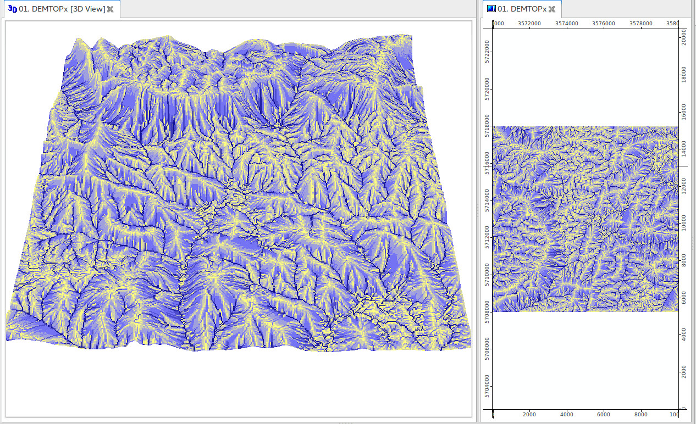

# Software installation and first steps {#software}

*Edited by: T. Hengl*

This section contains instruction on how to install and use software to run predictive soil mapping and export results to GIS or web applications. It has been written (as most of the book) for Linux users, but should not be too much of a problem to adopt to Microsoft Windows OS and/or Mac OS. 

## List of software in use

<div class="figure" style="text-align: center">

<p class="caption">(\#fig:software-triangle)Software combination used in this book.</p>
</div>

For processing the covariates we used a combination of Open Source GIS
software, primarily SAGA GIS [@gmd-8-1991-2015], packages raster [@raster],
sp [@pebesma2005classes], and GDAL [@mitchell2014geospatial] for reprojecting,
mosaicking and merging tiles. GDAL and parallel packages in R are highly suitable for
processing large data.

Software (required):

*  [R](http://cran.r-project.org/bin/windows/base/) or [MRO](https://mran.microsoft.com/download/);

*  [RStudio](http://www.rstudio.com/products/RStudio/);

*  R packages: GSIF, plotKML, aqp, ranger, caret, xgboost, plyr, raster, gstat, randomForest, ggplot2, e1071 (see: [how to install R package](http://www.r-bloggers.com/installing-r-packages/))

*  [SAGA GIS](http://sourceforge.net/projects/saga-gis/) (on Windows machines run windows installer);

*  Google Earth or Google Earth Pro; 

*  [GDAL v2.x](https://trac.osgeo.org/gdal/wiki/DownloadingGdalBinaries) for Windows machines use e.g. ["gdal-*-1800-x64-core.msi"](http://download.gisinternals.com/sdk/downloads/release-1800-x64-gdal-2-1-3-mapserver-7-0-4/gdal-201-1800-x64-core.msi);

R script used in this tutorial you can download from the **[github](https://github.com/envirometrix/PredictiveSoilMapping)**. As a gentle introduction to R programming language and soil classes in R we recommend the chapter on importing and using soil data. Some more example of SAGA GIS + R usage you can find in the soil covariates chapter. To visualize spatial predictions in a web-browser or Google Earth you could also consider following the soil web-maps tutorial. As a gentle introduction to R programming language and spatial classes in R we recommend following [the Geocomputation with R book](https://geocompr.robinlovelace.net/). Obtaining also the [R reference card](https://cran.r-project.org/doc/contrib/Baggott-refcard-v2.pdf) is highly recommended.

## Installing software on Ubuntu OS

On Ubuntu (often the recommended standard for GIS community) main software can be installed within 10--20 minutes. We start with installing GDAL, proj4 and some packages that you might need later on:


```bash
sudo apt-get install libgdal-dev libproj-dev libjasper-dev
sudo apt-get install gdal-bin python-gdal
```

Next, we can install R and RStudio. For R studio you can use the CRAN distribution or the optimized distribution provided by (the former REvolution company; now Microsoft):


```bash
wget https://mran.blob.core.windows.net/install/mro/3.4.3/microsoft-r-open-3.4.3.tar.gz
tar -xf microsoft-r-open-3.4.3.tar.gz
cd microsoft-r-open/
sudo ./install.sh
```

Note that the R versions are constantly being updated so you will need to replace the URL based on the information provided on the home page (http://mran.microsoft.com). Once you run ```install.sh``` you will have to accept the license terms two times before the installation can be completed. If everything went successful, you can get the session info by:


```r
sessionInfo()
#> R version 3.4.3 (2017-11-30)
#> Platform: x86_64-pc-linux-gnu (64-bit)
#> Running under: Ubuntu 16.04.4 LTS
#> 
#> Matrix products: default
#> BLAS: /opt/microsoft/ropen/3.4.3/lib64/R/lib/libRblas.so
#> LAPACK: /opt/microsoft/ropen/3.4.3/lib64/R/lib/libRlapack.so
#> 
#> locale:
#>  [1] LC_CTYPE=en_US.UTF-8       LC_NUMERIC=C              
#>  [3] LC_TIME=en_US.UTF-8        LC_COLLATE=en_US.UTF-8    
#>  [5] LC_MONETARY=en_US.UTF-8    LC_MESSAGES=en_US.UTF-8   
#>  [7] LC_PAPER=en_US.UTF-8       LC_NAME=C                 
#>  [9] LC_ADDRESS=C               LC_TELEPHONE=C            
#> [11] LC_MEASUREMENT=en_US.UTF-8 LC_IDENTIFICATION=C       
#> 
#> attached base packages:
#> [1] methods   stats     graphics  grDevices utils     datasets  base     
#> 
#> other attached packages:
#>  [1] raster_2.6-7           rgdal_1.2-16           plotKML_0.5-9         
#>  [4] quantregForest_1.3-7   RColorBrewer_1.1-2     randomForest_4.6-12   
#>  [7] gstat_1.1-5            rpart_4.1-11           plyr_1.8.4            
#> [10] aqp_1.15               boot_1.3-20            sp_1.2-5              
#> [13] GSIF_0.5-4             microbenchmark_1.4-2.1 RevoUtils_10.0.7      
#> [16] RevoUtilsMath_10.0.1  
#> 
#> loaded via a namespace (and not attached):
#>  [1] splines_3.4.3       Formula_1.2-2       highr_0.6          
#>  [4] latticeExtra_0.6-28 pixmap_0.4-11       yaml_2.1.16        
#>  [7] pillar_1.0.1        backports_1.1.2     lattice_0.20-35    
#> [10] digest_0.6.13       checkmate_1.8.5     colorspace_1.3-2   
#> [13] htmltools_0.3.6     Matrix_1.2-12       XML_3.98-1.9       
#> [16] bookdown_0.7.12     scales_0.5.0        intervals_0.15.1   
#> [19] htmlTable_1.11.1    tibble_1.4.1        ggplot2_2.2.1      
#> [22] RSAGA_0.94-5        nnet_7.3-12         lazyeval_0.2.1     
#> [25] survival_2.41-3     magrittr_1.5        evaluate_0.10.1    
#> [28] MASS_7.3-47         xts_0.10-1          foreign_0.8-69     
#> [31] class_7.3-14        FNN_1.1             tools_3.4.3        
#> [34] dismo_1.1-4         shapefiles_0.7      data.table_1.10.4-3
#> [37] stringr_1.2.0       munsell_0.4.3       cluster_2.0.6      
#> [40] plotrix_3.7         colorRamps_2.3      compiler_3.4.3     
#> [43] e1071_1.6-8         spacetime_1.2-1     rlang_0.1.6        
#> [46] classInt_0.1-24     grid_3.4.3          rstudioapi_0.7     
#> [49] htmlwidgets_0.9     base64enc_0.1-3     rmarkdown_1.8      
#> [52] gtable_0.2.0        codetools_0.2-15    reshape_0.8.7      
#> [55] gridExtra_2.3       zoo_1.8-0           knitr_1.18         
#> [58] Hmisc_4.0-3         rprojroot_1.3-1     stringi_1.1.6      
#> [61] Rcpp_0.12.14        acepack_1.4.1       xfun_0.1
system("gdalinfo --version")
```

This shows for example that the this installation of R is based on the Ubuntu 16.* LTS and the version of GDAL is up to date. Using an optimized distribution of R (read more about ["The Benefits of Multithreaded Performance with Microsoft R Open"](https://mran.microsoft.com/documents/rro/multithread)) is especially important if you plan to use R for production purposes i.e. to optimize computing and generation of soil maps for large amount of pixels.

To install RStudio we can run:


```bash
sudo apt-get install gdebi-core
wget https://download1.rstudio.org/rstudio-1.1.447-amd64.deb 
sudo gdebi rstudio-1.1.447-amd64.deb
sudo rm rstudio-1.1.447-amd64.deb
```

Again, RStudio is constantly updated so you might have to adjust the rstudio version and distribution.

Predictive soil mapping is about making maps, and maps require a GIS software so that one can open view overlay and analyze the maps. GIS software recommended for soil mapping in this book is SAGA GIS, QGIS, GRASS GIS and Google Earth. To install SAGA GIS on Ubuntu we can use:


```bash
sudo add-apt-repository ppa:ubuntugis/ubuntugis-unstable
sudo apt-get update
sudo apt-get install saga
```

If installation was successful, you should be able to access SAGA command line also from R by using:


```r
system("saga_cmd --version")
```

To install QGIS (https://download.qgis.org/) you might first have to add the location of the debian libraries:


```bash
sudo sh -c 'echo "deb http://qgis.org/debian xenial main" >> /etc/apt/sources.list'  
sudo sh -c 'echo "deb-src http://qgis.org/debian xenial main " >> /etc/apt/sources.list'  
sudo apt-get update 
sudo apt-get install qgis python-qgis qgis-plugin-grass
```

Other utility software that you might need include `htop` that allows you to track processing progress:


```bash
sudo apt-get install htop iotop
```

and some additional libraries used be `devtools`, `geoR` and similar can be installed via:


```bash
sudo apt-get install build-essential automake; 
        libcurl4-openssl-dev pkg-config libxml2-dev;
        libfuse-dev mtools libpng-dev libudunits2-dev
```

You might also need the `7z` software for easier compression and `pigz` for parallelized compression:


```bash
sudo apt-get install pigz zip unzip p7zip-full 
```

## WhiteboxTools {#Whitebox}

WhiteboxTools (http://www.uoguelph.ca/~hydrogeo/WhiteboxTools/), contributed by John Lindsay, is an extensive suite of functions and tools for DEM analysis and can be used to supplement especially hydrological and morphometric analysis available in SAGA GIS and GRASS GIS [@lindsay2016whitebox]. Probably the easiest way to use WhiteboxTools is to install a QGIS plugin (kindly maintained by Alexander Bruy: https://plugins.bruy.me/) and then learn and extend the WhiteboxTools scripting language by testing things out in QGIS (see below).

<div class="figure" style="text-align: center">

<p class="caption">(\#fig:whiteboxtools-preview)Calling WhiteboxTools from QGIS via the WhiteboxTools plugin.</p>
</div>

The function `FlowAccumulationFullWorkflow` is for example a wrapper function to filter out all spurious sinks and derive hydrological flow accumulation map all at once. To run it from command line we can use:


```r
system(paste0('"/home/tomislav/software/WBT/whitebox_tools" ',
  '--run=FlowAccumulationFullWorkflow --dem="./extdata/DEMTOPx.tif" ',
  '--out_type="Specific Contributing Area" --log="False" --clip="False" --esri_pntr="False" ',
  '--out_dem="./extdata/DEMTOPx_out.tif" ',
  '--out_pntr="./extdata/DEMTOPx_pntr.tif" ',
  '--out_accum="./extdata/DEMTOPx_accum.tif" -v'))
```

<div class="figure" style="text-align: center">

<p class="caption">(\#fig:eberg-hydroflow-preview-3d)Hydrological flow accummulation map based on the Ebergotzen DEM derived using WhiteboxTools.</p>
</div>

This produces number of maps, from which usually the hydrological flow accumulation map is potentially most useful. It is highly recommended that, before you start running analysis on large DEM's using WhiteboxTools and/or SAGA GIS, is that you test functionality using smaller data sets i.e. either a subset of the original data or using DEM at very coarse resolutions (so that width and height of a DEM is only few hundred pixels). Also note that WhiteboxTools do not work with GeoTIFFs produced using the `COMPRESS=DEFLATE` creation options.

## RStudio {#Rstudio}

RStudio is, in principle, the main R scripting environment and can be used to control all other software used in the course. A more detailed RStudio tutorial is available at: [RStudio — Online Learning](http://www.rstudio.com/resources/training/online-learning/). Consider also following some spatial data tutorials e.g. by James Cheshire (http://spatial.ly/r/). Below is an example of RStudio session with R editor on right and R console on left.

<div class="figure" style="text-align: center">

<p class="caption">(\#fig:rstudio-example)RStudio is a commonly used R editor written in C++.</p>
</div>

To install all required R packages used in some script at once, you can use:


```r
ls <- c("rgdal", "raster", "GSIF", "plotKML", 
        "nnet", "plyr", "ROCR", "randomForest", 
        "psych", "mda", "h2o", "dismo", "grDevices", 
        "snowfall", "hexbin", "lattice", "ranger", 
        "soiltexture", "aqp", "colorspace", "Cubist",
        "randomForestSRC", "ggRandomForests", "scales",
        "xgboost", "parallel", "doParallel", "caret", 
        "gam", "glmnet", "matrixStats", "SuperLearner")
new.packages <- ls[!(ls %in% installed.packages()[,"Package"])]
if(length(new.packages)) install.packages(new.packages)
```

This will basically check if some package is installed already, then install it if it is missing only. You can put this line at top of each R script that you share so that anybody using that script will automatically get all missing packages.

The h2o package requires Java libraries, so you should first install Java by using e.g.:


```bash
sudo add-apt-repository ppa:webupd8team/java
sudo apt-get update
sudo apt-get install oracle-java8-installer
java -version
```

## plotKML and GSIF packages

Many examples in the GSIF course rely on the top 5 most commonly used packages for spatial data: (1) [sp and rgdal](https://cran.r-project.org/web/views/Spatial.html), (2) [raster](https://cran.r-project.org/web/packages/raster/), (3) [plotKML](http://plotkml.r-forge.r-project.org/) and (4) [GSIF](http://gsif.r-forge.r-project.org/). To install most up-to-date version of plotKML/GSIF, you can also use the R-Forge versions of the package:


```r
if(!require(GSIF)){
  install.packages("GSIF", repos=c("http://R-Forge.R-project.org"), 
                 type = "source", dependencies = TRUE)
}
```

A copy of the most-up-to-date stable versions of plotKML and GSIF is also available on [github](https://github.com/cran/GSIF). To run only some specific function from GSIF package you could do for example:


```r
source_https <- function(url, ...) {
   # load package
   require(RCurl)
   # download:
   cat(getURL(url, followlocation = TRUE, 
       cainfo = system.file("CurlSSL", "cacert.pem", package = "RCurl")), 
       file = basename(url))
   source(basename(url))
}
source_https("https://raw.githubusercontent.com/cran/GSIF/master/R/OCSKGM.R")
```

To test if these packages work properly create soil maps and visualize them in Google Earth by running the following lines of code (see also function: [fit.gstatModel](http://gsif.r-forge.r-project.org/fit.gstatModel.html)):


```r
library(GSIF)
library(sp)
library(boot)
library(aqp)
library(plyr)
library(rpart)
library(splines)
library(gstat)
library(quantregForest)
library(plotKML)
demo(meuse, echo=FALSE)
omm <- fit.gstatModel(meuse, om~dist+ffreq, meuse.grid, method="quantregForest")
#> Fitting a Quantile Regression Forest model...
#> Fitting a 2D variogram...
#> Saving an object of class 'gstatModel'...
om.rk <- predict(omm, meuse.grid)
#> Subsetting observations to fit the prediction domain in 2D...
#> Prediction error for 'randomForest' model estimated using the 'quantreg' package.
#> Generating predictions using the trend model (RK method)...
#> [using ordinary kriging]
#> 
100% done
#> Running 5-fold cross validation using 'krige.cv'...
#> Creating an object of class "SpatialPredictions"
om.rk
#>   Variable           : om 
#>   Minium value       : 1 
#>   Maximum value      : 17 
#>   Size               : 153 
#>   Total area         : 4964800 
#>   Total area (units) : square-m 
#>   Resolution (x)     : 40 
#>   Resolution (y)     : 40 
#>   Resolution (units) : m 
#>   Vgm model          : Exp 
#>   Nugget (residual)  : 2.34 
#>   Sill (residual)    : 8.32 
#>   Range (residual)   : 5760 
#>   RMSE (validation)  : 1.7 
#>   Var explained      : 75.2% 
#>   Effective bytes    : 1226 
#>   Compression method : gzip
#plotKML(om.rk)
```

<div class="figure" style="text-align: center">

<p class="caption">(\#fig:ge-preview)Example of plotKML output.</p>
</div>

## Connecting R and SAGA GIS

SAGA GIS is an extensive GIS geoprocessor software with over [600 functions](http://www.saga-gis.org/saga_tool_doc/index.html). 
SAGA GIS can not be installed from RStudio (it is not a package for R). 
Instead, you need to install SAGA GIS using the installation instructions from the [software homepage](https://sourceforge.net/projects/saga-gis/). 
After you have installed SAGA GIS, you can send processes from 
R to SAGA GIS by using the ```saga_cmd``` command line interface:


```r
if(!Sys.info()['sysname']=="Linux"){
  saga_cmd = "C:/Progra~1/SAGA-GIS/saga_cmd.exe"
} else {
  saga_cmd = "saga_cmd"
}
system(paste(saga_cmd, "-v"))
```

To use some SAGA GIS function you need to carefully follow 
the [SAGA GIS command line arguments](http://www.saga-gis.org/saga_tool_doc/index.html). For example, 


```r
library(plotKML)
library(rgdal)
library(raster)
data("eberg_grid")
gridded(eberg_grid) <- ~x+y
proj4string(eberg_grid) <- CRS("+init=epsg:31467")
writeGDAL(eberg_grid["DEMSRT6"], "./extdata/DEMSRT6.sdat", "SAGA")
system(paste(saga_cmd, 'ta_lighting 0 -ELEVATION "./extdata/DEMSRT6.sgrd" 
             -SHADE "./extdata/hillshade.sgrd" -EXAGGERATION 2'))
```

<div class="figure" style="text-align: center">

<p class="caption">(\#fig:rstudio-saga-gis)Deriving hillshading using SAGA GIS and then visualizing the result in R.</p>
</div>

## Connecting R and GDAL

Another very important software for handling spatial data (and especially for exchanging / converting spatial data) is GDAL. GDAL also needs to be installed separately (for Windows machines use e.g. ["gdal-201-1800-x64-core.msi"](http://download.gisinternals.com/sdk/downloads/release-1800-x64-gdal-2-1-3-mapserver-7-0-4/gdal-201-1800-x64-core.msi)) and then can be called from command line:


```r
if(.Platform$OS.type == "windows"){
  gdal.dir <- shortPathName("C:/Program files/GDAL")
  gdal_translate <- paste0(gdal.dir, "/gdal_translate.exe")
  gdalwarp <- paste0(gdal.dir, "/gdalwarp.exe") 
} else {
  gdal_translate = "gdal_translate"
  gdalwarp = "gdalwarp"
}
system(paste(gdalwarp, "--help"))
```

We can use GDAL to reproject grid from the previous example:


```r
system('gdalwarp ./extdata/DEMSRT6.sdat ./extdata/DEMSRT6_ll.tif -t_srs \"+proj=longlat +datum=WGS84\"')
library(raster)
plot(raster("./extdata/DEMSRT6_ll.tif"))
```

<div class="figure" style="text-align: center">

<p class="caption">(\#fig:plot-eberg-ll)Ebergotzen DEM reprojected in geographical coordinates.</p>
</div>
