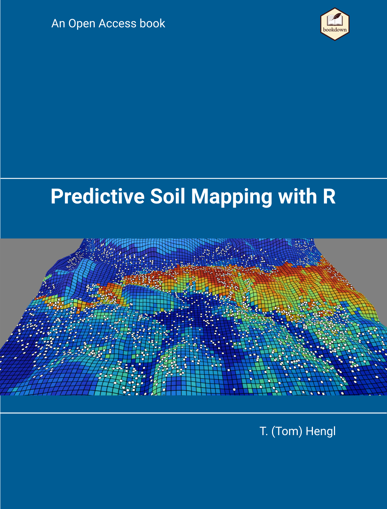

---
knit: "bookdown::render_book"
title: "Predictive Soil Mapping with R"
author: ["Tomislav Hengl"]
date: "2018-06-07"
site: bookdown::bookdown_site
documentclass: svmono
classoption: 11pt,graybox,envcountchap,symmetric,sectrefs,UStrade
monofontoptions: "Scale=0.6"
linestretch: 1.15
bibliography: refs.bib
biblio-style: apalike
link-citations: true
colorlinks: yes
twitter-handle: tom_hengl
cover-image: figures/f0_web.png
description: "Predictive Soil Mapping aims at producing most accurate, most objective, and most usable maps of soil variables by using state-of-the-art Statistical and Machine Learning methods. This books explains how to implement various soil mapping procedures in R."
github-repo: envirometrix/PredictiveSoilMapping
url: 'http\://soilmapper.org'
---


# Predictive Soil Mapping for advanced R users {-}



This is the online version of the Open Access book: [**Predictive Soil Mapping with R**](https://envirometrix.github.io/PredictiveSoilMapping/). Pull requests and general comments are welcome. These materials are based on the technical tutorials developed within the [ISRIC’s]](http://isric.org/) Global Soil Information Facilities (GSIF) framework for automated soil mapping over the period 2014–2017.

<br />**This website is under construction**. For news and updates please refer to the [github issues](https://github.com/envirometrix/PredictiveSoilMapping/issues).

Hard copies of this book from will be made available in the second half of 2018.

## Editors {-}

[Tom Hengl](http://envirometrix.net/staff) is a Senior Researchers / technical director at Envirometrix Ltd. 
He has more than 20 years of experience as an environmental modeller, data scientist and spatial analyst. 
Tom is a passionate advocate for, and supporter of, open data, reproducable science and career development 
for young scientists. He has desiged and implemented the global [SoilGrids](http://journals.plos.org/plosone/article?id=10.1371/journal.pone.0169748) dataset, 
partially in response to other well known open data projects such as OpenStreetMap, GBIF, GlobalForestWatch 
and global climate mapping projects. He has been teaching predictive soil mapping at Wageningen University / 
ISRIC within the “Hands-on-GSIF” block courses. Video tutorials of the soil mapping with R can also be 
found at http://youtube.com/c/ISRICorg

# Preface {-}

Predictive Soil Mapping (PSM) is based on applying statistical and/or machine learning techniques to fit models for the purpose of producing spatial and/or spatiotemporal predictions of soil variables i.e. maps of soil properties and classes at different resolutions. It is a multidisciplinary field combining statistics, data science, soil science, physical geography, remote sensing, geoinformation science and number of other sciences. *Predictive Soil Mapping with R* is about understanding the main concepts behind soil mapping, mastering R packages that can be used to produce high quality soil maps, and about optimizing all processes involved so that also the production costs can be reduced.

The main idea behind Predictive vs traditional expert-based soil mapping is that production of maps: (a) 
is based on using state-of-the-art statistical models to ensure objectivity of maps (including objective uncertainty assessment) vs expert judgment, and (b) is driven by automation of the processes so that overall soil data production costs can be reduced and updates of the maps implemented without a need for large investments. R in that sense is a logical platform to develop PSM workflows and applications, especially thanks to the vibrant and productive R spatial interest group activities and also thanks to the increasingly professional soil data packages such as the soiltexture, aqp, soilprofile, soilDB and similar.

Book is divided into sections covering theoretical concepts, preparation of covariates, model selection and evaluation, prediction and visualization and distribution of final maps. Most of chapters contain R code examples that try to illustrate main processing steps and give practical instructions to developers and applied users.

## Connected publications {-}

Most of methods described in this book are based on the following publications:

* Hengl, T., Nussbaum, M., Wright, M. N., Heuvelink, G. B., and Gr&auml;ler, B. (2018) [Random Forest as a generic framework for predictive modeling of spatial and spatio-temporal variables](https://peerj.com/preprints/26693/). PeerJ Preprints.

* Sanderman, J., Hengl, T., Fiske, G., (2017) [The soil carbon debt of 12,000 years of human land use](http://www.pnas.org/content/early/2017/08/15/1706103114.full). PNAS, doi:10.1073/pnas.1706103114

* Hengl, T., Leenaars, J. G., Shepherd, K. D., Walsh, M. G., Heuvelink, G. B., Mamo, T., et al. (2017) [Soil nutrient maps of Sub-Saharan Africa: assessment of soil nutrient content at 250 m spatial resolution using machine learning](https://link.springer.com/article/10.1007/s10705-017-9870-x). Nutrient Cycling in Agroecosystems, 109(1), 77–102.

* Hengl T, Mendes de Jesus J, Heuvelink GBM, Ruiperez Gonzalez M, Kilibarda M, Blagotic A, et al. (2017) [SoilGrids250m: Global gridded soil information based on machine learning](http://dx.doi.org/10.1371/journal.pone.0169748). PLoS ONE 12(2): e0169748. doi:10.1371/journal.pone.0169748

* Hengl, T., Roudier, P., Beaudette, D., & Pebesma, E. (2015) [plotKML: scientific visualization of spatio-temporal data](https://www.jstatsoft.org/article/view/v063i05). Journal of Statistical Software, 63(5).

* Gasch, C. K., Hengl, T., Gr&auml;ler, B., Meyer, H., Magney, T. S., & Brown, D. J. (2015) [Spatio-temporal interpolation of soil water, temperature, and electrical conductivity in 3D+ T: The Cook Agronomy Farm data set](https://doi.org/10.1016/j.spasta.2015.04.001). Spatial Statistics, 14, 70–90.

* Hengl, T., Nikolic, M., & MacMillan, R. A. (2013) [Mapping efficiency and information content](https://doi.org/10.1016/j.jag.2012.02.005). International Journal of Applied Earth Observation and Geoinformation, 22, 127–138.

* Hengl, T., Heuvelink, G. B., & Rossiter, D. G. (2007) [About regression-kriging: from equations to case studies](https://doi.org/10.1016/j.cageo.2007.05.001). Computers & geosciences, 33(10), 1301-1315.

* Hengl, T. (2006) [Finding the right pixel size](https://doi.org/10.1016/j.cageo.2005.11.008). Computers & geosciences, 32(9), 1283–1298.

Some other publications / books on the subject of Predictive Soil Mapping include:

* Malone, B.P, Minasny, B., McBratney, A.B., (2016) [Using R for Digital Soil Mapping](https://www.springer.com/gp/book/9783319443256). Progress in Soil Science
ISBN: 9783319443270, 262 pages.

* California Soil Resource Lab, (2017) [Open Source Software Tools for Soil Scientists](https://casoilresource.lawr.ucdavis.edu/software/), UC Davis.

* McBratney, A.B., Minasny, B., Stockmann, U. (Eds) (2018) [Pedometrics](https://www.springer.com/gp/book/9783319634371). Progress in Soil Science
ISBN: 9783319634395, 720 pages.

Readers are also encouraged to obtain and study the following R books before following some of the more complex exercises in this book:

* Bivand, R., Pebesma, E., Rubio, V., (2013) [Applied Spatial Data Analysis with R](http://www.asdar-book.org/). Use R Series, Springer, Heidelberg, 2nd Ed. 400 pages.

* Kabacoff, R.I., (2011) [R in Action: Data Analysis and Graphics with R](http://www.manning.com/kabacoff/). Manning publications, ISBN: 9781935182399, 472 pages.

* Reimann, C., Filzmoser, P., Garrett, R., Dutter, R., (2008) [Statistical Data Analysis Explained Applied Environmental Statistics with R](https://onlinelibrary.wiley.com/doi/book/10.1002/9780470987605). Wiley, Chichester, 337 pages.

* Lovelace, R., Nowosad, J., Muenchow, J., (2018) [Geocomputation with R](https://geocompr.robinlovelace.net/). forthcoming book with CRC Press.

For the most recent developments in the R-spatial community refer to https://r-spatial.github.io and/or the R-sig-geo mailing list.

## Contributions {-}

This book is constantly updated and contributions are welcome (through pull requests, but also through adding new chapters) provided that some minimum requirements are met. To contribute a complete new chapter please contact the editors first. Some minimum requirements to contribute a chapter are:

1. The data needs to be available in majority of chapter, best via some R package or web-source.
2. Chapter should focus on implementing computing in R (it should be written as R tutorial).
3. All examples should be computationally efficient with not more than 30 secs of computing time per process on a single core system.
4. Theoretical basis for methods and interpretation of results should be based on peer-review publications. This book is not intended to host primary research / experimental results, but only to supplement existing research publications.
5. Chapter should consist of at least 1500 words and at most 3500 words.
6. The topic of the chapter must be closely connected to theme of soil mapping, soil geographical databases, methods for processing spatial soil data and similar.

## Reproducibility {-}

To reproduce the book, you need a recent version of [R](https://cran.r-project.org/), and [RStudio](http://www.rstudio.com/products/RStudio/) and up-to-date packages, which can be installed with the following command (which requires [**devtools**](https://github.com/hadley/devtools)):


```r
devtools::install_github("envirometrix/PredictiveSoilMapping")
```

To build the book locally, clone or [download](https://github.com/envirometrix/PredictiveSoilMapping/archive/master.zip) the [PredictiveSoilMapping repo](https://github.com/envirometrix/PredictiveSoilMapping/), load R in root directory (e.g. by opening [PredictiveSoilMapping.Rproj](https://github.com/envirometrix/PredictiveSoilMapping/blob/master/PredictiveSoilMapping.Rproj) in RStudio) and run the following lines:


```r
bookdown::render_book("index.Rmd") # to build the book
browseURL("_book/index.html") # to view it
```

## Acknowledgements {-}

The authors are grateful to numerous contributions from colleagues around the world, especially for the contributions by the current and former ISRIC — World Soil Information colleages: Robert MacMillan, Gerard Heuvelink, Johan Leenaars, Jorge Mendes de Jesus, Wei Shangguan, David G. Rossiter, and many others. ISRIC is a research foundation funded primarily by the Dutch Goverment. The authors also grateful to the support received via the [AfSIS project](http://africasoils.net), which has been funded by the Bill and Melinda Gates Foundation (BMGF) and the Alliance for a Green Revolution in Africa (AGRA). Many soil data processing examples in the book are based on the R code developed by Dylan Beuadette, Pierre Roudier, Julian Moeys, Brandad Malone and many other developers. Author is also grateful to comments and suggestions to the methods explained in the book by Travis Nauman, Amanda Ramcharan, David G. Rossiter and [Julian Moeys](http://julienmoeys.info/). 

SoilGrids are based on numerous soil profile data sets that have been
kindly contributed by various national and international agencies: the
USA National Cooperative Soil Survey Soil Characterization database
(http://ncsslabdatamart.sc.egov.usda.gov/) and profiles from the USA
National Soil Information System, Land Use/Land Cover Area
Frame Survey (LUCAS) Topsoil Survey database [@Toth2013LUCAS],
Africa Soil Profiles database [@Leenaars2012], Australian National Soil
Information by CSIRO Land and Water [@Karssies2011CSIRO; @searle2014australian], 
Mexican National soil profile database [@INEGI2000] provided by 
the Mexican Instituto Nacional de Estadística y Geografía / CONABIO, 
Brazilian national soil profile database [@cooper2005national] 
provided by the University of São Paulo, Chinese
National Soil Profile database [@shangguan2013china] provided by the
Institute of Soil Science, Chinese Academy of Sciences, soil profile
archive from the Canadian Soil Information System [@macdonald1992cansis]
and Forest Ecosystem Carbon Database (FECD), ISRIC-WISE [@Batjes2009SUM],
The Northern Circumpolar Soil Carbon Database [@essd-5-3-2013], eSOTER
profiles [@VanEngelen2012], SPADE [@hollis2006spade], Unified State Register
of soil resources RUSSIA (Version 1.0. Moscow — 2014), National Database
of Iran provided by the Tehran University, points from the Dutch Soil
Information System (BIS) prepared by Wageningen Environmental Research,
and others. We are also grateful to USA’s NASA, USGS and USDA agencies,
European Space Agency Copernicus projects, JAXA (Japan Aerospace Exploration Agency)
for distributing vast amounts of remote sensing data (especially MODIS, Landsat, Copernicus
land products and elevation data), and to the Open Source software developers
of the packages rgdal, sp, raster, caret, mlr, ranger, h2o and similar, 
and without which predictive soil mapping would most likely not be possible.

This book has been inspired by the [the Geocomputation with R book](https://geocompr.robinlovelace.net/), an Open Access book edited by Robin Lovelace, Jakub Nowosad and Jannes Muenchow. Many thanks to Robin Lovelace for helping with rmarkdown and for giving some initial tips for compiling and organizing book. The author is also grateful to the numerous software/package developers, especially Edzer Pebesma, Roger Bivand, Robert Hijmans, Markus Neteler, Tim Appelhans, and Hadley Wickham, that have enabled a generation of researchers and applied projects. 

Every effort has been made to trace copyright holders of the materials used in these materials. Should we, despite all our efforts have overlooked contributors please contact the author and we shall correct this unintentional omission without any delay and will acknowledge any overlooked contributions and contributors in future updates. 

**Data availability**: All data used in this book is either available through R packages or is available via the github repository. If not mentioned otherwise, all code presented is available under the [GNU General Public License v2.0](https://www.gnu.org/licenses/old-licenses/gpl-2.0.en.html).

**Copyright**: &copy; 2018 Hengl et al.

<a rel="license" href="http://creativecommons.org/licenses/by-sa/4.0/"></a><br />This work is licensed under a <a rel="license" href="http://creativecommons.org/licenses/by-sa/4.0/">Creative Commons Attribution-ShareAlike 4.0 International License</a>.
