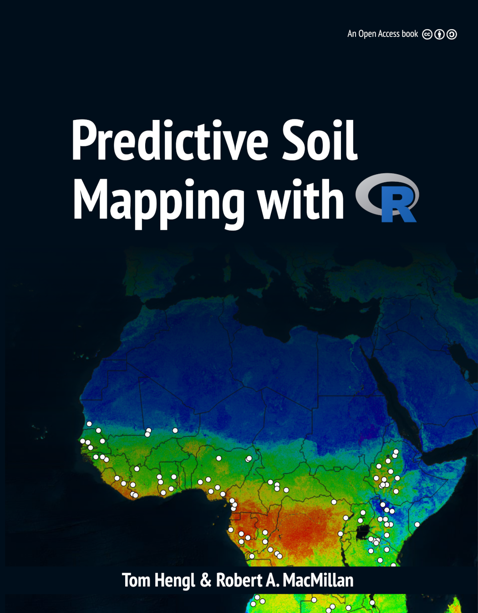

---
title: "Predictive Soil Mapping with R"
author: ["Tomislav Hengl and Robert A. MacMillan"]
date: "2019-02-09"
knit: bookdown::render_book
site: bookdown::bookdown_site
documentclass: svmono
classoption: graybox,natbib,nospthms
geometry: "paperwidth=18.90cm, paperheight=24.58cm, top=2.1cm, bottom=2.1cm, inner=2cm, outer=2cm,"
#geometry: "top=1.6cm, bottom=2cm, left=1cm, right=1cm"
monofont: "Source Code Pro"
monofontoptions: "Scale=0.7"
bibliography: refs.bib
biblio-style: spbasic
link-citations: yes
twitter-handle: tom_hengl
cover-image: figures/f0_web.png
description: "Predictive Soil Mapping aims to produce the most accurate, most objective, and most usable maps of soil variables by using state-of-the-art Statistical and Machine Learning methods. This books explains how to implement common soil mapping procedures within the R programming language."
github-repo: envirometrix/PredictiveSoilMapping
url: 'http\://soilmapper.org'
colorlinks: yes
graphics: yes
---


# Predictive Soil Mapping for advanced R users {-}



This is the online version of the Open Access book: [**Predictive Soil Mapping with R**](https://envirometrix.github.io/PredictiveSoilMapping/). Pull requests and general comments are welcome. These materials are based on technical tutorials initially developed by the [ISRIC's](http://isric.org/) Global Soil Information Facilities (GSIF) development team over the period 2014–2017.

**This book is continuously updated**. For news and updates please refer to the [github issues](https://github.com/envirometrix/PredictiveSoilMapping/issues).

Hard copies of this book can be ordered from [www.lulu.com](http://www.lulu.com/shop/tomislav-hengl-and-robert-a-macmillan/predictive-soil-mapping-with-r/paperback/product-23977071.html). By purchasing a hard copy of this book from Lulu you donate \$12 to the OpenGeoHub foundation.

**Cite this as**:

* Hengl, T., MacMillan, R.A., (2019). **Predictive Soil Mapping with R**. OpenGeoHub foundation, Wageningen, the Netherlands, 370 pages, www.soilmapper.org, ISBN: 978-0-359-30635-0.

## Editors {-}

[**Tom Hengl**](https://opengeohub.org/people/tom-hengl) is a Senior Researcher 
and Vice Chair of the OpenGeoHub Foundation / technical director at 
Envirometrix Ltd. Tom has more than 20 years of experience as an environmental 
modeler, data scientist and spatial analyst. He is a passionate advocate for, 
and supporter of, open data, reproducible science and career development 
for young scientists. He designed and implemented the global [SoilGrids](http://journals.plos.org/plosone/article?id=10.1371/journal.pone.0169748) data set, 
partially in response to other well known open data projects such as 
OpenStreetMap, GBIF, GlobalForestWatch and global climate mapping projects. 
He has taught predictive soil mapping at Wageningen University / ISRIC within 
the “Hands-on-GSIF” block courses. Video tutorials on predictive soil mapping 
with R can also be found at http://youtube.com/c/ISRICorg and 
https://www.youtube.com/c/OpenGeoHubFoundation. Tom currently 
leads the production of a web mapping system called “LandGIS” 
(https://landgis.opengeohub.org) which is envisaged as *“an OpenStreetMap-type system”* 
for land-related environmental data. The system hosts global, fine spatial 
resolution data (250 m to 1 km) including various soil classes and soil 
properties, which is intended for eventual integration and use at operational 
or farm-scales.

[**Bob MacMillan**](https://opengeohub.org/people/bob-macmillan) is a retired 
environmental consultant with over 40 years of experience in creating, 
packaging, delivering and using environmental information on soils, ecosystems, 
landforms and hydrology. Bob spent 19 years working in public sector research 
with the Alberta Research Council and Agriculture and Agri-Food Canada and a 
second 20 years as a private sector consultant offering services in predictive 
soil and ecological mapping. Since retiring, Bob has remained an active 
supporter, promoter, advocate, mentor and technical contributor to several 
continental to global scale efforts to advance the science and technology of 
mapping soils and other ecosystem components. As Science Coordinator for the 
GlobalSoilMap project, Bob helped to articulate the vision for the project 
and led initial activities aimed at achieving this, including authoring 
technical specifications, promoting the project, recruiting 
participants/cooperators, and liaising with representatives of national 
and international soil agencies. Bob continues to contribute on a voluntary 
basis to OpenGeoHub and the Africa Soil Information Servicce (AfSIS) 
(http://africasoils.net). Throughout his career, Bob has shared his 
expertise and his enthusiasm freely with dozens of younger scientists 
interested in learning about, and becoming, practitioners of digital soil 
mapping. Bob continues to support the next generation of digital soil mappers 
through his involvement with OpenGeoHub. 

# Preface {-}

Predictive Soil Mapping (PSM) is based on applying statistical and/or machine learning techniques to fit models for the purpose of producing spatial and/or spatiotemporal predictions of soil variables, i.e. maps of soil properties and classes at different resolutions. It is a multidisciplinary field combining statistics, data science, soil science, physical geography, remote sensing, geoinformation science and a number of other sciences [@Scul01; @MCBRATNEY20033; @Henderson2004Geoderma; @Boettinger2010Springer; @Zhu2015PSM]. *Predictive Soil Mapping with R* is about understanding the main concepts behind soil mapping, mastering R packages that can be used to produce high quality soil maps, and about optimizing all processes involved so that production costs can also be reduced.

The main differences between predictive vs traditional expert-based soil mapping are that: (a) the production of maps 
is based on using state-of-the-art statistical methods to ensure objectivity of maps (including objective uncertainty assessment vs expert judgment), and (b) PSM is driven by automation of the processes so that overall soil data production costs can be reduced and updates of maps implemented without requirements for large investments. R, in that sense, is a logical platform to develop PSM workflows and applications, especially thanks to the vibrant and productive R spatial interest group activities and also thanks to the increasingly professional soil data packages such as, for example: soiltexture, aqp, soilprofile, soilDB and similar.

The book is divided into sections covering theoretical concepts, preparation of covariates, model selection and evaluation, prediction and final practical tips for operational PSM. Most of the chapters contain R code examples that try to illustrate the main processing steps and give practical instructions to developers and applied users.

## Connected publications {-}

Most of methods described in this book are based on the following publications:

* Hengl, T., Nussbaum, M., Wright, M. N., Heuvelink, G. B., and Gr&auml;ler, B. (2018) [Random Forest as a generic framework for predictive modeling of spatial and spatio-temporal variables](https://doi.org/10.7717/peerj.5518). PeerJ 6:e5518.

* Sanderman, J., Hengl, T., Fiske, G., (2017) [The soil carbon debt of 12,000 years of human land use](http://www.pnas.org/content/early/2017/08/15/1706103114.full). PNAS, doi:10.1073/pnas.1706103114

* Ramcharan, A., Hengl, T., Nauman, T., Brungard, C., Waltman, S., Wills, S., & Thompson, J. (2018). [Soil Property and Class Maps of the Conterminous United States at 100-Meter Spatial Resolution](https://dl.sciencesocieties.org/publications/sssaj/abstracts/82/1/186). Soil Science Society of America Journal, 82(1), 186–201.

* Hengl, T., Leenaars, J. G., Shepherd, K. D., Walsh, M. G., Heuvelink, G. B., Mamo, T., et al. (2017) [Soil nutrient maps of Sub-Saharan Africa: assessment of soil nutrient content at 250 m spatial resolution using machine learning](https://link.springer.com/article/10.1007/s10705-017-9870-x). Nutrient Cycling in Agroecosystems, 109(1), 77–102.

* Hengl T, Mendes de Jesus J, Heuvelink GBM, Ruiperez Gonzalez M, Kilibarda M, Blagotic A, et al. (2017) [SoilGrids250m: Global gridded soil information based on machine learning](http://dx.doi.org/10.1371/journal.pone.0169748). PLoS ONE 12(2): e0169748. doi:10.1371/journal.pone.0169748

* Shangguan, W., Hengl, T., de Jesus, J. M., Yuan, H., & Dai, Y. (2017). [Mapping the global depth to bedrock for land surface modeling](https://doi.org/10.1002/2016MS000686). Journal of Advances in Modeling Earth Systems, 9(1), 65-88.

* Hengl, T., Roudier, P., Beaudette, D., & Pebesma, E. (2015) [plotKML: scientific visualization of spatio-temporal data](https://www.jstatsoft.org/article/view/v063i05). Journal of Statistical Software, 63(5).

* Gasch, C. K., Hengl, T., Gr&auml;ler, B., Meyer, H., Magney, T. S., & Brown, D. J. (2015) [Spatio-temporal interpolation of soil water, temperature, and electrical conductivity in 3D+ T: The Cook Agronomy Farm data set](https://doi.org/10.1016/j.spasta.2015.04.001). Spatial Statistics, 14, 70–90.

* Hengl, T., Nikolic, M., & MacMillan, R. A. (2013) [Mapping efficiency and information content](https://doi.org/10.1016/j.jag.2012.02.005). International Journal of Applied Earth Observation and Geoinformation, 22, 127–138.

* Hengl, T., Heuvelink, G. B., & Rossiter, D. G. (2007) [About regression-kriging: from equations to case studies](https://doi.org/10.1016/j.cageo.2007.05.001). Computers & geosciences, 33(10), 1301-1315.

* Hengl, T. (2006) [Finding the right pixel size](https://doi.org/10.1016/j.cageo.2005.11.008). Computers & geosciences, 32(9), 1283–1298.

Some other relevant publications / books on the subject of Predictive Soil Mapping and Data Science in general include:

* Malone, B.P, Minasny, B., McBratney, A.B., (2016) [**Using R for Digital Soil Mapping**](https://www.springer.com/gp/book/9783319443256). Progress in Soil Science
ISBN: 9783319443270, 262 pages.

* Hengl, T., & MacMillan, R. A. (2009). [**Geomorphometry—a key to landscape mapping and modelling**](https://doi.org/10.1016/S0166-2481(08)00019-6). Developments in Soil Science, 33, 433–460. 

* California Soil Resource Lab, (2017) [**Open Source Software Tools for Soil Scientists**](https://casoilresource.lawr.ucdavis.edu/software/), UC Davis.

* McBratney, A.B., Minasny, B., Stockmann, U. (Eds) (2018) [**Pedometrics**](https://www.springer.com/gp/book/9783319634371). Progress in Soil Science
ISBN: 9783319634395, 720 pages.

* FAO, (2018) [**Soil Organic Carbon Mapping Cookbook**](https://github.com/FAO-GSP/SOC-Mapping-Cookbook). 2nd edt. ISBN: 9789251304402

Readers are also encouraged to obtain and study the following R books before following some of the more complex exercises in this book:

* Bivand, R., Pebesma, E., Rubio, V., (2013) [**Applied Spatial Data Analysis with R**](http://www.asdar-book.org). Use R Series, Springer, Heidelberg, 2nd Ed. 400 pages.

* Irizarry, R.A., (2018) [**Introduction to Data Science: Data Analysis and Prediction Algorithms with R**](https://rafalab.github.io/dsbook/). HarvardX Data Science Series.

* Kabacoff, R.I., (2011) [**R in Action: Data Analysis and Graphics with R**](http://www.manning.com/kabacoff/). Manning publications, ISBN: 9781935182399, 472 pages.

* Kuhn, M., Johnson, K. (2013) [**Applied Predictive Modeling**](http://appliedpredictivemodeling.com). Springer Science, ISBN: 9781461468493, 600 pages.

* Lovelace, R., Nowosad, J., Muenchow, J., (2018) [**Geocomputation with R**](https://geocompr.robinlovelace.net). R Series, CRC Press, ISBN: 9781138304512, 338 pages.

* Reimann, C., Filzmoser, P., Garrett, R., Dutter, R., (2008) [**Statistical Data Analysis Explained Applied Environmental Statistics with R**](https://onlinelibrary.wiley.com/doi/book/10.1002/9780470987605). Wiley, Chichester, 337 pages.

* Wilke, C.O., (2019) [**Fundamentals of Data Visualization**](https://serialmentor.com/dataviz/). O’Reilly, in press.

* Wikle, C.K., Zammit-Mangion, A., and Cressie, N. (2019). [**Spatio-Temporal Statistics with R**](https://spacetimewithr.org). Chapman & Hall/CRC, Boca Raton, FL.

For the most recent developments in the R-spatial community refer to https://r-spatial.github.io, the R-sig-geo mailing list and/or https://opengeohub.org.

## Contributions {-}

This book is designed to be constantly updated and contributions are always welcome (through pull requests, but also through adding new chapters) provided that some minimum requirements are met. To contribute a new chapter please contact the editors first. Some minimum requirements to contribute a chapter are:

1. The data needs to be available for the majority of tutorials presented in a chapter. It is best if this is via some R package or web-source.
2. A chapter should ideally focus on implementing some computing in R (it should be written as an R tutorial).
3. All examples should be computationally efficient requiring not more than 30 secs of computing time per process on a single core system.
4. The theoretical basis for methods and interpretation of results should be based on peer-review publications. This book is not intended to report on primary research / experimental results, but only to supplement existing research publications.
5. A chapter should consist of at least 1500 words and at most 3500 words.
6. The topic of the chapter must be closely connected to the theme of soil mapping, soil geographical databases, methods for processing spatial soil data and similar.

In principle, all submitted chapters should follow closely also the [five pillars of Wikipedia](https://en.wikipedia.org/wiki/Wikipedia:Five_pillars), especially: Verifiability, Reproducibility, No original research, Neutral point of view, Good faith, No conflict of interest, and No personal attacks.

## Reproducibility {-}

To reproduce the book, you need a recent version of [R](https://cran.r-project.org), and [RStudio](http://www.rstudio.com/products/RStudio/) and up-to-date packages, which can be installed with the following command (which requires [**devtools**](https://github.com/hadley/devtools)):


```r
devtools::install_github("Envirometrix/PSMpkg")
```

To build the book locally, clone or [download](https://github.com/envirometrix/PredictiveSoilMapping/archive/master.zip) the [PredictiveSoilMapping repo](https://github.com/envirometrix/PredictiveSoilMapping/), load R in root directory (e.g. by opening [PredictiveSoilMapping.Rproj](https://github.com/envirometrix/PredictiveSoilMapping/blob/master/PredictiveSoilMapping.Rproj) in RStudio) and run the following lines:


```r
bookdown::render_book("index.Rmd") # to build the book
browseURL("docs/index.html") # to view it
```

## Acknowledgements {-}

The authors are grateful for numerous contributions from colleagues around the world, especially for contributions by current and former ISRIC — World Soil Information colleagues and guest researchers: Gerard Heuvelink, Johan Leenaars, Jorge Mendes de Jesus, Wei Shangguan, David G. Rossiter, and many others. The authors are also grateful to Dutch and European citizens for financing ISRIC and Wageningen University, where work on this book was initially started. The authors acknowledge support received from the [AfSIS project](http://africasoils.net), which was funded by the Bill and Melinda Gates Foundation (BMGF) and the Alliance for a Green Revolution in Africa (AGRA). Many soil data processing examples in the book are based on R code developed by Dylan Beuadette, Pierre Roudier, Alessandro Samuel Rosa, Marcos E. Angelini, Guillermo Federico Olmedo, Julian Moeys, Brandon Malone, and many other developers. The authors are also grateful to comments and suggestions for improvements to the methods presented in the book by Travis Nauman, Amanda Ramcharan, David G. Rossiter and [Julian Moeys](http://julienmoeys.info). 

LandGIS and SoilGrids are based on using numerous soil profile data sets 
kindly made available by various national and international agencies: the
USA National Cooperative Soil Survey Soil Characterization database
(http://ncsslabdatamart.sc.egov.usda.gov) and profiles from the USA
National Soil Information System, Land Use/Land Cover Area
Frame Survey (LUCAS) Topsoil Survey database [@Toth2013LUCAS], 
Repositório Brasileiro Livre para Dados Abertos do Solo ([FEBR](https://github.com/febr-team)), 
Sistema de Información de Suelos de Latinoamérica y el Caribe (SISLAC),
Africa Soil Profiles database [@Leenaars2012], Australian National Soil
Information by CSIRO Land and Water [@Karssies2011CSIRO; @searle2014australian], 
Mexican National soil profile database [@INEGI2000] provided by 
the Mexican Instituto Nacional de Estadística y Geografía / CONABIO, 
Brazilian national soil profile database [@cooper2005national] 
provided by the University of São Paulo, Chinese
National Soil Profile database [@shangguan2013china] provided by the
Institute of Soil Science, Chinese Academy of Sciences, soil profile
archive from the Canadian Soil Information System [@macdonald1992cansis]
and Forest Ecosystem Carbon Database (FECD), ISRIC-WISE [@Batjes2009SUM],
The Northern Circumpolar Soil Carbon Database [@essd-5-3-2013], eSOTER
profiles [@VanEngelen2012], SPADE [@hollis2006spade], Unified State Register
of soil resources RUSSIA (Version 1.0. Moscow — 2014), National Database
of Iran provided by the Tehran University, points from the Dutch Soil
Information System (BIS) prepared by Wageningen Environmental Research,
and others. We are also grateful to USA’s NASA, USGS and USDA agencies,
European Space Agency Copernicus projects, JAXA (Japan Aerospace Exploration Agency)
for distributing vast amounts of remote sensing data (especially MODIS, Landsat, Copernicus
land products and elevation data), and to the Open Source software developers
of the packages rgdal, sp, raster, caret, mlr, ranger, SuperLearner, h2o and similar, 
and without which predictive soil mapping would most likely not be possible.

This book has been inspired by [the Geocomputation with R book](https://geocompr.robinlovelace.net), an Open Access book edited by Robin Lovelace, Jakub Nowosad and Jannes Muenchow. Many thanks to Robin Lovelace for helping with rmarkdown and for giving some initial tips for compiling and organizing this book. The authors are also grateful to the numerous software/package developers, especially Edzer Pebesma, Roger Bivand, Robert Hijmans, Markus Neteler, Tim Appelhans, and Hadley Wickham, whose contributions have enabled a generation of researchers and applied projects. 

We are especially grateful to [Jakub Nowosad](https://nowosad.github.io/) for helping with preparing this publication for press and with setting up all code so that it passes automatic checks.

OpenGeoHub is a not-for-profit research foundation with headquarters in Wageningen, the Netherlands (Stichting OpenGeoHub, KvK 71844570). The main goal of the OpenGeoHub is to promote publishing and sharing of Open Geographical and Geoscientific Data and using and developing of Open Source Software. We believe that the key measure of quality of research in all sciences (and especially in geographical information sciences) is in transparency and reproducibility of the computer code used to generate results. Transparency and reproducibility increase trust in information so that it is eventually also the fastest path to optimal decision making.

Every effort has been made to trace copyright holders of the materials used in this publication. Should we, despite all our efforts, have overlooked contributors please contact the author and we shall correct this unintentional omission without any delay and will acknowledge any overlooked contributions and contributors in future updates. 

---

**Data availability and Code license**: All data used in this book is either available through R packages or is available via the github repository. If not mentioned otherwise, all code presented is available under the [GNU General Public License v2.0](https://www.gnu.org/licenses/old-licenses/gpl-2.0.en.html).

**Copyright**: &copy; 2019 Authors.

<a rel="license" href="http://creativecommons.org/licenses/by-sa/4.0/"></a><br />This work is licensed under a <a rel="license" href="http://creativecommons.org/licenses/by-sa/4.0/">Creative Commons Attribution-ShareAlike 4.0 International License</a>. LandGIS and OpenGeoHub are registered trademarks of the OpenGeoHub Foundation (https://opengeohub.org).
