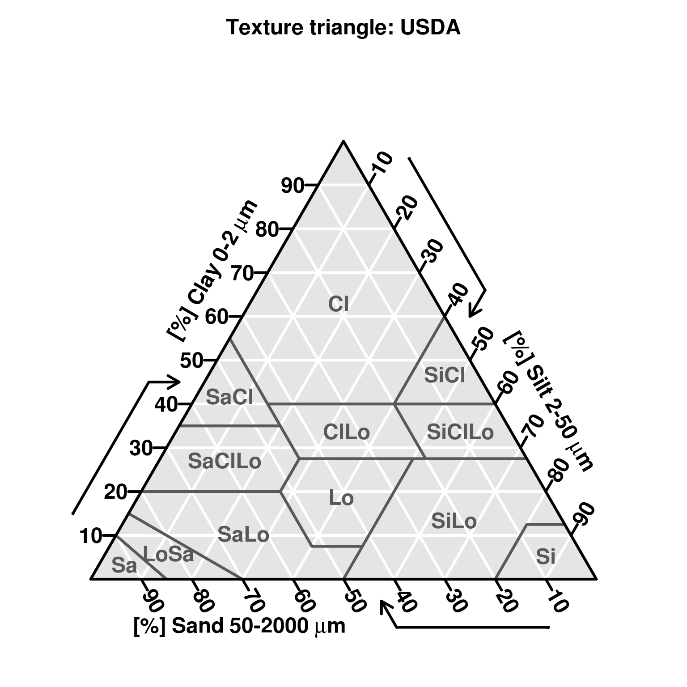
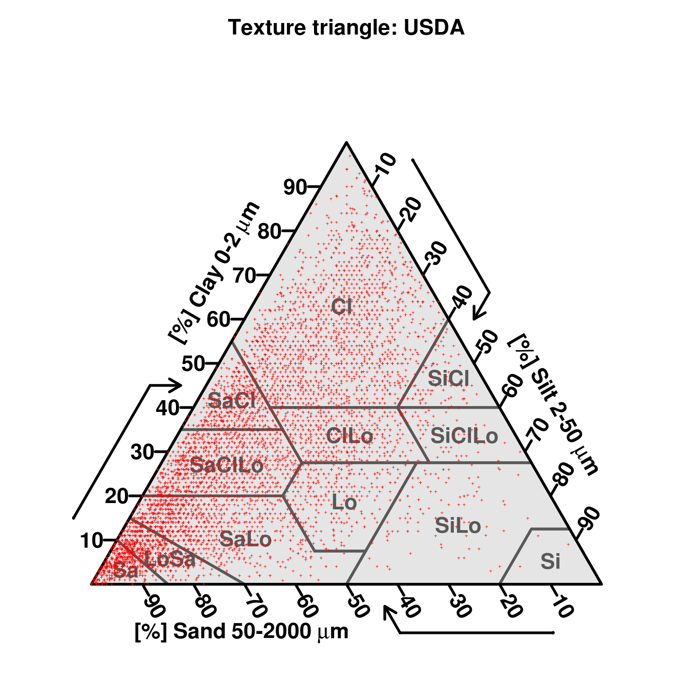
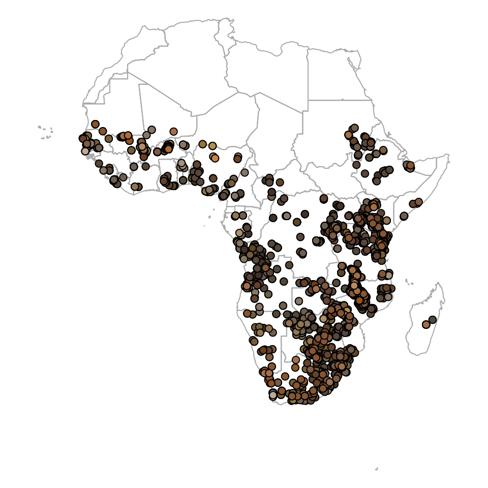
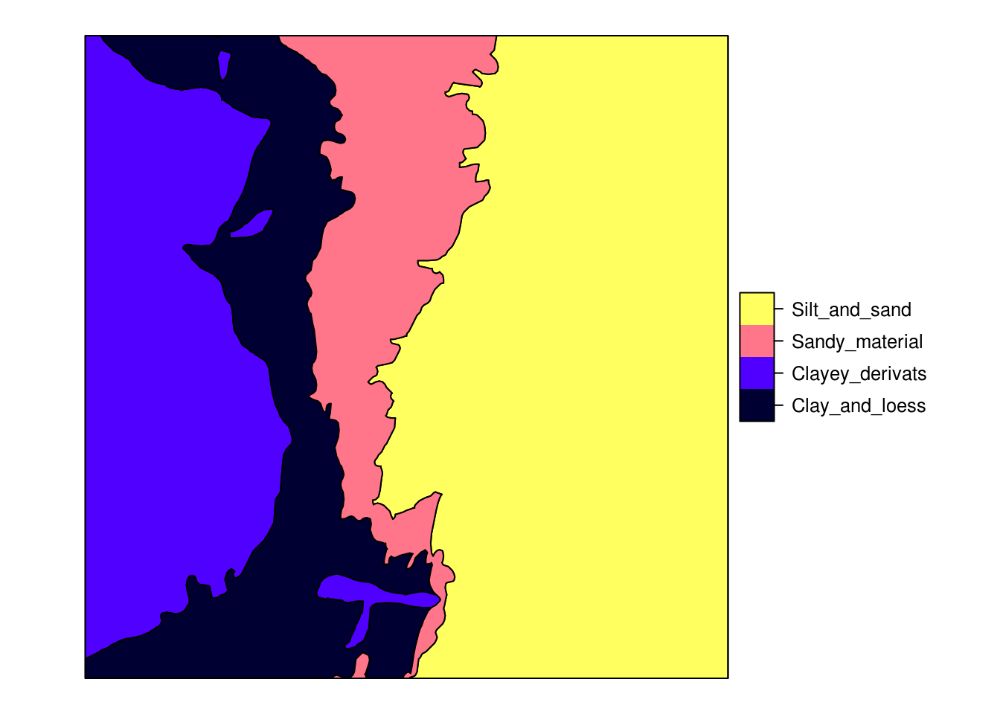
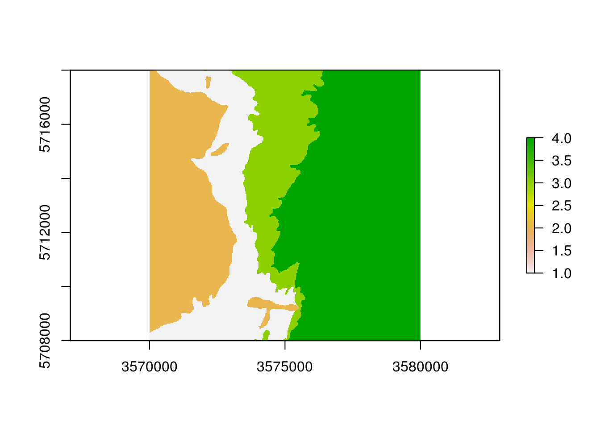
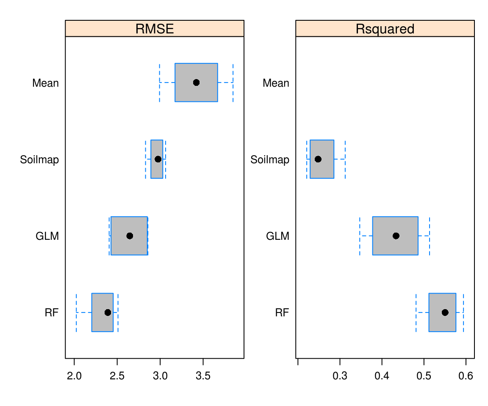
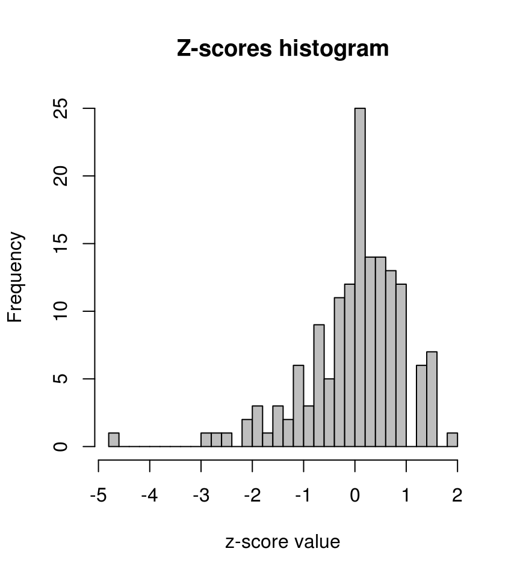
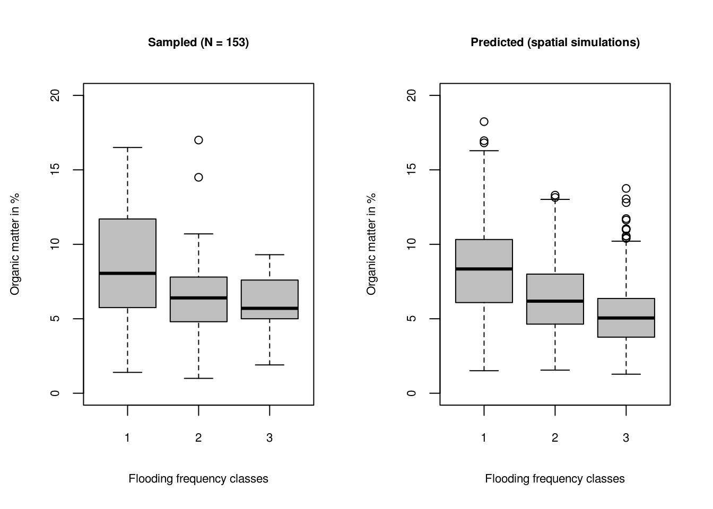
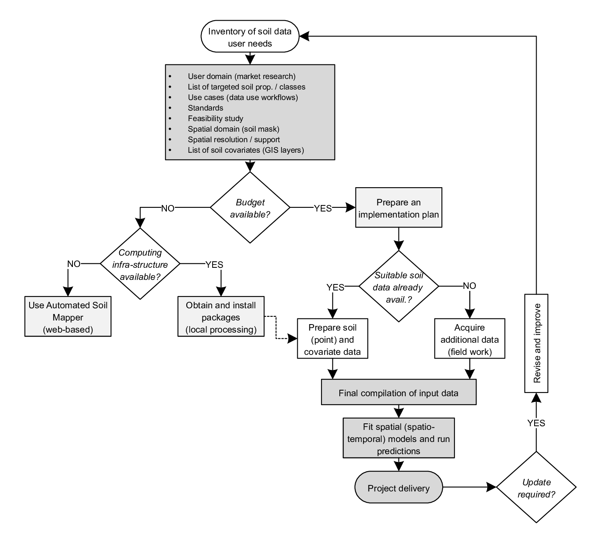
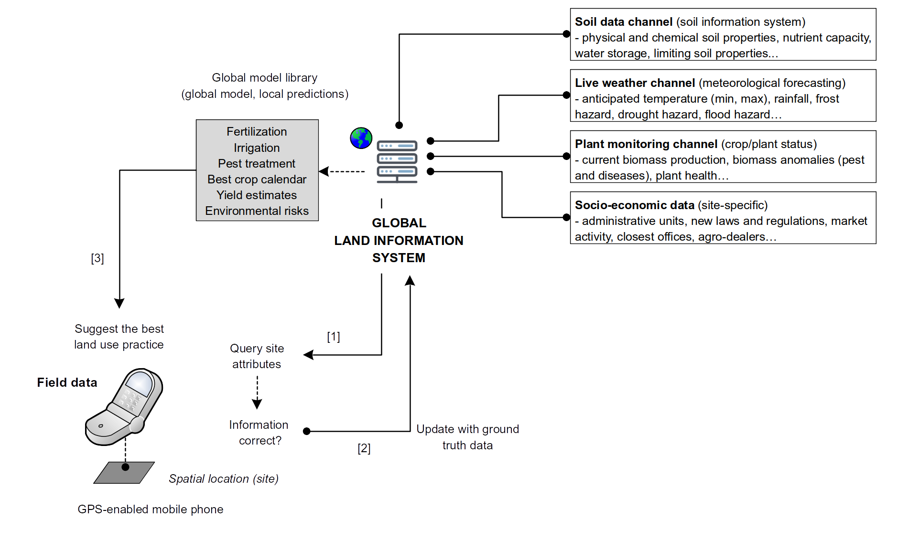

---
title: "Predictive Soil Mapping with R"
author: ["Tomislav Hengl and Robert A. MacMillan"]
date: "2018-12-26"
knit: bookdown::render_book
site: bookdown::bookdown_site
documentclass: svmono
classoption: graybox,natbib,nospthms,UStrade
geometry: "top=1.6cm, bottom=2cm, left=1.6cm, right=1.6cm"
monofont: "Source Code Pro"
monofontoptions: "Scale=0.6"
bibliography: refs.bib
biblio-style: spbasic
link-citations: yes
twitter-handle: tom_hengl
cover-image: figures/f0_web.png
description: "Predictive Soil Mapping aims to produce the most accurate, most objective, and most usable maps of soil variables by using state-of-the-art Statistical and Machine Learning methods. This books explains how to implement common soil mapping procedures within the R programming language."
github-repo: envirometrix/PredictiveSoilMapping
url: 'http\://soilmapper.org'
colorlinks: yes
graphics: yes
---


# Predictive Soil Mapping for advanced R users {-}


This is the online version of the Open Access book: [**Predictive Soil Mapping with R**](https://envirometrix.github.io/PredictiveSoilMapping/). Pull requests and general comments are welcome. These materials are based on technical tutorials initially developed for [ISRIC’s](http://isric.org/) Global Soil Information Facilities (GSIF) framework for automated soil mapping over the period 2014–2017.

<br />**This website is under construction**. For news and updates please refer to the [github issues](https://github.com/envirometrix/PredictiveSoilMapping/issues).

Hard copies of this book from will be made available in early 2019.

**Cite as**:

* Hengl, T., MacMillan, R.A., (2019). **Predictive Soil Mapping with R**. OpenGeoHub foundation, Wageningen, the Netherlands, 340 pages. ISBN: 978-0-359-30635-0.

## Editors {-}

[**Tom Hengl**](https://opengeohub.org/people/tom-hengl) is a Senior Researcher and Vice Chair of the OpenGeoHub Foundation / technical director at Envirometrix Ltd. 
He has more than 20 years of experience as an environmental modeler, data scientist and spatial analyst. 
Tom is a passionate advocate for, and supporter of, open data, reproducible science and career development 
for young scientists. He designed and implemented the global [SoilGrids](http://journals.plos.org/plosone/article?id=10.1371/journal.pone.0169748) data set, 
partially in response to other well known open data projects such as OpenStreetMap, GBIF, GlobalForestWatch 
and global climate mapping projects. He has taught predictive soil mapping at Wageningen University / 
ISRIC within the “Hands-on-GSIF” block courses. Video tutorials on soil mapping with R can also be 
found at http://youtube.com/c/ISRICorg. Tom currently leads production of a web mapping system called “LandGIS” (https://landgis.opengeohub.org) which is envisaged as *“an OpenStreetMap-type system”* for land-related environmental data. The system hosts global, fine spatial resolution data (250 m to 1 km) including various soil classes and soil properties, which is intended for eventual integration annd use at operational or farm-scales.

[**Bob MacMillan**](https://opengeohub.org/people/bob-macmillan) is a retired environmental consultant with over 40 years of experience in creating, packaging, delivering and using environmental information on soils, ecosystems, landforms and hydrology. Bob spent 19 years working in public sector research with the Alberta Research Council and Agriculture and Agri-Food Canada and a second 20 years as a private sector consultant offering services in predictive soil and ecological mapping. Since retiring, Bob has remained an active supporter, promoter, advocate, mentor and technical contributor to several continental to global scale efforts to advance the science and technology of mapping soils and other ecosystem components. As Science Coordinator for the GlobalSoilMap project, Bob helped to articulate the vision for the project and led initial activities aimed at achieving this, including authoring technical specifications, promoting the project, recruiting participants/cooperators, and liaising with representatives of national and international soil agencies. Bob continues to contribute on a voluntary basis to OpenGeoHub (https://opengeohub.org) and the Africa Soil Information Servicce (AfSIS) (http://africasoils.net). Throughout his career, Bob has shared his expertise and his enthusiasm freely with dozens of younger scientists interested in learning about, and becoming, practitioners of digital soil mapping. Bob continues to support the next generation of digital soil mappers through his involvement with OpenGeoHub. 

# Preface {-}

Predictive Soil Mapping (PSM) is based on applying statistical and/or machine learning techniques to fit models for the purpose of producing spatial and/or spatiotemporal predictions of soil variables i.e. maps of soil properties and classes at different resolutions. It is a multidisciplinary field combining statistics, data science, soil science, physical geography, remote sensing, geoinformation science and a number of other sciences [@Scul01; @MCBRATNEY20033; @Henderson2004Geoderma; @Boettinger2010Springer; @Zhu2015PSM]. *Predictive Soil Mapping with R* is about understanding the main concepts behind soil mapping, mastering R packages that can be used to produce high quality soil maps, and about optimizing all processes involved so that production costs can also be reduced.

The main differences between predictive vs traditional expert-based soil mapping are that: (a) the production of maps  
is based on using state-of-the-art statistical methods to ensure objectivity of maps (including objective uncertainty assessment vs expert judgment), and (b) PSM is driven by automation of the processes so that overall soil data production costs can be reduced and updates of maps implemented without requirements for large investments. R, in that sense, is a logical platform to develop PSM workflows and applications, especially thanks to the vibrant and productive R spatial interest group activities and also thanks to the increasingly professional soil data packages such as, for example: the soiltexture, aqp, soilprofile, soilDB and similar.

The book is divided into sections covering theoretical concepts, preparation of covariates, model selection and evaluation, prediction and visualization and distribution of final maps. Most of the chapters contain R code examples that try to illustrate the main processing steps and give practical instructions to developers and applied users.

## Connected publications {-}

Most of methods described in this book are based on the following publications:

* Hengl, T., Nussbaum, M., Wright, M. N., Heuvelink, G. B., and Gr&auml;ler, B. (2018) [Random Forest as a generic framework for predictive modeling of spatial and spatio-temporal variables](https://doi.org/10.7717/peerj.5518). PeerJ 6:e5518.

* Sanderman, J., Hengl, T., Fiske, G., (2017) [The soil carbon debt of 12,000 years of human land use](http://www.pnas.org/content/early/2017/08/15/1706103114.full). PNAS, doi:10.1073/pnas.1706103114

* Ramcharan, A., Hengl, T., Nauman, T., Brungard, C., Waltman, S., Wills, S., & Thompson, J. (2018). [Soil Property and Class Maps of the Conterminous United States at 100-Meter Spatial Resolution](https://dl.sciencesocieties.org/publications/sssaj/abstracts/82/1/186). Soil Science Society of America Journal, 82(1), 186–201.

* Hengl, T., Leenaars, J. G., Shepherd, K. D., Walsh, M. G., Heuvelink, G. B., Mamo, T., et al. (2017) [Soil nutrient maps of Sub-Saharan Africa: assessment of soil nutrient content at 250 m spatial resolution using machine learning](https://link.springer.com/article/10.1007/s10705-017-9870-x). Nutrient Cycling in Agroecosystems, 109(1), 77–102.

* Hengl T, Mendes de Jesus J, Heuvelink GBM, Ruiperez Gonzalez M, Kilibarda M, Blagotic A, et al. (2017) [SoilGrids250m: Global gridded soil information based on machine learning](http://dx.doi.org/10.1371/journal.pone.0169748). PLoS ONE 12(2): e0169748. doi:10.1371/journal.pone.0169748

* Shangguan, W., Hengl, T., de Jesus, J. M., Yuan, H., & Dai, Y. (2017). [Mapping the global depth to bedrock for land surface modeling](https://doi.org/10.1002/2016MS000686). Journal of Advances in Modeling Earth Systems, 9(1), 65-88.

* Hengl, T., Roudier, P., Beaudette, D., & Pebesma, E. (2015) [plotKML: scientific visualization of spatio-temporal data](https://www.jstatsoft.org/article/view/v063i05). Journal of Statistical Software, 63(5).

* Gasch, C. K., Hengl, T., Gr&auml;ler, B., Meyer, H., Magney, T. S., & Brown, D. J. (2015) [Spatio-temporal interpolation of soil water, temperature, and electrical conductivity in 3D+ T: The Cook Agronomy Farm data set](https://doi.org/10.1016/j.spasta.2015.04.001). Spatial Statistics, 14, 70–90.

* Hengl, T., Nikolic, M., & MacMillan, R. A. (2013) [Mapping efficiency and information content](https://doi.org/10.1016/j.jag.2012.02.005). International Journal of Applied Earth Observation and Geoinformation, 22, 127–138.

* Hengl, T., Heuvelink, G. B., & Rossiter, D. G. (2007) [About regression-kriging: from equations to case studies](https://doi.org/10.1016/j.cageo.2007.05.001). Computers & geosciences, 33(10), 1301-1315.

* Hengl, T. (2006) [Finding the right pixel size](https://doi.org/10.1016/j.cageo.2005.11.008). Computers & geosciences, 32(9), 1283–1298.

Some other relevant publications / books on the subject of Predictive Soil Mapping and Data Science in general include:

* Malone, B.P, Minasny, B., McBratney, A.B., (2016) [Using R for Digital Soil Mapping](https://www.springer.com/gp/book/9783319443256). Progress in Soil Science
ISBN: 9783319443270, 262 pages.

* Hengl, T., & MacMillan, R. A. (2009). [Geomorphometry—a key to landscape mapping and modelling](https://doi.org/10.1016/S0166-2481(08)00019-6). Developments in Soil Science, 33, 433–460. 

* California Soil Resource Lab, (2017) [Open Source Software Tools for Soil Scientists](https://casoilresource.lawr.ucdavis.edu/software/), UC Davis.

* McBratney, A.B., Minasny, B., Stockmann, U. (Eds) (2018) [Pedometrics](https://www.springer.com/gp/book/9783319634371). Progress in Soil Science
ISBN: 9783319634395, 720 pages.

* FAO, (2018) [Soil Organic Carbon Mapping Cookbook](https://github.com/FAO-GSP/SOC-Mapping-Cookbook). 2nd edt. ISBN: 9789251304402

Readers are also encouraged to obtain and study the following R books before following some of the more complex exercises in this book:

* Bivand, R., Pebesma, E., Rubio, V., (2013) [Applied Spatial Data Analysis with R](http://www.asdar-book.org). Use R Series, Springer, Heidelberg, 2nd Ed. 400 pages.

* Irizarry, R.A., (2018) [Introduction to Data Science: Data Analysis and Prediction Algorithms with R](https://rafalab.github.io/dsbook/). HarvardX Data Science Series.

* Kabacoff, R.I., (2011) [R in Action: Data Analysis and Graphics with R](http://www.manning.com/kabacoff/). Manning publications, ISBN: 9781935182399, 472 pages.

* Kuhn, M., Johnson, K. (2013) [Applied Predictive Modeling](http://appliedpredictivemodeling.com). Springer Science, ISBN: 9781461468493, 600 pages.

* Lovelace, R., Nowosad, J., Muenchow, J., (2018) [Geocomputation with R](https://geocompr.robinlovelace.net). R Series, CRC Press, ISBN: 9781138304512, 338 pages.

* Reimann, C., Filzmoser, P., Garrett, R., Dutter, R., (2008) [Statistical Data Analysis Explained Applied Environmental Statistics with R](https://onlinelibrary.wiley.com/doi/book/10.1002/9780470987605). Wiley, Chichester, 337 pages.

For the most recent developments in the R-spatial community refer to https://r-spatial.github.io, the R-sig-geo mailing list and/or https://opengeohub.org.

## Contributions {-}

This book is deigned to be constantly updated and contributions are always welcome (through pull requests, but also through adding new chapters) provided that some minimum requirements are met. To contribute a complete new chapter please contact the editors first. Some minimum requirements to contribute a chapter are:

1. The data needs to be available for the majority of tutorials presented in a chapter. It is best if this is via some R package or web-source.
2. A chapter should ideally focus on implementing some computing in R (it should be written as an R tutorial).
3. All examples should be computationally efficient requiring not more than 30 secs of computing time per process on a single core system.
4. The theoretical basis for methods and interpretation of results should be based on peer-review publications. This book is not intended to report on primary research / experimental results, but only to supplement existing research publications.
5. A chapter should consist of at least 1500 words and at most 3500 words.
6. The topic of the chapter must be closely connected to the theme of soil mapping, soil geographical databases, methods for processing spatial soil data and similar.

In principle, all submitted chapters should also follow closely the [five pillars of Wikipedia](https://en.wikipedia.org/wiki/Wikipedia:Five_pillars), especially: Verifiability, Reproducibility, No original research, Neutral point of view, Good faith, No conflict of interest, and no personal attacks.

## Reproducibility {-}

To reproduce the book, you need a recent version of [R](https://cran.r-project.org), and [RStudio](http://www.rstudio.com/products/RStudio/) and up-to-date packages, which can be installed with the following command (which requires [**devtools**](https://github.com/hadley/devtools)):


```r
devtools::install_github("Envirometrix/PSMpkg")
```

To build the book locally, clone or [download](https://github.com/envirometrix/PredictiveSoilMapping/archive/master.zip) the [PredictiveSoilMapping repo](https://github.com/envirometrix/PredictiveSoilMapping/), load R in root directory (e.g. by opening [PredictiveSoilMapping.Rproj](https://github.com/envirometrix/PredictiveSoilMapping/blob/master/PredictiveSoilMapping.Rproj) in RStudio) and run the following lines:


```r
bookdown::render_book("index.Rmd") # to build the book
browseURL("docs/index.html") # to view it
```

## Acknowledgements {-}

The authors are grateful for numerous contributions from colleagues around the world, especially for contributions by current and former ISRIC — World Soil Information colleagues: Gerard Heuvelink, Johan Leenaars, Jorge Mendes de Jesus, Wei Shangguan, David G. Rossiter, and many others. The authors are also grateful to Dutch and European citizens for financing ISRIC and Wageningen University, where work on this book was initially started. The authors acknowledge support received from the [AfSIS project](http://africasoils.net), which was funded by the Bill and Melinda Gates Foundation (BMGF) and the Alliance for a Green Revolution in Africa (AGRA). Many soil data processing examples in the book are based on R code developed by Dylan Beuadette, Pierre Roudier, Alessandro Samuel Rosa, Marcos E. Angelini, Guillermo Federico Olmedo, Julian Moeys, Brandon Malone, and many other developers. The authors are also grateful to comments and suggestions for improvements to the methods presented in the book by Travis Nauman, Amanda Ramcharan, David G. Rossiter and [Julian Moeys](http://julienmoeys.info). 

LandGIS and SoilGrids are based on using numerous soil profile data sets 
kindly made available by various national and international agencies: the
USA National Cooperative Soil Survey Soil Characterization database
(http://ncsslabdatamart.sc.egov.usda.gov) and profiles from the USA
National Soil Information System, Land Use/Land Cover Area
Frame Survey (LUCAS) Topsoil Survey database [@Toth2013LUCAS], 
Repositório Brasileiro Livre para Dados Abertos do Solo ([FEBR](https://github.com/febr-team)), 
Sistema de Información de Suelos de Latinoamérica y el Caribe (SISLAC),
Africa Soil Profiles database [@Leenaars2012], Australian National Soil
Information by CSIRO Land and Water [@Karssies2011CSIRO; @searle2014australian], 
Mexican National soil profile database [@INEGI2000] provided by 
the Mexican Instituto Nacional de Estadística y Geografía / CONABIO, 
Brazilian national soil profile database [@cooper2005national] 
provided by the University of São Paulo, Chinese
National Soil Profile database [@shangguan2013china] provided by the
Institute of Soil Science, Chinese Academy of Sciences, soil profile
archive from the Canadian Soil Information System [@macdonald1992cansis]
and Forest Ecosystem Carbon Database (FECD), ISRIC-WISE [@Batjes2009SUM],
The Northern Circumpolar Soil Carbon Database [@essd-5-3-2013], eSOTER
profiles [@VanEngelen2012], SPADE [@hollis2006spade], Unified State Register
of soil resources RUSSIA (Version 1.0. Moscow — 2014), National Database
of Iran provided by the Tehran University, points from the Dutch Soil
Information System (BIS) prepared by Wageningen Environmental Research,
and others. We are also grateful to USA’s NASA, USGS and USDA agencies,
European Space Agency Copernicus projects, JAXA (Japan Aerospace Exploration Agency)
for distributing vast amounts of remote sensing data (especially MODIS, Landsat, Copernicus
land products and elevation data), and to the Open Source software developers
of the packages rgdal, sp, raster, caret, mlr, ranger, h2o and similar, 
and without which predictive soil mapping would most likely not be possible.

This book has been inspired by [the Geocomputation with R book](https://geocompr.robinlovelace.net), an Open Access book edited by Robin Lovelace, Jakub Nowosad and Jannes Muenchow. Many thanks to Robin Lovelace for helping with rmarkdown and for giving some initial tips for compiling and organizing this book. The authors are also grateful to the numerous software/package developers, especially Edzer Pebesma, Roger Bivand, Robert Hijmans, Markus Neteler, Tim Appelhans, and Hadley Wickham, whose contributions have enabled a generation of researchers and applied projects. 

We are especially grateful to Jakub Nowosad for helping with preparing this publication for press and with setting up all code so that it passes automatic checks.

OpenGeoHub is a not-for-profit research foundation with headquarters in Wageningen, the Netherlands (Stichting OpenGeoHub, KvK 71844570). The main goal of the OpenGeoHub is to promote publishing and sharing of Open Geographical and Geoscientific Data and using and developing of Open Source Software. We believe that the key measure of quality of research in all sciences (and especially in geographical information sciences) is in transparency and reproducibility of the computer code used to generate results. Transparency and reproducibility increase trust in information so that it is eventually also the fastest path to optimal decision making.

Every effort has been made to trace copyright holders of the materials used in this publication. Should we, despite all our efforts have overlooked contributors please contact the author and we shall correct this unintentional omission without any delay and will acknowledge any overlooked contributions and contributors in future updates. 

**Data availability**: All data used in this book is either available through R packages or is available via the github repository. If not mentioned otherwise, all code presented is available under the [GNU General Public License v2.0](https://www.gnu.org/licenses/old-licenses/gpl-2.0.en.html).

**Copyright**: &copy; 2018 Authors.

<a rel="license" href="http://creativecommons.org/licenses/by-sa/4.0/"></a><br />This work is licensed under a <a rel="license" href="http://creativecommons.org/licenses/by-sa/4.0/">Creative Commons Attribution-ShareAlike 4.0 International License</a>. LandGIS and OpenGeoHub are registered trademarks of the OpenGeoHub Foundation.

<!--chapter:end:index.Rmd-->


# Soil resource inventories and soil maps {#introduction}

*Edited by: Hengl T. & MacMillan R.A.*

## Introduction

This chapter presents a description and discussion of soils and
conventional soil inventories framed within the context of Predictive Soil Mapping (PSM). Soils,
their associated properties, and their spatial and temporal distributions are the
central focus of PSM. We discuss how the products and
methods associated with conventional soil mapping relate to new, and
emerging, methods of PSM and automated soil mapping. We discuss similarities and
differences, strengths and weaknesses of conventional soil mapping (and
its inputs and products) relative to PSM.

The universal model of soil variation presented in detail in
Chapter \@ref(statistical-theory) is adopted as a framework for comparison of
conventional soil mapping and PSM. Our aim is to show how the products
and methods of conventional soil mapping can complement, and contribute to,
PSM and equally, how the theories and methods of
PSM can extend and strengthen conventional soil mapping.
PSM aims to implement tools and methods that can be supportive of
growth, change and improvement in soil mapping and that can stimulate a
rebirth and reinvigoration of soil inventory activity globally.

## Soils and soil inventories

### Soil: a definition

Soil is a natural body composed of biota and air, water and minerals,
developed from unconsolidated or semi-consolidated material that forms the
topmost layer of the Earth’s surface [@chesworth2008encyclopedia]. The
upper limit of the soil is either air, shallow water, live plants or
plant materials that have not begun to decompose. The lower limit is
defined by the presence of hard rock or the lower limit of biologic
activity [@Richter1995; @SSDS1993]. Although soil profiles up to tens
of meters in depth can be found in some tropical areas [@Richter1995], for
soil classification and mapping purposes, the lower limit of soil is often
arbitrarily set to 2 m (http://soils.usda.gov/education/facts/soil.html). Soils are rarely described to depths beyond 2 m and
many soil sampling projects put a primary focus on the upper
(0-100 cm) depths.

The chemical, physical and biological properties of the soil differ from
those of unaltered (unconsolidated) parent material from which the soil
is derived over a period of time under the influence of climate, organisms
and relief effects. Soil should show a capacity to support life,
otherwise we are dealing with inert unconsolidated parent material. Hence, for
purposes of developing statistically based models to predict soil
properties using PSM, it proves useful to distinguish between *actual*
and *potential* soil areas (see further section \@ref(soil-covariates)).

A significant aspect of the accepted definition of soil is that it is
seen as a *natural body* that merits study, description,
*classification* and interpretation in, and of, itself. As a *natural
body* soil is viewed as an object that occupies space, has defined
physical dimensions and that is more than the sum of its individual
properties or attributes. This concept requires that all properties of
soils be considered collectively and simultaneously in terms of a completely integrated
natural body [@SSDS1993]. A consequence of this, is that one must
generally assume that all soil properties covary in space in lockstep
with specific named soils and that different soil properties do not
exhibit different patterns of spatial variation independently relative
to a named soil.

From a management point of view, soil can be seen from at least three
perspectives. It is a:

-   *Resource* of materials — It contains quantities of unconsolidated
    materials, rock fragments, texture fractions, organic carbon,
    nutrients, minerals and metals, water and so on.

-   *Stabilizing medium / ecosystem* — It acts as a medium that supports
    both global and local processes from carbon and nitrogen fixation to
    retention and transmission of water, to provision of nutrients and
    minerals and so on.

-   *Production system* — Soil is the foundation for plant growth. In
    fact, it is the basis of all sustainable terrestrial
    ecosystem services. It is also a source of livelihood for people
    that grow crops and livestock.

For @frossard2006function there are six key functions of soil:

1.  *food and other biomass production*,

2.  *storage, filtering, and transformation of water, gases and
    minerals*,

3.  *biological habitat and gene pool*,

4.  *source of raw materials*,

5.  *physical and cultural heritage* and

6.  *platform for man-made structures: buildings, highways*.

Soil is the Earth’s biggest carbon store containing 82% of total terrestrial
organic carbon [@Lal2004Science].

### Soil variables

Knowledge about soil is often assembled and cataloged through *soil
resource inventories*. Conventional soil resource inventories describe
the geographic distribution of *soil bodies* i.e. *polypedons*
[@Wysocki2005Geoderma]. The spatial distribution of soil properties is
typically recorded and described through reference to mapped soil
individuals and not through separate mapping of individual soil
properties. In fact, the definition of a soil map in the US Soil Survey
Manual specifically *“excludes maps showing the distribution of a single
soil property such as texture, slope, or depth, alone or in limited
combinations; maps that show the distribution of soil qualities such as
productivity or erodibility; and maps of soil-forming factors, such as
climate, topography, vegetation, or geologic material”* [@SSDS1993].

In contrast to conventional soil mapping, PSM is primarily interested 
in portraying, in the form of maps, the spatial distribution of *soil variables* — measurable 
or descriptive attributes commonly collected through field sampling 
and then either measured *in-situ* or *a posteriori* in laboratory. Soil variables can be roughly grouped into:

1.  *quantities of some material* ($y \in [0 \rightarrow +\infty]$);

2.  *transformed or standardized quantities* such as pH
    ($y \in [-\infty \rightarrow +\infty]$)

3.  *relative percentages* such as mass or volume percentages
    ($y \in [0 \rightarrow 1]$);

4.  *boolean values e.g. showing occurrence and/or non-occurrence* of
    qualitative soil attributes or objects ($y \in [0,1]$);

5.  *categories* (i.e. factors) such as soil classes
    ($y \in [a,b,\ldots,x]$);
    
6.  *probabilities* e.g. probabilities of occurrence of some class or object ($p(y) \in [0 \rightarrow 1]$).
    
7.  *censored values* e.g. depth to bedrock which is often observed only up to 2 m.

The nature of a soil variable determines how the attribute is modeled
and presented on a map in PSM. Some soil variables are
normally described as discrete entities (or classes), but classes can also be
depicted as continuous quantities on a map in the form of
probabilities or memberships
[@DeGruijter1997Geoderma; @McBratney2003Geoderma; @Kempen2009Geoderma; @Odgers201130].
For example, a binary soil variable (e.g. the presence/absence of a
specific layer or horizon) can be modeled as a binomial random variable
with a logistic regression model. Spatial prediction (mapping) with this
model gives a map depicting (continuous) probabilities in the range of
0–1. These probabilities can be used to determine the most likely presence/absence
of a class at each prediction location, resulting, then, in a discrete
representation of the soil attribute variation.

In that context, the aims of most soil resource inventories consist of the
identification, measurement, modelling, mapping and interpretation of
soil variables that represent transformed or standardized quantities of
some material, relative percentages, occurrence and/or non-occurrence of
qualitative attributes or objects, and/or soil categories.

### Primary and secondary soil variables

Soil properties can be *primary* or *inferred* (see further section \@ref(soil-variables-chapter)).
Primary properties are properties that can be measured directly in the
field or in the laboratory. Inferred properties are properties that
cannot be measured directly (or are difficult or too expensive to
measure) but can be inferred from primary properties, for example through
pedotransfer functions [@Wosten2001JH; @wosten2013soil].
@Dobos2006digital also distinguish between primary and secondary soil
properties and *‘functional’* soil properties representing *soil
functions* or *soil threats*. Such soil properties can be directly used
for financial assessment or for decision making. For example, soil
organic carbon content in grams per kilogram of soil is the primary soil
property, while organic carbon sequestration rate in kilograms per unit
area per year is a *functional* soil property.

## Soil mapping

### What are soil resource inventories?

Soil resource inventories describe the types, attributes and geographic
distributions of soils in a given area. They can consist of spatially
explicit maps or of non-spatial lists. Lists simply itemize the kinds
and amounts of different soils that occupy an area to address questions
about what soils and soil properties occur in an area. The resulting
answer is often not highly specific in space but rather presents a
mainly non-spatial itemization of soils and soil attributes expected to
occur in a bounded area. Maps attempt to portray, with some degree of
detail, the patterns of spatial variation in soils and soil properties,
within limits imposed by mapping scale and resources.

According to the USDA Manual of Soil Survey [@SSDS1993], a soil survey:

-   describes the characteristics of the soils in a given area,

-   classifies the soils according to a standard system of
    classification,

-   plots the boundaries of the soils on a map, and

-   makes predictions about the behavior of soils.

The information collected in a soil survey helps in the development of
land-use plans and evaluates and predicts the effects of land use on the
environment. Hence, the different uses of the soils and how the response
of management affects them need to be considered.

In conventional soil mapping, the objects of study, whose spatial
distributions are portrayed on any resulting map, are *soil individuals*
with each individual assumed to possess and exhibit a unique set of soil properties
with a defined range of values. A fundamental assumption of conventional
soil mapping is therefore that, if one maps the pattern of spatial
distribution of uniquely defined *soil individuals*, one can infer the
patterns of spatial distribution of the *soil properties* associated
with each defined individual. Thus, conventional soil maps must, by
definition, only map soil individuals and not individual soil properties
[@SSDS1993] and then subsequently infer the distribution of soil
properties from the mapped distribution of soil individuals.

This attribute of conventional soil mapping represents a significant
difference compared to PSM, where the object of study is
frequently an individual soil property and the objective is to map the
pattern of spatial distribution of that property (over some depth
interval), often independently from consideration of the spatial distribution
of soil individuals or other soil properties.

Soil maps give answers to three basic questions: (1) what is mapped?,
(2) what is the predicted value?, and (3) where is it? Thematic accuracy
of a map tells us how accurate predictions of targeted soil properties
are overall, while the spatial resolution helps us locate features
with some specified level of spatial precision.

\BeginKnitrBlock{rmdnote}<div class="rmdnote">The most common output of a soil resource inventory is a *soil map*. Soil maps convey information
about the geographic distribution of named soil types in a given area.
They are meant to help answer the questions *“what is here”* and *“where is what”* [@Burrough1998OUP].</div>\EndKnitrBlock{rmdnote}

Any map is an abstraction and generalization of reality. The only
perfect one-to-one representation of reality is reality itself. To fully
describe reality one would need a model at 1:1 scale at which 1 m$^2$ of reality
was represented by 1 m$^2$ of the model. Since this is not feasible, we condense
and abstract reality in such a way that we hope to describe the major
differences in true space at a much reduced scale in model (map) space.
When this is done for soil maps, it needs to be understood that the map
cannot describe all of the soil variation that is present in reality. It can
only describe that portion of the total variation that is systematic and
has structure and occurs over distances that are as large as, or larger
than, the smallest area that can be feasibly portrayed and described at
any given scale. Issues of scale and resolution are discussed in greater
detail in chapter \@ref(downscaling-upscaling).

An important functionality of PSM is the production and distribution of
maps depicting the spatial distribution of soils and, more specifically,
soil attributes. In this chapter we, therefore, concentrate on
describing processes for producing maps as spatial depictions of the
patterns of arrangement of soil attributes and soil types.

### Soil mapping approaches and concepts

As mentioned previously, spatial information about the distribution of
soil properties or attributes, i.e. soil maps or GIS layers focused on
soil, is produced through soil resource inventories, also known as soil
surveys or soil mapping projects
[@Burrough1971; @Avery1987; @Wysocki2005Geoderma; @Legros2006SP]. The
main idea of soil survey is, thus, production and dissemination of soil
information for an area of interest usually to address a specific
question or questions of interest i.e. production of soil maps and soil
geographical databases. Although soil surveyors are usually not *per se*
responsible for final use of soil information, how soil survey information
is used is increasingly important.

In statistical terms, the main objective of soil mapping is to describe
the spatial variability i.e. spatial complexity of soils, then represent
this complexity using maps, summary measures, mathematical models and
simulations. Some known sources of spatial variability in soil variables
are:

1.  *Natural spatial variability in 2D (different at various scales),
    mainly due to climate, parent material, land cover and land use*;

2.  *Variation by depth*;

3.  *Temporal variation due to regular or periodic changes in the
    ecosystem*;

4.  *Measurement error (in situ or in lab)*;

5.  *Spatial location error*;

6.  *Small scale variation*;

\BeginKnitrBlock{rmdnote}<div class="rmdnote">In statistical terms, the main objective of
soil mapping is to describe the spatial complexity of soils, then
represent this complexity using maps, summary measures, mathematical
models and simulations. From the application point of view, the main
application objective of soil mapping is to accurately predict response of a
soil(-plant) ecosystem to various soil management strategies.</div>\EndKnitrBlock{rmdnote}

Soil mappers do their best to try explain the first two items above and
minimize, or exclude from modelling, the remaining components: temporal
variation, measurement error, spatial location error and small scale
variation.

<div class="figure" style="text-align: center">

<p class="caption">(\#fig:soil-crop-model-scheme)Inputs to soil-plant, soil-hydrology or soil-ecology models and their relationship.</p>
</div>

From the application point of view, the main objective of soil mapping
is to accurately predict soil properties and their response to possible
or actual management practices
(Fig. \@ref(fig:soil-crop-model-scheme)). In other words, if the soil
mapping system is efficient, we should be able to accurately predict
the behavior of soil-plant, soil-hydrology or similar ecosystems to various
soil management strategies, and hence provide useful advice to
agronomists, engineers, environmental modelers, ecologists and similar.

We elect here to recognize two main variants of soil mapping which we
refer to as *conventional soil mapping* and *pedometric* or *predictive soil mapping* as
described and discussed below (Fig. \@ref(fig:comparison-dsm)).

<div class="figure" style="text-align: center">

<p class="caption">(\#fig:comparison-dsm)Comparison between traditional (primarily expert-based) and automated (data-driven) soil mapping.</p>
</div>

### Theoretical basis of soil mapping: in context of the universal model of spatial variation {#soil-mapping-theory}

Stated simply, *“the scientific basis of soil mapping is that the
locations of soils in the landscape have a degree of predictability”*
[@Miller1979]. According to the USDA Soil Survey Manual, *“The
properties of soil vary from place to place, but this variation is not
random. Natural soil bodies are the result of climate and living
organisms acting on parent material, with topography or local relief
exerting a modifying influence and with time required for soil-forming
processes to act. For the most part, soils are the same wherever all
elements of these five factors are the same. Under similar environments in
different places, soils are expected to be similar. This regularity permits prediction
of the location of many different kinds of soil”* [@SSDS1993].
@Hudson2000SSSAJ considers that this *soil-landscape paradigm* provides
the fundamental scientific basis for soil survey.

In the most general sense, both conventional soil mapping and PSM
represent ways of applying the *soil-landscape paradigm* via the universal model of spatial
variation, which is explained in greater detail in
Chapter \@ref(statistical-theory). @Burrough1998OUP [p.133] described the
universal model of soil variation as a special case of the universal
model of spatial variation. This model distinguishes between three major
components of soil variation: (1) a deterministic component (trend), (2)
a spatially correlated component and (3) pure noise.

\begin{equation}
Z({\bf{s}}) = m({\bf{s}}) + \varepsilon '({\bf{s}}) + \varepsilon ''({\bf{s}})
(\#eq:univ-var)
\end{equation}

where $\bf{s}$ is two-dimensional location, $m({\bf{s}})$ is the
deterministic component, $\varepsilon '({\bf{s}})$ is the spatially
correlated stochastic component and $\varepsilon ''({\bf{s}})$ is the
pure noise (micro-scale variation and measurement error).

\BeginKnitrBlock{rmdnote}<div class="rmdnote">The *universal model of soil variation* assumes that
there are three major components of soil variation: (1) a
deterministic component (function of covariates), (2) a spatially
correlated component (treated as stochastic) and (3) pure noise.</div>\EndKnitrBlock{rmdnote}

The deterministic part of the equation describes that part of the
variation in soils and soil properties that can be explained by
reference to some model that relates observed and measured variation to
readily observable and interpretable factors that control or influence
this spatial variation. In conventional soil mapping, this model is the
empirical and knowledge-based *soil-landscape paradygm*
[@Hudson2000SSSAJ]. In PSM, a wide variety of statistical, and machine learning,
models have been used to capture and apply the soil-landscape paradigm
in a quantitative and optimal fashion using the CLORPT model:

\begin{equation}
S = f (cl, o, r, p, t)
(\#eq:clorpt)
\end{equation}

where $S$ stands for soil (properties and classes), $cl$ for climate,
$o$ for organisms (including humans), $r$ is relief, $p$ is parent
material or geology and $t$ is time. The Eq. \@ref(eq:clorpt) is the
CLORPT model originally presented by Jenny [-@jenny1994factors].

@MCBRATNEY20033 reconceptualized and extended the CLORPT model via the
*“scorpan”* model in which soil properties are modeled as a function of:

-   (auxiliary) **s**oil classes or properties,

-   **c**limate,

-   **o**organisms, vegetation or fauna or human activity,

-   **r**elief,

-   **p**arent material,

-   **a**ge i.e. the time factor,

-   **n** space, spatial conntext or spatial position,

Pedometric models are quantitative in that they capture
relationships between observed soils, or soil properties, and
controlling environmental influences (as represented by environmental
co-variates) using statistically-formulated expressions. Pedometric
models are seen as optimum because, by design, they minimize the
variance between observed and predicted values at all locations with
known values. So, no better model of prediction exists for that
particular set of observed values at that specific set of locations.

Conventional soil mapping has a long history of effective development
and application of empirical, knowledge-based, soil landscape models to
predict how soil classes vary spatially across landscapes. Such models
can be criticized, however, for being neither quantitative nor optimal.

Our essential point is that both conventional and pedometric soil
mapping use models to explain the deterministic part of the spatial
variation in soils and soil properties and these models differ mainly in
terms of whether they are empirical and subjective (conventional) or
quantitative and objective (pedometric). Both can be effective and the
empirical and subjective models based on expert knowledge have, until
recently, proven to be the most cost effective and widely applied for
production of soil maps by conventional means.

The spatially correlated part of the observed variation is that part
that shows spatial structure that lends itself to prediction through
interpolation but that is not explainable, or easily explained, through
use of a deterministic model that relates observed values to controlling
environmental factors. This part of the variation is typically modeled in pedometric
mapping using geostatistics and kriging to interpolate, in an optimal
manner, between point locations with known values
[@goovaerts2001geostatistical; @McBratney2003Geoderma].

It can be argued that conventional soil mapping has an analogue to
kriging in situations where there is no clearly apparent relationship
between observed values and readily observable controlling environmental
variables. In such instances, conventional soil mappers typically resort
to an approach in which they make as many closely spaced observations as
feasible and then manually *“interpolate”* between these locations of
known soils or soil properties to locate boundaries indicative of
locations of significant change in soils or soil properties. In the
vernacular of soil surveyors this is often referred to as *“digging it
out”* in which a pattern that is not readily apparent or visible is
revealed through interpolation between closely spaced observations. So,
under some circumstances, conventional soil surveyors do implement an
analogue of spatial interpolation to describe patterns of variation in
soils where such patterns are not readily related to a clear
soil-landscape model.

\BeginKnitrBlock{rmdnote}<div class="rmdnote">In its essence, the objective
of PSM is to produce optimal unbiased predictions of a mean value at some new location along with the uncertainty associated with the prediction, at the finest possible resolution.</div>\EndKnitrBlock{rmdnote}

There is one way in which PSM differs significantly from
conventional soil mapping in terms of the universal model of soil
variation. This is in the use of geostatistics or machine learning to
quantitatively correct for error in predictions, defined as the
difference between predicted and observed values at locations with known
values. Conventional soil mapping has no formal or quantitative
mechanism for correcting an initial set of predicted values by computing
the difference between predicted and observed values at sampled
locations and then correcting initial values at all locations in
response to these observed differences. PSM uses
geostatistics to determine (via the semi-variogram) if the differences between predicted and
observed values (the residuals) exhibit spatial structure (e.g. are
predictable). If they do exhibit spatial structure, then it is useful
and reasonable to interpolate the computed error at known locations to
predict the likely magnitude of error of predictions at all locations
[@hengl2007regression]. This interpolated prediction error can then be
systematically subtracted from (or added to) the original predicted
value to correct for errors in the initial predictions that are
systematic and spatially correlated. This *“after the fact”* correction
of initial predictions is an aspect of PSM that
represents an improvement over conventional soil mapping methods and
that conventional methods would do well to emulate.

Neither conventional soil mapping nor PSM can do more
than simply describe and quantify the amount of variation that is not
predictable and has to be treated as pure noise. Conventional soil maps
can be criticized for ignoring this component of the total variation and
typically treating it as if it did not exist. For many soil properties,
short range, local variation in soil properties that cannot be explained
by either the deterministic or stochastic components of the universal
model of soil variation can often approach, or even exceed, a significant proportion (e.g. 30–40%) of the
total observed range of variation in any given soil property. Such
variation is simply not mappable but it exists and should be identified
and quantified. We do our users and clients a disservice when we fail to
alert them to the presence, and the magnitude, of spatial variation that
is not predictable. In cases where the local spatial variation is not
predictable (or mappable) the best estimate for any property of interest
is the mean value for that local area or spatial entity.

### Traditional (conventional) soil mapping {#conventional-mapping}

Traditional soil resource inventories are largely based on manual
application of expert tacit knowledge through the soil-landscape
paradigm [@Burrough1971; @Hudson2000SSSAJ]. In this approach, soil
surveyors develop and apply conceptual models of where and how soils
vary in the landscape through a combination of field inspections to
establish spatial patterns and photo-interpretation to extrapolate the
patterns to similar portions of the landscape
(Fig. \@ref(fig:soilsurvey-scheme)). Traditional soil mapping
procedures mainly address the deterministic part of the universal model
of soil variation.

<div class="figure" style="text-align: center">

<p class="caption">(\#fig:soilsurvey-scheme)Typical soil survey phases and intermediate and final products.</p>
</div>

Conventional (traditional) manual soil mapping typically adheres to the
following sequence of steps, with minor variations
[@McBratney2003Geoderma]:

1.  *Specify the objective(s) to be served by the soil survey and
    resulting map*;

2.  *Identify which attributes of the soil or land need to be observed,
    described and mapped to meet the specified objectives*;

3.  *Identify the minimum sized area that must be described and the
    corresponding scale of mapping to meet the specified objectives*;

4.  *Collate and interpret existing relevant land resource information
    (geology, vegetation, climate, imagery) for the survey area*;

5.  *Conduct preliminary field reconnaissance and use these observations
    to construct a preliminary legend of conceptual mapping units
    (described in terms of soil individuals)*;

6.  *Apply the preliminary conceptual legend using available source
    information to delineate initial map unit boundaries (pre-typing)*;

7.  *Plan and implement a field program to collect samples and
    observations to obtain values of the target soil attributes
    (usually classes) at known locations to test and refine initial
    conceptual prediction models*;

8.  *Using field observations, refine the conceptual models and finalize
    map unit legends and boundaries to generate conventional area–class
    soil maps*;

9.  *Conduct a field correlation exercise to match mapping with adjacent
    areas and to confirm mapping standards were adhered to*;

10. *Select and analyse representative soil profile site data to
    characterize each mapped soil type and soil map unit*;

11. *Prepare final documentation that describes all mapped soils and
    soil map units (legends) according to an accepted format*;

12. *Publish and distribute the soil information in the form of maps,
    geographical databases and reports*;

Expert knowledge about soil-landform patterns is generally used to
produce manually drawn polygon maps that outline areas of different
dominant soils or combinations of soils — *soil map units* (see
Figs. \@ref(fig:smu-aggregation) and \@ref(fig:from-photointerpretation-to-soilmap)). Soil
map units (polygons of different soil types) are described in terms of the
composition of soil classes (and often also landscape attributes) within
each unit, with various soil physical and chemical variables attached to
each class. Most commonly, the objective of conventional soil mapping is
to delineate recognizable portions of a landscape (soil–landform units)
as polygons in which the variation of soils and soil properties is
describable and usually (but not always) more limited than between polygons. Because most
soil mapping projects have limited resources and time, soil surveyors
can not typically afford to survey areas in great detail (e.g. 1:5000)
so as to map actual *polypedons*. As a compromise, the survey team
generally has to choose some best achievable target scale (e.g.
1:10,000 - 1:50,000). Maps produced at some initial scale can be further
generalized, depending on the application and user demands
[@Wysocki2005Geoderma].

<div class="figure" style="text-align: center">

<p class="caption">(\#fig:smu-aggregation)Three basic conceptual scales in soil mapping: (left) most detailed scale showing the actual distribution of soil bodies, (center) target scale i.e. scale achievable by the soil survey budget, (right) generalized intermediate scale or coarse resolution maps. In a conventional soil survey, soils are described and conceptualized as groups of similar pedons (smallest elements of 1–10 square-m), called “polypedons” — the smallest mappable entity. These can then be further generalized to soil map units, which can be various combinations (systematic or random) of dominant and contrasting soils (inclusions).</p>
</div>

Where variation within a polygon is systematic and predictable, the
pattern of variation in soils within any given polygon is often
described in terms of the most common position, or positions, in the
landscape occupied by each named soil class @MacMillan2005CJSS. In other cases, soil
patterns are not clearly related to systematic variations in observable
landscape attributes and it is not possible to describe where each named
soil type is most likely to occur within any polygon or why.

Conventional soil mapping has some limitations related to the fact that
mapping concepts (mental models) are not always applied consistently by different mappers. Application of conceptual models is largely
manual and it is difficult to automate. In addition, conventional soil
survey methods differ from country to country, and even within a single
region, depending largely on the scope and level-of-detail of the
inventory [@Schelling1970Geoderma; @SSS1983USDA; @Rossiter2001]. The key
advantages of conventional soil maps, on the other hand, are that:

-   *they portray the spatial distribution of stable, recognizable and
    repeating patterns of soils that usually occupy identifiable portions of the landscape*, and

-   *these patterns can be extracted from legends and maps to model (predict) the
    most likely soil at any other location in the landscape using expert
    knowledge alone* [@Zhu2001].

Resource inventories, and in particular soil surveys, have been
notoriously reluctant, or unable, to provide objective quantitative
assessments of the accuracy of their products. For example, most soil
survey maps have only been subjected to qualitative assessments of map
accuracy through visual inspection and subjective correlation exercises.
In the very few examples of quantitative evaluation
[@Marsman1986ALTERRA; @Finke2006Elsevier], the assessments have
typically focused on measuring the degree with which predictions of
soil classes at specific locations on a map, or within polygonal areas
on a map, agreed with on-the-ground assessments of the soil class at
these same locations or within these same polygons. Measurement error
can be large in assessing the accuracy of soil class maps.
@MacMillan2010DSM, for example, demonstrated that experts disagreed
with each other regarding the correct classification of ecological site
types at the same locations about as often as they disagreed with the
classifications reported by a map produced using a predictive model.

Assessments of map accuracy that compare the ability of a map to predict
classes of soil at specific locations are insufficient to assess the
ability of a map to predict spatial variation in soil properties. Maps
are increasingly used to predict *soil functional properties* at
specific (point) locations. In traditional soil mapping, all properties
are tied to soil classes and all properties are assumed to vary in
exactly the same manner as the observed variation in soil types. To
predict the value of a soil property at a location, one would first
predict the soil class most likely to occupy that location then infer
the soil property based on the predicted soil class. This has
disadvantages when soil properties do not covary exactly with soil
classes and when spatial variation in soil classes is difficult to
predict.

### Variants of soil maps

In the last 20–30 years, soil maps have evolved from purely 2D polygon
maps showing the distribution of soil poly-pedons i.e. named soil
classes, to dynamic 3D maps representing predicted or simulated values
of various primary or inferred soil properties and/or classes
(Fig. \@ref(fig:soilmap-types)). Examples of 2D+T and/or 3D+T soil maps
are less common but increasingly popular (see e.g.
@Rosenbaum2012WRCR and @Gasch2015SPASTA). In general, we expect that demand for
spatio-temporal soil data is likely to grow.

<div class="figure" style="text-align: center">

<p class="caption">(\#fig:soilmap-types)Classification of types of soil maps based on spatial representation and variable type.</p>
</div>

\BeginKnitrBlock{rmdnote}<div class="rmdnote">A soil map can represent 2D, 3D, 2D+T
and/or 3D+T distribution of quantitative soil properties or soil
classes. It can show predicted or simulated values of target soil
properties and/or classes, or inferred soil-functions.</div>\EndKnitrBlock{rmdnote}

The spatial model increasingly used to represent soil spatial
information is the *gridded or raster data model*, where most of the
technical properties are defined by the grid cell size i.e. the ground
resolution. In practice,
vector-based polygon maps can be converted to gridded maps and *vice
versa*, so in practical terms there are really few meaningful differences
between the two models. In this book, to avoid any ambiguity, when
mentioning soil maps we will often refer to the spatio-temporal
reference and support size of the maps at the finest possible level of
detail. Below, for example, is a full list of specifications attached to
a *soil map* produced for the African continent [@Hengl2015AfSoilGrids250m]:

-   *target variable*: soil organic carbon in permille;

-   *values presented*: predictions (mean value);

-   *prediction method*: 3D regression-kriging;

-   *prediction depths*: 6 standard layers (0–5, 5–15, 15–30, 30–60,
    60–100, 100–200 cm);

-   *temporal domain (period)*: 1950–2005;

-   *spatial support (resolution) of covariate layers*: 250 m;

-   *spatial support of predictions*: point support (center of a grid
    cell);

-   *amount of variation explained by the spatial prediction model*: 45%;

Until recently, maps of individual soil properties, or of soil functions
or soil interpretations, were not considered to be true soil maps, but
rather, to be single-factor derivative maps or interpretive maps. This
is beginning to change and maps of the spatial pattern of distribution
of individual soil properties are increasingly being viewed as a
legitimate form of soil mapping.

### Predictive and automated soil mapping {#pedometric-mapping}

In contrast to traditional soil mapping, which is primarily based on
applying qualitative expert knowledge, the emerging, *‘predictive’* approach to soil
mapping is generally more quantitative and data-driven and based on the use of
statistical methods and technology
[@grunwald2005environmental; @Lagacherie2006Elsevier; @Hartemink2008Springer; @Boettinger2010Springer].
The emergence of new soil mapping methods is undoubtedly a reflection of new
developing technologies and newly available global data layers, especially
those that are free and publicly distributed such as MODIS products,
SRTM DEM and similar (Fig. \@ref(fig:new-technologies)). PSM can be compared to, and shares similar concepts with, other applications of statistics and machine learning in physical geography, for example Predictive Vegetation Mapping [@Fran01; @Hengl2018PNV].

<div class="figure" style="text-align: center">

<p class="caption">(\#fig:new-technologies)Evolution of digital soil mapping parallels the emergence of new technologies and global, publicly available data sources.</p>
</div>

The objective of using pedometric techniques for soil mapping is to
develop and apply objective and optimal sets of rules to predict the
spatial distribution of soil properties and/or soil classes. Most
typically, rules are developed by fitting statistical relationships
between digital databases representing the spatial distribution of
selected environmental covariates and observed instances of a soil class
or soil property at geo-referenced sample locations. The environmental
covariate databases are selected as predictors of the soil attributes on
the basis of either expert knowledge of known relationships to soil
patterns or through objective assessment of meaningful correlations with
observed soil occurrences. The whole process is amenable to complete
automation and documentation so that it allows for *reproducible
research* (read more in: http://en.wikipedia.org/wiki/Reproducibility).

Pedometric soil mapping typically follows six steps as outlined by
@McBratney2003Geoderma:

1.  *Select soil variables (or classes) of interest and suitable
    measurement techniques (decide what to map and describe)*;

2.  *Prepare a sampling design (select the spatial locations of sampling
    points and define a sampling intensity)*;

3.  *Collect samples in the field and then estimate values of the target soil
    variables at unknown locations to test and refine prediction
    models*;

4.  *Select and implement the most effective spatial prediction (or extrapolation)
    models and use these to generate soil maps*;

5.  *Select the most representative data model and distribution system*;

6.  *Publish and distribute the soil information in the form of maps,
    geographical databases and reports (and provide support to users)*;

\BeginKnitrBlock{rmdnote}<div class="rmdnote">Differences among *conventional soil mapping*, *digital soil mapping* or
*technology-driven or data-driven mapping* relate primarily to the
degree of use of robust statistical methods in developing prediction
models to support the mapping process.</div>\EndKnitrBlock{rmdnote}

We here recognize four classes of soil mapping methods (B, C, D and E in
Fig. \@ref(fig:pedometric-mapping-vs-dsm)) which all belong to a
continuum of *digital soil mapping* methods [@malone2016using; @mcbratney2018pedometrics]. 
We promote in this book specifically the Class E soil mapping approach 
i.e. which we refer to as the *predictive* and/or *automated soil mapping*.

<div class="figure" style="text-align: center">

<p class="caption">(\#fig:pedometric-mapping-vs-dsm)A classification of approaches to soil mapping: from purely expert driven (Class A), to various types of digital soil mapping including fully automated soil mapping (Class E).</p>
</div>

Some key advantages of the pedometric (statistical) approach to soil
mapping are that it is: objective, systematic, repeatable, updatable and
represents an optimal expression of statistically validated
understanding of soil-environmental relationships in terms of the
currently available data.

There are, of course, also limitations with pedometric methods that
still require improvement. Firstly, the number of accurately
georeferenced locations of reliable soil observations (particularly with
analytical data) is often not sufficient to completely capture and
describe all significant patterns of soil variation in an area. There
may be too few sampled points and the exact location of available point
data may not be well recorded. In short, data-driven soil mapping is
field-data demanding and collecting field data can require significant
expenditures of time, effort and money.

With legacy soil point data the sampling design, or rationale, used to
decide where to locate soil profile observation or sampling points is
often not clear and may vary from project to project or point to point.
Therefore there is no guarantee that available point data are actually
representative of the dominant patterns and soil forming conditions in
any area. Points may have been selected and sampled to capture
information about unusual conditions or to locate boundaries at points
of transition and maximum confusion about soil properties. Once a soil
becomes recognized as being widely distributed and dominant in the
landscape, many conventional field surveys elect not to record
observations when that soil is encountered, preferring to focus instead
on recording unusual or transition soils. Thus the population of
available legacy soil point observations may not be representative of
the true population of soils, with some soils being either over or
under-represented.

\BeginKnitrBlock{rmdnote}<div class="rmdnote">We define automated or predictive soil mapping as
a data-driven approach to soil mapping with little or no human
interaction, commonly based on using optimal (where possible)
statistical methods that elucidate relationships between target soil
variables (sampled in the field and geolocated) and covariate layers,
primarily coming from remote sensing data.</div>\EndKnitrBlock{rmdnote}

A second key limitation of the automated approach to soil
mapping is that there may be no obvious relationship between observed
patterns of soil variation and the available environmental covariates.
This may occur when a soil property of interest does, indeed, strongly covary
with some mappable environmental covariate (e.g. soil clay content with
airborne radiometric data) but data for that environmental covariate are
not available for an area. It may also transpire that the pattern of
soil variation is essentially not predictable or related to any known
environmental covariate, available or not. In such cases, only closely
spaced, direct field observation and sampling is capable of detecting
the spatial pattern of variation in soils because there is no, or only a
very weak, correlation with available covariates [@kondolf2003tools].

### Comparison of conventional and pedometric or predictive soil mapping {#comparison-conventional-pm}

There has been a tendency to view conventional soil mapping and
automated soil mapping as competing and non-complementary approaches. In
fact, they share more similarities than differences. Indeed, they can be
viewed as end members of a logical continuum. Both rely on applying the
underlying idea that the distribution of soils in the landscape is
largely predictable (the deterministic part) and, where it is not
predictable, it must be revealed through intensive observation, sampling
and interpolation (the stochastic part).

In most cases, the basis of prediction is to relate the distribution of
soils, or soil properties, in the landscape to observable environmental
factors such as topographic position, slope, aspect, underlying parent
material, drainage conditions, patterns of climate, vegetation or land
use and so on. This is done manually and empirically (subjectively) in
conventional soil survey, while in automated soil mapping it is done
objectively and mostly in an automated fashion. At the time it was
developed, conventional soil survey lacked both the digital data sets of
environmental covariates and the statistical tools required to
objectively analyze relationships between observed soil properties and
environmental covariates. So, these relationships were, of necessity,
developed empirically and expressed conceptually as expert knowledge.

More recently, it has become increasingly possible to obtain both
environmental covariate data and field point soil observations in
georegistered and digital format and to analyze and express
relationships objectively and optimally, using statistical methods
[@Pebesma2006TiG; @McBratney2011HSS]. Where the relationship between
available environmental covariates and observed soil variation is weak,
as in featureless plains or complex flood plains, both methods rely on
similar approaches of using densely spaced point observations to reveal
the spatial patterns. Conventional soil mappers *‘dig out’* these
patterns while digital soil mappers interpolate using geostatistical
procedures, but here too the two methods are quite analogous. Hard facts
(point data and covariates) can often be beneficially enhanced using
soft data (expert knowledge).

In general, we suggest that next generation soil surveyors will
increasingly benefit from having a solid background in statistics and computer
science, especially in Machine Learning and A.I. However, effective selection and application of
appropriate statistical sampling and analysis techniques can also benefit from
consideration of expert knowledge.

### Top-down versus bottom-up approaches: subdivision versus agglomeration {#top-down}

There are two fundamentally different ways to approach the production of
soil maps for areas of larger extent, whether by conventional or
pedometric means. For ease of understanding we refer to these two
alternatives here as *“bottom-up”* versus *“top-down”*. @Rossiter2001
refers to a synthetic approach that he calls the *“bottom-up”* or *“name
and then group”* approach versus an analytic approach that he calls the
*“top-down”* or *“divide and then name”* approach.

The bottom up approach is agglomerative and synthetic. It is implemented
by first collecting observations and making maps at the finest possible
resolution and with the greatest possible level of detail. Once all
facts are collected and all possible soils and soil properties, and
their respective patterns of spatial distribution, are recorded, these
detailed data are generalized at successively coarser levels of
generalization to detect, analyse and describe broader scale (regional
to continental) patterns and trends. The fine detail synthesized to
extract broader patterns leads to the identification and formulation of
generalizations, theories and concepts about how and why soils organize
themselves spatially. The bottom-up approach makes little, to no, use of
generalizations and theories as tools to aid in the conceptualization
and delineation of mapping entities. Rather, it waits until all the
facts are in before making generalizations. The bottom-up approach tends
to be applied by countries and organizations that have sufficient
resources (people and finances) to make detailed field surveys feasible
to complete for entire areas of jurisdiction. Soil survey activities of
the US national cooperative soil survey (NCSS) primarily adopt this
bottom-up approach. Other smaller countries with significant resources
for field surveys have also adopted this approach (e.g. Netherlands,
Denmark, Cuba). The bottom-up approach was, for example, used in the
development and elaboration of the US Soil Taxonomy system of
classification and of the US SSURGO (1:20,000) and STATSGO (1:250,000)
soil maps [@ZHONG2011491].

The top-down approach is synoptic, analytic and divisive. It is
implemented by first collecting just enough observations and data to
permit construction of generalizations and theoretical concepts about
how soils arrange themselves in the landscape in response to controlling
environmental variables. Once general theories are developed about how
environmental factors influence how soils arrange themselves spatially,
these concepts and theories are tested by using them to predict what
types of soils are likely to occur under similar conditions at
previously unvisited sites. The theories and concepts are adjusted in
response to initial application and testing until such time as they are
deemed to be reliable enough to use for production mapping. Production
mapping proceeds in a divisive manner by stratifying areas of interest
into successively smaller, and presumably more homogeneous, areas or
regions through application of the concepts and theories to available
environmental data sets. The procedures begin with a synoptic overview
of the environmental conditions that characterize an entire area of
interest. These conditions are then interpreted to impose a hierarchical
subdivision of the whole area into smaller, and more homogeneous
subareas. This hierarchical subdivision approach owes its origins to
early Russian efforts to explain soil patterns in terms of the
geographical distribution of observed soils and vegetation. The top-down approach tends
to be applied preferentially by countries and agencies that need to
produce maps for very large areas but that lack the people and resources
to conduct detailed field programs everywhere (see e.g.
@Henderson2004Geoderma and @Mansuy201459). Many of these divisive
hierarchical approaches adopt principals and methods associated with the
ideas of Ecological Land Classification [@rowe1981ecological] (in
Canada) or Land Systems Mapping [@gibbons1964study; @rowan1990land] (in
Australia).

As observed by @Rossiter2001 *“neither approach is usually applied in
its pure form”* and most approaches to soil mapping use both approaches
simultaneously, to varying degrees. Similarly, it can be argued that PSM provides
support for both approaches to soil mapping. PSM implements two
activities that bear similarities to bottom-up mapping. Firstly, PSM
uses *all* available soil profile data globally as input to initial
global predictions at coarser resolutions (*“top-down”* mapping).
Secondly, PSM is set up to ingest finer resolution maps produced via
detailed *“bottom-up”* mapping methods and to merge these more detailed
maps with initial, coarser-resolution predictions [@ramcharan2018soil].

## Sources of soil data for soil mapping

### Soil data sources targeted by PSM

PSM aims at integrating and facilitating exchange of global soil data.
Most (global) soil mapping initiatives currently rely on capture and use
of *legacy soil data*. This raises several questions. What is meant by
legacy soil data? What kinds of legacy soil data exist? What are the
advantages and limitations of the main kinds of legacy soil data?

In its most general sense, a legacy is something of value bequeathed
from one generation to the next. It can be said that global soil legacy
data consists of the sum of soil data and knowledge accumulated since
the first soil investigations 100 or more years ago. More specifically,
the concept of a legacy is usually accompanied by an understanding that
there is an obligation and duty of the recipient generation to not
simply protect the legacy but to make positive and constructive use of
it.

The idea is that a legacy is not a priceless artifact, to be hidden away
somewhere for static preservation and protection, but a living resource
to be invested, improved upon, and grown for the sake of successive
generations. The intention of any PSM framework is therefore not simply
to rescue and protect the existing accumulation of legacy soil data, but
to put it to new and beneficial uses, so that its value is increased and
not just preserved.

\BeginKnitrBlock{rmdnote}<div class="rmdnote">Four main groups of legacy data of
interest for global soil mapping are: (1) soil field records, (2) soil
polygon maps and legends, (3) soil-landscape diagrams and sketches, (d)
soil (profile) photographs.</div>\EndKnitrBlock{rmdnote}

In the context of soils, legacy soil data consist of the sum total of
data, information and knowledge about soils accumulated since soils were
first studied as independent natural objects. At its broadest, this
includes information about soil characteristics and classification, soil
use and management, soil fertility, soil bio-chemistry, soil formation,
soil geography and many other subdisciplines.

In the more focused context of PSM, we are primarily interested in
four main kinds of legacy soil data:

-   *Soil field observations and measurements* — Observations and
    analytical data obtained for soils at point locations represent a
    primary type of legacy soil data. These point source data provide
    objective evidence of observed soil characteristics at known
    locations that can be used to develop knowledge and rules about how
    soils, or individual soil properties, vary across the landscape. The
    quality and precision of these data can vary greatly. Some data
    points might be accurately located, or geo-referenced, while others
    might have very coarse geo-referencing (for example coordinates
    rounded in decimal minutes or kilometers). Some point data might
    only have a rough indication of the location obtained from a report
    (for example *‘2 km south of village A’*), or might even
    lack geo-referencing. Soil profile descriptions can be obtained from
    pits (relatively accurate) or auger bores (less accurate). Soil
    attributes can be determined in the laboratory (relatively accurate)
    or by hand-estimation in the field (less accurate). Legacy point
    data is characterized by great variation in precision, accuracy,
    completeness, relevance and age. It needs to be used with caution
    and with understanding of how these issues affect its potential use.

-   *Soil (polygon) maps and legends* — Soil maps and legends are one of
    the primary means by which information and knowledge about how soils
    vary spatially have been observed, distilled, recorded and presented
    to users. Soil maps provide lists, or inventories, of soils that
    occur in mapped regions, illustrate the dominant spatial patterns
    displayed by these listed soils and provide information to
    characterize the main properties of these soils. Soil maps can themselves
    be used as sources of evidence to develop knowledge and quantitative rules about how soils,
    or individual soil properties, vary across the landscape. On the
    other hand, similar to soil observations, soil maps also can exhibit
    significant errors with respect to measurement, classification,
    generalization, interpretation and spatial interpolation.

-   *Tacit expert soil knowledge* — In the context of soils, tacit
    expert knowledge represents a diffuse domain of information about
    the characteristics and spatial distribution of soils that has not
    been captured and recorded formally or explicitly. It may reside in
    the minds and memories of experts who have conducted field and
    laboratory studies but have been unable to record all their
    observations in a formal way. It may be captured informally and
    partially in maps, legends, conceptual diagrams, block diagrams,
    generalized decision rules and so on. Tacit knowledge represents
    soft data, in comparison to the more hard data of point observations
    and maps.

-   *Photographs* — Traditional soil survey is heavily based on use of
    aerial photographs. Older aerial photographs (even if
    not stereoscopic) are an important resource for land degradation
    monitoring and vegetation succession studies. Field photographs of
    soil profiles, soil sites and soil processes are another important
    source of information that has been under-used for soil mapping.
    ISRIC for example has an archive of over 30 thousand photographs
    from various continents. Most of these can be geo-coded and
    distributed via image sharing web-services such as WikiMedia,
    Instagram and/or Flickr. In theory, even a single photograph of a
    soil profile could be used to (automatically?) identify soil types,
    even extract analytical soil properties. Although it is very likely
    that prediction by using photographs only would be fairly imprecise,
    such data could potentially help fill large gaps for areas where
    there are simply no soil observations.

### Field observations of soil properties {#field-observations}

Perhaps the most significant, certainly the most reliable, inputs to
soil mapping are the *field observations* (usually at point locations)
of descriptive and analytical soil properties
[@SSDS1993; @Schoeneberger1998]. This is the *hard data* or *ground
truth* in soil mapping [@Rossiter2001]. Field observations are also the
main input to spatial prediction modelling and the basis for assessment
of mapping accuracy. Other synthetically or empirically generated
estimates of values of target variables in the field are considered as
*soft data*. Soft data are less desirable as the primary input to model
estimation, but sometimes there is no alternative. It is in any case
important to recognize differences between *hard* and *soft* data and to
suggest ways to access the uncertainty of models that are based on
either or both.

The object of observation and description of a soil is almost always a
soil profile or *pedon*. Officially, a soil pedon is defined as a body
of soil having a limited horizontal extent of no more than 1–2 m in
horizontal and a vertical dimension ($d$) that typically extends to only
1–2 m but may occasionally extend to greater depths. In practice, the vast
majority of soil profile data pertain to soil observations and samples
collected over very limited horizontal dimensions (10–50 cm) and down to
maximum depths of 1–2 m.

In geostatistical terms, soil observations are most commonly collected at
point support, meaning that they are representative of a point in space
with very limited horizontal extent. It is relatively rare to encounter
legacy soil profile data collected over larger horizontal extents and
bulked to create a sample representative of a larger volume of soil that
can be treated as providing block support for statistical purposes. On
the other hand, there is an increasing interest in soil predictions at
varying support sizes e.g. 1 ha for which composite sampling can be used.

In the vertical dimension, soil profiles are usually described and
sampled with respect to *genetic soil horizons*, which are identifiable
layers in the soil that reflect differences in soil development or
depositional environments. Less frequently, soils are described and
sampled in the vertical dimension with respect to arbitrary depth
intervals or layers e.g. at fixed depths intervals e.g. 10, 20, 30, 40,
$\ldots$ cm.

\BeginKnitrBlock{rmdnote}<div class="rmdnote">A soil profile record is a set of field
observations of the soil at a location — a collection of descriptive and
analytical soil properties attached to a specific location, depth and
sampling support size (volume of soil body).</div>\EndKnitrBlock{rmdnote}

Soil profile descriptions in the vertical dimension are usually
accompanied by additional soil site descriptions that describe
attributes of the site in the horizontal dimension for distances of a
few meters to up 10 m to surrounding the location where the vertical profile
was sampled and described. Site attributes described typically
characterize the immediately surrounding landscape, including slope
gradient, aspect, slope position, surface shape, drainage condition,
land use, vegetation cover, stoniness and unusual or site specific
features.

Two main types of information are typically recorded for point soil
profiles. The first consists of field observations and classifications
of observable profile and *site characteristics*. Profile attributes
usually include the location and thickness of observably different
horizons or layers, the color, texture, structure and consistence of
each recognized horizon or layer and other observable attributes such as
stone content, presence, size and abundance of roots, pores, mottles,
cracks and so on. Despite their potential for subjectivity, these field
observations provide much useful information at a relatively low cost,
since there is no need to sample or transport the soil or analyze it at
considerable cost in a distant laboratory.

The second main type of information collected to describe soil profiles
consists of various types of objective measurements and analyses. Some
objective measurements can be taken on-site, in the field. Examples of
field measurements include *in-situ* assessment of bulk density,
infiltration rate, hydraulic conductivity, electrical conductivity,
penetration resistance and, more recently, spectral analysis of soil
reflectance [@kondolf2003tools; @GehlRice2005; @ShepherdWalsh2007JNIS].
The most frequently obtained and reported objective measurements are
obtained by off-site *laboratory analysis of soil samples* collected
from soil profiles at sampled locations. A wide variety of chemical and
physical laboratory analyses can be, and have been, carried out on soil
samples included in legacy soil profile data bases.

Within PSM we are mainly interested in a core set of laboratory analyses for e.g. pH,
organic carbon, sand, silt, clay, coarse fragment content, bulk density,
available water capacity, exchangeable cations and acidity and
electrical conductivity. This core set was selected partly because it is
considered to represent the key soil functional properties of most
interest and use for interpretation and analysis and partly because
these soil properties are the most widely analyzed and reported in the
soil legacy literature [@Sanchez2009Science; @Hartemink2010Springer].
The significant feature of objective measurements is that they are
expected to be consistent, repeatable and comparable across time and
space. We will see in the following chapter that this is not always the
case.

\BeginKnitrBlock{rmdnote}<div class="rmdnote">An advantage of descriptive field
observations such as soil color, stone content, presence, size and
abundance of roots, pores, mottles, cracks, diagnostic horizons etc. is
that they provide much useful information at a relatively low cost,
since there is no need to sample or transport the soil or analyze it at
considerable cost in a distant laboratory.</div>\EndKnitrBlock{rmdnote}

### Legacy soil profile data

The principal advantage of legacy soil profile data at point locations
is simply that the observations and measurements are referenced to a
known location in space (and usually also time). Knowledge of the
spatial location of soil profile data provides the opportunity to
analyze relationships between known data values at a location and other
covariate (predictor) data sets. It also becomes possible to simply
analyze spatial patterns i.e. represent spatial variability using values
at known point locations. In the first instance, knowing the location of
a point at which a soil property has been described or measured permits
that location to be overlaid onto other spatially referenced digital
data layers to produce data sets of related environmental values that
all occur at the same site.

The known point values of soil properties (or classes) can be analyzed
relative to the known values of environmental covariates at
corresponding locations. If a statistically significant relationship can
be established between the value of a soil property at numerous
locations and the corresponding values of a environmental variables at
the same locations, a predictive model can be developed. Development of
predictive models based on such observed environmental correlations is a
fundamental aspect of modern pedometric soil mapping.

A second main advantage of point profile data is that the data values
are, more or less, objective assessments of a soil property or
characteristic at a location. Objective values are more amenable to
exploration using statistical techniques than subjective observations
and classifications. They typically (but not always) exhibit less measurement error.

As important and useful as soil point data are, they also possess
limitations and problems that must be recognized and addressed. One
common limitation of legacy soil point data is lack of accurate
geo-referencing information. The location information provided for older
soil legacy profile data is often poor. Prior to the widespread adoption
of the Global Positioning Systems (GPS) the locations of most soil
sampling points were obtained and described in terms of estimated
distances and directions from some known local reference point
(Fig. \@ref(fig:gps-evolution)). Even the best located of such older
(prior to 1990’s) sampling points cannot be expected to be located with
an accuracy of better than 50–100 m. Some widely used profile data from
developing countries cannot be reliably located to within 1 km [@Leenaars2012].

<div class="figure" style="text-align: center">

<p class="caption">(\#fig:gps-evolution)Evolution of the Open Access Navigation and positioning technologies (left) and the open access remote sensing monitoring systems (right). API — Aerial photo-interpretation; S.A. — Selective Availability; L.R.S.P.A. — Land Remote Sensing Policy Act (made Landsat digital data and images available at the lowest possible cost).</p>
</div>

This relatively poor positional accuracy has implications when
intersecting legacy point data with covariate data layers to discover
and quantify statistical relationships. It can be difficult to
impossible to develop meaningful relationships between soil properties
at point locations and environmental covariates that vary significantly
over short horizontal distances. Consider, for example, topography, in
which the largest portion of significant variation is often local and is
related to individual hill slopes from ridge line to channel. Many hill
slopes, especially in agricultural landscapes, have total lengths of
from 50–100 m. If the location of a point soil profile is only known
with an accuracy of 100 m, then, when overlaid on topographic data, that
point may fall at almost any point on a typical hill slope from channel
bottom to ridge top.

In such cases, it is unlikely that statistical analysis of the
relationship between soil properties and slope position will reveal
anything meaningful. Even if a strong relationship does exist in
reality, it will not be apparent in the poorly geo-referenced data. The
likelihood of establishing a meaningful relationship becomes even
smaller when the accuracy of the point location is ±1 km. In such cases,
subjective information on the conceptual location of the soil in the
landscape (e.g. manually observed slope position) may be more useful for
establishing rules and patterns than intersection of the actual point
data with fine resolution covariates.

Another common limitation of legacy soil point data is that the criteria
used to select locations at which to sample soils have not always been consistent. This
can lead to bias in which soils and which parts of the landscape get
sampled in any given area. So, available information on soil classes or
soil properties at known points in the landscape may, or may not, be
representative of the dominant or actual landscape conditions. Sometimes
soils are sampled because they are believed to be representative of the
dominant conditions in a landscape. At other times, soils are sampled
because they are unusual and stand out or because they occupy a
transitional position and the sampler is trying to identify a boundary.
Most statistical techniques for extracting patterns and relationships
from analysis of soil point data assume that the point data are somewhat
representative of the landscape and cover the full range of both
covariate space and physical space. This assumption is often not met and
point samples, in many areas, may not be fully representative of the
full range of conditions in an area.

In analyzing legacy soil profile data to develop rules and
relationships, it is usually also assumed that the values reported for
any soil property for all sites are comparable and consistent.
Differences in methods used to sample and analyze soils lead to
considerable differences in the values reported for any given soil
property depending upon such factors as method of analysis, laboratory
at which the analysis was done, time of analysis (results vary year to
year), person doing the analysis and so on. These differences in values
for what should be the same soil property produce noise that confounds
the ability to discern and quantify statistical relationships between
observed soil property values and values for covariates at the same
locations.

In the case of automated soil mapping, efforts are usually made to try
to harmonize values produced using different laboratory methods to
achieve roughly equivalent values relative to a single standard
reference method. Even where harmonization is applied, some noise and
inconsistency always remains and the ability to establish statistical
relationships is often somewhat compromised.

\BeginKnitrBlock{rmdnote}<div class="rmdnote">If not collected using probability
sampling and with high location accuracy, soil field records are often
only marginally suitable for building spatial prediction models,
especially at fine spatial resolution. Legacy data can carry significant
positional and attribute error, and is possibly not representative of
all soil forming conditions in an area of interest. All these
limitations can seriously degrade the final map accuracy, so that
sometimes better accuracy cannot be achieved without collecting new
field data.</div>\EndKnitrBlock{rmdnote}

What needs to be emphasized is that much of the legacy soils profile
data in the world is under used. It tends to be fragmented, non-standard
between countries and often even within countries. Many original
field observations are still not converted into digital format and these
data are in considerable danger of being lost to effective use forever
(!) as government sponsored soil institutions lose support and close and
the current generation of experienced soil specialists retire and are
not replaced. Even where these data are in digital format, it is not
easy to share or exchange data across national, state or even project
borders because of significant differences in standards, methods,
definitions, ownership and legends [@Omuto2012GSP].

### Soil covariates

Following the work of Jenny [@white2009principles] and further
@McBratney2011HSS, we recognize six main groups of soil covariates of
interest for pedometric soil mapping:

1.  *Raw spectral and multi-spectral images* of the land surface (remote
    sensing bands),

2.  *DEM-derived covariates*,

3.  *Climatic images*,

4.  *Vegetation and land-cover* based covariates,

5.  *Land survey and land use information* — human-made objects,
    manageemnt, fertilization and tillage practice maps etc,

6.  *Expert-based covariates* — soil delineations or delineations of
    soil parent material or geology (manually or semi-automatically
    prepared); empirical maps of soil processes and features (e.g.
    catena sequences etc).

<div class="figure" style="text-align: center">

<p class="caption">(\#fig:dem-evolution)Evolution of global DEM data sources: (right) SRTM DEM released in 2002, as compared to (left) WorldDEM released in 2014 (Baade et al., 2014). Sample data set for city of Quorn in South Australia. As with many digital technologies, the level of detail and accuracy of GIS and remote sensing data is exhibiting exponential growth.</p>
</div>

\BeginKnitrBlock{rmdnote}<div class="rmdnote">The most common environmental covariates typically used in soil mapping
are: (1) Raw spectral and multi-spectral images of the land surface, (2)
DEM-derivatives, (3) Climatic maps, (4) Vegetation and land-cover based
covariates, (5) Land survey and land use information, and (6)
Expert-based covariates e.g. soil or surficial geology maps.</div>\EndKnitrBlock{rmdnote}

Different environmental covariates will be the dominant spatial predictors of
targeted soil properties and this relationship is often scale dependent. Often, only a few key covariates can
explain over 50% of the fitted model, but these are unknown until we fit the
actual models. The only way to ensure that the most relevant environmental
covariates are included in the modelling process is to start with the
most extensive list of all possible environmental covariates, then subset and
prioritize.

### Soil delineations

*Soil delineations* are manually drawn entities — soil mapping units —
that portray boundaries between soil bodies. Soil polygons are usually
assumed to differ across boundaries and to be relatively homogeneous
within boundaries, but other criteria are sometimes used
[@Simonson1968AA; @Schelling1970Geoderma]. They are commonly generated
through photo-interpretation i.e. stereoscopic interpretation of aerial
photographs of the area of interest
(Fig. \@ref(fig:from-photointerpretation-to-soilmap)). Soil
delineations based on expert knowledge about an area are the main output
of conventional soil mapping. If available imagery is of high detail
(scales >1:25k), and if the soil surveyor has developed an extensive
knowledge of the soil—land-use—topography relations in an area, soil
delineations can produce useful and relatively accurate maps of soil
bodies and are, in a way, irreplaceable [@SSS1983USDA]. However, in many
parts of the world, soil delineations have been produced using
relatively weak source materials and these can be of variable accuracy.

<div class="figure" style="text-align: center">

<p class="caption">(\#fig:from-photointerpretation-to-soilmap)In conventional soil mapping, soil delineations are usually manually drawn polygons representing (assumed) bodies of homogenous soil materials (often geomorphological units). These are first validated in the field before a final area-class map is produced, which can then be generalized and used to extract soil property maps. After USDA Soil Survey Manual.</p>
</div>

In PSM terms, soil map delineations can be considered to be
expert-based covariates. They can be used as input to spatial prediction
in the same way as DEM-derived predictors or remote sensing indices.
This is assuming that a standardized legend is attached to the soil
polygon map systematically describing types of polygons (e.g.
soil-geomorphological units). Soil delineations, in combination with
with other auxiliary predictors, can generate soil property maps that
exhibit both abrupt and smooth transitions in values. An analyst can
objectively assess the utility and importance of hybrid covariates and
then try to obtain optimal covariates that can be clearly demonstrated
to be significant predictors. In practice, expert-based predictors can
sometimes perform better than alternatives such as DEM-derived
predictors or remote sensing indices. *“Perform better”* in this case
indicates that the predictors will be more distinctly correlated with
target soil properties. In all applications of PSM methods, it is
advisable to obtain and assess the utility of available soil polygon
maps.

Most legacy polygon soil maps represent a distillation and summary of
expert knowledge about the main spatial patterns of variation in soil
types (classes) within an area. This knowledge has been abstracted and
generalized in order to convey dominant patterns at specific scales.
Thus, it is often not reasonable to expect to be able to go to a
specific point portrayed on a soil map and find a single specific soil
class or soil property value (see Fig. \@ref(fig:smu-aggregation)). Most
often, soil maps provide lists or inventories of soil classes that occur
within a given map area and give outlines of areas (polygons) within
which lists of specific soils are predicted to occur with specified
frequencies or possibilities. Soils are conceptualized as objects that
belong to defined soil classes.

\BeginKnitrBlock{rmdnote}<div class="rmdnote">Soil delineations are manually drawn
entities that portray boundaries between soil bodies assumed to be
internally homogeneous. Soil delineations can be considered to be
expert-based soil covariates.</div>\EndKnitrBlock{rmdnote}

Each class of soil (often a soil series or taxonomic class) is assumed
to have a limited and describable range of characteristics i.e. physical
and chemical properties that can be used to characterize it. Within
mapped polygons, the manner in which soils vary horizontally across the
landscape is usually not explicitly portrayed
(Fig. \@ref(fig:smu-aggregation)). At best, such internal polygon
variation may be described in conceptual terms relative to how different
soils may be more likely to occupy specific landscape positions or occur
on specific parent materials or under different drainage conditions. For
example the USDA’s Soil Survey Manual distinguishes between
*consociations* (relatively homogeneous polypedons), *associations*
(heterogeneous unit with two or more similar polypedons), and
*complexes* (mix of two or more contrasting polypedons), but in most
cases none of the described components is actually mapped separately.

Variation of soil properties in the vertical dimension is usually
described in terms of variation in the type, thickness and arrangement
of various different soil horizons. Soil horizons are themselves a
collection of class objects, with each class also expected to display a
characteristic range of attributes and soil property values. All soils
do not always have the same types or sequences of horizons and so, most
horizons are not laterally continuous and mappable. So, most legacy soil
maps portray abstract representations of how various classes of soils
vary horizontally between soil polygons and vertically by soil horizons.

Interpretation of most maps of soil classes often requires a
considerable amount of knowledge and understanding of both underlying
soil mapping concepts and of local classes of soils and soil horizons.
This restricts effective use of many soils maps to persons with the
necessary background knowledge.

### Advantages and disadvantages of using soil delineations

One of the key advantages of conventional soil polygon map data is its
availability. In many parts of the world, the number of instances of
reliably located soil profile observations is quite low and the spatial
extent of areas for which sufficient point data are available can be
small [@Hartemink2008SMD]. However, many areas with only limited amounts
of geo–referenced point data are covered by soil maps of various types
and scales. So, conventional soil polygon maps are often available for
areas that lack sufficient amounts of soil point data.

For most of the last 80–100 years, conventional polygonal (area-class)
soil maps have been seen as the most effective way to convey information
about horizontal and vertical variation in soils and soil properties
across the landscape [@Wysocki2005Geoderma]. Conventional soil maps do
manage to achieve some partitioning of the total amount of variation in
soils and soil properties in the horizontal dimension. Soil maps have
always acknowledged that they are unable to capture and explicitly
portray variation that occurs at distances shorter than some minimum
sized area that is feasible to display at any particular scale of
mapping.

Since soil types and soil properties can exhibit a significant amount of
variation over rather short distances, there is always a relatively
large amount of total variation in soils and soil properties that is not
explicitly captured or described by polygonal soil maps. For some highly
variable soil properties, as much as 40–60% of the total variation in that
soil property within a mapped area can occur over distances of meters to
tens of meters. This means that most soil maps cannot explicitly display
this portion of the variation and can only try to portray the remaining
portion of the variation (40–60%) that occurs over longer distances
[@Heuvelink2001Geoderma]. Much of this longer range variation is often
related to observable and mappable physical or landscape features such
as slope gradient, slope position, landform elements, definable bodies
of different surficial geological materials, readily apparent
differences in moisture or drainage conditions or observable changes in
soil color, accumulation of surface salts or visible erosion.

Soil surveyors make use of these correlations to manually delineate soil
polygon boundaries that outline areas that display different soil
assemblages in response to observable differences in landscape or
environmental conditions. These manually drawn polygon boundaries can,
and do, provide much useful information about variation in readily
observable soil and landscape attributes. So, soil maps are often one of
the best sources of information on local variation in surficial
geological materials, because soil surveyors have observed, recorded and
mapped this variation in delineating their polygons.

Likewise, soil maps are often able to be quite successful in outlining
areas of significantly different moisture or drainage conditions,
climate or vegetation related conditions, depth to bedrock, slope or
slope position, salinity or calcareousness. Where they exist,
conventional soil polygon maps can act as one of the most effective
sources of covariate information describing medium to long range
variation in key environmental factors such as parent material,
drainage, climate, vegetation and topography.

In terms of automated soil mapping, one of the key advantages of
conventional soil maps is that they provide a useful initial indication
of the main soils that are likely to be encountered within any given
area (map sheet or individual polygon). This listing limits the number
of soils that need to be considered as possible or likely to occur at
any point or within any area to a much smaller and more manageable
number than a full list of all possible soils in a region. Most soil
maps provide a hierarchical stratification of an area into smaller areas
of increasing homogeneity and more limited soil and environmental
conditions.

Many soil maps, or their accompanying reports, also provide some
indication about how named soils within polygons or map units vary
spatially, within the polygon, in response to changes in slope, landform
position, parent material, drainage and so on
[@SSDS1993; @Wysocki2005Geoderma]. This information on which soils are
most likely to occur within a given geographic area and under what
environmental conditions (slope position, drainage, parent material)
each listed soil is most likely to occur, can provide a foundation for
heuristic (or expert-based) modeling of the more detailed and shorter
range variation in soil types that lies at the heart of DSM methods of
*soil polygon disaggregation*. Disaggregation of conventional soil
polygon maps into more detailed representations of the most likely finer
scale spatial pattern of variation of the named component soils is an
attractive and feasible method of producing more detailed estimates of
the spatial distribution of soils and soil properties for many areas for
which point data are scarce and conventional soil polygon maps are
available (Fig. \@ref(fig:smu-aggregation)).

The list of limitations and potential problems with using conventional
soil polygon map data is long and must be acknowledged and dealt with.
Two of the most serious issues are completeness and consistency. It is
extremely rare to have entire regions or countries for which there is
complete coverage with a consistent set of soil polygon maps of
consistent scale, content and vintage. In fact, the normal situation for
most regions and countries is one of incomplete coverage with patches of
maps of different scale, content, design and vintage covering portions
of areas of interest with large gaps of unmapped areas between mapped
areas.

Only a very few countries or regions (e.g. USA, UK, Japan, western
European countries, Jamaica, Gambia etc) have achieved anywhere near
complete national coverage at scales more detailed than 1:50,000
[@Rossiter2004SUM; @Hartemink2008SMD]. Most smaller scale (1:1M or
smaller) national or continental soil maps are based on manual
interpolation and extrapolation of scattered and incomplete maps that
provide only partial coverage for these mapped areas. Even where
coverage is complete, or nearly complete, consistency is often a
significant issue.

\BeginKnitrBlock{rmdnote}<div class="rmdnote">Conventional soil polygon maps (manually-drawn
delineations) are often one of the best sources of information on local
variation in soil polypedons. On the other hand, conventional soil
polygon maps often suffer from incompleteness, inconsistency and low
accuracy of thematic content, as well as from suspect positional accuracy.</div>\EndKnitrBlock{rmdnote}

Mapping concepts change across time and vary among different mappers and
agencies. Consequently, the normal situation is that no two maps are
entirely comparable and many collections of maps exhibit very marked and
significant differences in what has been mapped and described, the
concepts and legends used to map and describe, the classification rules
and taxonomies and the scale and level of detail of mapping. Joining
maps of different scales, vintages and legend concepts into consistent
compilations that cover large regions is challenging and not always
entirely successful.

Even in the USA, where a single set of mapping guidelines and
specifications is ostensibly in place for national mapping programs,
there are readily apparent differences in the concepts used to produce
maps in different areas and visible differences in the naming and
description of dominant mapped soils on the same landforms and landform
positions in adjoining map sheets [@LathropJr19951; @ZHONG2011491].

For conventional soil polygon maps to be of maximum utility for
automated soil mapping, they really benefit from being compiled and
harmonized into regional maps that have a common legend, common scale,
common list of described landform and soil attributes and consistent
application of terminologies and methods. There have been some successes
in developing and demonstrating methods for compiling harmonized soil
polygon maps at regional to continental scales from scattered and
disparate collections of available soil polygon maps
[@Bui2003Geoderma; @Grinand2008Geoderma] but these methods have not yet
been formalized or widely adopted for global use. If soil polygon maps
are not harmonized to produce complete and consistent regional to
national coverages, then each map needs to be treated as a separate
entity which complicates use of soil maps to build consistent rules for
predicting soils or soil properties across large areas.

### Accuracy of conventional soil polygon maps

The spatial accuracy of conventional soil polygon maps is also a
frequent concern. Most legacy soil maps were prepared before the advent
of ortho-rectified digital base maps and GPS. Many legacy maps exist
only on non-stable media (e.g. paper), are of unknown or uncertain
projection and datum and were compiled onto uncontrolled base maps,
usually in paper format. Even though the boundaries of soil polygons are
generally subjective and fuzzy, the correct location of many polygon
boundaries on legacy soil maps is compromised by problems related to
unknown or unstable geo-referencing. It is very common to encounter
highly obvious discrepancies between the observed location of soil
polygon boundaries on newly digitized soil polygon maps and the
obviously intended location of those same boundaries. For example,
polygon boundaries, clearly intended to delineate drainage channels are
often displaced relative to the channels or cut back and forth across
the channels.

Similarly, boundaries intended to delineate an obvious break in slope
are often strongly displaced relative to the actual location of the
slope break in correct geographic space. The mismatch between observed
geographic features and soil polygon map boundary locations is often
compounded when boundaries delineated by hand at a coarse resolution are
overlain onto, and compared to, landscape features observable at finer
resolution on newer digital base maps and digital elevation models.

The displacements in boundary locations and level of generalization can
be disturbing and reduce confidence in the accuracy of the polygon soil
map, even when the original polygon boundaries were significant and
reflected legitimate changes in soil properties at locations of likely
change in soils. There are also numerous instances where boundaries on
conventional soil polygons maps do not define locations of significant
real change in soils or soil properties and simply reflect an arbitrary
subdivision of the landscape.

Several soil survey cross-validation studies
[@Marsman1986ALTERRA; @Hengl2006SSSAJ] have shown that traditional
polygon-based maps can be of limited accuracy and usability. First, they
are created using irreproducible methods and hence difficult to update.
Second, at broader scales, polygon maps produced by different teams are
often incompatible and can not be merged without harmonization. A
non-soil scientist introduced to a continental-scale soil map where soil
boundaries follow country boundaries will potentially lose confidence and
look for another source of information [@DAvello1998SSH]. Consider for
example the Harmonized World Soil Database product. On the HWSD-derived
maps one can still notice numerous soil borders that match country
borders (most often an artifact), but also inconsistent effective scale
within continents. All these limitations reduce confidence in the final
product and its usage.

\BeginKnitrBlock{rmdnote}<div class="rmdnote">For legacy soil maps to be of maximum
possible utility for digital soil mapping they need to be harmonized
with respect to thematic content and accuracy, and they need to be
corrected with respect to positional accuracy.</div>\EndKnitrBlock{rmdnote}

So, conventional soil polygon maps suffer from issues related to
completeness, consistency and accuracy of thematic content as well as
from issues related to positional accuracy and relevance of soil polygon
boundaries. If these issues are not dealt with, and corrections are not
implemented, the likelihood of extracting meaningful and consistent
patterns and rules for use in soil mapping is considerably compromised.

### Legacy soil expertise (tacit knowledge) {#tacit-knowledge}

The dominant characteristic of most legacy soil expert knowledge is that
it has often not been formalized or made explicit and systematic.
@Hudson2000SSSAJ refers to the vast amount of soils knowledge that
exists in tacit form, as *“unstated and unformalized rules and
understanding that exists mainly in the minds and memories of the
individuals who conducted field studies and mapping”*. Soil maps are one
mechanism by which experts try to capture and portray their
understanding of how and why soils vary across the landscape
[@Bui2004Geoderma]. Other methods include:

-   *2D cross sections*,

-   *random catenas* [@McBratney2006WCSS],

-   *3D block diagrams*,

-   *decision trees or rules*,

-   *mapping keys and textual descriptions of where, how and why soils
    have been observed to vary in particular areas or under particular
    conditions*.

All of these methods are imperfect and all leave some portion of expert
knowledge un-expressed and uncaptured. Modern methods of digital soil
mapping often represent attempts to capture expert knowledge in a
systematic and formal way
[@Zhu2001; @McBratney2003Geoderma; @Bui2004Geoderma; @MacMillan2005CJSS].

Integration of expert pedological knowledge into soil mapping methods
provides the opportunity of potentially improving both the predictions
themselves and understanding of the reasons or rationale for the success
(or failure) of predictions
[@Walter2006DSS; @Lagacherie1995Geoderma; @Lagacherie2001Geoderm]. There
is increasing realization of the benefits of incorporating both hard and
soft knowledge into prediction and decision making procedures
[@christakos2001temporal]. Soft knowledge can help to smooth out or
generalize patterns that are incompletely represented by hard data or
that are noisy when assessed using hard data. A definite advantage of
expert tacit knowledge is that a significant amount of it exists.
Conceptual understanding of where, how and why soils and soil properties
vary across landscapes is relatively widespread, if not always well
documented or expressed.

In the absence of any hard data, in the form of point profile
observations or even soil polygon maps, expert knowledge of the main
patterns of variation in soils can represent the only feasible way of
producing a first approximation model of soil spatial variation for an
area. There will be vast tracts of the world for which both soil point
data and soil maps will be lacking (e.g. remote portions of Russia and
northern Canada) but for which there is considerable expert knowledge of
the main kinds of soils, their properties and the patterns in which they
vary across the landscape, at least at a conceptual level. It may be
possible to capture and apply this expert tacit knowledge in such as way
as to permit creation of initial prediction rules that can subsequently
be modified and improved upon.

As with much legacy soils data, one of the main limitations of legacy
soil tacit knowledge is — its accessibility. By definition, tacit
knowledge has not been formalized and has often not even been written
down. So, a challenge exists to simply locate legacy soil expert
knowledge. Once located, a second challenge is how to best capture and
formalize it i.e. how to turn it into rules for a mapping algorithm.

\BeginKnitrBlock{rmdnote}<div class="rmdnote">The first challenge to using
legacy soil expert knowledge is to locate it. Once located, a second
challenge is how to best capture and formalize it i.e. how to turn it
into rules for a mapping algorithm.</div>\EndKnitrBlock{rmdnote}

Common approaches to codifying expert knowledge about soil-landscape
patterns include construction of *decision trees*
[@Walter2006DSS; @Zhou2004JZUS], *fuzzy logic rule* bases [@Zhu2001] or
Bayesian maximum likelihood equations [@Zhou2004JZUS]. A less
sophisticated, but more generalized, approach is to apply general
conceptual understanding of soil-landscape relationships to existing
databases of soils and landform data to automatically associate named
soil classes with conceptual landform positions [@MacMillan2005CJSS].
Expert tacit knowledge is often inexact and incomplete but it can
express and reveal widely recognized general patterns and can provide a
reasonable first approximation of soil-landscape patterns. In order to
be used effectively, for activities such as PSM, platforms and procudures need to be
agreed upon, and put in place, to support knowledge capture and
application. Agreement on such platforms and procedures is not yet
widespread.

To integrate all available tacit knowledge systems into a one, all encompassing,
prediction algorithm is probably beyond human capacities, but it could
well be assisted using e.g. web crawling applications for legacy soils
data i.e. by scanning documents, soil survey reports and books and then
extracting rules and procedures using automated methods. Alternately,
different methods, using different types of expert knowledge, could be
implemented regionally to locally and the resulting maps merged using
harmonization procedures.

### Pseudo-observations

When applying Statistical or Machine Learning methods to larger (global to continental) sized areas, 
one thing that often limits the success of predictions is the existance of very extensive areas with extreme
climatic conditions and/or very restricted access, that are consequently
significantly under-sampled. This occurs largely in the following five
types of areas [@Hengl2017SoilGrids250m]:

1.  Semi-arid and arid lands, deserts and sand dunes,

2.  Mountain tops, steep slopes of mountains and similar inaccessible
    areas,

3.  Areas covered by ice and/or snow, i.e. glaciers,

4.  Inaccessible tropical forest,

5.  Areas governed by totalitarian and hostile regimes, with military
    conflicts or war.

It might seem obvious to soil surveyors that there is no soil organic
carbon on the top of the active sand dunes in the Sahara, but any model
fitted without observations from the Sahara could result in dubious
extrapolation and questionable predictions. In addition, relationships
across transitional areas — from semi-arid zones to deserts — can be
difficult to represent without enough points at both edges of the
feature space. Some sand dunes in the USA have fortunately been sampled and
analyzed in the laboratory. For example, @Lei1998 has shown that
sand dunes in the Mojave desert have an average pH of 8.1. Again, although it might seem obvious that deserts
consist mainly of sand, and that steep slopes without vegetation are
either very shallow or show bedrock at the surface, prediction models may not be
aware of such expert knowledge and hence such unsampled features need to be
‘numerically represented’ in the calibration dataset. 

Instead of masking out all such areas from soil mapping, one can alternatively generate 
a number of pseudo-observations to fill sampling gaps in the feature space. Pseudo-observations 
can be generated by photo-interpretation of high resolution imagery or by using very 
detailed land cover, soil or similar maps. @Hengl2017SoilGrids250m use the following data 
sources to delineate sand dunes, bare rock and glaciers:

-   Mean annual long-term surface temperature generated from the
    MODIS LST data product (MOD11A2), long-term MODIS Mid-Infrared (MIR)
    band (MCD43A4) and slope map can be used to delineate — sand dunes mask.

-   The MODIS MIR band (MCD43A4) and a slope map can be used to delineate — 
bare rock areas. Bare rock or dominantly rocky areas show high MIR 
surface reflectance and are associated with steep slopes.

-   Global distribution of glaciers i.e. the GLIMS Geospatial Glacier Database 
[@raup2007glims] can be used to delineate  — glaciers and permafrost.

For each of these three masks @Hengl2017SoilGrids250m generated randomly 100–400 points
based on their relative global extent and assigned soil properties and
soil classes accordingly (e.g. in the case of WRB’s Protic Arenosols for
sand dunes, Lithic and Rendzic Leptosols for bare rock areas, Cryosols
for areas adjacent to glaciers; in the case of USDA’s Psamments for sand
dunes, Orthents for bare rock areas and Turbels for glaciers; for sand
dunes they also inserted estimated values of 0 for soil organic carbon, sand
and coarse fragments). 

When inserting pseudo-observations one should try to follow some basic rules
(to minimize any negative effects):

-   keep the relative percentage of pseudo-points small i.e. try not to
    exceed 1–5% of the total number of training points,

-   only insert pseudo-points for which the actual ground value is known
    with high confidence, e.g. sand content in sand dune areas,

-   if polygon maps are used to insert pseudo-observations, try to
    use the most detailed soil polygon maps and focus on polygons with
    the very highest thematic purity.


## Soil databases and soil information systems {#soil-databases}

### Soil databases

To facilitate usage of soil data, soil field records and soil
delineations can be digitized and organized into databases. Soil
profiles are commonly put into a *Soil–Profile (geographical) Database*
(SPDB); soil delineations are digitized and represented as polygon maps
with attributes attached via mapping units and soil classes
[@Rossiter2004SUM]. Soil profile databases and soil polygon maps can be
combined to produce attribute maps of soil properties and classes to
answer soil or soil–land use specific questions. Once the data are in a
database, one can generate maps and statistical plots by running spatial
queries [@Beaudette2009CG].

<div class="figure" style="text-align: center">

<p class="caption">(\#fig:site-horizon-structure)An example of a basic soil profile geographical database, which commonly consists of four tables: SITE, HORIZON, DESCRIPTION and NAMES tables (a). To facilitate rapid display and use of soil variables, SITE and HORIZON tables can be combined into a single (wide) table structure (b).</p>
</div>

A common database model used for SPDB is one where soil site, soil
horizon data and metadata are split into separate tables
(Fig. \@ref(fig:site-horizon-structure)a; here referred to as the
*horizon-site* or layer-site database model. Note that soil surveyors
typically like to include in the database also meta data that describe
column names and classes for factor type variables, because these are
often area/project specific and need to be attached to the original soil
data. Many variations on this horizon-site database model exist, so that
each new user of SPDB typically requires some initial training to
understand where soil variables of interest are located and how they can
be exported and visualized.

Any horizon-site database model can be converted to a single table where each soil profile becomes
one record (Fig. \@ref(fig:site-horizon-structure)b). The single-table
database model simplifies subsequent efforts to visualize sampled values
and to import them to a platform to run spatial analysis. Note also that
conversion from one data model to the other in software for statistical
computing is relatively easy to accomplish.

### A Soil Information System

A *Soil Information System* (SIS) consists of a combination of input
soil data (soil profiles, soil polygon maps, soil covariates), output
predictions (soil properties and classes) and software to browse these
data. A SIS is basically a thematic GIS focused on soil resources and
offering the best possible soil information at some given scale(s). A
SIS is often the end product of a soil survey. In the ideal case, it
should meet some common predefined soil survey specifications, for
example:

-   *It corresponds to a specified soil survey scale*.

-   *It provides spatial information about a list of targeted soil
    variables which can be used directly for spatial planning and
    environmental modelling*.

-   *It provides enough meta-information to allow use by a non-soil
    science specialist*.

-   *It has been cross-checked and validated by an independent
    assessment*.

-   *It follows national and/or international data standards*.

-   *It has a defined information usage and access policy*.

Many soil data production agencies are often unclear about where the
work of a soil surveyor stops. Is a SPDB and a soil polygon map an
intermediate product or can it be delivered as a soil information
system? Does a SIS need to already hold all predictions or only
inputs to prediction models? In this book we will adhere to a strict
definition of a SIS as a complete and standardized geographical
information system that contains both initial inputs and final outputs of spatial
predictions of soil variables, and which is fully documented and ready
to be used for spatial planning. The PSM tools described in this book,
in that context, have been designed as a step forward to producing more
complete soil information systems.

\BeginKnitrBlock{rmdnote}<div class="rmdnote">A Soil Information System is an end product of soil
mapping — a standardized collection of (usually gridded) soil property and class
maps of an area that can be used for spatial planning, environmental
modelling, agricultural engineering, land degradation studies,
biodiversity assessment and similar. A SIS tries to provide the best possible soil
information at some given scale for the spatial domain of interest.</div>\EndKnitrBlock{rmdnote}

Another important point is that a modern SIS needs to be user-oriented.
As @Campbell2008NCST argues: *“Soil science, soil classification,
mapping and monitoring systems and resources are not ends in themselves,
they are means to an end. The objective is more sustainable management
of soil.”* We envisage that in the near future soil surveyors will have
to completely open soil information systems to users so that they can
also contribute to construction and influence content.
@Goodchild2008Accuracy calls this *“Web 2.0”* (read and write) and/or
*“Web 3.0”* (read, write and execute) approaches to content creation. We also envisage that soil information will increasingly be produced using global vs local models and increasingly using distributed data and computing (Fig. \@ref(fig:automap-future)).

<div class="figure" style="text-align: center">

<p class="caption">(\#fig:automap-future)The future of global mapping and environmental monitoring activities is expected to be increasingly automated and distributed.</p>
</div>

One example of a web-interface, provided to make access to input and output 
soil data more efficient, is the California Soil Resource Lab SoilWeb [@OGeen2017soilweb].
Here, a series of web-apps and simple interfaces to PostGIS and similar databases 
are used to empower users, including developers, to access soil data without 
using a sophisticated GIS or similar.

There is also increasing interest in the economic aspects of soil
functions in relation to soil mapping and soil information use. For a
soil mapper to justify the importance of producing spatial soil
information there is no better argument that a thorough economic
assessment of its use.

\BeginKnitrBlock{rmdnote}<div class="rmdnote">There is an increasing need to quantify
economic aspects of soil functions in relation to soil mapping and soil
information use: What is the value of soil information for food
production? How much does some sophisticated geostatistical mapping
method reduce costs (while producing equally accurate information)? How
much does soil (environmental) remediation cost? What is the
cost-benefit ratio between soil mapping and soil exploitation? What is
the global value of soil for fixation of atmospheric gasses or for water filtering or retention?</div>\EndKnitrBlock{rmdnote}

### Soil information users

Typical *user groups of soil information* include
[@SSDS1993; @harpstead2001soil]:

1.  *At local/farm level*:

    1.  farmers and ranchers who want to maximize sustainability and/or production efficiency;

    2.  fertilizer dealers and agricultural consulting companies, who want to sell competitive products and services;

    3.  civil engineers who plan roads, airports and similar;

    4.  land development agencies who must consider the soil
        foundations, streets, lawns and e.g. locations for septic
        systems,

    5.  bankers and financial agencies who give loans, provide insurance
        or buy or sell land;

    6.  foresters who plan harvesting or reforestation operations and must know the
        relevant conditions and capabilities of the soil;

    7.  tax assessors who assign potential value for a given piece of farmland
        and/or ranch land;

2.  *At national level*:

    1.  agricultural ministries and land use planning agencies (for
        developing and implementing policies and plans);

    2.  environmental protection agencies, who develop and enforce management plans
        for protected areas or areas of special value;

    3.  environmental impact assessment companies and agencies, who model
        various management scenarios;

    4.  agricultural extension agencies;

    5.  natural hazard (e.g. flooding or landslide) monitoring agencies;

3.  *At continental or global levels*:

    1.  agricultural development organizations such as FAO, CGIAR (Consortium of
        International Agricultural Research Centers) research
        institutes;

    2.  international environmental protection agencies, such as UNEP;

    3.  global financial organizations  and trading entties, such as the World Bank;

    4.  global biogeochemical cycle modelers;

    5.  climate change modelers;

The future for digital soil data may well lie in *task-oriented Soil
Information Systems* (as proposed by Gerard Heuvelink at the DSM 2010
conference in Rome), in which only input data and analytical models are
stored, permitting an infinite number of maps and visualizations to be
generated on-demand by users. This implies that future soil mappers will
eventually evolve from people that draw maps to *process moderators*,
and the maps will evolve from static to *interactive, on-demand created*
maps. Likewise, if the soil mapping tools are exposed to the public,
anyone will be able to evolve from a passive user into an active soil mapper. In
that sense, there is also an increasing potential in crowd-sourcing soil
mapping to a wider possible community.

### Usability of soil geographical database

Through PSM, a soil data production agency aims at delivering products of known and reported
quality. The quality of a soil geographical database is a product of a
number of factors (Fig. \@ref(fig:usability-scheme)):

1.  *Attribute and thematic accuracy* — How well do the attribute data
    correspond to reality? How well do map legends correspond to
    reality?

2.  *Adequacy and consistency* — How adequate is the produced map for
    its intended use? How consistent is the mapping methodology
    (sampling intensity, thematic coverage, lab analysis techniques)?

3.  *Geographical coverage and completeness* — Does the GIS provide
    information for the whole area of interest? How many areas are
    missing and when will they be made available? Are all requested
    variables available?

4.  *Completeness and accuracy of the metadata* — How exactly was the
    map produced? What do certain abbreviations mean and where can more
    technical information about data processing steps be found?

5.  *Data integrity and interoperability* — How can the data be integated
    within an existing GIS? Are the data optimized for distribution and
    import?

6.  *Accessibility and data sharing capacity* — Are the data available
    for download and are they easy to obtain? How many users can access
    the data at the same time? Are the data free and easily obtained?

<div class="figure" style="text-align: center">

<p class="caption">(\#fig:usability-scheme)Usability of a Soil Information System is basically a function of a number of data usability measures from which the following four (C’s) are essential: completeness, consistency, correctness and currency.</p>
</div>

By maximizing each of the usability measures listed above we can be confident of
achieving the maximum quality for output products. In reality, we can only
improve each of the listed factors up to a certain level. Then, due to
practical limits, we reach some best possible performance given the
available funds and methods, beyond which no further improvement is
feasible. For example, the capacity to serve geodata is determined by
the technical capacity of the server system. In order to improve this
performance we either have to invest more money to get better computers
or re-design the data model so that it is more efficient in fulfilling
some operation.

While the objective of PSM (as outlined in this book) is to increase
measures such as adequacy, coverage and completeness, inherent
properties of the legacy data unfortunately can not be as easily
improved. We can at least assess, and report on, the input data
consistency, and evaluate and report the final accuracy of the output
products. Once we have estimated the true mapping accuracy, and under
the assumption that mapping accuracy can be linearly improved by
increasing the sampling intensity, we can
estimate the total number of additional samples necessary to reach a desired level
of accuracy (e.g. even approaching 100% accuracy).

For Keith Shepherd (ICRAF; personal communication) the key to
optimization of decision making is to accurately account for uncertainty
— to make sense out of measurements one needs to:

-   *Know the decision you are trying to make*,

-   *Know the current state of uncertainty (your priors)*,

-   *Measure where it matters and only enough to make a sound decision*.

\BeginKnitrBlock{rmdnote}<div class="rmdnote">The quality of a geospatial database is a function
of accuracy, adequacy, consistency, completeness, interoperability,
accessibility and serving capacity. Each of these usability measures can
be optimized up to a certain level depending on the available resources.</div>\EndKnitrBlock{rmdnote}

In practice, soil surveyors rarely have the luxury of returning to the
field to collect additional samples to iteratively improve predictions and
maps, but the concept of iterative modeling of spatial variation is now
increasingly accepted.

## Uncertainty of soil variables {#uncertainty-soil-variables}

### Basic concepts

An important aspect of more recent soil mapping projects, such as the
*GlobalSoilmap* project, is a commitment to estimating and reporting the
uncertainty associated with all predictions. This is a recent
improvement to soil data, as uncertainty in traditional soil maps has
often been reported (if given at all) only using global estimates.
Maps of uncertainty (confidence limits or prediction error) of soil
properties is a new soil data product and there is an increasing demand
for such maps. But what is *‘uncertainty’* and how do we measure and
describe it, particularly for specific point locations?

@Walker2003IA define uncertainty as *“any deviation from the
unachievable ideal of completely deterministic knowledge of the relevant
system”*. The purpose of measurement is to reduce decision uncertainty;
the purpose of planning soil sampling campaigns is to find an optimum
between project budget and targeted accuracy. A general framework for
assessing and representing uncertainties in general environmental data
is reviewed by @Refsgaard2007UEM. In this framework, a distinction is
made regarding how uncertainty can be described, i.e. whether this can
be done by means of:

-   *probability distributions* or upper and lower bounds,

-   some *qualitative indication of uncertainty*,

-   or *scenarios*, in which a partial (not exhaustive) set of possible
    outcomes is simulated.

Further, the *methodological quality* of an uncertain variable can be
assessed by expert judgement, e.g. whether or not instruments or methods used are
reliable and to what degree, or whether or not an experiment for
measuring an uncertain variable was properly conducted. Finally, the
*“longevity”*, or presistence, of uncertain information can be evaluated, i.e. to what
extent does the information on the uncertainty of a variable change over
time.

\BeginKnitrBlock{rmdnote}<div class="rmdnote">Estimates of uncertainty of soil
property and soil class predictions are an increasingly important
extension to soil mapping outputs. Maps of spatial variation in uncertainty can be submitted
as maps of upper and lower confidence limits, probability distributions
or density functions, prediction error maps and/or equiprobable
simulations.</div>\EndKnitrBlock{rmdnote}

@Heuvelink2006Elsevier observed that soil data are rarely certain or
*‘error free’*, and these errors may be difficult to quantify in
practice. Indeed, the quantification of error, defined here as a
*‘departure from reality’*, implies that the *‘true’* state of the
environment is known, which is often not possible.

### Sources of uncertainty {#sources-uncertainty}

There are several sources of uncertainty in soil data. For soil profile
data the sources of error are for example:

1.  *sampling (human) bias or omission of important areas*;

2.  *positioning error (location accuracy)*;

3.  *sampling error (at horizon level i.e. in a pit)*;

4.  *measurement error (in the laboratory)*;

5.  *temporal sampling error (changes in property value with time
    are ignored)*;

6.  *data input error (or typing error)*;

7.  *data interpretation error*;

For soil delineations, the common sources of error (as illustrated in
Fig. \@ref(fig:lines-legros1997)) are:

1.  *human bias (under or over representation) / omission of important
    areas*;

2.  *artifacts and inaccuracies in the aerial photographs and other
    covariate data sources*;

3.  *weak or non-obvious relationships between environmental conditions
    and observed spatial distributions of soils*;

4.  *use of inconsistent mapping methods*;

5.  *digitizing error*;

6.  *polygonization (mapping unit assignment) error*;

<div class="figure" style="text-align: center">

<p class="caption">(\#fig:lines-legros1997)20 photo-interpretations done independently using the same aerial photograph overlaid on top of each other. This illustrates uncertainty of position of soil borders due to operator's subjective concepts. Image credit: Legros (1997).</p>
</div>

Another important source of uncertainty is the diversity of laboratory
methods (see further chapter \@ref(statistical-theory)). Many columns in
the soil profile databases in pan-continental projects where produced by
merging data produced using a diversity of methods
for data collection and analysis (see e.g. @Panagos2013439). So even if
all these are quite precise, if we ignore harmonization of this data we
introduce intrinsic uncertainty which is practically invisible but
possibly significant.

@kuhn2013applied lists the four most common reasons why a predictive model fails:

1. inadequate pre-processing of the input data,

2. inadequate model validation,

3. unjustified extrapolation (application of the model to data that reside in a space unknown to the model),,

4. over-fitting of the model to the existing data,

Each of these is addressed in further chapters and can often be tracked back 
with repeated modeling and testing.

### Quantifying the uncertainty in soil data products

To quantify the uncertainty we must derive probability distributions.
There are three main approaches to achieve this
[@Brus2011EJSS; @Heuvelink2014GSM]:

1.  Direct uncertainty quantification through geostatistical modelling
    of soil properties.

2.  Geostatistical modelling of the error in existing soil
    property maps.

3.  Expert judgement/heuristic approaches.

In the first case uncertainty is directly reported by a geostatistical
model. However, any model is a simplified representation of reality, and
so is the geostatistical model, so that if our assumptions are incorrect
then also the estimate of the uncertainty will also be poor. A
model-free assessment of uncertainty can be produced by collecting
independent samples, preferably by using some pre-defined probability
sampling [@Brus2011EJSS]. This procedure basically works the same way as
for geostatistical modelling of the soil property itself. The problem
with model-free assessment of uncertainty is that this is often the most
expensive approach to quantification of uncertainty as new soil samples
need to be collected. Also, there is a difference between global
assessment of uncertainty and producing maps that depict spatial patterns of uncertainty. To assess
mean error over an entire study area we might need only 50–100 points,
but to accurately map the spatial pattern of actual errors we might need an order of
magnitude more points.

\BeginKnitrBlock{rmdnote}<div class="rmdnote">Uncertainty in soil data products can be
quantified either via the geostatistical model, or by using a
model-free assessment of uncertainty (independent validation), or by
relying on expert judgement.</div>\EndKnitrBlock{rmdnote}

### Common uncertainty levels in soil maps

Even small errors can compound and propagate to much larger errors, so
that predictions can exceed realistic limits. In some cases, even though
we spend significant amounts of money to collect field data, we can
still produce statistically insignificant predictions. For example,
imagine if the location accuracy for soil profiles is ±5 km or poorer.
Even if all other data collection techniques are highly accurate, the
end result of mapping will be relatively poor because we are simply not
able to match the environmental conditions with the actual soil
measurements.

Already at that site level, soil survey can result in significant
uncertainty. @Pleijsier1986ISRIC sent the same soil samples to a large
number of soil labs in the world and then compared results they got
independently. This measure of uncertainty is referred to as the
*“inter-laboratory variation”*. Soil lab analysis studies by
@Pleijsier1986ISRIC and @vanReeuwijk1982 [@vanReeuwijk1984ISRIC] have
shown that inter-laboratory variation in analytical results is much
greater than previously suspected.

As mentioned previously, if all other sources of error in the soil
mapping framework have been reduced, the only remaining strategy to
reduce uncertainty in soil maps is to increase sampling intensity
(Fig. \@ref(fig:lagacherie1992), @Lagacherie1992PhD). This is again possible only up to a
certain degree — even if we would sample the whole study area with an
infinite number of points, we would still not be able to explain some
significant portion of uncertainty. A map can never be 100% valid
[@Oreskes04021994].

<div class="figure" style="text-align: center">

<p class="caption">(\#fig:lagacherie1992)Reduction of prediction error as a function of sampling intensity (for three control areas). Based on Lagacherie (1992).</p>
</div>

Soil mapping is not a trivial task. Validation results for soil maps can
often be discouraging. @Kempen2011Geoderma for example use the highest
quality soil (17 complete profiles per square-km) and auxiliary data (high
quantity of 25 m resolution maps) to map the distribution of soil organic
matter in a province of the Netherlands. The validation results showed
that, even with such high quality and density of input data and
extensive modeling, they were able to explain only an average of 50% of the
variability in soil organic carbon (at 3D prediction locations). This
means that commonly, at the site level, we might encounter a significant
short-range variability, which is unmappable at a feasible resolution resolution, that we will
not be able to model even with the most sophisticated methods.

<div class="figure" style="text-align: center">

<p class="caption">(\#fig:sigma-rmse-relationship)Relationship between the numeric resolution (visualized using a histogram plot on the left) and amount of variation explained by the model for soil pH.</p>
</div>

As a rule of thumb, the amount of variation explained by a model, when
assessed using validation, can be used to determine the numeric
resolution of the map. For example, if the sampling (or global) variance
of soil pH is 1.85 units (i.e. s.d. = 1.36), then to be able to provide
an effective numeric resolution of 0.5 units, we need a model that can
explain at least 47% of the original variance
(Fig. \@ref(fig:sigma-rmse-relationship)). However, to be able to
provide an effective numeric resolution of 0.2 units, we would need a
model that explains 91% of variability, which would be fairly difficult to
achieve.

## Summary and conclusions

In this chapter we have presented and described conventional soil
resource inventories and soil data products and discussed how these are
related to new and emerging methods for automated soil
mapping. We have identified, reviewed and discussed the scientific
theory and methods that underlie both conventional and pedometric soil
mapping and discussed how each is related to the other within a
framework of the universal model of soil variation. We have provided an
in-depth review of the major sources of legacy soils data as collected
by conventional soil survey activities (point profile data, maps and
expert knowledge) and discussed the strengths and limitations of each
source for supporting current efforts to produce new soils information
(within PSM) using state-of-the-art Statistical and Machine Learning methods. 
We have also outlined a vision of what a Soil Information System is 
and how such systems can be configured and used to support production 
and distribution of global maps of soil properties and soil classes using PSM.

The main point of this chapter is to provide full documentation of, and
justification for, the choices that have been made in designing and
implementing the PSM framework (a more practical steps on how to organize 
PSM projects are further given in chapter \@ref(practical-tips)). 
At present, PSM is designed to produce local to global maps of soil properties 
and soil classes using legacy soil data (point profile data, maps 
and expert knowledge), along with available
global covariate data, as inputs to multi-scale, hierarchical,
quantitative, global prediction models. At some future date, it is
hoped, and expected, that PSM will be able to make increasing use of
newly collected (likely crowd-sourced) field observations and laboratory
analysis data that are accurately geo-referenced, consistent, widespread
and of sufficient density to support production of accurate predictions
at finer spatial resolutions (e.g. 10’s to 100’s of m). In the meantime,
in order to produce interim products immediately, it is necessary, and
desirable, to make use of existing legacy soil data and existing
covariates. It is important to acknowledge and understand the capabilities 
and limitations of the existing legacy data sources at our disposal presently 
and of the methods that we currently possess to process and use these data. 

Each cycle of production in PSM is also a learning cycle that should lead
to improved methods, improved products and lower costs. PSM is not a
static process but, rather, it is a dynamic endeavour meant to grow, evolve
and improve through time. Initial products, produced using existing
legacy soil information sources, will increasingly evolve into new
products produced using a combination of existing legacy data and newly
collected data. 

<!--chapter:end:01-Introduction.Rmd-->


# Software installation and first steps {#software}

*Edited by: T. Hengl*

This section contains instructions on how to install and use software to run predictive soil mapping and export results to GIS or web applications. It has been written (as has most of the book) for Linux users, but should not be too much of a problem to adapt to Microsoft Windows OS and/or Mac OS. 

## List of software in use

<div class="figure" style="text-align: center">

<p class="caption">(\#fig:software-triangle)Software combination used in this book.</p>
</div>

For processing the covariates we used a combination of Open Source GIS
software, primarily SAGA GIS [@gmd-8-1991-2015], packages raster [@raster],
sp [@pebesma2005classes], and GDAL [@mitchell2014geospatial] for reprojecting,
mosaicking and merging tiles. GDAL and parallel packages in R are highly suitable for
processing large volumes of data.

Software (required):

*  [R](http://cran.r-project.org/bin/windows/base/) or [MRO](https://mran.microsoft.com/download/);

*  [RStudio](http://www.rstudio.com/products/RStudio/);

*  R packages: GSIF, plotKML, aqp, ranger, caret, xgboost, plyr, raster, gstat, randomForest, ggplot2, e1071 (see: [how to install R package](http://www.r-bloggers.com/installing-r-packages/))

*  [SAGA GIS](http://sourceforge.net/projects/saga-gis/) (on Windows machines run windows installer);

*  Google Earth or Google Earth Pro; 

*  [GDAL v2.x](https://trac.osgeo.org/gdal/wiki/DownloadingGdalBinaries) for Windows machines use e.g. ["gdal-*-1800-x64-core.msi"](http://download.gisinternals.com/sdk/downloads/release-1800-x64-gdal-2-1-3-mapserver-7-0-4/gdal-201-1800-x64-core.msi);

R script used in this tutorial can be downloaded from the **[github](https://github.com/envirometrix/PredictiveSoilMapping)**. As a gentle introduction to the R programming language and to soil classes in R we recommend the chapter on importing and using soil data. Some more examples of SAGA GIS + R usage can be found in the soil covariates chapter. To visualize spatial predictions in a web-browser or Google Earth you could also consider following the soil web-maps tutorial. As a gentle introduction to the R programming language and spatial classes in R we recommend following [the Geocomputation with R book](https://geocompr.robinlovelace.net/). Obtaining also the [R reference card](https://cran.r-project.org/doc/contrib/Baggott-refcard-v2.pdf) is highly recommended.

## Installing software on Ubuntu OS

On Ubuntu (often the preferred standard for the GIS community) the main required software can be installed within 10--20 minutes. We start with installing GDAL, proj4 and some packages that you might need later on:


```bash
sudo apt-get install libgdal-dev libproj-dev libjasper-dev
sudo apt-get install gdal-bin python-gdal
```

Next, we install R and RStudio. For R studio you can use the CRAN distribution or the optimized distribution provided by (the former REvolution company; now Microsoft):


```bash
wget https://mran.blob.core.windows.net/install/mro/3.4.3/microsoft-r-open-3.4.3.tar.gz
tar -xf microsoft-r-open-3.4.3.tar.gz
cd microsoft-r-open/
sudo ./install.sh
```

Note that R versions are constantly being updated so you will need to replace the URL above based on the most current information provided on the home page (http://mran.microsoft.com). Once you run ```install.sh``` you will have to accept the license terms twice before the installation can be completed. If everything completes successfully, you can get the session info by:


```r
sessionInfo()
#> R version 3.5.1 (2018-12-12)
#> Platform: x86_64-pc-linux-gnu (64-bit)
#> Running under: Ubuntu 14.04.5 LTS
#> 
#> Matrix products: default
#> BLAS: /home/travis/R-bin/lib/R/lib/libRblas.so
#> LAPACK: /home/travis/R-bin/lib/R/lib/libRlapack.so
#> 
#> locale:
#>  [1] LC_CTYPE=en_US.UTF-8       LC_NUMERIC=C              
#>  [3] LC_TIME=en_US.UTF-8        LC_COLLATE=en_US.UTF-8    
#>  [5] LC_MONETARY=en_US.UTF-8    LC_MESSAGES=en_US.UTF-8   
#>  [7] LC_PAPER=en_US.UTF-8       LC_NAME=C                 
#>  [9] LC_ADDRESS=C               LC_TELEPHONE=C            
#> [11] LC_MEASUREMENT=en_US.UTF-8 LC_IDENTIFICATION=C       
#> 
#> attached base packages:
#> [1] stats     graphics  grDevices utils     datasets  methods   base     
#> 
#> other attached packages:
#> [1] microbenchmark_1.4-6
#> 
#> loaded via a namespace (and not attached):
#>  [1] compiler_3.5.1   magrittr_1.5     bookdown_0.9     tools_3.5.1     
#>  [5] htmltools_0.3.6  yaml_2.2.0       Rcpp_1.0.0       codetools_0.2-15
#>  [9] stringi_1.2.4    rmarkdown_1.11   highr_0.7        knitr_1.21      
#> [13] stringr_1.3.1    xfun_0.4         digest_0.6.18    evaluate_0.12
system("gdalinfo --version")
#> Warning in system("gdalinfo --version"): error in running command
```

This shows, for example, that the this installation of R is based on the Ubuntu 16.* LTS and the version of GDAL is up to date. Using an optimized distribution of R (read more about ["The Benefits of Multithreaded Performance with Microsoft R Open"](https://mran.microsoft.com/documents/rro/multithread)) is especially important if you plan to use R for production purposes i.e. to optimize computing and generation of soil maps for large numbers of pixels.

To install RStudio we can run:


```bash
sudo apt-get install gdebi-core
wget https://download1.rstudio.org/rstudio-1.1.447-amd64.deb 
sudo gdebi rstudio-1.1.447-amd64.deb
sudo rm rstudio-1.1.447-amd64.deb
```

Again, RStudio is constantly updated so you might have to obtain the most recent rstudio version and distribution.
To learn more about doing first steps in R and RStudio and to learn to improve your scripting skills more efficiently, consider studying the following two Open Access books:

* Grolemund, G., (2014) [Hands-On Programming with R](https://rstudio-education.github.io/hopr/). O’Reilly, ISBN: 9781449359010, 236 pages.

* Gillespie, C., Lovelace, R., (2016) [Efficient R programming](https://csgillespie.github.io/efficientR/). O’Reilly, ISBN: 9781491950753, 222 pages.

## Installing GIS software

Predictive soil mapping is about making maps, and working with maps requires use of GIS software to open, view overlay and analyze the data spatially. GIS software recommended in this book for soil mapping consists of SAGA GIS, QGIS, GRASS GIS and Google Earth. QGIS comes with an [extensive literature](https://www.qgis.org/en/docs/) and can be used to publish maps and combine layers served by various organizations. 
SAGA GIS, being implemented in C++, is highly suited for running geoprocessing on large data sets. 
To, install SAGA GIS on Ubuntu we can use:


```bash
sudo add-apt-repository ppa:ubuntugis/ubuntugis-unstable
sudo apt-get update
sudo apt-get install saga
```

If installation is successful, you should be able to access SAGA command line also from R by using:


```r
system("saga_cmd --version")
```

To install QGIS (https://download.qgis.org/) you might first have to add the location of the debian libraries:


```bash
sudo sh -c 'echo "deb http://qgis.org/debian xenial main" >> /etc/apt/sources.list'  
sudo sh -c 'echo "deb-src http://qgis.org/debian xenial main " >> /etc/apt/sources.list'  
sudo apt-get update 
sudo apt-get install qgis python-qgis qgis-plugin-grass
```

Other utility software that you might need include `htop` that allows you to track processing progress:


```bash
sudo apt-get install htop iotop
```

and some additional libraries use `devtools`, `geoR` and similar, which can be installed via:


```bash
sudo apt-get install build-essential automake; 
        libcurl4-openssl-dev pkg-config libxml2-dev;
        libfuse-dev mtools libpng-dev libudunits2-dev
```

You might also need the `7z` software for easier compression and `pigz` for parallelized compression:


```bash
sudo apt-get install pigz zip unzip p7zip-full 
```

## WhiteboxTools {#Whitebox}

WhiteboxTools (http://www.uoguelph.ca/~hydrogeo/WhiteboxTools/), contributed by John Lindsay, is an extensive suite of functions and tools for DEM analysis which is especially useful for extending the hydrological and morphometric analysis tools available in SAGA GIS and GRASS GIS [@lindsay2016whitebox]. Probably the easiest way to use WhiteboxTools is to install a QGIS plugin (kindly maintained by Alexander Bruy: https://plugins.bruy.me/) and then learn and extend the WhiteboxTools scripting language by testing things out in QGIS (see below).

<div class="figure" style="text-align: center">

<p class="caption">(\#fig:whiteboxtools-preview)Calling WhiteboxTools from QGIS via the WhiteboxTools plugin.</p>
</div>

The function `FlowAccumulationFullWorkflow` is, for example, a wrapper function to filter out all spurious sinks and to derive a hydrological flow accumulation map in one step. To run it from command line we can use:


```r
system(paste0('"/home/tomislav/software/WBT/whitebox_tools" ',
  '--run=FlowAccumulationFullWorkflow --dem="./extdata/DEMTOPx.tif" ',
  '--out_type="Specific Contributing Area" --log="False" --clip="False" ',
  '--esri_pntr="False" ',
  '--out_dem="./extdata/DEMTOPx_out.tif" ',
  '--out_pntr="./extdata/DEMTOPx_pntr.tif" ',
  '--out_accum="./extdata/DEMTOPx_accum.tif" -v'))
```

<div class="figure" style="text-align: center">

<p class="caption">(\#fig:eberg-hydroflow-preview-3d)Hydrological flow accummulation map based on the Ebergotzen DEM derived using WhiteboxTools.</p>
</div>

This produces a number of maps, from which the hydrological flow accumulation map is usually the most useful. It is highly recommended that, before running analysis on large DEM's using WhiteboxTools and/or SAGA GIS, you test functionality using smaller data sets i.e. either a subset of the original data or using a DEM at very coarse resolution (so that width and height of a DEM are only few hundred pixels). Also note that WhiteboxTools do not presently work with GeoTIFs that use the `COMPRESS=DEFLATE` creation options.

## RStudio {#Rstudio}

RStudio is, in principle, the main R scripting environment and can be used to control all other software used in this tutorial. A more detailed RStudio tutorial is available at: [RStudio — Online Learning](http://www.rstudio.com/resources/training/online-learning/). Consider also following some spatial data tutorials e.g. by James Cheshire (http://spatial.ly/r/). Below is an example of an RStudio session with R editor on right and R console on left.

<div class="figure" style="text-align: center">

<p class="caption">(\#fig:rstudio-example)RStudio is a commonly used R editor written in C++.</p>
</div>

To install all required R packages used in this tutorial at once, you can use:


```r
ls <- c("rgdal", "raster", "sf", "GSIF", "plotKML", 
        "nnet", "plyr", "ROCR", "randomForest", "quantregForest", 
        "psych", "mda", "h2o", "h2oEnsemble", "dismo", "grDevices", 
        "snowfall", "hexbin", "lattice", "ranger", 
        "soiltexture", "aqp", "colorspace", "Cubist",
        "randomForestSRC", "ggRandomForests", "scales",
        "xgboost", "parallel", "doParallel", "caret", 
        "gam", "glmnet", "matrixStats", "SuperLearner",
        "quantregForest", "LITAP", "intamap", "fasterize")
new.packages <- ls[!(ls %in% installed.packages()[,"Package"])]
if(length(new.packages)) install.packages(new.packages)
```

This will basically check if any package is installed already, then install it only if it is missing. You can put this line at the top of each R script that you share so that anybody using that script will automatically obtain all required packages.

The h2o package requires Java libraries, so you should first install Java by using e.g.:


```bash
sudo add-apt-repository ppa:webupd8team/java
sudo apt-get update
sudo apt-get install oracle-java8-installer
java -version
```

## plotKML and GSIF packages

Many examples in this tutorial rely on the top 5 most commonly used packages for spatial data: (1) [sp and rgdal](https://cran.r-project.org/web/views/Spatial.html), (2) [raster](https://cran.r-project.org/web/packages/raster/), (3) [plotKML](http://plotkml.r-forge.r-project.org/) and (4) [GSIF](http://gsif.r-forge.r-project.org/). To install the most up-to-date version of plotKML/GSIF, you can also use the R-Forge versions of the package:


```r
if(!require(GSIF)){
  install.packages("GSIF", repos=c("http://R-Forge.R-project.org"), 
                 type = "source", dependencies = TRUE)
}
#> Loading required package: GSIF
#> GSIF version 0.5-4 (2017-04-25)
#> URL: http://gsif.r-forge.r-project.org/
```

A copy of the most-up-to-date and stable versions of plotKML and GSIF is also available on [github](https://github.com/cran/GSIF). To run only some specific function from the GSIF package you could do for example:


```r
source_https <- function(url, ...) {
   # load package
   require(RCurl)
   # download:
   cat(getURL(url, followlocation = TRUE, 
       cainfo = system.file("CurlSSL", "cacert.pem", package = "RCurl")), 
       file = basename(url))
   source(basename(url))
}
source_https("https://raw.githubusercontent.com/cran/GSIF/master/R/OCSKGM.R")
```

To test if these packages work properly, create soil maps and visualize them in Google Earth by running the following lines of code (see also function: [fit.gstatModel](http://gsif.r-forge.r-project.org/fit.gstatModel.html)):


```r
library(GSIF)
library(sp)
library(boot)
library(aqp)
#> This is aqp 1.16-3
library(plyr)
library(rpart)
library(splines)
library(gstat)
library(quantregForest)
#> Loading required package: randomForest
#> randomForest 4.6-14
#> Type rfNews() to see new features/changes/bug fixes.
#> Loading required package: RColorBrewer
library(plotKML)
#> plotKML version 0.5-8 (2017-05-12)
#> URL: http://plotkml.r-forge.r-project.org/
demo(meuse, echo=FALSE)
omm <- fit.gstatModel(meuse, om~dist+ffreq, meuse.grid, method="quantregForest")
#> Fitting a Quantile Regression Forest model...
#> Fitting a 2D variogram...
#> Saving an object of class 'gstatModel'...
om.rk <- predict(omm, meuse.grid)
#> Subsetting observations to fit the prediction domain in 2D...
#> Prediction error for 'randomForest' model estimated using the 'quantreg' package.
#> Generating predictions using the trend model (RK method)...
#> [using ordinary kriging]
#> 
100% done
#> Running 5-fold cross validation using 'krige.cv'...
#> Creating an object of class "SpatialPredictions"
om.rk
#>   Variable           : om 
#>   Minium value       : 1 
#>   Maximum value      : 17 
#>   Size               : 153 
#>   Total area         : 4964800 
#>   Total area (units) : square-m 
#>   Resolution (x)     : 40 
#>   Resolution (y)     : 40 
#>   Resolution (units) : m 
#>   Vgm model          : Exp 
#>   Nugget (residual)  : 2.32 
#>   Sill (residual)    : 4.76 
#>   Range (residual)   : 2930 
#>   RMSE (validation)  : 1.75 
#>   Var explained      : 73.8% 
#>   Effective bytes    : 1203 
#>   Compression method : gzip
#plotKML(om.rk)
```

<div class="figure" style="text-align: center">

<p class="caption">(\#fig:ge-preview)Example of plotKML output.</p>
</div>

## Connecting R and SAGA GIS

SAGA GIS provides comprehensive GIS geoprocessing software with over [600 functions](http://www.saga-gis.org/saga_tool_doc/index.html). 
SAGA GIS can not be installed from RStudio (it is not a package for R). 
Instead, you need to install SAGA GIS using the installation instructions from the [software homepage](https://sourceforge.net/projects/saga-gis/). 
After you have installed SAGA GIS, you can send processes from 
R to SAGA GIS by using the ```saga_cmd``` command line interface:


```r
if(!Sys.info()['sysname']=="Linux"){
  saga_cmd = "C:/Progra~1/SAGA-GIS/saga_cmd.exe"
} else {
  saga_cmd = "saga_cmd"
}
system(paste(saga_cmd, "-v"))
#> Warning in system(paste(saga_cmd, "-v")): error in running command
```

To use some SAGA GIS function you need to carefully follow 
the [SAGA GIS command line arguments](http://www.saga-gis.org/saga_tool_doc/index.html). For example, 


```r
library(plotKML)
library(rgdal)
#> rgdal: version: 1.3-6, (SVN revision 773)
#>  Geospatial Data Abstraction Library extensions to R successfully loaded
#>  Loaded GDAL runtime: GDAL 2.2.2, released 2017/09/15
#>  Path to GDAL shared files: /usr/share/gdal/2.2
#>  GDAL binary built with GEOS: TRUE 
#>  Loaded PROJ.4 runtime: Rel. 4.8.0, 6 March 2012, [PJ_VERSION: 480]
#>  Path to PROJ.4 shared files: (autodetected)
#>  Linking to sp version: 1.3-1
library(raster)
#> 
#> Attaching package: 'raster'
#> The following objects are masked from 'package:aqp':
#> 
#>     metadata, metadata<-
data("eberg_grid")
gridded(eberg_grid) <- ~x+y
proj4string(eberg_grid) <- CRS("+init=epsg:31467")
writeGDAL(eberg_grid["DEMSRT6"], "./extdata/DEMSRT6.sdat", "SAGA")
system(paste(saga_cmd, 'ta_lighting 0 -ELEVATION "./extdata/DEMSRT6.sgrd" 
             -SHADE "./extdata/hillshade.sgrd" -EXAGGERATION 2'))
#> Warning in system(paste(saga_cmd, "ta_lighting 0 -ELEVATION \"./extdata/
#> DEMSRT6.sgrd\" \n -SHADE \"./extdata/hillshade.sgrd\" -EXAGGERATION 2")):
#> error in running command
```

<div class="figure" style="text-align: center">

<p class="caption">(\#fig:rstudio-saga-gis)Deriving hillshading using SAGA GIS and then visualizing the result in R.</p>
</div>

## Connecting R and GDAL

GDAL is another very important software tool for handling spatial data (and especially for exchanging / converting spatial data). GDAL also needs to be installed separately (for Windows machines use e.g. ["gdal-201-1800-x64-core.msi"](http://download.gisinternals.com/sdk/downloads/)) and then can be called from command line:


```r
if(.Platform$OS.type == "windows"){
  gdal.dir <- shortPathName("C:/Program files/GDAL")
  gdal_translate <- paste0(gdal.dir, "/gdal_translate.exe")
  gdalwarp <- paste0(gdal.dir, "/gdalwarp.exe") 
} else {
  gdal_translate = "gdal_translate"
  gdalwarp = "gdalwarp"
}
system(paste(gdalwarp, "--help"))
#> Warning in system(paste(gdalwarp, "--help")): error in running command
```

We can use GDAL to reproject the grid from the previous example:


```r
system(paste('gdalwarp ./extdata/DEMSRT6.sdat ./extdata/DEMSRT6_ll.tif',  
             '-t_srs \"+proj=longlat +datum=WGS84\"'))
#> Warning in system(paste("gdalwarp ./extdata/DEMSRT6.sdat ./extdata/
#> DEMSRT6_ll.tif", : error in running command
library(raster)
plot(raster("./extdata/DEMSRT6_ll.tif"))
```

<div class="figure" style="text-align: center">

<p class="caption">(\#fig:plot-eberg-ll)Ebergotzen DEM reprojected in geographical coordinates.</p>
</div>

The following two books are highly recommended for improving programming skills in R and specially for the purpose of geographical computing:

* Bivand, R., Pebesma, E., Rubio, V., (2013) [Applied Spatial Data Analysis with R](http://www.asdar-book.org/). Use R Series, Springer, Heidelberg, 2nd Ed. 400 pages.

* Lovelace, R., Nowosad, J., Muenchow, J., (2018) [Geocomputation with R](https://geocompr.robinlovelace.net/). R Series, CRC Press, ISBN: 9781138304512, 338 pages.

<!--chapter:end:02-Software.Rmd-->


# Soil observations and variables {#soil-variables-chapter}

*Edited by: Hengl T., MacMillan R.A. and Leenaars J.G.B.*

This chapter identifies, and provides comprehensive definitions and
descriptions for, a standardized set of soil properties (and classes) that are
commonly predicted using PSM. We first discuss the complexity of measuring and standardizing (or harmonizing) soil attributes, then focus on the key soil properties and classes of interest for global soil
mapping. The purpose of this chapter is to serve as a reference, and background, for other
chapters where the focus is on generating soil maps, interpreting
accuracy results and similar.

Please note that this chapter draws extensively from materials previously 
published as part of the specifications for the *GlobalSoilMap* project [@Arrouays201493].
Large blocks of text extracted verbatum from these prevously published
*GlobalSoilMap* specifications were, in fact, originally largely composed 
and written by the second author of this chapter in his former role as
Science Coordinator for the *GlobalSoilMap* project. We acknowledge the source of much of 
the content of this chapter as having originated from the previously published *GlobalSoilMap* 
specifications

The R tutorial at the end of the chaper reviews soil data classes and 
functions for R. It illustrates how to organize and reformat soil data in R for spatial analysis, 
how to import soil data into R and how to export data and plot it in Google Earth. 
To learn more about the Global Soil Information Facilities (GSIF) package, 
visit the main [documentation page](http://gsif.r-forge.r-project.org/00Index.html).

## Basic concepts

### Types of soil observations

As mentioned in the previous chapter, values for soil properties or
attributes are obtained through observation and/or measurement of a soil
feature, using a specified method. We refer to observations and
measurements of the characteristics of soil properties and/or feature
attributes as *soil observations* (see also the [Observation and Measurements
OGC standard](http://www.opengeospatial.org/standards/om); ISO/DIS 19156). From the perspective of the technology
used, soil observations can be grouped as follows (see also
Fig. \@ref(fig:soil-vars)):

1.  *Direct measurements obtained using analytical instruments and
    procedures in a laboratory or in the field* — the results of
    measurements are analytical values considered representative for a
    given soil property.

2.  *Indirect soil measurements obtained using mechanical devices,
    analytical instruments and procedures* — measurement of soil
    properties that can be used to infer information about a different
    target soil property. These can be based on soil spectroscopy and
    similar close-range or remote sensing systems
    [@ShepherdWalsh2007JNIS; @ViscarraRossel2010DSS].

3.  *Direct observations of soil properties and interpretations* —
    subjectively assessed values based on protocols for soil description as presented in manuals i.e.
    abundance of mottles, soil drainage class, soil colour.

4.  *Indirect or derived interpretations* — subjectively assessed values
    or conditions based mainly on an expert’s knowledge and
    interpretation of observations e.g. soil classification, soil
    fertility class.

<div class="figure" style="text-align: center">

<p class="caption">(\#fig:soil-vars)Types of soil observations in relation to data usage and production costs. Descriptive soil observations (e.g. manual texture or diagnostic soil horizons) are often not directly useable by end users, who are often more interested in specific secondary soil properties (e.g. water holding capacity, erosion index, soil fertility) as inputs to their modeling. However, descriptive field observations are often orders of magnitude more affordable to obtain than laboratory analysis.</p>
</div>

\BeginKnitrBlock{rmdnote}<div class="rmdnote">Soil can be assessed quantitatively based on direct or indirect
measurements using analytical techniques (in a laboratory or in the
field) and qualitatively or descriptively based on observations in the
field that adhere to some soil description guidelines. Examples of
subjective observations are: diagnostic soil materials and horizons,
soil classes, Munsell color classes, manual texture assessment
(texture-by-hand), structure, compaction, root abundance and similar.</div>\EndKnitrBlock{rmdnote}

Field campaigns are usually the most costly part of soil surveys. Large numbers
of soil observations are made in the field to assess the spatial
distribution of readily observable soil properties to provide empirical
evidence for soil mapping. Because a soil analytical measurement in the
laboratory is generally much more costly than a soil observation in the field,
only a smaller subset of soil samples is taken from the larger number of
field soil observations and brought to the laboratory for subsequent analysis.
Ideally, every soil observation would be accompanied by corresponding soil analytical
measurements to produce the most accurate and comprehensive soil information possible.

It is important to emphasize that soil properties, and the methods used to assess
soil properties, are two distinctly different concepts. The two can
be defined together (functional definition) or can be defined
separately, as given by numerous national and international manuals and
guidelines for analytical procedures and soil description: e.g. in
@Burt2004SSIR [@carter2007soil; @food2006guidelines], and/or
@VanReeuwijk2002. Also in this chapter we make a distinction between the
*‘target variable’* (i.e. target soil properties) and *‘paths’* (i.e.
determination methods).

Soil analytical data obtained in a laboratory are typically an order of
magnitude more expensive to produce than descriptive field observations
[@Burrough1971; @GehlRice2005; @Kempen2011PhDthesis]. To reduce these
high costs, surveyors collect descriptive soil observations (Fig. \@ref(fig:soil-vars)), 
which can subsequently be interpreted and linked to soil types and soil classes,
which are then assumed to be characterised by a limited and definable range
of soil properties [@bouma1998exploring]. It is also possible to convert
observed values for certain soil properties to values comparable to
those measured by analytical methods (albeit with unknown precision) by
using various calibration models or *conversion functions*. For example,
*manual texturing* analysis [@FAO1990; @SSDS1993] can be used as a basis for estimating
soil texture fractions with a precision of ±5 % at fraction of
the cost of laboratory analysis.

Soils are usually sampled per depth interval or layer, generally using a
genetic A-B-C-R system i.e. corresponding to a *soil horizon* — a
relatively homogeneous layer of soil (with upper and lower depth) that
is *“distinctly different from other layers and informative for the
soil’s nature”* [@harpstead2001soil]. Actual soil samples are either
taken from the centre of a soil horizon or are mixed samples of the
material from the whole horizon (Fig. \@ref(fig:soi-var-depth)). Decades
of soil survey have shown that soil horizons can be fuzzy objects.
They may be difficult for different surveyors to distinguish and delineate consistently
[@Burrough1989JSS; @DeGruijter1997Geoderma]. Soil
correlation exercises try (not always successfully) to help different
surveyors consistently recognize similar soil horizons and assign similar codes with
comparable upper and lower boundaries so as to produce similar
descriptions and classifications for any observed soil.

<div class="figure" style="text-align: center">

<p class="caption">(\#fig:soi-var-depth)Soil observations can refer to genetic horizons (left), fixed depths i.e. point support (center) and/or can be aggregate values for the complete profile (right).</p>
</div>

An emerging approach to soil characterization is to scan the complete soil
profile in different parts of the spectra, and then decide on vertical
stratification *a posteriori* [@ViscarraRossel2010DSS]. Nevertheless,
much of the analytical data available in existing legacy soil profile
databases is sampled per soil layer and described by soil horizon.

Soil observations are taken at a geographic position and at a specific
depth (or depth interval), which is either 3D or refers to the whole solum. The 3D
(longitude, latitude, depth) position implies that the property varies
not only in geographic space, but also with depth. Soil properties that
describe an entire site are by implication 2D, as are soil properties
that summarise or refer to the soil profile as a whole (2D). For
example, soil type does not change with depth. Also rock outcrops, depth
to bedrock and depth to ground water table are single attributes that apply to an entire profile.

### Soil properties of interest for global soil mapping

There are many soil properties, possibly hundreds, used in the
international domain of soil science including pedology, soil survey,
soil fertility, soil hydrology, soil biology, etc. Not all of these can
be mapped globally, nor are all of explicit interest for global
applications or use. 

Soil data have been, and are, collected and
compiled into maps at various scales for various purposes and soil
inventory projects typically begin by first carefully identifying the
specific list of soil properties that are of most interest for the
anticipated uses of the planned survey. Different soil data are required
for different purposes, such as applying different models with different
data requirements. 

In the past, soil surveys typically elected to focus on observing
and measuring soil attributes and properties that were considered
to be relatively stable, or static, in time. For example the particle 
size distribution of a soil, or its depth to bedrock, were considered 
to be relatively stable and not subject to large changes over relatively
short time periods (e.g. decades). Even attributes that were known to 
change with management and time, such as topsoil thickness, organic carbon
or pH, were treated as relatively stable properties for the purposes of 
mapping. 

This choice to emphasize relatively stable soil properties and
attributes was a logical consequence of the fact that it could take years
to produce a single soil map and decades to complete mapping for an entire 
area of interest. Consequently, for maps to be relevant, and to remain
relevant and useful for their anticipated lifetime of use, they had to
restrict themselves to trying to describe the variation in space only (not time)
of properties that could be considered stable and static.

The idea that soil properties could be assumed to remain relatively stable
through time was partially based on an assumption that most soils had
achieved a relatively stable condition that was in equilibruim with their
current environment. If a soil is in equilibruim with its enviromment, it
can be assumed that it will retain its present attributes, since there are
no strong drivers for change. This may well apply to undisturbed soils in
their natural environment, but it is not valid for disturbed or managed soils.
It is well established that human management practices can, and do, significantly
alter some key soil properties, such as pH, organic matter and topsoil thickness.
Most conventional soil maps recognized, and reported on, differences in
soil properties, such as pH or organic matter, between natural soils and
managed soils. However, it was never a common practice to name, map and
characterize managed soils seperately from natural soils. 

Local or national soil survey projects are of direct
relevance to global soil mapping initiatives if the range of data
collected encompasses the minimum data set as specified for global
initiatives. For example, completion of an update to the SOTER database for the World
requires an extensive range of soil property data as specified in the
procedures manual [@VanEngelen2012]. An update of the Harmonised World
Soil Database [@FAO2012HWSD] requires a smaller range of attributes. The
*GlobalSoilMap* project [@Arrouays201493] selected a list of only
*twelve soil properties* considered relevant for global analyses and
feasible to map globally. This list includes seven basic attributes,
assessed through primary observation or measurement, and three derived
attributes which are calculated from the primary soil properties
(Tbl. \@ref(tab:globalsoilmap)). These attributes are being mapped (as and
where possible) at a fine resolution of six depth intervals in the
vertical and, 3–arcseconds in the horizontal dimension (ca. 100 m)
(Fig. \@ref(fig:scheme-solum)).

<div class="figure" style="text-align: center">

<p class="caption">(\#fig:scheme-solum)Standard soil horizons, solum thickness and depth to bedrock (left), six standard depths used in the GlobalSoilMap project (right).</p>
</div>


Table: (\#tab:globalsoilmap)The GlobalSoilMap project has selected seven primary (depth to bedrock, organic carbon content, pH, soil texture fractions, coarse fragments), three derived (effective soil depth, bulk density and available water capacity) and two optional (effective cation exchange capacity and electrical conductivity) target soil properties of interest for global soil mapping and modelling [@SSDS1993; @Burt2004SSIR].

Variable.name                            Units        Reference           
---------------------------------------  -----------  --------------------
Total profile depth (depth to bedrock)   cm           (SSDS, 1993; p.5)   
Plant exploitable (effective depth)      cm           (SSDS, 1993; p.60)  
Soil organic carbon (dry combustion)     permille     ISO 10694           
pH index (the 1:5 H2O solution)          –            ISO 10390           
Sand content (gravimetric)               %            (NRCS, 2004; p.347) 
Silt content (gravimetric)               %            (NRCS, 2004; p.347) 
Clay content (gravimetric)               %            (NRCS, 2004; p.347) 
Coarse fragments (volumetric)            %            (NRCS, 2004; p.36)  
Effective Cation Exchange Capacity       cmol         ISO 11260           
Bulk density of the whole soil           kg/cubic-m   ISO 11272           

### Reference methods

A pragmatic solution to ensuring efficient exchange, sharing and interpretation of global soil data
is to establish reference methods for soil measurement and description. The
*GlobalSoilMap* project agreed that their target soil properties would be
assessed and reported relative to specific, designated *reference
methods*. For example, soil organic carbon content of the fine earth
fraction is to be assessed and reported according to ISO10694 dry
combustion method [@Sleutel2007CSSPA]. Values for pH are to be be
reported for a 1:5 suspension of soil in water or using the CaCl$_2$
solution, with a precision of 1 decimal place. It has also been
recommended that ISO TC 190 — soil quality standards — should be used to
assess and report all data measured from air-dried soil samples.

Soil properties designated as optional for the *GlobalSoilMap*
consortium include Effective Cation Exchange Capacity assessed and
reported according to ISO11260 Barium Chloride (cmol+/kg = centi-mole+ per kilogram) 
and Electrical conductivity in 1:1 soil–water solution (dS/m = deci-siemens per metre). 
The list of soil properties identified for routine global soil mapping and 
modelling is likely to grow in the years to come. Initially, 
GSIF elected to simply accept and adopt the list of soil properties
specified for the *GlobalSoilMap project and LandGIS then elected to extend 
this list in consideration of other global soil initiatives.

The International Organisation for Standardisation (ISO) provides
international standard definitions of soil properties, and of associated
methods to assess those soil properties, through `ISO TC-190` and
`ISO TC-345`. Such unambiguously defined international standards are
required for purposes as such as multi-partner global soil mapping.

In the following sections we focus our discussion on the soil properties
that were first mapped for the [www.soilgrids.org](www.soilgrids.org) project: 
depth to bedrock, occurrence of the `R` horizon, organic carbon content of the fine earth
fraction, pH of the fine earth fraction, particle size class contents
(sand, silt, clay) of the fine earth fraction, gravel content of the
whole soil, bulk density of the whole soil (and subsequently of the fine
earth fraction) and Cation Exchange Capacity of the fine earth fraction.
We define those attributes as completely and unambiguously as possible,
including the associated reference method. For each soil property the
following will be discussed:

-   *Brief introduction to the soil property (what is it, what does it
    reflect, why is it of interest, considerations; in general terms)*;

-   *Definition of the soil feature related to the soil property and
    it’s spatial domain (2D, 3D)*;

-   *Definition of the reference method to assess the soil property
    value*;

-   *Definition of the convention used to express the soil property value
    (units, precision, range)*;

-   *Review of the variation in soil property definitions and in methods
    to assess the attribute, including listings of several of the most
    widely used conversion functions cited from literature and with
    emphasis on harmonisation or conversion to the reference method*.

We also identify, and review, a number of other widely used measurement
methods, in addition to our selected standard methods. We describe if and
how these other methods relate to the selected reference methods and
discuss issues related to harmonization and standardization for
attributes of current interest for global mapping.

### Standard soil variables of interest for soil mapping

Some standard soil legends for listed soil properties are embedded
within the GSIF package and can be loaded by:


```r
library(GSIF)
#> GSIF version 0.5-4 (2017-04-25)
#> URL: http://gsif.r-forge.r-project.org/
data(soil.legends)
str(soil.legends)
#> List of 12
#>  $ ORCDRC  :'data.frame':	40 obs. of  4 variables:
#>   ..$ MIN  : num [1:40] 0 0.2 0.4 0.6 0.8 1.1 1.5 1.9 2.4 3 ...
#>   ..$ MAX  : num [1:40] 0.2 0.4 0.6 0.8 1.1 1.5 1.9 2.4 3 3.6 ...
#>   ..$ CPROB: num [1:40] 0.0161 0.0301 0.0518 0.0717 0.113 0.159 0.203 0.264 0.328 0.373 ...
#>   ..$ COLOR: chr [1:40] "#000180" "#000393" "#0006A6" "#000FB7" ...
#>  $ PHIHOX  :'data.frame':	40 obs. of  4 variables:
#>   ..$ MIN  : num [1:40] 20 42 45 46 48 49 50 51 52 53 ...
#>   ..$ MAX  : num [1:40] 42 45 46 48 49 50 51 52 53 54 ...
#>   ..$ CPROB: num [1:40] 0.0125 0.0375 0.0625 0.0875 0.1125 ...
#>   ..$ COLOR: chr [1:40] "#FF0000" "#FF1C00" "#FF3900" "#FF5500" ...
#>  $ PHIKCL  :'data.frame':	40 obs. of  4 variables:
#>   ..$ MIN  : num [1:40] 20 33 35 36 37 38 38.5 39 40 40.5 ...
#>   ..$ MAX  : num [1:40] 33 35 36 37 38 38.5 39 40 40.5 41 ...
#>   ..$ CPROB: num [1:40] 0.0125 0.0375 0.0625 0.0875 0.1125 ...
#>   ..$ COLOR: chr [1:40] "#FF0000" "#FF1C00" "#FF3900" "#FF5500" ...
#>  $ BLDFIE  :'data.frame':	40 obs. of  4 variables:
#>   ..$ MIN  : num [1:40] 200 850 1000 1100 1150 1200 1220 1260 1300 1310 ...
#>   ..$ MAX  : num [1:40] 850 1000 1100 1150 1200 1220 1260 1300 1310 1340 ...
#>   ..$ CPROB: num [1:40] 0.0125 0.0375 0.0625 0.0875 0.1125 ...
#>   ..$ COLOR: chr [1:40] "#3D3FFF" "#3A42FF" "#3745FF" "#304CFF" ...
#>  $ CECSOL  :'data.frame':	40 obs. of  4 variables:
#>   ..$ MIN  : num [1:40] 0 5 5.2 5.3 5.5 5.8 6 6.3 6.7 7.1 ...
#>   ..$ MAX  : num [1:40] 5 5.2 5.3 5.5 5.8 6 6.3 6.7 7.1 7.5 ...
#>   ..$ CPROB: num [1:40] 0.23 0.241 0.247 0.259 0.277 0.292 0.308 0.328 0.351 0.37 ...
#>   ..$ COLOR: chr [1:40] "#001998" "#0025A4" "#0031B1" "#003EBD" ...
#>  $ SNDPPT  :'data.frame':	40 obs. of  4 variables:
#>   ..$ MIN  : num [1:40] 0 1 3 4 6 8 10 12 14 16 ...
#>   ..$ MAX  : num [1:40] 1 3 4 6 8 10 12 14 16 19 ...
#>   ..$ CPROB: num [1:40] 0.0125 0.0375 0.0625 0.0875 0.1125 ...
#>   ..$ COLOR: chr [1:40] "#FFFF00" "#F8F806" "#F1F10C" "#EBEB13" ...
#>  $ SLTPPT  :'data.frame':	40 obs. of  4 variables:
#>   ..$ MIN  : num [1:40] 0 2 3 4 5 6.7 8 9 10 12 ...
#>   ..$ MAX  : num [1:40] 2 3 4 5 6.7 8 9 10 12 13 ...
#>   ..$ CPROB: num [1:40] 0.0125 0.0375 0.0625 0.0875 0.1125 ...
#>   ..$ COLOR: chr [1:40] "#FFFF00" "#F8F806" "#F1F10C" "#EBEB13" ...
#>  $ CLYPPT  :'data.frame':	40 obs. of  4 variables:
#>   ..$ MIN  : num [1:40] 0 2 3 4 5 6 7 8 9.3 10 ...
#>   ..$ MAX  : num [1:40] 2 3 4 5 6 7 8 9.3 10 12 ...
#>   ..$ CPROB: num [1:40] 0.0125 0.0375 0.0625 0.0875 0.1125 ...
#>   ..$ COLOR: chr [1:40] "#FFFF00" "#F8F806" "#F1F10C" "#EBEB13" ...
#>  $ CRFVOL  :'data.frame':	40 obs. of  4 variables:
#>   ..$ MIN  : num [1:40] 0 0.1 0.3 0.4 0.6 0.8 1 1.2 1.5 1.8 ...
#>   ..$ MAX  : num [1:40] 0.1 0.3 0.4 0.6 0.8 1 1.2 1.5 1.8 2.2 ...
#>   ..$ CPROB: num [1:40] 0.408 0.41 0.411 0.416 0.418 0.504 0.506 0.513 0.514 0.558 ...
#>   ..$ COLOR: chr [1:40] "#FFFF00" "#FDF800" "#FBF100" "#F9EB00" ...
#>  $ TAXOUSDA:'data.frame':	74 obs. of  4 variables:
#>   ..$ Number : int [1:74] 0 1 2 3 5 6 7 10 11 12 ...
#>   ..$ Group  : Factor w/ 75 levels "","Albolls","Anthrepts",..: 39 50 47 38 35 54 41 28 26 34 ...
#>   ..$ Generic: Factor w/ 17 levels "","Alfisols",..: 11 14 13 8 6 6 6 7 7 7 ...
#>   ..$ COLOR  : chr [1:74] "#1414FF" "#D2D2D2" "#FFB9B9" "#F5F5F5" ...
#>  $ TAXGWRB :'data.frame':	32 obs. of  4 variables:
#>   ..$ Number: int [1:32] 1 2 3 4 5 6 7 8 9 10 ...
#>   ..$ Code  : Factor w/ 32 levels "AB","AC","AL",..: 2 1 3 4 6 5 8 9 7 10 ...
#>   ..$ Group : Factor w/ 32 levels "Acrisols","Albeluvisols",..: 1 2 3 4 5 6 7 8 9 10 ...
#>   ..$ COLOR : chr [1:32] "#FDA463" "#FFEBBE" "#FFFFCC" "#FC6B5D" ...
#>  $ TAXNWRB :'data.frame':	118 obs. of  5 variables:
#>   ..$ Number        : int [1:118] 1 2 3 4 5 6 7 8 9 10 ...
#>   ..$ Group         : Factor w/ 118 levels "Acric Ferralsols",..: 28 29 30 31 104 116 32 84 111 18 ...
#>   ..$ Shortened_name: Factor w/ 118 levels "Acric.Ferralsols",..: 28 29 30 31 104 116 32 84 111 18 ...
#>   ..$ Generic       : Factor w/ 30 levels "Acrisols","Albeluvisols",..: 1 1 1 1 1 1 2 2 2 3 ...
#>   ..$ COLOR         : chr [1:118] "#FE813E" "#FD9F39" "#FDAE6B" "#FD8D3C" ...
```

which illustrates the referent cumulative probabilities (`CPROB`) and
appropriate color legend (`COLOR`; coded as a six-digit, three-byte
hexadecimal number) for the values of the target soil variables. The cumulative
probabilities were derived using the collection of records in the World
Soil Profiles repository and can be considered as an estimate of global prior
probabilities for soil pH (see further for example
Fig. ).

A general intention is to maintain a *Global Soil Data
Registry* so that a short variable name (in further text *“GSIF code”*)
can be linked to a unique set of metadata which should include:

-   Full description;

-   Variable type (numeric, quantity, binary, factor etc)

-   Measurement unit;

-   Biblio reference (URL or DOI);

-   ISO code (if available);

-   Physical limits (lower / upper);

-   Detection limit i.e. numeric resolution;

-   Priority level (required, suggested or optional);

Note that MySQL has some restrictions considering column names: special
characters, those outside the set of alphanumeric characters from the
current character set, can not be used in the column names. Proposed
abbreviations for standard method names are $\mathtt{VOL}$ — volume
fraction, $\mathtt{ABU}$ — abundance or relative area cover,
$\mathtt{PCT}$ — mass percentage, $\mathtt{ICM}$ — thickness in cm,
$\mathtt{MHT}$ — texture by-hand or manual hand texture and
$\mathtt{MNS}$ — Munsell color codes, horizon sequence is coded with the
capital ASCII letters — $\mathtt{A}$, $\mathtt{B}$,
$\mathtt{C}$,$\ldots$ $\mathtt{Z}$. Another option is to simply use
the US Goverment National Cooperative Soil Characterization Database column names (http://ncsslabdatamart.sc.egov.usda.gov/).

Also note that the metadata can be easily separated from the code so
that the short GSIF code (variable name) could be used as a shorthand (replacement)
for the long description of the complete metadata. Using short GSIF
codes is also important for programming because unique code names are
used consistently in all scripts / functions.

## Descriptive soil profile observations

### Depth to bedrock

Soil depth (specifically depth to bedrock) is predicted because it is an
important consideration for a wide variety of engineering, hydrological
and agronomic interpretations. Shallow and lithic soils are of
particular interest as they impose restrictions for foundations and
structures in engineering, limit infiltration and storage of moisture
and produce more rapid runoff and erosion and limit growth of many crops
by restricting rooting depth and limiting available moisture storage.
Most soil legacy profile data do not provide any information about the
soil below depths of 1 m [@Richter1995]. This characteristic of legacy
soil data limits its usefulness for predicting soil depths greater than
2 m.

Soil depth is measured from the soil surface downwards and expressed in
positive values increasing with depth. Google Earth and the KML data
standard (via the `altitudeMode` tag) allow one to specify if the
vertical dimension refers to actual altitude (vertical distance from the
land surface) or to distance from the sea level (`absolute`). In this
case soil depths can be represented using `clampToGround` and negative
values. For example, depth of 30 cm can be expressed as [@OGCKML2008]:


```bash
<Placemark> <Point>
<altitudeMode>clampToGround</altitudeMode>
<coordinates>17.2057,45.8851,-0.3</coordinates>
</Point> </Placemark>
```

Soil surface (depth = 0 cm) is the top of the mineral soil; or, for soils
with a litter layer (`O` horizon), the soil surface is the top of the
part of the `O` horizon that is at least slightly decomposed [@FAO2006].
Fresh leaf or needle fall that has not undergone observable
decomposition is not considered to be part of the soil and may be
described separately. For organic soils, the top of any surface horizon
identified as an `O` horizon is considered the soil surface.

<div class="figure" style="text-align: center">

<p class="caption">(\#fig:scheme-depth-to-bedrock)Depth to bedrock for censured and uncensured observations. Image source: Shangguan et al. (2017) doi: 10.1002/2016MS000686.</p>
</div>

The *depth to bedrock* i.e. depth to the `R` horizon is measured from
the soil surface downwards and is expressed in cm with a precision of ±1 cm.
Depth to bedrock deeper than e.g. 2–3 m is most often not recorded. Bedrock
is consolidated hard rock, with only a few cracks, underlying the soil. It
is not necessarily parent material. We imagine it often as something
distinct and easy to recognize in the field. In practice, depth to
bedrock can be difficult to determine, and is often confused with
stoniness or depth to parent material (which can be unconsolidated
material). Another issue is that, for most of the soils in the world,
hard bedrock is >2 m deep so that we actually don’t know the correct
depth to enter, other than >2 m. Rootability is physically restricted by
the bedrock, whether hard or soft (see Fig. \@ref(fig:scheme-depth-to-bedrock)).

\BeginKnitrBlock{rmdnote}<div class="rmdnote">Depth to bedrock is the mean distance to `R` horizon which is the layer
impenetrable by roots or agricultural machinery. Depth to bedrock deeper
than 2 m is most often not recorded in field survey descriptions.</div>\EndKnitrBlock{rmdnote}

In traditional soil characterisation, the total depth of the `O`,
`A`,`E`, and `B` horizons is referred to as the *solum*
[@harpstead2001soil], while the underlaying layer is referred to as
parent material or substratum [@SSDS1993]. Parent material can be coarse
or fine unconsolidated deposits of e.g. alluvial, colluvial or windblown
origin (`C` horizon) or consolidated residual hard bedrock (`R`
horizon).

### Effective soil depth and rooting depth

*Effective soil depth* is of interest for soil mapping because it is a
key indicator of the capability of the soil to store moisture, support
crop growth and sustain beneficial land uses. It is often an essential
indicator of soil health. The effective soil depth is the depth to which
micro-organisms are active in the soil, where roots can develop and
where soil moisture can be stored [@FAO2006].


Table: (\#tab:rootingdepths)Summary of maximum rooting depth by biome (after Canadell et al. (1996)). MMRD = Mean maximum rooting depth in m; HVRD = Highest value for rooting depth in m.

Biome                                   N  MMRD          HVRD
------------------------------------  ---  -----------  -----
Boreal Forest                           6  2.0 ± 0.3      3.3
Cropland                               17  2.1 ± 0.2      3.7
Desert                                 22  9.5 ± 2.4     53.0
Sclerophyllous shrubland and forest    57  5.2 ± 0.8     40.0
Temperate coniferous forest            17  3.9 ± 0.4      7.5
Temperate deciduous forest             19  2.9 ± 0.2      4.4
Temperate grassland                    82  2.6 ± 0.2      6.3
Tropical deciduous forest               5  3.7 ± 0.5      4.7
Tropical evergreen forest               5  7.3 ± 2.8     18.0
Tropical savanna                       15  15.0 ± 5.4    68.0

There are many thoughts on how to define effective soil depth. Effective
soil depth is closely related to, but not necessarily equivalent to, the
*rooting depth*. Rooting depth is measured and reported relative to a
specific prevailing land cover and land use category, while effective
soil depth is supposedly the maximum possible depth of soil that can be
used by any growing plant (see Tbl. \@ref(tab:rootingdepths)).

In some cases soil ends with an abrupt change of material which is
either solid, compacted or distinctly impenetrable for plants and
organisms living in soil. The root restricting i.e. plant accessible
depth, is the depth at which root penetration is strongly inhibited
because of physical (including soil temperature), chemical or
hydrological characteristics [@SSDS1993 p.60]. Restriction means the
inability to support more than a very few fine or few very fine roots if
depth from the soil surface and water state, other than the occurrence
of frozen water, are not limiting. For some crops like cotton plants or
soybeans, and possibly other crops with less abundant roots than the
grasses, the very few class is used instead of the few class. The
restriction may be below where plant roots normally occur because of
limitations in water state, temperatures, or depth from the surface.
This evaluation can be based on the specific plants that are important
to the use of the soil, as indicated in Tbl. \@ref(tab:rootingdepths); see
also @SSDS1993 [p.60].

Root restriction can be also influenced by certain pedogenic horizons,
such as *fragipans*. A change in particle size distribution alone, as
for example loamy sand over gravel, is not always a basis for physical
root restriction. A common indication of physical root restriction is a
combination of structure and consistence which together suggest that the
resistance of the soil fabric to root entry is high and that vertical
cracks and planes of weakness for root entry are absent or widely
spaced. Root restriction is inferred for a continuously cemented zone of
any thickness; or a zone >10 cm thick that when very moist or wet is
massive, platy, or has weak structure of any type for a vertical repeat
distance of >10 cm and while very moist or wet is very firm (firm, if
sandy), extremely firm, or has a large penetration resistance. Chemical
restrictions, such as high extractable aluminum, manganese and/or low
extractable calcium, can also be considered but are plant-specific.
Root-depth observations preferably should be used to make the
generalization. If these are not available then inferences may be made
from morphology.

As a general recommendation, it is advisable to focus first on mapping soil properties that
limit rooting, including content of coarse fragments and the depth to
bedrock, and then define effective soil depth *a posteriori* using
distinct analytical rules. A similar approach has also been promoted by
@rijsberman1985effect and @driessen1992land who refer to it as the
*Soil-productivity Index* — a product of soil-water sufficiency, soil pH
sufficiency and soil bulk density sufficiency. Here we consider somewhat
wider range of soil properties that can affect rooting depth, such as:

-   coarse fragments,

-   compaction / porosity (possibly derived from structure and
    consistence),

-   drainage i.e. soil oxygen availability,

-   toxicity e.g. Al content,

-   acidity, salinity and similar.

In-field expert interpretation explicitly summarising observations into
a single expression for rooting depth is likely the most effective and
reliable source of information. The genetically determined maximum
rooting depth of vegetation isn’t always a reliable indicator of actual
observed effective rooting depth of a given soil at a given site (Fig. \@ref(fig:lri-scheme)).
Possibly a more robust way to determine the effective rooting depth is
to map all limiting soil properties with high accuracy, and then derive
rooting index per layer.

<div class="figure" style="text-align: center">

<p class="caption">(\#fig:lri-scheme)Derivation of the Limiting Rooting Index: (left) soil pH values and corresponding LRI, (right) coarse fragments and corresponding LRI. Based on Leenaars et al. (2018) doi: 10.1016/j.geoderma.2018.02.046.</p>
</div>

By using the GSIF package, one can determine Limiting Rooting Index, which
can be a good indicator of the effective rooting depth. Consider the
following soil profile from Nigeria [@Leenaars2012]:


```r
## sample profile from Nigeria (ISRIC:NG0017):
UHDICM = c(0, 18, 36, 65, 87, 127)
LHDICM = c(18, 36, 65, 87, 127, 181)
SNDPPT = c(66, 70, 54, 43, 35, 47)
SLTPPT = c(13, 11, 14, 14, 18, 23)
CLYPPT = c(21, 19, 32, 43, 47, 30)
CRFVOL = c(17, 72, 73, 54, 19, 17)
BLD = c(1.57, 1.60, 1.52, 1.50, 1.40, 1.42)*1000
PHIHOX = c(6.5, 6.9, 6.5, 6.2, 6.2, 6.0)
CEC = c(9.3, 4.5, 6.0, 8.0, 9.4, 10.9)
ENA = c(0.1, 0.1, 0.1, 0.1, 0.1, 0.2)
EACKCL = c(0.1, 0.1, 0.1, NA, NA, 0.5)
EXB = c(8.9, 4.0, 5.7, 7.4, 8.9, 10.4)
ORCDRC = c(18.4, 4.4, 3.6, 3.6, 3.2, 1.2)
x <- LRI(UHDICM=UHDICM, LHDICM=LHDICM, SNDPPT=SNDPPT, 
   SLTPPT=SLTPPT, CLYPPT=CLYPPT, CRFVOL=CRFVOL, 
   BLD=BLD, ORCDRC=ORCDRC, CEC=CEC, ENA=ENA, EACKCL=EACKCL, 
   EXB=EXB, PHIHOX=PHIHOX, print.thresholds=TRUE)
x
#> [1] TRUE TRUE TRUE TRUE TRUE TRUE
#> attr(,"minimum.LRI")
#> [1] 35.0 29.5 47.0 54.5 73.0 61.5
#> attr(,"most.limiting.factor")
#> [1] "tetaS" "tetaS" "tetaS" "tetaS" "tetaS" "tetaS"
#> attr(,"thresholds")
#> attr(,"thresholds")$ERscore1
#>  [1] 100.0  80.0  50.0   0.0  95.0  40.0  40.0   5.5   7.8   1.5  10.0
#> [12]   1.0  35.0   2.5 150.0 150.0
#> 
#> attr(,"thresholds")$ERscore2
#>  [1]   0.00  90.00  30.00   0.35 100.00  60.00  60.00   3.62   9.05   6.75
#> [11]  25.00   5.00  85.00   6.50 750.00 750.00
#> 
#> attr(,"thresholds")$Trend
#>  [1]  0 -1  1 -1 -1 -1 -1  1 -1 -1 -1 -1 -1 -1 -1 -1
#> 
#> attr(,"thresholds")$Score
#>  [1] 20 20 20 20 20 20 20 20 20 20 20 20 20 20 20 20
#> 
#> attr(,"thresholds.names")
#> attr(,"thresholds.names")$variable
#>  [1] "range"    "CRFVOL"   "tetaS"    "BLD.f"    "SNDPPT"   "CLY.d"   
#>  [7] "SND.d"    "PHIHOX.L" "PHIHOX.H" "ECN"      "ENA.f"    "ENA"     
#> [13] "EACKCL.f" "EACKCL"   "CRB"      "GYP"
## Most limiting: BLD.f and CRFVOL, but nothing < 20
```

where `UHDICM` and `LHDICM` are the upper and lower horizon depth in cm,
`SNDPPT`, `SLTPPT` and `CLYPPT` are the sand, silt and clay content in
percent, `CRFVOL` is the volume percentage of coarse fragments (>2 mm),
`BLD` is the bulk density in t/m$^3$, `ORCDRC` is the soil organic carbon
concentration in permille or g/kg, `ECN` is the electrical conductivity in dS/m,
`CEC` is the Cation Exchange Capacity in cmol/kg (centi-mol per kilogram), `ENA` is the exchangable Na
in cmol/kg, `EACKCL` is the exchangeable acidity in cmol/kg, `EXB` is the exchangeable
bases in cmol/kg, `PHIHOX` is the soil pH in water suspension, `CRB` is the
CaCO$_3$ (carbonates) in g/kg, `GYP` is the CaSO$_4$ (gypsum) in and `tetaS`
is the volumetric percentage of water.

For this specific profile, the most limiting soil property is `tetaS`, but
because none of the soil properties got <20 points, we can conclude
that the maximum rooting depth is >180 cm. Note that the threshold values in
the `LRI` function used to derive Limiting Rootability scores are set
based on common soil agricultural productivity tresholds (e.g. for
maize; see also Fig. \@ref(fig:lri-scheme)), and can be adjusted via the
`thresholds` argument. The computation is done per list of soil layers
(minimum three) to account for textural changes i.e. sudden changes in
sand and clay content and for the limiting layers such as layer
saturated with water. To determine futher the effective rooting depth we can run:


```r
sel <- x==FALSE
if(!all(sel==FALSE)){ 
  UHDICM[which(sel==TRUE)[1]] 
} else {
  max(LHDICM)
}
#> [1] 181

xI <- attr(x, "minimum.LRI")
## derive Effective rooting depth:
ERDICM(UHDICM=UHDICM, LHDICM=LHDICM, minimum.LRI=xI, DRAINFAO="M")
#> [1] 100
```

## Chemical soil properties

### Soil organic carbon

Organic carbon is a soil property of great current global interest
[@Smith2004SUM; @Smith2010CUP; @Panagos2013439]. It is commonly
recognized and used as a key indicator of soil health. The amount of
carbon present in the soil, and particularly in topsoil horizons, is
grossly indicative of potential productivity for crops. Amounts of
organic carbon throughout the profile influence soil structure,
permeability, porosity, bulk density, water holding capacity, nutrient
retention and availability and, consequently, overall soil health. The
ability of soils to sequester significant quantities of atmospheric
carbon is of considerable interest as a potential mechanism for
mitigating the adverse effects of increases in green house gasses in the
atmosphere [@Smith2004SUM; @Conant2010; @Scharlemann2014CM].
Consequently, soil organic carbon is probably the soil property of
greatest current interest and utility from the point of view of global
mapping, and interpretation, of soil properties.

\BeginKnitrBlock{rmdnote}<div class="rmdnote">Soil Organic Carbon is one the key measures of soil health.
The standard reference method for assessing and reporting soil organic
carbon content of the fine earth fraction is by dry combustion to at
least 1000&deg;C (ISO 10694). Values of organic carbon content are typically reported in
(permilles) with integer precision over a range of 0–1000.</div>\EndKnitrBlock{rmdnote}

The *dry combustion method* (Leco at 1000&deg;C) is based on thermal oxidation of
both mineral carbon (IC) and organic carbon by means of a furnace.
It is a reliable method for the determination of the soil organic carbon when IC is
removed through combustion at low temperature prior to combustion at
high temperature. Dry combustion is considered to ensure oxidation of
all ORC and is considered an accurate method which has been used in many
studies as a reference method against which to calibrate other methods
[@Grewal1991JSS; @Meersmans2009SUM; @Bisutti2004TAC]. A global estimate
of the distribution of soil organic carbon is shown in
Fig. \@ref(fig:sprofs-soil-carbon).

<div class="figure" style="text-align: center">

<p class="caption">(\#fig:sprofs-soil-carbon)Histogram and soil-depth density distribution for a global compilation of measurements of soil organic carbon content in permilles. Based on the records from WOSIS (http://www.earth-syst-sci-data.net/9/1/2017/). The log-transformation is used to ensure close-to-normal distribution in the histogram.</p>
</div>

\BeginKnitrBlock{rmdnote}<div class="rmdnote">Soil organic carbon content is most commonly expressed in weight
percentage and for GSIF in grams per kilogram fine earth fraction or
permilles. The standard method of determining the soil organic carbon
content is by dry combustion method (Leco at 1000&deg;C).</div>\EndKnitrBlock{rmdnote}

Total organic carbon can be determined directly or indirectly. Direct determination
consists of previous removal of any carbonates present by treating the
soil with hydrochloric acid. Indirect determination consists of applying
an empirical correction to the total carbon content to account for for
the inorganic carbonates present.

Examples of studies that have used dry combustion for calibrating other
methods of analyzing organic carbon include @Kalembasa1973JSFA
[@Grewal1991JSS; @Soon1991CSSPA; @Wang1996AJSR; @Konen2002SSSAJ; @Brye2003CSSPA; @Mikhailova2003CSSPA; @Bisutti2004TAC; @Jankauskas2006CSSPA; @DeVos2007SUM]
and @Meersmans2009SUM. It is possible to produce
regression equations to permit conversion of results for organic carbon
produced by one method into equivalent values in a specified reference
method (generally dry combustion). However, local calibration 
equations that reflect differences in
soils on a regional basis are usually needed. It is not possible to
provide a single universal equation suitable for use everywhere to
convert organic carbon values produced using other methods of analysis
to equivalent values in the reference method of dry combustion.

### Soil pH

PH is of interest for global soil mapping because it is one of the more
widely available and easily interpreted chemical measures of the health
and productivity of the soil. pH provides an indication of base status
of the soil which influences nutrient availability, mobility of both
beneficial and detrimental ions and the ecology of micro-organisms
within the soil. For most crops and agricultural uses, a pH in the range
of 5.5 to 7.5 is optimum (considering the agricultural productivity of
soil). Low pH is associated with acidic conditions and with increased
mobility of toxic ions such as aluminum iron and even acid sulphates.
High pH is associated with reduced availability of phosphorus and at
higher levels with alkaline conditions that impede water uptake by
plants. A global estimate of the distribution of the soil pH is shown in
Figs. \@ref(fig:sprops-phiho5) and \@ref(fig:sprops-phikcl).

PH index approximates concentration of dissolved hydrogen ions
(H$_3$O$^+$) in a soil suspension. It is estimated as the negative
decimal logarithm of the hydrogen ion activity in a soil suspension. As
a single measurement, pH describes more than relative acidity or
alkalinity. It also provides information on nutrient availability, metal
dissolution chemistry, and the activity of microorganisms
[@Miller2010SSSAJ].

<div class="figure" style="text-align: center">

<p class="caption">(\#fig:sprops-phiho5)Histogram and soil-depth density distribution for a global compilation of measurements of soil pH (suspension of soil in H2O). Based on the records from WOSIS (http://www.earth-syst-sci-data.net/9/1/2017/).</p>
</div>

<div class="figure" style="text-align: center">

<p class="caption">(\#fig:sprops-phikcl)Histogram and soil-depth density distribution for a global compilation of measurements of soil pH (suspension of soil in KCl). Based on the records from WOSIS (http://www.earth-syst-sci-data.net/9/1/2017/).</p>
</div>

The standard reference method for reporting pH is ISO
10390:2005. This standard specifies an instrumental method for the
routine determination of pH using a glass electrode in a 1:5 (volume
fraction) suspension of soil in water (pH in H$_2$O), in potassium
chloride solution (pH in KCl) or in calcium chloride solution (pH in
CaCl$_2$).

The most common method for analyzing pH in North America is a 1:1
soil/water suspension [@Miller2010SSSAJ]. Adopting ISO 10390:2005 as a
standard with its specification of pH measured in a 1:5 suspension of
soil in water requires US values to be converted from 1:1 soil/water
to 1:5 soil/water equivalent values.

<div class="figure" style="text-align: center">

<p class="caption">(\#fig:color-legend-phi)Histogram for soil pH and connected color legend available via the GSIF package. Color breaks in the legend have been selected using histogram equalization (i.e. by using constant quantiles) to ensure maximum contrast in the output maps.</p>
</div>

The ratio of soil to water in a suspension has a net effect of
increasing the pH with a decrease in the soil/water ratio. @Davis1943SS
has shown that decreasing the soil/water ratio from 10:1 to 1:10
resulted in an increase of 0.40 pH units. Values for pH computed using
methods with a lower ratio of soil to water (e.g. 1:1 or 1:2.5) will
generally be lower than equivalent values for pH in 1:5 water and will
need to be adjusted higher. Several authors have demonstrated that
fitting quadratic or curvilinear functions to soil pH data produces
regression equations with higher coefficients of determination than
those obtained from a linear fit [@Aitken1991AJSR; @Miller2010SSSAJ].
For example, @Brennan1998 have estimated that (at least in Southwestern Australia) 
pH in CaCl$_2$ can be estimated from the pH 1:5 water by using a simple conversion:


```r
ph_h2o = 7.2
0.918*ph_h2o-0.3556
#> [1] 6.25
```

This model fitted explains 94% of variation in the values of pH CaCl$_2$ (R-square=0.9401).

\BeginKnitrBlock{rmdnote}<div class="rmdnote">Soil pH is negative decimal logarithm of the hydrogen ion activity in a
soil suspension. Soil pH values are usually in the range 3–11 and are
recorded with a precision of ±0.1 pH in the range of 5.5 to 7.5 is
optimal for growing crops.</div>\EndKnitrBlock{rmdnote}

Soil pH varies with season and soil moisture content, with higher pH
values associated with wetter soils and winter conditions and lower pH
values with drier soils and summer conditions [@Miller2010SSSAJ]. The
effects of both temporal variation in pH and variation due to different
analytical methods means that differences in pH of less than some
specified range (e.g. ±0.3 units) may not be meaningful in the
context of predictions made using noisy legacy soils data analyzed using
a variety of different analytical methods. Consequently, it is not
necessary or beneficial to report pH with a precision greater than
±0.1 unit. Natural variation of pH in soils is over a range of 2 to
11 with a standard deviation of 1.4. Note also that pH follows
a close-to-normal distribution, although it is often argued that, locally,
it can show bimodal or even trimodal peaks
(Fig. \@ref(fig:color-legend-phi)).

### Soil nutrients

Nutrients are chemical elements or substances essential for the growth
of plants. The most essential elements important for the growth of
plants are, in fact, carbon, hydrogen and oxygen. Other essential elements
can be separated into macro-nutrients (>100 $\mu$g or >100 ppm) and micro-nutrients
(<100 ppm), although there is no strict border between the two
[@harpstead2001soil; @hengl2017soil]. Some macro-nutrients of global importance for soil
management and protection are (http://en.wikipedia.org/wiki/Plant_nutrition):

-   *Nitrogen* (N) — It is often considered synonymous with
    soil fertility. Controls leafy growth. Occurs in soil as
    nitrates (e.g. NO$_3$, NO$_2$).

-   *Phosphorus* (P) — High phosphorus deficiency may result in the
    leaves becoming denatured and showing signs of necrosis. Occurs in
    the form of phosphates.

-   *Potassium* (K) — Potassium deficiency may result in higher risk of
    pathogens, wilting, chlorosis, brown spotting, and higher chances of
    damage from frost and heat.

-   *Sulfur* (S) — Symptoms of deficiency include yellowing of leaves
    and stunted growth. Occurs in soil in the form of sulfate salts
    (SO$_4$).

-   *Calcium* (Ca) — Calcium is involved in photosynthesis and
    plant structure. Calcium deficiency results in stunting. Occurs in
    the form of calcium carbonates (CaCO$_3$).

-   *Magnesium* (Mg) — Magnesium is also an important part
    of chlorophyll. Magnesium deficiency can result in
    interveinal chlorosis.

\BeginKnitrBlock{rmdnote}<div class="rmdnote">Nitrogen, Phosphorus and Potassium are the three relatively mobile and
dynamic nutrients in soil that are most often lacking and hence have
been identified of primary interest for the fertilizer industry. Other
micro-nutrients of interest for global soil mapping would be: Iron (Fe),
Zinc (Zn), Manganese (Mn), Copper (Cu), Boron (B), Chlorine (Cl),
Molybdenum (Mo), Nickel (Ni) and Sodium (Na).</div>\EndKnitrBlock{rmdnote}

Apart from macro- and micro-nutrients important for plant growth, there
is an increasing interest in the distribution of heavy metals in soils,
especially ones that are considered toxic or dangerous for human health.
Some common heavy metals of interest for soil management and soil
protection in developed industrial and / or developing countries are
Lead (Pb), Arsenic (As), Zinc (Zn), Cadmium (Cd), Nickel (Ni), Copper
(Cu), and Aluminium (Al)
[@Markus2001399; @reimann2011statistical; @Morel2005202; @Rodriguez-Lado23082013;  @hengl2017soil].

Macro- and micro-nutrients and heavy metals are measured and mapped in
parts per million or $\mu$g per kg of soil. The AfSIS project, provides a good
example of mapping macro- and micro-nutrients over a large area [@hengl2017soil]. The
problem with mapping such chemical soil properties, however, is that they
are highly dynamic. For example, nitrogen, phosphorus, and potassium are
highly mobile nutrients. Their concentration changes from month to
month, even from day to day so that space-time models (2D-T or 3D-T)
need to be developed and the amount of analysis / storage needed can
easily escalate.

## Physical and hydrological soil properties

### Coarse fragments

Soil texture is connected with soil granulometry or the composition of
the particle sizes, typically measured as volume percentages. The most
common subdivision of soil granulometry is [@Shirazi2001SSSAJ]:

1.  Fine earth (<2 m)

    1.  sand (coarser particles in the fine earth),

    2.  silt (medium size particles),

    3.  clay (fine particles <2 $\mu$m),

2.  Coarse fragments (>2 mm)

    1.  gravel (2 mm to 8 cm)

    2.  stones or boulders (>8 cm)

Coarse fragments occupy volume in the soil matrix, reducing water and
nutrient availability as well as influencing rooting depth and
workability. We elect to produce maps of coarse fragment content because many assessments, such as total stocks of carbon or
available water, are volumetric based and require knowledge of the
volume of non-soil materials throughout the profile. This information is required to support
calculations of the total volume of the fine earth fraction that is
available to hold water or retain organic carbon. Without some estimate
of the volume of the soil occupied by solid particles larger than 2 mm, it
would not be possible to compute volumetric estimates of stocks of soil
carbon or available moisture for fine earth soil.

Coarse fragments include stones as well as gravel (hard and soft
nodules) and the attribute is defined as consisting of all mineral
particles with a size exceeding 2 mm. Coarse fragment content is most
commonly expressed in volume fraction (volume percentage) of the
horizon, layer or sample considered. Laboratory analyses tend to be
applied to the fine earth fraction of the soil only and commonly omit
consideration of the coarse fragment content. Data for coarse fragment
content are generally derived from descriptive field observations on
soil layer morphology. Those descriptions generally express the content
of coarse fragments by class values or categories as for example
*‘frequent stones’* indicating an estimated volumetric content of 15–40% according to
the FAO guidelines of 1977 (similar to *‘many stones’* according to
SOTER conventions and the FAO guidelines of 2006). Because coarse
fragment content is most frequently based on generalized visual field
estimates, and is often lacking in legacy soil descriptions, it is not
reasonable to predict or present estimates of coarse fragment content
with a precision greater than 1–5%.

Note that the uncertainty associated with coarse fragment content,
propagated from the field observed class values, has significant impact
on estimations of the volumetric totals of attributes assessed and
mapped for the fine earth fraction (see also
section \@ref(SOC-chapter)). Whilst a 1 meter deep
soil, with a bulk density of 1.5 tonne per cubic-metre and an organic 
carbon content of 10 g per kg, contains 150 tonnes organic carbon. 
A similar soil with bulk density adjusted for the
presence of *‘frequent stones’* contains 90–127.5 tonnes organic carbon. Despite the
inaccuracy of the data for field observed coarse fragments content, it is
strongly recommended to collect and compile these data as completely as
possible because of their relevance for estimating whole soil bulk
density, total volume and volume of the fine earth fraction alone.

The possible nature (and size) of coarse fragments is highly variable
(quartz, carbonate, iron, basalt) with consequent variable manageability and
variable characteristics such as breakability, solubility, bulk density, etc.
Where the coarse fragment content is dominant (>80%), approaching 100%,
rootability is near nil which is a determinant for the rooting or
effective soil depth and generally also for depth to bedrock. An
estimated global distribution of coarse fragments and soil textures is
given in Fig. \@ref(fig:sprofs-crfvol).

<div class="figure" style="text-align: center">

<p class="caption">(\#fig:sprofs-crfvol)Histogram and soil-depth density distribution for a global compilation of measurements of coarse fragments in percent. Based on the records from WOSIS (http://www.earth-syst-sci-data.net/9/1/2017/). This variable in principle follows a zero inflated distribution.</p>
</div>

### Particle size class distribution: sand, silt and clay

The majority of global soil mapping initiatives elect to predict the
spatial distribution of particle size classes (soil texture) because
texture controls or influences many mechanical, hydrological and
engineering aspects of use of the soil. Soil texture affects how a soil
responds to engineering uses such as construction of roads, buildings,
dams and other structures, how water infiltrates into the soil and is
stored or transmitted through it, how nutrients, chemicals and dissolved
substances adhere to surfaces and are retained or transformed and how
energy and matter enter into the soil and are stored or transmitted
through it. Texture is the fundamental physical and mechanical property
of soils and, as such, it is one of the most widely analysed and
widely reported soil properties.

The size of particles in the soil varies greatly from less than a 2 $\mu$m to
several cm’s and occasionally even meters (boulders). This represents a
range from to 1 $\mu$m to 1 million $\mu$m. Generally, particle size distribution has been
simplified through aggregation or classification. The fine earth
fraction (<2 mm) is the soil considered for laboratory analyses. This fine
earth is further subdivided into particle size classes including,
depending on the guidelines or laboratory concerned, fine and coarse
clay, fine and coarse silt and very fine, fine, medium, coarse and very
coarse sand. The three major particle size classes of the fine earth
fraction though are sand, silt and clay. They are generally reported in
units of percent by weight with a precision of ±1%.

Soil texture represents the relative composition of sand, silt, and clay
in soil. The *particle-size class distribution* is usually represented
in a texture diagram, relating the percentages of sand, silt, and clay
(mass percentage of fine earth) to a *texture class* [@Minasny2001AJSR].
Particle size distribution has been defined using a number of systems.
One of the most widely used systems is the USDA Soil Survey Laboratory
Methods Manual [@Burt2004SSIR]. The USDA definition of particle size
classes has also been recommended by FAO for use in the Soil Map of the
World (Fig. \@ref(fig:texture-limits)). The standard reference method adopted by
GSIF and LandGIS for reporting particle size classes of sand, silt and clay, is as
per the USDA Soil Survey Laboratory Methods Manual [@Burt2004SSIR
p.347]. An estimated global distribution of sand, silt, and clay is
given in Figs. \@ref(fig:sprofs-snd), \@ref(fig:sprofs-slt) and
\@ref(fig:sprofs-cly).

<div class="figure" style="text-align: center">

<p class="caption">(\#fig:texture-limits)Particle size limits used in European countries, Australia and America. Image source: Minasny and McBratney (2001) doi: 10.1071/SR00065.</p>
</div>

<div class="figure" style="text-align: center">

<p class="caption">(\#fig:sprofs-snd)Histogram and soil-depth density distribution for a global compilation of measurements of sand content in percent. Based on the records from WOSIS (http://www.earth-syst-sci-data.net/9/1/2017/).</p>
</div>

<div class="figure" style="text-align: center">

<p class="caption">(\#fig:sprofs-slt)Histogram and soil-depth density distribution for a global compilation of measurements of silt content in percent. Based on the records from WOSIS (http://www.earth-syst-sci-data.net/9/1/2017/).</p>
</div>

<div class="figure" style="text-align: center">

<p class="caption">(\#fig:sprofs-cly)Histogram and soil-depth density distribution for a global compilation of measurements of clay content in percent. Based on the records from WOSIS (http://www.earth-syst-sci-data.net/9/1/2017/).</p>
</div>

The current standard for particle size classes adopted by FAO for use in
the Harmonized World Soil Database is ISO 10390:2005. This standard
differs from the USDA definition in defining the size range for silt as
2–63 $\mu$m instead of 2–50 $\mu$m and sand as 63–2000 $\mu$m instead of 
50–2000 $\mu$m. This is a relatively
new standard for FAO which previously adopted the USDA definitions for
the digital soil map of the world [@Nachtergaele2010press]. These
differences in attribute definition cause differences in values reported
for soil particle size classes. Differences in values can also arise
because of differences in method of analysis (e.g. hygrometer, pipette,
laser diffraction, dispersion etc). Most literature on harmonization of soil
texture data deals with harmonizing differences in attribute definitions
or the reported particle size classes
(Fig. \@ref(fig:texture-limits)).

\BeginKnitrBlock{rmdnote}<div class="rmdnote">The most commonly used standard for designation of fine earth texture
fractions, used by the *GlobalSoilMap* project, is the USDA
system (sand: 50–2000 $\mu$m, silt: 2–50 $\mu$m, clay: <2 $\mu$m).</div>\EndKnitrBlock{rmdnote}

@Minasny2001AJSR identified two major textural classifications in the
world as the International and USDA/FAO systems (Tbl. \@ref(tab:usdafaotexture)).
The significant difference between these two was the choice of a
threshold value for differentiating silt from sand of 20 $\mu$m for the
International and 50 $\mu$m for the USDA/FAO systems. The new ISO/FAO standard
adds an additional difference by changing the threshold value between
silt and sand from 50 $\mu$m to 63 $\mu$m. Another very important difference in attribute
definition concerns the Russian system which defines the clay fraction
as <1 $\mu$m and the fine earth fraction, or the upper limit of the sand
fraction, at 1 cm instead of 2 cm.


Table: (\#tab:usdafaotexture)Differences between the International, USDA and ISO/FAO particle size classifications.

Fraction   International   USDA         ISO.FAO    
---------  --------------  -----------  -----------
clay       <2 μm           <2 μm        <2 μm      
silt       2–20 μm         2–50 μm      2–63 μm    
sand       20–2000 μm      50–2000 μm   63–2000 μm 

Both @Nemes1999G and @Minasny2001AJSR investigated options for
harmonizing values for sand, silt and clay reported using different
systems for classifying particle size fractions. Using a compilation of
four large databases consisting of a total of 1620 samples,
@Minasny2001AJSR developed a single multiple linear regression model for
converting between silt fraction based on the international standard of
2–20 $\mu$m ($P_{\mathtt{2-20}}$) to the 2–50 $\mu$m range of the USDA standard
($P_{\mathtt{2-50}}$) and vice versa:

\begin{equation}
\begin{cases}
\begin{matrix} \hat P_{\mathtt{2-50}} = & -18.3914 + 2.0971 \cdot P_{\mathtt{2-20}} + 0.6726 \cdot P_{\mathtt{20-2000}}   \\
   & - 0.0142 \cdot P_{\mathtt{2-20}}^2  - 0.0049 \cdot P_{\mathtt{20-2000}}^2
\end{matrix}   & \text{ if } \hat P_{\mathtt{2-50}} > 0 \\ \begin{matrix} \hat P_{\mathtt{2-50}} = & 0.8289 \cdot P_{\mathtt{2-20}} + 0.0198 \cdot P_{\mathtt{20-2000}} \end{matrix} & \text{ if } \hat P_{\mathtt{2-50}} < 0
\end{cases}
  (\#eq:P2_50)
\end{equation}

where $P_{\mathtt{20-2000}}$ is the international sand fraction. This
conversion is fairly accurate since the model explains most of the observed variability
in the original values ($R^2$=0.823). Together with the conversion of
the silt fraction is the conversion of the sand fraction.

@Minasny2001AJSR argued that most countries should consider adopting the
particle size limits and texture classes of the USDA system. They noted
that the 2–50 $\mu$m particle size range is usually more useful than the 2–20 $\mu$m range
for estimating water retention in pedo-transfer functions and observed
that translations from one system into another were relatively easy,
given improved computing power and algorithms.

@Nemes1999 [@Nemes1999G] evaluated four different interpolation methods
(log-linear interpolation, fitting a Gompertz curve, spline
interpolation, and similarity method) in order to achieve compatibility
of particle-size distributions within the *European soil hydraulic
database HYPRES* (http://www.macaulay.ac.uk/hypres/). They introduced a new similarity procedure, which
uses an external reference data set that contains a wide variety of
reference soil materials, each with 7 or 8 measured particle-size
fractions. The procedure involves searching for soil samples in the
external reference data set that match the particle-size distribution of
the soil to be interpolated. From each search. 10 similar soils are
selected that have fractions at the particle size limits similar to the
soil under investigation. The arithmetic mean of the fractions of these
10 soils at the specified particle size limit is calculated and assigned
as the estimate of the fraction for the soil under investigation.

The HYPRES reference database and the similarity procedures applied to
it are appropriate for harmonizing a wide range of soils from a variety
of countries and could be used as one of the main methods in a global
Soil Reference Library. The generic nature of this conversion approach,
and the fact that it does not rely on multiple, locally developed,
regression equations, makes it an attractive option for use in harmonization of global
particle size data.

### Bulk density

Measurement of soil Bulk Density (BLD) is often time consuming and
relatively costly. For this reason, it is not analysed and reported for
legacy soil profiles as frequently or consistently as many other, more
common, soil properties. Consequently, predicting bulk density globally
using digital soil mapping methods is fraught with difficulties and
uncertainties. However, it is critical to at least attempt to make some
kind of estimate of how bulk density varies spatially because we need to
know the bulk density of the soil in order to make any estimates of
volumetric concentrations of materials such as organic carbon, water or
nutrients.

In practice, we need to be able to make estimates of two different types
of bulk density, namely the bulk density of the whole soil and the *bulk
density of the fine earth fraction* (particles <2 mm) only. Calculations
such as those for total stocks of carbon are first applied using the
bulk density of the fine earth fraction only but this value is then
reduced in accordance with the volume proportion of the soil that is
occupied by coarse fragments greater than 2 mm in size. Bulk density is also
of interest for global soil mapping applications because it influences
infiltration and movement of water in the soil, penetration of the soil
by plant roots and mechanical workability of the soil using farm
implements.

Bulk density is the over-dry mass of soil material divided by the total
volume. The standard reference method for reporting bulk density for
GSIF and LandGIS is the core method (ISO 11272). The dry bulk density (BD) is the
ratio between the mass of oven dry soil material and the volume of the
undisturbed fresh sample. The ISO standard defines dry bulk density as
the ratio of the oven-dry mass of the solids to the volume (the bulk
volume includes the volume of the solids and of the pore space) of the
soil. The recommended ISO method (core method) uses steel cylinders of
known volume (100 cubic cm, 400 cubic cm) that are driven into the soil vertically or
horizontally by percussion. Sampling large volumes results in smaller
relative errors but requires heavy equipment. The method cannot be used
if stones or large roots are present or when the soil is too dry or too
hard.

For soils with a high stone or root content or when the soil is too dry
or too hard, methods based on the excavation technique are used as an
alternative to the core method. In the excavation method a hole on a
horizontal surface is dug and then filled with a material with a known
density (e.g. sand which packs to a calibrated volume or water separated
from the soil material by an elastic membrane) to assess the volume of
the hole or the sample taken. The soil obtained from the hole, is
oven-dried to remove the water and the oven-dry mass of the total sample
is weighed. The volumetric percentage of the coarse fragments needs to
be determined and the weight of the coarse fragments assessed, in order
to be able to calculate the oven-dry bulk density of the fine earth
separately.

The USDA handbook for analytical procedures describes various methods
for assessing various types of bulk density. USDA soil
data report values for bulk density of the fine earth as well as of the
whole earth (including gravel), with the weight assessed oven-dry as
well as at field capacity e.g. including water. The latter method
relates the weight of moist soil to the volume of moist or oven-dry
soil. Experience has shown that organic carbon and texture or clay
content predominately influence soil bulk density, even though the
nature of the clay (mineralogy) is as important as the percentage
content of the clay. Organic carbon and texture information is often
available in soil survey reports, while bulk density is often not as
frequently reported.

Many attempts have therefore been made to estimate soil bulk densities
through pedo-transfer functions (PTFs) based on soil organic carbon and
texture data
[@Curtis1964SSSAP; @Adams1973JSS; @Alexander1980SSSAJ; @Federer1993CJFR; @Rawls1983SS; @Manrique1991SSSAJ; @Bernoux1998SSSAJ].
@Heuscher2005SSSAJ applied a stepwise multiple regression procedure to
predict oven-dried bulk density from soil properties using the NRCS
National Soil Survey Characterization Data. The database included both
subsoil and topsoil samples. An overall regression equation for
predicting oven-dried bulk density from soil properties ($R^2=0.45$,
$P<0.001$) was developed using almost 47,000 soil samples. Partitioning
the database by soil suborders improved regression relationships
($R^2=0.62$, $P<0.001$). Of the soil properties considered, the stepwise
multiple regression indicated that organic C content was the strongest
contributor to bulk density prediction. Other significant variables
included clay content, water content and to a lesser extent, silt
content, and depth.

\BeginKnitrBlock{rmdnote}<div class="rmdnote">Bulk density is the oven-dry mass of soil material divided by the total
volume and typically ranges from 0.7 to 1.8 t/kg$^3$. The average bulk density of
the fine earth fraction of soil is about 1.3 t/kg$^3$; soils with a bulk density higher
than 1.6 t/kg$^3$ tend to restrict root growth. Different values for bulk density
typically apply for different soils with different soil genesis as
reflected by different materials and mineralogy, e.g. Histosols
(organic), Arenosols (sandy), Andosols (allophanic clay), Acrisols (low
activity clays) and Vertisols (high activity clays).</div>\EndKnitrBlock{rmdnote}

Bulk density tends to be measured and reported less frequently in legacy
data bases and reports than most other commonly measured soil analytical
properties. Such values as are reported are most often based on field
measurements of in-situ bulk density using the core method. Bulk density
of the fine earth fraction alone is measured and reported even less
frequently than bulk density for the whole soil
(Fig. \@ref(fig:sprofs-bld)).

<div class="figure" style="text-align: center">

<p class="caption">(\#fig:sprofs-bld)Histogram and soil-depth density distribution for a global compilation of measurements of bulk density (tonnes per cubic metre). Based on the records from WOSIS (http://www.earth-syst-sci-data.net/9/1/2017/).</p>
</div>

Given that there are more values reported for the bulk density of the
whole soil than for the fine earth fraction, we elect to first
estimate the bulk density of the whole soil (using appropriate
pedo-transfer functions) and then apply corrections to estimate the bulk
density of the fine earth fraction, correcting for the effect of course
fragments. Correction involves subtracting the volume of coarse
fragments from the total volume of soil sampled for assessing bulk
density in-situ in the field and then also subtracting the (estimated)
weight of coarse fragments from the measured oven-dry weight of the
sampled soil. 

The revised weight of the fine-earth fraction alone (minus
the weight of the coarse fragments) is divided by the adjusted volume of
the sample (reduced by the volume of coarse fragments) to obtain an
estimate of bulk density for the fine earth fraction alone. This value
of density of the fine-earth fraction alone is the one needed to compute
estimates of volumetric soil properties, such as total carbon stocks. It
is therefore the critical measure of bulk density for reporting
concentrations of soil chemical properties. Conversely, bulk density of
the whole soil, in situ, is generally of greater use and interest for
assessing hydrological behaviours and properties, such as hydraulic
conductivity and moisture holding capacity.

@Tranter2007SUM proposed a conceptual model that incorporated a priori
knowledge for predicting soil bulk density from other, more regularly
measured, properties. The model considers soil bulk density to be a
function of soil mineral packing structures ($\rho_m$) and soil
structure ($\Delta \rho$). Bulk densities were also observed to increase with
depth, suggesting the influence of over-burden pressure. Residuals from
the $\rho_m$ model, referred to as $\Delta \rho$, correlated with
organic carbon.

@Torri1994C developed a nomogram for transforming rock fragment content
from a by-mass to a by-volume basis and vice versa based on bulk density
data. This nomogram facilitates conversion of data on rock fragment
content expressed in different units. Most PTFs for predicting bulk
density, except those developed by @Rawls1983SS and @Bernoux1998SSSAJ,
are a function only of organic matter i.e. organic carbon content.
Although studies conducted by @Saini1966N and @Jeffrey1970JE have shown
that organic matter has a dominating effect on soil bulk density and
that it can be used alone as a good predictor of soil bulk density, it
has been observed (e.g. @Alexander1980SSSAJ and @Manrique1991SSSAJ) that,
where organic matter is a minor component, soil texture plays a major 
role in controlling bulk density .

### Soil organic carbon stock

Primary soil properties such as organic carbon content, bulk density and
coarse fragments can be further used as inputs for estimation of secondary soil
properties which are typically not measured directly in the field, or laboratory, and
need to be derived from primary soil properties. For instance, consider
estimation of the global carbon stock (in permille). This secondary soil
property can be derived from a number of primary soil properties
[@Nelson1982; @sanderman2018soil] (see Fig. \@ref(fig:ocs-calculus-scheme)):

\begin{equation}
    \mathtt{OCS} \; [\mathrm{kg \; m^{-2}}] = \frac{{\mathtt{ORC}}}{{1000}} \; [\mathrm{kg \; kg^{-1}}] \cdot \frac{{\mathtt{HOT}}}{{100}} \; [\mathrm{m}] \cdot \mathtt{BLD} \; [\mathrm{kg \; m^{-3}}] \cdot \frac{{100-\mathtt{CRF} \; [\mathrm{\%}]}}{{100}}
(\#eq:ocs-calc)
\end{equation}

where `OCS` is soil organic carbon stock, `ORC` is soil organic carbon
mass fraction in permilles, `HOT` is horizon thickness in , `BLD` is
soil bulk density in and `CRF` is volumetric fraction of coarse
fragments ($>$ 2 mm) in percent.

<div class="figure" style="text-align: center">

<p class="caption">(\#fig:ocs-calculus-scheme)Soil organic carbon stock calculus scheme. Example of how total soil organic carbon stock (OCS), and its propagated error, can be estimated for a given volume of soil using organic carbon content (ORC), bulk density (BLD), thickness of horizon (HOT), and percentage of coarse fragments (CRF). Image source: Hengl et al. (2014) doi: 10.1371/journal.pone.0169748. OCSKGM function also available via the GSIF package.</p>
</div>

The propagated error of the soil organic carbon stock (Eq.\@ref(eq:ocs-calc)) can
be estimated using the Taylor series method [@Heuvelink1998a] i.e. by
using the standard deviations of the predicted soil organic carbon
content, bulk density and coarse fragments, respectively
(Fig. \@ref(fig:ocs-calculus-scheme)). `OCS` values can be derived for
all depths / horizons, then aggregated to estimate the total stock for
the whole profile (e.g. 0–2 m).

The formulas to derive soil organic carbon stock and the propagated
uncertainty as implemented in the GSIF package are e.g.:


```r
Area <- 1E4  ## 1 ha
HSIZE <- 30 ## 0--30 cm
ORCDRC <- 50  ## 5%
ORCDRC.sd <- 10  ## +/-1%
BLD <- 1500  ## 1.5 tonnes per cubic meter
BLD.sd <- 100  ## +/-0.1 tonnes per cubic meter
CRFVOL <- 10  ## 10%
CRFVOL.sd <- 5  ## +/-5%         
x <- OCSKGM(ORCDRC, BLD, CRFVOL, HSIZE, ORCDRC.sd, BLD.sd, CRFVOL.sd)
x  ## 20.25 +/-4.41 kg/m^2
#> [1] 20.2
#> attr(,"measurementError")
#> [1] 4.41
#> attr(,"units")
#> [1] "kilograms per square-meter"
x[[1]] * Area / 1000 ## in tonnes per ha:
#> [1] 202
```

A more robust way to estimate the propagated uncertainty of deriving
`OCS` would be to use geostatistical simulations e.g. derive standard
error from a large number of realizations (e.g. >100) that incorporate
spatial and vertical correlations. Because, in the case of soil mapping,
we are often dealing with massive data sets, running geostatistical
simulations for millions of pixels is current not yet a feasible option.

### Available Water Capacity

The available water holding capacity (AWC) is a complex soil property.
It is basically a soil or land quality [@food1977framework], that
provides valuable information about the capacity of the soil to hold
water, particularly water that is potentially available for root uptake
by plants and vegetative transpiration. In practice, AWC is land cover specific.
The water available for root uptake depends on the soil properties that
determine rootability or rooting depth as genetically required by the
currently active vegetative land cover.

The water available for root uptake also depends on the pressure head
that the vegetative land cover can generate or bridge between the
pressure in the atmosphere and the pressure in the soil matrix. E.g.
cotton can still extract water at -2500 kPa (pF 4.4) while pepper wilts at -350 kPa (pF
3.5). The ability of a soil to accept and store water has implications
beyond simply the capacity to support plant growth. It also affects how
a soil responds to hydrological events such as rainfall, snowmelt and
runoff. Soils that can rapidly absorb and retain significant amounts of
rainfall act as a buffer reducing rapid runoff and flooding. Soils that
have a limited ability to accept and store rainfall contribute to rapid
runoff with increased chances of erosion and flooding. Models of crop
growth, runoff, erosion and flooding all have requirements for
location-specific information about available water capacity.

The AWC is expressed in mm (which equals mm water/cm soil depth, or
water/ soil). This volume of water depends on the volume of soil
(influenced by depth interval and by volumetric gravel content) and the
volumetric fraction of water that is contained by the soil between field
capacity and wilting point. GSIF and LandGIS report AWC with a precision of 1 mm
and a maximum range of 0–2000 mm.

Values for AWC are preferably assessed for the fine earth fraction per
depth interval and expressed as volumetric fraction. This value can be
corrected for the gravel content of the depth interval and summed up
over the interval. Preferably, the values for volumetric AWC of the fine
earth fraction per depth interval are derived from values for water
content at specific water tensions (e.g. at pF 0.1, 2, 2.5, 3, 4.2,
4.5). For pragmatic reasons though the permanent wilting point is set at
-1500 kPa (or 15,000cm, 15 bar, 15 atmosphere or pF 4.2).

The standard reference method adopted by GSIF and LandGIS for reporting available
water capacity is as per the USDA Soil Survey Laboratory Methods Manual
[@Burt2004SSIR p.137]. Calculation of the *Water Retention Difference*
(WRD) is considered the initial step in the approximation of the
available water capacity (AWC). WRD is a calculated value that denotes
the volume fraction for water in the whole soil that is retained between -1500 kPa suction and an upper limit of usually -33 or -10 kPa suction (pF 2.5 or pF 2)
[@Burt2004SSIR p.137]. The upper limit (lower suction) is selected so
that the volume of water retained approximates the volume of water held
at field capacity. The -33 and -1500 kPa gravimetric water contents are then
converted to a whole soil volume basis by multiplying by the oven dry
bulk density of the fine earth fraction (`Db33`) and adjusting downward
for the volume fraction of rock fragments, if present, in the soil.

\BeginKnitrBlock{rmdnote}<div class="rmdnote">Available water capacity (expressed in mm of water for the effective
soil depth) can be estimated based on the Water Retention Difference
(WRD) which denotes the volume fraction for water in the whole soil,
including gravel, that is retained between -1500 kPa suction and an upper limit of 33 kPa suction.</div>\EndKnitrBlock{rmdnote}

*“The development of hydraulic PTFs has become a boom industry, mostly
in the US and Europe”* [@Minasny2007JITL]. Results of such research have
been reported widely, including in the USA [@Rawls1991AA], UK, the
Netherlands [@Wosten1995G], and Germany. Research has attempted to
correlate particle size distribution, bulk density and organic matter
content with water content at field capacity (FC, $\theta$ at -33 kPa),
permanent wilting point (PWP, $\theta$ at -1500 kPa), and available water content
(AWC = FC - PWP) [@Minasny2007JITL]. @Gijsman2007CEA reported that
*“many PTFs for estimating soil hydraulic properties have been published
already”* (see overviews by @Rawls1991AA, @Timlin1996AS and
@Wosten2001JH). @Timlin1996AS reported 49 methods and estimated that
this covers only about 30% of the total. @Gijsman2007CEA compared eight
methods for all the soil classes that make up the texture triangle. They
went through the triangle in steps of sand, silt and clay and determined
the estimated values of wilting point or lower limit of *plant
extractable water* (LL), *field capacity* or the drained upper limit
(DUL), and soil saturation (SAT). They finally concluded that none of
the methods were universally good. The best method in the comparison of
@Gijsman2007CEA was @Saxton1986SSSAJ, closely followed by
@Rawls1982JIDDASCE.

Alterra institute in collaboration with ISRIC validated the PTF
developed by @hodnett2002marked on the basis of the data present in
the Africa Soil Profiles database [@Leenaars2012] to predict tension
specific volumetric water content [@wosten2013soil] to assess WRD.
@Jagtap2004TASAE developed an approach that does not fit a mathematical
equation through the data, but rather compares the soil layer for which
the key soil water contents of lower limit (LL), drained upper limit
(DUL), and soil saturation (SAT), have to be estimated with all layers
in a database of field-measured soil-water-retention data. The layer
that is most similar in texture and organic carbon concentration is
considered to be the *‘nearest neighbor’* among all the layers in the
database and its soil-water-retention values are assumed to be similar
to those that need to be estimated. To avoid making estimated
soil-water-retention values dependent on only one soil in the database,
the six *‘nearest neighbors’* are used and weighted according to their
degree of similarity [@Jagtap2004TASAE]. This is a non-parametric
procedure, in the sense that it does not assume a fixed mathematical
relationship between the physical properties and the water holding
properties of soils. The similarity method to convert soil particle size
fraction data proposed by @Nemes1999G [@Nemes1999] is a direct analogue
of this similarity method of @Jagtap2004TASAE for soil hydraulic
properties.

@Zacharias2007SSSAJ identified three different approaches for deriving
the WRD from more easily available parameters as:

1.  *Point-based estimation methods*: estimating the water content of
    selected matric potentials from predictors such as the percentage of
    sand, silt, or clay, the amount of organic matter, or the bulk
    density (e.g. @Rawls1982JIDDASCE).

2.  *Semi-physical approach*: deriving the WRD from information on the
    cumulative particle size distribution [@Arya1981SSSAJ];
    theoretically, this approach is based on the similarity between
    cumulative particle size distribution and water retention curves.
    The water contents are derived from the soil’s predicted pore volume
    and the hydraulic potentials are derived from
    capillarity relationships.

3.  *Parameter estimation methods*: using multiple regression to derive
    the parameters of an analytical closed-form equation for describing
    the WRD, using predictors such as the percentage of sand, silt, and
    clay, the amount of organic matter, or the bulk density (e.g.
    @van1980closed [@Wosten1999G; @wosten2013soil]).

@Zacharias2007SSSAJ concluded that approach (1) has the disadvantage
that it uses a large number of regression parameters depending on the
number of WRD sampling points, which makes its use in the mathematical
modeling more difficult; while for approach 2 very detailed information
about the particle size distribution is required. They therefore
preferred use of (3) the parameter estimation methods.

@Zacharias2007SSSAJ also observed that pedo-transfer functions that do
not consider soil organic matter are rare and gave the following
examples. @Hall1977 developed point-based regression equations using
soil texture and bulk density (only for subsoils) for British soils.
@Oosterveld1980CAE developed an exponential regression equation for
Canadian soils for fitting the relationship between clay and sand
content, depth of soil, and moisture content. Equations to estimate the
WRC from mean particle diameter and bulk density have been proposed by
@Campbell1989. @Williams1992 analyzed Australian data sets and developed
regression equations for the relationship between soil moisture and soil
texture, structure information, and bulk density including variants for
both the case where there is available information on soil organic
matter and where the soil organic matter is unknown. @Rawls1989 reported
regression equations to estimate soil water retention as a function of
soil texture and bulk density. @Canarache1993ST developed point based
regression equations using clay content and bulk density for Romanian
soils. More recently, @Nemes2003SSSAJ developed different PTFs derived
from different scales of soil data (Hungary, Europe, and international
data) using artificial neural network modeling including a PTF that uses
soil texture and bulk density only.

@Zacharias2007SSSAJ developed two different regression equations
depending upon the percentage of sand in a soil as follows:

\begin{equation}
\begin{cases}
 \begin{matrix}
 \theta_r  = 0 \\
 \theta_s  = 0.788 + 0.001 \cdot {\mathtt{clay}} -0.263 \cdot D_b \\
 \ln(\alpha) = -0.648 + 0.023 \cdot {\mathtt{sand}} + 0.044 \cdot {\mathtt{clay}} -3.168 \cdot D_b \\
 n = 1.392- 0.418\cdot {\mathtt{sand}}^{-0.024} + 1.212\cdot {\mathtt{clay}}^{-0.704}
\end{matrix} & \text{ if } {\mathtt{sand}} < 66.5\% \\ \hline \begin{matrix}
 \theta_r  = 0 \\
 \theta_s  = 0.890 + 0.001 \cdot {\mathtt{clay}} -0.332 \cdot D_b \\
 \ln(\alpha) = -4.197 + 0.013 \cdot {\mathtt{sand}} + 0.076 \cdot {\mathtt{clay}} -0.276 \cdot D_b \\
 n = 2.562 - 7 \cdot 10^{-9} \cdot {\mathtt{sand}} + 3.750\cdot {\mathtt{clay}}^{-0.016}
\end{matrix} & \text{ if } {\mathtt{sand}} > 66.5\%
\end{cases}
(\#eq:thetas)
\end{equation}

The regression coefficients from these models were almost identical to
those reported by @Vereecken1989SS (i.e.
$\theta_s  = 0.81 + 0.001 \cdot {\mathtt{clay}} - 0.283 \cdot D_b$) for
a different data set, adding further credibility to their general
applicability. @Zacharias2007SSSAJ recommended using the PTFs of
@Vereecken1989SS if data on soil organic matter were available but felt
that their proposed equations were suitable for use where soil organic
matter data were not available.

Empirical equations developed by @Williams1992 for the prediction of the
constants $A$ and $B$ in the Campbell function have been widely used in
Australia and elsewhere. These regression equations require particle
size distribution, field texture and bulk density inputs as follows:

\begin{equation}
\begin{split}   
A =& 1.996 + 0.136 \cdot \ln({\mathtt{clay}}) - 0.00007 \cdot {\mathtt{fsand}} + \\
  & + 0.145\cdot \ln({\mathtt{silt}}) + 0.382 \cdot \ln({\mathtt{TEXMHT}})
\end{split}
\end{equation}

\begin{equation}
B = -0.192 + 0.0946\cdot \ln({\mathtt{TEXMHT}}) - 0.00151\cdot \mathtt{fsand}
\end{equation}

where $\mathtt{clay}$ (<0.002 mm), $\mathtt{fsilt}$ (0.02–0.20 mm), and
$\mathtt{sand}$ (0.002–0.02 mm) are expressed in %; $\mathtt{TEXMHT}$ is
texture group from 1–6 as defined by Northcote in @peverill1999soil.

@Cresswell2006SUM demonstrated applicability of the @Williams1992 method
for French soils and confirmed that the approach of assuming a Campbell
SWC model and empirically predicting the slope and air entry potential
has merit. They concluded that the empirical regression equations of
Campbell appeared transferable to different data sets from very
different geographical locations. They provided regression equations for
all samples and stratified by horizon type that had R-square values ranging
from 0.81 to 0.91.

@Cresswell2006SUM further suggested a strategy for achieving adequate
coverage of soil hydraulic property data for France that included an
efficient sampling strategy based on the use of functional horizons
[@Bouma1989S], and a series of reference sites where soil hydraulic
properties could be measured comprehensively. They argued that the
functional horizon method recognizes the soil texture class of the
horizon rather than the profile as the individual or building block for
prediction [@Wosten1985SSSAJ; @Wosten1992]. A significant feature of
this approach is the capacity to create a complex range of different
hydrologic soil classes from simple combinations of horizon type,
sequence, and thickness.

Pedo-transfer functions for available water capacity typically have a
general form of:

\begin{equation}
{\mathtt{AWAIMM}} = f ({\rm organic} \; {\rm carbon}, {\rm sand}, {\rm silt}, {\rm clay},  {\rm bulk} \; {\rm density})
\end{equation}

where the total profile available water ($\mathtt{AWAIMM}$) can be
summed over the effective depth.

By using the GSIF package, one can estimate $\mathtt{AWAIMM}$ using the
pedo-transfer function described by @hodnett2002marked and
@wosten2013soil:


```r
SNDPPT = 30 
SLTPPT = 25 
CLYPPT = 48 
ORCDRC = 23 
BLD = 1200 
CEC = 12 
PHIHOX = 6.4
x <- AWCPTF(SNDPPT, SLTPPT, CLYPPT, ORCDRC, BLD, CEC, PHIHOX)
str(x)
#> 'data.frame':	1 obs. of  5 variables:
#>  $ AWCh1: num 0.16
#>  $ AWCh2: num 0.122
#>  $ AWCh3: num 0.0999
#>  $ WWP  : num 0.259
#>  $ tetaS: num 0.511
#>  - attr(*, "coef")=List of 4
#>   ..$ lnAlfa: num  -2.29 0 -3.53 0 2.44 ...
#>   ..$ lnN   : num  62.986 0 0 -0.833 -0.529 ...
#>   ..$ tetaS : num  81.799 0 0 0.099 0 ...
#>   ..$ tetaR : num  22.733 -0.164 0 0 0 ...
#>  - attr(*, "PTF.names")=List of 1
#>   ..$ variable: chr  "ai1" "sand" "silt" "clay" ...
attr(x, "coef")
#> $lnAlfa
#>  [1]  -2.294   0.000  -3.526   0.000   2.440   0.000  -0.076 -11.331
#>  [9]   0.019   0.000   0.000   0.000
#> 
#> $lnN
#>  [1] 62.986  0.000  0.000 -0.833 -0.529  0.000  0.000  0.593  0.000  0.007
#> [11] -0.014  0.000
#> 
#> $tetaS
#>  [1]  81.7990   0.0000   0.0000   0.0990   0.0000 -31.4200   0.0180
#>  [8]   0.4510   0.0000   0.0000   0.0000  -0.0005
#> 
#> $tetaR
#>  [1] 22.7330 -0.1640  0.0000  0.0000  0.0000  0.0000  0.2350 -0.8310
#>  [9]  0.0000  0.0018  0.0000  0.0026
```

where `SNDPPT`, `SLTPPT` and `CLYPPT` are the measured sand, silt and
clay content in percent, `ORCDRC` is the soil organic carbon
concentration in permille or , `BLD` is the bulk density in , `CEC` is
the Cation Exchange Capacity in , and `PHIHOX` is the soil pH in water
suspension. The output `AWCh1`, `AWCh2`, `AWCh3` are the available soil
water capacity (volumetric fraction) for pF 2.0, 2.3 and 2.5, `WWP` is
the soil water capacity (volumetric fraction) until wilting point, and
`tetaS` is the saturated water content, respectively.

## Harmonisation of soil data and pedo-transfer functions

### Basic concepts of harmonisation of soil property values

A well known issue with legacy soils data is the use of different
methods for analyzing soils in the laboratory or describing them in the
field. These different methods yield different values that are not
exactly equivalent or comparable. This creates a need to assess the
significance of the differences in values arising from different methods
or method-groups, and possibly the need to harmonize values produced
using different methods in order to make them roughly equivalent and
comparable. The process of conversion of values measured according to an
original method to values roughly equivalent to those measured according
to an agreed-upon standard reference method is referred to as *data
harmonization*.

Note that differences in methods are not necessarily reflected in
different values for a given attribute. The value reported is
fundamentally related to the particular method used for analysis, which
we correctly or incorrectly label as similar regardless of the analytical
method used.

When using legacy soils data for global soil mapping and analysis
projects, it is important to first decide whether it is necessary and
important to convert measurements made using various different
laboratory methods into equivalent values in the specified standard
reference method. This assessment can be
made for each soil property individually. Decisions as to whether
harmonization is necessary may be influenced by the resolution of the
mapping and the desired precision and accuracy of the output
predictions.

The process of conversion of values measured by an original method to
values roughly equivalent to those measured by an agreed-upon standard
reference method is referred to as data harmonization. Examples of
harmonisation would be converting values assessed by e.g. pH in 1:2
water to values as if assessed by pH in 1:5 water, or organic carbon by
*Walkley-Black* into organic carbon by *dry combustion*.

### Example of harmonization using texture-by-hand classes

Harmonization of values reported for sand, silt and clay computed using
methods of textural analysis that use definitions for particle size
fractions different from the reference method will also have to be
converted to the standard particle size definitions adopted for some
international specifications. For example, classes in the texture
triangle represent fractions for sand, silt and clay which can be
assessed using the gravity point for the class (Tbl. \@ref(tab:usdatexturec); see also further Fig. \@ref(fig:plot-tt-triangle)).


Table: (\#tab:usdatexturec)Simple conversion of the USDA texture-by-hand classes to texture fractions (sd indicates estimated standard deviation).

 Number  Texture.class             Sand   Silt   Clay   Sand_sd   Silt_sd   Clay_sd
-------  -----------------------  -----  -----  -----  --------  --------  --------
      1  clay (C)                    22     22     56      11.8       9.8      11.1
      2  clay loam (CL)              32     34     33       7.0       7.7       3.5
      3  loam (L)                    41     39     20       6.8       6.0       5.1
      4  loamy sand (LS)             83     11      7       3.8       5.8       3.2
      5  sand (S)                    92      4      3       3.0       3.0       2.2
      6  sandy clay (SC)             51      9     40       4.3       4.4       3.9
      7  sandy clay loam (SCL)       60     14     26       7.9       7.3       4.2
      8  silt (Si)                    7     85      9       3.9       3.2       3.1
      9  silty clay (SiC)             7     47     46       4.5       4.7       4.4
     10  silty clay loam (SiCL)       9     58     33       5.7       6.8       3.5
     11  silty loam (SiL)            18     64     18      10.9       8.8       6.5
     12  sandy loam (SL)             67     22     12       8.5      10.2       4.7

Neither the *GlobalSoilMap* project nor GSIF has yet identified and
selected specific functions to use to harmonize data produced using
different analytical methods for any of the soil properties that are to
be predicted and mapped. It is possible that a single
globally-applicable default harmonisation function could potentially be
identified for each of the methods of analysis for each of the soil
properties selected for global analysis. However, this would require the
current multitude of method definitions to be unambiguously defined and
uniquely identified (IDx), and possibly grouped into aggregate classes,
for subsequent conversion from IDx to IDy.

\BeginKnitrBlock{rmdnote}<div class="rmdnote">Soil observations, such as observation of texture by hand class, are
often inexpensive, but rely on good expert knowledge skills. Statistical frameworks are needed that can use both highly precise and quick-and-inaccurate observations to generate better soil maps.</div>\EndKnitrBlock{rmdnote}

We have previously noted that locally-specific harmonisation functions
have consistently proven to be more effective than global ones and there
is widespread agreement that there is generally no universal equation
for converting from one method to another in all instances
[@Konen2002SSSAJ; @Meersmans2009SUM; @Jankauskas2006CSSPA; @Jolivet1998CSSPA; @DeVos2007SUM].
Consequently, there will likely be a need to develop locally relevant
harmonisation functions at the continental or regional level that apply
to restricted soil-landscape domains.

@McBratney2002Geoderma proposed the concept of a *soil inference system*
(SINFERS) that incorporated both expert soil knowledge and statistical
prediction equations. The proposed system was intended to implement two
major functions, namely:

1.  Predict all soil properties using all possible (known) combinations
    of inputs and harmonisation functions.

2.  Select the combination that leads to a prediction with the
    minimum variance.

## Soil class data

### Soil types

Soil types or soil classes are categories of soil bodies with similar
soil properties and/or genesis and functions. There are three main
approaches to soil classification [@eswaran2010soil; @buol2011soil]:

1.  *Classification of soils for the purpose of engineering* — Here the
    focus is put on predicting soil engineering properties and
    behaviors i.e. on physical and hydrological soil properties.

2.  *Descriptive classification of soil for the purpose of explaining
    the soil genesis* — Here the focus is put on soil morphology and
    pedogenesis i.e. functioning of the soil as part of an ecosystem.
    The representative soil types derived through morphological
    classification are often visualized as soil profiles or by using
    soil-depth functions.

3.  *Numerical or statistical classification of soils* — This is purely
    data-driven soil classification which can result in significant
    groupings of soil properties, but that then do not have any
    cognitive name and are difficult to visualize.

Soil classification or soil taxonomy supports the transfer of soil
information from one place, or individual, to another. Classifying soils
can also often be very cost effective — if we identify the soil class
correctly it is highly likely that we will be able to predict multiple
additional soil properties that co-vary by soil type that would
otherwise require significant resources to measure in the lab.

There are two major international soil taxonomic systems of primary
interest for globla soil mapping: The USDA’s *Soil Taxonomy*
[@agriculture2010keys], and the FAO’s *World Reference Base*
[@FAO2006WRB]. Both KST and WRB are hierarchial, key-based morphological
classification systems, but with increasingly more analytical data
required to reach a specific, more refined, class. Mapping soil types,
using WRB or KST or both, has been of interest for global soil mapping
projects since the first development of the global classification
systems. As a matter of interest, the term *“World soil map”* has been
used exclusively for cartographic presentation of the global
distribution of KST soil orders (12) and/or FAO WRB soil groups (32).

\BeginKnitrBlock{rmdnote}<div class="rmdnote">USDA's Soil Taxonomy is probably the most developed soil classification system in the world. Using it for producing soil data is highly recommended also because all documents, databases and guidelines are publicly available.</div>\EndKnitrBlock{rmdnote}

<div class="figure" style="text-align: center">

<p class="caption">(\#fig:worldmap-suborders)The USDA-NRCS map of the Keys to Soil Taxonomy soil suborders of the world at 20 km. The map shows the distribution of 12 soil orders. The original map contains assumed distributions also for suborders e.g. Histels, Udolls, Calcids, and similar. Projected in the Robinson projection commonly used to display world maps.</p>
</div>

(ref:barplot-suborders) Distribution of the USDA suborders shown in Fig. \@ref(fig:worldmap-suborders).

<div class="figure" style="text-align: center">

<p class="caption">(\#fig:barplot-suborders)(ref:barplot-suborders)</p>
</div>

Soil types can be mapped from field observations using statistically
robust methods such as multinomial logistic regression 
as implemented in the nnet package for R [@Venables2002Springer]. 
Theoretically, given a sufficient number
and an adequate spatial distribution of field observed classes,
multinomial logistic regression could even be used to map soil taxa at
lower taxonomic levels with hundreds of unique taxonomic entities.

<div class="figure" style="text-align: center">

<p class="caption">(\#fig:usda-categories)USDA classification system and approximate minimum required number of observations to fit a global multinomial regression model.</p>
</div>

The map in Fig. \@ref(fig:worldmap-suborders) shows the global
distribution of Soil Taxonomy soil suborders according to 
[USDA-NRCS World Soil Index](https://www.nrcs.usda.gov/wps/portal/nrcs/detail/soils/use/worldsoils/?cid=nrcs142p2_054010). 
Assuming a rule of thumb that we need at least 5 and, if
possible, 10 observations of a specific soil taxonomic entity per unique
combination of predictor variables and observations,
[@harrell2001regression], it is possible to estimate that the optimum number of
field observations required to e.g. predict the global distribution of
USDA soil series would be in the order of few millions of classified soil profiles
(Fig. \@ref(fig:usda-categories)).

### Other factor-type variables

Pedometric / geostatistical methods can be used not only to predict the
spatial distribution of soil types but also of any other categorical soil
variables. There are many soil categorical variables for which maps
would be extremely useful for soil management and modelling. We list
here some of the most well known / most widely used soil categorical
variables:

-   *Diagnostic soil horizons* — Diagnostic soil horizons (e.g. Mollic
    or Gypsic horizon in the WRB system) are soil layers with specific
    soil properties commonly developed as a result of soil
    formation processes. They are much easier to detect in the field
    than soil types but are rarely mapped over entire areas. Diagnostic
    soil horizons can theoretically be mapped as 3D soil polygons or
    probabilities (rasters) attached to specific depths.

-   *Soil material classes* — Soil horizons or whole profiles can be
    dominated by minerals or their combinations e.g. organic material in
    the soil, calcaric material, tephric material etc.

-   *Munsell colour classes* — Soil in dry and/or wet condition can be
    described using some 1–2 thousand Munsell colour classes. Each
    Munsell colour class carries a lot of information about the soil
    [@fernandez1988color], so that a map of Munsell soil colour classes
    could be very useful for soil management.

-   *Soil management zones* — Each unique combination of soil properties
    or types and management zones can be further expanded into a mixed
    classification system.

-   *Land degradation classes* — Land degradation classes contain
    information about soil, but also about land cover and land use.

As with any map, categorical, factor-type soil variables can be mapped
globally (together with the uncertainty) as long as there is sufficient
training field data to properly support application of the prediction
algorithm. The other technical problem is the amount of storage required to save and
share all the produced predictions. Each category of a soil categorical
variable must be mapped separately, which can lead to hundreds of grids.
The global land cover map for example contains only some 35 categories,
so that it is relatively easy to distribute and use that GIS layer.


## Importing and formatting soil data in R

### Converting texture-by-hand classes to fractions

In the following example we look at how to convert texture-by-hand estimated classes to texture fractions i.e. sand, silt and clay content in %. We focus on the USDA texture-by-hand classes. There classes are embedded in the [soiltexture package](http://cran.r-project.org/web/packages/soiltexture/) kindly contributed by Julien Moeys. The USDA texture triangle can be accessed by:


```r
library(soiltexture)
#> Warning: no DISPLAY variable so Tk is not available
TT.plot(class.sys = "USDA.TT")
```

<div class="figure" style="text-align: center">

<p class="caption">(\#fig:plot-tt-triangle)Soil texture triangle based on the USDA system. Generated using the soiltexture package (http://cran.r-project.org/web/packages/soiltexture/).</p>
</div>

We can also print out a table with all class names and vertices numbers that defines each class:


```r
TT.classes.tbl(class.sys="USDA.TT", collapse=", ")
#>       abbr     name              points                          
#>  [1,] "Cl"     "clay"            "24, 1, 5, 6, 2"                
#>  [2,] "SiCl"   "silty clay"      "2, 6, 7"                       
#>  [3,] "SaCl"   "sandy clay"      "1, 3, 4, 5"                    
#>  [4,] "ClLo"   "clay loam"       "5, 4, 10, 11, 12, 6"           
#>  [5,] "SiClLo" "silty clay loam" "6, 12, 13, 7"                  
#>  [6,] "SaClLo" "sandy clay loam" "3, 8, 9, 10, 4"                
#>  [7,] "Lo"     "loam"            "10, 9, 16, 17, 11"             
#>  [8,] "SiLo"   "silty loam"      "11, 17, 22, 23, 18, 19, 13, 12"
#>  [9,] "SaLo"   "sandy loam"      "8, 14, 21, 22, 17, 16, 9"      
#> [10,] "Si"     "silt"            "18, 23, 26, 19"                
#> [11,] "LoSa"   "loamy sand"      "14, 15, 20, 21"                
#> [12,] "Sa"     "sand"            "15, 25, 20"
```

So knowing that the soil texture classes are defined geometrically, a logical estimate of the texture fractions from a class is to take the geometric centre of each polygon in the texture triangle. To estimate where the geometric centre is, we can for example use the functionality in the sp package. We start by creating a ''SpatialPolygons'' object, for which we have to calculate coordinates in the xy space and bind polygons one by one:


```r
vert <- TT.vertices.tbl(class.sys = "USDA.TT")
vert$x <- 1-vert$SAND+(vert$SAND-(1-vert$SILT))*0.5
vert$y <- vert$CLAY*sin(pi/3)
USDA.TT <- data.frame(TT.classes.tbl(class.sys = "USDA.TT", collapse = ", "))
TT.pnt <- as.list(rep(NA, length(USDA.TT$name)))
poly.lst <- as.list(rep(NA, length(USDA.TT$name)))
```

next we strip the vertices and create a list of polygons:


```r
library(sp)
for(i in 1:length(USDA.TT$name)){
  TT.pnt[[i]] <- as.integer(strsplit(unclass(paste(USDA.TT[i, "points"])), ", ")[[1]])
  poly.lst[[i]] <- vert[TT.pnt[[i]],c("x","y")]
  ## add extra point:
  pp <- Polygon(rbind(poly.lst[[i]], poly.lst[[i]][1,]))
  poly.lst[[i]] <- sp::Polygons(list(pp), ID=i)
}
```

and convert texture triangle to a spatial object:


```r
poly.sp <- SpatialPolygons(poly.lst, proj4string=CRS(as.character(NA)))
poly.USDA.TT <- SpatialPolygonsDataFrame(poly.sp, 
                      data.frame(ID=USDA.TT$name), match.ID=FALSE)
```

The resulting object now contains also slots of type ''labpt'' which is exactly the geometric gravity point of the first polygon automatically derived by the ''SpatialPolygons'' function.


```r
slot(slot(poly.USDA.TT, "polygons")[[1]], "labpt")
#> [1] 0.490 0.545
```

Next we need to create a function that converts the xy coordinates (columns) in a texture triangle to texture fraction values. Let's call this function `get.TF.from.XY`:


```r
get.TF.from.XY <- function(df, xcoord, ycoord) {
  df$CLAY <- df[,ycoord]/sin(pi/3)
  df$SAND <- (2 - df$CLAY - 2 * df[,xcoord]) * 0.5
  df$SILT <- 1 - (df$SAND + df$CLAY)
  return(df)
}
```

and now everything is ready to estimate the soil fractions based on a system of classes. For the case of the USDA classifications system we get:


```r
USDA.TT.cnt <- data.frame(t(sapply(slot(poly.USDA.TT, "polygons"), slot, "labpt")))
USDA.TT.cnt$name <- poly.USDA.TT$ID
USDA.TT.cnt <- get.TF.from.XY(USDA.TT.cnt, "X1", "X2")
USDA.TT.cnt[,c("SAND","SILT","CLAY")] <- signif(USDA.TT.cnt[,c("SAND","SILT","CLAY")], 2)
USDA.TT.cnt[,c("name","SAND","SILT","CLAY")]
#>               name  SAND  SILT  CLAY
#> 1             clay 0.200 0.180 0.630
#> 2       silty clay 0.067 0.470 0.470
#> 3       sandy clay 0.520 0.067 0.420
#> 4        clay loam 0.320 0.340 0.340
#> 5  silty clay loam 0.100 0.560 0.340
#> 6  sandy clay loam 0.600 0.130 0.270
#> 7             loam 0.410 0.400 0.190
#> 8       silty loam 0.210 0.650 0.130
#> 9       sandy loam 0.650 0.250 0.100
#> 10            silt 0.073 0.870 0.053
#> 11      loamy sand 0.820 0.120 0.058
#> 12            sand 0.920 0.050 0.033
```

Now that we have created a function that converts values in the texture triangle to texture fractions, we can go further and even estimate the uncertainty of estimating each texture fraction based on the class. For this we can use simulations i.e. randomly sample 100 points within some texture class and then derive standard deviations for each texture fraction. Note that, although this sounds like a complicated operation, we can run this in two lines of code. For example to estimate uncertainty of converting the class ''Cl'' (clay) to texture fractions we can simulate 100 random points the class polygon using the ''spsample'' function from the sp package [@Bivand2013Springer]:


```r
sim.Cl <- data.frame(spsample(poly.USDA.TT[poly.USDA.TT$ID=="clay",], 
                              type="random", n=100))
sim.Cl <- get.TF.from.XY(sim.Cl, "x", "y")
sd(sim.Cl$SAND); sd(sim.Cl$SILT); sd(sim.Cl$CLAY)
#> [1] 0.123
#> [1] 0.113
#> [1] 0.142
```

which means that we should not expect better precision of estimating the clay content based on class `Cl` than ±15%.

For some real soil profile data set we could also plot all texture fractions in the texture triangle to see how frequently one should expect some soil classes to appear:


```r
require(GSIF)
data(afsp)
tdf <- afsp$horizons[,c("CLYPPT", "SLTPPT", "SNDPPT")]
tdf <- tdf[!is.na(tdf$SNDPPT)&!is.na(tdf$SLTPPT)&!is.na(tdf$CLYPPT),]
tdf <- tdf[runif(nrow(tdf))<.15,]
tdf$Sum <- rowSums(tdf)
for(i in c("CLYPPT", "SLTPPT", "SNDPPT")) { tdf[,i] <- tdf[,i]/tdf$Sum * 100 }
names(tdf)[1:3] <- c("CLAY", "SILT", "SAND")
```


```r
TT.plot(class.sys = "USDA.TT", tri.data = tdf, 
        grid.show = FALSE, pch="+", cex=.4, col="red")
```

<div class="figure" style="text-align: center">

<p class="caption">(\#fig:plot-tt-afsis)Distribution of observed soil textures for the Africa Soil Profiles (http://gsif.r-forge.r-project.org/afsp.html).</p>
</div>

This shows that not all positions in the triangle have the same prior probability. So probably a more sensitive way to estimate uncertainty of converting soil texture classes to fractions would be to run simulations using a density image showing the actual distribution of classes and then, by using the `rpoint` function in the [spatstat package](http://spatstat.org), we could also derive even more realistic conversions from texture-by-hand classes to texture fractions.

## Converting Munsell color codes to other color systems

In the next example we look at the Munsell color codes and conversion algorithms from a code to RGB and other color spaces. Munsell color codes can be matched with RGB values via the [Munsell color codes conversion table](http://www.cis.rit.edu/mcsl/online/munsell.php). You can load a table with 2350 entries from the GSIF dokuwiki:


```r
load("extdata/munsell_rgb.rdata")
library(colorspace)
munsell.rgb[round(runif(1)*2350, 0),]
#>       Munsell  R  G  B
#> 2254 7.5Y_1_2 37 34 17
```


```r
as(colorspace::RGB(R=munsell.rgb[1007,"R"]/255, 
                   G=munsell.rgb[1007,"G"]/255, 
                   B=munsell.rgb[1007,"B"]/255), "HSV")
#>         H      S     V
#> [1,] 3.53 0.0798 0.835
```

This shows that, for any given Munsell color code, it is relatively easy to convert them to any other color system available in R.

Within the R [package aqp](http://casoilresource.lawr.ucdavis.edu/drupal/node/201) one can directly transform Munsell color codes to some color classes in R [@Beaudette2013CompGeo]. For example, to convert the Munsell color code to RGB values from the example above we would run:


```r
aqp::munsell2rgb(the_hue = "10B", the_value = 2, the_chroma = 12)
#> [1] "#003A7CFF"
```

Now the colors are coded in the [hexadecimal format](http://en.wikipedia.org/wiki/Web_colors#Hex_triplet), which is quite abstract but can be easily browsed via some web color table. To get the actual RGB values we would run:


```r
grDevices::col2rgb("#003A7CFF")
#>       [,1]
#> red      0
#> green   58
#> blue   124
```

The hex triplet format is also very similar to the color format used in the [KML reference](https://developers.google.com/kml/documentation/kmlreference):


```r
plotKML::col2kml("#003A7CFF")
#> [1] "#ff7c3a00"
```

To plot the actual colors based on an actual soil profile data base we often need to prepare the color codes before we can run the conversion [@VISCARRAROSSEL2006320]. In the case of the [Africa Soil Profile Database](http://gsif.r-forge.r-project.org/afsp.html):


```r
data(afsp)
head(afsp$horizons[!is.na(afsp$horizons$MCOMNS),"MCOMNS"])
#> [1] 10YR3/3 10YR3/3 10YR3/3 10YR3/3 10YR3/3 10YR3/3
#> 289 Levels: 10BG4/1 10R2.5/1 10R2/1 10R2/2 10R3/2 10R3/3 10R3/4 ... N7/0
```

the Munsell color codes have been prepared as text. Hence we need to spend some effort to separate hue from saturation and intensity before we can derive and plot actual colors. We start by merging the tables of interest so both coordinates and Munsell color codes are available in the same table:


```r
mcol <- plyr::join(afsp$horizons[,c("SOURCEID","MCOMNS","UHDICM","LHDICM")],
                   afsp$sites[,c("SOURCEID","LONWGS84","LATWGS84")])
#> Joining by: SOURCEID
mcol <- mcol[!is.na(mcol$MCOMNS),]
str(mcol)
#> 'data.frame':	31502 obs. of  6 variables:
#>  $ SOURCEID: Factor w/ 26270 levels "100902","100903",..: 974 974 974 974 974 974 975 975 975 975 ...
#>  $ MCOMNS  : Factor w/ 289 levels "10BG4/1","10R2.5/1",..: 40 40 40 40 40 40 23 23 23 23 ...
#>  $ UHDICM  : num  0 8 25 50 81 133 0 8 19 30 ...
#>  $ LHDICM  : num  8 25 50 81 133 160 8 19 30 50 ...
#>  $ LONWGS84: num  17.6 17.6 17.6 17.6 17.6 ...
#>  $ LATWGS84: num  -11 -11 -11 -11 -11 ...
```

Next we need to format all Munsell color codes to ''Hue_Saturation_Intensity'' format. We can incrementally replace the existing codes until all codes can be matched with the RGB table:


```r
mcol$Munsell <- sub(" ", "", sub("/", "_", mcol$MCOMNS))
hue.lst <- expand.grid(c("2.5", "5", "7.5", "10"),
                       c("YR","GY","BG","YE","YN","YY","R","Y","B","G"))
hue.lst$mhue <- paste(hue.lst$Var1, hue.lst$Var2, sep="")
for(j in hue.lst$mhue[1:28]){
  mcol$Munsell <- sub(j, paste(j, "_", sep=""), mcol$Munsell, fixed=TRUE)
}
mcol$depth <- mcol$UHDICM + (mcol$LHDICM-mcol$UHDICM)/2
mcol.RGB <- merge(mcol, munsell.rgb, by="Munsell")
str(mcol.RGB)
#> 'data.frame':	11806 obs. of  11 variables:
#>  $ Munsell : chr  "10R_2_2" "10R_2_2" "10R_2_2" "10R_2_2" ...
#>  $ SOURCEID: Factor w/ 26270 levels "100902","100903",..: 18724 18724 20331 18724 20331 20331 18724 9089 4859 23688 ...
#>  $ MCOMNS  : Factor w/ 289 levels "10BG4/1","10R2.5/1",..: 4 4 4 4 4 4 4 5 5 5 ...
#>  $ UHDICM  : num  90 35 30 10 53 0 0 18 0 0 ...
#>  $ LHDICM  : num  135 90 53 35 98 30 10 24 15 5 ...
#>  $ LONWGS84: num  32.23 32.23 4.76 32.23 4.76 ...
#>  $ LATWGS84: num  -26.15 -26.15 8.79 -26.15 8.79 ...
#>  $ depth   : num  112.5 62.5 41.5 22.5 75.5 ...
#>  $ R       : int  67 67 67 67 67 67 67 91 91 91 ...
#>  $ G       : int  48 48 48 48 48 48 48 68 68 68 ...
#>  $ B       : int  45 45 45 45 45 45 45 63 63 63 ...
```

Which allows us to plot the actual observed colors of the top soil (0–30 cm) for the whole of Africa:


```r
mcol.RGB <- mcol.RGB[!is.na(mcol.RGB$R),]
mcol.RGB$Rc <- round(mcol.RGB$R/255, 3)
mcol.RGB$Gc <- round(mcol.RGB$G/255, 3)
mcol.RGB$Bc <- round(mcol.RGB$B/255, 3)
mcol.RGB$col <- rgb(mcol.RGB$Rc, mcol.RGB$Gc, mcol.RGB$Bc)
mcol.RGB <- mcol.RGB[mcol.RGB$depth>0 & mcol.RGB$depth<30 & !is.na(mcol.RGB$col),]
coordinates(mcol.RGB) <- ~ LONWGS84+LATWGS84
```


```r
load("extdata/admin.af.rda")
proj4string(admin.af) <- "+proj=longlat +datum=WGS84"
#> Warning in ReplProj4string(obj, CRS(value)): A new CRS was assigned to an object with an existing CRS:
#> +proj=longlat +datum=WGS84 +no_defs +ellps=WGS84 +towgs84=0,0,0
#> without reprojecting.
#> For reprojection, use function spTransform
country <- as(admin.af, "SpatialLines")
par(mar=c(.0,.0,.0,.0), mai=c(.0,.0,.0,.0))
plot(country, col="darkgrey", asp=1)
points(mcol.RGB, pch=21, bg=mcol.RGB$col, col="black")
```

<div class="figure" style="text-align: center">

<p class="caption">(\#fig:plot-af-soil-cols)Actual observed soil colors (moist) for the top soil based on the Africa Soil Profiles Database (http://gsif.r-forge.r-project.org/afsp.html).</p>
</div>

Finally, via the plotKML package you can also plot the actual colors of horizons by converting tables to SoilProfileCollection class in the [aqp package](http://cran.r-project.org/web/packages/aqp/). Consider this soil profile from Nigeria:


```r
library(plyr)
library(aqp)
#> This is aqp 1.16-3
lon = 3.90; lat = 7.50; id = "ISRIC:NG0017"; FAO1988 = "LXp"
top = c(0, 18, 36, 65, 87, 127)
bottom = c(18, 36, 65, 87, 127, 181)
ORCDRC = c(18.4, 4.4, 3.6, 3.6, 3.2, 1.2)
hue = c("7.5YR", "7.5YR", "2.5YR", "5YR", "5YR", "10YR")
value = c(3, 4, 5, 5, 5, 7); chroma = c(2, 4, 6, 8, 4, 3)
## prepare a SoilProfileCollection:
prof1 <- plyr::join(data.frame(id, top, bottom, ORCDRC, hue, value, chroma),  
              data.frame(id, lon, lat, FAO1988), type='inner')
#> Joining by: id
prof1$soil_color <- with(prof1, aqp::munsell2rgb(hue, value, chroma))
#> Notice: converting hue to character
depths(prof1) <- id ~ top + bottom
#> Warning: converting IDs from factor to character
site(prof1) <- ~ lon + lat + FAO1988
coordinates(prof1) <- ~ lon + lat
proj4string(prof1) <- CRS("+proj=longlat +datum=WGS84")
prof1
#> Object of class SoilProfileCollection
#> Number of profiles: 1
#> 
#> Horizon attributes:
#>             id top bottom ORCDRC   hue value chroma soil_color
#> 1 ISRIC:NG0017   0     18   18.4 7.5YR     3      2  #584537FF
#> 2 ISRIC:NG0017  18     36    4.4 7.5YR     4      4  #7E5A3BFF
#> 3 ISRIC:NG0017  36     65    3.6 2.5YR     5      6  #A96C4FFF
#> 4 ISRIC:NG0017  65     87    3.6   5YR     5      8  #B06A32FF
#> 5 ISRIC:NG0017  87    127    3.2   5YR     5      4  #9A7359FF
#> 6 ISRIC:NG0017 127    181    1.2  10YR     7      3  #C4AC8CFF
#> 
#> Sampling site attributes:
#>             id FAO1988
#> 1 ISRIC:NG0017     LXp
#> 
#> Spatial Data:
#>     min max
#> lon 3.9 3.9
#> lat 7.5 7.5
#> [1] "+proj=longlat +datum=WGS84 +ellps=WGS84 +towgs84=0,0,0"
```

Once an object is in the format of ''SoilProfileCollection'' it can be directly plotted in Google Earth via the generic plotKML command:


```r
plotKML(prof1, var.name="ORCDRC", color.name="soil_color")
```

<div class="figure" style="text-align: center">

<p class="caption">(\#fig:soil-profile-plot)Soil profile from Nigeria plotted in Google Earth with actual observed colors.</p>
</div>

## Using Machine Learning to build Pedo-Transfer-Functions {#mla-ptfs}

### PTF for Bulk Density

In the following examples we look at possibilities of using [Machine Learning](wiki/soilmapping_using_mla) to predict soil properties and classes from other soil properties and classes. In the first example, we try to build a Pedo-Transfer-Function (PTF) to predict bulk density using soil properties such as organic carbon content, soil texture and coarse fragments. Bulk density is often available only for a part of soil profiles, so if we could use a PTF to fill in all gaps in bulk density, then most likely we would not need to omit BD from further analysis. For testing PTFs to predict bulk density from other soil properties we will use a subset of the ISRIC WISE soil profile data set [@Batjes2009SUM], which can be loaded from:


```r
library(randomForestSRC)
#> 
#>  randomForestSRC 2.7.0 
#>  
#>  Type rfsrc.news() to see new features, changes, and bug fixes. 
#> 
library(ggRandomForests)
#> 
#> Attaching package: 'ggRandomForests'
#> The following object is masked from 'package:randomForestSRC':
#> 
#>     partial.rfsrc
library(ggplot2)
library(scales)
load("extdata/sprops.wise.rda")
str(SPROPS.WISE)
#> 'data.frame':	47833 obs. of  17 variables:
#>  $ SOURCEID: Factor w/ 10253 levels "AF0001","AF0002",..: 1 1 1 2 2 2 2 3 3 3 ...
#>  $ SAMPLEID: chr  "AF0001_1" "AF0001_2" "AF0001_3" "AF0002_1" ...
#>  $ UHDICM  : int  0 15 60 0 20 60 110 0 20 50 ...
#>  $ LHDICM  : int  15 60 150 20 60 110 170 20 50 110 ...
#>  $ DEPTH   : num  7.5 37.5 105 10 40 85 140 10 35 80 ...
#>  $ CRFVOL  : int  20 NA NA NA NA NA NA NA NA NA ...
#>  $ CECSUM  : num  NA NA NA NA NA NA NA NA NA NA ...
#>  $ SNDPPT  : int  40 10 10 40 15 10 40 40 65 60 ...
#>  $ CLYPPT  : int  20 35 35 20 20 35 20 20 10 25 ...
#>  $ BLD     : num  NA NA NA NA NA NA NA NA NA NA ...
#>  $ SLTPPT  : int  40 55 55 40 65 55 40 40 25 15 ...
#>  $ PHIHOX  : num  7.9 7.9 7.9 8.5 8.6 8.5 8.8 8.8 9.2 8.9 ...
#>  $ PHIKCL  : num  NA NA NA NA NA NA NA NA NA NA ...
#>  $ ORCDRC  : num  7.6 2.3 0.9 12.8 6 3.9 2.7 5.9 2.4 NA ...
#>  $ LONWGS84: num  69.2 69.2 69.2 69.2 69.2 ...
#>  $ LATWGS84: num  34.5 34.5 34.5 34.5 34.5 34.5 34.5 34.5 34.5 34.5 ...
#>  $ SOURCEDB: chr  "WISE" "WISE" "WISE" "WISE" ...
```

For model fitting we will use the [randomForestSRC](https://cran.r-project.org/package=randomForestSRC) package, which is a robust implementation of random forest algorithm with options for parallelization and visualization of model outputs:


```r
bd.fm = as.formula("BLD ~ ORCDRC + PHIHOX + SNDPPT + CLYPPT + CRFVOL + DEPTH")
rfsrc_BD <- rfsrc(bd.fm, data=SPROPS.WISE)
rfsrc_BD
#>                          Sample size: 3330
#>                      Number of trees: 1000
#>            Forest terminal node size: 5
#>        Average no. of terminal nodes: 685
#> No. of variables tried at each split: 2
#>               Total no. of variables: 6
#>        Resampling used to grow trees: swr
#>     Resample size used to grow trees: 3330
#>                             Analysis: RF-R
#>                               Family: regr
#>                       Splitting rule: mse *random*
#>        Number of random split points: 10
#>                 % variance explained: 39.6
#>                           Error rate: 46370
```

which shows that the model explains about 40% with an RMSE of ±200 kg/m$^3$. Although the MSE is relatively high, it least can be used to fill in the missing values for BD which can be significant. We can plot the partial plots between the target variable and all covariates by using:

<div class="figure" style="text-align: center">

<p class="caption">(\#fig:bulk-density-ptf)Bulk density as a function of organic carbon, pH, sand and clay content coarse fragments and depth.</p>
</div>

Obviously the key to explaining bulk density is soil organic carbon, while depth and pH are the 2nd and 3rd most important covariates. Using this MLA-based model we can predict bulk density for various combinations of soil properties:


```r
predict(rfsrc_BD, data.frame(ORCDRC=1.2, PHIHOX=7.6, 
                  SNDPPT=45, CLYPPT=12, CRFVOL=0, DEPTH=20))$predicted
#> [1] 1548
```

and a soil with higher organic carbon content:


```r
predict(rfsrc_BD, data.frame(ORCDRC=150, PHIHOX=4.6, 
                  SNDPPT=25, CLYPPT=35, CRFVOL=0, DEPTH=20))$predicted
#> [1] 906
```

### PTF for correlating classification systems

In the second example we use ISRIC WISE to to build a correlation function to translate soil classes from one classification system to the other. The training data can be loaded from:


```r
load("extdata/wise_tax.rda")
str(WISE_tax)
#> 'data.frame':	8189 obs. of  7 variables:
#>  $ SOURCEID: Factor w/ 8189 levels "AF0001","AF0002",..: 1 2 3 4 5 6 7 8 9 10 ...
#>  $ LATWGS84: num  34.5 34.5 34.5 34.3 32.4 ...
#>  $ LONWGS84: num  69.2 69.2 69.2 61.4 62.1 ...
#>  $ TAXNWRB : Factor w/ 146 levels "#N/A","Albic Arenosol",..: 104 9 9 72 17 16 122 49 8 9 ...
#>  $ TAXOUSDA: Factor w/ 1728 levels ""," Calciorthid",..: 1 1 1 1 1 1 1 1 1 1 ...
#>  $ LFORM   : chr  "LV" "LV" "LV" "LV" ...
#>  $ LANDUS  : chr  "AA4" "AA6" "AA6" "AA4" ...
```

we also need to get the *cleaned* legend for USDA classification:


```r
leg <- read.csv("extdata/taxousda_greatgroups.csv")
str(leg)
#> 'data.frame':	434 obs. of  4 variables:
#>  $ Great_Group: Factor w/ 434 levels "Acraquox","Acrohumox",..: 9 57 77 112 121 145 170 259 286 301 ...
#>  $ Suborder   : Factor w/ 79 levels "Albolls","Andepts",..: 4 4 4 4 4 4 4 4 4 4 ...
#>  $ Order      : Factor w/ 12 levels "Alfisols","Andisols",..: 1 1 1 1 1 1 1 1 1 1 ...
#>  $ TAX        : Factor w/ 434 levels "Alfisols_Aqualfs_Albaqualfs",..: 1 2 3 4 5 6 7 8 9 10 ...
```

Our objective is to develop a function to translate WRB classes into USDA classes with help of some soil properties. We can try to add soil pH and clay content to increase the accuracy of the model:


```r
x.PHIHOX <- aggregate(SPROPS.WISE$PHIHOX, 
                      by=list(SPROPS.WISE$SOURCEID), 
                      FUN=mean, na.rm=TRUE); names(x.PHIHOX)[1] = "SOURCEID"
x.CLYPPT <- aggregate(SPROPS.WISE$CLYPPT, 
                      by=list(SPROPS.WISE$SOURCEID), 
                      FUN=mean, na.rm=TRUE); names(x.CLYPPT)[1] = "SOURCEID"
WISE_tax$PHIHOX <- plyr::join(WISE_tax, x.PHIHOX, type="left")$x
#> Joining by: SOURCEID
WISE_tax$CLYPPT <- plyr::join(WISE_tax, x.CLYPPT, type="left")$x
#> Joining by: SOURCEID
```

After that we need to cleanup the classes so that we can focus on USDA suborders only:


```r
sel.tax = complete.cases(WISE_tax[,c("TAXNWRB","PHIHOX","CLYPPT","TAXOUSDA")])
WISE_tax.sites <- WISE_tax[sel.tax,]
WISE_tax.sites$TAXOUSDA.f <- NA
for(j in leg$Suborder){
  sel <- grep(j, WISE_tax.sites$TAXOUSDA, ignore.case=TRUE)
  WISE_tax.sites$TAXOUSDA.f[sel] = j
}
WISE_tax.sites$TAXOUSDA.f <- as.factor(WISE_tax.sites$TAXOUSDA.f)
WISE_tax.sites$TAXNWRB <- as.factor(paste(WISE_tax.sites$TAXNWRB))
```

and finally we can fit a model to translate WRB profiles to USDA suborders:


```r
TAXNUSDA.rf <- rfsrc(TAXOUSDA.f ~ TAXNWRB + PHIHOX + CLYPPT, data=WISE_tax.sites)
#TAXNUSDA.rf
```

which shows that the average accuracy is about 45%. We can test converting some classes with the help of additional soil properties:


```r
newdata = data.frame(TAXNWRB=factor("Calcaric Cambisol", 
                  levels=levels(WISE_tax.sites$TAXNWRB)), 
                  PHIHOX=7.8, CLYPPT=12)
x <- data.frame(predict(TAXNUSDA.rf, newdata, type="prob")$predicted)
x[,order(1/x)[1:2]]
#>   Ochrepts Orthids
#> 1    0.288   0.154
```

so for example, the two most likely classes to equate to Calcaric Cambisols seem to be Ochrepts and Orthids, which is not that much different from correlation classes reported in @Krasilnikov2009handbook.

## Summary points

In this chapter, we have endeavoured to provide precise and explicit
descriptions of the soil properties and soil classes of greatest interest to current PSM activities.
For each soil property (or class) we have provided an explanation for
why that property (or class) is of interest to users and why it has been
selected to be mapped globally, by us and by others. In many cases, the most
obvious reason is that the soil property is widely recorded and reported
in legacy soil profile data bases and is therefore available. But these
soil properties are widely reported for good reasons, mainly because
they have been found to be important to consider when managing land or
making decisions about land capability or use. We have defined the
spatial attributes of the soil properties mapped at various scales,
defined a standard reference (analysis) method for each soil property,
provided information on the units, precision and range of values used to
describe each mapped soil property and reviewed problems and
opportunities related to harmonization of soil property values contained
in legacy soil profile databases that have been analysed using different
methods of analysis.

It should be noted that, in this chapter, we have emphasized the use of 
existing, or legacy, soil profile data to provide the evidence used to
construct predicton models for PSM. This emphasis reflects the reality 
that, for most of the world, legacy soil profile data is all that we 
have to work with, at the present time, and all that we can reasonably 
expect to obtain for the foreseeable future. Many of the issues and 
challenges related to use and harmonization of legacy soil profile data
discussed in this chapter will hopefully be of less importance as newer,
contemporary data are collected in the field and analysed in the laboratory
using more robust, statistically valid and reproduceable methods (e.g. spectroscopy).
In the meantime, standardization and harmonization of legacy soil profile
data will continue to present a challenge for global to regional PSM.

One attractive option for harmonizing soil analytical data following the
SINFER concept would be to create and maintain a Global Soil Reference
Library (GSRL). This concept is further discussed in the final chapter.
Such a library would need to include data for a significant number of
soils from each continent or region. Each soil would be analysed for all
properties of interest using all commonly used methods of analysis.
Values for a soil property for any soil analysed by a given method could
be converted into equivalent values in any other analytical method (as
long as data analysed by both methods were included in the GSRL) by
developing pedo-transfer (or conversion) functions using the fully
analysed samples in the conversion library. In particular, some
variation of the similarity approach described by @Jagtap2004TASAE for
avaialble water capacity and @Nemes1999G for harmonization
of particle size data could be implemented to harmonize all types of
soil property values anywhere in the world. The value of the soil
property in the desired reference method could be estimated by finding
the soil or soils in the reference library that were most similar to the
soil for which harmonization was required and then using the value of
the soil (or soils) in the desired reference method as the predicted
harmonized value. If several similar soils were identified, as is done
by @Nemes1999G, then the predicted harmonized value would
be computed as a weighted mean, in the appropriate reference method,
of all similar soils; with weights selected according to the similarity
of the soils in the conversion library to the soil being harmonized.

What a GSRL would do, in effect, is to provide a single, centralized
framework for harmonization and conversion of soil property values. It
would do this using a database of reference soils analysed for all soil
properties of interest by all major analytical methods. These fully
analysed reference soils would provide a framework for computing
individualized, locally relevant conversion or pedo-transfer functions
in a consistent and standardized manner. Consequently, global soil
mapping would benefit from having the best of both worlds, namely
locally-specific harmonization functions (which are known to be most
effective) and also ones that were computed everywhere in a single
standardized manner using data in a single comprehensive reference
database (which is desirable in terms of simplifying harmonization and
maintaining a record of how any value was harmonized).

Over time, we expect to see progress made in developing, applying and
documenting harmonization methods so that the values for any given soil
property used to create predictive models for global soil property
mapping are fully harmonized and roughly equivalent for all input data
sets. In the shorter term, it is likely that the accuracy of global
predictions will be reduced because of weak, inconsistent or completely
absent efforts to harmonize soil property values produced using
different analytical methods. In the longer term, we hope, and expect,
that data collected in the future, as we move forward, will benefit from
adoption of methods of data collection and analysis that are more 
systematic, more reproduceable, more accurate and more interchangeable. 
These improvements should reduce the need for harmonization and 
standardization and should make use of soil observation and measurement
data easier and more consistent. 

<!--chapter:end:03-Soil_variables.Rmd-->


# Preparation of soil covariates for soil mapping {#soil-covs-chapter}

*Edited by: T. Hengl and R. A. MacMillan*

## Soil covariate data sources

### Types of soil covariates

Soils (and vegetation + ecosystems) form under complex interactions between climate, living organism and anthropogenic influences, modified by relief and hydrological processes and operating over long periods of time. 
This has been clearly identified first by @jenny1994factors with his CLORPT factors of soil formation and subsequently extended by @MCBRATNEY20033 with the SCORPAN formulation (see [Introduction chapter](#soil-mapping-theory)).

In general, the following covariates are commonly considered for use in Predictive Soil Mapping:

1. Climate related covariates include:
  - temperature maps,
  - precipitation maps,
  - snow cover maps,
  - potential evapotranspiration,
  - cloud fraction and other atmospheric images,
2. Vegetation and Living Organisms include:
  - vegetation indices e.g. FAPAR (mean, median), NDVI, EVI,
  - biomass, Leaf Area Index, 
  - land cover type maps,
  - vegetation types and communities (if mapped at high accuracy),
  - land cover,
3. Relief and Topography covariates include:
  - standard window-based calculations e.g. slope, curvatures, standard deviation,
  - standard flow model outputs,
  - landform classes / landform class likelihoods,
  - hydrological / soil accumulation and deposition indices — MRVBFI, MRRTFI, Wetness index, height above channel, height below ridge, horizontal distance to channel, horizontal distance to ridge,
  - climatic and micro-climatic indices determined by relief — incoming solar insolation and similar,
4. Parent material / geologic material covariates include:
  - bedrock type and age,
  - bedrock mineralogy (acid, basic),
  - surface material type, texture, age, mineralogy, thickness,
  - volcanic activity, historic earthquake density,
  - seismic activity level,
  - gamma Ray Spectroscopy grids,
  - gravity measurements,
  - electrical conductivity/resistance,
5. Estimated geological age of surface:
  - bedrock age / surface material age,
  - recent disturbance age,
6. Spatial position or spatial context
  - Latitude and Longitude,
  - distance to nearest large ocean
  - Northing — distance to north pole,
  - Southing — distance to south pole,
  - Easting — distance to east,
  - Westing — distance to west,
  - shortest distance in any direction,
  - distance to nearest high mountain,
  - distance to nearest moderate hill,
  - distance to nearest major river,
7. Human or Anthropogenic Influences
  - land use / land management maps,
  - probability / intensity of agricultural land use,
  - probability / intensity of pasture or grazing use,
  - probability / intensity of forest land management,
  - probability / intensity of urbanization,
  - soil dredging, surface sealing,
  - night time illumination (nightlights) images,
  - probability of gullying or human-induced erosion,
  - soil nutrient fertilization, liming and similar maps,

In the following sections we provide some practical advice (with links to the most important data sources) on how to prepare soil covariates for use in PSM.

### Soil covariate data sources (30–100 m resolution) {#soil-covs-30m}

Adding relevant covariates that can help explain the distribution of soil properties increases the accuracy of spatial predictions. Hence, prior to generating predictions of soil properties, it is a good idea to invest in preparing a list of Remote Sensing (RS), geomorphological/lithologic and DEM-based covariates that can potentially help explain the spatial distribution of soil properties and classes. There are now many finer resolution (30–250 m) covariates with global coverage that are publicly available without restrictions. The spatial detail, accessibility and accuracy of RS-based products has been growing exponentially and there is no evidence that this trend is going to slow down in the coming decades [@Herold2016]. 

The most relevant (global) publicly available remote sensing-based covariates that can be downloaded and used to improve predictive soil mapping at high spatial resolutions are, for example:

*  [SRTM](https://lta.cr.usgs.gov/SRTM1Arc) and/or [ALOS W3D](http://www.eorc.jaxa.jp/ALOS/en/aw3d/index_e.htm) Digital Elevation Model (DEM) at 30 m and [MERIT DEM](http://hydro.iis.u-tokyo.ac.jp/~yamadai/MERIT_DEM/) at 100 m (these can be used to derive at least 8–12 DEM derivatives of which some generally prove to be beneficial for mapping of soil chemical and hydrological properties);

*  Landsat 7, 8 satellite images, either available from USGS's [GloVis](http://glovis.usgs.gov/) / [EarthExplorer](http://earthexplorer.usgs.gov/), or from the [GlobalForestChange project](https://earthenginepartners.appspot.com/science-2013-global-forest/download_v1.2.html) repository [@hansen2013high];

*  [Landsat-based Global Surface Water (GSW) dynamics images](https://global-surface-water.appspot.com/download) at 30 m resolution for the period 1985–2016 [@pekel2016high];

*  Global Land Cover (GLC) maps based on the [GLC30 project](http://www.globallandcover.com) at 30 m resolution for 2000 and 2010 [@Chen2014] and similar land cover projects [@Herold2016];

*  USGS's [global bare surface images](https://landcover.usgs.gov/glc/) at 30 m resolution;

*  [JAXA's ALOS](http://www.eorc.jaxa.jp/ALOS/en/dataset/dataset_index.htm) (PALSAR/PALSAR-2) radar images at 20 m resolution [@shimada2014new]; radar images, bands HH: -27.7 (5.3) dB and HV: -35.8 (3.0) dB, from the JAXA's ALOS project are especially interesting for mapping rock outcrops and exposed bedrock but are also used to distinguish between bare soil and dense vegetation;

Note that the download time for 30 m global RS data can be significant if the data are needed for a larger area (hence you might consider using some RS data processing hub such as [Sentinel hub](http://www.sentinel-hub.com), [Google Earth Engine](https://earthengine.google.com) and/or [Amazon Web Services](https://aws.amazon.com/public-datasets/) instead of trying to download large mosaics yourself). 

### Soil covariate data sources (250 m resolution or coarser) {#soil-covs-250m}

@Hengl2017SoilGrids250m used a large stack of slightly coarser resolution covariate layers for producing 
SoilGrids250m predictions, most of which were based on remote sensing data:

-   DEM-derived surfaces — slope, profile curvature, Multiresolution
    Index of Valley Bottom Flatness (VBF), deviation from Mean Value,
    valley depth, negative and positive Topographic Openness and SAGA
    Wetness Index — all based on a global merge of SRTMGL3 DEM and
    GMTED2010 [@Danielson2011GMTED]. All DEM derivatives were computed
    using SAGA GIS [@gmd-8-1991-2015],

-   Long-term averaged monthly mean and standard deviation of the MODIS
    Enhanced Vegetation Index (EVI). Derived using a stack of MOD13Q1
    EVI images [@Savtchenko2004ASR],

-   Long-term averaged mean monthly surface reflectances for MODIS bands
    4 (NIR) and 7 (MIR). Derived using a stack of MCD43A4 images
    [@mira2015modis],

-   Long-term averaged monthly mean and standard deviation of the MODIS
    land surface temperature (daytime and nighttime). Derived using a
    stack of MOD11A2 LST images [@wan2006modis],

-   Long-term averaged mean monthly hours under snow cover based on a
    stack of MOD10A2 8-day snow occurrence images [@hall2007accuracy],

-   Land cover classes (cultivated land, forests, grasslands,
    shrublands, wetlands, tundra, artificial surfaces and
    bareland cover) for the year 2010 based on the GlobCover30 product
    by the National Geomatics Center of China [@Chen2014]. Upscaled to
    250 m resolution and expressed as percent of pixel coverage,

-   Monthly precipitation images derived as the weighted average between
    the WorldClim monthly precipitation [@Hijmans2005IJC] and GPCP Version
    2.2 [@huffman2009gpcp],

-   Long-term averaged mean monthly hours under snow cover. Derived
    using a stack of MOD10A2 8-day snow occurrence images,

-   Lithologic units (acid plutonics, acid volcanic, basic plutonics,
    basic volcanics, carbonate sedimentary rocks, evaporite, ice and
    glaciers, intermediate plutonics, intermediate volcanics,
    metamorphics, mixed sedimentary rocks, pyroclastics, siliciclastic
    sedimentary rocks, unconsolidated sediment) based on a Global
    Lithological Map GLiM [@GGGE:GGGE2352],

-   Landform classes (breaks/foothills, flat plains, high mountains/deep
    canyons, hills, low hills, low mountains, smooth plains) based on
    the USGS’s Map of Global Ecological Land Units [@sayre2014new].

-   Global Water Table Depth in meters [@fan2013global],

-   Landsat-based estimated distribution of Mangroves [@giri2011status],

-   Average soil and sedimentary-deposit thickness in meters [@Pelletier2016].

These covariates were selected to represent factors of soil formation
according to @jenny1994factors: climate, relief, living organisms,
water dynamics and parent material. Of the five main factors, water
dynamics and living organisms (especially vegetation dynamics) are not
trivial to represent, as these operate over long periods of time and
often exhibit chaotic behavior. Using reflectance bands such as the
mid-infrared MODIS bands from a single day, would be of little use for
soil mapping for areas with dynamic vegetation, i.e. with strong
seasonal changes in vegetation cover. To account for seasonal
fluctuation and for inter-annual variations in surface reflectance, 
long-term temporal signatures of the soil surface derived
as monthly averages from long-term MODIS imagery (15 years of data) 
can be more effective to use [@Hengl2017SoilGrids250m]. 
Long-term average seasonal signatures of surface reflectance or vegetation 
index provide a better indication of soil characteristics than only a single snapshot of
surface reflectance. Computing temporal signatures of the land surface
requires a considerable investment of time (comparable to the generation
of climatic images vs temporary weather maps), but it is probably the
best way to effectively represent the cumulative influence of living organisms on
soil formation.

@Behrens2018128 recently reported that, for example, DEM
derivatives derived at coarser resolutions correlated better with some
targeted soil properties than the same derivatives derived at finer resolutions. In
this case, resolution (or scale) was represented through various DEM aggregation levels
and filter sizes. Some physical and chemical processes of soil formation
or vegetation distribution might not be effective or obvious at finer aggregation
levels, but these can become very visible at coarser aggregation levels. In
fact, it seems that spatial dependencies and interactions of the
covariates can often be explained better simply by a aggregating DEM and its
derivatives.

## Preparing soil covariate layers

Before we are able to fit spatial prediction models and generate soil maps, a significant amount of effort is first spent on preparing covariate “layers” that can be used as independent variables (i.e. “predictor variables”) in the statistical modelling. Typical operations used to generate soil covariate layers include:

*  Converting polygon maps to rasters,

*  Downscaling or upscaling (aggregating) rasters to match the target resolution (i.e. preparing a *stack*),

*  Filtering out missing pixels / reducing noise and multicolinearity (data overlap) problems,

*  Overlaying and subsetting raster stacks and points,

The following examples should provide some ideas about how to program these steps using the most concise possible syntax running the fastest and most robust algorithms. Raster data can often be very large (e.g. millions of pixels) so processing large stacks of remote sensing scenes in R needs to be planned carefully. The complete R tutorial you can download from the **[github repository](https://github.com/envirometrix/PredictiveSoilMapping)**. Instructions on how to install and set-up all software used in this example can be found in the software installation chapter \@ref(software).

### Converting polygon maps to rasters

Before we can attach a polygon map to other stacks of covariates, it needs to be rasterized i.e. converted to a raster layer defined with its bounding box (extent) and spatial resolution. Consider for example the [Ebergötzen data set](http://plotkml.r-forge.r-project.org/eberg.html) polygon map from the plotKML package (Fig. \@ref(fig:eberg-zones-spplot)):


```r
library(rgdal)
#> Loading required package: sp
#> rgdal: version: 1.3-6, (SVN revision 773)
#>  Geospatial Data Abstraction Library extensions to R successfully loaded
#>  Loaded GDAL runtime: GDAL 2.2.2, released 2017/09/15
#>  Path to GDAL shared files: /usr/share/gdal/2.2
#>  GDAL binary built with GEOS: TRUE 
#>  Loaded PROJ.4 runtime: Rel. 4.8.0, 6 March 2012, [PJ_VERSION: 480]
#>  Path to PROJ.4 shared files: (autodetected)
#>  Linking to sp version: 1.3-1
library(raster)
library(plotKML)
#> plotKML version 0.5-8 (2017-05-12)
#> URL: http://plotkml.r-forge.r-project.org/
data(eberg_zones)
spplot(eberg_zones[1])
```

<div class="figure" style="text-align: center">

<p class="caption">(\#fig:eberg-zones-spplot)Ebergotzen parent material polygon map with legend.</p>
</div>

We can convert this object to a raster by using the [raster package](https://cran.r-project.org/web/packages/raster/). Note that before we can run the operation, we need to know the target grid system i.e. the extent of the grid and its spatial resolution. We can use this from an existing layer:


```r
library(plotKML)
data("eberg_grid25")
gridded(eberg_grid25) <- ~x+y
proj4string(eberg_grid25) <- CRS("+init=epsg:31467")
r <- raster(eberg_grid25)
r
#> class       : RasterLayer 
#> dimensions  : 400, 400, 160000  (nrow, ncol, ncell)
#> resolution  : 25, 25  (x, y)
#> extent      : 3570000, 3580000, 5708000, 5718000  (xmin, xmax, ymin, ymax)
#> coord. ref. : +init=epsg:31467 +proj=tmerc +lat_0=0 +lon_0=9 +k=1 +x_0=3500000 +y_0=0 +datum=potsdam +units=m +no_defs +ellps=bessel +towgs84=598.1,73.7,418.2,0.202,0.045,-2.455,6.7 
#> data source : in memory
#> names       : DEMTOPx 
#> values      : 159, 428  (min, max)
```

The `eberg_grids25` object is a `SpatialPixelsDataFrame`, which is a spatial gridded data structure of the [sp package](https://cran.r-project.org/web/packages/sp/) package. The raster package also offers data structures for spatial (gridded) data, and stores such data as `RasterLayer` class. Gridded data can be converted from class `SpatialPixelsDataFrame` to Raster layer with the [`raster`](http://www.rdocumentation.org/packages/raster/functions/raster) command. The 
[`CRS`](http://www.inside-r.org/packages/cran/sp/docs/CRS) command of the sp package can be used to set a spatial projection. 
[EPSG projection 31467](http://spatialreference.org/ref/epsg/31467/) is the German coordinate system (each coordinate system has an associated EPSG number that can be obtained from http://spatialreference.org/.

Conversion from polygon to raster is now possible via the [`rasterize`](http://www.rdocumentation.org/packages/raster/functions/rasterize) command:


```r
names(eberg_zones)
#> [1] "ZONES"
eberg_zones_r <- rasterize(eberg_zones, r, field="ZONES")
plot(eberg_zones_r)
```

<div class="figure" style="text-align: center">

<p class="caption">(\#fig:eberg-zones-grid)Ebergotzen parent material polygon map rasterized.</p>
</div>

Converting large polygons in R using the raster package can be very time-consuming. To speed up the rasterization of polygons we highly recommend using instead the `fasterize` function:


```r
library(sf)
#> Linking to GEOS 3.5.0, GDAL 2.2.2, PROJ 4.8.0
library(fasterize)
#> 
#> Attaching package: 'fasterize'
#> The following object is masked from 'package:graphics':
#> 
#>     plot
eberg_zones_sf <- as(eberg_zones, "sf")
eberg_zones_r <- fasterize(eberg_zones_sf, r, field="ZONES")
```

`fasterize` function is an order of magnitude faster and hence more suitable for operational work. Note also that it only works with Simple Feature (sf) objects.

Another efficient approach to rasterize polygons is to use SAGA GIS as this can handle large data and is easy to run in parallel. First, you need to export the polygon map to shapefile format which can be done with commands of the [rgdal package](https://cran.r-project.org/web/packages/rgdal/) package:


```r
eberg_zones$ZONES_int <- as.integer(eberg_zones$ZONES)
writeOGR(eberg_zones["ZONES_int"], "extdata/eberg_zones.shp", ".", "ESRI Shapefile")
```

The `writeOGR()` command writes a SpatialPolygonsDataFrame (the data structure for polygon data in R) to an ESRI shapefile. Here we only write the attribute `"ZONES_int"` to the shapefile. It is, however, also possible to write all attributes of the SpatialPolygonsDataFrame to a shapefile.

Next, you can locate the (previously installed) SAGA GIS command line program (on Microsoft Windows OS or Linux system):


```r
if(.Platform$OS.type=="unix"){
  saga_cmd = "saga_cmd"
}
if(.Platform$OS.type=="windows"){
  saga_cmd = "C:/Progra~1/SAGA-GIS/saga_cmd.exe"
}
saga_cmd
#> [1] "saga_cmd"
```

and finally use the module [''grid_gridding''](http://saga-gis.org/saga_module_doc/2.2.7/grid_gridding_0.html) to convert the shapefile to a grid:


```r
pix = 25
system(paste0(saga_cmd, ' grid_gridding 0 -INPUT \"extdata/eberg_zones.shp\" ',
      '-FIELD \"ZONES_int\" -GRID \"extdata/eberg_zones.sgrd\" -GRID_TYPE 0 ',
      '-TARGET_DEFINITION 0 -TARGET_USER_SIZE ', pix, ' -TARGET_USER_XMIN ', 
      extent(r)[1]+pix/2,' -TARGET_USER_XMAX ', extent(r)[2]-pix/2, 
      ' -TARGET_USER_YMIN ', extent(r)[3]+pix/2,' -TARGET_USER_YMAX ', 
      extent(r)[4]-pix/2))
#> Warning in system(paste0(saga_cmd, " grid_gridding 0 -INPUT \"extdata/
#> eberg_zones.shp\" ", : error in running command
eberg_zones_r2 <- readGDAL("extdata/eberg_zones.sdat")
#> extdata/eberg_zones.sdat has GDAL driver SAGA 
#> and has 400 rows and 400 columns
```

With the `system()` command we can invoke an operating system (OS) command, here we use it to run the `saga_cmd.exe` file from R. The paste0 function is used to paste together a string that is passed to the `system()` command. The string starts with the OS command we would like to invoke (here `saga_cmd.exe`) followed by input required for the running the OS command.

Note that the bounding box (in SAGA GIS) needs to be defined using the center of the corner pixel and not the corners, hence we take half of the pixel size for extent coordinates from raster package. Also note that the class names have been lost during rasterization (we work with integers in SAGA GIS), but we can attach them back by using e.g.:


```r
levels(eberg_zones$ZONES)
#> [1] "Clay_and_loess"  "Clayey_derivats" "Sandy_material"  "Silt_and_sand"
eberg_zones_r2$ZONES <- as.factor(eberg_zones_r2$band1)
levels(eberg_zones_r2$ZONES) <- levels(eberg_zones$ZONES)
summary(eberg_zones_r2$ZONES)
#>  Clay_and_loess Clayey_derivats  Sandy_material   Silt_and_sand 
#>           28667           35992           21971           73370
```

<div class="figure" style="text-align: center">

<p class="caption">(\#fig:eberg-zones-rasterized)Eberg zones rasterized to 25 m resolution.</p>
</div>

### Downscaling or upscaling (aggregating) rasters {#downscaling-upscaling}

In order for all covariates to perfectly *stack*, we also need to adjust the resolution of some covariates that have either too coarse or too fine a resolution compared to the target resolution. The process of bringing raster layers to a target grid resolution is also known as **resampling**. Consider the following example from the Ebergotzen case study:


```r
data(eberg_grid)
gridded(eberg_grid) <- ~x+y
proj4string(eberg_grid) <- CRS("+init=epsg:31467")
names(eberg_grid)
#> [1] "PRMGEO6" "DEMSRT6" "TWISRT6" "TIRAST6" "LNCCOR6"
```

In this case we have a few layers that we would like to use for spatial prediction in combination with the maps produced in the previous sections, but their resolution is 100 m i.e. about 16 times coarser. Probably the most robust way to resample rasters is to use the [`gdalwarp`](http://www.gdal.org/gdalwarp.html) function from the GDAL software. Assuming that you have already installed GDAL, you only need to locate the program on your system, and then you can again run [`gdalwarp`](http://www.gdal.org/gdalwarp.html) via the system command:


```r
writeGDAL(eberg_grid["TWISRT6"], "extdata/eberg_grid_TWISRT6.tif")
system(paste0('gdalwarp extdata/eberg_grid_TWISRT6.tif',
              ' extdata/eberg_grid_TWISRT6_25m.tif -r \"cubicspline\" -te ', 
              paste(as.vector(extent(r))[c(1,3,2,4)], collapse=" "),
              ' -tr ', pix, ' ', pix, ' -overwrite'))
#> Warning in system(paste0("gdalwarp extdata/eberg_grid_TWISRT6.tif", "
#> extdata/eberg_grid_TWISRT6_25m.tif -r \"cubicspline\" -te ", : error in
#> running command
```

The writeGDAL command writes the TWISRT6 grid, that is stored in the eberg_grid grid stack, to a TIFF file. This TIFF is subsequently read by the `gdalwarp` function and resampled to a 25 m TIFF file using `cubicspline`, which will fill in values between original grid nodes using smooth surfaces. Note that the paste0 function in the `system()` command pastes together the following string: 


```bash
"C:/Progra~1/GDAL/gdalwarp.exe eberg_grid_TWISRT6.tif 
eberg_grid_TWISRT6_25m.tif -r \"cubicspline\" 
-te 3570000 5708000 3580000 5718000 -tr 25 25 -overwrite"
```

We can compare the two maps (the original and the downscaled) next to each other by using:


<div class="figure" style="text-align: center">

<p class="caption">(\#fig:eberg-original-vs-downscaled)Original TWI vs downscaled map from 100 m to 25 m.</p>
</div>

The map on the right looks much smoother of course (assuming that this variable varies continuously in space, this could very well be an accurate picture), but it is important to realize that downscaling can only be implemented up to certain target resolution i.e. only for certain features. For example, downscaling TWI from 100 to 25 m is not much of problem, but to go beyond 10 m would probably result in large differences from a TWI calculated at 10 m resolution (in other words: be careful with downscaling because it is often not trivial).

The opposite process to downscaling is upscaling or aggregation. Although this one can also potentially be tricky, it is a much more straightforward process than downscaling. We recommend using the `average` method in GDAL for aggregating values e.g.:


```r
system(paste0('gdalwarp extdata/eberg_grid_TWISRT6.tif',
              ' extdata/eberg_grid_TWISRT6_250m.tif -r \"average\" -te ', 
              paste(as.vector(extent(r))[c(1,3,2,4)], collapse=" "),
              ' -tr 250 250 -overwrite'))
#> Warning in system(paste0("gdalwarp extdata/eberg_grid_TWISRT6.tif", "
#> extdata/eberg_grid_TWISRT6_250m.tif -r \"average\" -te ", : error in
#> running command
```

<div class="figure" style="text-align: center">

<p class="caption">(\#fig:eberg-original-vs-aggregated)Original TWI vs aggregated map from 100 m to 250 m.</p>
</div>

### Deriving DEM parameters using SAGA GIS

Now that we have established a connection between R and SAGA GIS, we can also use SAGA GIS to derive some standard DEM parameters of interest to soil mapping. To automate further processing, we make the following function:


```r
saga_DEM_derivatives <- function(INPUT, MASK=NULL, 
                                 sel=c("SLP","TWI","CRV","VBF","VDP","OPN","DVM")){
  if(!is.null(MASK)){
    ## Fill in missing DEM pixels:
    suppressWarnings( system(paste0(saga_cmd, 
                                    ' grid_tools 25 -GRID=\"', INPUT, 
                                    '\" -MASK=\"', MASK, '\" -CLOSED=\"', 
                                    INPUT, '\"')) )
  }
  ## Slope:
  if(any(sel %in% "SLP")){
    try( suppressWarnings( system(paste0(saga_cmd, 
                                         ' ta_morphometry 0 -ELEVATION=\"', 
                                         INPUT, '\" -SLOPE=\"', 
                                         gsub(".sgrd", "_slope.sgrd", INPUT), 
                                         '\" -C_PROF=\"', 
                                         gsub(".sgrd", "_cprof.sgrd", INPUT), '\"') ) ) )
  }
  ## TWI:
  if(any(sel %in% "TWI")){
    try( suppressWarnings( system(paste0(saga_cmd, 
                                         ' ta_hydrology 15 -DEM=\"', 
                                         INPUT, '\" -TWI=\"', 
                                         gsub(".sgrd", "_twi.sgrd", INPUT), '\"') ) ) )
  }
  ## MrVBF:
  if(any(sel %in% "VBF")){
    try( suppressWarnings( system(paste0(saga_cmd, 
                                         ' ta_morphometry 8 -DEM=\"', 
                                         INPUT, '\" -MRVBF=\"',
                                         gsub(".sgrd", "_vbf.sgrd", INPUT),
                                         '\" -T_SLOPE=10 -P_SLOPE=3') ) ) )
  }
  ## Valley depth:
  if(any(sel %in% "VDP")){
    try( suppressWarnings( system(paste0(saga_cmd, 
                                         ' ta_channels 7 -ELEVATION=\"', 
                                         INPUT, '\" -VALLEY_DEPTH=\"', 
                                         gsub(".sgrd", "_vdepth.sgrd", 
                                              INPUT), '\"') ) ) )
  }
  ## Openess:
  if(any(sel %in% "OPN")){
    try( suppressWarnings( system(paste0(saga_cmd, 
                                         ' ta_lighting 5 -DEM=\"', 
                                         INPUT, '\" -POS=\"', 
                                         gsub(".sgrd", "_openp.sgrd", INPUT), 
                                         '\" -NEG=\"', 
                                         gsub(".sgrd", "_openn.sgrd", INPUT), 
                                         '\" -METHOD=0' ) ) ) )
  }
  ## Deviation from Mean Value:
  if(any(sel %in% "DVM")){
    suppressWarnings( system(paste0(saga_cmd, 
                                    ' statistics_grid 1 -GRID=\"', 
                                    INPUT, '\" -DEVMEAN=\"', 
                                    gsub(".sgrd", "_devmean.sgrd", INPUT), 
                                    '\" -RADIUS=11' ) ) )
  }
}
```

To run this function we only need DEM as input:


```r
writeGDAL(eberg_grid["DEMSRT6"], "extdata/DEMSRT6.sdat", "SAGA")
saga_DEM_derivatives("DEMSRT6.sgrd")
```

which derives all DEM derivatives in a single operation:


```r
dem.lst <- list.files(pattern=glob2rx("^DEMSRT6_*.sdat"))
plot(stack(dem.lst), col=SAGA_pal[[1]])
```

<div class="figure" style="text-align: center">

<p class="caption">(\#fig:dem-derivatives-plot)Some standard DEM derivatives calculated using SAGA GIS.</p>
</div>

This function can now be used with any DEM to derive a standard set of 7-8 DEM parameters consisting of slope and curvature, TWI and MrVBF, positive and negative openess, valley depth and deviation from mean value. You could easily add more parameters to this function and then test if some of the other DEM derivatives can help improve mapping soil properties and classes. Note that SAGA GIS will by default optimize computing of DEM derivatives by using most of the available cores to compute (parallelization is turned on automatically).

### Filtering out missing pixels and artifacts

After bringing all covariates to the same grid definition, remaining problems for using covariates in spatial modelling may include:

*  Missing pixels,

*  Artifacts and noise,

*  Multicolinearity (i.e. data overlap),

In a stack with tens of rasters, the *weakest layer* (i.e. the layer with greatest number of missing pixels or largest number of artifacts) could cause serious problems for producing soil maps as the missing pixels and artifacts would propagate to predictions: if only one layer in the raster stack misses values then predictive models might drop whole rows in the predictions even though data is available for 95% of rows. Missing pixels occur for various reasons: in the case of remote sensing, missing pixels can be due to clouds or similar; noise is often due to atmospheric conditions. Missing pixels (as long as we are dealing with only a few patches of missing pixels) can be efficiently filtered by using for example the [gap filling functionality](http://saga-gis.org/saga_module_doc/2.2.7/grid_tools_7.html) available in the SAGA GIS e.g.:


```r
par(mfrow=c(1,2))
image(raster(eberg_grid["test"]), col=SAGA_pal[[1]], zlim=zlim, main="Original", asp=1)
image(raster("test.sdat"), col=SAGA_pal[[1]], zlim=zlim, main="Filtered", asp=1)
```

In this example we use the same input and output file for filling in gaps. There are several other gap filling possibilities in SAGA GIS including Close Gaps with Spline, Close Gaps with Stepwise Resampling and Close One Cell Gaps. Note all of these are equally applicable to all missing pixel problems, but having <10% of missing pixels is often not much of a problem for soil mapping.

Another elegant way to filter the missing pixels, to reduce noise and to reduce data overlap is to use [Principal Components](http://www.rdocumentation.org/packages/stats/functions/prcomp) transformation of original data. This is available also via the GSIF function [''spc''](http://www.rdocumentation.org/packages/GSIF/functions/spc):


```r
data(eberg_grid)
gridded(eberg_grid) <- ~x+y
proj4string(eberg_grid) <- CRS("+init=epsg:31467")
formulaString <- ~ PRMGEO6+DEMSRT6+TWISRT6+TIRAST6
eberg_spc <- GSIF::spc(eberg_grid, formulaString)
names(eberg_spc@predicted) # 11 components on the end;
```


<div class="figure" style="text-align: center">

<p class="caption">(\#fig:eberg-spc-11-plot)11 PCs derived using eberg covariates.</p>
</div>

The advantages of using the [''spc''](http://www.rdocumentation.org/packages/GSIF/functions/spc) function are:

*  All output soil covariates are numeric (and not a mixture of factors and numeric),

*  The last 1-2 PCs often contain signal noise and could be excluded from modelling,

*  In subsequent analysis it becomes easier to remove covariates that do not help in modelling (e.g. by using step-wise selection and similar),

A disadvantage of using SPCs (spatial predictive components) is that these components are often abstract so that interpretation of correlations can become difficult. Also, if one of the layers contains many factor levels, then the number of output covariates might explode, which becomes impractical as we should then have at least 10 observations per covariate to avoid overfitting.

### Overlaying and subsetting raster stacks and points

Now that we have prepared all covariates (resampled them to the same grid and filtered out all problems), we can proceed with running overlays and fitting statistical models. Assuming that we deal with a large number of files, an elegant way to read all those into R is by using the raster package, especially the [''stack''](http://www.rdocumentation.org/packages/raster/functions/stack) and [''raster''](http://www.rdocumentation.org/packages/raster/functions/stack) commands. In the following example we can list all files of interest, and then read them all at once:


```r
library(raster)
grd.lst <- list.files(pattern="25m")
grd.lst
grid25m <- stack(grd.lst)
grid25m <- as(grid25m, "SpatialGridDataFrame")
str(grid25m)
```

One could now save all the prepared covariates stored in SpatialGridDataFrame as an RDS data object for future use.


```r
saveRDS(grid25m, file = "extdata/covariates25m.rds")
```

To overlay rasters and points and prepare a regression matrix, we can either use the [`over`](http://www.rdocumentation.org/packages/sp/functions/over) function from the sp package, or [`extract`](http://www.rdocumentation.org/packages/raster/functions/extract) function from the raster package. By using the raster package, one can run overlay even without reading the rasters into memory:


```r
library(sp)
data(eberg)
coordinates(eberg) <- ~X+Y
proj4string(eberg) <- CRS("+init=epsg:31467")
ov = as.data.frame(extract(stack(grd.lst), eberg))
str(ov[complete.cases(ov),])
```

If the raster layers can not be stacked and if each layer is available in a different projection system, you can also create a function that reprojects points to the target raster layer projection system:


```r
overlay.fun = function(i, y){
  raster::extract(raster(i), na.rm=FALSE, 
      spTransform(y, proj4string(raster(i))))}
```

which can also be run in parallel for example by using the parallel package:


```r
ov = data.frame(mclapply(grd.lst, FUN=overlay.fun, y=eberg))
names(ov) = basename(grd.lst)
```

In a similar way, one could also make wrapper functions that downscale/upscale grids, then filter missing values and stack all data together so that it becomes available in the working memory (sp grid or pixels object). Overlay and model fitting is also implemented directly in the GSIF package, so any attempt to fit models will automatically perform overlay.

### Working with large(r) rasters

As R is often inefficient in handling large objects in memory (such as large raster images), a good strategy to run raster processing in R is to consider using for example the ```clusterR``` function from the [raster](https://cran.r-project.org/package=raster) package, which automatically parallelizes use of raster functions. To have full control over parallelization, you can alternatively tile large rasters using the ```getSpatialTiles``` function from the GSIF package and process them as separate objects in parallel. The following examples show how to run a simple function in parallel on tiles and then mosaic these tiles after all processing has been completed. Consider for example the GeoTiff from the rgdal package:


```r
fn = system.file("pictures/SP27GTIF.TIF", package = "rgdal")
obj <- rgdal::GDALinfo(fn)
#> Warning in rgdal::GDALinfo(fn): statistics not supported by this driver
```

We can split that object in 35 tiles, each of 5 x 5 km in size by running:


```r
tiles <- GSIF::getSpatialTiles(obj, block.x=5000, return.SpatialPolygons = FALSE)
tiles.pol <- GSIF::getSpatialTiles(obj, block.x=5000, return.SpatialPolygons = TRUE)
tile.pol  <- SpatialPolygonsDataFrame(tiles.pol, tiles)
plot(raster(fn), col=bpy.colors(20))
lines(tile.pol, lwd=2)
```

<div class="figure" style="text-align: center">

<p class="caption">(\#fig:rplot-large-raster-tiles)Example of a tiling system derived using the `GSIF::getSpatialTiles` function.</p>
</div>

rgdal further allows us to read only a single tile of the GeoTiff by using the ```offset``` and ```region.dim``` arguments:


```r
x = readGDAL(fn, offset=unlist(tiles[1,c("offset.y","offset.x")]),
             region.dim=unlist(tiles[1,c("region.dim.y","region.dim.x")]),
             output.dim=unlist(tiles[1,c("region.dim.y","region.dim.x")]), silent = TRUE)
spplot(x)
```

<div class="figure" style="text-align: center">

<p class="caption">(\#fig:sp27gtif-tile)A tile produced for a satellite image in the example above.</p>
</div>

We would like to run a function on this raster in parallel, for example a simple function that converts values to 0/1 values based on a threshold:


```r
fun_mask <- function(i, tiles, dir="./tiled/", threshold=190){
  out.tif = paste0(dir, "T", i, ".tif")
  if(!file.exists(out.tif)){
    x = readGDAL(fn, offset=unlist(tiles[i,c("offset.y","offset.x")]),
                 region.dim=unlist(tiles[i,c("region.dim.y","region.dim.x")]), 
                 output.dim=unlist(tiles[i,c("region.dim.y","region.dim.x")]),
                 silent = TRUE)
    x$mask = ifelse(x$band1>threshold, 1, 0)
    writeGDAL(x["mask"], type="Byte", mvFlag = 255, 
              out.tif, options=c("COMPRESS=DEFLATE"))
  }
}
```

This can now be run through `mclapply` function from the parallel package (which automatically employs all available cores):


```r
x0 <- mclapply(1:nrow(tiles), FUN=fun_mask, tiles=tiles)
```

We can look in the the tiles folder, and this should show 35 newly produced GeoTiffs. These can be further used to construct a virtual mosaic by using:


```r
t.lst <- list.files(path="extdata/tiled", pattern=glob2rx("^T*.tif$"), 
                    full.names=TRUE, recursive=TRUE)
cat(t.lst, sep="\n", file="SP27GTIF_tiles.txt")
system('gdalbuildvrt -input_file_list SP27GTIF_tiles.txt SP27GTIF.vrt')
system('gdalwarp SP27GTIF.vrt SP27GTIF_mask.tif -ot \"Byte\"', 
  ' -dstnodata 255 -co \"BIGTIFF=YES\" -r \"near\" -overwrite -co \"COMPRESS=DEFLATE\"')
```

Note we use a few important settings here for GDAL e.g. `-overwrite -co "COMPRESS=DEFLATE"` to overwrite the GeoTiff and internally compress it to save space and `-r "near"` basically no resampling just binding tiles together. Also, if the output GeoTiff is HUGE, you will most likely have to turn on `-co "BIGTIFF=YES"` otherwise `gdalwarp` would not run through. The output mosaic looks like this:

<div class="figure" style="text-align: center">

<p class="caption">(\#fig:sp27gtif-mask)Final processed output.</p>
</div>

This demonstrates that R can be used to compute with large rasters provided that these operations can be parallelized. Suggested best practice for this is to: (1) design a tiling system that optimizes use of RAM and read/write speed of a disk, (2) prepare and test a function that can then be run in parallel, and (3) stitch back all tiles to create a single large raster using `gdalwarp`.

Note that Tiling and and stitching can not be applied universally to all problems e.g. functions that require global geographical search or all data in the raster. In such cases tiling should be applied with overlap (to minimize boundary effects) or to irregular tiling systems (e.g. per watershed). Once an optimal tiling system and function is prepared, R is no longer limited to running efficient computing, but only dependent on how much RAM and how many cores you have available i.e. it becomes more a hardware than a software problem.

## Summary points

Soil covariate layers are one of the key inputs to predictive soil mapping.
Before any spatial layer can be used for modeling, it typically needs to be 
preprocessed to remove artifacts, resample to a standard resolution, fill in any 
missing values etc. All these operations can be successfully run by combining R 
and Open Source GIS software and by careful programming and optimization.

Preparing soil covariates can often be time and resources consuming so careful 
preparation and prioritization of processing is highly recommended.
@Hengl2017SoilGrids250m show that, for soil types and soil textures, DEM-parameters,
i.e. soil forming factors of relief, especially flow-based DEM-indices,
emerge as the second-most dominant covariates. These results largely
correspond with conventional soil survey knowledge (surveyors have been
using relief as a key guideline to delineate soil bodies for decades).

Although lithology is often not in the list of the top 15 most important
predictors, spatial patterns of lithologic classes can often be
distinctly recognized in the output predictions. This is especially true
for soil texture fractions and coarse fragments. In general, for
predicting soil chemical properties, climatic variables (especially
precipitation) and surface reflectance seem to be the most important,
while for soil classes and soil physical properties it is a combination
of relief, vegetation dynamics and parent material. Investing extra time 
in preparing a better map of soil parent material is often a good idea.

Other potentially useful covariates for predicting soil properties and
classes could be maps of paleo i.e. pre-historic climatic
conditions of soil formation, e.g. glacial landscapes and processes,
past climate conditions and similar. These could likely become
significant predictors of many current soil characteristics. Information
on pre-historic climatic conditions and land use is unfortunately often
not available, especially not at detailed cartographic scales, although
there are now several global products that represent, for example,
dynamics of land use / changes of land cover (see e.g. HYDE data set [@klein2011hyde]) 
through the past 1500+ years. As the spatial detail and completeness of 
such pre-historic maps increases, they will become potentially 
interesting covariates for global soil modeling.

USA’s NASA and USGS, with its MODIS, Landsat and similar 
civil-applications missions will likely
remain the main source of spatial covariate data to support global 
and local soil mapping initiatives.

<!--chapter:end:04-Soil_covariates.Rmd-->


# Statistical theory for predictive soil mapping {#statistical-theory}

*Edited by: Hengl T., Heuvelink G.B.M and MacMillan R. A.*


## Aspects of spatial variability of soil variables {#aspects-variability}

In this chapter we review the statistical theory for soil
mapping. We focus on models considered most suitable for practical
implementation and use with soil profile data and gridded covariates,
and we provide the mathematical-statistical details of the selected
models. We start by revisiting some basic statistical aspects of soil
mapping, and conclude by illustrating a proposed framework for reproducible,
semi-automated mapping of soil variables using simple, real-world
examples.

The code and examples are provided only for illustration. More complex predictive modeling 
is described in section \@ref(soilmapping-using-mla). To install and optimize 
all packages used in this chapter please refer to section \@ref(Rstudio).

### Modelling soil variability

Soils vary spatially in a way that is often only partially understood.
The main (deterministic) causes of soil spatial variation are the
well-known causal factors — climate, organisms, relief, parent
material and time — but how these factors jointly shape the soil over time is a
very complex process that is (still) extremely difficult to model
mechanistically. Moreover, mechanistic modelling approaches require
large sets of input data that are realistically not available in practice. Some
initial steps have been made, notably for mechanistic modelling of
vertical soil variation (see e.g. @Finke2008462,
@Sommer2008480, @Minasny2008140, and @vanwalleghem2010spatial), but
existing approaches are still rudimentary and cannot be used for
operational soil mapping. Mainstream soil mapping therefore takes an
empirical approach in which the relationship between the soil variable
of interest and causal factors (or their proxies) is modelled
statistically, using various types of regression models. The explanatory
variables used in regression are also known as *covariates* (a list of
common covariates used in soil mapping is provided in chapter \@ref(soil-covs-chapter)).

Regression models explain only part of the variation (i.e. variance) of
the soil variable of interest, because:

-   *The structure of the regression model does not represent the true
    mechanistic relationship between the soil and its causal factors*.

-   *The regression model includes only a few of the many causal factors
    that formed the soil*.

-   *The covariates used in regression are often only incomplete proxies of the
    true soil forming factors*.

-   *The covariates often contain measurement errors and/or are measured
    at a much coarser scale (i.e. support) than that of the soil that
    needs to be mapped*.

As a result, soil spatial regression models will often display a
substantial amount of residual variance, which may well be larger than
the amount of variance explained by the regression itself. The residual
variation can subsequently be analysed on spatial structure through a
variogram analysis. If there is spatial structure, then kriging the
residual and incorporating the result of this in mapping can improve the
accuracy of soil predictions [@hengl2007regression].

### Universal model of soil variation {#umsv}

From a statistical point of view, it is convenient to distinguish
between three major components of soil variation: (1) deterministic
component (trend), (2) spatially correlated component and (3) pure
noise. This is the basis of the *universal model of soil variation*
[@Burrough1998OUP;Webster2001Wiley p.133]:

\begin{equation}
  Z({s}) = m({s}) + \varepsilon '({s}) + \varepsilon ''({s})
  (\#eq:ukm)
\end{equation}

where $s$ is two-dimensional location, $m({s})$ is the
deterministic component, $\varepsilon '({s})$ is the spatially
correlated stochastic component and $\varepsilon ''({s})$ is the
pure noise (micro-scale variation and measurement error). This model was
probably first introduced by @Matheron1969PhD, and has been used as a
general framework for spatial prediction of quantities in a variety of
environmental research disciplines.

\BeginKnitrBlock{rmdnote}<div class="rmdnote">The *universal model of soil variation* assumes that there are three
major components of soil variation: (1) the deterministic component
(function of covariates), (2) spatially correlated component (treated as
stochastic) and (3) pure noise.
</div>\EndKnitrBlock{rmdnote}

The universal model of soil variation model (Eq.\@ref(eq:ukm)) can be
further generalised to three-dimensional space and the spatio-temporal
domain (3D+T) by letting the variables also depend on depth and time:

\begin{equation}
Z({s}, d, t) = m({s}, d, t) + \varepsilon '({s}, d, t) + \varepsilon ''({s}, d, t)
(\#eq:ukm3DT)
\end{equation}

where $d$ is depth expressed in meters downward from the land surface
and $t$ is time. The deterministic component $m$ may be further
decomposed into parts that are purely spatial, purely temporal, purely
depth-related or mixtures of all three. Space-time statistical soil
models are discussed by @Grunwald2005CRCPress, but this area of soil
mapping is still rather experimental.

In this chapter, we mainly focus on purely 2D models but also present
some theory for 3D models, while 2D+T and 3D+T models of soil variation
are significantly more complex (Fig. \@ref(fig:scheme-2D-3D-maps)).

<div class="figure" style="text-align: center">

<p class="caption">(\#fig:scheme-2D-3D-maps)Number of variogram parameters assuming an exponential model, minimum number of samples and corresponding increase in number of prediction locations for 2D, 3D, 2D+T and 3D+T models of soil variation. Here “altitude” refers to vertical distance from the land surface, which is in case of soil mapping often expressed as negative vertical distance from the land surface.</p>
</div>

One of the reasons why 2D+T and 3D+T models of soil variations are rare
is because there are very few point data sets that satisfy the
requirements for analysis. One national soil data set that could be
analyzed using space-time geostatistics is, for example, the Swiss
soil-monitoring network (NABO) data set [@JPLN:JPLN200900269], but even
this data set does not contain complete profile descriptions following
international standards. At regional and global scales it would be even
more difficult to find enough data to fit space-time models (and to fit
3D+T variogram models could be even more difficult). For catchments and
plots, space-time datasets of soil moisture have been recorded and used
in space-time geostatistical modelling (see e.g. @snepvangers2003soil and 
@jost2005analysing).

Statistical modelling of the spatial distribution of soils requires field
observations because most statistical methods are data-driven. The
minimum recommended number of points required to fit 2D geostatistical
models, for example, is in the range 50–100 points, but this number
increases with any increase in spatial or temporal dimension
(Fig. \@ref(fig:scheme-2D-3D-maps)). The Cookfarm data set for example
contains hundreds of thousands of observations, although the study area
is relatively small and there are only ca. 50 station locations
[@Gasch2015SPASTA].

The deterministic and stochastic components of soil spatial variation
are separately described in more detail in subsequent sections, but
before we do this, we first address soil vertical variability and how it
can be modelled statistically.

### Modelling the variation of soil with depth {#soil-depth-models}

Soil properties vary with depth, in some cases much more than in the
horizontal direction. There is an increasing awareness that the vertical
dimension is important and needs to be incorporated in soil mapping. For
example, many spatial prediction models are built using ambiguous
vertical reference frames such as predicted soil property for
*“top-soil”* or *“A-horizon”*. Top-soil can refer to different depths /
thicknesses and so can the A-horizon range from a few centimeters to
over one meter. Hence before fitting a 2D spatial model to soil profile
data, it is a good idea to standardize values to standard depths,
otherwise soil observation depth becomes an additional source of
uncertainty. For example soil organic carbon content is strongly
controlled by soil depth, so combining values from two A horizons one
thick and the other thin, would increase the complexity of 2D soil mapping
because a fraction of the variance is controlled by the depth, which is
ignored.

The concept of perfectly homogeneous soil horizons is often too
restrictive and can be better replaced with continuous representations
of soil vertical variation i.e. *soil-depth functions* or curves.
Variation of soil properties with depth is typically modelled using one
of two approaches (Fig. \@ref(fig:soil-depth-examples)):

1.  *Continuous vertical variation* — This assumes that soil variables
    change continuously with depth. The soil-depth relationship is
    modelled using either:

    1.  *Parametric model* — The relationship is modelled using
        mathematical functions such as logarithmic or exponential
        decay functions.

    2.  *Non-parametric model* — The soil property changes continuously
        but without obvious regularity with depth. Changes in values are
        modelled using locally fitted functions such as piecewise linear
        functions or splines.

2.  *Abrupt or stratified vertical variation* — This assumes that soil
    horizons are distinct and homogeneous bodies of soil material and
    that soil properties are constant within horizons and change
    abruptly at boundaries between horizons.

Combinations of the two approaches are also possible, such as the use of
exponential decay functions per soil horizon [@Kempen2011Geoderma].

Parametric continuous models are chosen to reflect pedological knowledge
e.g. knowledge of soil forming processes. For example, organic carbon
usually originates from plant production i.e. litter or roots. Generally,
the upper layers of the soil tend to have greater organic carbon
content, which decreases continuously with depth, so that the soil-depth
relationship can be modelled with a negative-exponential function:

\begin{equation}
{\texttt{ORC}} (d) = {\texttt{ORC}} (d_0) \cdot \exp(-\tau \cdot d)
(\#eq:SOMdepth)
\end{equation}  

where $\texttt{ORC}(d)$ is the soil organic carbon content at depth
($d$), ${\texttt{ORC}} (d_0)$ is the organic carbon content at the soil
surface and $\tau$ is the rate of decrease with depth. This model has
only two parameters that must be chosen such that model averages over
sampling horizons match those of the observations as closely as
possible. Once the model parameters have been estimated, we can easily
predict concentrations for any depth interval.

Consider for example this sample profile from Nigeria:


```r
lon = 3.90; lat = 7.50; id = "ISRIC:NG0017"; FAO1988 = "LXp" 
top = c(0, 18, 36, 65, 87, 127) 
bottom = c(18, 36, 65, 87, 127, 181)
ORCDRC = c(18.4, 4.4, 3.6, 3.6, 3.2, 1.2)
munsell = c("7.5YR3/2", "7.5YR4/4", "2.5YR5/6", "5YR5/8", "5YR5/4", "10YR7/3")
## prepare a SoilProfileCollection:
prof1 <- plyr::join(data.frame(id, top, bottom, ORCDRC, munsell), 
         data.frame(id, lon, lat, FAO1988), type='inner') 
#> Joining by: id
prof1$mdepth <- prof1$top+(prof1$bottom-prof1$top)/2
```

we can fit a log-log model by using e.g.:


```r
d.lm <- glm(ORCDRC ~ log(mdepth), data=prof1, family=gaussian(log))
options(list(scipen=3, digits=2))
d.lm$fitted.values
#>    1    2    3    4    5    6 
#> 18.1  6.3  3.5  2.4  1.7  1.2
```

which shows that the log-log fit comes relatively close to the actual values. 
Another possibility would be to fit a power-law model:

\begin{equation}
{\texttt{ORC}} (d) = a \cdot d^b
(\#eq:loglog)
\end{equation} 

A disadvantage of a single parametric soil property-depth model along
the entire soil profile is that these completely ignore stratigraphy and
abrupt changes at the boundaries between soil horizons. For example,
@Kempen2011Geoderma show that there are many cases where highly
contrasting layers of peat can be found buried below the surface due to
cultivation practices or holocene drift sand. The model given by
Eq.\@ref(eq:loglog) illustrated in Fig. \@ref(fig:soil-depth-examples)
(left) will not be able to represent such abrupt changes.

\BeginKnitrBlock{rmdnote}<div class="rmdnote">Before fitting a 2D spatial prediction model to soil profile data, it is
important to standardize values to standard depths, otherwise soil
observation depth can be an additional source of uncertainty.</div>\EndKnitrBlock{rmdnote}

Non-parametric soil-depth functions are more flexible and can represent
observations of soil property averages for sampling layers or horizons
more accurately. One such technique that is particularly interesting is
*equal-area or mass-preserving splines*
[@Bishop1999Geoderma; @Malone2009Geoderma] because it ensures that, for
each sampling layer (usually a soil horizon), the average of the spline
function equals the measured value for the horizon. Disadvantages of the
spline model are that it may not fit well if there are few observations
along the soil profile and that it may create unrealistic values
(through overshoots or extrapolation) in some instances, for example
near the surface. Also, mass-preserving splines cannot accommodate
discontinuities unless, of course, separate spline functions are fitted
above and below the discontinuity.

<div class="figure" style="text-align: center">

<p class="caption">(\#fig:soil-depth-examples)Vertical variation in soil carbon modelled using a logarithmic function (left) and a mass-preserving spline (right) with abrupt changes by horizon ilustrated with solid lines.</p>
</div>

To fit mass preserving splines we can use:


```r
library(aqp)
#> This is aqp 1.16-3
library(rgdal)
#> Loading required package: sp
#> rgdal: version: 1.3-6, (SVN revision 773)
#>  Geospatial Data Abstraction Library extensions to R successfully loaded
#>  Loaded GDAL runtime: GDAL 2.2.2, released 2017/09/15
#>  Path to GDAL shared files: /usr/share/gdal/2.2
#>  GDAL binary built with GEOS: TRUE 
#>  Loaded PROJ.4 runtime: Rel. 4.8.0, 6 March 2012, [PJ_VERSION: 480]
#>  Path to PROJ.4 shared files: (autodetected)
#>  Linking to sp version: 1.3-1
library(GSIF)
#> GSIF version 0.5-4 (2017-04-25)
#> URL: http://gsif.r-forge.r-project.org/
#> 
#> Attaching package: 'GSIF'
#> The following object is masked _by_ '.GlobalEnv':
#> 
#>     munsell
prof1.spc <- prof1
depths(prof1.spc) <- id ~ top + bottom
#> Warning: converting IDs from factor to character
site(prof1.spc) <- ~ lon + lat + FAO1988 
coordinates(prof1.spc) <- ~ lon + lat
proj4string(prof1.spc) <- CRS("+proj=longlat +datum=WGS84")
## fit a spline:
ORCDRC.s <- mpspline(prof1.spc, var.name="ORCDRC", show.progress=FALSE)
#> Fitting mass preserving splines per profile...
ORCDRC.s$var.std
#>   0-5 cm 5-15 cm 15-30 cm 30-60 cm 60-100 cm 100-200 cm soil depth
#> 1     21      17      7.3      3.3       3.6        1.8        181
```

where `var.std` shows average fitted values for standard depth intervals
(i.e. those given in the *GlobalSoilMap* specifications), and `var.1cm`
are the values fitted at 1–cm increments
(Fig. \@ref(fig:soil-depth-examples)). 

A disadvantage of using mathematical functions to convert soil
observations at specific depth intervals to continuous values along the
whole profile is that these values are only estimates with associated
estimation errors. If estimates are treated as if these were
observations then an important source of error is ignored, which may
jeopardize the quality of the final soil predictions and in particular
the associated uncertainty (see further
Section \@ref(accuracy-assessment)). This problem can be avoided 
by taking, for example, a 3D modelling approach
[@poggio2014national; @Hengl2015AfSoilGrids250m], in which model
calibration and spatial interpolation are based on the original soil
observations directly (although proper use of this requires that the
differences in vertical support between measurements are taken into
account also). We will address this also in later sections of this
chapter, among others in Section \@ref(prediction-3D).

\BeginKnitrBlock{rmdnote}<div class="rmdnote">Soil property-depth relationships are commonly modelled using various
types of mathematical functions. Mass-preserving splines, which ensure
that the average of the spline function equals the measured value for
each sampling layer or horizon, can be used to convert measurements per
layer to point values along the profile. Because soils can show both
abrupt and continuous transitions within the same profile, no simple
spline model is universally valid and case-dependent adjustments often
need to be made.</div>\EndKnitrBlock{rmdnote}

### Vertical aggregation of soil properties {#vertical-aggregation}

As mentioned previously, soil variables refer to aggregate values over
specific depth intervals (see Fig. \@ref(fig:soil-depth-examples)).
For example, the organic carbon content is typically observed per soil
horizon with values in e.g. g/kg or permilles
[@Conant2010; @Rainer2010; @Panagos2013439]. The *Soil Organic Carbon
Storage* (or *Soil Organic Carbon Stock*) in the whole profile can be
calculated by using Eq \@ref(eq:ocs). Once we have determined soil
organic carbon storage ($\mathtt{OCS}$) per horizon, we can derive the
total organic carbon in the soil by summing over all ($H$) horizons:

\begin{equation}
\mathtt{OCS} = \sum\limits_{h = 1}^H { \mathtt{OCS}_h }
(\#eq:ORGCsum)
\end{equation}

Obviously, the horizon-specific soil organic carbon content
($\mathtt{ORC}_h$) and total soil organic carbon content
($\mathtt{OCS}$) are NOT the same variables and need to be analysed and
mapped separately.

In the case of pH ($\mathtt{PHI}$) we usually do not aim at estimating
the actual mass or quantity of hydrogen ions. To represent a soil
profile with a single number, we may take a weighted mean of the
measured pH values per horizon:

\begin{equation}
\mathtt{PHI} = \sum\limits_{h = 1}^H { w_h \cdot \mathtt{PHI}_h }; \qquad \sum\limits_{h = 1}^H{w_h} = 1
(\#eq:pHmean)
\end{equation}

where the weights can be chosen proportional to the horizon thickness:

\begin{equation}
w _h  = \frac{{\mathtt{HSIZE}_h}}{\sum\limits_{h = 1}^H {{\mathtt{HSIZE}}_h}}
\end{equation}

Thus, it is important to be aware that all soil variables: (A) can be
expressed as relative (percentages) or absolute (mass / quantities)
values, and (B) refer to specific horizons or depth intervals or to the
whole soil profile. 

Similar *support*-effects show up in the horizontal,
because soil observations at *point* locations are not the same as
average or *bulk soil samples* taken by averaging a large number of
point observations on a site or plot [@Webster2001Wiley].

\BeginKnitrBlock{rmdnote}<div class="rmdnote">Soil variables can refer to a specific depth interval or to the whole
profile. The differences in spatial patterns between variables
representing fundamentally the same feature (e.g. soil organic carbon in
of a specific soil horizon or soil layer and total organic carbon stock
in of the whole profile), but at different spatial and vertical support,
can be significant.</div>\EndKnitrBlock{rmdnote}

In order to avoid misinterpretation of the results of mapping, we
recommend that any delivered map of soil properties should specify the
support size in the vertical and lateral directions, the analysis method
(detection limit) and measurement units. Such information can be
included in the metadata and/or in any key visualization or plot.
Likewise, any end-user of soil data should specify whether estimates of
the relative or total organic carbon, aggregated or at 2D/3D point
support are required.

## Spatial prediction of soil variables

### Main principles

*“Pragmatically, the goal of a model is to predict, and at the same time
scientists want to incorporate their understanding of how the world
works into their models”* [@cressie2011statistics]. In general terms,
spatial prediction consists of the following seven steps
(Fig. \@ref(fig:general-sp-process)):

1.  *Select the target variable, scale (spatial resolution) and
    associated geographical region of interest*;

2.  *Define a model of spatial variation for the target variable*;

3.  *Prepare a sampling plan and collect samples and relevant
    explanatory variables*;

4.  *Estimate the model parameters using the collected data*;

5.  *Derive and apply the spatial prediction method associated with the
    selected model*;

6.  *Evaluate the spatial prediction outputs and collect new data / run
    alternative models if necessary*;

7.  *Use the outputs of the spatial prediction process for decision
    making and scenario testing*.

<div class="figure" style="text-align: center">

<p class="caption">(\#fig:general-sp-process)From data to knowledge and back: the general spatial prediction scheme applicable to many environmental sciences.</p>
</div>

The spatial prediction process is repeated at all nodes of a grid
covering $D$ (or a space-time domain in case of spatiotemporal
prediction) and produces three main outputs:

1.  Estimates of the model parameters (e.g., regression coefficients and
    variogram parameters), i.e. the **model**;

2.  Predictions at new locations, i.e. a **prediction map**;

3.  Estimate of uncertainty associated with the predictions, i.e. a
    **prediction error variance map**.

It is clear from Fig. \@ref(fig:general-sp-process) that
the key steps in the mapping procedure are: (a) *choice of the sampling scheme* (e.g. @Ng2018), 
(b) *choice of the model of spatial variation* (e.g. @Diggle2007Springer), and 
(c) *choice of the parameter estimation technique* (e.g. @lark2006spatial). When the sampling scheme is
given and cannot be changed, the focus of optimization of the spatial
prediction process is then on selecting and fine-tuning the best
performing spatial prediction method.

In a geostatistical framework, spatial prediction is estimation of
values of some target variable $Z$ at a new location (${s}_0$)
given the input data:

\begin{equation}
\hat Z({s}_0) = E\left\{ Z({s}_0)|z({s}_i), \; {{X}}({s}_0), \; i=1,...,n \right\}
(\#eq:sp)
\end{equation}

where the $z({s}_i)$ are the input set of observations of the
target variable, ${s}_i$ is a geographical location, $n$ is the
number of observations and ${{X}}({s}_0)$ is a list of
*covariates* or explanatory variables, available at all prediction
locations within the study area of interest (${s} \in \mathbb{A}$).
To emphasise that the model parameters also influence the outcome of the
prediction process, this can be made explicit by writing
[@cressie2011statistics]:

\begin{equation}
[Z|Y,{{\theta}} ]
(\#eq:datamodel)
\end{equation}

where $Z$ is the data, $Y$ is the (hidden) process that we are
predicting, and ${{\theta}}$ is a list of model parameters (e.g.
trend coefficients and variogram parameters).

There are many spatial prediction methods for generating spatial
predictions from soil samples and covariate information. All differ in
the underlying statistical model of spatial variation, although this
model is not always made explicit and different methods may use the same
statistical model. A review of currently used digital soil mapping
methods is given, for example, in @McBratney2011HSS, while the most
extensive review can be found in @McBratney2003Geoderma and @mcbratney2018pedometrics. @LiHeap2010EI list 40+ spatial prediction / spatial interpolation
techniques. Many spatial prediction methods are often 
just different names for essentially the same thing.  
What is often known under a single name, in the statistical,
or mathematical literature, can be implemented through
different computational frameworks, and lead to different outputs
(mainly because many models are not written out in the finest detail and leave
flexibility for actual implementation).

### Soil sampling

A *soil sample* is a collection of field observations, usually
represented as points. Statistical aspects of sampling methods and
approaches are discussed in detail by @schabenberger2005statistical and
@deGruijter2006sampling, while some more practical suggestions for soil
sampling can be found in @pansu2001soil
@Webster2001Wiley, @tan2005soil, and @Legros2006SP. Some general
recommendations for soil sampling are:

1.  *Points need to cover the entire geographical area of interest and
    not overrepresent specific subareas that have much different
    characteristics than the main area.*

2.  *Soil observations at point locations should be made using
    consistent measurement methods. Replicates should ideally be taken
    to quantify the measurement error.*

3.  *Bulk sampling is recommended when short-distance spatial variation
    is expected to be large and not of interest to the map user.*

4.  *If a variogram is to be estimated then the sample size should be
    >50 and there should be sufficient point pairs with small
    separation distances.*

5.  *If trend coefficients are to be estimated then the covariates at
    sampling points should cover the entire feature space of
    each covariate.*

The sampling design or rationale used to decide where to locate soil
profile observations, or sampling points, is often not clear and may vary
from case to case. Therefore, there is no guarantee that available legacy
point data used as input to geostatistical modelling will satisfy the
recommendations listed above. Many of the legacy profile data locations in the
world were selected using convenience sampling. In fact, many
points in traditional soil surveys may have been selected and sampled to
capture information about unusual conditions or to locate boundaries at
points of transition and maximum confusion about soil properties
[@Legros2006SP]. Once a soil becomes recognized as being widely
distributed and dominant in the landscape, field surveyors often choose
not to record observations when that soil is encountered, preferring to
focus instead on recording unusual sites or areas where soil transition
occurs. Thus the population of available soil point observations may not
be representative of the true population of soils, with some soils being
either over or under-represented.

<div class="figure" style="text-align: center">

<p class="caption">(\#fig:eberg-sampling-locs)Occurrence probabilities derived for the actual sampling locations (left), and for a purely random sample design with exactly the same number of points (right). Probabilities derived using the `spsample.prob` function from the package. The shaded area on the left indicates which areas (in the environmental space) have been systematically represented, while the white colour indicates areas which have been systematically omitted (and which is not by chance).</p>
</div>

Fig. \@ref(fig:eberg-sampling-locs) (the Ebergötzen study area)
illustrates a problem of dealing with clustered samples and omission of
environmental features. Using the actual samples shown in the plot on
the left of Fig. \@ref(fig:eberg-sampling-locs) we would like to map the
whole area inside the rectangle. This is technically possible, but the
user should be aware that the actual Ebergötzen points systematically
miss sampling some environmental features: in this case natural forests / rolling
hills that were not of interest to the survey project. This does not
mean that the Ebergötzen point data are not applicable for
geostatistical analyses. It simply means that the sampling bias and
under-representation of specific environmental conditions will lead to
spatial predictions that may be biased and highly uncertain under these
conditions [@Brus2007Geoderma].

### Knowledge-driven soil mapping {#sec:expertsystems}

As mentioned previously in section \@ref(tacit-knowledge), knowledge-driven
mapping is often based on unstated and unformalized rules and
understanding that exists mainly in the minds and memories of the
individual soil surveyors who conducted field studies and mapping.
Expert, or knowledge-based, information can be converted to mapping
algorithms by applying conceptual rules to decision trees and/or
statistical models [@MacMillan2005CJSS; @Walter2006DSS; @Liu2009].
For example, a surveyor can define the classification rules
subjectively, i.e. based on his/her knowledge of the area, then
iteratively adjust the model until the output maps fit his/her
expectation of the distribution of soils.

In areas where few, or no, field observations of soil properties are
available, the most common way to produce estimates is to rely on expert
knowledge, or to base estimates on data from other, similar areas. This
is a kind of *‘knowledge transfer’* system. The best example of a knowledge
transfer system is the concept of *soil series* in the USA
[@Simonson1968AA]. Soil series (+phases) are the lowest (most detailed) level classes of
soil types typically mapped. Each soil series should consist of pedons
having soil horizons that are similar in colour, texture, structure, pH,
consistence, mineral and chemical composition, and arrangement in the
soil profile.

If one finds the same type of soil series repeatedly at similar
locations, then there is little need to sample the soil again at additional,
similar, locations and, consequently, soil survey field costs can be
reduced. This sounds like an attractive approach because one can
minimize the survey costs by focusing on delineating the distribution of
soil series only. The problem is that there are >15,000 soil series in the
USA [@Smith1986SMSS], which obviously means that it is not easy to
recognize the same soil series just by doing rapid field observations.
In addition, the accuracy with which one can consistently recognize a soil series may
well fail on standard kappa statistics tests, indicating that there may
be substantial confusion between soil series (e.g. large measurement
error).

Large parts of the world basically contain very few (sparce) field records and hence
one will need to *improvise* to be able to produce soil predictions. One
idea to map such areas is to build attribute tables for representative
soil types, then map the distribution of these soil types in areas
without using local field samples. @Mallavan2010PSS refer to soil
classes that can be predicted far away from the actual sampling
locations as *homosoils*. The homosoils concept is based on the
assumption that locations that share similar environments (e.g. soil-forming factors) are
likely to exhibit similar soils and soil properties also.

<div class="figure" style="text-align: center">

<p class="caption">(\#fig:cross-section-catena)Landform positions and location of a prediction point for the Maungawhau data set.</p>
</div>

Expert-based systems also rely on using standard mapping paradigms such
as the concept of relating soil series occurrance to landscape position along a toposequence, or catena .
Fig. \@ref(fig:cross-section-catena), for example, shows a cross-section
derived using the elevation data in Fig. \@ref(fig:catena-maungawhau-3d). An
experienced soil surveyor would visit the area and attempt to produce a diagram
showing a sequence of soil types positioned along this cross-section. This expert
knowledge can be subsequently utilized as manual mapping rules, provided that it
is representative of the area, that it can be formalized through
repeatable procedures and that it can be tested using real observations.

<div class="figure" style="text-align: center">

<p class="caption">(\#fig:catena-maungawhau-3d)A cross-section for the Maungawhau volcano dataset commonly used in R to illustrate DEM and image analysis techniques.</p>
</div>

<div class="figure" style="text-align: center">

<p class="caption">(\#fig:catena-maungawhau)Associated values of DEM-based covariates: TWI — Topographic Wetness Index and Valley depth for the cross-section from the previous figure.</p>
</div>

If relevant auxiliary information, such as a Digital Elevation Model (DEM), is
available for the study area, one can derive a number of DEM parameters
that can help to quantify landforms and geomorphological processes.
Landforms can also automatically be classified by computing various DEM
parameters per pixel, or by using knowledge from,
Fig. \@ref(fig:catena-maungawhau) (a sample of the study area) to
objectively extract landforms and associated soils in an area. Such
auxiliary landform information can be informative about the spatial
distribution of the soil, which is the key principle of, for example,
the SOTER methodology [@VanEngelen2012].

The mapping process of knowledge-driven soil mapping can be summarized
as follows [@MacMillan2005CJSS; @MacMillan2010DSM]:

1.  *Sample the study area using transects oriented along topographic cross-sections*;

2.  *Assign soil types to each landform position and at each sample location*;

3.  *Derive DEM parameters and other auxiliary data sets*;

4.  *Develop (fuzzy) rules relating the distribution of soil classes to the auxiliary (mainly topographic) variables*;

5.  *Implement (fuzzy) rules to allocate soil classes (or compute class probabi;ities) for each grid location*;

6.  *Generate soil property values for each soil class using representative observations (class centers)*;

7.  *Estimate values of the target soil variable at each grid location using a weighted average of allocated soil class or membership values and central soil property values for each soil class*;

In mathematical terms, soil property prediction based on fuzzy soil
classification values using the SOLIM approach @Zhu2001
[@Zhu2010Geoderma] works as follows:

\begin{equation}
\begin{aligned}
 \hat z({s}_0) = \sum\limits_{c_j = 1}^{c_p} {\nu _{c_j} ({s}_0) \cdot z_{c_j} }; & \hspace{.6cm}
 \sum\limits_{c_j = 1}^{c_p} {\nu _j ({s}_0)}  = 1\end{aligned}
(\#eq:solim)
\end{equation}

where $\hat z({s}_0)$ is the predicted soil attribute at
${s}_0$, $\nu _{c_j} ({s}_0)$ is the membership value of class
$c_j$ at location ${s}_0$, and $z_{c_j}$ is the modal (or best
representative) value of the inferred soil attribute of the $c_j$-th
category. The predicted soil attribute is mapped directly from
membership maps using a linear additive weighing function. Consider the
example of six soil classes `A`, `B`, `C`, `D`, `E` and `F`. The
attribute table indicates that soil type `A` has 10%, `B` 10%, `C` 30%,
`D` 40%, `E` 25%, and `F` 35% of clay. If the membership values at a
grid position are 0.6, 0.2, 0.1, 0.05, 0.00 and 0.00, then
Eq.\@ref(eq:solim) predicts the clay content as 13.5%.

It is obvious from this work flow that the critical aspects that
determine the accuracy of the final predictions are the selection of
where we locate the cross-sections and the *representative soil
profiles* and the strength of the relationship between the resulting
soil classes and target soil properties. @Qi2006Geoderma, for example,
recommended that the most representative values for soil classes can be
identified, if many soil profiles are available, by finding the sampling
location that occurs at the grid cell with highest similarity value for a
particular soil class. Soil mappers are now increasingly looking for
ways to combine expert systems with statistical data mining and
regression modelling techniques.

One problem of using a supervised mapping system, as described above, is
that it is difficult to get an objective estimate of the prediction
error (or at least a robust statistical theory for this has not yet been
developed). The only possibility to assess the accuracy of such maps would
be to collect independent validation samples and estimate the mapping
accuracy following the methods described in
section \@ref(accuracy-assessment). So, in fact, expert-based
systems also depend on statistical sampling and inference for evaluation of
the accuracy of the resulting map.

### Geostatistics-driven soil mapping (pedometric mapping) {#regression-kriging}

Pedometric mapping is based on using statistical models to predict soil
properties, which leads us to the field of geostatistics. Geostatistics
treats the soil as a realization of a *random process*
[@Webster2001Wiley]. It uses the point observations and gridded covariates to predict
the random process at unobserved locations, which yields conditional
probability distributions, whose spread (i.e. standard deviation, width
of prediction intervals) explicitly characterizes the uncertainty
associated with the predictions. As mentioned previously in
section \@ref(pedometric-mapping), geostatistics is a data-driven approach to
soil mapping in which georeferenced point samples are the key input to
map production.

Traditional geostatistics has basically been identified with various
ways of variogram modeling and kriging [@Haining2010GEAN780].
Contemporary geostatistics extends linear models and plain kriging
techniques to non-linear and hybrid models; it also extends purely
spatial models (2D) to 3D and space-time models
[@schabenberger2005statistical; @Bivand2008Springer; @Diggle2007Springer; @cressie2011statistics].
Implementation of more sophisticated geostatistical models for soil
mapping is an ongoing activity and is quite challenging
(computationally), especially in the case of fine-resolution mapping of
large areas [@Hengl2017SoilGrids250m].

Note also that geostatistical mapping is often restricted to
quantitative soil properties. Soil prediction models that predict
categorical soil variables such as soil type or soil colour class are
often quite complex (see e.g. @Hengl2007Geoderma and @Kempen2009Geoderma
for a discussion). Most large scale soil mapping projects also require
predictions in 3D, or at least 2D predictions (layers) for several depth
intervals. This can be done by treating each layer separately in a 2D
analysis, possibly by taking vertical correlations into account, but
also by direct 3D geostatistical modelling. Both approaches are reviewed
in the following sections.

Over the last decade statisticians have recommended using 
*model-based geostatistics* as the most reliable framework for spatial predictions. 
The essence of model-based statistics is that *“the statistical methods 
are derived by applying general principles of statistical inference based 
on an explicitly declared stochastic model of the data generating mechanism”*
[@Diggle2007Springer; @Brown2014JSS]. This avoids *ad hoc*, heuristic
solution methods and has the advantage that it yields generic and
portable solutions. Some examples of diverse geostatistical models are
given in @Brown2014JSS.

The basic geostatistical model treats the soil property of interest as
the sum of a deterministic trend and a stochastic residual
(Eq.\@ref(eq:ukm)):

\begin{equation}
Z({s}) = m({s}) + \varepsilon({s})
(\#eq:ukm-gstat)
\end{equation}

where $\varepsilon$ and hence $Z$ are normally distributed stochastic
processes. This is the same model as that presented in Eq.\@ref(eq:ukm),
with in this case $\varepsilon = \varepsilon ' + \varepsilon ''$ being
the sum of the spatially correlated and spatially uncorrelated
stochastic components. The mean of $\varepsilon$ is taken to be zero.
Note that we use capital letter $Z$ because we use a probabilistic
model, i.e. we treat the soil property as an outcome of a stochastic
process and define a model of that stochastic process. 
Ideally, the spatial variation of the stochastic residual 
of Eq.\@ref(eq:ukm-gstat) is much less than that of
the dependent variable.

When the assumption of normality is not realistic, such as when the
frequency distribution of the residuals at observation locations is very
skewed, the easiest solution is to take a Transformed Gaussian approach
[@Diggle2007Springer $\S$3.8] in which the Gaussian geostatistical model
is formulated for a transformation of the dependent variable (e.g.
logarithmic, logit, square root, Box-Cox transform). A more advanced
approach would drop the normal distribution approach entirely and assume
a *Generalized Linear Geostatistical Model*
[@Diggle2007Springer; @Brown2014JSS] but this complicates the
statistical analysis and prediction process dramatically. The
Transformed Gaussian approach is nearly as simple as the Gaussian
approach although the back-transformation requires attention, especially
when the spatial prediction includes a change of support (leading to block kriging). 
If this is the case, it may be necessary to
use a stochastic simulation approach and derive the predictions and
associated uncertainty (i.e. the conditional probability distribution)
using numerical simulations.

Model-based geostatistics is based on using an explicitly declared
stochastic model of the data generating mechanism. One basic
geostatistical model of soil variation is to treat the soil property of
interest as the sum of a deterministic trend (modelled via some
regression function) and a zero-mean stochastic residual.

The trend part of Eq.\@ref(eq:ukm-gstat) (i.e. $m$) can take many forms.
In the simplest case it would be a constant but usually it is taken as
some function of known, exhaustively available covariates. This is where
soil mapping can benefit from other sources of information and can
implement Jenny’s *State Factor Model of soil formation*
[@Jenny1968; @jenny1994factors; @Heuvelink2001Geoderma; @McBratney2011HSS], 
which has been known from the time of Dokuchaev [@Florinsky2012Dokuchaev].
The covariates are often maps of environmental properties that are known
to be related to the soil property of interest (e.g. elevation, land
cover, geology) but could also be the outcome of a mechanistic soil
process model (such as a soil acidification model, a soil nutrient
leaching model or a soil genesis model). In the case of the latter one
might opt for taking $m$ equal to the output of the deterministic model,
but when the covariates are related environmental properties one must
define a structure for $m$ and introduce parameters to be estimated from
paired observations of the soil property and covariates. One of the
simplest approaches is to use *multiple linear regression* to predict
values at some new location ${s}_0$ [@kutner2005applied]:

\begin{equation}
m({s}_0 ) = \sum\limits_{j = 0}^p { \beta _j \cdot X_j ({s}_0 )}
(\#eq:MRK2D)
\end{equation}

where $\beta _j$ are the regression model coefficients, $\beta _0$ is
the intercept, $j=1,\ldots,p$ are *covariates* or explanatory variables
(available at all locations within the study area of interest
$\mathbb{A}$), and $p$ is the number of covariates. Eq.\@ref(eq:MRK2D)
can also include categorical covariates (e.g. maps of land cover,
geology, soil type) by representing these by as many binary dummy
variables as there are categories (minus one, to be precise, since an
intercept is included in the model). In addition, transformed covariates
may also be included or interactions between covariates. The latter is
achieved by extending the set of covariates with products or other
mixtures of covariates. However, note that this will dramatically
increase the number of covariates. The risk of considering a large number
of covariates is that it may become difficult to obtain reliable
estimates of the regression coefficients. Also one may run the
risk of *multicollinearity* — the property of covariates being mutually
strongly correlated (as indicated by @Jenny1968 already in
[-@Jenny1968]).

The advantage of Eq.\@ref(eq:MRK2D) is that it is linear in the unknown
coefficients, which makes their estimation relatively straightforward
and also permits derivation of the uncertainty about the regression
coefficients ($\beta$). However, in many practical cases, the linear
formulation may be too restrictive and that is why alternative
structures have been extensively developed to establish the relationship 
between the dependent and covariates. Examples of these so-called
*‘statistical learning’* and/or *‘machine learning’* approaches are:

-   *artificial neural networks* [@yegnanarayana2004artificial],

-   *classification and regression trees* [@breiman1993classification],

-   *support vector machines* [@hearst1998support],

-   *computer-based expert systems*,

-   *random forests* [@breiman2001random; @meinshausen2006quantile],

Statistical treatment of many of these methods is given in @hastie2009elements.
Care needs to be taken when using machine learning techniques, such as random forest, 
because such techniques are more sensitive to noise and blunders in 
the data .

Most methods listed above require appropriate levels of expertise to
avoid pitfalls and incorrect use but, when feasible and used properly,
these methods should extract maximal information about the target
variable from the covariates [@Statnikov2008; @kanevski2009machine]. 

The trend ($m$) relates covariates to soil properties and for this it
uses a soil-environment correlation model — the so-called *CLORPT
model*, which was formulated by Jenny in 1941 (a [-@jenny1994factors]
reprint from that book is also available). @McBratney2003Geoderma
further formulated an extension of the CLORPT model 
known as the *“SCORPAN”* model.

The CLORPT model may be written as [@jenny1994factors; @Florinsky2012Dokuchaev]:

\begin{equation}
S = f (cl, o, r, p, t)
(\#eq:clorpt)
\end{equation}

where $S$ stands for soil (properties and classes), $cl$ for climate,
$o$ for organisms (including humans), $r$ is relief, $p$ is parent
material or geology and $t$ is time. In other words, we can assume that
the distribution of both soil and vegetation (at least in a natural system)
can be at least partially explained by environmental conditions.
Eq.\@ref(eq:clorpt) suggests that soil is a result of environmental
factors, while in reality there are many feedbacks and soil, in turn, influences
many of the factors on the right-hand side of Eq.\@ref(eq:clorpt), such
as $cl$, $o$ and $r$.

Uncertainty about the estimation errors of model coefficients can fairly
easily be taken into account in the subsequent prediction analysis if
the model is linear in the coefficients, such as in Eq.\@ref(eq:MRK2D).
In this book we therefore restrict ourselves to this case but allow that
the $X_j$’s in Eq.\@ref(eq:MRK2D) are derived in various ways.

Since the stochastic residual of Eq.\@ref(eq:ukm-gstat) is normally
distributed and has zero mean, only its variance-covariance remains to
be specified:

\begin{equation}
C\left[Z({s}),Z({s}+{h})\right] = \sigma (s) \cdot \sigma(s+{h}) \cdot \rho ({h})
\end{equation}

where ${{h}}$ is the separation distance between two locations. Note
that here we assumed that the correlation function $\rho$ is invariant
to geographic translation (i.e., it only depends on the distance
${h}$ between locations and not on the locations themselves). If in
addition the standard deviation $\sigma$ would be spatially invariant
then $C$ would be *second-order stationary*. These type of simplifying
assumptions are needed to be able to estimate the variance-covariance
structure of $C$ from the observations. If the standard deviation is
allowed to vary with location, then it could be defined in a similar way
as in Eq.\@ref(eq:MRK2D). The correlation function $\rho$ would be
parameterised to a common form (e.g. exponential, spherical, Matérn),
thus ensuring that the model is statistically valid and
*positive-definite*. It is also quite common to assume isotropy, meaning
that two-dimensional geographic distance ${{h}}$ can be reduced to
one-dimensional Euclidean distance $h$.

Once the model has been defined, its parameters must be estimated from
the data. These are the regression coefficients of the trend (when
applicable) and the parameters of the variance-covariance structure of
the stochastic residual. Commonly used estimation methods are least
squares and maximum likelihood. Both methods have been extensively
described in the literature (e.g. @Webster2001Wiley and
@Diggle2007Springer). More complex trend models may also use the same
techniques to estimate their parameters, although they might also need
to rely on more complex parameter estimation methods such as genetic
algorithms and *simulated annealing* [@lark2003fitting].

\BeginKnitrBlock{rmdnote}<div class="rmdnote">Spatial prediction under the linear Gaussian model with a trend boils
down to *regression-kriging* when the trend coefficients are determined
prior to kriging i.e. to *universal kriging* or *kriging with external drift* when they are estimated together with kriging weights. Both
computational approaches — regression-kriging, kriging with external
drift or universal kriging — yield exactly the same predictions if run
using the same inputs and assuming the same (global) geostatistical
model [@hengl2007regression].</div>\EndKnitrBlock{rmdnote}

The optimal spatial prediction in the case of a model
Eq.\@ref(eq:ukm-gstat) with a linear trend Eq.\@ref(eq:MRK2D) and a
normally distributed residual is given by the well-kown *Best Linear
Unbiased Predictor* (BLUP):

$$\label{E:BLUP}
\hat z({{{s}}_0}) = {{X}}_{{0}}^{{T}}\cdot \hat{{\beta}} + \hat{{\lambda}}_{{0}}^{{T}}\cdot({{z}} - {{X}}\cdot \hat{{\beta}} )$$

where the regression coefficients and kriging weights are estimated
using:

\begin{equation}
\begin{aligned}
\hat{{\beta}}  &= {\left( {{{{X}}^{{T}}}\cdot{{{C}}^{ - {{1}}}}\cdot{{X}}} \right)^{ - {{1}}}}\cdot{{{X}}^{{T}}}\cdot{{{C}}^{ - {{1}}}}\cdot{{z}} \\
\hat{{\lambda}}_{{0}} &= {C}^{ - {{1}}} \cdot {{c}}_{{0}} \notag\end{aligned}
(\#eq:betas)
\end{equation}

and where ${{X}}$ is the matrix of $p$ predictors at the $n$ sampling
locations, $\hat{{\beta}}$ is the vector of estimated regression
coefficients, ${C}$ is the $n$$n$ variance-covariance matrix of
residuals, ${c}_{{0}}$ is the vector of $n$$1$ covariances at the
prediction location, and ${\lambda}_{{0}}$ is the vector of $n$
kriging weights used to interpolate the residuals. Derivation of BLUP
for spatial data can be found in many standard statistical books e.g.
@Stein1999Springer, @Christensen2001Springer [p.277],
@Venables2002Springer [p.425–430] and/or @schabenberger2005statistical.

Any form of kriging computes the conditional distribution of
$Z({{s}}_0)$ at an unobserved location ${{s}}_0$ from the
observations $z({{s}}_1 )$, $z({{s}}_2 ), \ldots , z({{s}}_n )$
and the covariates ${{X}}({{s}}_0)$ (matrix of size $p \times n$).
From a statistical perspective this is straightforward for the case of a
linear model and normally distributed residuals. However, solving large
matrices and more sophisticated model fitting algorithms such as
restricted maximum likelihood can take a significant amount of time if
the number of observations is large and/or the prediction grid dense.
Pragmatic approaches to addressing constraints imposed by large data
sets are to constrain the observation data set to local neighbourhoods
or to take a multiscale nested approach.

Kriging not only yields optimal predictions but also quantifies the
prediction error with the kriging standard deviation. Prediction
intervals can be computed easily because the prediction errors are
normally distributed. Alternatively, uncertainty in spatial predictions
can also be quantified with spatial stochastic simulation. While kriging
yields the *‘optimal’* prediction of the soil property at any one
location, spatial stochastic simulation yields a series of possible
values by sampling from the conditional probability distribution. In
this way a large number of *‘realizations’* can be generated, which can
be useful when the resulting map needs to be back-transformed or when it
is used in a spatial uncertainty propagation analysis. Spatial
stochastic simulation of the linear Gaussian model can be done using a
technique known as sequential Gaussian simulation
[@Goovaerts1997Oxford; @Yamamoto2008]. It is not, in principal, more
difficult than kriging but it is certainly numerically more demanding i.e. 
takes significantly more time to compute.

### Regression-kriging (generic model) {#RK-generic}

Ignoring the assumptions about the cross-correlation between the trend
and residual components, we can extend the regression-kriging model and
use any type of (non-linear) regression to predict values (e.g.
regression trees, artificial neural networks and other machine learning
models), calculate residuals at observation locations, fit a variogram
for these residuals, interpolate the residuals using ordinary or simple
kriging, and add the result to the predicted regression part. This means
that RK can, in general, be formulated as:

\begin{equation}
{\rm prediction} \; = \;
\begin{matrix}
{\rm trend} \; {\rm predicted} \\
{\rm using} \; {\rm regression} \end{matrix} \; + \;
\begin{matrix}
{\rm residual} \; {\rm predicted} \\
{\rm using} \; {\rm kriging} \end{matrix}
(\#eq:RKgeneral)
\end{equation}

Again, statistical inference and prediction is relatively simple if the
stochastic residual, or a transformation thereof, may be assumed normally
distributed. Error of the regression-kriging model is likewise a sum of the
regression and the kriging model errors. 

### Spatial Prediction using multiple linear regression

The predictor $\hat Y({{ s}_0})$ of $Y({{ s}_0})$ is
typically taken as a function of covariates and the $Y({ s}_i)$
which, upon substitution of the observations $y({ s}_i)$, yields a
(deterministic) prediction $\hat y({{ s}_0})$. In the case of 
multiple linear regression (MLR), model assumptions state
that at any location in $D$ the dependent variable is the sum of a
linear combination of the covariates at that location and a zero-mean
normally distributed residual. Thus, at the $n$ observation locations we
have:

\begin{equation}
{ Y} = { X}^{{ T}} \cdot { \beta} + { \varepsilon}
(\#eq:lm)
\end{equation}

where ${ Y}$ is a vector of the target variable at the $n$
observation locations, ${ X}$ is an $n \times p$ matrix of covariates
at the same locations and ${ \beta}$ is a vector of $p$ regression
coefficients. The stochastic residual ${ \varepsilon}$ is assumed to
be independently and identically distributed. The paired observations of
the target variable and covariates (${ y}$ and ${ X}$) are used to
estimate the regression coefficients using, e.g., Ordinary Least Squares
[@Kutner2004McGraw]:

\begin{equation}
\hat{{ \beta}}  = \left( {{{ X}}^{{ T}} \cdot {{ X}}} \right)^{ - {{ 1}}} \cdot
{{ X}}^{{ T}} \cdot {{ y}}
(\#eq:ols-betas)
\end{equation}

once the coefficients are estimated, these can be used to generate a
prediction at ${ s}_0$:

\begin{equation}
\hat y({ s}_0) = { x}_0^{ T} \cdot { \hat \beta}
\end{equation}

with associated prediction error variance:

\begin{equation}
\sigma ^2 ({ s}_0 ) = var\left[ \varepsilon ({ s}_0) \right] \cdot \left[ {1 +
{\mathbf x}_0^{\rm T}  \cdot \left(
{{\mathbf X}^{\rm T}  \cdot {\mathbf X}} \right)^{ -
{\mathbf 1}}  \cdot {\mathbf x}_0 } \right]
(\#eq:ols-sigma)
\end{equation}

here, ${\mathbf x}_0$ is a vector with covariates at the prediction
location and $var\left[ \varepsilon ({ s}_0) \right]$ is the variance
of the stochastic residual. The latter is usually estimated by the mean
squared error (MSE):

\begin{equation}
{\mathrm{MSE}} = \frac{\sum\limits_{i = 1}^n {(y_i - \hat y_i)^2}}{n-p}
\end{equation}

The prediction error variance given by Eq.\@ref(eq:ols-sigma) is
smallest at prediction points where the covariate values are in the
center of the covariate (*‘feature’*) space and increases as predictions
are made further away from the center. They are particularly large in
case of extrapolation in feature space [@Kutner2004McGraw]. Note that
the model defined in Eq.\@ref(eq:lm) is a non-spatial model because the
observation locations and spatial-autocorrelation of the dependent
variable are not taken into account.

### Universal kriging prediction error

In the case of universal kriging, regression-kriging or Kriging with
External Drift, the prediction error is computed as
[@Christensen2001Springer]:

\begin{equation}
\hat \sigma _{\tt{UK}}^2 ({{s}}_0 )  = (C_0  + C_1 ) - {{c}}_{{0}}^{{T}}  \cdot {{C}}^{ - {{1}}}  \cdot
{{c}}_{{0}} + \left( {{{X}}_{{0}}  -
{{X}}^{{T}} \cdot {{C}}^{ - {{1}}} \cdot
{{c}}_{{0}} } \right)^{{T}}  \cdot \left( {{{X}}^{{T}}
\cdot {{C}}^{ - {{1}}} \cdot {{X}}} \right)^{{{ - 1}}} \cdot \left( {{{X}}_{{0}}  - {{X}}^{{T}}  \cdot
{{C}}^{ - {{1}}} \cdot {{c}}_{{0}} } \right)
(\#eq:UKvar)
\end{equation}

where $C_0 + C_1$ is the sill variation (variogram parameters), ${C}$
is the covariance matrix of the residuals, and ${{c}}_0$ is the
vector of covariances of residuals at the unvisited location.

Ignoring the mixed component of the prediction variance in
Eq.\@ref(eq:UKvar), one can also derive a simplified regression-kriging
variance i.e. as a sum of the kriging variance and the standard error of
estimating the regression mean:

\begin{equation}
\hat \sigma _{\tt{RK}}^2 ({{s}}_0) = (C_0  + C_1 ) -
{{c}}_{{0}}^{{T}}  \cdot {{C}}^{ - {{1}}}  \cdot
{{c}}_{{0}} + {\it{SEM}}^2
(\#eq:RKvar-simple)
\end{equation}

which is the general approach used in the GSIF package.

Note that there will always be a small difference between results of
Eq.\@ref(eq:UKvar) and Eq.\@ref(eq:RKvar-simple), and this is a major
disadvantage of using the general regression-kriging framework for
spatial prediction. Although the predicted mean derived by using
regression-kriging or universal kriging approaches might not differ, the
estimate of the prediction variance using Eq.\@ref(eq:RKvar-simple) will
be suboptimal as it ignores product component. On the other hand, the
advantage of running separate regression and kriging predictions is
often worth the sacrifice as the computing time is an order of magnitude
shorter and we have more flexibility to combine different types of
regression models with kriging when regression is run separately from
kriging [@hengl2007regression].

### Regression-kriging examples

The type of regression-kriging model explained in the previous section
can be implemented here by combining the regression and geostatistics packages. Consider for
example the Meuse case study:


```r
library(gstat)
demo(meuse, echo=FALSE)
```

We can overlay the points and grids to create the regression matrix by:


```r
meuse.ov <- over(meuse, meuse.grid)
meuse.ov <- cbind(as.data.frame(meuse), meuse.ov)
head(meuse.ov[,c("x","y","dist","soil","om")])
#>        x      y   dist soil   om
#> 1 181072 333611 0.0014    1 13.6
#> 2 181025 333558 0.0122    1 14.0
#> 3 181165 333537 0.1030    1 13.0
#> 4 181298 333484 0.1901    2  8.0
#> 5 181307 333330 0.2771    2  8.7
#> 6 181390 333260 0.3641    2  7.8
```

which lets us fit a linear model for organic carbon as a function
of distance to river and soil type:


```r
m <- lm(log1p(om)~dist+soil, meuse.ov)
summary(m)
#> 
#> Call:
#> lm(formula = log1p(om) ~ dist + soil, data = meuse.ov)
#> 
#> Residuals:
#>     Min      1Q  Median      3Q     Max 
#> -1.0831 -0.1504  0.0104  0.2098  0.5913 
#> 
#> Coefficients:
#>             Estimate Std. Error t value  Pr(>|t|)    
#> (Intercept)   2.3421     0.0425   55.05   < 2e-16 ***
#> dist         -0.8009     0.1787   -4.48 0.0000147 ***
#> soil2        -0.3358     0.0702   -4.78 0.0000041 ***
#> soil3         0.0366     0.1247    0.29      0.77    
#> ---
#> Signif. codes:  0 '***' 0.001 '**' 0.01 '*' 0.05 '.' 0.1 ' ' 1
#> 
#> Residual standard error: 0.33 on 149 degrees of freedom
#>   (2 observations deleted due to missingness)
#> Multiple R-squared:  0.384,	Adjusted R-squared:  0.371 
#> F-statistic: 30.9 on 3 and 149 DF,  p-value: 1.32e-15
```

Next, we can derive the regression residuals and fit a variogram:


```r
meuse.s <- meuse[-m$na.action,]
meuse.s$om.res <- resid(m)
vr.fit <- fit.variogram(variogram(om.res~1, meuse.s), vgm(1, "Exp", 300, 1))
vr.fit
#>   model psill range
#> 1   Nug 0.048     0
#> 2   Exp 0.065   285
```

With this, all model parameters (four regression coefficients and three
variogram parameters) for regression-kriging have been estimated and the
model can be used to generate predictions. Note that the regression
model we fitted is significant, and the remaining residuals still show
spatial auto-correlation. The nugget variation is about 1/3rd of the sill
variation.

Using the gstat package [@Pebesma2004CG; @Bivand2013Springer], regression and
kriging can be combined by running universal kriging or kriging with
external drift [@hengl2007regression]. First, the variogram of the
residuals is calculated:


```r
v.s <- variogram(log1p(om)~dist+soil, meuse.s)
vr.fit <- fit.variogram(v.s, vgm(1, "Exp", 300, 1))
vr.fit
#>   model psill range
#> 1   Nug 0.048     0
#> 2   Exp 0.065   285
```

which gives almost the same model parameter values as the
regression-kriging above. Next, the kriging can be executed with a
single call to the generic `krige` function:


```r
om.rk <- krige(log1p(om)~dist+soil, meuse.s, meuse.grid, vr.fit)
#> [using universal kriging]
```

The package nlme fits the regression model and the variogram of the residuals
concurrently [@pinheiro2009mixed]:


```r
library(nlme)
m.gls <- gls(log1p(om)~dist+soil, meuse.s, correlation=corExp(nugget=TRUE))
m.gls
#> Generalized least squares fit by REML
#>   Model: log1p(om) ~ dist + soil 
#>   Data: meuse.s 
#>   Log-restricted-likelihood: -26
#> 
#> Coefficients:
#> (Intercept)        dist       soil2       soil3 
#>       2.281      -0.623      -0.244      -0.057 
#> 
#> Correlation Structure: Exponential spatial correlation
#>  Formula: ~1 
#>  Parameter estimate(s):
#>  range nugget 
#>   2.00   0.07 
#> Degrees of freedom: 153 total; 149 residual
#> Residual standard error: 0.34
```

In this case, the regression coefficients have been estimated using
Eq.\@ref(eq:betas) i.e. via *Restricted maximum likelihood* (REML). The
advantage of fitting the regression model and spatial autocorrelation
structure concurrently is that both fits are adjusted: the estimation of the
regression coefficients is adjusted for spatial autocorrelation of the
residual and the variogram parameters are adjusted for the adjusted trend
estimate. A disadvantage of using the nlme package is that the computational
intensity increases with the size of the data set, so for any data
set >1000 points the computation time can increase to tens of hours
of computing. On the other hand, coefficients fitted by
REML methods might not result in significantly better predictions.
Getting the most objective estimate of the model parameters is sometimes
not worth the effort, as demonstrated by @Minasny2007Geoderma.

Simultaneous estimation of regression coefficients and variogram
parameters and including estimation errors in regression coefficients
into account by using universal kriging / kriging with external drift is
more elegant from a statistical point of view, but there are
computational and other challenges. One of these is that it is difficult
to implement global estimation of regression coefficients with local
spatial prediction of residuals, which is a requirement in the case of
large spatial data sets. Also, the approach does not extend to more
complex non-linear trend models. In such cases, we recommend separating
trend estimation from kriging of residuals by using the
regression-kriging approach discussed above (Eq.\@ref(eq:RKgeneral)).

### Regression-kriging examples using the GSIF package

In the GSIF package, most of the steps described above (regression modelling
and variogram modelling) used to fit regression-kriging models are
wrapped into generic functions. A regression-kriging model can be fitted
in one step by running:


```r
omm <- fit.gstatModel(meuse, log1p(om)~dist+soil, meuse.grid)
#> Fitting a linear model...
#> Fitting a 2D variogram...
#> Saving an object of class 'gstatModel'...
str(omm, max.level = 2)
#> Formal class 'gstatModel' [package "GSIF"] with 4 slots
#>   ..@ regModel :List of 32
#>   .. ..- attr(*, "class")= chr [1:2] "glm" "lm"
#>   ..@ vgmModel :'data.frame':	2 obs. of  9 variables:
#>   .. ..- attr(*, "singular")= logi FALSE
#>   .. ..- attr(*, "SSErr")= num 0.00000107
#>   .. ..- attr(*, "call")= language gstat::fit.variogram(object = svgm, model = ivgm)
#>   ..@ svgmModel:'data.frame':	15 obs. of  6 variables:
#>   .. ..- attr(*, "direct")='data.frame':	1 obs. of  2 variables:
#>   .. ..- attr(*, "boundaries")= num [1:16] 0 106 213 319 426 ...
#>   .. ..- attr(*, "pseudo")= num 0
#>   .. ..- attr(*, "what")= chr "semivariance"
#>   ..@ sp       :Formal class 'SpatialPointsDataFrame' [package "sp"] with 5 slots
```

the resulting `gstatModel` class object consists of a (1) regression
component, (2) variogram model for residual, and (3) sample variogram 
for plotting, (4) spatial locations of observations used to fit the model. To predict values of organic carbon using this model, we can run:


```r
om.rk <- predict(omm, meuse.grid)
#> Subsetting observations to fit the prediction domain in 2D...
#> Generating predictions using the trend model (RK method)...
#> [using ordinary kriging]
#> 
 62% done
100% done
#> Running 5-fold cross validation using 'krige.cv'...
#> Creating an object of class "SpatialPredictions"
om.rk
#>   Variable           : om 
#>   Minium value       : 1 
#>   Maximum value      : 17 
#>   Size               : 153 
#>   Total area         : 4964800 
#>   Total area (units) : square-m 
#>   Resolution (x)     : 40 
#>   Resolution (y)     : 40 
#>   Resolution (units) : m 
#>   GLM call formula   : log1p(om) ~ dist + soil 
#>   Family             : gaussian 
#>   Link function      : identity 
#>   Vgm model          : Exp 
#>   Nugget (residual)  : 0.048 
#>   Sill (residual)    : 0.065 
#>   Range (residual)   : 285 
#>   RMSE (validation)  : 2.4 
#>   Var explained      : 49.4% 
#>   Effective bytes    : 295 
#>   Compression method : gzip
## back-transformation:
meuse.grid$om.rk <- expm1(om.rk@predicted$om + om.rk@predicted$var1.var/2)
```

<div class="figure" style="text-align: center">

<p class="caption">(\#fig:meuse-om-rk-glm)Predictions of organic carbon in percent (top soil) for the Meuse data set derived using regression-kriging with transformed values, GLM-kriging, regression tress (rpart) and random forest models combined with kriging. The percentages in brackets indicates amount of variation explained by the models.</p>
</div>

We could also have opted for fitting a GLM with a link function, which
would look like this:


```r
omm2 <- fit.gstatModel(meuse, om~dist+soil, meuse.grid, family=gaussian(link=log))
#> Fitting a linear model...
#> Fitting a 2D variogram...
#> Saving an object of class 'gstatModel'...
summary(omm2@regModel)
#> 
#> Call:
#> glm(formula = om ~ dist + soil, family = fit.family, data = rmatrix)
#> 
#> Deviance Residuals: 
#>    Min      1Q  Median      3Q     Max  
#> -7.066  -1.492  -0.281   1.635   7.401  
#> 
#> Coefficients:
#>             Estimate Std. Error t value Pr(>|t|)    
#> (Intercept)   10.054      0.348   28.88  < 2e-16 ***
#> dist          -8.465      1.461   -5.79    4e-08 ***
#> soil2         -2.079      0.575   -3.62  0.00041 ***
#> soil3          0.708      1.021    0.69  0.48913    
#> ---
#> Signif. codes:  0 '***' 0.001 '**' 0.01 '*' 0.05 '.' 0.1 ' ' 1
#> 
#> (Dispersion parameter for gaussian family taken to be 7.2)
#> 
#>     Null deviance: 1791.4  on 152  degrees of freedom
#> Residual deviance: 1075.5  on 149  degrees of freedom
#>   (2 observations deleted due to missingness)
#> AIC: 742.6
#> 
#> Number of Fisher Scoring iterations: 2
om.rk2 <- predict(omm2, meuse.grid)
#> Subsetting observations to fit the prediction domain in 2D...
#> Generating predictions using the trend model (RK method)...
#> [using ordinary kriging]
#> 
 37% done
100% done
#> Running 5-fold cross validation using 'krige.cv'...
#> Creating an object of class "SpatialPredictions"
```

or fitting a regression tree:


```r
omm3 <- fit.gstatModel(meuse, log1p(om)~dist+soil, meuse.grid, method="rpart")
#> Fitting a regression tree model...
#> Estimated Complexity Parameter (for prunning): 0.09396
#> Fitting a 2D variogram...
#> Saving an object of class 'gstatModel'...
```

or a random forest model:


```r
omm4 <- fit.gstatModel(meuse, om~dist+soil, meuse.grid, method="quantregForest")
#> Fitting a Quantile Regression Forest model...
#> Fitting a 2D variogram...
#> Saving an object of class 'gstatModel'...
```

All regression-kriging models listed above are valid and the differences
between their respective results are not likely to be large
(Fig. \@ref(fig:meuse-om-rk-glm)). Regression tree combined with
kriging (rpart-kriging) seems to produce slightly better results i.e.
smallest cross-validation error, although the difference between the four
prediction methods is, in fact, not large (±5% of variance explained).
It is important to run such comparisons nevertheless, as they allow us
to objectively select the most efficient method.

<div class="figure" style="text-align: center">

<p class="caption">(\#fig:rk-vs-rf-meuse)Predictions of the organic carbon (log-transformed values) using random forest vs linear regression-kriging. The random forest-kriging variance has been derived using the quantregForest package.</p>
</div>

Fig. \@ref(fig:rk-vs-rf-meuse) shows the RK variance derived
for the random forest model using the package [@meinshausen2006quantile]
and the formula in Eq.\@ref(eq:RKvar-simple). Note that the quantregForest package
estimates a much larger prediction variance than simple linear RK for
large parts of the study area.

### Regression-kriging and polygon averaging

Although many soil mappers may not realize it, many simpler
regression-based techniques can be viewed as a special case of RK, or
its variants. Consider for example a technique commonly used to generate
predictions of soil properties from polygon maps: weighted averaging.
Here the principal covariate available is a polygon map (showing the
distribution of mapping units). In this model it is assumed that the
trend is constant within mapping units and that the stochastic residual
is spatially uncorrelated. In that case, the Best Linear Unbiased
Predictor of the values is simple averaging of soil properties per
unit [@Webster2001Wiley p.43]:

\begin{equation}
\hat z({{s}}_0 ) = \bar \mu _p  = \frac{1}{{n_p }}\sum\limits_{i = 1}^{n_p } {z({{s}}_i )}
(\#eq:regavg)
\end{equation}

The output map produced by polygon averaging will exhibit abrupt changes
at boundaries between polygon units. The prediction variance of this
area-class prediction model is simply the sum of the within-unit
variance and the estimation variance of the unit mean:

\begin{equation}
\hat \sigma^2 ({{s}}_0 ) = \left( 1 + \frac{1}{n_p } \right) \cdot \sigma _p^2
(\#eq:polvar)
\end{equation}

From Eq.\@ref(eq:polvar), it is evident that the accuracy of the
prediction under this model depends on the degree of within-unit
variation. The approach is advantageous if the within-unit variation is
small compared to the between-unit variation. The predictions under this
model can also be expressed as:

\begin{equation}
\hat z({{s}}_0 ) = \sum\limits_{i = 1}^n {w_i  \cdot z({{s}}_i)}; \qquad w_i  = \left\{ {\begin{array}{*{20}c}
   {1/n_p } & {{\rm for} \; {{s}}_i \in p}  \\
   0 & {{\rm otherwise}}  \\
 \end{array} } \right.
\end{equation}

where $p$ is the unit identifier. So, in fact, weighted averaging per
unit is a special version of regression-kriging where spatial
autocorrelation is ignored (assumed zero) and all covariates are
categorical variables.

Going back to the Meuse data set, we can fit a regression model for
organic matter using soil types as predictors, which gives:


```r
omm <- fit.gstatModel(meuse, log1p(om)~soil-1, meuse.grid)
#> Fitting a linear model...
#> Fitting a 2D variogram...
#> Saving an object of class 'gstatModel'...
summary(omm@regModel)
#> 
#> Call:
#> glm(formula = log1p(om) ~ soil - 1, family = fit.family, data = rmatrix)
#> 
#> Deviance Residuals: 
#>     Min       1Q   Median       3Q      Max  
#> -1.0297  -0.2087  -0.0044   0.2098   0.6668  
#> 
#> Coefficients:
#>       Estimate Std. Error t value Pr(>|t|)    
#> soil1   2.2236     0.0354    62.9   <2e-16 ***
#> soil2   1.7217     0.0525    32.8   <2e-16 ***
#> soil3   1.9293     0.1006    19.2   <2e-16 ***
#> ---
#> Signif. codes:  0 '***' 0.001 '**' 0.01 '*' 0.05 '.' 0.1 ' ' 1
#> 
#> (Dispersion parameter for gaussian family taken to be 0.12)
#> 
#>     Null deviance: 672.901  on 153  degrees of freedom
#> Residual deviance:  18.214  on 150  degrees of freedom
#>   (2 observations deleted due to missingness)
#> AIC: 116.6
#> 
#> Number of Fisher Scoring iterations: 2
```

and these regression coefficients for soil classes `1`, `2`, `3` are
equal to the mean values per class:


```r
aggregate(log1p(om) ~ soil, meuse, mean) 
#>   soil log1p(om)
#> 1    1       2.2
#> 2    2       1.7
#> 3    3       1.9
```

Note that this equality can be observed only if we remove the intercept
from the regression model, hence we use:

```
log1p(om) ~ soil-1
```

and NOT:

```
log1p(om) ~ soil
```

The RK model can also be extended to fuzzy memberships, in which case
${\rm{MU}}$ values are binary variables with continuous values in the
range 0–1. Hence also the SOLIM model Eq.\@ref(eq:solim) is in fact just
a special version of regression on mapping units:

\begin{equation}
\hat z({{s}}_0 ) = \sum\limits_{c_j = 1}^{c_p} {\nu _{c_j} ({{s}}_0) \cdot z_{c_j} } = \sum\limits_{j = 1}^p { {\rm{MU}}_j \cdot \hat b_j}  \hspace{.5cm} {\rm {for}}  \hspace{.5cm}  z_{c_j} = \frac{1}{{n_p }}\sum\limits_{i = 1}^{n_p } {z({{s}}_i )}
(\#eq:SOLIMreg)
\end{equation}

where ${\rm{MU}}$ is the mapping unit or soil type, $z_{c_j}$ is the
modal (or most representative) value of some soil property $z$ for the
$c_j$ class, and $n_p$ is total number of points in some mapping unit
${\rm{MU}}$.

Ultimately, spatially weighted averaging of values per mapping unit,
different types of regression, and regression kriging are all, in
principle, different variants of the same statistical method. The
differences are related to whether only categorical or both categorical
and continuous covariates are used and whether the stochastic residual
is spatially correlated or not. Although there are different ways to
implement combined deterministic/stochastic predictions, one should not
treat these nominally equivalent techniques as highly different.

### Predictions at point vs block support {#block-support}

The geostatistical model refers to a soil variable that is defined by
the type of property and how it is measured (e.g. soil pH (KCl), soil pH
(H$_2$O), clay content, soil organic carbon measured with spectroscopy),
but also to the size and orientation of the soil samples that were taken
from the field. This is important because the spatial variation of the
dependent variable strongly depends on the support size (e.g. due to an
averaging out effect, the average organic content of bulked samples taken
from 1 ha plots typically has less spatial variation than that of single
soil samples taken from squares). This implies that observations at
different supports cannot be merged without taking this effect into
account [@Webster2001Wiley]. When making spatial predictions using
kriging one can use *block-kriging* [@Webster2001Wiley] or
*area-to-point kriging* [@Kyriakidis2004GEAN1135] to make predictions at
larger or smaller supports. Both block-kriging and area-to-point kriging
are implemented in the gstat package via the generic function `krige` [@Pebesma2004CG].

*Support* can be defined as the integration volume or aggregation level
at which an observation is taken or for which an estimate or prediction
is given. Support is often used in the literature as a synonym for
*scale* — large support can be related to coarse or general scales and
vice versa [@Hengl2006CG]. The notion of support is important to
characterize and relate different scales of soil variation
[@schabenberger2005statistical]. Any research of soil properties is made
with specific support and spatial spacing, the latter being the distance
between sampling locations. If properties are to be used with different
support, e.g. when model inputs require a different support than the
support of the observations, scaling (aggregation or disaggregation)
becomes necessary [@Heuvelink1999Geoderma].

<div class="figure" style="text-align: center">

<p class="caption">(\#fig:confidence-limits-block)Scheme with predictions on point (above) and block support (below). In the case of various versions of kriging, both point and block predictions smooth the original measurements proportionally to the nugget variation. After Goovaerts (1997).</p>
</div>

Depending on how significant the nugget variation is, prediction
variance estimated by a model can be significantly reduced by increasing
the support from points to blocks. The block kriging variance is smaller
than the point kriging variance for an amount approximately equal to the
nugget variation. Even if we take a block size of a few meters this
decreases the prediction error significantly, if indeed the nugget
variation occurs within a few meters. Because, by definition, many
kriging-type techniques smooth original sampled values, one can easily
notice that for support sizes smaller than half of the average shortest
distance between the sampling locations, both point and block
predictions might lead to practically the same predictions (see some
examples by @Goovaerts1997Oxford [p.158], @Heuvelink1999Geoderma and/or
@Hengl2006CG).

\BeginKnitrBlock{rmdnote}<div class="rmdnote">The spatial support is the integration volume or size of the blocks
being sampled and/or predicted. By increasing the support size from
point to block support we decrease the prediction error variance. The
decrease in the prediction error variance is approximately equal to the
nugget variance.</div>\EndKnitrBlock{rmdnote}

Consider, for example, point and block predictions and simulations using
the estimates of organic matter content in the topsoil (in dg/kg) for the
Meuse case study. We first generate predictions and simulations on point
support:


```r
omm <- fit.gstatModel(meuse, log1p(om)~dist+soil, meuse.grid)
#> Fitting a linear model...
#> Fitting a 2D variogram...
#> Saving an object of class 'gstatModel'...
om.rk.p <- predict(omm, meuse.grid, block=c(0,0))
#> Subsetting observations to fit the prediction domain in 2D...
#> Generating predictions using the trend model (RK method)...
#> [using ordinary kriging]
#> 
100% done
#> Running 5-fold cross validation using 'krige.cv'...
#> Creating an object of class "SpatialPredictions"
om.rksim.p <- predict(omm, meuse.grid, nsim=20, block=c(0,0))
#> Subsetting observations to fit the prediction domain in 2D...
#> Generating 20 conditional simulations using the trend model (RK method)...
#> drawing 20 GLS realisations of beta...
#> [using conditional Gaussian simulation]
#> 
  0% done
100% done
#> Creating an object of class "RasterBrickSimulations"
#> Loading required package: raster
#> 
#> Attaching package: 'raster'
#> The following object is masked from 'package:nlme':
#> 
#>     getData
#> The following objects are masked from 'package:aqp':
#> 
#>     metadata, metadata<-
```

where the argument `block` defines the support size for the predictions
(in this case points). To produce predictions on block support for
square blocks of 40 by 40 m we run:


```r
om.rk.b <- predict(omm, meuse.grid, block=c(40,40), nfold=0)
#> Subsetting observations to fit the prediction domain in 2D...
#> Generating predictions using the trend model (RK method)...
#> [using ordinary kriging]
#> 
  4% done
100% done
#> Creating an object of class "SpatialPredictions"
om.rksim.b <- predict(omm, meuse.grid, nsim=2, block=c(40,40), debug.level=0)
#> Subsetting observations to fit the prediction domain in 2D...
#> Generating 2 conditional simulations using the trend model (RK method)...
#> Creating an object of class "RasterBrickSimulations"
## computationally intensive
```

Visual comparison confirms that the point and block kriging prediction
maps are quite similar, while the block kriging variance is much smaller
than the point kriging variance
(Fig. \@ref(fig:meuse-block-predictions)).

Even though block kriging variances are smaller than point kriging
variances this does not imply that block kriging should always be
preferred over point kriging. If the user interest is in point values
rather than block averages, point kriging should be used. Block kriging
is also computationally more demanding than point kriging. Note also
that it is more difficult (read: more expensive) to validate block
kriging maps. In the case of point predictions, maps can be validated to
some degree using cross-validation, which is inexpensive. For example,
via one can estimate the cross-validation error using the `krige.cv`
function. The gstat package reports automatically the cross-validation error
[@Hengl2013JAG]:


```r
om.rk.p
#>   Variable           : om 
#>   Minium value       : 1 
#>   Maximum value      : 17 
#>   Size               : 153 
#>   Total area         : 4964800 
#>   Total area (units) : square-m 
#>   Resolution (x)     : 40 
#>   Resolution (y)     : 40 
#>   Resolution (units) : m 
#>   GLM call formula   : log1p(om) ~ dist + soil 
#>   Family             : gaussian 
#>   Link function      : identity 
#>   Vgm model          : Exp 
#>   Nugget (residual)  : 0.048 
#>   Sill (residual)    : 0.065 
#>   Range (residual)   : 285 
#>   RMSE (validation)  : 2.5 
#>   Var explained      : 47.3% 
#>   Effective bytes    : 313 
#>   Compression method : gzip
```

<div class="figure" style="text-align: center">

<p class="caption">(\#fig:meuse-block-predictions)Predictions and simulations (2) at point (above) and block (below) support using the Meuse dataset. Note that prediction values produced by point and block methods are quite similar. Simulations on block support produce smoother maps than the point-support simulations.</p>
</div>

which shows that the mapping accuracy at point support is ca. 53% of the
original variance (see further Eq.\@ref(eq:normvar)).

Note also that, cross-validation using block support in is not possible
because the input data needed for cross-validation are only available at
point support. This basically means that, for the Meuse example, to
estimate the mapping accuracy at block support we would have to revisit
the study area and collect additional (composite) samples on block
support that match the support size of block predictions.

Although prediction at block support is attractive because it leads to
more *precise* predictions, the amount of variation explained by
predictions at block versus point support might not differ all that much or
even at all. Likewise users might not be interested in block averages
and may require point predictions. Geostatistical simulations on block
support can also be computationally intensive and extra field effort is
almost certain to be necessary to validate these maps.

One can use point samples to produce both point and block predictions,
but it is more difficult to produce point predictions from block
observations. This can be done using area-to-point kriging
[@Kyriakidis2004GEAN1135], but this technique is computationally
intensive, yields large prediction uncertainties, and is hampered by the
fact that it requires the point support variogram which cannot uniquely
be derived from only block observations.

<div class="figure" style="text-align: center">

<p class="caption">(\#fig:meuse-block-support-plots1)Correlation plots for predictions and prediction variance: point vs block support.</p>
</div>

<div class="figure" style="text-align: center">

<p class="caption">(\#fig:meuse-block-support-plots2)Difference in variograms sampled from the simulated maps: point vs block support.</p>
</div>

What confuses non-geostatisticians is that both point and block
predictions are normally visualized using raster GIS models, hence one
does not see that the point predictions refer to the centres of the grid
cells [@Hengl2006CG]. In the case of soil survey, the available soil profile data most
typically refer to point locations ($1\times 1$ meter or smaller horizontal blocks)
because soil samples have small support. In some cases surveyors mix
soil samples from several different profle locations to produce composite
estimates of values. Nevertheless, we can assume that the vast majority 
of soil profiles that are collected 
in the world refer to (lateral) point support. Hence the most typical
combination of support size that we work with is: point support for soil
property observations, block support for covariates and point or block
support for soil property predictions. Modelling at full point support
(both soil sampled, covariates and outputs at point support) is in fact
very rare. Soil covariates are often derived from remote sensing data,
which is almost always delivered at block support.

In principle, there is no problem with using covariates at block support
to predict the soil at point support, except the strength of
the relationship between the covariate and target soil property may be
weakened by a mismatch in the support. Ideally, one should always try to
collect all input data at the finest support possible, then aggregate
based on the project requirements. This is unfortunately not always
possible, as most inputs are often *bulked* already and our knowledge
about the short range variation is often very limited.

Figs. \@ref(fig:meuse-block-support-plots1) and \@ref(fig:meuse-block-support-plots2)
(correlation plots for Meuse data set) confirms that: 
(1) predictions on block and point support show 
practically no differences and (2) the difference in the prediction
error variance for point and block kriging effectively equals the nugget
variance.

The targeted support size for the *GlobalSoilMap* project, for example,
is 3–arcsecond (ca. 100 m) horizontal dimensions of the SRTM and other
covariate data layers used to support prediction of spatial variation in
soil properties. This project probably needs predictions at both point and
block support at the target resolution, and then also provide aggregated
values at coarser resolution blocks (250, 500, 1000 m etc). In any case,
understanding consequences of aggregating spatial data and converting
from point to block support is important.

\BeginKnitrBlock{rmdnote}<div class="rmdnote">In geostatistics, one needs to consider that any input / output spatial
layer refers to some support. In soil mapping, there are three main
support sizes: support size of the soil samples (sampling support; can
refer to point locations or blocks of land), support size of the
covariates (often equivalent to the grid cell size), and support size of
predictions (again point locations or blocks of land).</div>\EndKnitrBlock{rmdnote}

### Geostatistical simulations {#gstat-sims}

In statistical terms, the assessment of the uncertainty of produced maps
is equally important as the prediction of values at all locations. As
shown in the previous Section, uncertainty of soil variables can be
assessed in several ways. Three aspects, however, appear to be important
for any type of spatial prediction model:

-   What are the *conditional probability distribution functions* (PDFs)
    of the target variable at each location?

-   Where does the prediction model exhibit its *largest errors*?

-   What is the *accuracy* of the spatial predictions for the entire area
    of interest? And how accurate is the map overall?

For situations in which PDFs can be estimated *‘reliably’*,
@Heuvelink2006Elsevier argued that they confer a number of advantages
over non-probabilistic techniques. For example, PDFs include methods for
describing interdependence or correlation between uncertainties, methods
for propagating uncertainties through environmental models and methods
for tracing the sources of uncertainty in environmental data and models
[@Heuvelink1998a]. By taking a geostatistical approach, kriging not only
yields prediction maps, but also automatically produces PDFs at prediction
points and quantifies the spatial correlation in the prediction errors.
Geostatistical simulation, as already introduced in previous sections,
refers to a method where realizations are drawn from the conditional PDF
using a pseudo-random number generator. These simulations give a more
realistic image of the spatial correlation structure or spatial pattern
of the target variable because, unlike kriging, they do not smooth out
the values.

<div class="figure" style="text-align: center">

<p class="caption">(\#fig:sims-cross-section)20 simulations (at block support) of the soil organic carbon for the Meuse study area (cross-section from West to East at Y=330348). Bold line indicates the median value and broken lines indicate upper and lower quantiles (95\% probability).</p>
</div>

Estimates of the model accuracy are also provided by the geostatistical
model, i.e. the kriging variance. It is useful to note that the variance
of a large number of geostatistical simulations will approximate the
kriging variance (and likewise the average of a large number of
simulations will approximate the kriging prediction map).

<div class="figure" style="text-align: center">

<p class="caption">(\#fig:hist-om-predicted-simulated)Histogram for the target variable (Meuse data set; log of organic matter) based on the actual observations (left), predictions at all grid nodes (middle) and simulations (right). Note that the histogram for predicted values will always show somewhat narrower distribution (smoothed), depending on the strength of the model, while the simulations should be able to reproduce the original range (see also Yamamoto et al. (2008)).</p>
</div>

The differences among an ensemble of realizations produced using
geostatistical simulations capture the uncertainty associated with the
prediction map and can be used to communicate uncertainty or used as
input in a spatial uncertainty propagation analysis.

Even though the kriging variance and geostatistical simulations are
valid and valuable means to quantify the prediction accuracy, it is
important to be aware that these assessments of uncertainty are
*model-based*, i.e. are only valid under the assumptions made by the
geostatistical model. A truly *model-free* assessment of the map
accuracy can (only) be obtained by probability-based validation
[@Brus2011EJSS]. For this we need independent sample i.e. a sample that
was not used to build the model and make the predictions, and that, in
addition, was selected from the study area using a probabilistic
sampling design.

For the regression-kriging model fitted for organic carbon of the Meuse
data set, we can produce 20 simulations by switching the `nsim`
argument:


```r
om.rksim.p <- predict(omm, meuse.grid, block=c(0,0), nsim=20)
#> Subsetting observations to fit the prediction domain in 2D...
#> Generating 20 conditional simulations using the trend model (RK method)...
#> drawing 20 GLS realisations of beta...
#> [using conditional Gaussian simulation]
#> 
100% done
#> Creating an object of class "RasterBrickSimulations"
log1p(meuse@data[1,"om"])
#> [1] 2.7
extract(raster(om.rk.p@predicted), meuse[1,])
#> [1] 2.7
extract(om.rksim.p@realizations, meuse[1,])
#>      sim1 sim2 sim3 sim4 sim5 sim6 sim7 sim8 sim9 sim10 sim11 sim12 sim13
#> [1,]  2.3  2.8  2.8  2.9  2.2  2.4  2.8  2.4  2.4     2   2.3   2.9   2.8
#>      sim14 sim15 sim16 sim17 sim18 sim19 sim20
#> [1,]   2.7   2.5   2.9   2.7   2.8   2.4   2.5
```

which shows the difference between sampled value (2.681022), predicted
value (2.677931) and simulated values for about the same location i.e. a
PDF (see also histograms in Fig. \@ref(fig:hist-om-predicted-simulated)). 
If we average the 20 simulations we obtain an alternative estimate of the mean:


```r
mean(extract(om.rksim.p@realizations, meuse[1,]))
#> [1] 2.6
```

In this case there remains a small difference between the two results,
which is probably due to the small number of simulations (20) used.

### Automated mapping

Applications of geostatistics today suggest that we will be increasingly
using *automated mapping* algorithms for mapping environmental
variables. The authors of the [intamap](https://cran.r-project.org/package=intamap) package for R, for example, have
produced a wrapper function `interpolate` that automatically generates
predictions for any given combiination of input observations and prediction locations
[@Pebesma2011CompGeoSci]. Consider the following example for predicting
organic matter content using the Meuse case study:


```r
library(intamap)
#> 
#> Attaching package: 'intamap'
#> The following object is masked from 'package:raster':
#> 
#>     interpolate
demo(meuse, echo=FALSE)
meuse$value = meuse$zinc
output <- interpolate(meuse, meuse.grid, list(mean=TRUE, variance=TRUE))
#> R 2018-12-26 21:38:14 interpolating 155 observations, 3103 prediction locations
#> Warning in predictTime(nObs = dim(observations)[1], nPred = nPred, formulaString = formulaString, : 
#>  using standard model for estimating time. For better 
#>  platform spesific predictions, please run 
#>  timeModels <- generateTimeModels()
#>   and save the workspace
#> [1] "estimated time for  copula 159.374635654982"
#> Checking object ... OK
```

which gives the (presumably) best interpolation method for the problem
at hand (`value` column), given the time available set with
`maximumTime` [@Pebesma2011CompGeoSci]: 


```r
str(output, max.level = 2)
#> List of 16
#>  $ observations       :Formal class 'SpatialPointsDataFrame' [package "sp"] with 5 slots
#>  $ formulaString      :Class 'formula'  language value ~ 1
#>   .. ..- attr(*, ".Environment")=<environment: 0x1511b808> 
#>  $ predictionLocations:Formal class 'SpatialPixelsDataFrame' [package "sp"] with 7 slots
#>  $ params             :List of 18
#>   ..$ doAnisotropy     : logi TRUE
#>   ..$ testMean         : logi FALSE
#>   ..$ removeBias       : logi NA
#>   ..$ addBias          : logi NA
#>   ..$ biasRemovalMethod: chr "LM"
#>   ..$ nmax             : num 50
#>   ..$ nmin             : num 0
#>   ..$ omax             : num 0
#>   ..$ maxdist          : num Inf
#>   ..$ ngrid            : num 100
#>   ..$ nsim             : num 100
#>   ..$ sMin             : num 4
#>   ..$ block            : num(0) 
#>   ..$ processType      : chr "gaussian"
#>   ..$ confProj         : logi TRUE
#>   ..$ debug.level      : num 0
#>   ..$ nclus            : num 1
#>   ..$ significant      : logi TRUE
#>   ..- attr(*, "class")= chr "IntamapParams"
#>  $ outputWhat         :List of 2
#>   ..$ mean    : logi TRUE
#>   ..$ variance: logi TRUE
#>  $ blockWhat          : chr "none"
#>  $ intCRS             : chr "+init=epsg:28992 +proj=sterea +lat_0=52.15616055555555 +lon_0=5.38763888888889 +k=0.9999079 +x_0=155000 +y_0=46"| __truncated__
#>  $ lambda             : num -0.27
#>  $ anisPar            :List of 4
#>   ..$ ratio     : num 1.48
#>   ..$ direction : num 56.1
#>   ..$ Q         : num [1, 1:3] 3.05e-07 2.29e-07 -9.28e-08
#>   .. ..- attr(*, "dimnames")=List of 2
#>   ..$ doRotation: logi TRUE
#>  $ variogramModel     :Classes 'variogramModel' and 'data.frame':	2 obs. of  9 variables:
#>   ..$ model: Factor w/ 20 levels "Nug","Exp","Sph",..: 1 3
#>   ..$ psill: num [1:2] 0.00141 0.02527
#>   ..$ range: num [1:2] 0 1282
#>   ..$ kappa: num [1:2] 0 0
#>   ..$ ang1 : num [1:2] 0 33.9
#>   ..$ ang2 : num [1:2] 0 0
#>   ..$ ang3 : num [1:2] 0 0
#>   ..$ anis1: num [1:2] 1 0.674
#>   ..$ anis2: num [1:2] 1 1
#>   ..- attr(*, "singular")= logi FALSE
#>   ..- attr(*, "SSErr")= num 2.84e-08
#>   ..- attr(*, "call")= language fit.variogram(object = experimental_variogram, model = vgm(psill = psill,      model = model, range = range, nugg| __truncated__ ...
#>  $ sampleVariogram    :Classes 'gstatVariogram' and 'data.frame':	11 obs. of  6 variables:
#>   ..$ np     : num [1:11] 7 31 94 132 147 ...
#>   ..$ dist   : num [1:11] 67.2 94.2 142.9 193.5 248.9 ...
#>   ..$ gamma  : num [1:11] 0.000891 0.005635 0.005537 0.006056 0.010289 ...
#>   ..$ dir.hor: num [1:11] 0 0 0 0 0 0 0 0 0 0 ...
#>   ..$ dir.ver: num [1:11] 0 0 0 0 0 0 0 0 0 0 ...
#>   ..$ id     : Factor w/ 1 level "var1": 1 1 1 1 1 1 1 1 1 1 ...
#>   ..- attr(*, "direct")='data.frame':	1 obs. of  2 variables:
#>   ..- attr(*, "boundaries")= num [1:12] 36.8 73.5 110.3 165.5 220.6 ...
#>   ..- attr(*, "pseudo")= num 0
#>   ..- attr(*, "what")= chr "semivariance"
#>  $ methodParameters   : chr "  vmodel = data.frame(matrix(0,nrow =  2 ,ncol =  9 ))\nnames(vmodel) = c(\"model\",\"psill\",\"range\",\"kappa"| __truncated__
#>  $ predictions        :Formal class 'SpatialPixelsDataFrame' [package "sp"] with 7 slots
#>  $ outputTable        : num [1:4, 1:3103] 181180 333740 842 44785 181140 ...
#>   ..- attr(*, "dimnames")=List of 2
#>   ..- attr(*, "transposed")= logi TRUE
#>  $ processPlot        : chr ""
#>  $ processDescription : chr "Spatial prediction using the method  transGaussian"
#>  - attr(*, "class")= chr "transGaussian"
```

The interpolate function automatically chooses between: (1) kriging, 
(2) copula methods, (3) inverse distance interpolation, 
projected spatial gaussian process methods in the
package, (4) transGaussian kriging or Yamamoto interpolation.

\BeginKnitrBlock{rmdnote}<div class="rmdnote">Automated mapping is the computer-aided generation of (meaningful) maps
from measurements. In the context of geostatistical mapping, automated
mapping implies that the model fitting, prediction and visualization can
be run with little or no human interaction / intervention.</div>\EndKnitrBlock{rmdnote}

The same idea of automated model fitting and prediction has been
implemented in the GSIF package. Some examples of automated
soil mapping have been already shown previously.

<div class="figure" style="text-align: center">

<p class="caption">(\#fig:scheme-statmodels)A modern workflow of predictive soil mapping. This often includes state-of-the-art Machine Learning Algorithms.</p>
</div>

Automated mapping, as long as it is not a *black-box* system, is
beneficial for soil mapping applications for several reasons: (1) it
saves time and effort needed to get initial results, (2) it allows
generation of maps using current data (live geostatistics) even via a
web-interfaces, (3) it greatly reduces the workload in cases where maps
need to be produced repeatedly, such as when regular updates are needed
or the same model is applied in different subareas. In practice,
automated mapping is typically a three-stage process (Fig. \@ref(fig:scheme-statmodels)):

1.  *Rapidly generate predictions and a report of analysis* (analyze why
    a particular technique was chosen and how well it performs? Are
    there any outliers or artifacts? Which predictors are most
    significant? etc).

2.  *Review the results of spatial prediction and fine-tune some parameters* 
    if necessary / filter and/or adjust the input maps.

3.  *Re-run the prediction process and publish the final maps*.

hence geostatisticians are still an essential and active part of the
process. In automated mapping they primarily focus their expertise on
doing interpretation of the results rather than on manually analyzing
the data.

It is unlikely that a simple linear prediction model can be used to fit
every type of soil data. It is more likely that some customized models,
i.e. models specific for each property, would perform better than if a
single model were used for a diversity of soil properties. This is
because different soil properties have different distributions, they
vary differently at different scales, and are controlled by different
processes. On the other hand, the preferred way to ensure that a single
model can be used to map a variety of soil properties is to develop a
generic framework with multi-thematic, multi-scale predictors that
allows for iterative search for optimal model structure and parameters,
and then implement this model via an automated mapping system.


### Selecting spatial prediction models

The purpose of spatial prediction is to (a) produce a map showing spatial distribution of the variable of interest for the area of interest, and (b) to do this in an unbiased way. A comprehensive path to evaluating spatial predictions is the [caret](http://topepo.github.io/caret/index.html) approach [@kuhn2013applied], which wraps up many of the standard processes such as model training and validation, method comparison and visualization. Consider, for example, organic matter % in the topsoil in the meuse data set: 


```r
library(caret); library(rgdal)
#> Loading required package: lattice
#> Loading required package: ggplot2
#> 
#> Attaching package: 'caret'
#> The following object is masked from 'package:intamap':
#> 
#>     preProcess
demo(meuse, echo=FALSE)
meuse.ov <- cbind(over(meuse, meuse.grid), meuse@data)
meuse.ov$x0 = 1
```

We can quickly compare performance of using GLM vs random forest vs no model for predicting organic matter (om) by using the caret package functionality:


```r
fitControl <- trainControl(method="repeatedcv", number=2, repeats=2)
mFit0 <- caret::train(om~x0, data=meuse.ov, method="glm", 
               family=gaussian(link=log), trControl=fitControl, 
               na.action=na.omit)
mFit1 <- caret::train(om~soil, data=meuse.ov, method="glm", 
               family=gaussian(link=log), trControl=fitControl, 
               na.action=na.omit)
mFit2 <- caret::train(om~dist+soil+ffreq, data=meuse.ov, method="glm", 
               family=gaussian(link=log), trControl=fitControl, 
               na.action=na.omit)
mFit3 <- caret::train(om~dist+soil+ffreq, data=meuse.ov, method="ranger", 
               trControl=fitControl, na.action=na.omit)
```

This will run repeated Cross-validation with 50% : 50% splits training and validation, 
which means that in each iteration models will be refitted from scratch. Next we can compare performance of the three models by using:


```r
resamps <- resamples(list(Mean=mFit0, Soilmap=mFit1, GLM=mFit2, RF=mFit3))
bwplot(resamps, layout = c(2, 1), metric=c("RMSE","Rsquared"), 
       fill="grey", scales = list(relation = "free"))
```

<div class="figure" style="text-align: center">

<p class="caption">(\#fig:bwplot-meuse)Comparison of spatial prediction accuracy (RMSE at cross-validation points) for simple averaging (Mean), GLM with only soil map as covariate (Soilmap), GLM and random forest (RF) models with all possible covariates. Error bars indicate range of RMSE values for repeated CV.</p>
</div>

In the case above, it seems that random forest ([ranger package](https://github.com/imbs-hl/ranger)) helps reduce mean RMSE of predicting organic matter by about 32%: 


```r
round((1-min(mFit3$results$RMSE)/min(mFit0$results$RMSE))*100)
#> [1] 32
```

There is certainly added value in using spatial covariates (in the case above: distance to water and flooding frequency maps) and in using machine learning for spatial prediction, even with smaller data sets. 

Note also that the assessment of spatial prediction accuracy for the three models based on the train function above is model-free, i.e. cross-validation of the models is independent of the models used because, at each cross-validation subset, fitting of the model is repeated and validation points are maintained separate from model training. Subsetting point samples is not always trivial however: in order to consider cross-validation as completely reliable, the samples ought to be representative of the study area and preferably collected using objective sampling such as simple random sampling or similar [@Brus2011EJSS]. In the case the sampling locations are clustered in geographical space i.e. if some parts of the study area are completely omitted from sampling, then also the results of cross-validation will reflect that sampling bias / poor representation. In all the following examples we will assume that cross-validation gives a reliable measure of mapping accuracy and we will use it as the basis of accuracy assessment i.e. mapping efficiency. In reality, cross-validation might be tricky to implement and could often lead to somewhat over-optimistic results if either sampling bias exists or/and if there are too few points for model validation. For example, in the case of soil profile data, it is highly recommended that entire profiles are removed from CV because soil horizons are too strongly correlated (as discussed in detail in @Gasch2015SPASTA and @Brenning2012). 

The whole process of spatial prediction of soil properties could be summarized in 5 steps:
 
 1.  Initial model comparison (comparison of prediction accuracy and computing time).
 2.  Selection of applicable model(s) and estimation of model parameters i.e. model fitting.
 3.  Predictions i.e. generation of maps for all areas of interest.
 4.  Objective accuracy assessment using independent (cross-)validation.
 5.  Export and sharing of maps and summary documentation explaining all processing steps.

Studying the [caret package tutorial](http://topepo.github.io/caret/index.html) 
and/or the [mlr tutorials](https://mlr-org.github.io) is highly recommended for anyone looking 
for a systematic introduction to predictive modelling.

### 3D regression-kriging {#regression-kriging-3D}

Measurements of soil properties at point support can be thought of as
describing explicit 3D locations (easting, northing and depth), and are
amenable to being dealt with using 3D geostatistics (e.g. 3D kriging).
Application of 3D kriging to soil measurements is cumbersome for several
reasons:

1.  The differences between sampling intervals and spatial correlation
    in the horizontal and vertical dimensions are very large (<10 in the
    vertical v.s. 100’s to 1000’s of in the horizontal). The resulting
    strong anisotropy must be accounted for when the geostatisitcal
    model is derived. Estimation of the anisotropy may be hampered by
    the relatively small number of observations along the vertical
    profile, although under a stationarity assumption it can benefit
    from the many repetitions of profile data for all profile locations.

2.  Soil property values refer to vertical block support (usually
    because they are composite samples, i.e. the average over a soil
    horizon), hence some of the local variation (in the
    vertical dimension) has been smoothed out.

3.  Soil surveyors systematically under-represent lower depths —
    surveyors tend to systematically take fewer samples as they assume
    that deeper horizons are of less importance for management or
    because deeper horizons are more expensive to collect or because
    deeper horizons are assumed to be more homogeneous and uniform.

4.  Many soil properties show clear trends in the vertical
    dimension and, if this is ignored, the result can be a very poor
    geostatistical model. It may not be that easy to incorporate a
    vertical trend because such a trend is generally not consistently
    similar between different soil types. On the other hand, soil
    variables are auto-correlated in both horizontal and
    vertical (depth) dimensions, so that it makes sense to treat them
    using 3D geostatistics whenever we have enough 3D soil observations.

\BeginKnitrBlock{rmdnote}<div class="rmdnote">Because soil variables are auto-correlated in both horizontal and
vertical (depth) dimensions it makes sense to treat them using 3D
geostatistics, as long as there are enough measurements in all spatial
dimensions.</div>\EndKnitrBlock{rmdnote}

<div class="figure" style="text-align: center">

<p class="caption">(\#fig:voxel-scheme)Spatial 3D prediction locations in a gridded system (voxels). In soil mapping, we often predict for larger blocks of land e.g. 100 to 1000 m, but then for vertical depths of few tens of centimeters, so the output voxels might appear in reality as being somewhat disproportional.</p>
</div>

The fact that there are almost always <10 soil observations over the
total depth of a soil profile, so that the estimates of the range in the
vertical dimension will be relatively poor, is something that cannot be
improved. The fact that soil samples taken by horizon refer to block
support is a more serious problem, as part of short range variation has
been lost, plus we know that the point values do not refer to the horizon
center but to the whole horizon block, which, in addition to everything
else, tend to be irregular i.e. do not have constant depth and width.

To predict in 3D space, we extend the regression model from
Eq.\@ref(eq:ukm-gstat) with a soil depth function:

\begin{equation}
\begin{split}
\hat z({{s}}_0, d_0 ) = \sum\limits_{j = 0}^p {\hat \beta _j \cdot X_j ({{s}}_0, d_0 )} + {{\hat g}}(d_0) + \sum\limits_{i = 1}^n {\hat{\lambda}_i ({{s}}_0, d_0 ) \cdot e({{s}}_i, d_i )}
\end{split}
(\#eq:MRK3D)
\end{equation}

where $d$ is the 3rd depth dimension expressed in meters from the land
surface, ${{\hat g}}(d_0)$ is the predicted soil depth function,
typically modelled by a spline function. This allows prediction of soil
properties at any depth using observations at other depths but does
require 3D modelling of the covariance structure, which is not easy
because there may be zonal and geometric anisotropies (i.e. the variance
and correlation lengths may differ between vertical and horizontal
directions). Also, the vertical support of observations becomes
important and it should be realized that observations are the averages
over depth intervals and not values at points along the vertical axis
(Fig. \@ref(fig:voxel-scheme)). Spline functions have been proposed and
used as mass-preserving curve fitting methods to derive point and block
values along the vertical axis from observations at given depth
intervals, but the difficulty is that these yield estimates (with
uncertainties) that should not be confused with real observations.

A 3D variogram, e.g. modelled using an exponential model with three
standard parameters (nugget $c_0$, partial sill $c_1$, range parameter
$r$):

\begin{equation}
\gamma \left( {{h}} \right) = \left\{
{\begin{array}{*{20}c}
   0 & {{\rm{if}}} & {h = 0}  \\
   {c_0  + c_1  \cdot \left[ {1 - e^{ - \left( {\frac{{h}}
{r}} \right)} } \right]} & {{\rm{if}}} & {h > 0}  \\
 \end{array} } \right. \qquad {{h}} =  \left[ {h_x  , h_y  , h_d } \right]
(\#eq:exp)
\end{equation}

where the scalar *‘distance’* $h$ is calculated by scaling horizontal
and vertical separation distances using three anisotropy parameters:

\begin{equation}
h = \sqrt {\left( {\frac{{h_x  }}{{a_x  }}} \right)^2  + \left( {\frac{{h_y  }}{{a_y  }}} \right)^2  + \left( {\frac{{h_d }}{{a_d }}} \right)^2 }
(\#eq:anisotropy)
\end{equation}

Typically, in the case of soil data, the anisotropy ratio between
horizontal and vertical distances is high — spatial variation observed
in a few depth changes may correspond with several or more in horizontal
space, so that the initial settings of the anisotropy ratio (i.e. the
ratio of the horizontal and vertical variogram ranges) are between
3000–8000, for example. Variogram fitting criteria can then be used to
optimize the anisotropy parameters. In our case we assumed no horizontal
anisotropy and hence assumed $a_x=a_y=1$, leaving only $a_d$ to be
estimated. Once the anisotropy ratio is obtained, 3D variogram modelling
does not meaningfully differ from 2D variogram modelling.

The 3D RK framework explained above can be compared to the approach of
@Malone2009Geoderma, who first fit an equal-area spline function to
estimate the soil properties at a standard depth, and next fit
regression and variogram models at each depth. A drawback of the
approach by @Malone2009Geoderma, however, is that the separate models
for each depth ignore all vertical correlations. In addition, the
equal-area spline is not used to model soil-depth relationships but only
to estimate the values at standard depths for sampling locations i.e. it
is implemented for each soil profile (site) separately. In the 3D RK
framework explained above, a single model is used to generate
predictions at any location and for any depth, and which takes into
account both horizontal and vertical relationships simultaneously. The
3D RK approach is both easier to implement, and allows for incorporating
all (vertical) soil-depth relationships including the spatial
correlations.

### Predicting with multiscale and multisource data {#multiscale}

Fig. \@ref(fig:general-sp-process) indicates that spatial prediction is a
linear processes with one line of inputs and one line of outputs. In
some cases soil mappers have to use methods that can work with
*multi-scale* and/or *multi-source* data i.e. data with different
extents, resolution and uncertainty. Here by *multiscale data* we imply
covariates used for geostatistical mapping that are available at two or
more (distinctly different) resolutions, but that cover the same area of
interest (see also: `RasterStack` class in the package). In the case of
the *multisource data*, covariates can be of any scale, they can have a
variable extent, and variable accuracy
(Fig. \@ref(fig:multiscale-vs-multisource)b). In other words, when
referring to multiscale data, we assume that the input covariate layers
differ only in their resolution; whereas in referring to multisource data, we
consider that all technical aspects of the input data could potentially be
different.

Organizing (and using) multiscale and multisource data is something that
probably can not be avoided in global soil mapping projects. From the
GIS perspective, and assuming a democratic right to independently
develop and apply spatial prediction models, merging of the multiscale
and multisource data is likely to be inevitable.

<div class="figure" style="text-align: center">

<p class="caption">(\#fig:multiscale-vs-multisource)A general scheme for generating spatial predictions using multiscale and multisource data.</p>
</div>

As a general strategy, for multi-scale data, a statistically robust approach is 
to fit a single model to combined covariates downscaled or upscaled to a single, common
resolution (Fig. \@ref(fig:multiscale-vs-multisource)a). For the
multi-source data data assimilation methods i.e. merging of predictions (Fig. \@ref(fig:multiscale-vs-multisource)b) can be used [@CAUBET201999].
Imagine if we have covariate layers for one whole continent at some
coarse resolution of e.g. 500 m, but for some specific country have other
predictions at a finer resolution of e.g. 100 m. Obviously any model we
develop that uses both sources of data is limited in its application to
just the extent of that country. To ensure that all covariate and soil
data available for that country are used to generate predictions, we can
fit two models at seperate scales and independently of each other, and then
merge the predictions only for the extent of the country of interest. 
A statistical framework for merging such predictions is given, for example, in 
@CAUBET201999.
In that sense, methods for multisource data merging are more attractive for
pan-continental and global projects, because for most of the countries
in the world, both soil and covariate data are available at different
effective scales.

\BeginKnitrBlock{rmdnote}<div class="rmdnote">A sensible approach to merging multiple predictions
(usually at multiple resolutions) is to derive a weighted average of two
or more predictions / use the per-pixel accuracy to assign relative
weights, so that more accurate predictions receive more weight
[@Heuvelink19921].</div>\EndKnitrBlock{rmdnote}

It is important to emphasize, however, that, in order to combine various
predictors, we do need to have an estimate of the prediction uncertainty
e.g. derived using cross-validation, otherwise we are not able to assign
the weights. In principle, a linear combination of statistical techniques
using the equation above should be avoided if a theoretical basis exists
that incorporates such a combination. 

Combined predictions are especially interesting for situations where:

-   predictions are produced using different inputs i.e. data with
    different coverage,

-   there are several prediction methods which are equally applicable,

-   where no theory exists that describes a combination of spatial
    prediction methods,

-   where fitting and prediction of individual models is faster and less
    problematic than fitting of a hybrid model.

Estimation of the prediction variance and confidence interval of
combined or merged predictions is more complex than estimation of the
mean value.

## Accuracy assessment and the mapping efficiency {#accuracy-assessment}

### Mapping accuracy and numeric resolution {#mapping-accuracy}

Every time a digital soil mapper produces soil maps, soil GIS and soil
geographical databases those products can be evaluated using independent
validation studies. Unfortunately, much evaluation of soil maps in the
world is still done using subjective *‘look-good’* assessments and the
inherent uncertainty of the product is often underreported. In this book,
we promote objective assessment of the mapping accuracy, i.e. based on
statistical testing using ground truth data.

*Mapping accuracy* can be defined as the difference between an estimated
value and the *“true”* value, i.e. a value of the same target variable
arrived at using a significantly more accurate method. 
In the most simple terms, accuracy is the error component of the 
perfectly accurate map [@mowrer2000quantifying]. Although we know that
soils form under systematic environmental conditions and probably much
of the variation is deterministic (Eq.\@ref(eq:ukm)), we do not yet have
tools that allow us to model soil formation and evolution processes
perfectly (see also section \@ref(sources-uncertainty)). 
The best we can do is to calibrate some spatial prediction model
using field records, and then generate
(the best possible) predictions. The resulting soil property map, i.e.
what we know about soils, is then a sum of two *signals*:

\begin{equation}
z^{\rm{map}}({{s}}) = Z({{s}}) + \varepsilon({{s}})
(\#eq:varparts)
\end{equation}

where $Z({{s}})$ is the *true* variation, and $\varepsilon({{s}})$
is the error component i.e. what we do not know. The error component,
also known as the *error budget*, consists of two parts: (1) 
*the unexplained part of soil variation*, and (2) *the pure noise* 
(sampling and measurement errors described in
section \@ref(sources-uncertainty)).

The unexplained part of soil variation is the variation we somehow
failed to explain because we are not using all relevant covariates
and/or due to the limited sampling intensity. For example, the sampling
plan might fail to sample some hot-spots or other important local features. The
unexplained part of variation also includes short-range variation, which
is possibly deterministic but often not of interest or is simply not
feasible to describe at common mapping scales.

The way to determine the error part in Eq.\@ref(eq:varparts) is to
collect additional samples and then determine the average error or the
*Root Mean Square Error* [@goovaerts2001geostatistical; @Finke2006Elsevier; @LiHeap2010EI]:

\begin{equation}
{\it RMSE} = \sqrt {\frac{1}{l} \cdot \sum\limits_{i = 1}^l {\left[
{\hat z({{s}}_i ) - z ({{s}}_i )} \right]^2 } }
(\#eq:RMSE)
\end{equation}

where $l$ is the number of validation points, and the expected estimate
of prediction error at sampling locations is equal to the nugget
variation ($E\{ {\it RMSE} \} = \sigma({{h}}=0)$). In addition to $\it{RMSE}$, 
it is often interesting to see also whether the errors are, on average, positive
(over-estimation) or negative (under-estimation) i.e. whether there is possibly 
any clear bias in our predictions:

\begin{equation}
{\rm ME} = \frac{1}{m} \sum_{j=1}^{m} (\hat y ({ s}_j) - y ({ s}_j))
(\#eq:ME)
\end{equation}

To see how much of the global variation budget has been explained by the model we can use:

\begin{equation}
 {\Sigma}_{\%} = \left[ 1 - \frac{{\it{SSE}}}{{\it{SSTO}}} \right] = \left[ 1 - \frac{{\it{RMSE}}^2}{\sigma_z^2} \right] [0-100\%]
(\#eq:normvar)
\end{equation}

where $\it{SSE}$ is the sum of squares for residuals at cross-validation
points (i.e. ${\it{MSE}} \cdot n$), and $\it{SSTO}$ is the total sum of
squares. ${\Sigma}_{\%}$ is a global estimate of the map accuracy, valid
only under the assumption that the validation points are spatially
independent from the calibration points, representative and large enough
(e.g. $l>50$), and that the error component is normally distributed
around the zero value
($E\left\{ {\hat z({{{s}}_i}) - z({{{s}}_i})} \right\} = 0$).

Once we have estimated $\it{RMSE}$, we can also determine the effective
*numeric resolution* for the predictions [@Hengl2013JAG]. For example,
assuming that the original sampling variance is 1.85 and that
$\it{RMSE}$=1 (i.e. ${\Sigma}_{\%}$=47%), the effective numeric
resolution for predictions is then 0.5 (as shown previously in
Fig. \@ref(fig:sigma-rmse-relationship)). There is
probably no need to code the values with a better precision than 0.5
units.

### Accuracy assessment methods

There are three possibilities for estimating the $\it{RMSE}$
(Fig. \@ref(fig:cross-validation-types)):

1.  *Run cross-validation using the same input data used for model
    fitting*.

2.  *Collect new samples using a correct probability sampling design to ensure
    an unbiased estimate of accuracy*.

3.  *Compare predicted values with more detailed maps for small study
    areas produced at much higher accuracy, usually also at much finer
    level of detail*.

<div class="figure" style="text-align: center">

<p class="caption">(\#fig:cross-validation-types)General types of validation procedures for evaluating accuracy of spatial prediction models.</p>
</div>

Although the prediction variance already indicates what the potential
accuracy of the maps is, only by independent validation can we determine
the true accuracy of the maps. @Brus2011EJSS further show that, actually,
only if the validation points are selected using some probability-based
sampling, like simple random sampling or stratified sampling, can one
determine the true accuracy of any produced gridded maps. In practice,
we can rarely afford to collect new samples, so that cross-validation is
often the only viable option.

### Cross-validation and its limitations

Because collecting additional (independent) samples is often impractical
and expensive, validation of prediction models is commonly done by using
*cross-validation* i.e. by subsetting the original point set into two
data sets — calibration and validation — and then repeating the
analysis. There are several types of cross-validation methods
[@Bivand2008Springer pp.221–226]:

-   the $k$–fold cross-validation — the original sample is split into
    $k$ equal parts and then each is used for cross-validation;

-   *leave-one-out* cross-validation (LOO) — each sampling point is used
    for cross-validation;

-   *Jackknifing* — similar to LOO, but aims at estimating the bias of
    statistical analysis and not of predictions;

<div class="figure" style="text-align: center">

<p class="caption">(\#fig:cross-validation-repetitions)Left: confidence limits for the amount of variation explained (0–100\%) for two spatial prediction methods: inverse distance interpolation (IDW) and regression-kriging (RK) for mapping organic carbon content (Meuse data set). Right: the average amount of variation explained for two realizations (5-fold cross-validation) as a function of the number of cross-validation runs (repetitions). In this case, the RK method is distinctly better than method IDW, but the cross-validation score seems to stabilize only after 10 runs.</p>
</div>

\BeginKnitrBlock{rmdnote}<div class="rmdnote">Cross-validation is a cost-efficient way to get an objective estimate of
the mapping accuracy. Under an assumption that the input samples are
representative of the study area (ideally collected using objective /
probability sampling to avoid any kind of bias).</div>\EndKnitrBlock{rmdnote}

Both $k$–fold and the leave-one-out cross validation are implemented in
the e.g. package (`krige.cv` methods), which makes this type of
assessment convenient to implement. Note also that cross-validation is
not necessarily independent — points used for cross-validation are a
subset of the original sampling design, hence if the original design is
biased and/or non-representative, then also the cross-validation might
not reveal the true accuracy of a technique. However, if the sampling
design has been generated using some unbiased design based sampling
(e.g. random sampling), randomly seleced subsets will provide unbiased
estimators of the true mapping accuracy.

*“Models can only be evaluated in relative terms, and their predictive value is always open to question. The primary value of models is heuristic.”* [@Oreskes04021994]
Hence, also in soil mapping, accuracy assessment
should only be considered in relative terms. Each evaluation of soil
mapping accuracy might give somewhat different numbers, so it is often a
good idea to repeat the evaluation multiple times. Also cross-validation
requires enough repetition (at least >1) otherwise over-positive or
over-negative results can be produced by chance
(Fig. \@ref(fig:cross-validation-repetitions)). Many geostatisticians
(see e.g. `krige.cv` function described in @Bivand2008Springer
[pp.222–223]) suggest that at least 5 repetitions are needed to produce
*‘stable’* measures of the mapping accuracy. If only one realization of
cross-validation is used, this can accidentally lead to over-optimistic
or over-pessimistic estimates of the true mapping accuracy.

### Accuracy of the predicted model uncertainty

Recall from Eq.\@ref(eq:sp) that the output of the prediction process is
typically (1) predicted mean value at some location
($\hat Z({{s}}_0)$), and (2) predicted prediction variance i.e.
regression-kriging error ($\hat{\sigma}({{s}}_0)$). In the previous
section we have shown some common accuracy measures for the prediction 
of the mean value. It might sound confusing but, in geostatistics, one 
can also validate the *uncertainty of uncertainty* i.e. derive the 
*error of the estimation error*. In the case of the Meuse data set:


```r
om.rk.cv <- krige.cv(log1p(om)~dist+soil, meuse.s, vr.fit)
hist(om.rk.cv$zscore, main="Z-scores histogram", 
       xlab="z-score value", col="grey", breaks=25)
```

<div class="figure" style="text-align: center">

<p class="caption">(\#fig:z-scores-histogram)Z-scores for the cross-validation of the soil organic carbon model.</p>
</div>

Here, the cross-validation function `krige.cv` reports errors at
validation points (5–fold cross-validation by default), but it also
compares the difference between the regression-kriging error estimated by
the model and the actual error. The ratio between the actual and
expected error is referred to as the $z$-scores [@Bivand2008Springer
p.225]:

\begin{equation}
 \sigma_r ({{s}}_j) = \frac{\hat z({{s}}_j ) - z^* ({{s}}_j )}{\hat{\sigma}({{s}}_j )}; \qquad  E\{var(\sigma_r)\} = 1
(\#eq:z-scores)
\end{equation}

Ideally, the mean value of $z$-scores should be around 0 and
the variance of the $z$-scores should be around 1. If the $z$-score variance 
is substantially smaller than $1$, then the model overestimates the 
actual prediction uncertainty. If the $z$-score variance is substantially 
greater than $1$, then the model underestimates the prediction uncertainty. 
The difference between the actual and predicted model error can be also
referred to as the *model reliability*. A model can be accurate but then
*‘overpessimistic’* if the predicted model uncertainty is wider than the
actual uncertainty, or accurate but *‘overoptimistic’* if the reported
confidence limits are too narrow
(Fig. \@ref(fig:difference-accuracy-reliability)). 

Ideally, we aim to produce prediction, and prediction error, maps 
that are both accurate and realistic; or at least realistic. For a review of methods 
for assessment of uncertainty in soil maps refer
to @goovaerts2001geostatistical [pp.3–26] and/or @Brus2011EJSS.

<div class="figure" style="text-align: center">

<p class="caption">(\#fig:difference-accuracy-reliability)Mapping accuracy and model reliability (accuracy of the prediction intervals vs actual intervals). Although a method can be accurate in predicting the mean values, it could fail in predicting the prediction intervals i.e. the associated uncertainty.</p>
</div>

In the case discussed above (Fig. \@ref(fig:z-scores-histogram)) it
appears that the error estimated by the model is often different from
the actual regression-kriging variance: in this case the estimated
values are often lower than actual measured values (under-estimation),
so that the whole histogram shifts toward 0 value. Because the variance of the 
$z$-scores is <1: 


```r
var(om.rk.cv$zscore, na.rm=TRUE)
#> [1] 0.95
```

we can also say that the regression-kriging variance
is slightly over-pessimistic or too conservative about the actual
accuracy of the model. On the other hand, Fig. \@ref(fig:z-scores-histogram) 
shows that, at some points, the cross-validation errors are much higher 
than the error estimated by the model.

### Derivation and interpretation of prediction interval

Another important issue for understanding the error budget is derivation
of *prediction interval* i.e. upper and lower values of the target
variable for which we assume that our predictions will fall within, with
a high probability (e.g. 19 out of 20 times or the 95% probability).
Prediction interval or *confidence limits* are commonly well accepted by
users as the easiest way to communicate uncertainty
[@brodlie2012review]. For example, organic carbon in Meuse study area
(based on 153 samples of organic matter) has a 95% interval of 2–16%:


```r
signif(quantile(meuse$om, c(.025, .975), na.rm=TRUE), 2)
#> 2.5%  98% 
#>    2   16
```

We have previously fitted a geostatistical model using two covariates,
which can now be used to generate predictions:


```r
om.rk <- predict(omm, meuse.grid)
#> Subsetting observations to fit the prediction domain in 2D...
#> Generating predictions using the trend model (RK method)...
#> [using ordinary kriging]
#> 
100% done
#> Running 5-fold cross validation using 'krige.cv'...
#> Creating an object of class "SpatialPredictions"
```

and which allows us to estimate the confidence limits for organic matter
(assuming normal distribution) at any location within the study area
e.g.:


```r
pt1 <- data.frame(x=179390, y=330820)
coordinates(pt1) <- ~x+y
proj4string(pt1) = proj4string(meuse.grid)
pt1.om <- over(pt1, om.rk@predicted["om"])
pt1.om.sd <- over(pt1, om.rk@predicted["var1.var"])
signif(expm1(pt1.om-1.645*sqrt(pt1.om.sd)), 2)
#>    om
#> 1 4.6
signif(expm1(pt1.om+1.645*sqrt(pt1.om.sd)), 2)
#>    om
#> 1 8.9
```

where 4.6–8.9 are the upper and lower confidence limits. This interval can 
also be expressed as:


```r
signif((expm1(pt1.om+1.645*sqrt(pt1.om.sd)) -
       expm1(pt1.om-1.645*sqrt(pt1.om.sd)))/2, 2)
#>    om
#> 1 2.1
```

or 6.3 ± 2.1 where half the error of estimating organic matter 
at that location is about 1 s.d. Note that these are location 
specific prediction intervals and need to be computed for each location.

To visualize the range of values within different strata, we can use
simulations that we can generate using the geostatistical model (which
can be time-consuming to compute!):


```r
om.rksim <- predict(omm, meuse.grid, nsim=5, debug.level=0)
#> Subsetting observations to fit the prediction domain in 2D...
#> Generating 5 conditional simulations using the trend model (RK method)...
#> Creating an object of class "RasterBrickSimulations"
ov <- as(om.rksim@realizations, "SpatialGridDataFrame")
meuse.grid$om.sim1 <- expm1(ov@data[,1][meuse.grid@grid.index])
meuse.grid$om.rk <- expm1(om.rk@predicted$om)
par(mfrow=c(1,2))
boxplot(om~ffreq, omm@regModel$data, col="grey",
    xlab="Flooding frequency classes",
    ylab="Organic matter in %",
    main="Sampled (N = 153)", ylim=c(0,20))
boxplot(om.sim1~ffreq, meuse.grid, col="grey",
    xlab="Flooding frequency classes",
    ylab="Organic matter in %",
    main="Predicted (spatial simulations)", ylim=c(0,20))
```

<div class="figure" style="text-align: center">

<p class="caption">(\#fig:confidence-limits-boxplot)Prediction intervals for three flooding frequency classes for sampled and predicted soil organic matter. The grey boxes show 1st and 3rd quantiles i.e. range where of data falls.</p>
</div>

Fig. \@ref(fig:confidence-limits-boxplot) shows that the confidence
limits for samples (based on the geostatistical model) are about the
same width (grey boxes in the plot showing 1st and 3rd quantile), which
should be the case because geostatistical simulations are supposed
maintain the original variances (see also
Fig. \@ref(fig:hist-om-predicted-simulated)).

What is also often of interest to soil information users is the error of
estimating the mean value i .e. *standard error of the mean*
(${\rm{SE}}_{\bar{x}}$), which can be derived using samples only
[@kutner2005applied]:

\begin{equation}
{\rm{SE}}_{\bar{x}} = \frac{\sigma_x}{\sqrt{n-1}}
(\#eq:mean-pop)
\end{equation}

or in R:


```r
sd.om <- qt(0.975, df=length(meuse$om)-1) *
    sd(meuse$om, na.rm=TRUE)/sqrt(length(meuse$om))
sd.om
#> [1] 0.54
```

Note that this is (only) the error of estimating the population mean, which
is much narrower than the actual variation inside the units. This number
does not mean that we can estimate organic matter at any location with
precision of ±0.54! This number means that, if we would like to
estimate (aggregated) mean value for the whole population, then the
standard error of that mean would be ±0.54. In other words the
population mean for organic matter based on 153 samples is
7.48 ± 0.54, but if we would know the values of organic matter at
specific, individual locations, then the confidence limits are about 7.48 ± 3.4
(where 3.4 is the standard error).

The actual variation within the units based on simulations is:


```r
lapply(levels(meuse.grid$ffreq), function(x){
    sapply(subset(meuse.grid@data, ffreq==x,
           select=om.sim1), sd, na.rm=TRUE)
})
#> [[1]]
#> om.sim1 
#>       3 
#> 
#> [[2]]
#> om.sim1 
#>     2.4 
#> 
#> [[3]]
#> om.sim1 
#>     1.9
```

This can be confusing especially if the soil data producer does not
clearly report if the confidence limits refer to the population mean, or
to individual values. In principle, most users are interested in 
the confidence limits of measuring some value at an individual
location, which are always considerably wider than the confidence limits of
estimating the population mean.

Assessment of the confidence limits should be best considered as a
regression problem, in fact. It can easily be shown that, by fitting a
regression model on strata, we automatically get an estimate of
confidence limits for the study area:


```r
omm0 <- lm(om~ffreq-1, omm@regModel$data)
om.r <- predict(omm0, meuse.grid, se.fit=TRUE)
meuse.grid$se.fit <- om.r$se.fit
signif(mean(meuse.grid$se.fit, na.rm=TRUE), 3)
#> [1] 0.48
```

This number is similar to 0.54, which we derived directly from the simulations. The
difference in the values is because the regression model estimates the
prediction intervals for the whole study area based on the covariate data
(and not only for the sampling locations). The value is also different
than the previously derived 0.54 because we use `ffreq` stratification as a
covariate, so that, as long as the strata is relatively homogenous, the
confidence limits get narrower.

\BeginKnitrBlock{rmdnote}<div class="rmdnote">Prediction intervals (upper and lower ranges of expected values with some
high probability) are possibly the most accepted way to communicate
uncertainty. Users are commonly interested in what the probability
confidence limits are of measuring some value at a specific location, or the
high probability prediction range.</div>\EndKnitrBlock{rmdnote}

To estimate the actual prediction intervals of estimating individual values
(estimation error) we need to add the residual scale value which is a
constant number:


```r
aggregate(sqrt(meuse.grid$se.fit^2+om.r$residual.scale^2),
     by=list(meuse.grid$ffreq), mean, na.rm=TRUE)
#>   Group.1   x
#> 1       1 3.3
#> 2       2 3.3
#> 3       3 3.3
```

and if we compare these limits to the confidence bands for the values
predicted by the geostatistical model fitted above:


```r
aggregate(meuse.grid$om.sim1, by=list(meuse.grid$ffreq), sd, na.rm=TRUE)
#>   Group.1   x
#> 1       1 3.0
#> 2       2 2.4
#> 3       3 1.9
```

we can clearly see that the geostatistical model has helped us narrow
down the confidence limits, especially for class `3`.

### Universal measures of mapping accuracy

In the examples above, we have seen that mapping accuracy can be determined by 
running cross-validation and determining e.g. $\it{RMSE}$ and R-square.
In addition to R–square, a more universal measure of prediction success is 
the Lin’s Concordance Correlation Coefficient (CCC) [@steichen2002note]:

\begin{equation}
\rho_c = \frac{2 \cdot \rho \cdot \sigma_{\hat y} \cdot \sigma_y }{ \sigma_{\hat y}^2 + \sigma_y^2 + (\mu_{\hat y} - \mu_y)^2}
(\#eq:CCC)
\end{equation}

where $\hat y$ are the predicted values and $y$ are actual values at
cross-validation points, $\mu_{\hat y}$ and $\mu_y$ are predicted and
observed means and $\rho$ is the correlation coefficient between
predicted and observed values. CCC correctly quantifies how far the
observed data deviate from the line of perfect concordance (1:1 line in
Fig. \@ref(fig:validation-scheme)). It is usually equal to or somewhat
lower than R–square, depending on the amount of bias in predictions.

<div class="figure" style="text-align: center">

<p class="caption">(\#fig:validation-scheme)Universal plots of predictive performance: (a) 1:1 predicted vs observed plot, (b) CCC vs standard deviation of the z-scores plot, (c) nominal vs coverage probabilities, and (d) variogram of cross-validation residuals. Image source: Hengl et al. (2018) doi: 10.7717/peerj.5518.</p>
</div>

CCC and variance or standard deviation of the z-scores are two universal / 
scale-free parameters that can be used to assign multiple spatial prediction 
algorithms to work on multiple soil variables. Two additional measures of the 
predictive performance of a mapping algoritm are the spatial dependence structure 
in the cross-validation residuals and so called *“accuracy plots”* 
i.e. [@goovaerts1999geostatistics] (Fig. \@ref(fig:validation-scheme)). 
Ideally, a variogram of the residuals should show no spatial dependence (i.e. 
pure nugget effect), which is a proof that there is no spatial bias in predictions. 
Likewise, nominal vs coverage probabilities in the target variable should also ideally 
be on a 1:1 line.

So in summary, four universal measures to access predicitive success of 
any spatial prediction method are [@Hengl2018RFsp]:

* **Concordance Correlation Coefficient** (0–1): showing predictive success 
of a method on a 1:1 predictions vs observations plot,
* **Variance of the z-scores** (0–$\infty$): showing how reliable the 
modeled estimate of the prediction errors is,
* **Variogram of the cross-validation residuals**: showing whether 
residuals still contain spatial dependence structure,
* **Accuracy plots**: showing whether the model over- or under-estimates 
either lower or higher values,

### Mapping accuracy and soil survey costs

Once the accuracy of some model have been assessed, the next measure of
overall mapping success of interest is the soil information production
costs. Undoubtedly, producing soil information costs money.
@Burrough1971, @BieUlph1972JAE, and @Bie1973JSS postulated in the early
70s that the survey costs are a direct function of the mapping
scale:

\begin{equation}
\log \begin{Bmatrix}
{\rm cost} \; {\rm per} \; {\rm km}^2\\
{\rm or}\\
{\rm man-days} \; {\rm per} \; {\rm km}^2
\end{Bmatrix}
= a + b \cdot \log( {\rm map} \; {\rm scale} )
(\#eq:burrough)
\end{equation}

To produce soil information costs money. On the other hand soil
information, if used properly, can lead to significant financial
benefits: accurate soil information is a tool to improve decision making,
increase crop and livestock production and help to reduce investments
risk and planning for environmental conservation.

This model typically explains >75% of the survey costs
[@Burrough1971]. Further more, for the given target scale, *standard soil survey costs* 
can be commonly expressed as:

\begin{equation}
\theta  = \frac{{\rm X}}{A} \qquad [{\rm USD} \; {\rm km}^{-2} ]
(\#eq:mappingcosts)
\end{equation}

where ${\rm X}$ is the total costs of a survey, $A$ is the size of area
in km-square. So for example, according to @Legros2006SP [p.75], to map
1 hectare of soil at 1:200,000 scale (at the beginning of the 21st
century), one needs at least 0.48 Euros (i.e. 48 EUR to map a
square-km); to map soil at 1:20 would cost about 25 EUR per ha. These
are the all-inclusive costs that include salaries and time in the office
needed for the work of synthesis and editing.

<div class="figure" style="text-align: center">

<p class="caption">(\#fig:scale-costs-ratio)Some basic concepts of soil survey: (a) relationship between cartographic scale and pixel size (Hengl, 2006), (b) soil survey costs and scale relationship based on the empirical data of (Legros, 2006).</p>
</div>

Estimated standard soil survey costs per area differ from country to
country. The USDA estimates that the total costs of soil mapping at
their most detailed scale (1:20) are about 1.50 USD per acre i.e.
about 4 USD per ha [@eltit2008]; in Canada, typical costs of producing
soil maps at 1:20 are in the range 3–10 CAD per ha
[@MacMillan2010DSM]; in the Netherlands 3.4 EUR per ha
[@Kempen2011PhDthesis pp. 149–154]; in New Zealand 4 USD per ha
[@Carrick2010WCSS]. Based on these national-level numbers, @Hengl2013JAG
undertook to produce a global estimate of soil survey costs. So for
example, to map 1 hectare of land at 1:20 scale, one would need (at
least) 5 USD, and to map soil at 1:200,000 scale globally would cost
about 8 USD per square-kilometer using conventional soil mapping
methods.

A scale of 1:200,000 corresponds approximately to a ground resolution of
100 m (Fig. \@ref(fig:scale-costs-ratio)). If we would 
like to open a call to map the world's soils (assuming that total land 
area to map is about 104 millions of square-km) using contemporary methods at 
100 m resolution, and if we would consider 8 USD per square-kilometer as 
a reasonable cost, then the total costs for mapping the total productive
soil areas of the world would be about 872 million USD. Of course, many
countries in the world have already been mapped at a scale of 1:200,000 or
finer, so this number could be reduced by at least 30%, but even then
we would still need a considerable budget. This is just to illustrate that soil
mapping can cost an order of magnitude more than, for example, land
cover mapping.

Producing soil information costs money, but it also leads to financial
benefits. @Pimentel2006Springer for example shows that the costs of soil
erosion, measured just by the cost of replacing lost water and
nutrients, is on the order of 250 billion USD annually. Soil
information, if used properly, can also lead to increased crop and
livestock production. @Carrick2010WCSS, for example, show that soil
survey that costs (only) 3.99 USD per hectare, can lead to better
management practices that help retain nitrogen in the soil at a rate of 42.49 USD
per kg (17.30 USD per kg for farmers, 25.19 USD per kg for the
community). This also demonstrates that soil mapping can be a profitable
business.

The formula in Eq.\@ref(eq:mappingcosts) is somewhat incomplete as it
tells us only about the cost of mapping per unit area. Obviously,
mapping efficiency has to be expressed within the context of the mapping
objective. Hence, a more informative measure of *mapping efficiency* is
[@Hengl2013JAG]:

\begin{equation}
\theta  = \frac{{\rm X}}{{A \cdot {\Sigma}_{\%}}} \qquad [{\rm USD} \; {\rm km}^{-2} \; \%^{-1} ]
(\#eq:efficiency)
\end{equation}

where ${\Sigma}_{\%}$ is the amount of variation explained by the
spatial prediction model (Eq.\@ref(eq:normvar)). In other words, soil
mapping efficiency is the total cost of explaining each percent of variation
in target soil variables for a given area of interest.

<div class="figure" style="text-align: center">

<p class="caption">(\#fig:costs-RMSE-scheme)General relationship between the sampling intensity (i.e. survey costs) and amount of variation in the target variable explained by a spatial prediction model. After Hengl et al. (2013) doi: 10.1016/j.jag.2012.02.005.</p>
</div>

An even more universal measure of mapping efficiency is the Information Production Efficiency (IPE) [@Hengl2013JAG]:

\begin{equation}
\Upsilon = \frac{{\rm X}}{{\rm gzip}} \qquad [{\rm EUR} \; {\rm B}^{-1}]
(\#eq:data-efficiency)
\end{equation}

where ${\rm gzip}$ is the size of data (in Bytes) left after compression
and after recoding the values to match the effective precision
($\delta \approx {\rm RMSE}/2$). Information Production Efficiency is scale independent as
the area is not included in the equation and hence can be used to compare the efficiency 
of various different soil mapping projects.

\BeginKnitrBlock{rmdnote}<div class="rmdnote">Soil mapping efficiency can be expressed as the cost of producing bytes 
of information about the target soil variables for a given area
of interest. This allows for an objective comparison of prediction
efficiency for different soil variables for different study areas.</div>\EndKnitrBlock{rmdnote}

### Summary points

Soil mapping processes are increasingly being automated, which is mainly
due to advances in software for statistical computing and growing
processing speed and computing capacity. Fully automated geostatistical
mapping, i.e. generation of spatial predictions with little to no human
interaction, is today a growing field of geoinformation science
[@Pebesma2011CompGeoSci; @Brown2014JSS; @Hengl2014SoilGrids1km]. Some
key advantages of using automated soil mapping versus more conventional,
traditional expert-based soil mapping are
[@heuvelink2010implications; @Bivand2013Springer]:

1.  All rules required to produce outputs are formalized. The whole
    procedure is documented (the statistical model and associated
    computer script), enabling reproducible research.

2.  Predicted surfaces can make use of various information sources and
    can be optimized relative to all available quantitative point and
    covariate data.

3.  There is more flexibility in terms of the spatial extent, resolution
    and support of requested maps.

4.  Automated mapping is more cost-effective: once the system is
    operational, maintenance and production of updates are an order of
    magnitude faster and cheaper. Consequently, prediction maps can be
    updated and improved at shorter and shorter time intervals.

5.  Spatial prediction models typically provide quantitative measures of
    prediction uncertainty (for each prediction location), which are
    often not provided in the case of conventional soil mapping.

A disadvantage of automated soil mapping is that many statistical and
machine learning techniques are sensitive to errors and inconsistencies
in input data. A few typos, misaligned spatial coordinates or
misspecified models can create serious artifacts and reduce prediction
accuracy, more so than with traditional methods. Also, fitting models
using large and complex data sets can be time consuming and selection of
the *‘best’* model is often problematic. Explicit incorporation of
conceptual pedological (expert) knowledge, which can be important for
prediction in new situations to address the above issues, can be
challenging as well.

In contemporary soil mapping, traditional concepts such as soil map
scale and size of delineations are becoming increasingly dated or
secondary. The focus of contemporary soil mapping is on minimizing costs
required to explain variation in the target variable, while support size
of the output maps can be set by the user. The amount of variation
explained by a given statistical model gradually increases with sampling
intensity, until it reaches some physical limit and does not result in any further improvements.
Short-range variability and measurement error, e.g. the
portion of the variation that cannot be captured or expressed by the
model, for many soil variables can be as great as 10–40%
(Fig. \@ref(fig:costs-RMSE-scheme)). 

A useful thing for soil mapping
teams is to compare a list of valid competing models and plot the
differences for comparison studies using what we call *“predictograms”*
(as illustrated in Fig. \@ref(fig:cost-methods-scheme)). Such comparison
studies permit us to determine the best performing, and most cost
effective, pedometric method for an area of interest and a list of
target variables.

<div class="figure" style="text-align: center">

<p class="caption">(\#fig:cost-methods-scheme)An schematic example of a performance plot (‘predictogram’) for comparing spatial prediction models. For more details see: Hengl et al. (2013) doi: 10.1016/j.jag.2012.02.005.</p>
</div>

In summary, gauging the success of soil mapping basically boils down to
the amount of variation explained by the spatial prediction model 
i.e. quantity of effective bytes produced for the data users. The survey costs
are mainly a function of sampling intensity i.e. field work and
laboratory data analysis. As we collect more samples for an area of
interest we explain more and more of the total variance, until we reach
some maximum feasible *locked* variation
(Fig. \@ref(fig:cost-methods-scheme)). For a given total budget and a
list of target variables an optimal (most efficient) prediction method
can be determined by deriving the mapping efficiency described in
Eq.\@ref(eq:efficiency) or even better Eq.\@ref(eq:data-efficiency).

\BeginKnitrBlock{rmdnote}<div class="rmdnote">Modern soil mapping is driven by the objective assessment of
accuracy — emphasis is put on using methods and covariate
layers that can produce the most accurate soil information given
available resources, and much less on expert opinion or preference.</div>\EndKnitrBlock{rmdnote}

By reporting on the RMSE, effective precision, information production efficiency,
and by plotting the prediction variance estimated by the model, one gets
a fairly good idea about the overall added information value in a given
map. In other words, by assessing the accuracy of a map we can both recommend
ways to improve the predictions (i.e. collect additional samples),
and estimate the resources needed to reach some target accuracy. By
assessing how the accuracy of various methods changes for various
sampling intensities (Fig. \@ref(fig:cost-methods-scheme)), we can
distinguish between methods that are more suited for particular regions,
data sets or sizes of area and optimum methods that outperform all
alternatives.

<!--chapter:end:05-Statistical_theory.Rmd-->


# Machine Learning Algorithms for soil mapping {#soilmapping-using-mla}

*Edited by: T. Hengl*

## Spatial prediction of soil properties and classes using MLA's

This chapter looks at some common Machine learning algorithms (MLA's) that are potentially of interest for soil mapping projects i.e. for generating spatial predictions. We put special focus on using tree-based algorithms such as [random forest](https://en.wikipedia.org/wiki/Random_forest), [gradient boosting](https://en.wikipedia.org/wiki/Gradient_boosting) and [Cubist](https://cran.r-project.org/package=Cubist). For a more in-depth overview of machine learning algorithms used in statistics refer to the CRAN Task View on [Machine Learning & Statistical Learning](https://cran.r-project.org/web/views/MachineLearning.html). Some other examples of how MLA's can be used to fit Pedo-Transfer-Functions can be found in section \@ref(mla-ptfs).

### Loading the packages and data

We start by loading all required packages:


```r
library(plotKML)
#> plotKML version 0.5-8 (2017-05-12)
#> URL: http://plotkml.r-forge.r-project.org/
library(sp)
library(randomForest)
#> randomForest 4.6-14
#> Type rfNews() to see new features/changes/bug fixes.
library(nnet)
library(e1071)
library(GSIF)
#> GSIF version 0.5-4 (2017-04-25)
#> URL: http://gsif.r-forge.r-project.org/
library(plyr)
library(raster)
#> 
#> Attaching package: 'raster'
#> The following object is masked from 'package:e1071':
#> 
#>     interpolate
library(caret)
#> Loading required package: lattice
#> Loading required package: ggplot2
#> 
#> Attaching package: 'ggplot2'
#> The following object is masked from 'package:randomForest':
#> 
#>     margin
library(Cubist)
library(GSIF)
library(xgboost)
```


Next, we load the ([Ebergotzen](http://plotkml.r-forge.r-project.org/eberg.html)) data set which consists of point data collected using a soil auger and a stack of rasters containing all covariates:


```r
library(plotKML)
data(eberg)
data(eberg_grid)
coordinates(eberg) <- ~X+Y
proj4string(eberg) <- CRS("+init=epsg:31467")
gridded(eberg_grid) <- ~x+y
proj4string(eberg_grid) <- CRS("+init=epsg:31467")
```

The covariates are then converted to principal components to reduce covariance and dimensionality:


```r
eberg_spc <- spc(eberg_grid, ~ PRMGEO6+DEMSRT6+TWISRT6+TIRAST6)
#> Converting PRMGEO6 to indicators...
#> Converting covariates to principal components...
eberg_grid@data <- cbind(eberg_grid@data, eberg_spc@predicted@data)
```

All further analysis is run using the so-called *regression matrix* (matrix produced using the overlay of points and grids), which contains values of the target variable and all covariates for all training points:


```r
ov <- over(eberg, eberg_grid)
m <- cbind(ov, eberg@data)
dim(m)
#> [1] 3670   44
```

In this case the regression matrix consists of 3670 observations and has 44 columns.

### Spatial prediction of soil classes using MLA's

In the first example, we focus on mapping soil types using the auger point data. First, we need to filter out some classes that do not occur frequently enough to support statistical modelling. As a rule of thumb, a class to be modelled should have at least 5 observations:


```r
xg <- summary(m$TAXGRSC, maxsum=(1+length(levels(m$TAXGRSC))))
str(xg)
#>  Named int [1:14] 71 790 86 1 186 1 704 215 252 487 ...
#>  - attr(*, "names")= chr [1:14] "Auenboden" "Braunerde" "Gley" "HMoor" ...
selg.levs <- attr(xg, "names")[xg > 5]
attr(xg, "names")[xg <= 5]
#> [1] "HMoor" "Moor"
```

this shows that two classes probably have too few observations and should be excluded from further modeling:


```r
m$soiltype <- m$TAXGRSC
m$soiltype[which(!m$TAXGRSC %in% selg.levs)] <- NA
m$soiltype <- droplevels(m$soiltype)
str(summary(m$soiltype, maxsum=length(levels(m$soiltype))))
#>  Named int [1:11] 790 704 487 376 252 215 186 86 71 43 ...
#>  - attr(*, "names")= chr [1:11] "Braunerde" "Parabraunerde" "Pseudogley" "Regosol" ...
```

We can also remove all points that contain missing values for any combination of covariates and target variable:


```r
m <- m[complete.cases(m[,1:(ncol(eberg_grid)+2)]),]
m$soiltype <- as.factor(m$soiltype)
summary(m$soiltype)
#>     Auenboden     Braunerde          Gley    Kolluvisol Parabraunerde 
#>            48           669            68           138           513 
#>  Pararendzina       Pelosol    Pseudogley        Ranker       Regosol 
#>           176           177           411            17           313 
#>      Rendzina 
#>            22
```

We can now test fitting a MLA i.e. a random forest model using four covariate layers (parent material map, elevation, TWI and Aster thermal band):


```r
## subset to speed-up:
s <- sample.int(nrow(m), 500)
TAXGRSC.rf <- randomForest(x=m[-s,paste0("PC",1:10)], y=m$soiltype[-s],
                           xtest=m[s,paste0("PC",1:10)], ytest=m$soiltype[s])
## accuracy:
TAXGRSC.rf$test$confusion[,"class.error"]
#>     Auenboden     Braunerde          Gley    Kolluvisol Parabraunerde 
#>         0.750         0.479         0.846         0.652         0.571 
#>  Pararendzina       Pelosol    Pseudogley        Ranker       Regosol 
#>         0.571         0.696         0.690         1.000         0.625 
#>      Rendzina 
#>         0.500
```

Note that, by specifying `xtest` and `ytest`, we run both model fitting and cross-validation with 500 excluded points. The results show relatively high prediction error of about 60% i.e. relative classification accuracy of about 40%.

We can also test some other MLA's that are suited for this data — multinom from the [nnet](https://cran.r-project.org/package=nnet) package, and svm (Support Vector Machine) from the [e1071](https://cran.r-project.org/package=e1071) package:


```r
TAXGRSC.rf <- randomForest(x=m[,paste0("PC",1:10)], y=m$soiltype)
fm <- as.formula(paste("soiltype~", paste(paste0("PC",1:10), collapse="+")))
TAXGRSC.mn <- nnet::multinom(fm, m)
#> # weights:  132 (110 variable)
#> initial  value 6119.428736 
#> iter  10 value 4161.338634
#> iter  20 value 4118.296050
#> iter  30 value 4054.454486
#> iter  40 value 4020.653949
#> iter  50 value 3995.113270
#> iter  60 value 3980.172669
#> iter  70 value 3975.188371
#> iter  80 value 3973.743572
#> iter  90 value 3973.073564
#> iter 100 value 3973.064186
#> final  value 3973.064186 
#> stopped after 100 iterations
TAXGRSC.svm <- e1071::svm(fm, m, probability=TRUE, cross=5)
TAXGRSC.svm$tot.accuracy
#> [1] 40.1
```

This produces about the same accuracy levels as for random forest. Because all three methods produce comparable accuracy, we can also merge predictions by calculating a simple average:


```r
probs1 <- predict(TAXGRSC.mn, eberg_grid@data, type="probs", na.action = na.pass) 
probs2 <- predict(TAXGRSC.rf, eberg_grid@data, type="prob", na.action = na.pass)
probs3 <- attr(predict(TAXGRSC.svm, eberg_grid@data, 
                       probability=TRUE, na.action = na.pass), "probabilities")
```

derive average prediction:


```r
leg <- levels(m$soiltype)
lt <- list(probs1[,leg], probs2[,leg], probs3[,leg])
probs <- Reduce("+", lt) / length(lt)
## copy and make new raster object:
eberg_soiltype <- eberg_grid
eberg_soiltype@data <- data.frame(probs)
```

Check that all predictions sum up to 100%:


```r
ch <- rowSums(eberg_soiltype@data)
summary(ch)
#>    Min. 1st Qu.  Median    Mean 3rd Qu.    Max. 
#>       1       1       1       1       1       1
```

To plot the result we can use the raster package (Fig. \@ref(fig:plot-eberg-soiltype)):

<div class="figure" style="text-align: center">

<p class="caption">(\#fig:plot-eberg-soiltype)Predicted soil types for the Ebergotzen case study.</p>
</div>

By using the produced predictions we can further derive Confusion Index (to map thematic uncertainty) and see if some classes should be aggregated. We can also generate a factor-type map by selecting the most probable class for each pixel, by using e.g.:


```r
eberg_soiltype$cl <- as.factor(apply(eberg_soiltype@data,1,which.max)) 
levels(eberg_soiltype$cl) = attr(probs, "dimnames")[[2]][as.integer(levels(eberg_soiltype$cl))]
summary(eberg_soiltype$cl)
#>     Auenboden     Braunerde          Gley    Kolluvisol Parabraunerde 
#>            36          2286           146            68          2253 
#>  Pararendzina       Pelosol    Pseudogley       Regosol      Rendzina 
#>           821           439          1310           317          2324
```

### Modelling numeric soil properties using h2o

Random forest is suited for both classification and regression problems (it is one of the most popular MLA's for soil mapping). Consequently, we can use it also for modelling numeric soil properties i.e. to fit models and generate predictions. However, because the randomForest package in R is not suited for large data sets, we can also use some parallelized version of random forest (or more scalable) i.e. the one implemented in the [h2o package](http://www.h2o.ai/) [@richter2015multi]. h2o is a Java-based implementation,  therefore installing the package requires Java libraries (size of package is about 80MB so it might take some to download and install) and all computing is in principle run outside of R i.e. within the JVM (Java Virtual Machine). 

In the following example we look at mapping sand content for the upper horizons. To initiate h2o we run:


```r
library(h2o)
localH2O = h2o.init(startH2O=TRUE)
#>  Connection successful!
#> 
#> R is connected to the H2O cluster: 
#>     H2O cluster uptime:         23 minutes 54 seconds 
#>     H2O cluster timezone:       UTC 
#>     H2O data parsing timezone:  UTC 
#>     H2O cluster version:        3.20.0.8 
#>     H2O cluster version age:    3 months and 5 days  
#>     H2O cluster name:           H2O_started_from_R_travis_lqb476 
#>     H2O cluster total nodes:    1 
#>     H2O cluster total memory:   1.47 GB 
#>     H2O cluster total cores:    2 
#>     H2O cluster allowed cores:  2 
#>     H2O cluster healthy:        TRUE 
#>     H2O Connection ip:          localhost 
#>     H2O Connection port:        54321 
#>     H2O Connection proxy:       NA 
#>     H2O Internal Security:      FALSE 
#>     H2O API Extensions:         XGBoost, Algos, AutoML, Core V3, Core V4 
#>     R Version:                  R version 3.5.1 (2018-12-12)
```

This shows that multiple cores will be used for computing (to control the number of cores you can use the `nthreads` argument). Next, we need to prepare the regression matrix and prediction locations using the `as.h2o` function so that they are visible to h2o:


```r
eberg.hex <- as.h2o(m, destination_frame = "eberg.hex")
eberg.grid <- as.h2o(eberg_grid@data, destination_frame = "eberg.grid")
```

We can now fit a random forest model by using all the computing power available to us:


```r
RF.m <- h2o.randomForest(y = which(names(m)=="SNDMHT_A"), 
                        x = which(names(m) %in% paste0("PC",1:10)), 
                        training_frame = eberg.hex, ntree = 50)
RF.m
#> Model Details:
#> ==============
#> 
#> H2ORegressionModel: drf
#> Model ID:  DRF_model_R_1545858918432_21 
#> Model Summary: 
#>   number_of_trees number_of_internal_trees model_size_in_bytes min_depth
#> 1              50                       50              648747        20
#>   max_depth mean_depth min_leaves max_leaves mean_leaves
#> 1        20   20.00000        959       1083  1029.14000
#> 
#> 
#> H2ORegressionMetrics: drf
#> ** Reported on training data. **
#> ** Metrics reported on Out-Of-Bag training samples **
#> 
#> MSE:  220
#> RMSE:  14.8
#> MAE:  10.1
#> RMSLE:  0.43
#> Mean Residual Deviance :  220
```

This shows that the model fitting R-square is about 50%. This is also indicated by the predicted vs observed plot:


```r
library(scales)
library(lattice)
SDN.pred <- as.data.frame(h2o.predict(RF.m, eberg.hex, na.action=na.pass))$predict
plt1 <- xyplot(m$SNDMHT_A ~ SDN.pred, asp=1, 
               par.settings=list(
                 plot.symbol = list(col=scales::alpha("black", 0.6), 
                 fill=scales::alpha("red", 0.6), pch=21, cex=0.8)),
                 ylab="measured", xlab="predicted (machine learning)")
plt1
```

<div class="figure" style="text-align: center">

<p class="caption">(\#fig:obs-pred-snd)Measured vs predicted SAND content based on the Random Forest model.</p>
</div>

To produce a map based on these predictions we use:


```r
eberg_grid$RFx <- as.data.frame(h2o.predict(RF.m, eberg.grid, na.action=na.pass))$predict
```

<div class="figure" style="text-align: center">

<p class="caption">(\#fig:map-snd)Predicted sand content based on random forest.</p>
</div>

h2o has another MLA of interest for soil mapping called *deep learning* (a feed-forward multilayer artificial neural network). Fitting the model is equivalent to using random forest:


```r
DL.m <- h2o.deeplearning(y = which(names(m)=="SNDMHT_A"), 
                         x = which(names(m) %in% paste0("PC",1:10)), 
                         training_frame = eberg.hex)
DL.m
#> Model Details:
#> ==============
#> 
#> H2ORegressionModel: deeplearning
#> Model ID:  DeepLearning_model_R_1545858918432_22 
#> Status of Neuron Layers: predicting SNDMHT_A, regression, gaussian distribution, Quadratic loss, 42,601 weights/biases, 508.3 KB, 25,520 training samples, mini-batch size 1
#>   layer units      type dropout       l1       l2 mean_rate rate_rms
#> 1     1    10     Input  0.00 %       NA       NA        NA       NA
#> 2     2   200 Rectifier  0.00 % 0.000000 0.000000  0.016160 0.009788
#> 3     3   200 Rectifier  0.00 % 0.000000 0.000000  0.133358 0.184068
#> 4     4     1    Linear      NA 0.000000 0.000000  0.001271 0.000873
#>   momentum mean_weight weight_rms mean_bias bias_rms
#> 1       NA          NA         NA        NA       NA
#> 2 0.000000    0.001269   0.103695  0.355397 0.061543
#> 3 0.000000   -0.018604   0.071114  0.953848 0.017308
#> 4 0.000000    0.005094   0.048367  0.105128 0.000000
#> 
#> 
#> H2ORegressionMetrics: deeplearning
#> ** Reported on training data. **
#> ** Metrics reported on full training frame **
#> 
#> MSE:  253
#> RMSE:  15.9
#> MAE:  12
#> RMSLE:  0.488
#> Mean Residual Deviance :  253
```

Which delivers performance comparable to the random forest model. The output prediction map does show somewhat different patterns than the random forest predictions (compare Fig. \@ref(fig:map-snd) and Fig. \@ref(fig:map-snd-dl)).


```r
## predictions:
eberg_grid$DLx <- as.data.frame(h2o.predict(DL.m, eberg.grid, na.action=na.pass))$predict
```

<div class="figure" style="text-align: center">

<p class="caption">(\#fig:map-snd-dl)Predicted SAND content based on deep learning.</p>
</div>

Which of the two methods should we use? Since they both have comparable performance, the most logical option is to generate ensemble (merged) predictions i.e. to produce a map that shows patterns averaged between the two methods  (note: many sophisticated MLA such as random forest, neural nets, SVM and similar will often produce comparable results i.e. they are often equally applicable and there is no clear *winner*). We can use weighted average i.e. R-square as a simple approach to produce merged predictions:


```r
rf.R2 <- RF.m@model$training_metrics@metrics$r2
dl.R2 <- DL.m@model$training_metrics@metrics$r2
eberg_grid$SNDMHT_A <- rowSums(cbind(eberg_grid$RFx*rf.R2, 
                         eberg_grid$DLx*dl.R2), na.rm=TRUE)/(rf.R2+dl.R2)
```

<div class="figure" style="text-align: center">

<p class="caption">(\#fig:map-snd-ensemble)Predicted SAND content based on ensemble predictions.</p>
</div>

Indeed, the output map now shows patterns of both methods and is more likely slightly more accurate than any of the individual MLA's [@krogh1996learning].

### Spatial prediction of 3D (numeric) variables {#prediction-3D}

In the final exercise, we look at another two ML-based packages that are also of interest for soil mapping projects — cubist [@kuhn2012cubist; @kuhn2013applied] and xgboost [@2016arXiv160302754C]. The object is now to fit models and predict continuous soil properties in 3D. To fine-tune some of the models we will also use the [caret](http://topepo.github.io/caret/) package, which is highly recommended for optimizing model fitting and cross-validation. Read more about how to derive soil organic carbon stock using 3D soil mapping in section \@ref(ocs-3d-approach).

We now look at another soil mapping data set from Australia called [“Edgeroi”](http://gsif.r-forge.r-project.org/edgeroi.html), which is described in detail in @Malone2009Geoderma. We can load the profile data and covariates by using:


```r
data(edgeroi)
edgeroi.sp <- edgeroi$sites
coordinates(edgeroi.sp) <- ~ LONGDA94 + LATGDA94
proj4string(edgeroi.sp) <- CRS("+proj=longlat +ellps=GRS80 +towgs84=0,0,0,0,0,0,0 +no_defs")
edgeroi.sp <- spTransform(edgeroi.sp, CRS("+init=epsg:28355"))
load("extdata/edgeroi.grids.rda")
gridded(edgeroi.grids) <- ~x+y
proj4string(edgeroi.grids) <- CRS("+init=epsg:28355")
```

Here we are interested in modelling soil organic carbon content in g/kg for different depths. We again start by producing the regression matrix:


```r
ov2 <- over(edgeroi.sp, edgeroi.grids)
ov2$SOURCEID <- edgeroi.sp$SOURCEID
str(ov2)
#> 'data.frame':	359 obs. of  7 variables:
#>  $ DEMSRT5 : num  208 199 203 202 195 201 198 210 190 195 ...
#>  $ TWISRT5 : num  19.8 19.9 19.7 19.3 19.3 19.7 19.5 19.6 19.6 19.2 ...
#>  $ PMTGEO5 : Factor w/ 7 levels "Qd","Qrs","Qrt/Jp",..: 2 2 2 2 2 2 2 2 2 2 ...
#>  $ EV1MOD5 : num  -0.08 2.41 2.62 -0.39 -0.78 -0.75 1.14 5.16 -0.48 -0.84 ...
#>  $ EV2MOD5 : num  -2.47 -2.84 -2.43 5.2 1.27 -4.96 1.62 1.33 -2.66 1.01 ...
#>  $ EV3MOD5 : num  -1.59 -0.31 1.43 1.96 -0.44 2.47 -5.74 -6.78 2.29 -1.59 ...
#>  $ SOURCEID: Factor w/ 359 levels "199_CAN_CP111_1",..: 1 2 3 4 5 6 7 8 9 10 ...
```

Because we will run 3D modelling, we also need to add depth of horizons. We use a small function to assign depth values as the center depth of each horizon (as shown in figure below). Because we know where the horizons start and stop, we can copy the values of target variables two times so that the model knows at which depth values of properties change. 


```r
## Convert soil horizon data to x,y,d regression matrix for 3D modeling:
hor2xyd <- function(x, U="UHDICM", L="LHDICM", treshold.T=15){
  x$DEPTH <- x[,U] + (x[,L] - x[,U])/2
  x$THICK <- x[,L] - x[,U]
  sel <- x$THICK < treshold.T
  ## begin and end of the horizon:
  x1 <- x[!sel,]; x1$DEPTH = x1[,L]
  x2 <- x[!sel,]; x2$DEPTH = x1[,U]
  y <- do.call(rbind, list(x, x1, x2))
  return(y)
}
```

<div class="figure" style="text-align: center">

<p class="caption">(\#fig:hor-3d-scheme)Training points assigned to a soil profile with 3 horizons. Using the function from above, we assign a total of 7 training points i.e. about 2 times more training points than there are horizons.</p>
</div>


```r
h2 <- hor2xyd(edgeroi$horizons)
## regression matrix:
m2 <- plyr::join_all(dfs = list(edgeroi$sites, h2, ov2))
#> Joining by: SOURCEID
#> Joining by: SOURCEID
## spatial prediction model:
formulaStringP2 <- ORCDRC ~ DEMSRT5+TWISRT5+PMTGEO5+
                            EV1MOD5+EV2MOD5+EV3MOD5+DEPTH
mP2 <- m2[complete.cases(m2[,all.vars(formulaStringP2)]),]
```

Note that `DEPTH` is used as a covariate, which makes this model 3D as one can predict anywhere in 3D space. To improve random forest modelling, we use the caret package that tries to identify also the optimal `mtry` parameter i.e. based on the cross-validation performance:


```r
library(caret)
ctrl <- trainControl(method="repeatedcv", number=5, repeats=1)
sel <- sample.int(nrow(mP2), 500)
tr.ORCDRC.rf <- train(formulaStringP2, data=mP2[sel,], 
                      method = "rf", trControl = ctrl, tuneLength = 3)
tr.ORCDRC.rf
#> Random Forest 
#> 
#> 500 samples
#>   7 predictor
#> 
#> No pre-processing
#> Resampling: Cross-Validated (5 fold, repeated 1 times) 
#> Summary of sample sizes: 400, 400, 400, 401, 399 
#> Resampling results across tuning parameters:
#> 
#>   mtry  RMSE  Rsquared  MAE 
#>    2    3.58  0.580     2.41
#>    7    3.14  0.630     2.04
#>   12    3.21  0.609     2.06
#> 
#> RMSE was used to select the optimal model using the smallest value.
#> The final value used for the model was mtry = 7.
```

In this case, `mtry = 12` seems to achieve the best performance. Note that we sub-set the initial matrix to speed up fine-tuning of the parameters (otherwise the computing time could easily become too great). Next, we can fit the final model by using all data (this time we also turn cross-validation off):


```r
ORCDRC.rf <- train(formulaStringP2, data=mP2, 
                   method = "rf", tuneGrid=data.frame(mtry=7),
                   trControl=trainControl(method="none"))
w1 <- 100*max(tr.ORCDRC.rf$results$Rsquared)
```

The variable importance plot indicates that DEPTH is by far the most important predictor:

<div class="figure" style="text-align: center">

<p class="caption">(\#fig:varimp-plot-edgeroi)Variable importance plot for predicting soil organic carbon content (ORC) in 3D.</p>
</div>

We can also try fitting models using the xgboost package and the cubist packages: 


```r
tr.ORCDRC.cb <- train(formulaStringP2, data=mP2[sel,], 
                      method = "cubist", trControl = ctrl, tuneLength = 3)
ORCDRC.cb <- train(formulaStringP2, data=mP2, 
                   method = "cubist", 
                   tuneGrid=data.frame(committees = 1, neighbors = 0),
                   trControl=trainControl(method="none"))
w2 <- 100*max(tr.ORCDRC.cb$results$Rsquared)
## "XGBoost" package:
ORCDRC.gb <- train(formulaStringP2, data=mP2, method = "xgbTree", trControl=ctrl)
w3 <- 100*max(ORCDRC.gb$results$Rsquared)
c(w1, w2, w3)
#> [1] 63.0 65.9 66.6
```

At the end of the statistical modelling process, we can merge the predictions by using the CV R-square estimates:


```r
edgeroi.grids$DEPTH <- 2.5
edgeroi.grids$Random_forest <- predict(ORCDRC.rf, edgeroi.grids@data, 
                                       na.action = na.pass) 
edgeroi.grids$Cubist <- predict(ORCDRC.cb, edgeroi.grids@data, na.action = na.pass)
edgeroi.grids$XGBoost <- predict(ORCDRC.gb, edgeroi.grids@data, na.action = na.pass)
edgeroi.grids$ORCDRC_5cm <- (edgeroi.grids$Random_forest*w1 + 
                               edgeroi.grids$Cubist*w2 + 
                               edgeroi.grids$XGBoost*w3)/(w1+w2+w3)
```

<div class="figure" style="text-align: center">

<p class="caption">(\#fig:maps-soc-edgeroi)Comparison of three MLA's and final ensemble prediction (ORCDRC 5cm) of soil organic carbon content for 2.5 cm depth.</p>
</div>

The final plot shows that xgboost possibly over-predicts and that cubist possibly under-predicts values of `ORCDRC`, while random forest is somewhere in-between the two. Again, merged predictions are probably the safest option considering that all three MLA's have similar measures of performance.

We can quickly test the overall performance using a script on github prepared for testing performance of merged predictions:


```r
source_https <- function(url, ...) {
  require(RCurl)
  if(!file.exists(paste0("R/", basename(url)))){
    cat(getURL(url, followlocation = TRUE,
               cainfo = system.file("CurlSSL", "cacert.pem", package = "RCurl")), 
        file = paste0("R/", basename(url)))
  }
  source(paste0("R/", basename(url)))
}
wdir = "https://raw.githubusercontent.com/ISRICWorldSoil/SoilGrids250m/"
source_https(paste0(wdir, "master/grids/cv/cv_functions.R"))
#> Loading required package: RCurl
#> Loading required package: bitops
```

We can hence run 5-fold cross validation:


```r
mP2$SOURCEID = paste(mP2$SOURCEID)
test.ORC <- cv_numeric(formulaStringP2, rmatrix=mP2, 
                       nfold=5, idcol="SOURCEID", Log=TRUE)
#> Running 5-fold cross validation with model re-fitting method ranger ...
#> Subsetting observations by unique location
#> Loading required package: snowfall
#> Loading required package: snow
#> Warning in searchCommandline(parallel, cpus = cpus, type = type,
#> socketHosts = socketHosts, : Unknown option on commandline: --file
#> R Version:  R version 3.5.1 (2018-12-12)
#> snowfall 1.84-6.1 initialized (using snow 0.4-3): parallel execution on 2 CPUs.
#> Library plyr loaded.
#> Library plyr loaded in cluster.
#> Library ranger loaded.
#> Library ranger loaded in cluster.
#> 
#> Attaching package: 'ranger'
#> The following object is masked from 'package:randomForest':
#> 
#>     importance
#> 
#> Stopping cluster
str(test.ORC)
#> List of 2
#>  $ CV_residuals:'data.frame':	4972 obs. of  4 variables:
#>   ..$ Observed : num [1:4972] 6.5 5.1 4.9 3.3 2.2 ...
#>   ..$ Predicted: num [1:4972] 12.49 7.45 6.52 4.97 3.3 ...
#>   ..$ SOURCEID : chr [1:4972] "399_EDGEROI_ed005_1" "399_EDGEROI_ed005_1" "399_EDGEROI_ed005_1" "399_EDGEROI_ed005_1" ...
#>   ..$ fold     : int [1:4972] 1 1 1 1 1 1 1 1 1 1 ...
#>  $ Summary     :'data.frame':	1 obs. of  6 variables:
#>   ..$ ME          : num -0.141
#>   ..$ MAE         : num 2.19
#>   ..$ RMSE        : num 3.68
#>   ..$ R.squared   : num 0.558
#>   ..$ logRMSE     : num 0.5
#>   ..$ logR.squared: num 0.629
```

Which shows that the R-squared based on cross-validation is about 65% i.e. the average error of predicting soil organic carbon content using ensemble method is about $\pm 4$ g/kg. The final observed-vs-predict plot shows that the model is unbiased and that the predictions generally match cross-validation points:

<div class="figure" style="text-align: center">

<p class="caption">(\#fig:plot-measured-predicted)Predicted vs observed plot for soil organic carbon ML-based model (Edgeroi data set).</p>
</div>

### Ensemble predictions using h2oEnsemble

Ensemble models often outperform single models. There is certainly opportunity for increasing mapping accuracy by combining the power of 3–4 MLA's. The h2o environment for ML offers automation of ensemble model fitting and predictions [@ledell2015scalable].


```
#> h2oEnsemble R package for H2O-3
#> Version: 0.2.1
#> Package created on 2017-08-02
```

we first specify all learners (MLA methods) of interest:


```r
k.f = dismo::kfold(mP2, k=4)
summary(as.factor(k.f))
#>    1    2    3    4 
#> 1243 1243 1243 1243
## split data into training and validation:
edgeroi_v.hex = as.h2o(mP2[k.f==1,], destination_frame = "eberg_v.hex")
edgeroi_t.hex = as.h2o(mP2[!k.f==1,], destination_frame = "eberg_t.hex")
learner <- c("h2o.randomForest.wrapper", "h2o.gbm.wrapper")
fit <- h2o.ensemble(x = which(names(m2) %in% all.vars(formulaStringP2)[-1]), 
                    y = which(names(m2)=="ORCDRC"), 
                    training_frame = edgeroi_t.hex, learner = learner, 
                    cvControl = list(V = 5))
#> [1] "Cross-validating and training base learner 1: h2o.randomForest.wrapper"
#> Warning in h2o.randomForest(x = x, y = y, training_frame =
#> training_frame, : Argument offset_column is deprecated and has no use for
#> Random Forest.
#> [1] "Cross-validating and training base learner 2: h2o.gbm.wrapper"
#> [1] "Metalearning"
perf <- h2o.ensemble_performance(fit, newdata = edgeroi_v.hex)
#> Warning in doTryCatch(return(expr), name, parentenv, handler): Test/
#> Validation dataset is missing column 'fold_id': substituting in a column of
#> 0.0
#> Warning in doTryCatch(return(expr), name, parentenv, handler): Test/
#> Validation dataset is missing column 'fold_id': substituting in a column of
#> 0.0
perf
#> 
#> Base learner performance, sorted by specified metric:
#>                    learner  MSE
#> 1 h2o.randomForest.wrapper 12.9
#> 2          h2o.gbm.wrapper 12.8
#> 
#> 
#> H2O Ensemble Performance on <newdata>:
#> ----------------
#> Family: gaussian
#> 
#> Ensemble performance (MSE): 12.4364645776607
```

which shows that, in this specific case, the ensemble model is only slightly better than a single model. Note that we would need to repeat testing the ensemble modeling several times until we can be certain any actual actual gain in accuracy.

We can also test ensemble predictions using the cookfarm data set [@Gasch2015SPASTA]. This data set consists of 183 profiles, each consisting of multiple soil horizons (1050 in total). To create a regression matrix we use:


```r
data(cookfarm)
cookfarm.hor <- cookfarm$profiles
str(cookfarm.hor)
#> 'data.frame':	1050 obs. of  9 variables:
#>  $ SOURCEID: Factor w/ 369 levels "CAF001","CAF002",..: 3 3 3 3 3 5 5 5 5 5 ...
#>  $ Easting : num  493383 493383 493383 493383 493383 ...
#>  $ Northing: num  5180586 5180586 5180586 5180586 5180586 ...
#>  $ TAXSUSDA: Factor w/ 6 levels "Caldwell","Latah",..: 3 3 3 3 3 4 4 4 4 4 ...
#>  $ HZDUSD  : Factor w/ 67 levels "2R","A","A1",..: 12 2 7 35 36 12 2 16 43 44 ...
#>  $ UHDICM  : num  0 21 39 65 98 0 17 42 66 97 ...
#>  $ LHDICM  : num  21 39 65 98 153 17 42 66 97 153 ...
#>  $ BLD     : num  1.46 1.37 1.52 1.72 1.72 1.56 1.33 1.36 1.37 1.48 ...
#>  $ PHIHOX  : num  4.69 5.9 6.25 6.54 6.75 4.12 5.73 6.26 6.59 6.85 ...
cookfarm.hor$depth <- cookfarm.hor$UHDICM +
  (cookfarm.hor$LHDICM - cookfarm.hor$UHDICM)/2
sel.id <- !duplicated(cookfarm.hor$SOURCEID)
cookfarm.xy <- cookfarm.hor[sel.id,c("SOURCEID","Easting","Northing")]
str(cookfarm.xy)
#> 'data.frame':	183 obs. of  3 variables:
#>  $ SOURCEID: Factor w/ 369 levels "CAF001","CAF002",..: 3 5 7 9 11 13 15 17 19 21 ...
#>  $ Easting : num  493383 493447 493511 493575 493638 ...
#>  $ Northing: num  5180586 5180572 5180568 5180573 5180571 ...
coordinates(cookfarm.xy) <- ~ Easting + Northing
grid10m <- cookfarm$grids
coordinates(grid10m) <- ~ x + y
gridded(grid10m) = TRUE
ov.cf <- over(cookfarm.xy, grid10m)
rm.cookfarm <- plyr::join(cookfarm.hor, cbind(cookfarm.xy@data, ov.cf))
#> Joining by: SOURCEID
```

Here, we are interested in predicting soil pH in 3D, hence we will use a model of form:


```r
fm.PHI <- PHIHOX~DEM+TWI+NDRE.M+Cook_fall_ECa+Cook_spr_ECa+depth
rc <- complete.cases(rm.cookfarm[,all.vars(fm.PHI)])
mP3 <- rm.cookfarm[rc,all.vars(fm.PHI)]
str(mP3)
#> 'data.frame':	997 obs. of  7 variables:
#>  $ PHIHOX       : num  4.69 5.9 6.25 6.54 6.75 4.12 5.73 6.26 6.59 6.85 ...
#>  $ DEM          : num  788 788 788 788 788 ...
#>  $ TWI          : num  4.3 4.3 4.3 4.3 4.3 ...
#>  $ NDRE.M       : num  -0.0512 -0.0512 -0.0512 -0.0512 -0.0512 ...
#>  $ Cook_fall_ECa: num  7.7 7.7 7.7 7.7 7.7 ...
#>  $ Cook_spr_ECa : num  33 33 33 33 33 ...
#>  $ depth        : num  10.5 30 52 81.5 125.5 ...
```

We can again test fitting an ensemble model using two MLA's:


```r
k.f3 <- dismo::kfold(mP3, k=4)
## split data into training and validation:
cookfarm_v.hex <- as.h2o(mP3[k.f3==1,], destination_frame = "cookfarm_v.hex")
cookfarm_t.hex <- as.h2o(mP3[!k.f3==1,], destination_frame = "cookfarm_t.hex")
learner3 = c("h2o.glm.wrapper", "h2o.randomForest.wrapper",
            "h2o.gbm.wrapper", "h2o.deeplearning.wrapper")
fit3 <- h2o.ensemble(x = which(names(mP3) %in% all.vars(fm.PHI)[-1]), 
                    y = which(names(mP3)=="PHIHOX"), 
                    training_frame = cookfarm_t.hex, learner = learner3, 
                    cvControl = list(V = 5))
#> [1] "Cross-validating and training base learner 1: h2o.glm.wrapper"
#> [1] "Cross-validating and training base learner 2: h2o.randomForest.wrapper"
#> Warning in h2o.randomForest(x = x, y = y, training_frame =
#> training_frame, : Argument offset_column is deprecated and has no use for
#> Random Forest.
#> [1] "Cross-validating and training base learner 3: h2o.gbm.wrapper"
#> [1] "Cross-validating and training base learner 4: h2o.deeplearning.wrapper"
#> [1] "Metalearning"
perf3 <- h2o.ensemble_performance(fit3, newdata = cookfarm_v.hex)
#> Warning in doTryCatch(return(expr), name, parentenv, handler): Test/
#> Validation dataset is missing column 'fold_id': substituting in a column of
#> 0.0
#> Warning in doTryCatch(return(expr), name, parentenv, handler): Test/
#> Validation dataset is missing column 'fold_id': substituting in a column of
#> 0.0

#> Warning in doTryCatch(return(expr), name, parentenv, handler): Test/
#> Validation dataset is missing column 'fold_id': substituting in a column of
#> 0.0

#> Warning in doTryCatch(return(expr), name, parentenv, handler): Test/
#> Validation dataset is missing column 'fold_id': substituting in a column of
#> 0.0
perf3
#> 
#> Base learner performance, sorted by specified metric:
#>                    learner    MSE
#> 1          h2o.glm.wrapper 0.2827
#> 4 h2o.deeplearning.wrapper 0.1458
#> 3          h2o.gbm.wrapper 0.0971
#> 2 h2o.randomForest.wrapper 0.0819
#> 
#> 
#> H2O Ensemble Performance on <newdata>:
#> ----------------
#> Family: gaussian
#> 
#> Ensemble performance (MSE): 0.0778784721258699
```

In this case Ensemble performance (MSE) seems to be *as bad* as the single best spatial predictor (random forest in this case). This illustrates that ensemble predictions are sometimes not beneficial.


```r
h2o.shutdown()
#> Are you sure you want to shutdown the H2O instance running at http://localhost:54321/ (Y/N)?
```

### Ensemble predictions using SuperLearner package

Another interesting package to generate ensemble predictions of soil properties and classes is the SuperLearner package [@polley2010super]. This package has many more options than `h2o.ensemble` considering the number of methods available for consideration:


```r
library(SuperLearner)
#> Loading required package: nnls
#> Super Learner
#> Version: 2.0-24
#> Package created on 2018-08-10
# List available models:
listWrappers()
#> All prediction algorithm wrappers in SuperLearner:
#>  [1] "SL.bartMachine"      "SL.bayesglm"         "SL.biglasso"        
#>  [4] "SL.caret"            "SL.caret.rpart"      "SL.cforest"         
#>  [7] "SL.dbarts"           "SL.earth"            "SL.extraTrees"      
#> [10] "SL.gam"              "SL.gbm"              "SL.glm"             
#> [13] "SL.glm.interaction"  "SL.glmnet"           "SL.ipredbagg"       
#> [16] "SL.kernelKnn"        "SL.knn"              "SL.ksvm"            
#> [19] "SL.lda"              "SL.leekasso"         "SL.lm"              
#> [22] "SL.loess"            "SL.logreg"           "SL.mean"            
#> [25] "SL.nnet"             "SL.nnls"             "SL.polymars"        
#> [28] "SL.qda"              "SL.randomForest"     "SL.ranger"          
#> [31] "SL.ridge"            "SL.rpart"            "SL.rpartPrune"      
#> [34] "SL.speedglm"         "SL.speedlm"          "SL.step"            
#> [37] "SL.step.forward"     "SL.step.interaction" "SL.stepAIC"         
#> [40] "SL.svm"              "SL.template"         "SL.xgboost"
#> 
#> All screening algorithm wrappers in SuperLearner:
#> [1] "All"
#> [1] "screen.corP"           "screen.corRank"        "screen.glmnet"        
#> [4] "screen.randomForest"   "screen.SIS"            "screen.template"      
#> [7] "screen.ttest"          "write.screen.template"
```

where `SL.` refers to an imported method from a package e.g. `"SL.ranger"` is the SuperLearner method from the package ranger.

A useful functionality of the SuperLearner package is that it displays how model average weights are estimated and which methods can safely be excluded from predictions. When using SuperLearner, however, it is highly recommended to use the parallelized / multicore version, otherwise the computing time might be quite extensive. For example, to prepare ensemble predictions using the five standard prediction techniques used in this tutorial we would run:


```r
## detach snowfall package otherwise possible conflicts
#detach("package:snowfall", unload=TRUE)
library(parallel)
#> 
#> Attaching package: 'parallel'
#> The following objects are masked from 'package:snow':
#> 
#>     clusterApply, clusterApplyLB, clusterCall, clusterEvalQ,
#>     clusterExport, clusterMap, clusterSplit, makeCluster,
#>     parApply, parCapply, parLapply, parRapply, parSapply,
#>     splitIndices, stopCluster
sl.l = c("SL.mean", "SL.xgboost", "SL.ksvm", "SL.glmnet", "SL.ranger")
cl <- parallel::makeCluster(detectCores())
x <- parallel::clusterEvalQ(cl, library(SuperLearner))
sl <- snowSuperLearner(Y = mP3$PHIHOX, 
                       X = mP3[,all.vars(fm.PHI)[-1]],
                       cluster = cl, 
                       SL.library = sl.l)
#> Loading required package: glmnet
#> Loading required package: Matrix
#> Loading required package: foreach
#> Loaded glmnet 2.0-16
sl
#> 
#> Call:  
#> snowSuperLearner(cluster = cl, Y = mP3$PHIHOX, X = mP3[, all.vars(fm.PHI)[-1]],  
#>     SL.library = sl.l) 
#> 
#> 
#>                  Risk   Coef
#> SL.mean_All    0.7540 0.0000
#> SL.xgboost_All 0.0598 0.8231
#> SL.ksvm_All    0.1297 0.0166
#> SL.glmnet_All  0.3076 0.0000
#> SL.ranger_All  0.0859 0.1602
```

This shows that `SL.xgboost_All` outperforms the competition by a large margin. Since this is a relatively small data set, RMSE produced by `SL.xgboost_All` is probably unrealistically small. If we only use the top three models (XGboost, ranger and ksvm) in comparison we get:


```r
sl.l2 = c("SL.xgboost", "SL.ranger", "SL.ksvm")
sl2 <- snowSuperLearner(Y = mP3$PHIHOX, 
                       X = mP3[,all.vars(fm.PHI)[-1]],
                       cluster = cl, 
                       SL.library = sl.l2)
sl2
#> 
#> Call:  
#> snowSuperLearner(cluster = cl, Y = mP3$PHIHOX, X = mP3[, all.vars(fm.PHI)[-1]],  
#>     SL.library = sl.l2) 
#> 
#> 
#>                  Risk  Coef
#> SL.xgboost_All 0.0603 0.811
#> SL.ranger_All  0.0832 0.189
#> SL.ksvm_All    0.1296 0.000
```

again `SL.xgboost` dominates the ensemble model, which is most likely unrealistic because most of the training data is spatially clustered and hence XGboost is probably over-fitting. To estimate actual accuracy of predicting soil pH using these two techniques we can run cross-validation where entire profiles are taken out of the training dataset:


```r
str(rm.cookfarm$SOURCEID)
#>  Factor w/ 369 levels "CAF001","CAF002",..: 3 3 3 3 3 5 5 5 5 5 ...
cv_sl <- CV.SuperLearner(Y = mP3$PHIHOX, 
                       X = mP3[,all.vars(fm.PHI)[-1]],
                       parallel = cl, 
                       SL.library = sl.l2, 
                       V=5, id=rm.cookfarm$SOURCEID[rc], 
                       verbose=TRUE)
summary(cv_sl)
#> 
#> Call:  
#> CV.SuperLearner(Y = mP3$PHIHOX, X = mP3[, all.vars(fm.PHI)[-1]], V = 5,  
#>     SL.library = sl.l2, id = rm.cookfarm$SOURCEID[rc], verbose = TRUE,  
#>     parallel = cl) 
#> 
#> Risk is based on: Mean Squared Error
#> 
#> All risk estimates are based on V =  5 
#> 
#>       Algorithm  Ave    se   Min  Max
#>   Super Learner 0.16 0.014 0.094 0.25
#>     Discrete SL 0.17 0.014 0.113 0.25
#>  SL.xgboost_All 0.19 0.016 0.135 0.27
#>   SL.ranger_All 0.16 0.014 0.103 0.25
#>     SL.ksvm_All 0.18 0.014 0.109 0.29
```

where `V=5` specifies number of folds, and `id=rm.cookfarm$SOURCEID` forces that entire profiles are removed from training and cross-validation. This gives a more realistic RMSE of about ±0.35. Note that this time `SL.xgboost_All` is even somewhat worse than the random forest model, and the ensemble model (`Super Learner`) is slightly better than each individual model. This matches our previous results with `h20.ensemble`. 

To produce predictions of soil pH at 10 cm depth we can finally use:


```r
sl2 <- snowSuperLearner(Y = mP3$PHIHOX, 
                       X = mP3[,all.vars(fm.PHI)[-1]],
                       cluster = cl, 
                       SL.library = sl.l2,
                       id=rm.cookfarm$SOURCEID[rc],
                       cvControl=list(V=5))
sl2
#> 
#> Call:  
#> snowSuperLearner(cluster = cl, Y = mP3$PHIHOX, X = mP3[, all.vars(fm.PHI)[-1]],  
#>     SL.library = sl.l2, id = rm.cookfarm$SOURCEID[rc], cvControl = list(V = 5)) 
#> 
#> 
#> 
#>                 Risk  Coef
#> SL.xgboost_All 0.215 0.000
#> SL.ranger_All  0.164 0.503
#> SL.ksvm_All    0.165 0.497
new.data <- grid10m@data
pred.PHI <- list(NULL)
depths = c(10,30,50,70,90)
for(j in 1:length(depths)){
  new.data$depth = depths[j]
  pred.PHI[[j]] <- predict(sl2, new.data[,sl2$varNames])
}
#> Loading required package: kernlab
#> 
#> Attaching package: 'kernlab'
#> The following object is masked from 'package:scales':
#> 
#>     alpha
#> The following object is masked from 'package:ggplot2':
#> 
#>     alpha
#> The following objects are masked from 'package:raster':
#> 
#>     buffer, rotated
str(pred.PHI[[1]])
#> List of 2
#>  $ pred           : num [1:3865, 1] 4.68 4.74 4.89 4.86 4.78 ...
#>  $ library.predict: num [1:3865, 1:3] 4.15 4.11 4.45 4.75 4.78 ...
#>   ..- attr(*, "dimnames")=List of 2
#>   .. ..$ : NULL
#>   .. ..$ : chr [1:3] "SL.xgboost_All" "SL.ranger_All" "SL.ksvm_All"
```

this yields two outputs:

* ensemble prediction in the `pred` matrix,
* list of individual predictions in the `library.predict` matrix,

To visualize the predictions (at six depths) we can run:


```r
for(j in 1:length(depths)){
  grid10m@data[,paste0("PHI.", depths[j],"cm")] <- pred.PHI[[j]]$pred[,1]
}
spplot(grid10m, paste0("PHI.", depths,"cm"), 
       col.regions=R_pal[["pH_pal"]], as.table=TRUE)
```

<div class="figure" style="text-align: center">

<p class="caption">(\#fig:ph-cookfarm)Predicted soil pH using 3D ensemble model.</p>
</div>

The second prediction matrix can be used to determine *model uncertainty*:


```r
library(matrixStats)
#> 
#> Attaching package: 'matrixStats'
#> The following object is masked from 'package:plyr':
#> 
#>     count
grid10m$PHI.10cm.sd <- rowSds(pred.PHI[[1]]$library.predict, na.rm=TRUE)
pts = list("sp.points", cookfarm.xy, pch="+", col="black", cex=1.4)
spplot(grid10m, "PHI.10cm.sd", sp.layout = list(pts), col.regions=rev(bpy.colors()))
```

<div class="figure" style="text-align: center">

<p class="caption">(\#fig:ph-cookfarm-var)Example of variance of prediction models for soil pH.</p>
</div>

which highlights the especially problematic areas, in this case most likely correlated with extrapolation in feature space. Before we stop computing, we need to close the cluster session by using:


```r
stopCluster(cl)
```

## A generic framework for spatial prediction using Random Forest

We have seen, in the above examples, that MLA's can be used efficiently to 
map soil properties and classes. Most currently used MLA's, however, ignore the spatial
locations of the observations and hence overlook any spatial autocorrelation in
the data not accounted for by the covariates. Spatial auto-correlation, 
especially if it remains visible in the cross-validation residuals, indicates 
that the predictions are perhaps biased, and this is sub-optimal. 
To account for this, @Hengl2018RFsp describe a framework for using Random Forest 
(as implemented in the ranger package) in combination with geographical 
distances to sampling locations (which provide measures of relative spatial location) 
to fit models and predict values (RFsp).

### General principle of RFsp

RF is, in essence, a non-spatial approach to spatial prediction, as 
the sampling locations and general sampling pattern are both ignored during
the estimation of MLA model parameters. This can potentially lead to
sub-optimal predictions and possibly systematic over- or
under-prediction, especially where the spatial autocorrelation in the
target variable is high and where point patterns show clear sampling
bias. To overcome this problem @Hengl2018RFsp propose the following generic *“RFsp”*
system:

\begin{equation}
Y({{\bf s}}) = f \left( {{\bf X}_G}, {{\bf X}_R}, {{\bf X}_P} \right)
(\#eq:rf-BUGP)
\end{equation}

where ${{\bf X}_G}$ are covariates accounting for geographical proximity
and spatial relations between observations (to mimic spatial correlation
used in kriging):

\begin{equation}
{{\bf X}_G} = \left( d_{p1}, d_{p2}, \ldots , d_{pN} \right)
\end{equation}

where $d_{pi}$ is the buffer distance (or any other complex proximity
upslope/downslope distance, as explained in the next section) to the
observed location $pi$ from ${\bf s}$ and $N$ is the total number of
training points. ${{\bf X}_R}$ are surface reflectance covariates, i.e.
usually spectral bands of remote sensing images, and ${{\bf X}_P}$ are
process-based covariates. For example, the Landsat infrared band is a
surface reflectance covariate, while the topographic wetness index and
soil weathering index are process-based covariates. Geographic
covariates are often smooth and reflect geometric composition of points,
reflectance-based covariates can exhibit a significant amount of noise and
usually provide information only about the surface of objects. Process-based
covariates require specialized knowledge and rethinking of how to
best represent processes. Assuming that the RFsp is fitted only using the
${\bf {X}_G}$, the predictions would resemble ordinary kriging (OK). If All covariates are
used Eq. \@ref(eq:rf-BUGP), RFsp would resemble regression-kriging (RK).

### Geographical covariates {#geographical-covariates}

One of the key principles of geography is that *“everything is related
to everything else, but near things are more related than distant
things”* [@miller2004tobler]. This principle forms the basis of
geostatistics, which converts this rule into a mathematical model, i.e.,
through spatial autocorrelation functions or variograms. The key to
making RF applicable to spatial statistics problems, therefore, lies also in
preparing geographical (spatial) measures of proximity and connectivity between
observations, so that spatial autocorrelation is accounted for. There
are multiple options for variables that quantify proximity and geographical
connection (Fig. \@ref(fig:distances-examples)):

1.  Geographical coordinates $s_1$ and $s_2$, i.e., easting
    and northing.

2.  Euclidean distances to reference points in the study area. For
    example, distance to the center and edges of the study area, etc.

3.  Euclidean distances to sampling locations, i.e., distances from
    observation locations. Here one buffer distance map can be generated
    per observation point or group of points. These are also the same distance
    measures as used in geostatistics.

4.  Downslope distances, i.e., distances within a watershed: for each
    sampling point one can derive upslope/downslope distances to the
    ridges and hydrological network and/or downslope or upslope areas
    [@GRUBER2009171]. This requires, in addition to using a Digital Elevation
    Model, implementing a hydrological analysis of the terrain.

5.  Resistance distances or weighted buffer distances, i.e., distances
    of the cumulative effort derived using terrain ruggedness and/or
    natural obstacles.

The package (***WHICH PACKAGE?***), for example, provides a framework to derive complex
distances based on terrain complexity [@vanEtten2017r]. Here additional
inputs required to compute complex distances are the Digital Elevation Model (DEM)
and DEM-derivatives, such as slope (Fig. \@ref(fig:distances-examples)b).
SAGA GIS [@gmd-8-1991-2015] offers a wide variety of DEM derivatives
that can be derived per location of interest.

<div class="figure" style="text-align: center">

<p class="caption">(\#fig:distances-examples)Examples of distance maps to some location in space (yellow dot) based on different derivation algorithms: (a) simple Euclidean distances, (b) complex speed-based distances based on the package and Digital Elevation Model (DEM), and (c) upslope area derived based on the DEM in SAGA GIS. Image source: Hengl et al. (2018) doi: 10.7717/peerj.5518.</p>
</div>

Here, we only illustrate predictive performance using Euclidean buffer distances 
(to all sampling points), but the code could be adopted to
include other families of geographical covariates (as shown in
Fig. \@ref(fig:distances-examples)). Note also that RF tolerates a high
number of covariates and multicolinearity [@Biau2016], hence multiple
types of geographical covariates (Euclidean buffer distances, upslope
and downslope areas) could be used at the same time.

### Spatial prediction 2D continuous variable using RFsp

To run these examples, it is recommended to install [ranger](https://github.com/imbs-hl/ranger) [@wright2017ranger] directly from github:


```r
if(!require(ranger)){ devtools::install_github("imbs-hl/ranger") }
```

Quantile regression random forest and derivation of standard errors using Jackknifing is available from ranger version >0.9.4. Other packages that we use here include:


```r
library(GSIF)
library(rgdal)
#> rgdal: version: 1.3-6, (SVN revision 773)
#>  Geospatial Data Abstraction Library extensions to R successfully loaded
#>  Loaded GDAL runtime: GDAL 2.2.2, released 2017/09/15
#>  Path to GDAL shared files: /usr/share/gdal/2.2
#>  GDAL binary built with GEOS: TRUE 
#>  Loaded PROJ.4 runtime: Rel. 4.8.0, 6 March 2012, [PJ_VERSION: 480]
#>  Path to PROJ.4 shared files: (autodetected)
#>  Linking to sp version: 1.3-1
library(raster)
library(geoR)
#> Warning: no DISPLAY variable so Tk is not available
#> --------------------------------------------------------------
#>  Analysis of Geostatistical Data
#>  For an Introduction to geoR go to http://www.leg.ufpr.br/geoR
#>  geoR version 1.7-5.2.1 (built on 2016-05-02) is now loaded
#> --------------------------------------------------------------
library(ranger)
```


```
#> 
#> Attaching package: 'gridExtra'
#> The following object is masked from 'package:randomForest':
#> 
#>     combine
```

If no other information is available, we can use buffer distances to all points as covariates to predict values of some continuous or categorical variable in the RFsp framework. These can be derived with the help of the [raster](https://cran.r-project.org/package=raster) package [@raster]. Consider for example the meuse data set from the [gstat](https://github.com/edzer/gstat) package:


```r
demo(meuse, echo=FALSE)
```

We can derive buffer distance by using:


```r
grid.dist0 <- GSIF::buffer.dist(meuse["zinc"], meuse.grid[1], as.factor(1:nrow(meuse)))
```

which requires a few seconds, as it generates 155 individual gridded maps. The value of the target variable `zinc` can be now modeled as a function of these computed buffer distances:


```r
dn0 <- paste(names(grid.dist0), collapse="+")
fm0 <- as.formula(paste("zinc ~ ", dn0))
fm0
#> zinc ~ layer.1 + layer.2 + layer.3 + layer.4 + layer.5 + layer.6 + 
#>     layer.7 + layer.8 + layer.9 + layer.10 + layer.11 + layer.12 + 
#>     layer.13 + layer.14 + layer.15 + layer.16 + layer.17 + layer.18 + 
#>     layer.19 + layer.20 + layer.21 + layer.22 + layer.23 + layer.24 + 
#>     layer.25 + layer.26 + layer.27 + layer.28 + layer.29 + layer.30 + 
#>     layer.31 + layer.32 + layer.33 + layer.34 + layer.35 + layer.36 + 
#>     layer.37 + layer.38 + layer.39 + layer.40 + layer.41 + layer.42 + 
#>     layer.43 + layer.44 + layer.45 + layer.46 + layer.47 + layer.48 + 
#>     layer.49 + layer.50 + layer.51 + layer.52 + layer.53 + layer.54 + 
#>     layer.55 + layer.56 + layer.57 + layer.58 + layer.59 + layer.60 + 
#>     layer.61 + layer.62 + layer.63 + layer.64 + layer.65 + layer.66 + 
#>     layer.67 + layer.68 + layer.69 + layer.70 + layer.71 + layer.72 + 
#>     layer.73 + layer.74 + layer.75 + layer.76 + layer.77 + layer.78 + 
#>     layer.79 + layer.80 + layer.81 + layer.82 + layer.83 + layer.84 + 
#>     layer.85 + layer.86 + layer.87 + layer.88 + layer.89 + layer.90 + 
#>     layer.91 + layer.92 + layer.93 + layer.94 + layer.95 + layer.96 + 
#>     layer.97 + layer.98 + layer.99 + layer.100 + layer.101 + 
#>     layer.102 + layer.103 + layer.104 + layer.105 + layer.106 + 
#>     layer.107 + layer.108 + layer.109 + layer.110 + layer.111 + 
#>     layer.112 + layer.113 + layer.114 + layer.115 + layer.116 + 
#>     layer.117 + layer.118 + layer.119 + layer.120 + layer.121 + 
#>     layer.122 + layer.123 + layer.124 + layer.125 + layer.126 + 
#>     layer.127 + layer.128 + layer.129 + layer.130 + layer.131 + 
#>     layer.132 + layer.133 + layer.134 + layer.135 + layer.136 + 
#>     layer.137 + layer.138 + layer.139 + layer.140 + layer.141 + 
#>     layer.142 + layer.143 + layer.144 + layer.145 + layer.146 + 
#>     layer.147 + layer.148 + layer.149 + layer.150 + layer.151 + 
#>     layer.152 + layer.153 + layer.154 + layer.155
```

Subsequent analysis is similar to any regression analysis using the [ranger package](https://github.com/imbs-hl/ranger). First we overlay points and grids to create a regression matrix:


```r
ov.zinc <- over(meuse["zinc"], grid.dist0)
rm.zinc <- cbind(meuse@data["zinc"], ov.zinc)
```

to estimate also the prediction error variance i.e. prediction intervals we set `quantreg=TRUE` which initiates the Quantile Regression RF approach [@meinshausen2006quantile]:


```r
m.zinc <- ranger(fm0, rm.zinc, quantreg=TRUE, num.trees=150, seed=1)
m.zinc
#> Ranger result
#> 
#> Call:
#>  ranger(fm0, rm.zinc, quantreg = TRUE, num.trees = 150, seed = 1) 
#> 
#> Type:                             Regression 
#> Number of trees:                  150 
#> Sample size:                      155 
#> Number of independent variables:  155 
#> Mtry:                             12 
#> Target node size:                 5 
#> Variable importance mode:         none 
#> Splitrule:                        variance 
#> OOB prediction error (MSE):       67501 
#> R squared (OOB):                  0.499
```

This shows that, using only buffer distance explains almost 50% of the variation in the target variable. To generate predictions for the `zinc` variable and using the RFsp model, we use:


```r
q <- c((1-.682)/2, 0.5, 1-(1-.682)/2)
zinc.rfd <- predict(m.zinc, grid.dist0@data, 
                    type="quantiles", quantiles=q)$predictions
str(zinc.rfd)
#>  num [1:3103, 1:3] 257 257 257 257 257 ...
#>  - attr(*, "dimnames")=List of 2
#>   ..$ : NULL
#>   ..$ : chr [1:3] "quantile= 0.159" "quantile= 0.5" "quantile= 0.841"
```

this will estimate 67% probability lower and upper limits and median value. Note that “median” can often be different from the “mean”, so, if you prefer to derive mean, then the `quantreg=FALSE` needs to be used as the Quantile Regression Forests approach can only derive median. 

To be able to plot or export the predicted values as maps, we add them to the spatial pixels object:


```r
meuse.grid$zinc_rfd = zinc.rfd[,2]
meuse.grid$zinc_rfd_range = (zinc.rfd[,3]-zinc.rfd[,1])/2
```

We can compare the RFsp approach with the model-based geostatistics approach (see e.g. [geoR package](http://leg.ufpr.br/geoR/geoRdoc/geoRintro.html)), where we first decide about the transformation, then fit the variogram of the target variable [@Diggle2007Springer; @Brown2014JSS]:


```r
zinc.geo <- as.geodata(meuse["zinc"])
ini.v <- c(var(log1p(zinc.geo$data)),500)
zinc.vgm <- likfit(zinc.geo, lambda=0, ini=ini.v, cov.model="exponential")
#> kappa not used for the exponential correlation function
#> ---------------------------------------------------------------
#> likfit: likelihood maximisation using the function optim.
#> likfit: Use control() to pass additional
#>          arguments for the maximisation function.
#>         For further details see documentation for optim.
#> likfit: It is highly advisable to run this function several
#>         times with different initial values for the parameters.
#> likfit: WARNING: This step can be time demanding!
#> ---------------------------------------------------------------
#> likfit: end of numerical maximisation.
zinc.vgm
#> likfit: estimated model parameters:
#>       beta      tausq    sigmasq        phi 
#> "  6.1553" "  0.0164" "  0.5928" "500.0001" 
#> Practical Range with cor=0.05 for asymptotic range: 1498
#> 
#> likfit: maximised log-likelihood = -1014
```

where `likfit` function fits a log-likelihood based variogram. Note that here we need to manually specify log-transformation via the `lambda` parameter. To generate predictions and kriging variance using geoR we run:


```r
locs <- meuse.grid@coords
zinc.ok <- krige.conv(zinc.geo, locations=locs, krige=krige.control(obj.model=zinc.vgm))
#> krige.conv: model with constant mean
#> krige.conv: performing the Box-Cox data transformation
#> krige.conv: back-transforming the predicted mean and variance
#> krige.conv: Kriging performed using global neighbourhood
meuse.grid$zinc_ok <- zinc.ok$predict
meuse.grid$zinc_ok_range <- sqrt(zinc.ok$krige.var)
```

in this case geoR automatically back-transforms values to the original scale, which is a recommended feature. Comparison of predictions and prediction error maps produced using geoR (ordinary kriging) and RFsp (with buffer distances and by just using coordinates) is given in Fig. \@ref(fig:comparison-OK-RF-zinc-meuse).

<div class="figure" style="text-align: center">

<p class="caption">(\#fig:comparison-OK-RF-zinc-meuse)Comparison of predictions based on ordinary kriging as implemented in the geoR package (left) and random forest (right) for Zinc concentrations, Meuse data set: (first row) predicted concentrations in log-scale and (second row) standard deviation of the prediction errors for OK and RF methods. Image source: Hengl et al. (2018) doi: 10.7717/peerj.5518.</p>
</div>

From the plot above, it can be concluded that RFsp yields very similar results to those produced using ordinary kriging via geoR. There are differences between geoR and RFsp, however. These are:

- RF requires no transformation i.e. works equally well with skewed and normally distributed variables; in general RF, requires fewer statistical assumptions than model-based geostatistics,
- RF prediction error variance on average shows somewhat stronger contrast than OK variance map i.e. it emphasizes isolated, less probable, local points much more than geoR,
- RFsp is significantly more computationally demanding as distances need to be derived from each sampling point to all new prediction locations,
- geoR uses global model parameters and, as such, prediction patterns are also relatively uniform, RFsp on the other hand (being tree-based) will produce patterns that match the data as much as possible.

### Spatial prediction 2D variable with covariates using RFsp

Next, we can also consider adding additional covariates that describe soil forming processes or characteristics of the land to the list of buffer distances. For example, we can add covariates for surface water occurrence [@pekel2016high] and elevation ([AHN](http://ahn.nl)):


```r
f1 = "extdata/Meuse_GlobalSurfaceWater_occurrence.tif"
f2 = "extdata/ahn.asc"
meuse.grid$SW_occurrence <- readGDAL(f1)$band1[meuse.grid@grid.index]
#> extdata/Meuse_GlobalSurfaceWater_occurrence.tif has GDAL driver GTiff 
#> and has 104 rows and 78 columns
meuse.grid$AHN = readGDAL(f2)$band1[meuse.grid@grid.index]
#> extdata/ahn.asc has GDAL driver AAIGrid 
#> and has 104 rows and 78 columns
```

to convert all covariates to numeric values and fill in all missing pixels we use Principal Component transformation:


```r
grids.spc = GSIF::spc(meuse.grid, as.formula("~ SW_occurrence + AHN + ffreq + dist"))
#> Converting ffreq to indicators...
#> Converting covariates to principal components...
```

so that we can fit a ranger model using both geographical covariates (buffer distances) and environmental covariates imported previously:


```r
nms <- paste(names(grids.spc@predicted), collapse = "+")
fm1 <- as.formula(paste("zinc ~ ", dn0, " + ", nms))
fm1
#> zinc ~ layer.1 + layer.2 + layer.3 + layer.4 + layer.5 + layer.6 + 
#>     layer.7 + layer.8 + layer.9 + layer.10 + layer.11 + layer.12 + 
#>     layer.13 + layer.14 + layer.15 + layer.16 + layer.17 + layer.18 + 
#>     layer.19 + layer.20 + layer.21 + layer.22 + layer.23 + layer.24 + 
#>     layer.25 + layer.26 + layer.27 + layer.28 + layer.29 + layer.30 + 
#>     layer.31 + layer.32 + layer.33 + layer.34 + layer.35 + layer.36 + 
#>     layer.37 + layer.38 + layer.39 + layer.40 + layer.41 + layer.42 + 
#>     layer.43 + layer.44 + layer.45 + layer.46 + layer.47 + layer.48 + 
#>     layer.49 + layer.50 + layer.51 + layer.52 + layer.53 + layer.54 + 
#>     layer.55 + layer.56 + layer.57 + layer.58 + layer.59 + layer.60 + 
#>     layer.61 + layer.62 + layer.63 + layer.64 + layer.65 + layer.66 + 
#>     layer.67 + layer.68 + layer.69 + layer.70 + layer.71 + layer.72 + 
#>     layer.73 + layer.74 + layer.75 + layer.76 + layer.77 + layer.78 + 
#>     layer.79 + layer.80 + layer.81 + layer.82 + layer.83 + layer.84 + 
#>     layer.85 + layer.86 + layer.87 + layer.88 + layer.89 + layer.90 + 
#>     layer.91 + layer.92 + layer.93 + layer.94 + layer.95 + layer.96 + 
#>     layer.97 + layer.98 + layer.99 + layer.100 + layer.101 + 
#>     layer.102 + layer.103 + layer.104 + layer.105 + layer.106 + 
#>     layer.107 + layer.108 + layer.109 + layer.110 + layer.111 + 
#>     layer.112 + layer.113 + layer.114 + layer.115 + layer.116 + 
#>     layer.117 + layer.118 + layer.119 + layer.120 + layer.121 + 
#>     layer.122 + layer.123 + layer.124 + layer.125 + layer.126 + 
#>     layer.127 + layer.128 + layer.129 + layer.130 + layer.131 + 
#>     layer.132 + layer.133 + layer.134 + layer.135 + layer.136 + 
#>     layer.137 + layer.138 + layer.139 + layer.140 + layer.141 + 
#>     layer.142 + layer.143 + layer.144 + layer.145 + layer.146 + 
#>     layer.147 + layer.148 + layer.149 + layer.150 + layer.151 + 
#>     layer.152 + layer.153 + layer.154 + layer.155 + PC1 + PC2 + 
#>     PC3 + PC4 + PC5 + PC6
ov.zinc1 <- over(meuse["zinc"], grids.spc@predicted)
rm.zinc1 <- do.call(cbind, list(meuse@data["zinc"], ov.zinc, ov.zinc1))
```

this finally gives:


```r
m1.zinc <- ranger(fm1, rm.zinc1, importance="impurity", 
                  quantreg=TRUE, num.trees=150, seed=1)
m1.zinc
#> Ranger result
#> 
#> Call:
#>  ranger(fm1, rm.zinc1, importance = "impurity", quantreg = TRUE,      num.trees = 150, seed = 1) 
#> 
#> Type:                             Regression 
#> Number of trees:                  150 
#> Sample size:                      155 
#> Number of independent variables:  161 
#> Mtry:                             12 
#> Target node size:                 5 
#> Variable importance mode:         impurity 
#> Splitrule:                        variance 
#> OOB prediction error (MSE):       56350 
#> R squared (OOB):                  0.582
```

which demonstrates that there is a slight improvement relative to using only buffer distances as covariates. 
We can further evaluate this model to see which specific points and covariates are 
most important for spatial predictions:


```r
xl <- as.list(ranger::importance(m1.zinc))
par(mfrow=c(1,1),oma=c(0.7,2,0,1), mar=c(4,3.5,1,0))
plot(vv <- t(data.frame(xl[order(unlist(xl), decreasing=TRUE)[10:1]])), 1:10, 
     type = "n", ylab = "", yaxt = "n", xlab = "Variable Importance (Node Impurity)")
abline(h = 1:10, lty = "dotted", col = "grey60")
points(vv, 1:10)
axis(2, 1:10, labels = dimnames(vv)[[1]], las = 2)
```

<div class="figure" style="text-align: center">

<p class="caption">(\#fig:rf-variableImportance)Variable importance plot for mapping zinc content based on the Meuse data set.</p>
</div>

which shows, for example, that locations 54, 59 and 53 are the most influential points, 
and these are almost equally as important as the environmental covariates (PC2–PC4).

This type of modeling can be best compared to using Universal Kriging or Regression-Kriging in the geoR package:


```r
zinc.geo$covariate = ov.zinc1
sic.t = ~ PC1 + PC2 + PC3 + PC4 + PC5
zinc1.vgm <- likfit(zinc.geo, trend = sic.t, lambda=0,
                    ini=ini.v, cov.model="exponential")
#> kappa not used for the exponential correlation function
#> ---------------------------------------------------------------
#> likfit: likelihood maximisation using the function optim.
#> likfit: Use control() to pass additional
#>          arguments for the maximisation function.
#>         For further details see documentation for optim.
#> likfit: It is highly advisable to run this function several
#>         times with different initial values for the parameters.
#> likfit: WARNING: This step can be time demanding!
#> ---------------------------------------------------------------
#> likfit: end of numerical maximisation.
zinc1.vgm
#> likfit: estimated model parameters:
#>      beta0      beta1      beta2      beta3      beta4      beta5 
#> "  5.6929" " -0.4351" "  0.0002" " -0.0791" " -0.0485" " -0.3725" 
#>      tausq    sigmasq        phi 
#> "  0.0566" "  0.1992" "499.9990" 
#> Practical Range with cor=0.05 for asymptotic range: 1498
#> 
#> likfit: maximised log-likelihood = -980
```

this time geostatistical modeling produces an estimate of beta (regression coefficients) and variogram parameters (all estimated at once). Predictions using this Universal Kriging model can be generated by:


```r
KC = krige.control(trend.d = sic.t, 
                   trend.l = ~ grids.spc@predicted$PC1 + 
                     grids.spc@predicted$PC2 + grids.spc@predicted$PC3 + 
                     grids.spc@predicted$PC4 + grids.spc@predicted$PC5, 
                   obj.model = zinc1.vgm)
zinc.uk <- krige.conv(zinc.geo, locations=locs, krige=KC)
#> krige.conv: model with mean defined by covariates provided by the user
#> krige.conv: performing the Box-Cox data transformation
#> krige.conv: back-transforming the predicted mean and variance
#> krige.conv: Kriging performed using global neighbourhood
meuse.grid$zinc_UK = zinc.uk$predict
```

<div class="figure" style="text-align: center">

<p class="caption">(\#fig:RF-covs-bufferdist-zinc-meuse)Comparison of predictions (median values) produced using random forest and covariates only (left), and random forest with combined covariates and buffer distances (right).</p>
</div>

again, overall predictions (the spatial patterns) look fairly similar (Fig. \@ref(fig:RF-covs-bufferdist-zinc-meuse)). 
The difference between using geoR and RFsp is that, in the case of RFsp, there are fewer choices 
and fewer assumptions required. Also, RFsp permits the relationship between covariates 
and geographical distances to be fitted all at once. This makes RFsp, in general, less 
cumbersome than model-based geostatistics, but then also more of a “black-box” system 
to a geostatistician. 

### Spatial prediction of binomial variables

RFsp can also be used to predict (map the distribution of) binomial variables i.e. variables having only two states (TRUE or FALSE). In the model-based geostatistics equivalent methods are indicator kriging and similar. Consider for example soil type 1 from the meuse data set:


```r
meuse@data = cbind(meuse@data, data.frame(model.matrix(~soil-1, meuse@data)))
summary(as.factor(meuse$soil1))
#>  0  1 
#> 58 97
```

in this case class `soil1` is the dominant soil type in the area. To produce a map of `soil1` using RFsp we have now two options:

- _Option 1_: treat the binomial variable as numeric variable with 0 / 1 values (thus a regression problem),
- _Option 2_: treat the binomial variable as a factor variable with a single class (thus a classification problem),

In the case of Option 1, we model `soil1` as:


```r
fm.s1 <- as.formula(paste("soil1 ~ ", paste(names(grid.dist0), collapse="+"), 
                         " + SW_occurrence + dist"))
rm.s1 <- do.call(cbind, list(meuse@data["soil1"], 
                             over(meuse["soil1"], meuse.grid), 
                             over(meuse["soil1"], grid.dist0)))
m1.s1 <- ranger(fm.s1, rm.s1, mtry=22, num.trees=150, seed=1, quantreg=TRUE)
m1.s1
#> Ranger result
#> 
#> Call:
#>  ranger(fm.s1, rm.s1, mtry = 22, num.trees = 150, seed = 1, quantreg = TRUE) 
#> 
#> Type:                             Regression 
#> Number of trees:                  150 
#> Sample size:                      155 
#> Number of independent variables:  157 
#> Mtry:                             22 
#> Target node size:                 5 
#> Variable importance mode:         none 
#> Splitrule:                        variance 
#> OOB prediction error (MSE):       0.0579 
#> R squared (OOB):                  0.754
```

which results in a model that explains about 75% of variability in the `soil1` values. 
We set `quantreg=TRUE` so that we can also derive lower and upper prediction 
intervals following the quantile regression random forest [@meinshausen2006quantile].

In the case of Option 2, we treat the binomial variable as a factor variable:


```r
fm.s1c <- as.formula(paste("soil1c ~ ", 
                           paste(names(grid.dist0), collapse="+"), 
                           " + SW_occurrence + dist"))
rm.s1$soil1c = as.factor(rm.s1$soil1)
m2.s1 <- ranger(fm.s1c, rm.s1, mtry=22, num.trees=150, seed=1, 
                probability=TRUE, keep.inbag=TRUE)
m2.s1
#> Ranger result
#> 
#> Call:
#>  ranger(fm.s1c, rm.s1, mtry = 22, num.trees = 150, seed = 1, probability = TRUE,      keep.inbag = TRUE) 
#> 
#> Type:                             Probability estimation 
#> Number of trees:                  150 
#> Sample size:                      155 
#> Number of independent variables:  157 
#> Mtry:                             22 
#> Target node size:                 10 
#> Variable importance mode:         none 
#> Splitrule:                        gini 
#> OOB prediction error (Brier s.):  0.0586
```

which shows that the Out of Bag prediction error (classification error) is (only) 
0.06 (in the probability scale). Note that, it is not easy to compare the results 
of the regression and classification OOB errors as these are conceptually different. 
Also note that we turn on `keep.inbag = TRUE` so that ranger can estimate the 
classification errors using the Jackknife-after-Bootstrap method [@wager2014confidence].
`quantreg=TRUE` obviously would not work here since it is a classification and not a regression problem. 

To produce predictions using the two options we use:


```r
pred.regr <- predict(m1.s1, cbind(meuse.grid@data, grid.dist0@data), type="response")
pred.clas <- predict(m2.s1, cbind(meuse.grid@data, grid.dist0@data), type="se")
```

in principle, the two options to predicting the distribution of the binomial variable are mathematically equivalent and should lead to the same predictions (also shown in the map below). In practice, there can be some small differences in numbers, due to rounding effect or random start effects. 

<div class="figure" style="text-align: center">

<p class="caption">(\#fig:comparison-uncertainty-Binomial)Comparison of predictions for soil class “1” produced using (left) regression and prediction of the median value, (middle) regression and prediction of response value, and (right) classification with probabilities.</p>
</div>

This shows that predicting binomial variables using RFsp can be implemented both as a classification and a regression problem and both are possible to implement using the ranger package and both should lead to the same results.

### Spatial prediction of soil types

Spatial prediction of a categorical variable using ranger is a form of classification problem. The target variable contains multiple states (3 in this case), but the model still follows the same formulation:


```r
fm.s = as.formula(paste("soil ~ ", paste(names(grid.dist0), collapse="+"), 
                        " + SW_occurrence + dist"))
fm.s
#> soil ~ layer.1 + layer.2 + layer.3 + layer.4 + layer.5 + layer.6 + 
#>     layer.7 + layer.8 + layer.9 + layer.10 + layer.11 + layer.12 + 
#>     layer.13 + layer.14 + layer.15 + layer.16 + layer.17 + layer.18 + 
#>     layer.19 + layer.20 + layer.21 + layer.22 + layer.23 + layer.24 + 
#>     layer.25 + layer.26 + layer.27 + layer.28 + layer.29 + layer.30 + 
#>     layer.31 + layer.32 + layer.33 + layer.34 + layer.35 + layer.36 + 
#>     layer.37 + layer.38 + layer.39 + layer.40 + layer.41 + layer.42 + 
#>     layer.43 + layer.44 + layer.45 + layer.46 + layer.47 + layer.48 + 
#>     layer.49 + layer.50 + layer.51 + layer.52 + layer.53 + layer.54 + 
#>     layer.55 + layer.56 + layer.57 + layer.58 + layer.59 + layer.60 + 
#>     layer.61 + layer.62 + layer.63 + layer.64 + layer.65 + layer.66 + 
#>     layer.67 + layer.68 + layer.69 + layer.70 + layer.71 + layer.72 + 
#>     layer.73 + layer.74 + layer.75 + layer.76 + layer.77 + layer.78 + 
#>     layer.79 + layer.80 + layer.81 + layer.82 + layer.83 + layer.84 + 
#>     layer.85 + layer.86 + layer.87 + layer.88 + layer.89 + layer.90 + 
#>     layer.91 + layer.92 + layer.93 + layer.94 + layer.95 + layer.96 + 
#>     layer.97 + layer.98 + layer.99 + layer.100 + layer.101 + 
#>     layer.102 + layer.103 + layer.104 + layer.105 + layer.106 + 
#>     layer.107 + layer.108 + layer.109 + layer.110 + layer.111 + 
#>     layer.112 + layer.113 + layer.114 + layer.115 + layer.116 + 
#>     layer.117 + layer.118 + layer.119 + layer.120 + layer.121 + 
#>     layer.122 + layer.123 + layer.124 + layer.125 + layer.126 + 
#>     layer.127 + layer.128 + layer.129 + layer.130 + layer.131 + 
#>     layer.132 + layer.133 + layer.134 + layer.135 + layer.136 + 
#>     layer.137 + layer.138 + layer.139 + layer.140 + layer.141 + 
#>     layer.142 + layer.143 + layer.144 + layer.145 + layer.146 + 
#>     layer.147 + layer.148 + layer.149 + layer.150 + layer.151 + 
#>     layer.152 + layer.153 + layer.154 + layer.155 + SW_occurrence + 
#>     dist
```

to produce probability maps per soil class, we need to turn on the `probability=TRUE` option:


```r
rm.s <- do.call(cbind, list(meuse@data["soil"], 
                            over(meuse["soil"], meuse.grid), 
                            over(meuse["soil"], grid.dist0)))
m.s <- ranger(fm.s, rm.s, mtry=22, num.trees=150, seed=1, 
              probability=TRUE, keep.inbag=TRUE)
m.s
#> Ranger result
#> 
#> Call:
#>  ranger(fm.s, rm.s, mtry = 22, num.trees = 150, seed = 1, probability = TRUE,      keep.inbag = TRUE) 
#> 
#> Type:                             Probability estimation 
#> Number of trees:                  150 
#> Sample size:                      155 
#> Number of independent variables:  157 
#> Mtry:                             22 
#> Target node size:                 10 
#> Variable importance mode:         none 
#> Splitrule:                        gini 
#> OOB prediction error (Brier s.):  0.0922
```

this shows that the model is successful with an OOB prediction error of about 0.09. This number is rather abstract so we can also check the actual classification accuracy using hard classes:


```r
m.s0 <- ranger(fm.s, rm.s, mtry=22, num.trees=150, seed=1)
m.s0
#> Ranger result
#> 
#> Call:
#>  ranger(fm.s, rm.s, mtry = 22, num.trees = 150, seed = 1) 
#> 
#> Type:                             Classification 
#> Number of trees:                  150 
#> Sample size:                      155 
#> Number of independent variables:  157 
#> Mtry:                             22 
#> Target node size:                 1 
#> Variable importance mode:         none 
#> Splitrule:                        gini 
#> OOB prediction error:             10.32 %
```

which shows that the classification or mapping accuracy for hard classes is about 90%. We can produce predictions of probabilities per class by running:


```r
pred.soil_rfc = predict(m.s, cbind(meuse.grid@data, grid.dist0@data), type="se")
pred.grids = meuse.grid["soil"]
pred.grids@data = do.call(cbind, list(pred.grids@data, 
                                      data.frame(pred.soil_rfc$predictions),
                                      data.frame(pred.soil_rfc$se)))
names(pred.grids) = c("soil", paste0("pred_soil", 1:3), paste0("se_soil", 1:3))
str(pred.grids@data)
#> 'data.frame':	3103 obs. of  7 variables:
#>  $ soil      : Factor w/ 3 levels "1","2","3": 1 1 1 1 1 1 1 1 1 1 ...
#>  $ pred_soil1: num  0.716 0.713 0.713 0.693 0.713 ...
#>  $ pred_soil2: num  0.246 0.256 0.256 0.27 0.256 ...
#>  $ pred_soil3: num  0.0374 0.0307 0.0307 0.0374 0.0307 ...
#>  $ se_soil1  : num  0.1798 0.1684 0.1684 0.0903 0.1684 ...
#>  $ se_soil2  : num  0.1446 0.0808 0.0808 0.0796 0.0808 ...
#>  $ se_soil3  : num  0.0414 0.0413 0.0413 0.0414 0.0413 ...
```

where `pred_soil1` is the probability of occurrence of class 1 and `se_soil1` is the standard error of prediction for the `pred_soil1` based on the Jackknife-after-Bootstrap method [@wager2014confidence]. The first column in `pred.grids` contains the existing map of `soil` with hard classes only.

<div class="figure" style="text-align: center">

<p class="caption">(\#fig:comparison-uncertainty-Factor)Predictions of soil types for the meuse data set based on the RFsp: (above) probability for three soil classes, and (below) derived standard errors per class.</p>
</div>

Spatial prediction of binomial and factor-type variables is straight forward with ranger / RFsp: buffer distance and spatial-autocorrelation can be incorporated simultaneously as opposed to geostatistical packages, where link functions and/or indicator kriging would need to be used, and which require that variograms are fitted per class.

## Summary points

In summary, MLA's are fairly attractive for soil mapping and soil modelling problems in general, as they often perform better than standard linear models (as previously recognized by @moran2002spatial and @Henderson2004Geoderma) Some recent comparisons of MLA's performance for operational soil mapping can be found in @nussbaum2018evaluation). MLA's often perform better than linear techniques for soil mapping; possibly for the following three reasons:

 1. Non-linear relationships between soil forming factors and soil properties can be more efficiently modeled using MLA's,
 2. Tree-based MLA's (random forest, gradient boosting, cubist) are suitable for representing *local* soil-landscape relationships, nested within larger areas, which is often important for achieving accuracy of spatial prediction models,
 3. In the case of MLA, statistical properties such as multicolinearity and non-Gaussian distribution are dealt with inside the models, which simplifies statistical modeling steps,

On the other hand, MLA's can be computationally very intensive and consequently require careful planning, especially as the number of points goes beyond a few thousand and the number of covariates beyond a dozen. Note also that some MLA's, such as for example Support Vector Machines (`svm`), are computationally very intensive and are probably not well suited for large data sets.

Within PSM, there is increasing interest in doing ensemble predictions, 
model averages or model stacks. Stacking models can improve upon
individual best techniques, achieving improvements of up to 30%, with
the additional demands consistinf of only higher computation loads
[@michailidis2017investigating]. In the example above, the extensive
computational load from derivation of models and product predictions 
already achieved improved accuracies, making increasing computing loads
further a matter of diminishing returns. Some interesting Machine Learning Algorithms for soil mapping based on regression include: Random Forest [@Biau2016], 
Gradient Boosting Machine (GBM) [@hastie2009elements], Cubist [@kuhn2014cubist], 
Generalized Boosted Regression Models [@ridgeway2010gbm], Support Vector Machines [@chang2011libsvm],
and the Extreme Gradient Boosting approach available via the xgboost package [@2016arXiv160302754C].
None of these techniques is universally recognized as the best spatial predictor for all soil variables.
Instead, we recommend comparing MLA's using robust cross-validation methods as explained above.
Also combining MLA's into ensemble predictions might not be beneficial in all situations. 
Less is better sometimes.

The RFsp method seems to be suitable for generating spatial and spatiotemporal predictions. 
Computing time, however, can be demanding and working with data sets with >1000 
point locations (hence 1000+ buffer distance maps) is probably not yet feasible or recommended. 
Also cross-validation of accuracy of predictions produced using RFsp needs to be 
implemented using leave-location-out CV to account for spatial autocorrelation in data. 
The key to the success of the RFsp framework might be the training data quality — 
especially quality of spatial sampling (to minimize extrapolation problems and any 
type of bias in data), and quality of model validation (to ensure that accuracy is 
not effected by over-fitting). For all other details about RFsp refer to @Hengl2018RFsp.

<!--chapter:end:06-Soilmapping_using_mla.Rmd-->


# Spatial prediction and assessment of Soil Organic Carbon {#SOC-chapter}

*Edited by: Hengl T. & Sanderman J.*

## Introduction

This chapter was prepared as supplementary material for the @sanderman2018soil article. It explains how to map Soil Organic Carbon Stocks (OCS) using soil samples (point data). It also demonstrates derivation of values at both the site level (per profile) and by using raster calculus (per pixel). We then illustrate how to estimate total OCS for any area of interest (which can be a field plot, farm and/or administrative region). For an introduction to soil mapping using Machine Learning Algorithms refer to section \@ref(soilmapping-using-mla). To access ISRIC's global compilation of soil profiles please refer to: [http://www.isric.org/explore/wosis](http://www.isric.org/explore/wosis).

## Measurement and derivation of soil organic carbon

Carbon below ground can be organic or non-organic/ mineral (usually carbonates and bicarbonates) i.e. CaCO$_3$ in the rocks. Organic carbon stocks below ground (0–2 m) in terrestrial ecosystems consist of two major components:

 1.  Living organism biomass i.e. mainly:
    * Plant roots,
    * Microbial biomass [@xu2013global],
 2.  Plant and animal residues at various stages of decomposition (organic matter).

@xu2013global estimated that total global microbial biomass is about 17 Pg C, which is only about 2% of the total for organic matter. Therefore, the amounts of C in microbial biomass can reasonably be considered negligible, in comparison to the total C stock. However, if one includes all living organisms, and especially tree roots, then the portion of total C found in living organisms could be more significant, especially in areas under dense forests.

Soil Organic Carbon Stock (**OCS**) is the mass of soil organic carbon per standard area and for a specific depth interval, usually expressed in kg/m$^2$ or t/ha. It can be derived using (laboratory and/or field) measurement of soil organic carbon content (ORC; expressed in % or g/kg of <2mm mineral earth), then taking into account bulk density (BLD), thickness of the soil layer, and volume percentage of coarse fragments (CRF) [@Nelson1982; @poeplau2017soil]:

\begin{equation}
{\rm OCS} [{\rm kg/m^2}] = {\rm ORC} [\%] / 100 \cdot {\rm BLD} [{\rm kg/m^3}] \cdot (1- {\rm CRF} [\%]/100) \cdot {\rm HOT} [m]
(\#eq:ocs)
\end{equation}

Note that if one has soil organic carbon content measured in g/kg then one should divide by 1000 instead of 100. A correction for gravel content is necessary because only material less than 2 mm is analyzed for ORC concentration. Ignoring the gravel content can result in an overestimation of the organic carbon stock. Note also that OCS always refers to a specific depth interval or horizon thickness (HOT), e.g.:

* kg/m$^2$ for depth 0–30 cm [@berhongaray2013ipcc],

Values of OCS in kg/m$^2$ can also be expressed in tons/ha units, in which case a simple conversion formula can be applied:

\begin{equation}
1 \cdot {\rm kg/m^2} = 10 \cdot {\rm tons/ha}
(\#eq:kgm2)
\end{equation}

Total OCS for an area of interest can be derived by multiplying OCS by total area e.g.:

\begin{equation}
120 {\rm tons/ha} \cdot 1 {\rm km^2} = 120 \cdot 100 = 12,000 {\rm tons}
(\#eq:tonsha)
\end{equation}

Another way to express soil organic carbon is through **soil organic carbon density** (**OCD** in kg/m$^3$), which is in fact equivalent to OCS divided by the horizon thickness:

\begin{equation}
{\rm OCD} [{\rm kg/m^3}] = {\rm ORC} [\%]/100 \cdot {\rm BLD} [{\rm kg/m^3}] \cdot (1- {\rm CRF} [\%]/100) = {\rm OCS} / {\rm HOT}
(\#eq:ocd)
\end{equation}

While OCS is a summary measure of SOC, always associated with a specific depth interval, OCD is a relative measure of soil organic carbon distribution and can be associated with any support size i.e. to an arbitrary depth. In principle, OCD (kg/m$^3$) is strongly correlated with ORC (g/kg) as indicated in the figure below. However, depending on soil mineralogy and coarse fragment content, OCD can be lower or higher than what the smoothed line indicates (notice the range of values around the smoothed line is relatively wide). It is important to understand, however, that, as long as ORC, BLD and CRF are known, one can convert the values from ORC to OCD and OCS and *vice versa*, without loosing any information about the soil organic carbon stock.

<div class="figure" style="text-align: center">

<p class="caption">(\#fig:carbon-density-plot)Correlation between soil organic carbon density and soil organic carbon content (displayed on a log-scale) created using a global compilations of soil profile data (WoSIS). Values 1, 2, 3, 4, 5 and 6 in the plot (log scale) correspond to values 2, 6, 19, 54, 147 and 402. Note that for ORC >12 percent, the OCD line flattens, which means that, organic carbon density practically stops to increase with the increase of ORC content.</p>
</div>

In summary, there are four main variables used to represent soil organic carbon:

 1.  **Soil Organic Carbon fraction or content** (ORC) in g/kg (permille) or dg/kg (percent),
 2.  **Soil Organic Carbon Density** (OCD) in kg/m$^3$,
 3.  **Soil Organic Carbon Stock** (OCS) in kg/m$^2$ or in tons/ha and for the given soil depth interval,
 4.  **Total Soil Organic Carbon Stock** (TOCS) in million tonnes or Pg i.e. OCS multiplied by surface area,

Global estimates of the total soil organic carbon stock are highly variable [@Scharlemann2014CM]. Current estimates of the present total soil organic carbon stock range between 800–2100 Pg C (for 0–100 cm), with a median estimate of about 1500 Pg C (for 0–100 cm). This means that the average OCS for the 0–100 cm depth interval for the global land mask (148,940,000 km$^2$) is about 11 kg/m$^2$ or 110 tons/ha, and that average soil organic carbon density (OCD) is about 11 kg/m$^3$ (compare to the standard bulk density of fine earth of 1250 kg/m$^3$); standard OCS for 0–30 cm depth interval is 7 kg/m$^2$ i.e. the average OCD is about 13 kg/m$^3$. 

\BeginKnitrBlock{rmdnote}<div class="rmdnote">The average Organic Carbon Stock for the 0–100 cm depth interval for the land mask (148,940,000 km$^2$) is about 11 kg/m$^2$ or 110 tons/ha. The average soil Organic Carbon Density (OCD) is about 11 kg/m$^3$ (compared to the standard bulk density of fine earth of 1250 kg/m$^3$). Standard Organic Carbon Stock for 0–30 cm depth interval is 7 kg/m$^2$ i.e. the average OCD is about 13 kg/m$^3$.</div>\EndKnitrBlock{rmdnote}

The distribution of soil organic carbon in the world is, however, highly patchy with large areas with OCS $\ll 100$ tons/ha, and then some *pockets* of accumulated organic material i.e. organic soil types (histosols) with OCS up to 850tons/ha (for 0–30 cm depth interval). The world's soil organic matter accumulation areas are usually found in the following biomes / land cover classes: wetlands and peatlands, mangroves, tundras and taigas. 

Land use and agriculture, in particular, have led to dramatic decreases in soil carbon stocks in last 200+ years (agricultural and industrial revolutions). @Lal2004Science estimated that approximately 54 Pg C have been added to the atmosphere due to agricultural activities with another 26 Pg C being lost from soils due to erosion. @wei2014global estimated that, on average, conversion from forests to various agricultural land results in a 30–50% decrease in SOCS. Modelling and monitoring of soil organic carbon dynamics is therefore of increasing importance (see e.g. FAO report [“Unlocking the Potential of Soil Organic Carbon”](http://www.fao.org/documents/card/en/c/25eaf720-94e4-4f53-8f50-cdfc2487e1f8/)).

## Derivation of OCS and OCD using soil profile data

As mentioned previously, OCS stock is most commonly derived from measurements of the organic carbon (ORC) content, soil bulk density (BLD) and the volume fraction of gravel (CRF). These are usually sampled either per soil layers or soil **horizons** (a sequence of horizons makes a soil profile), which can refer to variable soil depth intervals i.e. are non-standard. That means that, before one can determine OCS for standard fixed depth intervals (e.g. 0–30 cm or 0–100 cm), values of ORC, BLD and CRF need to be standardized so they refer to common depth intervals.

Consider, for example, the following two real life examples of soil profile data for a standard agricultural soil and an organic soil. In the first example, [profile from Australia](http://www.asris.csiro.au/mapping/hyperdocs/NatSoil/399%5EEDGEROI%5Eed079.pdf), the soil profile data shows [@Karssies2011CSIRO]:


Table: (\#tab:profile-edgeroi)Laboratory data for a profile 399 EDGEROI ed079 from Australia (Karssies 2011).

 upper_limit   lower_limit   carbon_content   bulk_density   CF   SOCS
------------  ------------  ---------------  -------------  ---  -----
           0            10              8.2           1340    6    1.1
          10            20              7.5           1367    6    1.0
          20            55              6.1           1382    7    3.0
          55            90              3.3           1433    8    1.7
          90           116              1.6           1465    8    0.6

Note that BLD data were not given for the described horizons (the original soil profile description / laboratory data indicates that no BLD were recorded for this profile). In the absence of measured field BLD we can substitute BLD estimated using LandGIS data. It (unfortunately) commonly happens that soil profile observations lack BLD measurements, and consequently BLD needs to be generated using a Pedo-Transfer function or estimated from soil maps.

To determine OCS for standard depth intervals 0–30, 0–100 and 0–200 cm, we first fit a mass-preserving spline [@Malone2009Geoderma]:


```r
library(GSIF)
#> GSIF version 0.5-4 (2017-04-25)
#> URL: http://gsif.r-forge.r-project.org/
library(aqp)
#> This is aqp 1.16-3
library(sp)
library(plyr)
lon = 149.73; lat = -30.09; 
id = "399_EDGEROI_ed079"; TIMESTRR = "1987-01-05"
top = c(0, 10, 20, 55, 90) 
bottom = c(10, 20, 55, 90, 116)
ORC = c(8.2, 7.5, 6.1, 3.3, 1.6)
BLD = c(1340, 1367, 1382, 1433, 1465)
CRF = c(6, 6, 7, 8, 8)
#OCS = OCSKGM(ORC, BLD, CRF, HSIZE=bottom-top)
prof1 <- join(data.frame(id, top, bottom, ORC, BLD, CRF), 
               data.frame(id, lon, lat, TIMESTRR), type='inner')
#> Joining by: id
depths(prof1) <- id ~ top + bottom
#> Warning: converting IDs from factor to character
site(prof1) <- ~ lon + lat + TIMESTRR
coordinates(prof1) <- ~ lon + lat
proj4string(prof1) <- CRS("+proj=longlat +datum=WGS84")
ORC.s <- mpspline(prof1, var.name="ORC", d=t(c(0,30,100,200)), vhigh = 2200)
#> Fitting mass preserving splines per profile...
#> 
  |                                                                       
  |                                                                 |   0%
  |                                                                       
  |=================================================================| 100%
BLD.s <- mpspline(prof1, var.name="BLD", d=t(c(0,30,100,200)), vhigh = 2200)
#> Fitting mass preserving splines per profile...
#> 
  |                                                                       
  |                                                                 |   0%
  |                                                                       
  |=================================================================| 100%
CRF.s <- mpspline(prof1, var.name="CRF", d=t(c(0,30,100,200)), vhigh = 2200)
#> Fitting mass preserving splines per profile...
#> 
  |                                                                       
  |                                                                 |   0%
  |                                                                       
  |=================================================================| 100%
```

now we can derive OCS for top-soil by using:


```r
OCSKGM(ORC.s$var.std$`0-30 cm`, 
       BLD.s$var.std$`0-30 cm`, 
       CRF.s$var.std$`0-30 cm`, HSIZE=30)
#> [1] 2.88
#> attr(,"measurementError")
#> [1] 3.84
#> attr(,"units")
#> [1] "kilograms per square-meter"
```

and for sub-soil using:


```r
OCSKGM(ORC.s$var.std$`30-100 cm`, 
       BLD.s$var.std$`30-100 cm`, 
       CRF.s$var.std$`30-100 cm`, HSIZE=70)
#> [1] 3.62
#> attr(,"measurementError")
#> [1] 9.18
#> attr(,"units")
#> [1] "kilograms per square-meter"
```

Note that the OCSKGM function requires soil organic carbon content in g/kg. If one has contents measured in % then first multiply the values by 10. Bulk density data should be provided in kg/m3, gravel content in %, and layer depth in cm. Running the OCSKGM function for the Edgeroi profile gives the following estimates of OCS for standard depth intervals (Fig. \@ref(fig:scheme-soc-prof1)):

*  0–30 cm: 2.9 kg / m-square

*  0–100 cm: 6.5 kg / m-square

*  0–200 cm: 8.5 kg / m-square (85 tonnes / ha)

Values of OCS between 5–35 kg/m$^2$ for 0–100 cm are commonly reported for a variety of mineral soils with e.g. 1–3% of soil organic carbon.

\BeginKnitrBlock{rmdnote}<div class="rmdnote">Organic Carbon Stock for standard depths can be determined from legacy soil profile data either by fitting a spline function to organic carbon, bulk density values, or by aggregating data using simple conversion formulas. A standard mineral soil with 1–3% soil organic carbon for the 0–100 cm depth interval should have about 5–35 kg/m$^2$ or 50–350 tonnes/ha. An organic soil with >30% soil organic carbon may have as much as 60–90 kg/m$^2$ for the 0–100 cm depth interval.</div>\EndKnitrBlock{rmdnote}

Note that the measurement error is computed from default uncertainty values (expressed in standard deviations) for organic carbon (10 g/kg), bulk density (100 kg/m3) and coarse fraction content (5%). When these are not provided by the user, the outcome should be interpreted with care. 

<div class="figure" style="text-align: center">

<p class="caption">(\#fig:scheme-soc-prof1)Determination of soil organic carbon density and stock for standard depth intervals: example of a mineral soil profile from Australia.</p>
</div>

In the second example we look at a profile from Canada (a histosol with >40% of organic carbon; @shaw2005ecosystem):


Table: (\#tab:profile-can)Laboratory data for an organic soil profile from Canada  (Shaw, Bhatti, and Sabourin 2005).

 upper_limit   lower_limit   carbon_content   bulk_density   CF   SOCS
------------  ------------  ---------------  -------------  ---  -----
           0            31              472            185    5   25.7
          31            61              492            172    6   23.9
          61            91              487            175    6   24.1
          91           122              502            166    6   24.3
         122           130               59            830    6    3.7

Here also BLD values were not provided and so had to be estimated. To estimate BLD, we use a simple Pedo-Transfer rule e.g. from @kochy2015global:

\begin{equation}
BLD.f = (-0.31 \cdot log(ORC/10) + 1.38) \cdot 1000
(\#eq:kochy)
\end{equation}

We divide the organic carbon content here by 10 to convert the organic carbon content from g/kg to % as required by the PTF. Note that one might want to use different PTFs for different soil layers. For mineral soils the bulk density of subsoil layers is often somewhat higher than for topsoil layers. For organic soils this typically is the inverse. For instance, @kochy2015global propose the following PTF for the subsoil (for layers with SOC > 3%): 

\begin{equation}
BLD = -0.32 * log({\rm ORC}[\%]) + 1.38
(\#eq:kochy)
\end{equation}

which gives slightly lower bulk density values. Another useful source for PTFs for organic soils is work by @hossain2015bulk. For illustrative purposes, we have here used only one PTF for all soil layers. 

We can again fit mass-preserving splines and determine OCS for standard depth intervals by using the functions applied to profile 1. This ultimately gives the following estimates (Fig. \@ref(fig:scheme-soc-prof2)):

*  0–30 cm: 24.8 kg / m-square

*  0–100 cm: 75.3 kg / m-square

*  0–200 cm: 114.5 kg / m-square (1145 tonnes / ha)

<div class="figure" style="text-align: center">

<p class="caption">(\#fig:scheme-soc-prof2)Determination of soil organic carbon density and stock for standard depth intervals: example of an organic soil profile from Canada.</p>
</div>

Note that only 3–4% of the total soil profiles in the world have organic carbon content above 8% (soils with ORC >12% are classified as organic soils or histosols in USDA and/or WRB classifications and are even less frequent), hence soil-depth functions of organic carbon content and derivation of OCS for organic soils are specific for patches of organic soils. On the other hand, organic soils carry much more total OCS. Precise processing and mapping of organic soils is, therefore, often crucial for accurate estimation of total OCS for large areas. Therefore, it is fairly important to use a good PTF to fill in missing values for BLD for organic soils. As a rule of thumb, organic soil will rarely exhibit a density greater than some minimum value e.g. 120 kg/m$^3$ because even though SOC content can be >50%, bulk density of such soil gets proportionally lower and bulk density is physically bound with how material is organized in soil (unless soils is artificially compacted). Also, using correct estimates for coarse fragments is important as otherwise, if CRF is ignored, total stock will be over-estimated [@poeplau2017soil].

A somewhat more straightforward way to estimate OCS for a list of soil profiles vs spline fitting is:

1. Fill in bulk densities using some PTF or global data,
2. Use information about the depth to bedrock to correct for shallow soils,
3. Use information on CRF to correct stocks for stony / skeletoidal component,
4. Aggregate non-standard horizon depth values using some simple rules (Fig. \@ref(fig:scheme-profiles-ocs)).

<div class="figure" style="text-align: center">

<p class="caption">(\#fig:scheme-profiles-ocs)Estimation of OCS values 0–30 cm using some typical soil profile data without fitting splines.</p>
</div>

## Estimation of Bulk Density using a globally-calibrated PTF

Where values for bulk density are missing, and no local PTF exists, WoSIS points (global compilation of soil profiles) can be used to fit a PTF that can fill-in gaps in bulk density measurements globally. A regression matrix extracted on 15th of May 2017 (and which contains harmonized values for BD, organic carbon content, pH, sand and clay content, depth of horizon and USDA soil type at some 20,000 soil profiles world-wide), can be fitted using a random forest model (see also @ramcharan2017soil):


```r
dfs_tbl = readRDS("extdata/wosis_tbl.rds")
ind.tax = readRDS("extdata/ov_taxousda.rds")
library(ranger)
fm.BLD = as.formula(
  paste("BLD ~ ORCDRC + CLYPPT + SNDPPT + PHIHOX + DEPTH.f +", 
        paste(names(ind.tax), collapse="+")))
m.BLD_PTF <- ranger(fm.BLD, dfs_tbl, num.trees = 85, importance='impurity')
#> Growing trees.. Progress: 91%. Estimated remaining time: 3 seconds.
m.BLD_PTF
#> Ranger result
#> 
#> Call:
#>  ranger(fm.BLD, dfs_tbl, num.trees = 85, importance = "impurity") 
#> 
#> Type:                             Regression 
#> Number of trees:                  85 
#> Sample size:                      98650 
#> Number of independent variables:  70 
#> Mtry:                             8 
#> Target node size:                 5 
#> Variable importance mode:         impurity 
#> Splitrule:                        variance 
#> OOB prediction error (MSE):       32379 
#> R squared (OOB):                  0.549
```

This shows somewhat lower accuracy i.e. an RMSE of ±180 kg/m$^3$ (R squared (OOB) = 0.54), but is still probably preferable to completely excluding all observations without bulk density from SOC assessment. A disadvantage of this model is that, in order to predict BD for new locations, we need to also have measurements of texture fractions, pH and organic carbon of course. For example, an Udalf with 1.1% organic carbon, 22% clay, pH of 6.5, sand content of 35% and at depth of 5 cm would result in an estimate for bulk density of:


```r
ind.tax.new = ind.tax[which(ind.tax$TAXOUSDA84==1)[1],]
predict(m.BLD_PTF, cbind(data.frame(ORCDRC=11, 
                                    CLYPPT=22, 
                                    PHIHOX=6.5, 
                                    SNDPPT=35, 
                                    DEPTH.f=5), ind.tax.new))$predictions
#> [1] 1526
```

Note also that the PTF above needs USDA suborder values per point location following the LandGIS legend for USDA suborders, and formatted as in the `ind.tax` object. Unfortunately, the model above probably over-estimates bulk density for organic soils as these are usually under-represented i.e. often not available (consider for example a Saprist with 32% organic carbon):


```r
ind.tax.new = ind.tax[which(ind.tax$TAXOUSDA13==1)[1],]
predict(m.BLD_PTF, 
        cbind(data.frame(ORCDRC=320, CLYPPT=8, PHIHOX=5.5, 
                         SNDPPT=45, DEPTH.f=10), ind.tax.new))$predictions
#> [1] 773
```

An alternative to estimating BLD is to just use ORC values, e.g. (see plot below):


```r
m.BLD_ls = loess(BLD ~ ORCDRC, dfs_tbl, span=1/18)
predict(m.BLD_ls, data.frame(ORCDRC=320))
#>   1 
#> 664
```

This gives about 30% lower value than the random forest-based PTF from above. Over-estimating BLD will always result in higher OCS, hence clearly accurate information on BLD can be crucial for any OCS monitoring project. This means that the PTF fitted using random forest above is likely over-estimating BLD values for organic soils, mainly because there are not enough training points in organic soils that have measurements data for all of ORC, BLD, soil pH and texture fractions (if ANY of the calibration measurements are missing, the whole horizons are taken out of calibration and hence different ranges of BLD could be completely misrepresented).

\BeginKnitrBlock{rmdnote}<div class="rmdnote">Soil Bulk density (BLD) is an important soil property that is required to estimate stocks of nutrients especially soil organic carbon. Measurements of BLD are often not available and need to be estimated using some PTF or similar. Most PTF's for BLD are based on correlating BLD with soil organic carbon, clay and sand content, pH, soil type and climate zone.</div>\EndKnitrBlock{rmdnote}

<div class="figure" style="text-align: center">

<p class="caption">(\#fig:plot-bld-soc)Correlation plot between soil organic carbon density and bulk density (fine earth), created using the global compilations of soil profile data (http://www.isric.org/content/wosis-data-sets). Black line indicates fitted loess polynomial surface (stats::loess). There is still quite some scatter around the fitted line: many combinations of BLD and ORC, that do not fall close to the correlation line, can still be observed.</p>
</div>

To fill-in missing values for BLD, a combination of two global Pedo-Transfer functions can be used for example: (1) PTF fitted using random forest model that locally predicts BLD as a function of organic carbon content, clay and sand content, pH and coarse fragments, and (2) a simpler model that predicts BLD based on only ORC. The average RMSE of these PTFs for BLD is about ±150 kg/m$^3$.

For mineral soils the relationship between soil organic carbon and soil depth follows a log-log relationship which can be also approximated with the following (global) model (R-square: 0.36; see Fig. \@ref(fig:soc-depth-plot)):

\begin{equation}
ORC (depth) = exp[ 4.1517 −0.60934 \cdot log(depth) ]
(\#eq:orc-depth)
\end{equation}

This also illustrates that any organic carbon spatial prediction model can significantly profit from including depth in the statistical modelling.

<div class="figure" style="text-align: center">

<p class="caption">(\#fig:soc-depth-plot)Globally fitted regression model for predicting soil organic carbon using depth only (log-log regression) and (a) individual soil profile from the ISRIC soil monolith collection. Image source: Hengl et al. (2014) doi: 10.1371/journal.pone.0105992.</p>
</div>

In summary, PTFs can be used to efficiently estimate missing BLD values (BLD is usually highly correlated with organic carbon content and depth, texture fractions, soil classification and soil pH can also help improve accuracy of the PTFs). However, for organic soils there is, in general, less calibration data and therefore errors are potentially higher. Mistakes in estimating BLD can result in systematic and significant over/under-estimations of the actual carbon stock. On the other hand, removing all soil horizons from OCS assessment that lack BLD measurements leads also to reduced accuracy as fewer points are then available for training of the spatial prediction models. Especially for organic soils (>12% organic carbon), there is no easy solution for estimating missing values for BLD. Collecting additional (local) calibration points might become unavoidable. @lobsey2016sensing recently proposed a method that combines gamma-ray attenuation and visible–near infrared (vis–NIR) spectroscopy to measure bulk density *ex situ* using samples that are freshly collected under wet field conditions. Hopefully BLD measurements (or their complete absence) will become less of a problem in the future.

##  Generating maps of OCS

Most projects focused on monitoring OCS require an estimate of OCS to be provided for the entire area of interest, so that users can visually explore spatial patterns of OCS. In this tutorial we demonstrate how to generate maps of OCS using point samples and RS based covariates. The output of this process is usually a gridded map (`SpatialPixelsDataFrame`) covering the entire area of interest (plot, farm, administrative unit or similar). Once OCS is mapped, we can multiply OCS densities by the area of each pixel and summing up all numbers we can compute the total OCS in total tonnes using the formula above. Predicted OCS values can also be aggregated per land cover class or similar. If a series of OCS maps is produced for the same area of interest (time-series of OCS), these can then be used to derive OCS change through time per pixel.

In principle, there are three main approaches to estimating total OCS for an area of interest (Fig. \@ref(fig:ocs-three-approaches)):

*  By directly predicting OCS, here called the **the 2D approach to OCS mapping** (this often requires vertical aggregation / modeling of soil variable depth curves as indicated above),

*  By predicting ORC, BLD and CRF, and then deriving OCS per layer, here called **the 3D approach to OCS mapping with ORC, BLD and CRF mapped separately**,

*  By deriving OCD (organic carbon density) and then directly predicting OCD and converting it to OCS, here called **the 3D approach to OCS mapping via direct modeling of OCD**,

\BeginKnitrBlock{rmdnote}<div class="rmdnote">Soil Organic Carbon stock can be mapped by using at least differing approaches: (1) the 2D approach where estimation of OCS is done at the site level, (2) the 3D approach where soil organic carbon content, bulk density and coarse fragments are mapped separately, then used to derive OCS for standard depths at each grid cell, and (3) the 3D approach based on mapping Organic Carbon Density, then converting to stocks.</div>\EndKnitrBlock{rmdnote}

<div class="figure" style="text-align: center">

<p class="caption">(\#fig:ocs-three-approaches)Three main computational paths (2D and 3D) to producing maps of organic carbon stock.</p>
</div>

Although 2D prediction of OCS from point data seems to be more straightforward, many soil profiles contain measurements at non-standard depth intervals (varying support sizes also) and therefore 2D modeling of OCS can often be a cumbersome. In most situations where legacy soil profile data are used, 3D modeling of OCD is probably the most elegant solution to mapping OCS because:

*  No vertical aggregation of values via spline fitting or similar is needed to standardize values per standard depths,

*  No additional uncertainty is introduced (in the case of the 2D approach splines likely introduce some extra uncertainty in the model),

*  Predictions of OCD/OCS can be generated for any depth interval using the same model (i.e. predictions are based on a single 3D model),

A disadvantage of doing 3D modeling of OCD is, however, that correlation with covariate layers could be less clear than if separate models are built for ORC, BLD and CRF. Because OCD is a composite variable, it can often be difficult to distinguish whether the values are lower or higher due to differences in ORC, BLD or CRF. We leave it to users to compare various approaches to OCS mapping and then select the method that achieves best accuracy and/or is most suitable for use for their applications.

## Predicting OCS from point data (the 2D approach)

The [geospt package](https://cran.r-project.org/package=geospt) contains 125 samples of OCS from Colombia already at standard depth intervals, hence this data set is suitable and ready for 2D mapping of OCS. The data set consists of tabular values for points and a raster map containing the borders of the study area:


```r
load("extdata/COSha10.rda")
load("extdata/COSha30.rda")
str(COSha30)
#> 'data.frame':	118 obs. of  10 variables:
#>  $ ID        : Factor w/ 118 levels "S1","S10","S100",..: 1 44 61 89 100 110 2 9 15 21 ...
#>  $ x         : int  669030 669330 670292 669709 671321 670881 670548 671340 671082 670862 ...
#>  $ y         : int  448722 448734 448697 448952 448700 448699 448700 448969 448966 448968 ...
#>  $ DA30      : num  1.65 1.6 1.5 1.32 1.41 1.39 1.51 1.39 1.55 1.63 ...
#>  $ CO30      : num  0.99 1.33 1.33 1.09 1.04 1.19 1.21 1.36 1.09 1.19 ...
#>  $ COB1r     : Factor w/ 6 levels "Az","Ci","Cpf",..: 5 5 2 5 2 5 2 2 2 5 ...
#>  $ S_UDS     : Factor w/ 19 levels "BJa1","BQa1",..: 12 5 12 5 11 12 12 12 12 12 ...
#>  $ COSha30   : num  49.2 64 59.8 43.1 44.2 ...
#>  $ Cor4DAidep: num  43.3 56.3 54 37.9 39.9 ...
#>  $ CorT      : num  1.37 1.39 1.38 1.36 1.36 ...
```

where `COSha10` = 0–10 cm, `COSha30` = 0–30 cm in tons / ha are values for OCS aggregated to standard soil depth intervals, so there is no need to do any spline fitting and/or vertical aggregation. We can also load the raster map for the area by using (Fig. \@ref(fig:libertad-soc)):


```r
load("extdata/COSha30map.rda")
proj4string(COSha30map) = "+proj=utm +zone=18 +ellps=WGS84 +datum=WGS84 +units=m +no_defs"
str(COSha30map@data)
#> 'data.frame':	10000 obs. of  2 variables:
#>  $ var1.pred: num  39.9 39.8 39.9 40.3 40.7 ...
#>  $ var1.var : num  1.91e-05 6.39e-05 1.05e-04 1.39e-04 1.66e-04 ...
```

which shows predictions and kriging variances for `COSha30`.

<div class="figure" style="text-align: center">

<p class="caption">(\#fig:libertad-soc)Example of a data set with OCS samples (for 2D prediction). Case study in Colombia available via the geospt package (https://cran.r-project.org/package=geospt).</p>
</div>

We can import a number of RS-based covariates into R by (these were derived from the global 30 m layers listed previously):


```r
covs30m = readRDS("extdata/covs30m.rds")
proj4string(covs30m) = proj4string(COSha30map)
names(covs30m)
#>  [1] "SRTMGL1_SRTMGL1.2_cprof"                  
#>  [2] "SRTMGL1_SRTMGL1.2_devmean"                
#>  [3] "SRTMGL1_SRTMGL1.2_openn"                  
#>  [4] "SRTMGL1_SRTMGL1.2_openp"                  
#>  [5] "SRTMGL1_SRTMGL1.2_slope"                  
#>  [6] "SRTMGL1_SRTMGL1.2_twi"                    
#>  [7] "SRTMGL1_SRTMGL1.2_vbf"                    
#>  [8] "SRTMGL1_SRTMGL1.2_vdepth"                 
#>  [9] "SRTMGL1_SRTMGL1.2"                        
#> [10] "COSha30map_var1pred_"                     
#> [11] "GlobalForestChange2000.2014_first_NIRL00" 
#> [12] "GlobalForestChange2000.2014_first_REDL00" 
#> [13] "GlobalForestChange2000.2014_first_SW1L00" 
#> [14] "GlobalForestChange2000.2014_first_SW2L00" 
#> [15] "GlobalForestChange2000.2014_treecover2000"
#> [16] "GlobalSurfaceWater_extent"                
#> [17] "GlobalSurfaceWater_occurrence"            
#> [18] "Landsat_bare2010"
```

This contains a number of covariates from SRTM DEM derivatives, to Global Surface Water occurrence values and similar (see section \@ref(soil-covs-30m) for more details). All these could potentially prove useful for mapping OCS. We can also derive buffer distances from observations points and use these (as measures of spatial context) to improve predictions [@Hengl2018RFsp]:


```r
proj4string(COSha30map) = "+proj=utm +zone=18 +ellps=WGS84 +datum=WGS84 +units=m +no_defs"
coordinates(COSha30) = ~ x+y
proj4string(COSha30) = proj4string(COSha30map)
covs30mdist = GSIF::buffer.dist(COSha30["COSha30"], covs30m[1],
                                as.factor(1:nrow(COSha30)))
```

We can convert the original covariates to Principal Components, also to fill in all missing pixels:


```r
covs30m@data = cbind(covs30m@data, covs30mdist@data)
sel.rm = c("GlobalSurfaceWater_occurrence", "GlobalSurfaceWater_extent",
           "Landsat_bare2010", "COSha30map_var1pred_")
rr = which(names(covs30m@data) %in% sel.rm)
fm.spc = as.formula(paste(" ~ ", paste(names(covs30m)[-rr], collapse = "+")))
proj4string(covs30m) = proj4string(COSha30)
covs30m.spc = GSIF::spc(covs30m, fm.spc)
#> Converting covariates to principal components...
ov.COSha30 = cbind(as.data.frame(COSha30), over(COSha30, covs30m.spc@predicted))
```

By using the above listed covariates, we can fit a spatial prediction 2D model using an available model, such as [ranger](https://cran.r-project.org/package=ranger) [@wright2017ranger], [xgboost](https://cran.r-project.org/package=xgboost) and/or [gamboost](https://cran.r-project.org/package=GAMBoost): 


```r
library(caret)
#> Loading required package: lattice
#> Loading required package: ggplot2
library(ranger)
fm.COSha30 = as.formula(paste("COSha30 ~ ",
                              paste(names(covs30m.spc@predicted), collapse = "+")))
fm.COSha30
#> COSha30 ~ PC1 + PC2 + PC3 + PC4 + PC5 + PC6 + PC7 + PC8 + PC9 + 
#>     PC10 + PC11 + PC12 + PC13 + PC14 + PC15 + PC16 + PC17 + PC18 + 
#>     PC19 + PC20 + PC21 + PC22 + PC23 + PC24 + PC25 + PC26 + PC27 + 
#>     PC28 + PC29 + PC30 + PC31 + PC32 + PC33 + PC34 + PC35 + PC36 + 
#>     PC37 + PC38 + PC39 + PC40 + PC41 + PC42 + PC43 + PC44 + PC45 + 
#>     PC46 + PC47 + PC48 + PC49 + PC50 + PC51 + PC52 + PC53 + PC54 + 
#>     PC55 + PC56 + PC57 + PC58 + PC59 + PC60 + PC61 + PC62 + PC63 + 
#>     PC64 + PC65 + PC66 + PC67 + PC68 + PC69 + PC70 + PC71 + PC72 + 
#>     PC73 + PC74 + PC75 + PC76 + PC77 + PC78 + PC79 + PC80 + PC81 + 
#>     PC82 + PC83 + PC84 + PC85 + PC86 + PC87 + PC88 + PC89 + PC90 + 
#>     PC91 + PC92 + PC93 + PC94 + PC95 + PC96 + PC97 + PC98 + PC99 + 
#>     PC100 + PC101 + PC102 + PC103 + PC104 + PC105 + PC106 + PC107 + 
#>     PC108 + PC109 + PC110 + PC111 + PC112 + PC113 + PC114 + PC115 + 
#>     PC116 + PC117 + PC118 + PC119 + PC120 + PC121 + PC122 + PC123 + 
#>     PC124 + PC125 + PC126 + PC127 + PC128 + PC129 + PC130 + PC131 + 
#>     PC132
rf.tuneGrid <- expand.grid(.mtry = seq(2, 60, by=5),
                           .splitrule = "maxstat",
                           .min.node.size = c(10, 20))
gb.tuneGrid <- expand.grid(eta = c(0.3,0.4), 
                           nrounds = c(50,100), 
                           max_depth = 2:3, gamma = 0, 
                           colsample_bytree = 0.8, 
                           min_child_weight = 1, subsample=1)
fitControl <- trainControl(method="repeatedcv", number=4, repeats=1)
mFit1 <- train(fm.COSha30, data=ov.COSha30, method="ranger", 
               trControl=fitControl, importance='impurity', 
               tuneGrid=rf.tuneGrid)
mFit1
#> Random Forest 
#> 
#> 118 samples
#> 132 predictors
#> 
#> No pre-processing
#> Resampling: Cross-Validated (4 fold, repeated 1 times) 
#> Summary of sample sizes: 87, 88, 89, 90 
#> Resampling results across tuning parameters:
#> 
#>   mtry  min.node.size  RMSE  Rsquared  MAE 
#>    2    10             11.0  0.0225    8.75
#>    2    20             11.0  0.0450    8.69
#>    7    10             11.0  0.0442    8.66
#>    7    20             11.0  0.0442    8.68
#>   12    10             11.0  0.0608    8.61
#>   12    20             10.9  0.0588    8.62
#>   17    10             11.0  0.0519    8.65
#>   17    20             11.0  0.0583    8.60
#>   22    10             10.9  0.0684    8.59
#>   22    20             10.9  0.0699    8.59
#>   27    10             10.9  0.0710    8.57
#>   27    20             10.9  0.0737    8.57
#>   32    10             10.9  0.0836    8.55
#>   32    20             10.9  0.0836    8.56
#>   37    10             10.9  0.0887    8.63
#>   37    20             10.9  0.0739    8.57
#>   42    10             10.9  0.0606    8.64
#>   42    20             10.8  0.0930    8.50
#>   47    10             10.9  0.0731    8.58
#>   47    20             10.9  0.0753    8.60
#>   52    10             10.9  0.0848    8.55
#>   52    20             10.9  0.0849    8.53
#>   57    10             10.9  0.0748    8.61
#>   57    20             10.9  0.0772    8.61
#> 
#> Tuning parameter 'splitrule' was held constant at a value of maxstat
#> RMSE was used to select the optimal model using the smallest value.
#> The final values used for the model were mtry = 42, splitrule =
#>  maxstat and min.node.size = 20.
mFit2 <- train(fm.COSha30, data=ov.COSha30, method="xgbTree", 
               trControl=fitControl, tuneGrid=gb.tuneGrid)
mFit2
#> eXtreme Gradient Boosting 
#> 
#> 118 samples
#> 132 predictors
#> 
#> No pre-processing
#> Resampling: Cross-Validated (4 fold, repeated 1 times) 
#> Summary of sample sizes: 87, 89, 89, 89 
#> Resampling results across tuning parameters:
#> 
#>   eta  max_depth  nrounds  RMSE  Rsquared  MAE 
#>   0.3  2           50      11.9  0.0547    9.20
#>   0.3  2          100      11.9  0.0558    9.22
#>   0.3  3           50      11.6  0.0305    9.14
#>   0.3  3          100      11.6  0.0305    9.14
#>   0.4  2           50      12.0  0.0443    9.60
#>   0.4  2          100      12.0  0.0439    9.60
#>   0.4  3           50      11.5  0.0776    9.19
#>   0.4  3          100      11.5  0.0777    9.19
#> 
#> Tuning parameter 'gamma' was held constant at a value of 0
#>  0.8
#> Tuning parameter 'min_child_weight' was held constant at a value of
#>  1
#> Tuning parameter 'subsample' was held constant at a value of 1
#> RMSE was used to select the optimal model using the smallest value.
#> The final values used for the model were nrounds = 100, max_depth = 3,
#>  eta = 0.4, gamma = 0, colsample_bytree = 0.8, min_child_weight = 1
#>  and subsample = 1.
```

This example illustrates that no significant spatial prediction models (with an R-square exceeding 10%) can be fitted using these data. It is very common in soil mapping projects for models to explain only low amounts of the total variation, resulting in large average errors of prediction and/or wide prediction intervals. This can occur because of high measurement errors, and/or because there are missing covariates, but it could also happen because the natural complexity of soils in the area is simply high.

Note that the absolute values of our predictions of OCS are somewhat different than those produced by the [geospt package](https://cran.r-project.org/package=geospt) authors, although the main patterns are comparable.

<div class="figure" style="text-align: center">

<p class="caption">(\#fig:plot-cosha30map-rf)Comparison of predictions generated using ordinary kriging (left) and machine learning with the help of 30 m resolution covariates and buffer distances (right).</p>
</div>

We can compare the difference between mean predicted OCS and measured OCS:


```r
mean(COSha30.pr$COSha30map_RF, na.rm=TRUE); mean(COSha30$COSha30, na.rm=TRUE)
#> [1] 48.6
#> [1] 50.6
## 48 tonnes/ha vs 51 tonnes / ha
```

and derive the total SOC in tonnes:


```r
sum(COSha30.pr$COSha30map_RF*30^2/1e4, na.rm=TRUE)
#> [1] 102089
```

## Deriving OCS from soil profile data (the 3D approach) {#ocs-3d-approach}

In the following example, we will demonstrate, using a known data set, ([Edgeroi](http://gsif.r-forge.r-project.org/edgeroi.html), from Australia) which has been well documented in the literature [@Malone2009Geoderma], how to derive OCS in t/ha using soil profile data and a  3D approach to spatial prediction based on mapping the Organic Carbon Density (OCD) in kg/m-cubic. The Edgeroi data set is a typical example of a soil profile data set that is relatively comprehensive, but still missing BLD measurements. 

The Edgeroi data set can be loaded from the GSIF package:


```r
library(GSIF)
data(edgeroi)
edgeroi.sp = edgeroi$sites
coordinates(edgeroi.sp) <- ~ LONGDA94 + LATGDA94
proj4string(edgeroi.sp) <- CRS("+proj=longlat +ellps=GRS80 +towgs84=0,0,0,0,0,0,0 +no_defs")
edgeroi.sp <- spTransform(edgeroi.sp, CRS("+init=epsg:28355"))
```

This data set comes with a list of covariate layers which can be used to model the distribution of soil organic carbon:


```r
load("extdata/edgeroi.grids.rda")
gridded(edgeroi.grids) <- ~x+y
proj4string(edgeroi.grids) <- CRS("+init=epsg:28355")
names(edgeroi.grids)
#> [1] "DEMSRT5" "TWISRT5" "PMTGEO5" "EV1MOD5" "EV2MOD5" "EV3MOD5"
```

Because some of the covariate layers are factors e.g. `PMTGEO5` (parent material map) and because random forest requires numeric covariates, we can convert factors to numeric PCs by using: 


```r
edgeroi.spc = spc(edgeroi.grids, ~DEMSRT5+TWISRT5+PMTGEO5+EV1MOD5+EV2MOD5+EV3MOD5)
#> Converting PMTGEO5 to indicators...
#> Converting covariates to principal components...
```

<div class="figure" style="text-align: center">

<p class="caption">(\#fig:edgeroi-overview)Edgeroi data set: locations of soil profiles and Australian soil classification codes. For more details see Malone et al. (2009).</p>
</div>

Note that Edgeroi completely lacks any BLD values, therefore before we can compute OCD values, we need to estimate BLD values for each corresponding horizon. Here the easiest option is probably to use BLD values sourced from LandGIS predictions (and which you can download from https://landgis.opengeohub.org). 


```r
landgis.bld = list.files("/mnt/DATA/LandGIS/predicted250m", 
                     pattern=glob2rx("sol_bulkdens.fineearth_usda.4a1h_m_*.tif$"),
                     full.names=TRUE)
for(j in 1:length(landgis.bld)){
  system(paste0('gdalwarp ', landgis.bld[j], ' extdata/edgeroi_',
                basename(landgis.bld[j]), ' -t_srs \"', proj4string(edgeroi.grids), 
                '\" -tr 250 250 -co \"COMPRESS=DEFLATE\"', 
                ' -te ', paste(as.vector(edgeroi.grids@bbox), collapse = " ")))
}
```

Matching between the irregularly distributed soil horizons and LandGIS bulk density at standard depths can be implemented in three steps. First, we overlay the points and LandGIS GeoTIFFs to get the BLD values in kg / cubic-m at standard depths:


```r
sg <- list.files("extdata", "edgeroi_sol_bulkdens.fineearth", full.names = TRUE)
ov <- as.data.frame(raster::extract(stack(sg), edgeroi.sp)*10)
ov.edgeroi.BLD = ov[,c(grep("b0..", names(ov),
                            fixed = TRUE), grep("b10..", names(ov), fixed = TRUE), 
                       grep("b30..", names(ov), 
                            fixed = TRUE), grep("b60..", names(ov), fixed = TRUE), 
                       grep("b100..", names(ov), 
                            fixed = TRUE), grep("b200..", names(ov), fixed = TRUE))]
```

Second, we derive averaged estimates of BLD for standard depth intervals:


```r
ov.edgeroi.BLDm = data.frame(BLD.f=as.vector(sapply(2:ncol(ov.edgeroi.BLD),                                                function(i){rowMeans(ov.edgeroi.BLD[,c(i-1,i)])})),
                    DEPTH.c=as.vector(sapply(1:5, function(i){rep(paste0("sd",i),
                        nrow(edgeroi$sites))})), SOURCEID=rep(edgeroi$sites$SOURCEID, 5))
str(ov.edgeroi.BLDm)
#> 'data.frame':	1795 obs. of  3 variables:
#>  $ BLD.f   : num  1370 1335 1310 1500 1490 ...
#>  $ DEPTH.c : Factor w/ 5 levels "sd1","sd2","sd3",..: 1 1 1 1 1 1 1 1 1 1 ...
#>  $ SOURCEID: Factor w/ 359 levels "199_CAN_CP111_1",..: 1 2 3 4 5 6 7 8 9 10 ...
```

Third, we match BLD values by matching horizon depths (center of horizon) with the standard depth intervals `sd1` to `sd5`:


```r
edgeroi$horizons$DEPTH = edgeroi$horizons$UHDICM +
  (edgeroi$horizons$LHDICM - edgeroi$horizons$UHDICM)/2
edgeroi$horizons$DEPTH.c = cut(edgeroi$horizons$DEPTH, include.lowest=TRUE,
                               breaks=c(0,10,30,60,100,1000), labels=paste0("sd",1:5))
summary(edgeroi$horizons$DEPTH.c)
#> sd1 sd2 sd3 sd4 sd5 
#> 391 379 408 391 769
edgeroi$horizons$BLD.f = plyr::join(edgeroi$horizons[,c("SOURCEID","DEPTH.c")],
                                    ov.edgeroi.BLDm)$BLD.f
#> Joining by: SOURCEID, DEPTH.c
```

which shows relatively equal distribution of soil horizons for within the standard depths. 
Now that we have a rough estimate of the bulk density for all horizons, we can derive OCD in kg/m-cubic by using:


```r
edgeroi$horizons$OCD = edgeroi$horizons$ORCDRC/1000 * edgeroi$horizons$BLD.f
summary(edgeroi$horizons$OCD)
#>    Min. 1st Qu.  Median    Mean 3rd Qu.    Max.    NA's 
#>     0.1     2.4     7.2     9.5    13.2   124.9     262
```

This shows that OCD values range from 0–110 kg/m-cubic, with an average of 9.5 kg/m-cubic (this corresponds to an average organic carbon content of about 0.8%).

For further 3D spatial prediction of OCD we use the ranger package, which fits a random forest model to this 3D data. We start by overlaying points and rasters so that we can create a regression matrix:


```r
ov2 <- over(edgeroi.sp, edgeroi.spc@predicted)
ov2$SOURCEID = edgeroi.sp$SOURCEID
h2 = hor2xyd(edgeroi$horizons)
m2 <- plyr::join_all(dfs = list(edgeroi$sites, h2, ov2))
#> Joining by: SOURCEID
#> Joining by: SOURCEID
```

The spatial prediction model can be fitted using:


```r
fm.OCD = as.formula(paste0("OCD ~ DEPTH + ", paste(names(edgeroi.spc@predicted), 
                                                   collapse = "+")))
fm.OCD
#> OCD ~ DEPTH + PC1 + PC2 + PC3 + PC4 + PC5 + PC6 + PC7 + PC8 + 
#>     PC9 + PC10 + PC11 + PC12
m.OCD <- ranger(fm.OCD, m2[complete.cases(m2[,all.vars(fm.OCD)]),], 
                quantreg = TRUE, importance = "impurity")
m.OCD
#> Ranger result
#> 
#> Call:
#>  ranger(fm.OCD, m2[complete.cases(m2[, all.vars(fm.OCD)]), ],      quantreg = TRUE, importance = "impurity") 
#> 
#> Type:                             Regression 
#> Number of trees:                  500 
#> Sample size:                      4972 
#> Number of independent variables:  13 
#> Mtry:                             3 
#> Target node size:                 5 
#> Variable importance mode:         impurity 
#> Splitrule:                        variance 
#> OOB prediction error (MSE):       18.4 
#> R squared (OOB):                  0.698
```

Which shows that the average error with Out-of-bag training points is ±4.2 kg/m-cubic. Note that setting `quantreg = TRUE` allows us to derive also a map of the prediction errors (Fig. \@ref(fig:plot-edgeroi-ocd)), following the method of @meinshausen2006quantile. 

To derive OCS in tons/ha we can compute OCD at two depths (0 and 30 cm) and then take the mean value to produce a more representative value:


```r
for(i in c(0,30)){
   edgeroi.spc@predicted$DEPTH = i
   OCD.rf <- predict(m.OCD, edgeroi.spc@predicted@data)
   nm1 = paste0("OCD.", i, "cm")
   edgeroi.grids@data[,nm1] = OCD.rf$predictions
   OCD.qrf <- predict(m.OCD, edgeroi.spc@predicted@data, 
                      type="quantiles", quantiles=c((1-.682)/2, 1-(1-.682)/2))
   nm2 = paste0("OCD.", i, "cm_se")
   edgeroi.grids@data[,nm2] = (OCD.qrf$predictions[,2] - OCD.qrf$predictions[,1])/2
}
```

so that the final Organic carbon stocks in t/ha is:


```
#> 
#> Attaching package: 'raster'
#> The following objects are masked from 'package:aqp':
#> 
#>     metadata, metadata<-
#>    Min. 1st Qu.  Median    Mean 3rd Qu.    Max. 
#>    19.9    39.1    48.0    48.8    57.5   110.2
```

<div class="figure" style="text-align: center">

<p class="caption">(\#fig:plot-edgeroi-ocd)Predicted organic carbon stock for 0–30 cm depth and error map for the Edgeroi data set. All values expressed in tons/ha.</p>
</div>

Note that deriving the error map in the ranger package can be computationally intensive, especially if the number of covariates is high.  It is therefore not yet recommended for large rasters.

Next, we can derive the total soil organic carbon stock per [land use class](http://data.environment.nsw.gov.au/dataset/nsw-landuseac11c) (2007). For this we can use the aggregation function from the plyr package:


```r
library(rgdal)
#> rgdal: version: 1.3-6, (SVN revision 773)
#>  Geospatial Data Abstraction Library extensions to R successfully loaded
#>  Loaded GDAL runtime: GDAL 2.2.2, released 2017/09/15
#>  Path to GDAL shared files: /usr/share/gdal/2.2
#>  GDAL binary built with GEOS: TRUE 
#>  Loaded PROJ.4 runtime: Rel. 4.8.0, 6 March 2012, [PJ_VERSION: 480]
#>  Path to PROJ.4 shared files: (autodetected)
#>  Linking to sp version: 1.3-1
edgeroi.grids$LandUse = readGDAL("extdata/edgeroi_LandUse.sdat")$band1
#> extdata/edgeroi_LandUse.sdat has GDAL driver SAGA 
#> and has 128 rows and 190 columns
lu.leg = read.csv("extdata/LandUse.csv")
edgeroi.grids$LandUseClass = paste(join(data.frame(LandUse=edgeroi.grids$LandUse), 
                                        lu.leg, match="first")$LU_NSWDeta)
#> Joining by: LandUse
OCS_agg.lu <- plyr::ddply(edgeroi.grids@data, .(LandUseClass), summarize,
                          Total_OCS_kt=round(sum(OCS.30cm*250^2/1e4, na.rm=TRUE)/1e3),
                          Area_km2=round(sum(!is.na(OCS.30cm))*250^2/1e6))
OCS_agg.lu$LandUseClass.f = strtrim(OCS_agg.lu$LandUseClass, 34)
OCS_agg.lu$OCH_t_ha_M = round(OCS_agg.lu$Total_OCS_kt*1000/(OCS_agg.lu$Area_km2*100))
OCS_agg.lu[OCS_agg.lu$Area_km2>5,c("LandUseClass.f","Total_OCS_kt",
                                   "Area_km2","OCH_t_ha_M")]
#>                        LandUseClass.f Total_OCS_kt Area_km2 OCH_t_ha_M
#> 2  Constructed grass waterway for wat           57       11         52
#> 3                              Cotton           43        8         54
#> 4                  Cotton - irrigated          812      203         40
#> 5   Cropping - continuous or rotation         1800      402         45
#> 6  Cropping - continuous or rotation           234       59         40
#> 10                           Farm dam           55       10         55
#> 11 Farm Infrastructure - house, machi           91       18         51
#> 12 Grazing - Residual strips (block o           49       10         49
#> 13 Grazing of native vegetation. Graz          688      129         53
#> 14 Grazing of native vegetation. Graz           65       13         50
#> 16                     Irrigation dam           64       16         40
#> 21                      Native forest          229       37         62
#> 26                  Research facility           40        9         44
#> 27 River, creek or other incised drai           70       11         64
#> 28               Road or road reserve          118       23         51
#> 29                       State forest          425       83         51
#> 32 Volunteer, naturalised, native or          1411      238         59
#> 33 Volunteer, naturalised, native or            63       16         39
#> 34 Volunteer, naturalised, native or            77       14         55
#> 35 Volunteer, naturalised, native or           475       99         48
#> 37 Wide road reserve or TSR, with som          466       90         52
```

Which shows that, for the `Cropping - continuous or rotation`, which is the dominant land use class in the area, the average OCS is 43 tons/ha for the 0–30 cm depth. In this case, the total soil organic carbon stock for the whole area (for all land use classes) is ca 7154 thousand tons of C. There do not appear to be large differences in OCS between the natural vegetation and croplands.

## Deriving OCS using spatiotemporal models

Assuming that measurements of ORC have also been referenced temporally (at least to the year of sampling), point data can be used to build spatiotemporal models of soil organic carbon. Consider, for example, the soil profile data available for the conterminous USA:


```r
OCD_stN <- readRDS("extdata/usa48.OCD_spacetime_matrix.rds")
dim(OCD_stN)
#> [1] 250428    134
```

This data shows that there are actually sufficient observations spread through time (last 60+ years) to fit a spatiotemporal model:


```r
hist(OCD_stN$YEAR, xlab="Year", main="", col="darkgrey")
```

<div class="figure" style="text-align: center">

<p class="caption">(\#fig:thist-usa48)Distribution of soil observations based on sampling year.</p>
</div>

In fact, because the data set above represents values of OCD at variable depths, we can use this data to fit a full 3D+T spatiotemporal model in the form:

\begin{equation}
{\rm OCD}(xydt) = d + X_1 (xy) + \ldots + X_k (xy) + \ldots + X_p (xyt)
(\#eq:stmodel)
\end{equation}

where $d$ is the depth, $X_k (xy)$ are static covariates i.e. the covariates that do not change in time, and $X_p (xyt)$ are spatiotemporal covariates i.e. covariates that change with time. Here we can assume that the static covariates are mainly landform and lithology: these have probably not changed significantly in the last 100 years. Land cover, land use and climate, on the other hand, have probably changed drastically in the last 100 years and have to be represented with a time-series of images. There are, indeed, several time-series data sets now available that can be used to represent land cover dynamics:

*  [HYDE 3.2 Historic land use data set](ftp://ftp.pbl.nl/hyde/hyde3.2/) [@klein2011hyde]: portrays the distribution of major agricultural systems from 10,000 BC (pre-historic no land-use condition) to the present time. 10 categories of land use have been represented: total cropping, total grazing, pasture (improved grazing-land), rangeland (unimproved grazing-land), total rainfed cropping, total irrigated cropping, with further subdivisions for rice and non-rice cropping systems for both rainfed and irrigated cropping.

*  [CRU TS2.1 climatic surfaces](http://www.ipcc-data.org/observ/clim/) for period 1960--1990 [@harris2014updated].

*  [UNEP-WCMC Generalized Original and Current Forest cover map](http://www.unep-wcmc.org/resources-and-data/generalised-original-and-current-forest) showing global dynamics of forest cover.

All these layers are available only at a relatively coarse resolution of 10 km, but then cover longer time spans. Note also that, since these are time-series images, spatiotemporal overlay can take time as spatial overlay must be repeated for each time period. The spatiotemporal matrix file already contains the results of overlay, so that we can focus directly on building spatiotemporal models of OCD e.g.: 


```r
pr.lst <- names(OCD_stN)[-which(names(OCD_stN) %in% c("SOURCEID", "DEPTH.f", "OCDENS", 
                                                      "YEAR", "YEAR_c", "LONWGS84",
                                                      "LATWGS84"))]
fm0.st <- as.formula(paste('OCDENS ~ DEPTH.f + ', paste(pr.lst, collapse="+")))
sel0.m = complete.cases(OCD_stN[,all.vars(fm0.st)])
## takes >2 mins
rf0.OCD_st <- ranger(fm0.st, data=OCD_stN[sel0.m,all.vars(fm0.st)], 
                     importance="impurity", write.forest=TRUE, num.trees=120)
```

the most important covariates being:


```r
xl <- as.list(ranger::importance(rf0.OCD_st))
print(t(data.frame(xl[order(unlist(xl), decreasing=TRUE)[1:10]])))
```

which shows that the most important soil covariate by far is soil depth, followed by elevation, grazing, MODIS cloud fraction images, cropland and similar. For a full description of codes please refer to @sanderman2018soil (also available in [this table](https://github.com/whrc/Soil-Carbon-Debt/blob/master/SOCS/WHRC_soilcarbon_list_of_covariates.csv)).

Finally, based on this model, we can generate predictions for 3–4 specific time periods and for some arbitrary depth e.g. 10 cm. The maps below clearly show that ca 8% of soil organic carbon has been lost in the last 90 years, most likely due to increases in grazing and croplands. The maps also show, however, that some areas in the northern latitudes are experiencing an increase in SOC, possibly due to higher rainfall i.e. based on the CRU data set.

<div class="figure" style="text-align: center">

<p class="caption">(\#fig:usa48-ocd-2014)Predicted OCD (in kg/cubic-m) at 10 cm depth for the year 2014. Blue colors indicate low values, red high values.</p>
</div>

<div class="figure" style="text-align: center">

<p class="caption">(\#fig:usa48-ocd-1925)Predicted OCD (in kg/cubic-m) at 10 cm depth for the year 1925.</p>
</div>

This demonstrates that, as long as there is enough training data spread through time, and as long as covariates are available for the corresponding time ranges, machine learning can also be used to fit full 3D+T spatiotemporal prediction models [@Gasch2015SPASTA]. Once we produce a time-series of images for some target soil variable of interest, the next step would be to implement time-series analysis methods to e.g. detect temporal trends and areas of highest apparent soil degradation. An R package that is fairly useful for such analysis is the [greenbrown](http://greenbrown.r-forge.r-project.org/) package, primarily used to map and quantify degradation of land cover [@forkel2015codominant].

We can focus on the time-series of predicted organic carbon density for USA48:


```r
library(greenbrown)
library(raster)
setwd()
tif.lst <- list.files("extdata/USA48", pattern="_10km.tif", full.names = TRUE)
g10km <- as(readGDAL(tif.lst[1]), "SpatialPixelsDataFrame")
for(i in 2:length(tif.lst)){ g10km@data[,i] = readGDAL(tif.lst[i],
                                                       silent=TRUE)$band1[g10km@grid.index] }
names(g10km) = basename(tif.lst)
g10km = as.data.frame(g10km)
gridded(g10km) = ~x+y
proj4string(g10km) = "+proj=longlat +datum=WGS84"
```

to speed up processing we can subset grids and focus on the State of Texas:


```r
library(maps)
library(maptools)
states <- map('state', plot=FALSE, fill=TRUE)
states = SpatialPolygonsDataFrame(map2SpatialPolygons(states,
                                                      IDs=1:length(states$names)),
                                  data.frame(names=states$names))
proj4string(states) = "+proj=longlat +datum=WGS84"
ov.g10km = over(y=states, x=g10km)
txg10km = g10km[which(ov.g10km$names=="texas"),]
txg10km = as.data.frame(txg10km)
gridded(txg10km) = ~x+y
proj4string(txg10km) = "+proj=longlat +datum=WGS84"
spplot(log1p(stack(txg10km)), col.regions=SAGA_pal[[1]])
g10km.b = raster::brick(txg10km)
```

<div class="figure" style="text-align: center">

<p class="caption">(\#fig:time-series-texas)Time-series of predictions of organic carbon density for Texas.</p>
</div>

We can analyze this time-series data to see where the decrease in organic carbon is most significant, for example the slope of the change:


```r
trendmap <- TrendRaster(g10km.b, start=c(1935, 1), freq=1, breaks=1) 
## can be computationally intensive
plot(trendmap[["SlopeSEG1"]], 
     col=rev(SAGA_pal[["SG_COLORS_GREEN_GREY_RED"]]), 
     zlim=c(-1.5,1.5), main="Slope SEG1")
```

<div class="figure" style="text-align: center">

<p class="caption">(\#fig:ocd-slope-texas)Predicted slope of change of soil organic carbon density for Texas for the period 1935–2014. Negative values indicate loss of soil organic carbon.</p>
</div>

which shows that loss of soil organic carbon is especially distinct in the southern part of Texas. The slope coefficient map is, on average, negative, which indicates that most of the state has lost organic carbon for the period of interest. Note that running such time-series analysis is not trivial as a sufficient number of observations in time (if possible: repetitions) is needed to be able to extract significant patterns. Also `TrendRaster` function can be quite computationally intensive, hence some careful planning of the processing steps / processing infrastructure is usually recommended. 

## Summary points

Based on all the examples and discussion above, the following key points can be emphasized: 

 1. OCS for an area of interest can be derived either using 2D or 3D approaches. 3D approaches typically include modeling ORC, BLD and CRF separately (and then deriving OCS per pixel), or modeling OCD for standard depths and then converting to OCS.
 2. Publicly available RS-based covariates (SRTM / ALOS DEM, Landsat, Sentinel satellites) are available for improving the mapping accuracy of OCS. Improving the accuracy of OCS maps is becoming less expensive, given the increasing availability of RS data.
 3. PT (Pedo-Transfer) rules can be used to fill in (estimate) missing BLD values and to estimate ORC for deeper soil depths. Also global maps with predictions of BLD and CRF can be used to supply missing values, if there are no other alternatives.
 4. Machine learning techniques such as Random Forest, neural nets, gradient boosting and similar, can be used to predict soil organic carbon in 2D, 3D and in spatiotemporal modeling frameworks. The accuracy of these predictions is improved relative to linear statistical models, especially where the relationship between soil organic carbon distribution and climatic, land cover, hydrological, relief and similar covariates is complex (i.e. non-linear).
 5. Global estimates of ORC, BLD and CRF can be used as covariates so that consistent predictions can be produced (as explained in @ramcharan2018soil).
 6. By producing spatial predictions of OCS for specific time periods, one can derive estimates of OCS change (loss or gain).
 7. Most of the statistical / analytical tools required for running spatial analysis, time series analysis, export and visualization of soil carbon data are available in R, especially thanks to the contributed packages: aqp, caret, ranger, xgboost, GSIF, greenbrown and similar. 

<!--chapter:end:07-Soil_organic_carbon.Rmd-->


# Practical tips for organizing Predictive Soil Mapping {#practical-tips}

*Edited by: T. Hengl, R. A. MacMillan and I. Wheeler*

## Critical aspects of Predictive Soil Mapping

The previous chapters have reviewed many of the technical aspects of PSM. 
To a statistical, following the right procedure and applying the right statistical framework will be 
the key element of success of a PSM project. In practice, 
it is really the combination of all elements and aspects that determines a success of PSM project.
In this chapter we provide some practical tips on how to organize work and what to be especially 
careful about. We refer to these as the *critical aspects of PSM projects*.

At the end of the chapter we also try to give a more practical tips in sense of check-lists and 
simple economic calculus, to try to prevent from making unrealistic plans or producing maps 
that nobody will eventually use.

### PSM main steps

Based on all theory explained previously, we can summarize the usual PSM processes as (Fig. \@ref(fig:psm-decision-tree)):

1.  Preparation of point data (training data).

2.  Preparation of covariate data (the explanatory variables).

3.  Model fitting and validation (building rules by overlay, model fitting and cross-validation).

4.  Predictions and generation of (currently best-possible) final maps
    (applying the rules).

5.  Archiving and distribution of maps (usually via soil geographical
    databases and/or web services).

6.  Updates and improvements (support).

<div class="figure" style="text-align: center">

<p class="caption">(\#fig:psm-decision-tree)General decision tree in a Predictive Soil Mapping project.</p>
</div>

In principle, there are three main types of PSM projects:

A.  PSM projects in new areas — no point observations or samples
    currently exist.

B.  PSM projects using legacy points — sufficient point data to support
    PSM exist and are available, but no previous PSM modelling has
    been implemented in this area.

C.  PSM projects aiming at optimizing predictions and usability —
    Previous PSM models have already been completed but previous
    results can still be improved / optimized.

If point data are not available, then collecting new point data, via
field work and laboratory analysis will usually consume a majority of
any PSM project budget (PSM projects type A). Otherwise, if point data
are already available (and only need to be imported and harmonized), the
most time consuming part of PSM will likely be preparation of covariate
data layers (PSM projects type B). Predictions can also take a long time
and computing costs per update can be significant (see further sections).
Personnel costs can be more significant than server costs as programming
can demand weeks of staff time. However, if programming is done at a
high level (e.g. through generic functions and objects), subsequent
updates should require less personnel time as predictions can be
increasingly automated.

Another aspect of PSM is the time dimension i.e. will maps be
continuously updated or do they need to produced only once and then
remain relevant and useful for years (often up to decades), so that PSM
projects can also be classified into:

I.  PSM projects for the purpose of mapping static (stable) spatial
    patterns only.

II. PSM projects for the purpose of one-time change detection (e.g. two
    time intervals).

III. PSM projects for the purpose of monitoring soil conditions / status
    (continuous updates at regular intervals).

To date, almost all conventional soil mapping ignores time and change
and instead tries to pretend that soil properties are static and persist
through time virtually unaltered. Increasingly, however, new generation
PSM projects aim to monitor changes in soil resources, with special
focus given to changes in soil organic carbon, soil nutrients and
similar (Fig. \@ref(fig:psm-types-monitoring)). For PSM project 
type III spatio-temporal prediction models can
be used (as in meteorology for example), but then this requires that
sufficient training data are available in the time domain e.g. at least
five measurement intervals / repetitions.

<div class="figure" style="text-align: center">

<p class="caption">(\#fig:psm-types-monitoring)Types of PSM projects depending on whether maps are generated for single usage, or for detecting change or soil monitoring.</p>
</div>

### PSM input and output spatial data layers

In PSM, there are, in principle, three (3) main types of spatial input
layers [@Hengl2017SoilGrids250m]:

1.  Soil samples (usually points or transects) are spatially incomplete.
    They are used as evidence in generating spatial predictions. In
    vertical and horizontal dimensions, soil points might refer to
    volumes i.e. have a block support. Often only the horizontal (2D)
    support is mentioned, and the 3D support has to be inferred from
    the description of the depth slice(s) sampled.

2.  Soil mask i.e.a raster map delineating the spatial domain of
    interest for PSM. Commonly derived from a land cover map with
    water bodies, permanent ice and similar removed from predictions.

3.  Covariates i.e. grid maps that depict environmental conditions.
    Ideally all covariates are "stacked" to exactly match the same
    grid and all missing values and inconsistencies are resolved prior
    to PSM.

And three (3) main types of spatial output layers:

4.  Spatial predictions of (primary) soil variables that are spatially
    complete i.e. are produced and available for the entire extent of
    the soil mask.

5.  Maps of (secondary) soil variables which are derived using
    calculations applied to combinations of the primary predicted
    soil variables. These are usually less expensive to produce, by an
    order of magnitude, than spatial predictions of primary
    soil variables.

6.  Maps quantifying uncertainty in terms of prediction error,
    prediction interval, confusion index or similar metrics. These may
    be derived at the same time as predictions are made or can be made
    completely independently of predictions.

Each element of the map types listed above needs to have a consistent
spatio-temporal reference, which typically includes:

-   Geographic location in local or geographic coordinates (for global
    modelling we usually prefer initial georeferencing that uses
    longitude and latitude in the WGS84 coordinate system);

-   Depth interval expressed in cm from the land surface (upper and
    lower depth) for layers and point depth for point predictions;

-   Support size or referent soil volume (or voxel) i.e. the horizontal
    sampling area multiplied by the thickness of the sampling
    block e.g. 30 ✕ 30 ✕ 0.3 m.

-   Temporal reference i.e. a begin and an end date/time of the period
    of measurements/estimations. Specifying exact spatial and temporal
    references in the metadata can is vital for optimal production and
    use of maps.

Spatial predictions of primary soil properties can be used to:

-   Derive spatial aggregates (upscaling to coarser resolution).

-   Derive vertical aggregates e.g. mean pH in 0–100 cm of soil (for
    this we usually recommend using the trapezoidal rule as explained in @Hengl2017SoilGrids250m).

-   Derive secondary soil properties e.g. available water capacity,
    organic carbon stock etc.

Spatial predictions of primary soil variables and derived soil variables
are used for decision making and further modeling i.e. they are used to
construct a **Soil Information System** once all values of all variables
are known for all pixels within the soil mask. A SIS should ideally
provide information that can directly support input to modeling,
planning and decision-making.

## Technical specifications affecting the majority of production costs

The majority of the costs of a PSM project are controlled by the following:

1.  **Spatial resolution** (commonly 30 m, 100 m or 250 m): Spatial
    resolution is crucial in determining the total costs of PSM,
    especially in terms of computing, storage, network traffic and
    hardware requirements. Changing the spatial resolution from 100 to
    30 m means that about 10 times more pixels will need to be
    produced, stored and shared via the network. This does not always
    imply that the costs of PSM will also be 10 times greater than for
    a 100 m resolution project, but the increase in costs is often
    going to follow a quadratic function. Also note that, for even
    finer resolutions e.g. 5 m, very limited free public covariate
    data are available and additional purchases of commercial RS
    products will typically be required. For example the latest 12 m
    resolution WorldDEM (https://worlddem-database.terrasar.com/) can cost 
    up to 10 USD per square km, and which can increase PSM costs significantly.

2.  **List of target variables and their complexity**: Some PSM projects
    focus on mapping 1–2 soil variables only, and as such can be
    rather straightforward to implement. Any PSM project that requires
    creation of a complete Soil Information System (tens of
    quantitative soil variables and soil types), will definitely
    demand more effort and hence potentially significantly
    increase costs. Typically, evaluation and quality control of maps
    in a SIS requires an analyst to open and visually compare patterns
    from different maps and to make use of considerable empirical
    knowledge of soils. Costs of production can also be significantly
    increased depending on whether lower and upper prediction
    intervals are required. As with increasing spatial resolution,
    requesting lower and upper prediction intervals means that two
    times more pixels will need to be produced.

3.  **Targeted accuracy/quality levels**: Often the agencies that order
    spatial soil information expect that predictions will achieve some
    desired accuracy targets. Accuracy of predictions can, indeed,
    often be improved (but only up to a certain level), by simply
    improving the modelling framework (PSM projects type C). In
    practice, if a contractor requires significant improvements in
    accuracy, then this often means that both additional point records
    and improved covariate data (for example at finer
    spatial resolution) will need to be collected and/or purchased.
    This can often mean that the original budget will have to be
    increased until the required accuracy level can be reached.

4.  **List of targeted services / user domain**: Is the goal of the PSM
    project to produce data only, or to serve this data for a number
    of applications (use-cases)? How broad is the user domain? Is the
    data being made for a few targeted clients or for the widest
    possible user base? Is high traffic expected and, if so, how will
    the costs of hosting and serving the data and processes be met?
    Producing a robust, scalable web-system that can serve thousands
    of users at the same time requires additional investments in
    programming and maintenance.

5.  **Commercialization options**: Commercialization of data and
    services can also significantly increase costs, since the
    development team needs to prepare also workflows where invoices
    and bills are generated on demand, or where efficient support and
    security are now critically important. Even though many companies
    exist that offer outsourcing of this functionality, many
    organizations and companies prefer to have full control of the
    commercialization steps, hence such functionality needs to be then
    developed internally within the project or organization.

### Field observations and measurements

**Observations and measurements** (O&M) are at the heart of all advances in
scientific endeavor. One cannot describe, or attempt to understand,
what one cannot see, or measure. Great leaps in scientific understanding
have always followed from major improvements in the ability to see, and
measure, phenomenon or objects. Think of the telescope and astronomy,
the microscope and microbiology, the X-ray and atomic structure or
crystallography and so on.

In the area of resource inventories, observations and measurements
carried out in the field (field data) provide the evidence critical to
developing the understanding of spatial patterns and spatial processes
that underpins all models that predict the spatial distribution of
properties or classes. This applies equally to subjective, empirical
mental, or conceptual, models and objective, quantitative statistical
models. The more and better the observations and measurements we obtain,
the better will be our ability to understand and predict spatial
patterns of soils and other natural phenomena. Consider here some
general observations on how to maximize efficiency of O&M:

-   For maximum utility, field data should be objective
    and reproducible.

-   They should be collected using some kind of unbiased sampling design
    that supports reproducibility and return sampling.

-   They should be located as accurately as possible in both
    space (geolocation) and time (temporal location).

-   They should describe and measure actual conditions in their present
    state (and current land use) and not in some assumed natural,
    climax or equilibrium condition.

-   They should capture and permit description of spatial and temporal
    variation across multiple spatial scales and time frames.

It is widely assumed that collecting new field data to produce new and
improved inventory products is prohibitively expensive and will never be
possible or affordable in the foreseeable future. Consequently, most
current projects or programs that aim to produce new maps of soils or
other terrestrial entities have explicitly embraced the assumption that
the only feasible way to produce new soil maps is to locate, and make
use of, existing legacy data consisting of previously reported field
observations or existing laboratory analysed field samples. However,
recent activities in Africa (www.Africasoils.net), for example, have
demonstrated conclusively that it is feasible, affordable and beneficial
to collect new field observations and samples and to analyse new soil
samples affordably and to a high standard [@ShepherdWalsh2007JNIS].

### Preparation of point data

Import of basic O&M field data (e.g. soil point data) can be time
consuming and require intensive checking and harmonization.
Communicating with the original data producers is highly recommended to
reduce errors during import. Getting original data producers involved
can be best achieved by inviting them to become full participants (e.g.
join in joint publications) or by at least providing adequate and
visible acknowledgement (e.g. listing names and affiliations in metadata
or on project websites).

Documenting all import, filtering and translation steps applied to
source data is highly recommended, as these steps can then be
communicated to the original field data producers to help filter out
further bugs. We typically generate a single tabular object with the
following properties as our final output of point data preparation :

-   Consistent column names are used; metadata explaining column names
    is provided,

-   All columns contain standardized data (same variable type, same
    measurement units) with harmonized values (no significant bias in
    values from sub-methods),

-   All artifacts, outliers and typos have been identified and corrected
    to the best of our ability,

-   Missing values have been imputed (replaced with estimated values) as
    much as possible,

-   Spatial coordinates, including depths, (x,y,z) are available for all
    rows (point locations).

### Preparation of covariates

As mentioned previously, preparation of covariate layers can require
significant effort, even if RS data is publicly available and well
documented. For example, MODIS land products are among the most used RS
layers for global to regional PSM. Using raw reflectance data, such as
the mid-infrared MODIS bands from a single day can, however, be of
limited use for soil mapping in areas with dynamic vegetation, i.e. with
strong seasonal changes in vegetation cover. To account for seasonal
fluctuation and for inter-annual variations in surface reflectance, we
instead advise using long-term temporal signatures of the soil surface
derived as monthly averages from long-term MODIS imagery (18+ years of
data). We assume here that, for each location in the world, long-term
average seasonal signatures of surface reflectance or vegetation index
provide a better indication of site environmental characteristics than
just a single day snapshot of surface reflectance. Computing temporal
signatures of the land surface requires a large investment of time
(comparable to the generation of climatic images vs temporary weather
maps), but it is possibly the only way to represent the cumulative
influence of living organisms on soil formation [@Hengl2017SoilGrids250m].

Typical operations to prepare soil covariates for PSM thus include:

-   Downloading the original source RS data,

-   Filtering missing pixels using neighborhood filters and/or simple
    rules,

-   Running aggregation functions (usually via some tiling system),

-   Running hydrological and morphological analysis on source DEM data

-   Calculation of a Gaussian pyramid, for some relevant covariates, at
    multiple coarser resolutions, in order to capture multi-scale
    variation at appropriate (longer range) process scales.

-   Preparing final mosaics to be used for PSM (e.g. convert to GeoTIFFs
    and compress using internal compression `"COMPRESS=DEFLATE"` or
    similar),

For processing the covariates we currently use a combination of Open
Source GIS software, primarily SAGA GIS, GRASS GIS, Whitebox tools, R
packages raster, sp, GSIF and GDAL for reprojecting, mosaicking and
merging tiles. SAGA GIS and GDAL were found to be highly suitable for
processing massive data sets, as parallelization of computing was
relatively easy to implement.

Preparation of covariate layers is completed once:

-   all layers have been resampled to exactly the same grid resolution
    and spatial reference frame (downscaling or aggregation applied
    where necessary),

-   all layers are complete (present for >95% of the soil mask at
    least; the remaining 5% of missing pixels can usually be filled-in
    using some algorithm),

-   there are no visibly obvious artifacts or blunders in the input
    covariate layers,

### Soil mask and the grid system

We recommend using a raster mask file to define the spatial domain of
interest (i.e. total number of pixels to be mapped), and the spatial
reference framework for PSM. The mask file defines the maximum extent,
or bounds, of the area for which predictions will be made. It also
identifies any grid cells, within the maximum bounds, which are to be
excluded from prediction for various reasons (e.g. water, ice or human
disturbance). Finally, the mask file establishes the resolution (pixel
size) and spatial coordinate system that all other layers included in
the analysis must conform to, to ensure consistent overlay of all grids.
In most of our PSM projects we typically restrict ourselves to making
predictions only for pixels that exhibit some evidence of having
vegetative cover at some point in time. We tend to exclude from
prediction any grid cells that have no evidence of vegetative cover at
any time, such as permanent bodies of water or ice, bare rock and man
made features such as roads, bridges and buildings. A generic definition
of a soil mask can differ somewhat from the one we use, but this has
been our practice.

<div class="figure" style="text-align: center">

<p class="caption">(\#fig:soil-mask-scheme)Example of a soil (land) mask scheme.</p>
</div>

From the perspective of global soil mapping, any place on terrestrial
Earth can be considered to belong to one and only one of six categories
(excluding oceans):

A. Fresh water (lakes, rivers)

B. Permanent ice or snow

C. Bare rocks

D. Urban areas

E. Bare soil areas

F. Soils with vegetation cover

This gives the following formulas:

F = Land mask - ( A + B + C + D + E )

Soil mask = D + E + F

Hence the values in the soil mask can be typically coded as:

-   0 = NA or non-soil

-   1 = soils with vegetation cover

-   2 = urban areas

-   3 = bare soil areas

If no other layers are available, global maps of land cover can be used
to produce a soil mask file (following the simple formula from above).
Some known global land cover layers are:

-   300 m resolution: ESA CCI Land cover — 300 m annual global land
    cover time series from 1992 to 2015
    (https://www.esa-landcover-cci.org/),

-   100 m resolution: ESA PROBA-V 100 m land cover map
    (http://land.copernicus.eu/global),

-   30 m resolution: Chinese GLC data product (GlobeLand30) with 10
    classes for the years 2000 and 2010
    (http://www.globallandcover.com),

Using widely accepted, published, global land cover maps to define a
soil mask is highly recommended. This allows users to validate the maps
and also ensures future consistency in case there is a need in the
future to merge multiple maps covering larger areas.

Another important technical consideration for a PSM project is the
**grid system**. The grid system is defined by the bounding box, pixel
size and number of rows and columns:

  * Xmin, Xmax, Ymin, Ymax,
  * Spatial resolution in m (projected),
  * Spatial resolution in DD,
  * Number of rows (X) and columns (Y),

Maps referenced by geographical coordinates
([*EPSG:4326*](http://spatialreference.org/ref/epsg/wgs-84/); used by
the GPS satellite navigation system and for NATO military geodetic
surveying) have spatial resolution given in abstract decimal degrees
(which do not relate 1:1 with metric resolution). Some standard spatial
resolutions (in decimal degrees) can be derived using the following
simple rules of thumb (d.d. = decimal degrees):

-   30 m ≈ 1/4000 d.d. = 0.00025

-   100 m ≈ 1/1200 d.d. = 0.0008333333

-   250 m ≈ 1/480 d.d. = 0.002083333

-   500 m ≈ 1/240 d.d. = 0.004166667

-   1 km ≈ 1/120 d.d. = 0.008333333

Again, these are only approximate conversions. Differences in resolution
in x/y coordinates in projected 2D space and geographical coordinates
can be large, especially around poles and near the equator.

Another highly recommended convention is to use some widely accepted
Equal area projection system for all output maps. This ensures the best
possible precision in determining area measures, which is often
important e.g. for derivation of total stocks, volumes of soil and soil
components and similar. Every country tends to use a specific equal area
projection system for it’s mapping, which is usually available from the
National mapping agency. For continental scale maps we recommend using
e.g. the [*Equi7 grid system*](https://github.com/TUW-GEO/Equi7Grid).
Some recognized advantages of the Equi7 Grid system are:

-   The projections of the Equi7 Grid are equidistant and hence suitable
    for various geographic analyses, especially for derivation of
    buffer distances and for hydrological DEM modeling, i.e. to derive
    all DEM-based soil covariates,

-   Areal and shape distortions stemming from the Equi7 Grid projection
    are relatively small, yielding a small grid oversampling factor,

-   The Equi7 Grid system ensures an efficient raster data storage while
    suppressing inaccuracies during spatial transformation.

### Uncertainty of PSM maps

For soil maps to be considered trustworthy and used appropriately,
producers are often required to report mapping accuracy (usually per
soil variable) and identify limitations of the produced maps. 
There are many measures of mapping accuracy, but usually these can be
grouped around the following two approaches:

1.  Prediction intervals at each prediction point, i.e. lower and upper
    limits for 90% probability range.

2.  Global (whole-map) measures of the mapping accuracy (RMSE, ME, CCC,
    z-scores, variogram of CV residuals).

The mean width of prediction intervals and global measures of mapping
accuracy should, in principle, match, although it is possible that the
mean width of prediction intervals can often be somewhat wider (a
consequence of extrapolation). In some cases measures of uncertainty can
be over-optimistic or biased (which will eventually be exposed by new
observations), which can decrease confidence in the product, hence
providing realistic estimates of uncertainty of uncertainty is often
equally as important as optimizing predictions.

Common approaches to improving the accuracy of predicted maps i.e.
narrowing down the prediction intervals are to (a) collect new
additional data at point locations where models perform the poorest
(e.g. exhibit the widest prediction intervals), and (b) invest in
preparing more meaningful covariates, especially finer resolution
covariates. Technical specifications, however, influence the production
costs and have to be considered carefully as production costs can
significantly increase with e.g. finer pixel size. Aiming at 30% lower
RMSE might seem trivial but the costs of such improvement could exceed
the original budget by several times [@Hengl2013JAG].

### Computing costs

To achieve efficient computing, experienced data scientists understand
the importance of utilizing the full capacity of the available hardware
to its maximum potential (100%). This usually implies:

-   that the most up-to-date software is used for all computing tasks,

-   that the software is installed in such a way that it can achieve
    maximum computing capacity,

-   that any function, or process, that can be parallelized in theory is
    also parallelized in practice,

-   that running functions on the system will not result in system
    shutdowns, failures or artifacts,

As mentioned previously, applying PSM for large areas at finer
resolutions (billions of pixels) benefits from use of a high performance
computing (HPC) server to run overlay, model fitting and predictions and
to then generate mosaics. The current code presented in this PSM with R
book is more or less 90% optimized so that running of the most important
functions can be easily scaled up. The total time required to run one
update on a single dedicated HPC server (e.g. via Amazon AWS) for a 
soil mask that contains >100 million pixels can
require weeks of computing time. Copying and uploading files can also be
a lengthy process.

A configuration we adopt, and recommend, for processing large stacks of
grids with a large number of evidence points is e.g. the [OVH server](https://www.ovh.nl/dedicated_servers/HG/):

-   [*EG-512-H*](https://www.ovh.nl/dedicated_servers/infrastructure/1801eg08.xml)
    (512GB RAM takes 3 weeks of computing; costs ca € 950,00
    per month)

An alternative to using OVH is the Amazon AWS (Fig. \@ref(fig:aws-htop-server)). 
Amazon AWS server, with a similar configuration, might appear to cost much more than an OVH server
(especially if used continuously over a month period), but Amazon offers
computing costs to be paid by the hour, which provides more flexibility
for less intensive users. As a rule of thumb, a dedicated server at
Amazon AWS, if used continuously 100% for the whole month, could cost
up to 2.5 times more than an OVH server. 

The recommended server for running PSM on Amazon AWS to produce predictions for billions of pixels is:

-   [*AWS m4.16xlarge*](https://aws.amazon.com/ec2/pricing/on-demand/)
    (\$3.84 per Hour);

<div class="figure" style="text-align: center">

<p class="caption">(\#fig:aws-htop-server)Example of an AWS dedicated server running spatial predictions on 96 threads and using almost 500GB or RAM. Renting out this server can costs up to 8 USD per hour.</p>
</div>

A HPC server should also have at least 2–3TB of hard disk space to host
all input and output data. In addition to computing costs, one also
needs to carefully consider web hosting and web traffic costs. For large
data sets these can almost equal actual computing production costs.

## Final delivery of maps

### Delivery data formats

A highly suitable and flexible data format for delivering raster images
of soil variables is GeoTIFF. We prefer using this format for sharing
raster data for the following reasons [@mitchell2014geospatial]:

-   It is GDAL's default data format and much functionality for
    subsetting, reprojecting, reading and writing GeoTIFFs already
    exists (see [*GDAL
    utils*](http://www.gdal.org/gdal_utilities.html)).

-   It supports internal compression via creation options (e.g.
    `COMPRESS=DEFLATE`).

-   Extensive overlay, subset, index, translate functionality is
    available via GDAL and other open source software. Basically, the
    GeoTIFF format functions as a raster DB.

By exporting spatial data to GeoTiffs, one can create a soil spatial DB
or a soil information system. This does not necessarily mean that its
targeted users will be able to find all information without problems
and/or questions. The usability and popularity of a data set reflect
many considerations in addition to data quality.

Another useful aspect of final delivery of maps is compression of the
GeoTIFFs. To avoid large file sizes, we recommend always using integers
inside GeoTIFF formats because floating point formats can result in
increases in file sizes of up four times (with no increase in accuracy).
This might require multiplication of original values of the soil
property of interest by 10 or 100, in order to maintain precision and
accuracy (e.g. multiply pH values by 10 before exporting your raster
into integer GeoTIFF format).

### General recommendations

Even maps of perfect quality might still not attract users, if they are
not properly designed. Some things to consider to increase both use and
usability of map data are:

1.  Make a landing page for your map data that includes: (a) simple
    access/download instructions, (b) screenshots of your data in
    action (people prefer visual explanations with examples), (c)
    links to key documents explaining how the data were produced,
    and (d) workflows explaining how to request support (who to
    contact and how).

2.  Make data accessible from multiple independent systems e.g. via WCS,
    FTP and through a mirror site (in case one of the access sites
    goes offline). This might be inefficient considering there will be
    multiple copies of the same data, but it can quadruple data usage.

3.  Explain the data formats used to share data, and provide tutorials,
    for both beginners and advanced users, that instruct how to access
    and use the data.

4.  Consider installing and using a version control system (or simply
    use github or a similar repository) so that the users can track
    earlier versions of map data.

5.  Consider closely following principles of [reproducible research](https://ropensci.org/blog/2014/06/09/reproducibility/)
    (all processing steps, inputs and outputs are accessible). For
    example, making the R code available via github so that anyone is
    theoretically able to reproduce all examples shown in the text.
    Transparency increases trust.

### Technical specifications PSM project

A way to increase planning of a PSM project is to spend more time on preparing
the technical aspects of data production. This includes listing the general
specifications of the study area, listing target variables and their 
collection methods, listing covariate layers of interest to be used to improve
mapping accuracy and listing targeted spatial prediction algorithms to be
compared.

General specifications of the study area includes:

  * G.1 Project title:
  * G.2 PSM project type:
    - PSM project in a new area
    - PSM project using legacy points
    - PSM project aiming at optimizing predictions and usability
  * G.3 Target spatial resolution:
    - 10 m
    - 30 m
    - 100 m
    - 250 m
    - 1000 m
  * G.4 Target temporal span:
    - Begin date,
    - End date,
  * G.5 Soil mask:
    - *raster image or land cover classes in the referent land cover map covering the study area*
  * G.6 Grid definition:
    - Xmin,
    - Ymin,
    - Xmax,
    - Ymax,
  * G.7 Target projection system: 
     - [*proj4*](https://proj4.org/) code,
  * G.8 Total area:
    - in square-km,
  * G.9 Inspection density (observations per square-km):
    - Detailed soil profiles,
    - Soil semi-profiles,
    - Top-soil / sub-soil samples (with laboratory analysis),
    - Quick observations (no lab data),
  * G.10 Total budget (planned):
  * G.11 Total pixels in millions:
    - amount of pixels for all predictions
  * G.12 Total planned production costs per 1M pixels (divide G.10 by G.11):
  * G.13 Target data license:
  * G.14 Target user groups and workflows (targeted services):
  * G.15 Further updates of maps:
    - Continuous updates in regular intervals,
    - Two prediction time intervals (start, end period),
    - No updates required except fixes and corrections,
  * G.16 Commercialization of the PSM outputs:
    - No commercial data nor services,
    - Commercial data products,
    - Commercial services,
  * G.17 Support options:
    - Dedicated staff / live contact,
    - Mailing list,
    - Github / code repository issues,

### Standard soil data production costs

Standard production costs can roughly be split into three main
categories:

-   Fixed costs (e.g. project initiation, equipment, materials,
    workshops etc),

-   Variable data production costs expressed per: 
    - M (million) of pixels of data produced,
    - Number of points samples,
    - Number of variables modeled,

-   Data maintenance and web-serving costs, usually expressed as
    monthly/yearly costs,

Although in the introduction chapter we have mentioned that the production costs are mainly function of 
resolution i.e. cartographic scale, in practice several other factors determine the total costs. 
Standard soil data production costs (approximate estimates) per
soil data quality category (see below) is connected to the quality level of the output maps.
Consider that there are four main quality levels:

  * L0 = initial product with only few soil properties, no quality/accuracy requirements, 

  * L1 = final complete product with no quality/accuracy requirements, 

  * L2 = final complete product matching standard accuracy requirements, 

  * L3 = final complete certified product according to the ISO or similar standards.


Table: (\#tab:psm-table-costs)Example of a costs table for various quality levels PSM products. Prices expressed in USD / Mpix (million of pixels produced).

Project_type                              L0         L1            L2             L3      
----------------------------------------  ---------  ------------  -------------  --------
New area (single state)                   500-1000   1,000-5,000   5,000-50,000   >50,000 
Using legacy points (single state)        0.8        2             2–50           >50     
Aiming at optimizing predictions          0.5        0.8           NA             NA      
Aiming at change detection (two states)   NA         NA            NA             NA      
Aiming at monitoring (multiple states)    NA         NA            NA             NA      

To convert average costs / M pixels to total costs we run the following
calculus:

  - Pixel resolution = 100 m

  - USA48 area = 8,080,464.3 square-km

  - Total pixels 6 depths 3 soil properties = 14,544 Mpix

  - Average production costs (L1) = 0.8 US\$ / Mpix

  - Total production costs PSM projects using legacy points (single state,
L1) = 11,635 US\$

  - Average production costs (L2) = 2 US\$ / Mpix

  - Total production costs PSM projects using legacy points (single state,
 L2) = 29,088 US\$

Note: this is a very generic estimate of the production costs and actual
numbers might be significantly different. Additional fixed costs +
monthly/yearly costs need to be added to these numbers to account also
for the web hosting, support and costs of updates.

Compare this costs with the following standard estimated costs to
deliver completed soil survey products:

  - USDA estimate of the total soil survey costs: 4 US\$ per ha for
    1:20,000 scale maps [@Durana2008] to map USA48 area = 3.2 billion
    US\$,

  - New Zealand: 4 US\$ per ha for 1:20,000 scale maps [@Carrick2010WCSS],

  - Canada: 3–10 CA\$ per ha for 1:20,000 scale maps [@MacMillan2010DSM],

## Summary notes 

Predictive soil mapping applies statistical and/or machine learning
techniques to fit models for the purpose of producing spatial and/or
spatiotemporal predictions of soil variables i.e. to produce maps of
soil properties or soil classes at various resolutions. This chapter
identifies and discusses the key technical specifications users need to
consider to prepare for data production and to obtain realistic
estimates of workloads and production costs. 

The key technical specifications of a PSM project are considered to consist of defining
the following: a soil mask, a spatial resolution, a list of target
variables and standard depth intervals (for 3D soil variables),
prediction intervals (if required), any secondary soil variables (and
how they will be derived) and required accuracy levels. Technical
specifications determine the production costs and need to be considered
carefully as production costs are sensitive to specifications, (e.g. 3
times finer pixel size can increase production costs up to 10 times, or
setting targets such as 30% lower RMSE can increase costs as either more
points or more covariates, or both, need to be included. General forms
at the end of the chapter provide a detailed list of target soil
variables and covariate layers typically used in PSM projects to date.

<!--chapter:end:08-PSM_practical_tips.Rmd-->


# The future of predictive soil mapping

*Edited by: R. A. MacMillan and T. Hengl*

## Introduction

This chapter presents some opinions and speculation about how predictive
soil mapping (PSM) may evolve, develop and improve in the near term
future. These thoughts were originally prepared for a discussion document about
whether national to provincial scale soil inventory programs in Canada
could, or indeed should, be reinvented and reinvigorated and, if so, how
this reinvention might be best designed and accomplished.

The solutions proposed for reinvigorating presently moribund soil
inventory programs in Canada were largely based on adopting new methods
and ideas associated with PSM within a new collaborative, collective and
open operational framework. These earlier thoughts were considered to be
relevant to the more general topic of the future of predictive soil
mapping (PSM). As such, the original discussion document was slightly
modified, extended and included as a chapter in this book.

This chapter addresses the following two main issues:

-   What went wrong with with past national to state level conventional
    soil, and other terrestrial resource, inventory programs and can
    they now be renewed and resurrected?

-   How can the methods and ideas behind PSM be adopted and applied to
    accomplish the goal of renewing and reviving conventional soil and
    terrestrial resource inventory programs?

## Past conventional terrestrial resource inventories

### Why have most national resource inventories been discontinued?

Historically, almost all past terrestrial resource inventory agencies
were slow, expensive to maintain and failed to produce complete,
consistent, current and correct map coverage (4Cs) for entire areas of
political jurisdiction or interest. Most national agencies were unable
to completely map an entire administrative area affordably at any useful
scale using a single consistent methodology applied over a relatively
short time span to produce a single wall to wall map product. Instead
almost all past inventory efforts have been piecemeal and incomplete.

This resulted in what we consider to be *“the embarrassment of the index
map”*. Virtually every jurisdiction produced an index map to illustrate
which parts of the jurisdiction had been mapped at all, which different
mapping methods were used to map different parts, which eras or years
each bit of mapping represented and what scale of mapping had been
carried out in any part. This index map was often proudly displayed and
circulated to illustrate how much progress had been made towards mapping
an entire jurisdiction of interest. In actual fact, the index map
represented a powerful demonstration of all that was wrong with mapping
and mapping progress in that jurisdiction.

The first thing that index maps clearly demonstrated was that there was
no complete map coverage for the area at any scale. The second thing
highlighted was that there was no consistency in scale, methods or
legend across even areas that had been mapped. Different areas had been
mapped at different scales, over different times, using different
concepts and legends and no effort had been expended to achieve
consistency across the entire area. The third thing that would also
become immediately obvious was that, at current rates, complete mapping
of any jurisdiction would never be achieved in anyone’s lifetime. Not
particularly encouraging information to impart. And yet, every agency
maintained an index map and loved to share it.

Another significant historical misjudgement was the failure to make the
information and services provided by terrestrial inventory service
agencies critically important and absolutely necessary to at least one
essential decision making process, preferably a legally mandated one.
Where inventory agencies still survive, they have linked their products
and services intimately to one or more clearly defined, and legally
mandated, decision making processes that involve the expenditure of
considerable sums of (usually public) money. Soil survey survives in the
USA (at least for now) largely because county scale soil maps are a
critical requirement for calculating eligibility for financial support
payments for many agricultural subsidy and support payment programs. You
cannot apply for, or obtain, a subsidy payment unless you have a soil
survey map to justify your eligibility for the payment and to document
where and how the required supported activity will be implemented.

It can be argued that many terrestrial resource inventory programs
failed (and disappeared) because they viewed themselves as their own
primary customer and designed and delivered products and services meant
to satisfy their own desires and expectations and not those of real,
downstream users. They became convinced of the rightness, value and
importance of their maps and databases the way they wanted to make them
and did not effectively listen to, or respond to, criticism of these
products. Users would criticize conventional soil polygon maps and
reports filled with complicated jargon and impenetrable legends and be
dismissed as simply not being able to understand a soil map and to
appreciate how complicated and complex it was to portray the spatial
variation in soils in a simple way. Rather than trying to design and
make simpler representations of more easily understood spatial patterns,
terrestrial inventory agencies would suggest that an expert in making
the maps was required to assist users in interpretation and use of any
map.

### Is there a future for conventional terrestrial inventory programs ?

We have asked ourselves, *“can conventional comprehensive soil and similar terrestrial inventory programs be saved or renewed?”* 
The short answer is: probably no, at least not in their present format.
Conventional resource inventory programs have become too expensive, too
slow to deliver needed outputs and too slow to change to produce
innovative and needed products. There is now probably insufficient will,
money, demand or benefit to support continuation, or re-establishment,
of conventional, government-funded, comprehensive inventory programs as
we have known them in the past. However, that does not mean that all
needs and benefits previously provided by comprehensive inventory
programs are being met now or that they do not need to be met. There are
a large number of benefits associated with the existence of
comprehensive inventories and we ask if these may not be important to
continue to service and if they might still be provided under some newly
redesigned framework.

### Can terrestrial inventory programs be renewed and revived?

One of our key hopes (which we especially promote through the OpenGeoHub
Foundation), is to contribute to a discussion of how comprehensive
terrestrial resource inventory programs (or equivalent frameworks) might
be re-imagined, re-designed, re-invented, re-implemented and renewed at
regional to national to global scales, for the next generation, and by
whom.

We consider here that we are now at a nexus where it has become possible
to address and redress many of the past inconsistencies and oversights
in terrestrial resource mapping. It is now completely feasible to aspire
to affordably and expeditiously produce new predictive maps that achieve
the 4 Cs and are:

-   **Complete** (e.g. cover entire areas of interest),

-   **Consistent** (e.g. are made using a single methodology, applied at a
    single scale and over a single short period of time),

-   **Current** (e.g. represent conditions as they are today, at a specific
    moment in time),

-   **Correct** (e.g. are as accurate as is possible to achieve given
    available data and methods),

We consider that it is also now possible to redesign any new output maps
so that they are capable of acting directly as inputs to well
established processes and programs for planning and decision making at
national to regional to operational scales. And we consider that we have
a unique opportunity to work collaboratively with numerous actual and
potential users of spatial inventory data to ensure that new output
products directly meet their spatial data needs.

### How can terrestrial inventory programs be renewed and revived and by whom?

In light of developments in science, technology, methods of societal
interaction and new models of funding and cooperative action, we suggest
that looking back at how things were done in the past no longer provides
the most appropriate model for how inventory activities ought to be
designed and conducted in the future. We argue that it is preferable to
re-imagine an entirely new framework for cooperation, which takes
advantage of new scientific and organizational advances and within which
many of the acknowledged benefits of previous, government-funded,
programs can be delivered within a new model of cooperative, collective
action and sharing.

In this age of Facebook and Twitter and Wikipedia and Google Earth, it
is no longer the purview, or responsibility, of any single, government
funded, agency to collect, produce, maintain and distribute
comprehensive information about the spatial distribution of soils,
eco-systems, terrain units, wetlands or any other terrestrial
attributes. We believe that it should instead become a collective
responsibility, for a large variety of overlapping groups and
institutions, to create, maintain and share spatial information of
common interest. It is incumbent on these diverse interest groups to
identify mechanisms by which willing collaborators can join together to
produce, maintain and distribute basic levels of spatially distributed
land resource information jointly and collectively.

## The future of PSM: Embracing scientific and technical advances 

### Overview

We consider that any new, future collaborative PSM activity should take
advantage of recent scientific and technical advances in the following
areas:

-   Collection of field observations and samples:

    -   Collating and harmonizing existing legacy soils data,

    -   New field sampling designs and programs and new data collection
        strategies,

-   Characterization of soils in the field and in the laboratory:

    -   New field sensors for characterizing soils in situ,

    -   New faster, cheaper and more accurate methods of laboratory
        analysis,

-   Creation, collation and distribution of comprehensive sets of
    environmental covariates:

    -   Introduce new covariate data sets based on new remote, air and
        space sensors,

    -   Include new varieties and resolutions of DEM and other
        environmental covariate data,

    -   Maximize use and relevance of existing data sets of
        environmental covariates,

-   Automated spatial prediction models:

    -   Replace previous qualitative and subjective mental models with
        new quantitative and objective statistical models,

    -   Adopt new methods of automated space-time modelling and
        prediction,

-   New options for hosting, publishing, sharing and using spatial data
    via cloud services:

    -   Develop new platforms for collaborative data sharing and
        geo-publishing,

    -   Develop open services to deliver on-demand, real time online
        mapping,

### Collection of field observations and samples

We can improve how we locate and obtain data on field observations and
measurements. These O&M field data provide the evidence that is
essential for developing all spatial prediction models and outputs. 
First consider the challenges and opportunities associated with
identifying, obtaining and using existing, or legacy, field observations
and measurements.

Legacy field data refers to any field observations or measurements that
were collected in the past and that remain discoverable and available
for present use. Typically, these legacy field data consist of either
field observations and classifications made at point locations to
support the development of conventional, manually prepared maps or of
laboratory analysed samples, collected to support characterization of
point locations considered to be typical or representative of a
particular soil class or individual. Legacy field data may already be in
digital format and stored in digital databases. More often, legacy data
are found in paper reports, manuals, scientific publications and other
hard copy formats that require the data to first be transformed into
digital format and then harmonized into a standardized format before
they can be used effectively.

Legacy field data typically possess several characteristics which can
make their use for producing new inventory map products problematic.
Some common limitations of legacy field data are:

-   They are rarely collected using any kind of rigorous, statistically
    valid, sampling design,

-   Their locations in space (geolocations) are often not measured or
    reported accurately,

-   Their locations in time (sampling dates) are often unknown or are
    spread over decades,

-   The methods used in description or analysis can vary greatly by
    source, location or time,

-   They can be difficult and costly to find, to obtain, to digitize and
    to harmonize,

Despite these limitations, legacy field data have other attributes that
make them useful and worth assembling, collating, harmonizing and using.
The advantages associated with using legacy field data can be summarized
as follows:

-   Legacy point data provide the only source of baseline information
    about past time periods:

    -   We can’t go back in time to collect new samples or make new
        observations applicable to past time periods,

    -   They establish prior probabilities which are essentially
        starting points that describe what we know now before we start
        making new predictions and new maps using new data,

-   Legacy point data are all we have initially to work with until new
    field data can be obtained:

    -   Use of legacy field data can help us to learn and to improve
        methods and approaches,

    -   Working through the full cycle required to produce predictive
        maps lets us learn a lot about how to do it and, more
        importantly, how we might do it better the next time around,

    -   They give us something to work with to provide real-world,
        worked examples, for ourselves and for potential users, of the
        kinds of maps and other products that can now be produced
        using modern automated prediction methods,

-   Legacy point data help us to illustrate problems, weaknesses and
    opportunities for improvement:

    -   Gaps in existing legacy data (missing data in space and time)
        help to illustrate the need to have samples that
        comprehensively cover all areas of space and time of interest,

    -   Errors and uncertainties in initial predictive maps based on
        legacy field data provide a clear illustration of the need for
        more and better field data to improve future mapping,

    -   The spatial distribution of uncertainties computed for initial
        maps created using legacy data can identify locations where
        new observations and samples are most needed and will
        contribute most to improving subsequent predictions,

Legacy point data can be surprisingly difficult and costly to find,
obtain, harmonize and digitize [@arrouays2017soil]. One can only imagine how many hundreds
of thousands, even millions, of site observations may have been made by
field personnel undertaking many different types of inventories for many
different agencies over the years. Similarly, laboratories have
definitely analyzed millions of soil samples over the years for samples
collected by government agencies, private sector consulting companies,
NGOs, advocacy groups, farmers or landowners. Unfortunately, very few of
these observations or samples have survived to enter the public domain
where they can now be easily located and obtained.

In an ideal world, it would be possible to identify and obtain hundreds
of thousands to perhaps even millions of laboratory analysis results for
point locations globally. These samples surely were taken and analysed
but they no longer remain accessible. Instead, best efforts to date have
resulted in rescuing some 100,000 to 200,000 records globally for which
soil analytical data exist for geolocated point locations. What has
happened to all of the thousands to millions of other analysed samples
that were undeniably collected and analysed? Essentially they may be
considered to be lost in the mists of time, victims of lack of will and
lack of resources to support maintaining a viable archive of observation
and sample results over the years. Unfortunately, no entity or agency
had the mandate to maintain such a global archive and no one had the
vision or resources to take on such a challenge.

The world can do a much better job of locating, harmonizing, archiving
and sharing global legacy field and laboratory data than it has done to
date [@arrouays2017soil]. It is incumbent on agencies, companies, organizations and
individuals that hold, or are aware of, collections of legacy field data
to step forward to offer to contribute such data to a comprehensive and
open repository of field observations and laboratory measurements. We
would hope that the evidence of beneficial use of legacy point data by
OpenGeoHub to produce concrete examples of needed and useful spatial
outputs would encourage entities that hold field O&M data that are not
currently publicly available to contribute them for future use by a
community of global mappers. Techniques developed by OpenGeoHub to
collate and harmonize legacy point data could be applied to any new,
previously overlooked, data sets contributed, in the future, by
interested parties.

### Collecting New Field O&M Data

The Africa Soil Information Service (AfSIS) project
(http://www.africasoils.net) provides a
powerful example of how new field observations and laboratory analysed
field data can be collected in a manner that is reliable, feasible and
affordable. AfSIS is one of the very few global examples of an entity
that has not accepted that collection of new field data is too difficult
and too expensive to contemplate. Instead, AfSIS asked the question *“how
can we make it feasible and affordable to collect new, high quality,
field data?”* And then AfSIS (and several partner countries) went ahead
and collected new field data using modern, robust and affordable methods
of field sampling and laboratory analysis.

Following the example of AfSIS, we can identify the following major
considerations for how the collection of new field O&M data can be made
both more affordable and more effective.

-   Select locations for field sampling using a formal, rigorous
    sampling design,

    -   Design based sampling schemes:

        -   Random sampling,

        -   Stratified random sampling,

        -   Systematic sampling (confluence point or grid sampling),

        -   Nested, multi-scale hierarchical sampling,

    -   Model based sampling schemes:

        -   Conditioned Latin Hypercube (cLHC) sampling,

        -   Multi-stage sampling at locations of maximum uncertainty,

-   Systematize and automate all field sampling and recording procedures
    as much as possible,

    -   Create custom tools and apps to support:

        -   Locating sample sites and recording observations,

        -   Assigning unique identifier sample numbers to all locations
            and samples,

        -   Tracking progress of samples from the field through the lab
            to the database,

Adopting formal sampling designs to identify where to best collect new
field O&M samples offers several significant advantages.

Firstly, statistically valid sampling schemes ensure that the fewest
number of samples are required to achieve the most correct and
representative values to characterize any area of interest. This
minimizes field data collection costs while maximizing usefulness of the
samples. Secondly, there is rapidly growing interest in, and need for,
measuring and monitoring of changes in environmental conditions through
time (e.g. carbon sequestration or losses, fertility changes).
Quantitative statements can only be made about the accuracy of changes
in values for any given area if there is an ability to replicate those
values with a subsequent comparable sampling effort. The ability to
return to any given area at some later time to collect a second set of
statistically representative field samples is essential to any effort to
quantify and monitor changes through time. Only statistically based
sampling frameworks support repeat sampling.

Design based sampling schemes generally require little to no advance
knowledge about the patterns of spatial variation within an area to be
sampled. They are best used for situations where there is little
existing knowledge about spatial variation and where there is a need to
collect a representative sample with the fewest possible sample points.

Of the design based options available we suggest using a nested,
multiscale sampling design based on a stratified random sample
framework. In nested sampling, explicit attention is given to ensuring
that multiple samples are collected at a succession of point locations
with increasingly large interpoint separation distances (e.g. 1 m, 10 m,
100 m, 1 km). These multiple points support construction of
semi-variograms that quantify the amounts of variation in any attribute
that occur across different distances. Knowing how much of the total
observed variation occurs across different distances can be very helpful
for identifying and selecting the most appropriate grid resolution(s) to
use for predictive mapping. If 100% of the observed variation occurs
over distances shorter than the minimum feasible grid resolution, then
there is really no point in trying to map the attribute spatially at
that resolution. Similarly, if most of the observed variation occurs
across longer distances, there is really little point in using a very
fine resolution grid for prediction. Most past purposive sampling
undertaken for conventional inventories was not particularly well suited
to supporting geostatistics and the production of semi-variograms.

Model based sampling frameworks are recommended for situations where
there is some existing (*a-priori*) knowledge about the spatial pattern
of distribution of properties or classes of interest. Conditioned Latin
Hypercube (cLHC) sampling is based on first identifying all significant
combinations of environmental conditions that occur in an area based on
overlay and intersection of grid maps that depict the spatial
distribution of environmental covariates. Potential point sample
locations are then identified and selected in such a way that they
represent all significant combinations of environmental conditions in an
area. Point samples are typically selected so that the numbers of
samples taken are more or less proportional to the frequency of
occurrence of each significant combination of environmental covariates.
This ensures that samples cover the full range of combinations of
environmental conditions (e.g. the covariate space) in an area and
sample numbers are proportional to the relative extent of each major
combination of environmental conditions in an area.

Field sampling programs can also be designed to collect new point
samples at locations of maximum uncertainty or error in a current set of
spatial predictions. The spatially located measures of uncertainty
computed as one output of a prediction model can be used to provide an
indication of the locations where it may be most beneficial to collect
new samples to reduce uncertainty to the maximum extent possible. This
type of sampling approach can proceed sequentially, with predictions
updated for both estimated values and computed uncertainty at all
locations after any new point sample data have been included in a new
model run. It is often not efficient to collect just one new point
sample prior to rerunning a model and updating all predictions of values
and uncertainties. So, it is often recommended to collect a series of
new point observations at a number of locations that exhibit the largest
estimates of uncertainty and then update all predictions based on this
series of new field point data. Collecting a series of new multistage
samples can be repeated as many times as is deemed necessary to achieve
some specified maximum acceptable level of uncertainty everywhere.

Field sampling can also be made more efficient, and less expensive, by
creating and adopting more systematic and automated procedures to
support field description and sampling. Custom apps can be developed to
help to choose, and then locate, sampling points in the field rapidly
and accurately. These field apps can be extended to automate and
systematize most aspects of making and recording observations in the
field, thereby increasing speed and accuracy and reducing costs. Unique
sample numbers can be generated to automatically assign unique and
persistent identifiers to every site and to every soil sample collected
in the field. This can reduce costs and errors associated with assigning
different sample IDs at different stages in a sampling campaign (e.g.
field, lab, data entry). Persistent and unique identifiers can help to
support continuous, real-time tracking of the progress of field
descriptions and soil samples from initial collection in the field
through laboratory analysis to final collation in a soil information
system. This consistency and reliability of tracking can also improve
efficiency, decrease errors and reduce costs for field description and
laboratory analysis. Taken all together, improvements that automate and
systematize field descriptions and field sampling can make it much more
affordable and feasible to collect new field data through new field
sampling programs.

### Characterization of soils in the field and the laboratory

Characterization of field profiles and samples can be made more
affordable and feasible again by making maximum use of new technologies
that enable field descriptions and laboratory analyses to be completed
more rapidly, more affordably and more accurately.

Field characterizations can be improved by making use of a number of new
technologies. Simply taking geotagged digital photos of soil profiles
and sample sites can provide effective information that is located with
accuracy in both space and time. New sensors based on handheld
spectrophotometers are just beginning to become available. These may
soon support fast, efficient and accurate characterization of many soil
physical and chemical attributes directly in the field. Other field
instruments such as ground penetrating radar, electrical conductivity
and gamma ray spectroscopy are also becoming increasingly available and
useful. Field sensors for monitoring soil moisture and soil temperature
in real time and transmitting these data to a central location are also
becoming increasingly common and affordable to deploy. Simple field
description protocols based on using mobile phones to crowdsource a set
of basic observations and measurements could enable massive public
participation in collecting new field data.

Recent developments in the use of new, rapid and accurate pharmaceutical
grade analytical devices have reduced the costs of typical laboratory
analyses dramatically, while, at the same time, significantly improving
on reproducibility and accuracy. A modern soil laboratory now entails
making use of mid and near infrared spectrophotometers, X-ray
diffraction and X-Ray diffusion and laser based particle size analysis.
Using these new instruments, it has been demonstrated that total costs
for running a complete set of common soil analyses on a full soil
profile can be reduced from a current cost of US\$ 2,000 to as little as
US\$ 2-10 per profile (Need to cite something from Keith Shepherd here).
This reduction in cost, along with the associated increase in
reproducibility is a game changer. It makes it, once again, feasible and
affordable to consider taking new field soil samples and analyzing them
in the laboratory.

### Creation, collation and distribution of effective environmental covariates,

Any future soil inventory activities will inevitably be largely based on
development and application of automated predictive soil mapping (PSM)
methods. These methods are themselves based on developing statistical
relationships between environmental conditions that have been mapped
extensively, over an entire area of interest (e.g. environmental
covariates), and geolocated point observations that provide objective
evidence about the properties or classes of soils (or any other
environmental attribute of interest) at specific sampled locations.

The quality of outputs generated by predictive mapping models is
therefore highly dependent on the quality of the point evidence and also
the environmental covariates available for use in any model. For
environmental covariates to be considered effective and useful, they
must capture and describe spatial variation in the most influential
environmental conditions accurately and at the appropriate level of
spatial resolution (detail) and spatial abstraction (generalization).
They must also describe those specific environmental conditions that
exhibit the most direct influence on the development and distribution of
soils or soil properties (or of whatever else one wishes to predict).
The degree to which available environmental covariates can act as
reliable and accurate proxies for the main (scorpan) soil forming
factors has a profound influence on the success of PSM methods. If
available covariates describe the environment comprehensively,
accurately and correctly, it is likely that predictive models will also
achieve high levels of prediction accuracy and effectiveness, if
provided with sufficient suitable point training data.

Fortunately, advances in remote sensing and mapping continue to provide
us with more and better information on the global spatial distribution
of many key (scorpan) environmental conditions. Climate data (c) is
becoming increasingly detailed, accurate and available. Similarly, many
currently available kinds of remotely sensed imagery provide
increasingly useful proxies for describing spatial patterns of
vegetation (o) and land use. Topography, or relief (r), is being
described with increasing detail, precision and accuracy by ever finer
resolution global digital elevation models (DEMs).

Unfortunately, several key environmental conditions are still not as
well represented, by currently available environmental covariates, as
one would wish. Improvements need to be made in acquiring global
covariates that describe parent material (p), age (a) and spatial
context or spatial position (n) better than they currently are. In
addition, the scorpan model recognizes that available information about
some aspect of the soil (s) can itself be used as a covariate in
predicting some other (related) aspect of the soil. Only recently have
we begun to see complete and consistent global maps of soil classes and
soil properties emerge that can be used as covariates to represent the
soil (s) factor in prediction models based on the scorpan concept.

Advances are being made in developing new covariates that provide
improved proxies for describing parent material (p). Perhaps the best
known of these, and the most directly relevant, is airborne gamma ray
spectroscopy. This sensor can provide very direct and interpretable
information from which inferences can be made about both the mineralogy
and the texture of the top few centimeters of the land surface. A number
of countries (e.g. Australia, Uganda, Ireland) already possess complete,
country-wide coverage of gamma ray spectroscopy surveys. More are likely
to follow. Similarly, advances are being made in interpreting satellite
based measurements of spatio-temporal variations in ground surface
temperature and near surface soil moisture to infer properties of the
parent material such as texture, and to a lesser extent, mineralogy.
These act as very indirect proxies but they do help to distinguish
warmer and more rapidly drying sands, for example, from colder and
slower drying wet clays. Identifying and acquiring more detailed and
more accurate covariates from which parent material type and texture can
be inferred is a major ongoing challenge for which progress has been
slow.

Only recently have a number of investigators begun to suggest a variety
of covariates that can be calculated and used as proxies to describe
spatial context or spatial position (n) in the scorpan model. These
measures of spatial context or position help to account for the effects
of spatial autocorrelation in prediction models for many soil properties
and attributes. They also help to coax out effects related to spatial
context and spatial scale. The old adage that “what you see depends upon
how closely you look” certainly applies to predictive soil mapping. If
one only looks at the finest detail, one overlooks the broader context
and broader patterns. Similarly, if one only looks at broad patterns
(coarser resolutions) one can easily miss seeing, and predicting,
important shorter range variation. Soils are known to form in response
to a number of different soil forming processes and these processes are
themselves known to operate over quite different ranges of process
scales (or distances). So, if one looks only at the most detailed scales
(e.g. finest spatial resolution) one can easily fail to observe,
describe and account for important influences that operate across longer
distances and larger scales. Increasingly, it is becoming evident that
prediction models generate more accurate results when they incorporate
consideration of a hierarchical pyramid of environmental covariates
computed across a wide range of resolutions to represent a wide range of
process scales and formative influences.

A final, and very significant, consideration, for environmental
covariates is one of degree of availability and ease of use. For
covariates to be effective, they must be relatively easy to identify,
locate and use. Many existing spatial data sets need some form of
preprocessing or transformation in order to become useful inputs as
environmental covariates in predictive mapping. Difficulties and costs
involved in locating, downloading and transforming these source data
sets can severely restrict their effective use. Equally, many of these
same covariates are often located, downloaded and processed multiple
times by multiple entities for use in a single project and then archived
(or disposed of) and not made easily available for subsequent use and
reuse. A mentality of “protecting my data” leads to limitations on
sharing and reuse of spatial data with large resulting costs from
redoing the same work over and over for each new project. Significant
improvements could be realized if spatial data sets, once assembled,
corrected and preprocessed, could be widely shared and widely used.

In many PSM projects, as much as 80% of the time and effort expended can
go into preparing and collating the environmental covariates used in the
modelling process. If modelers could work collectively and
collaboratively to share entire collections of relevant covariates at
global to regional to national scales, considerable efficiencies could
be realized. Time and effort now spent in assembling covariates could
instead be devoted to locating and assembling more and better point O&M
data and on discovering and applying improved models. So, one key way in
which future inventory activities could be made much more efficient and
cost-effective would be to develop mechanisms and platforms whereby
comprehensive stacks of environmental covariates, covering entire
regions of interest, could be jointly collated and freely shared.
OpenGeoHub aims to provide a fully worked example of such a platform for
sharing geodata.

### Automated spatial prediction models (PSM)

Rapid adoption of new, automated, spatial prediction methods is the most
fundamental change envisaged as being central to all efforts to redesign
land resource inventories such that they can, once again, become
affordable and feasible to conduct. These models are quantitative,
objective, repeatable and updateable. They capture and codify
understanding of how soils are arranged spatially in the landscape, and
why, in ways that are systematic, rigorous and verifiable. Results of
models can be updated regularly and easily, as new O&M point data, new
covariates, or even new modelling algorithms become available. The time
and costs associated with constructing prediction models is minimal in
comparison with traditional manual mapping methods. Even more
dramatically, once constructed, models can be rerun, against improved
data, to update predictions regularly or to track changes in conditions
through time.

Prediction models have changed, and improved, quite substantially, over
the last few years. Most initial PSM models were linear (simple) and
universal (applied equally to entire areas). Newer PSM models are
increasingly non-linear and hierarchical with different mathematical
combinations of predictors operating in different ways under different
regional combinations of environmental conditions. More powerful methods
involving Deep Learning and Artificial Intelligence have recently
demonstrated improved prediction accuracies, compared to earlier, more
simple, linear regression or tree models.

Automated prediction models have several other clear advantages over
conventional manual mapping methods. Consider again, the previously
discussed manual approaches of top-down versus bottom up mapping. Up
until now, almost all previous manual (or indeed automated) mapping
programs have been bottom up approaches applicable to bounded areas of
some defined and limited extent such as individual farm fields, map
sheets, counties, provinces, states or, at a maximum, entire countries.
Any project that applies only to a bounded area of limited extent will,
as a consequence, only collect, analyse and use observations and data
that exist within the boundaries of the defined map extent.

Automated mapping methods have the advantage that they can be truly
global. That is, they can use, and consider, all available point data,
everywhere in the world, as evidence when constructing prediction rules.
This means that all possible point data get used and no data go to
waste. Global models, that use all available global point data are, in
fact, an elegant and simple way of implementing the concept of Homosoil
that has been advanced by @Mallavan2010PSS. The Homosol concept
suggests that, if O&M data are not available for any particular point of
interest in the world, then one should search to identify and locate a
point somewhere else in the world that has the most similar possible
combination of environmental conditions as the current unsampled point
but that has also been sampled. Data for this sampled site are then used
to characterize the current unsampled site. Global models simply reverse
this search process by 180 degrees while at the same time making it much
more efficient and simpler to implement. Global models take all
available point data and then identify all other locations anywhere in
the world that possess similar combinations of environmental conditions.
All these similar locations are then assigned, via application of the
prediction model, values for soil properties or soil classes that are
similar to those observed at the sampled reference location, or multiple
similar locations.

Global models not only make use of all available point data to develop
rules, they also capture and quantify variation in soil classes and soil
properties that operates over longer distances (10s to 100s of km) and
coarser scales. This longer range variation is usually related to soil
forming processes that themselves operate over longer distances, such as
gradual, long distance variation in climate, vegetation or even
topography (at the level of regional physiography). Long range variation
may require consideration of patterns that express themselves over very
large distances that may exist partially, or entirely, outside the
boundaries of some current bounded area of interest. Local, bounded
studies can easily fail to observe and quantify this long range
variation.

<div class="figure" style="text-align: center">

<p class="caption">(\#fig:landgis-soil)General workflow of the spatial prediction system used to produce soil property and class maps via the LandGIS.</p>
</div>

We can consider global models as providing a kind of elegant
implementation of top down mapping (Fig. \@ref(fig:landgis-soil)). Global models capture, describe and
quantify that portion of the total spatial variation in soil properties
and soil classes that occurs over longer distances in response to longer
range soil forming processes. This longer range variation may only
constitute some rather small percentage of the total range in spatial
variation in some property (typically some 10–30% of total variation).
But it does represent a component of the total variation that would
likely be missed, and not properly observed or accounted for, by local,
bounded, models that do not consider patterns of spatial variation that
extend outside their maximum boundaries or that occur entirely outside
the boundaries of a contained study area.

In a top down mapping approach based on automated mapping, predictions
made globally, using all globally available point data, can be used to
account for longer range patterns of variation and can provide initial,
*a priori,* estimates of the most likely values for soil properties or
soil classes at a point. These initial, *a priori,* estimates can
subsequently be updated and improved upon by more detailed local studies
that have access to much larger volumes of local O&M point data. The
values computed for soil properties by global models can be merged with
values estimated by local models to create some form of merged weighted
average. Alternately, the global estimates of soil property values can
be used to represent soil type covariates (s) in a scorpan prediction
model. Here, globally estimated property values are used as s-type
covariates in predicting equivalent soil property values at local scales
using local models.

Automated spatial prediction models also permit us to recognize that
otherwise similar soils develop and express different properties under
different types of human management. They don't just permit this
recognition, they force us to recognize differences in soils that arise
from differences in land use. This is because automated prediction
models are driven by the data that are fed to them and field O&M data
collected from managed landscapes will invariably report different
values for key soil properties than would be reported for otherwise
similar soils under natural or unmanaged conditions. Thus, for automated
predictive models to actually work, they have to observe and then
predict differences in soils and soil properties between managed and
natural landscapes. This was never something that was considered
feasible to do with manual soil mapping. Consequently managed soils were
usually named and mapped as if they were identical to their natural
(unmanaged) equivalents. Differences might be described in reports or
tables of laboratory analyses, but the two variations of the same soil
(managed and natural) were rarely, if ever, mapped as separately
described entities.

In a similar way, automated prediction methods force us to recognize and
account for temporal variations that arise from changes in soil
conditions or soil attributes at the same locations over time. The
models will predict values similar to those provided to them as input
from field observations and measurements. If we have point O&M data for
the same point location that is separated in time and that reflects
changes in soil property values through time, we need to be able to
recognize this and adapt to it. We need to recognize that all
predictions apply to a specific time period and that different
predictions (maps) need to be produced for different time periods, if
the available point O&M data reference widely different time periods.

In the context of automated mapping and High Performance Computing, 
opportunities for producing high quality soil maps using Open Source software
are becoming more and more attractive. However, not all Open Source Machine 
Learning packages are equally applicable for processing large national or
international data sets at resolutions of 250 m or better. LandGIS predictions
are, for example, possible only thanks to the following packages that can be
fully parallelized and are ready for upscaling predictions 
(all written in C++ in fact):

  - **ranger** (https://github.com/imbs-hl/ranger),

  - **xgboost** (https://xgboost.readthedocs.io/en/latest/),

  - **liquidSVM** (https://github.com/liquidSVM/liquidSVM),

these can be further efficiently combined with accuracy assessment 
and fine-tuning packages (also ready for parallelization):

  - **SuperLearner** (https://cran.r-project.org/web/packages/SuperLearner/),
  
  - **caret** (https://topepo.github.io/caret/),
  
  - **mlr** (https://mlr.mlr-org.com/),

Beyond that it is not trivial to use R for production of large rasters where 
millions of points with hundreds of covariates are used for model building.
So it is important to realize that Open Source does not have out-of-box
solutions for PSM projects, but requires active involvement and development.

### Hosting, publishing, sharing and using spatial data

Finally, we need to consider how future inventory activities can benefit
from improved approaches for hosting, publishing, sharing and using
spatial data, with special attention paid to predictions of soil
properties or soil classes.

The value of data is in its use. Thus, we only get full value for our
data if we can maximize its distribution and use. Developments in
mechanisms and communities for sharing digital data online provide
promise of greatly improved access to, and use of, new digital data
sets, including predictive soil maps.
Major developments in hosting and delivering spatial data online include
new and increased interest in, and adherence to, principles of FAIR
Data, FAST Data and, most importantly, OPEN Data.

FAIR Data principles aim to make data findable, accessible,
interoperable and reusable [@wilkinson2016fair]. The easier data are
to locate and access, the greater the use is likely to be. Similarly,
data that are interoperable are easier to ingest into end user
applications, and so, will receive greater use. Data that are reusable
also ensure maximum benefit by facilitating regular use and reuse.

FAST data is the application of big data analytics to smaller data sets
in near-real or real-time in order to solve a problem or create business
value. The goal of fast data is to quickly gather and mine structured
and unstructured data so that action can be taken
(https://whatis.techtarget.com/definition/fast-data).
Fast data is fundamentally different from Big Data in many ways. Big
Data is most typically data at rest, hundreds of terabytes or even
petabytes of it, taking up lots of space on disk drives. Fast data is
data in motion
(https://www.voltdb.com/why-voltdb/big-data/).
OpenGeoHub aims to use Big Data analytics to rapidly and affordably turn
static and unstructured data into easily used, and widely used
information. The objective should be to rapidly generate agile, flexible
and user oriented data.

Future soil inventory projects based on application of predictive soil
modelling will also benefit from adopting the following principles of
OPEN Data based on the Sunlight Foundation's “Ten Principles for Opening
up Government Information”
(https://open.canada.ca/en/open-data-principles#toc95):

**1. Completeness**\
Data sets should be as complete as possible, reflecting the entirety of
what is recorded about a particular subject. All raw information from a
data set should be released to the public, unless there are Access to
Information or Privacy issues. Metadata that defines and explains the
raw data should be included, along with explanations for how the data
was calculated.\

**2. Primacy**\
Data sets should come from a primary source. This includes the original
information collected by the original sources and available details on
how the data was collected. Public dissemination will allow users to
verify that information was collected properly and recorded accurately.\

**3. Timeliness**\
Data sets released should be made available to the public in a timely
fashion. Whenever feasible, information collected by original entities
should be released as quickly as it is gathered and collected. Priority
should be given to data whose utility is time sensitive.\

**4. Ease of Physical and Electronic Access**\
Data sets released by their producers should be as accessible as
possible, with accessibility defined as the ease with which information
can be obtained. Barriers to electronic access include making data
accessible only via submitted forms or systems that require
browser-oriented technologies (e.g., Flash, Javascript, cookies or Java
applets). By contrast, providing an interface for users to make specific
calls for data through an Application Programming Interface (API) make
data much more readily accessible.\

**5. Machine readability**\
Machines can handle certain kinds of inputs much better than others.
Data sets should be released in widely-used file formats that easily lend
themselves to machine processing (e.g. CSV, XML). These files should be
accompanied by documentation related to the format and how to use it in
relation to the data.\

**6. Non-discrimination**\
Non-discrimination refers to who can access data and how they must do
so. Barriers to use of data can include registration or membership
requirements. Released data sets should have as few barriers to use as
possible. Non-discriminatory access to data should enable any person to
access the data at any time without having to identify him/herself or
provide any justification for doing so.\

**7. Use of Commonly Owned Standards**\
Commonly owned standards refer to who owns the format in which data is
stored. For example, if only one company manufactures the program that
can read a file where data is stored, access to that information is
dependent upon use of that company's program. Sometimes that program is
unavailable to the public at any cost, or is available, but for a fee.
Removing this cost makes the data available to a wider pool of potential
users. Released data sets should be in freely available file formats as
often as possible.\

**8. Licencing**\
All data sets should be released under a recognized Open Data Licence.
Such licences are designed to increase openness and minimize
restrictions on the use of the data.\

**9. Permanence**\
The capability of finding information over time is referred to as
permanence. For best use by the public, information made available
online should remain online, with appropriate version-tracking and
archiving over time.\

**10. Usage Costs**\
All open data should be provided free of charge.

A preferred way of achieving FAIR, FAST and OPEN data distribution is to
develop and maintain new, online platforms that support collaborative
compilation, sharing and geopublishing. OpenGeoHub aims to provide a
viable, worked example of how a new, open and collaborative web-based
platform can deliver soil spatial information on-demand and in nearly
real time.

### New visualization and data analysis tools

Terrestrial resource inventories, and indeed spatial inventories of
almost all environmental conditions, will increasingly benefit from
adopting and using new tools and platforms that enhance interactive,
real time data visualization and data analysis.

Spatial data increasingly needs to be presented in ways that support
interactive, real time visualization of 3 dimensions plus time. What is
increasingly being referred to as 4D or 3D+ time. We need to help users
visualize, and appreciate, how soils vary with depth as well as in
horizontal space. And, also increasingly, we need to be able to help
users visualize and understand how soils can vary through time.
OpenGeoHub is attempting to demonstrate newly available facilities for
visualizing, and interacting with, 3D and 3D+ time spatio-temporal data.

Every effort needs to be made to facilitate easy use of terrestrial
resource inventory spatial data. This should entail releasing spatial
data that has both the content and the format required for immediate
ingestion into, and use in, critical end user applications. Users should
be able to link their applications to data supplier platforms and simple
call up needed data.

## The future of PSM: Embracing new organizational and governance models

### Overview

In the same way that new scientific and technological advances can be
embraced to improve future PSM any new, future, PSM activities should
also take advantage of newer organizational models that improve how
collective activities can be organized and managed collaboratively and
cooperatively through innovations such as [@Hengl2018OGH]:

-   Open data and platforms and procedures for acquiring and sharing data,

-   Open cloud-based processing capabilities,

-   Collaborative production of inputs and new outputs,

-   Crowdsourcing and voluntary collaboration,

-   Crowdfunding and blockchain funding systems,

-   Web-based sponsorship and revenue opportunities,

### Open data and platforms and procedures for acquiring and sharing it

Open data is, of course, the key requirement for enabling maximum access
to, and use of, point and covariate data required to support
collaborative PSM. Firewalls, paywalls and data silos typically act to
restrict access to, and use of, valuable point and covariate data, Open
data can be used and reused, multiple times, often for unanticipated
applications. Data need to be not only open but also easily discoverable
and accessible. This is where open platforms, such as OpenGeoHub, come
in. They can facilitate easy and effective access to, and use of, shared
open data.

### Open cloud-based processing capabilities

At the moment, most PSM activities take place on local computers using
local processors. As PSM proceeds and increasingly deals with much
larger data sets at much finer spatial resolutions, it may become less
and less viable to download all data for local processing. Imagine
trying to download 5 to 10 m resolution raster data for an entire
continent, or even the entire world, for tens to perhaps hundreds of
layers of covariate data. We may rapidly arrive at a situation where it
could take months to years to simply download such large volumes of data
before any analyses could take place. It such a situation, it no longer
makes sense to try to download covariate data sets to work with them
locally.

Similarly, many big data applications have now accepted that it is far
more efficient and affordable to conduct their processing and analysis
in the cloud using services such as Amazon cloud services, Google Earth
Engine or Microsoft cloud services. It has become too costly to assemble
and maintain the massive amounts of processing power, and memory, in
house that are increasingly required to process massive data sets using
big data analytics.

Modelers can easily obtain and download all available covariate data
for all point locations for which they possess point observations or
measurements. Typically, entire stacks of covariate data can be
identified and downloaded for thousands of point locations within just a
few seconds of submitting a query. This covariate data is all that is
needed to create the matrices required to support development,
evaluation and finalization of multiple predictive models for PSM. Once
an optimum model (or models) has been developed, the model itself can be
uploaded to a cloud based processing service and the model can be run
against all covariate data stored in the cloud, using cloud based memory
and processing capabilities. This is perhaps a preferable and more
practical way to implement PSM modelling for very large data sets.

### Collaborative production of inputs and new outputs

It is likely that it will increasingly only be possible to produce next
generation national to state level PSM inventory products through some
form of collaborative effort. It is very unusual for any one agency or entity to have both the mandate
and the resources to assume responsibility for producing maps for entire
countries or even entire provinces or states. Mapping and field data
collection activities tend to be fragmented in response to various
jurisdictional mandates and operational responsibilities. Agricultural
departments are responsible for agricultural lands, forestry for
forested areas, parks departments for public parklands and environmental
departments for conservation areas. No one entity ever seems to have
responsibility for mapping an entire country or state. In addition, a
majority of mapping and field data collection programs are now typically
undertaken by private engineering and environmental consulting companies
on contract to industry or government clients. The people charged with
collecting the field data seldom have any responsibility or mandate for
ongoing custodianship and preservation of the collected data. The
companies or government agencies that contracted to have the data
collected themselves typically lack the resources, expertise or
motivation to conserve and maintain the field data delivered to them,
let alone to share it widely with others.

So, how can a situation be achieved where a large proportion of point
data collected in the field, or analysed in a lab, are collated, stored
and maintained for widespread distribution and use in PSM? We believe
that what is required are both physical (or virtual) platforms where
collaboration and sharing can be facilitated and legal and
organisational protocols that encourage, and indeed require, saving,
maintaining and sharing of point observation data collectively and
collaboratively.

What is required is a change in attitude that is reflected by equivalent
changes in regulations and procedures. Governments and private sector
industries that require, or commission, field data collection activities
need to adopt procedures and rules that require any new data to be
deposited in an open repository where it can be widely and easily
accessed and shared. Similarly, laboratories that undertake analysis of
field collected samples need to be encouraged, or even obliged, to
submit analytical results for samples from point locations to some
shared and open repository. If this were to occur, then anyone
interested in producing maps for any area would have access to all
potentially available and useful point data to inform and drive their
predictive models. We offer OpenGeoHub as an example of a physical
platform where all of point data, covariate data and output predictive
maps can be widely and freely published, archived and shared.

The production of output maps can also be undertaken as a collective and
collaborative exercise. Individuals and agencies can work together to
share input data sets (point data and covariates) and models and to
jointly produce maps for areas of common interest. The more people that
get involved in producing new maps using common, open databases, the
greater the number, variety and utility of maps we are likely to see
produced.

### Crowdsourcing and voluntary collaboration,

There is a role in PSM for crowdsourcing and voluntary contributions
from citizen scientists [@Hengl2018OGH]. Sampling plans can be developed and volunteers
can be encouraged to go to identified sampling locations to collect a
series of easy to make observations using a provided template. One
active example of this approach is the Degree Confluence Project. This
project aims to have people visit each of the exact integer degree
intersections of latitude and longitude on Earth, posting photographs
and a narrative of each visit online
(https://en.wikipedia.org/wiki/Degree_Confluence_Project).
The project describes itself as *“an organized sampling of the world”* and is
purely based on enthusiasm.

Monitoring programs can vary significantly, ranging from community based
monitoring on a local scale, to large-scale collaborative global
monitoring programs such as those focused on climate change [@lovett2007needs]. 
There is a global recognition that
*“environmental issues are best handled with the participation of all concerned citizens”*, 
a principal first articulated in the United
Nation’s Earth Summit Agenda 21 (UN, 1992). This principle was
strengthened further in July, 2009, with the formal ratification of the
Aarhus Convention which mandates participation by the public in
environmental decision-making and access to justice in environmental
matters (UNECE, 2008).

If volunteers can be advised where to go and what to observe, or
collect, at sample locations following a defined format or template,
much useful data can be collected for use in PSM. For example, it is
relatively easy to make very useful field observations about whether a
location is a wetland organic soil or an upland mineral soil. This, in
itself, is very useful to know. Similarly, citizen scientists can be
instructed to obtain valuable measurements such as depth of a soil to
bedrock, thickness of a topsoil horizon, color of a topsoil or subsoil
horizon or presence or absence of bare rock, water, stones or gullies.
It is even possible to provide detailed instructions that permit
volunteers to estimate soil texture by application of manual hand
texture assessments. Increasingly, apps are likely to be developed for
mobile phones that will support quantitative assessments of soil color
or structure and, possibly very soon, spectroscopic analysis of soil
properties on-site. So, future PSM activities should look for
opportunities to engage citizen volunteers in collecting field
observations and measurements to extend what PSM is able to accomplish
now using data collected data by professionals.

### Sponsorship, subscription, crowdfunding and blockchain funding systems,

Someone has to pay to finance the collection of new field and laboratory
point data, the assembly, storage and distribution of databases of
relevant point data or environmental covariates at relevant resolutions
and the production, publication, maintenance and distribution of any
models, output maps or other end products. We can imagine several
possible revenue streams that could be adopted to fund a collaborative
platform in a sustainable way. These include:

-   Sponsorship,

-   Subscriptions by participating partners,

-   Crowdfunding,

-   Blockchain funding,

-   Advertising revenue,

Sponsors are those who provide funds willingly to support operations and
activities that they consider to be beneficial, possibly to themselves
but, more importantly, to wider society. Sponsors typically regard the
services and products provided by the funded entity as delivering a
desirable public good or public service and to therefore be worthy of
their financial support. Sponsors typically do not dictate what gets
done, or how, but sponsors do have some expectations that their funding
will ensure that the public good activities they support will continue
to be undertaken and delivered by the funding recipient in a consistent
and responsible manner.

We can imagine that an open collaborative for natural resource inventory
products might attract sponsorship from philanthropic donors who elect
to fund environmental activities undertaken in support of the broader
public interest. Some government agencies, or even commercial companies,
might also elect to offer ongoing sponsorship funding. The main role of
sponsorship funding ought to be to provide some minimum base level of
income that can pay for the ongoing costs associated with maintaining
basic operational capabilities. Examples of basic operational costs
include ongoing charges for paying for website development and
maintenance, online storage, web traffic and web based processing
arising from user activity and system administration. These are
basically just the costs associated with keeping the lights on and the
doors open. They ensure continuity from year to year but do not usually
fund major expansions or annual production activities.

Active contributors to, and users of, the products and services
generated by a consortium or collective of partners can help to
self-fund the collective’s activities by agreeing to contribute funds
via some sort of continuing subscription. Partners may be able to
justify paying an annual subscription to sustain the collective activity
because they, themselves, obtain benefits or reduce internal
expenditures they would otherwise normally pay for the same sets of
services or activities internally and individually. Sharing platforms
for collecting, hosting, publishing and disseminating spatial
environmental data could be more cost effective than building and
maintaining multiple separate platforms and functionalities
individually. These reduced, or avoided, costs could justify
contributing some funds to pay for, and sustain, the operations of the
collective. Sustaining subscriptions are a more stable and reliable way
to fund the ongoing development and maintenance of the collective’s
activities and infrastructure because they can be more reliably
estimated and counted on. These funds can also help pay for new work and
new data.

<div class="figure" style="text-align: center">

<p class="caption">(\#fig:psm-design-users)Recommended decision tree for designing a PSM project. In essence, users' perspective and technical settings should be the key for most of decisions when it comes to design of PSM projects.</p>
</div>

One can imagine quite a large number of potential partners, that might
be willing to agree to contributing an annual sustaining subscription.
Examples of the kinds of partners that might subscribe include:

-   Government agencies with a mandate or need to produce or use
    environmental data,

-   Industrial and commercial companies that have responsibilities for
    submitting environmental data,

-   Engineering and environmental consulting companies that are
    typically paid to collect environmental data and produce maps,

-   NGOs and public interest groups that advocate for sustainability or
    environmental protection,

-   Universities and research institutions with interests in teaching or
    conducting environmental research,

-   Industry associations and professional certification bodies,

-   Commercial companies that provide products or services in the areas
    of computing, spatial analysis and the environment.

One would expect that partners willing to contribute a sustaining
subscription would have something to gain from being active
participants. They might contribute actively to adding to the
collections of field data or new maps produced or distributed by
themselves or by the collective. They might find it convenient and
effective to use the platforms and infrastructure maintained by the
collective to assist them to not only produce new data but to publish
and disseminate, widely and effectively, any new data or maps they might
produce. Producers of new maps and data would have their capabilities
and products highlighted and gain from exposure and credibility. High
volume users of data would gain from savings realized by having a
single, one-stop platform for finding and obtaining data they need and
from the security they would feel in using credible data produced using
transparent processes in full public view. Universities and research
institutions would gain from having access to the latest and most
complete data and methods and to new facilities and new approaches to
expose their students to. And commercial companies that provide
software, hardware or services to the environmental community can gain
by being associated with providing support for an entity that is
providing high quality information as a public good.

Crowdfunding is becoming an increasingly common way to secure money to
conduct, and sustain, public good activities. Users who benefit from
accessing the site and using free data may well be motivated to offer
their support in the form of voluntary donations. Donors can be
acknowledged and thanked on the site by maintaining a web page that
lists voluntary contributions.

It is becoming increasingly common for sites that offer free data or
services to sustain themselves by accepting revenue from advertisers
that want to be associated with the product or services provided by the
site or just want to benefit from the exposure gained from high volumes
of traffic to the site.

### A proposal for organizing and managing a new open collective

So, what is it that we would like to promote and implement as we proceed
into the future? The basic concept is to imagine, design and build a new, collaborative
and cooperative framework for collecting, analyzing, maintaining,
producing and distributing spatial information about attributes and
classes of terrestrial landscapes. The idea may be thought of as a
virtual network for creating and supporting ongoing, comprehensive
terrestrial resource inventories of all kinds and their required
supporting infrastructures. The concept adopts, and extends, many of the
elements of the existing Global Soil Information Facilities (GSIF).
(http://www.isric.org/content/soilgrids) and of the recently launched 
OpenGeoHub Foundation's LandGIS (http://landgis.opengeohub.org).

We imagine harnessing the possibilities for collective and cooperative
action offered by new and emerging methods for social networking and
scientific cooperation. The concept aims to promote, incorporate and
make use of all relevant new scientific and technical advances in the
assembly and processing of terrestrial spatial data. But the vision is
not solely driven by technology push from new scientific and technical
methods. Rather, it is primarily driven by recognition of the power
inherent in emerging trends in crowd-sourcing and facilitated collective
action.

Companies, such as Dupont, advertise that they are part of a global
collaboratory, and recognize that their businesses, and profit, benefit
greatly from sharing much of their proprietary internal research data
with partners and even competitors. This recognizes the fact that many
agencies and companies are in the business of collecting and analyzing
data to try to extract useful knowledge or information from that data.
The larger and more comprehensive the pool of data, the more likely it
is to yield new and valuable understandings or knowledge and then, from
this, enable the creation of new and useful, or profitable, products.

Automatically creating maps of the spatial distribution of terrestrial
spatial entities, or their attributes, represents one particular
application of data mining techniques for extracting understanding and
knowledge from data to produce new and useful products. We propose that
by cooperating to maximize the assembly and sharing of data about
terrestrial entities, using best available methods, we can expect to
also maximize the knowledge, the information and the variety, quality
and value of new products that can be extracted from the assembled data.
Our LandGIS is now a proof of concept of an Open Data system where any group
can contribute and use as a publishing platform. We anticipate that our LandGIS
will be further combined with data channels produced by other groups, e.g. 
the landpotential.org project or similar, so that a top-down, bottom-up 
(predictions based on global models combined with local
verification and adjustments; Fig. \@ref(fig:scheme-soc-prof1)), can be 
generated. 

<div class="figure" style="text-align: center">

<p class="caption">(\#fig:mobile-phone-scheme)The proposed Global Land Information System (built on the top of the LandGIS concept) and targeted functionality: users on ground send local observations and measurements through their mobile phones, which are then used to run and re-callibrate global models.</p>
</div>

There are probably many viable ways in which a collective could be set
up to organize and manage the various collaborative activities required
to implement a new virtual terrestrial resource inventory entity. 
Many are likely to be attracted to the idea of setting up a
semi-independent institute affiliated with a university or research
institute. For example, for many years, soil survey activities in
Canadian provinces, such as Alberta, were conducted officially under the
auspices of Institutes of Pedology that formalized cooperation among
federal and provincial government departments and university departments
of soil science.. Others might be attracted to the idea of spinning off
a notionally independent private sector company within which other
entities could collaborate to produce or distribute their data. Examples
of private companies involved in distributing spatial data include
AltaLIS (https://beta.altalis.com) and Valtis (http://www.valtus.com) which operate in Alberta.

We, quite obviously, favor an approach of creating a small, agile,
not-for-profit foundation that can act as a core entity for a larger
network of partners and collaborators. The foundation can provide
essential back office types of support as well as shared infrastructure
that supports and facilitates all technical facets of the collection,
assembly, production, publishing, dissemination and use of spatial
environmental data.

This is the concept behind the newly formed OpenGeoHub Foundation
(https://opengeohub.org). We see OpenGeoHub as an entity that can build, 
operate and maintain a core set of functionalities and infrastructure 
required to support a wide variety of inventory type activities. 
This core functionality can provide back office facilities 
and support that can be made use of by any entity that
desires to be actively involved in the collection, production or
distribution of spatial environmental information. Just as many
companies and agencies have increasingly begun to outsource their data
storage, data processing and even key functions such as payroll and
human resources so too could entities involved in the production or use
or spatial data outsource many of their functions to OpenGeoHub. It is
expensive and time consuming to build and maintain custom functionality
in house to support the production and distribution of inventory spatial
data. Why not build it well once and make this functionality available
to everyone? If some desired functionality is missing, then build it
inside the foundation so that all can benefit from using the new
functionality. Why spend money and time building multiple versions of
systems with equivalent functionality and purpose when one will do for
all? Then the partner entities can concentrate on doing what their
mandates instruct them to do, and not on building and maintaining
spatial analysis and spatial distribution systems and infrastructures.

We would hope that OpenGeoHub could act as a fully functional worked
example of how collaboration and collective action in the area of
production and delivery of environmental spatial data could be organized
and implemented efficiently and effectively. Once the concept has been
demonstrated and accepted, it might well prove useful to replicate or
clone the concept, including all of its functionalities, for use at
national, state or regional levels. As with any other concept that
works, cloning to set up franchise operations is widely accepted. It is
not necessary to reinvent the wheel to set up a cloned franchise
operation. Most of the design and functionality can simply be replicated
for use at the local franchise level. We envisage OpenGeoHub as a test
case and an incubator that, if successful, could form a template for
many other successful spin-offs.

<!--chapter:end:09-PSM_future.Rmd-->


# References {-}

<!--chapter:end:references.Rmd-->

